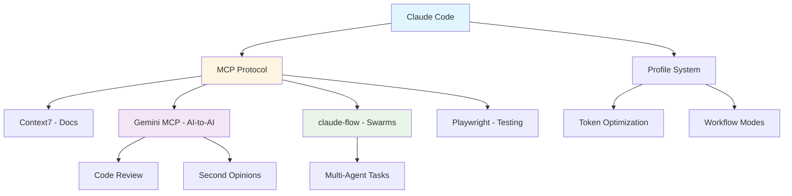

# AI & MCP Integration

**Integrating AI agents, MCP servers, and multi-agent workflows with Claude Code**

---

## About This Series

This series documents production-ready patterns for integrating AI tools, Model Context Protocol (MCP) servers, and multi-agent orchestration into development workflows. Based on real implementations running in production.

### Topics Covered



| Topic | Focus | Use Cases |
|-------|-------|-----------|
| **MCP Integration** | Tool connectivity | Library docs, browser testing, AI coordination |
| **Token Management** | Context efficiency | Profile-based loading, budget optimization |
| **Multi-Agent** | Swarm orchestration | Complex tasks, parallel execution |
| **AI-to-AI** | Model collaboration | Code review, second opinions, debates |

---

## Current Posts

### 1. [Claude Code Profiles: Optimizing Token Usage](/blog/2025/11/29/claude-code-profiles-architecture/)

Profile-based MCP loading architecture that optimizes token usage while maintaining full capabilities when needed.

**Key Topics**:
- Token budget management (~2k to ~60k profiles)
- Profile configurations (minimal, design, testing, orchestration, pro)
- Unified vs split workflow architecture
- Shell aliases for quick access

**Tags**: `claude-code` `mcp` `ai-agents` `context-management` `prompt-engineering`

---

### 2. [Building a Gemini MCP Server](/blog/2025/11/29/building-gemini-mcp-server/)

Architecture and implementation of a production MCP server wrapping Google's Gemini CLI for AI-to-AI collaboration.

**Key Topics**:
- Tool consolidation (44 → 5 tools, 93% token reduction)
- Docker containerization with HTTP transport
- OAuth authentication strategy
- Streaming for long operations
- AI debate capabilities

**Tags**: `claude-code` `mcp` `gemini` `ai-agents` `docker` `automation`

---

### 3. [Multi-Agent AI Workflows with claude-flow](/blog/2025/11/29/claude-flow-multi-agent-workflows/)

Orchestrated multi-agent swarms within Claude Code for complex task decomposition and parallel execution.

**Key Topics**:
- Swarm architecture and coordination
- Profile-based swarm launcher
- Self-healing wrapper scripts
- When to use swarms vs direct execution
- Resource management and efficiency

**Tags**: `claude-code` `mcp` `ai-agents` `multi-agent` `swarm` `automation`

---

## Architecture Overview

### MCP Server Ecosystem

```
┌─────────────────────────────────────────────────────────────────┐
│                     Claude Code                                  │
│                         │                                        │
│                         ▼                                        │
│              ┌─────────────────────┐                            │
│              │    MCP Protocol     │                            │
│              └─────────────────────┘                            │
│                         │                                        │
│    ┌────────────────────┼────────────────────┐                  │
│    │                    │                    │                  │
│    ▼                    ▼                    ▼                  │
│ ┌──────────┐     ┌──────────┐        ┌──────────┐             │
│ │ Context7 │     │ Gemini   │        │ claude-  │             │
│ │  (Docs)  │     │   MCP    │        │   flow   │             │
│ └──────────┘     └──────────┘        └──────────┘             │
│     │                 │                    │                    │
│     ▼                 ▼                    ▼                    │
│  Library          AI-to-AI            Multi-Agent              │
│   Docs            Collab               Swarms                   │
└─────────────────────────────────────────────────────────────────┘
```

### Token Budget by Profile

| Profile | Token Cost | MCP Servers | Use Case |
|---------|-----------|-------------|----------|
| `minimal` | ~2k | context7 | Quick fixes, debugging |
| `design` | ~5k | + magic | UI development |
| `testing` | ~16k | + playwright | E2E testing |
| `orchestration` | ~57k | + claude-flow | Multi-agent swarms |
| `pro` | ~60k | Full stack | Complex workflows |

---

## Future Content

Planned additions to this series:

- [ ] **Qdrant Knowledge Base Integration** - Semantic memory and RAG
- [ ] **Custom MCP Server Development** - Building your own MCP tools
- [ ] **AI Code Review Patterns** - Structured multi-model review workflows
- [ ] **Production MCP Deployment** - Docker, Kubernetes, monitoring

---

## Quick Start

### Install Claude Code Profiles

```bash
# Create profile directory
mkdir -p ~/.config/claude-profiles

# Minimal profile (recommended starting point)
cat > ~/.config/claude-profiles/minimal.json << 'EOF'
{
  "mcpServers": {
    "context7": {
      "type": "stdio",
      "command": "npx",
      "args": ["-y", "@upstash/context7-mcp@latest"]
    }
  }
}
EOF

# Add shell alias
echo 'alias claude-minimal="claude --mcp-config ~/.config/claude-profiles/minimal.json"' >> ~/.zshrc
source ~/.zshrc
```

### Use a Profile

```bash
# Start Claude Code with minimal profile
claude-minimal

# Or with full capabilities
claude-pro
```

---

## Related Resources

- [Model Context Protocol Specification](https://modelcontextprotocol.io)
- [Claude Code Documentation](https://docs.anthropic.com/claude-code)
- [claude-flow GitHub](https://github.com/ruvnet/claude-flow)
- [Gemini CLI GitHub](https://github.com/google-gemini/gemini-cli)

---

**Last Updated**: 2025-11-29
**Series Status**: Active (3 posts published)
**Total Posts**: 3
