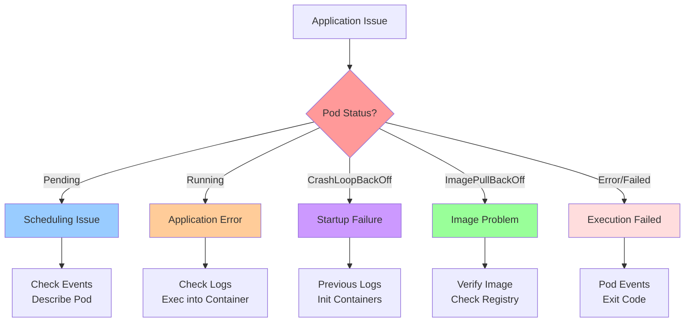
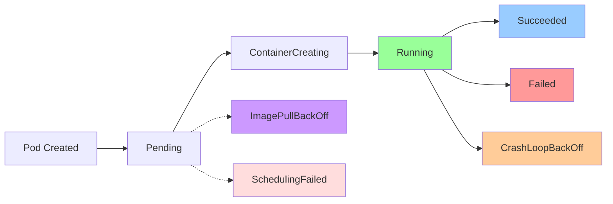
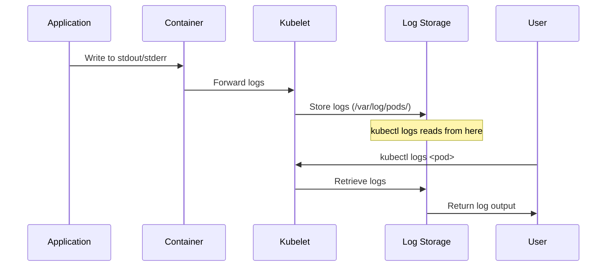
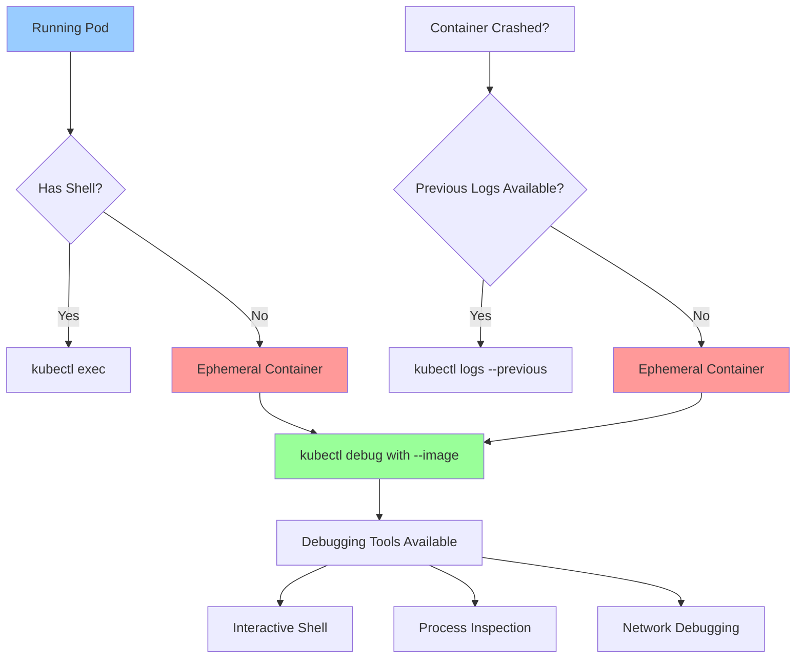
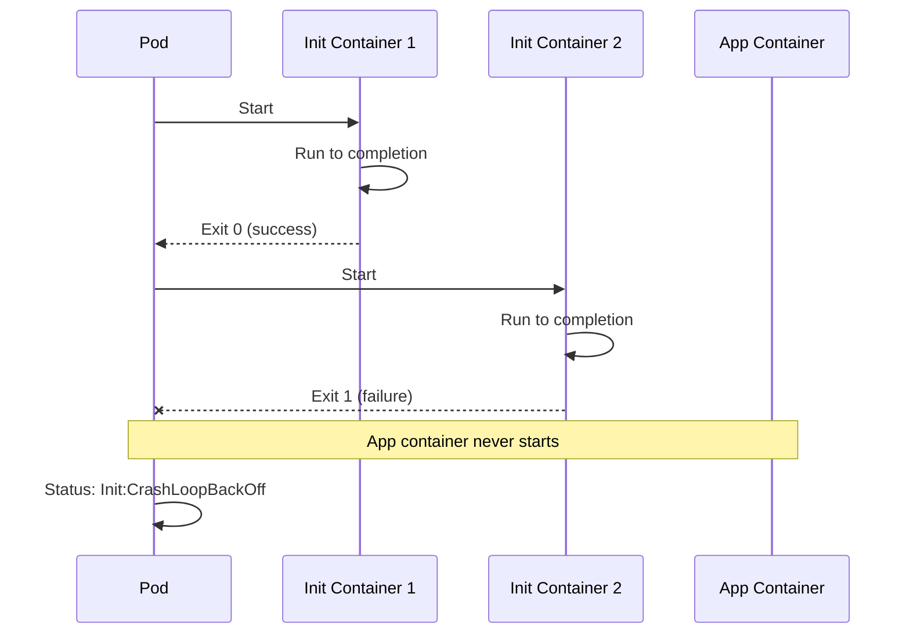

---
date:
  created: 2025-11-11
authors:
  - alf
categories:
  - Kubernetes
  - Troubleshooting
tags:
  - kubernetes
  - k8s
  - cka-prep
  - troubleshooting
  - logs
  - debugging
readtime: 13
slug: application-troubleshooting-log-analysis
---

# Kubernetes Application Troubleshooting and Log Analysis

Master pod-level debugging, container log analysis, kubectl exec techniques, and ephemeral containers - essential skills for resolving application issues in the CKA exam's highest-weighted troubleshooting domain.

<!-- more -->

## Overview

**Application troubleshooting accounts for a significant portion of the 30% Troubleshooting domain** in the CKA exam. While cluster-level issues affect infrastructure, application-level problems are where developers and operators spend most of their time. This guide covers systematic approaches to diagnosing and resolving pod and container issues.



---

## Pod Lifecycle and Common States



### Pod Phase States

| Phase | Description | Common Causes |
|-------|-------------|---------------|
| **Pending** | Pod accepted but not running yet | Scheduling constraints, resource unavailable, image pull pending |
| **ContainerCreating** | Containers being created | Normal transition state, pulling images |
| **Running** | Pod bound to node, ≥1 container running | Normal operation |
| **Succeeded** | All containers terminated successfully | Completed jobs/batch tasks |
| **Failed** | All containers terminated, ≥1 failed | Application error, exit code ≠ 0 |
| **Unknown** | Pod state cannot be obtained | Node communication failure |

### Container State Reasons (Status field)

| Reason | Description | Resolution |
|--------|-------------|------------|
| **CrashLoopBackOff** | Container crashing repeatedly | Check logs, verify startup command, fix application bug |
| **ImagePullBackOff** | Cannot pull container image | Verify image name, check registry auth, fix imagePullSecrets |
| **CreateContainerConfigError** | Container config invalid | Check volumeMounts, secrets, configMaps exist |
| **InvalidImageName** | Image name format incorrect | Fix image: tag format |
| **ErrImagePull** | Initial image pull failed | Check network, registry availability |

---

## Pod Status Investigation

### Basic Pod Status Commands

```bash
# List pods with status
kubectl get pods
kubectl get pods -A  # All namespaces
kubectl get pods -o wide  # Include node and IP

# Watch pod status in real-time
kubectl get pods -w

# Filter by status
kubectl get pods --field-selector=status.phase=Pending
kubectl get pods --field-selector=status.phase=Failed
kubectl get pods -A | grep -v Running
```

**Example Output**:
```
NAME                    READY   STATUS             RESTARTS   AGE
nginx-deployment-abc    1/1     Running            0          5m
myapp-xyz               0/1     CrashLoopBackOff   5          2m
frontend-123            0/1     ImagePullBackOff   0          1m
backend-456             0/1     CreateContainerConfigError  0  30s
```

### Detailed Pod Inspection

```bash
# Detailed pod information
kubectl describe pod <pod-name>
kubectl describe pod <pod-name> -n <namespace>

# Get full pod YAML
kubectl get pod <pod-name> -o yaml
kubectl get pod <pod-name> -o json | jq .status

# Check pod events
kubectl get events --field-selector involvedObject.name=<pod-name>
kubectl get events -A --sort-by='.lastTimestamp'
```

---

## Container Logs Analysis



### kubectl logs Command

**Basic Log Retrieval**:
```bash
# Get logs from a pod
kubectl logs <pod-name>

# Get logs from specific container (multi-container pod)
kubectl logs <pod-name> -c <container-name>

# Get previous container logs (if container crashed)
kubectl logs <pod-name> --previous
kubectl logs <pod-name> -c <container-name> --previous

# Follow logs in real-time (like tail -f)
kubectl logs -f <pod-name>
kubectl logs -f <pod-name> -c <container-name>

# Get logs from all containers in pod
kubectl logs <pod-name> --all-containers=true

# Get logs with timestamps
kubectl logs <pod-name> --timestamps

# Get recent logs (last N lines)
kubectl logs <pod-name> --tail=50

# Get logs since specific time
kubectl logs <pod-name> --since=10m
kubectl logs <pod-name> --since=1h
kubectl logs <pod-name> --since-time=2025-11-11T10:00:00Z

# Limit log bytes returned
kubectl logs <pod-name> --limit-bytes=1024
```

**Log Filtering and Analysis**:
```bash
# Filter logs for errors
kubectl logs <pod-name> | grep -i error
kubectl logs <pod-name> | grep -E "error|exception|fail"

# Count error occurrences
kubectl logs <pod-name> | grep -c error

# Get logs from multiple pods (by label)
kubectl logs -l app=myapp
kubectl logs -l app=myapp --all-containers=true

# Export logs to file
kubectl logs <pod-name> > /tmp/pod-logs.txt
kubectl logs <pod-name> --previous > /tmp/crash-logs.txt
```

### Common Log Patterns

**Startup Issues**:
```
Failed to load configuration file: /etc/app/config.yaml
Error: listen tcp :8080: bind: address already in use
panic: runtime error: invalid memory address
```

**Connection Issues**:
```
dial tcp 10.96.0.1:443: i/o timeout
Failed to connect to database: connection refused
Cannot resolve host: mysql-service
```

**Permission Issues**:
```
mkdir /data: permission denied
Error: cannot open file /var/log/app.log: Permission denied
chown: changing ownership of '/data': Operation not permitted
```

---

## Interactive Container Debugging with kubectl exec

```bash
# Execute command in container
kubectl exec <pod-name> -- <command>
kubectl exec <pod-name> -c <container-name> -- <command>

# Interactive shell access
kubectl exec -it <pod-name> -- /bin/sh
kubectl exec -it <pod-name> -- /bin/bash
kubectl exec -it <pod-name> -c <container-name> -- sh

# Common debugging commands
kubectl exec <pod-name> -- ps aux
kubectl exec <pod-name> -- ls -la /app
kubectl exec <pod-name> -- cat /etc/resolv.conf
kubectl exec <pod-name> -- env
kubectl exec <pod-name> -- df -h
kubectl exec <pod-name> -- netstat -tulpn

# Test network connectivity
kubectl exec <pod-name> -- ping -c 3 google.com
kubectl exec <pod-name> -- curl http://service-name:8080
kubectl exec <pod-name> -- nslookup kubernetes.default

# Check running processes
kubectl exec <pod-name> -- ps aux | grep java
kubectl exec <pod-name> -- top -bn1 | head -20
```

**Interactive Debugging Session Example**:
```bash
# Start interactive shell
kubectl exec -it myapp-xyz -- /bin/sh

# Inside container:
/ # ps aux                        # Check processes
/ # ls -la /app                   # List app files
/ # cat /app/config.yaml          # Check config
/ # curl localhost:8080/health    # Test endpoint
/ # tail -f /var/log/app.log      # View logs
/ # exit                           # Exit shell
```

---

## Ephemeral Containers (Kubernetes v1.25+)

**Ephemeral containers** are temporary debug containers added to running pods - perfect for distroless images or crashed containers without shells.



### Using kubectl debug with Ephemeral Containers

**Basic Ephemeral Container Usage**:
```bash
# Add ephemeral debug container to running pod
kubectl debug -it <pod-name> --image=busybox:1.28 --target=<container-name>

# Common debug images
kubectl debug -it <pod-name> --image=busybox --target=<container-name>
kubectl debug -it <pod-name> --image=alpine --target=<container-name>
kubectl debug -it <pod-name> --image=ubuntu --target=<container-name>

# Debug container without target (separate namespaces)
kubectl debug -it <pod-name> --image=busybox

# Create debug container with custom name
kubectl debug -it <pod-name> --image=busybox --container=debugger

# List ephemeral containers in pod
kubectl get pod <pod-name> -o jsonpath='{.spec.ephemeralContainers}'
kubectl describe pod <pod-name> | grep -A 10 "Ephemeral Containers"
```

**Example: Debug Distroless Container**:
```bash
# Create minimal pod (pause container has no shell)
kubectl run ephemeral-demo --image=registry.k8s.io/pause:3.1 --restart=Never

# Try to exec (will fail)
kubectl exec -it ephemeral-demo -- sh
# Error: OCI runtime exec failed: exec: "sh": executable file not found in $PATH

# Add ephemeral debug container
kubectl debug -it ephemeral-demo --image=busybox:1.28 --target=ephemeral-demo

# Now you have a shell with debugging tools
/ # ps aux  # See processes from target container
/ # ls -la /proc/1/root/  # Access target container filesystem
```

### Debug by Copying Pod

**Create Pod Copy with Modifications**:
```bash
# Copy pod and change command
kubectl debug <pod-name> -it --copy-to=<new-pod-name> --container=<container-name> -- sh

# Copy pod and change image
kubectl debug <pod-name> --copy-to=<new-pod-name> --set-image=*=ubuntu

# Copy pod with specific image per container
kubectl debug <pod-name> --copy-to=<new-pod-name> --set-image=app=myapp:debug,sidecar=sidecar:debug
```

**Example: Debug CrashLoopBackOff**:
```bash
# Pod crashing immediately
kubectl run myapp --image=busybox:1.28 -- false

# Check status
kubectl get pod myapp
# NAME    READY   STATUS             RESTARTS   AGE
# myapp   0/1     CrashLoopBackOff   3          1m

# Create debug copy with shell
kubectl debug myapp -it --copy-to=myapp-debug --container=myapp -- sh

# Now in debug pod with working shell
/ # ls -la
/ # env
/ # ps aux
```

---

## Troubleshooting Common Issues

### CrashLoopBackOff

**CrashLoopBackOff** means container starts, crashes, Kubernetes restarts it, crashes again - exponential backoff.

```mermaid
graph LR
    A[Container Starts] --> B[Crashes]
    B --> C[Wait 0s]
    C --> D[Restart 1]
    D --> B2[Crashes]
    B2 --> C2[Wait 10s]
    C2 --> D2[Restart 2]
    D2 --> B3[Crashes]
    B3 --> C3[Wait 20s]
    C3 --> D3[Restart 3]
    D3 --> B4[Crashes]
    B4 --> C4[Wait 40s]
    C4 --> D4[...]

    style B fill:#ff9999
    style B2 fill:#ff9999
    style B3 fill:#ff9999
    style B4 fill:#ff9999
```



**Troubleshooting Steps**:
```bash
# 1. Check current pod status
kubectl get pod <pod-name>
kubectl describe pod <pod-name>

# 2. Check logs from crashed container
kubectl logs <pod-name> --previous

# 3. Check for common issues in describe output
kubectl describe pod <pod-name> | grep -A 10 "Events:"

# 4. Check container exit code
kubectl get pod <pod-name> -o jsonpath='{.status.containerStatuses[0].lastState.terminated}'

# 5. Verify container command and args
kubectl get pod <pod-name> -o jsonpath='{.spec.containers[0].command}'
kubectl get pod <pod-name> -o jsonpath='{.spec.containers[0].args}'
```

**Common Causes**:

| Exit Code | Meaning | Common Cause |
|-----------|---------|--------------|
| **0** | Success | Normal termination (check if container should keep running) |
| **1** | Application Error | Bug in code, unhandled exception |
| **2** | Misuse of Shell Builtin | Command syntax error |
| **126** | Command Cannot Execute | Permission problem, not executable |
| **127** | Command Not Found | Typo in command, binary not in PATH |
| **137** | SIGKILL | OOMKilled (out of memory), forceful termination |
| **139** | SIGSEGV | Segmentation fault (memory access violation) |
| **143** | SIGTERM | Graceful termination requested |

**Example: Fix CrashLoopBackOff**:
```bash
# Pod crashing with exit code 127
kubectl logs myapp --previous
# Output: /bin/myapp: not found

# Check container definition
kubectl get pod myapp -o yaml | grep -A 5 "command:"
# command:
# - /bin/myapp  # Wrong path

# Fix: Update deployment with correct path
kubectl edit deployment myapp
# Change command: ["/bin/myapp"] to command: ["/usr/local/bin/myapp"]

# Verify fix
kubectl get pods
# myapp-new-xyz   1/1     Running   0   10s
```

### ImagePullBackOff

**ImagePullBackOff** occurs when Kubernetes cannot pull the container image.

**Troubleshooting Steps**:
```bash
# 1. Check pod events
kubectl describe pod <pod-name> | grep -A 5 "Events:"
# Events:
#   Failed    ErrImagePull        Failed to pull image "myapp:v2": rpc error: code = Unknown desc = Error response from daemon: pull access denied

# 2. Verify image name and tag
kubectl get pod <pod-name> -o jsonpath='{.spec.containers[0].image}'

# 3. Check imagePullSecrets
kubectl get pod <pod-name> -o jsonpath='{.spec.imagePullSecrets}'

# 4. Test image pull manually (on node)
ssh <node>
sudo crictl pull <image-name>

# 5. Check secret exists
kubectl get secrets
kubectl describe secret <image-pull-secret>
```

**Common Causes**:
- **Image doesn't exist**: Typo in image name or tag
- **Registry authentication**: Missing or incorrect imagePullSecret
- **Private registry**: Need to create imagePullSecret
- **Network issue**: Registry unreachable from cluster
- **Rate limiting**: Docker Hub rate limits exceeded

**Fix: Create imagePullSecret**:
```bash
# Create Docker registry secret
kubectl create secret docker-registry regcred \
  --docker-server=<registry-url> \
  --docker-username=<username> \
  --docker-password=<password> \
  --docker-email=<email>

# Add to pod spec
apiVersion: v1
kind: Pod
metadata:
  name: myapp
spec:
  containers:
  - name: app
    image: private-registry.com/myapp:v1
  imagePullSecrets:
  - name: regcred
```

### CreateContainerConfigError

**CreateContainerConfigError** indicates invalid container configuration.

**Common Causes**:
```bash
# 1. Check for missing ConfigMaps
kubectl describe pod <pod-name> | grep -i configmap
# configmap "app-config" not found

# Verify ConfigMap exists
kubectl get configmaps
kubectl get configmap app-config

# 2. Check for missing Secrets
kubectl describe pod <pod-name> | grep -i secret
# secret "db-password" not found

# Verify Secret exists
kubectl get secrets
kubectl get secret db-password

# 3. Check volume mounts
kubectl get pod <pod-name> -o yaml | grep -A 10 volumeMounts
```

---

## Event Analysis

**Events provide timeline of pod lifecycle actions** - critical for troubleshooting.

```bash
# Get events for specific pod
kubectl get events --field-selector involvedObject.name=<pod-name>

# Get events for namespace
kubectl get events -n <namespace>

# Get all events sorted by time
kubectl get events -A --sort-by='.lastTimestamp'

# Watch events in real-time
kubectl get events -w

# Filter events by type
kubectl get events --field-selector type=Warning
kubectl get events --field-selector type=Normal

# Get events in wide format
kubectl get events -o wide
```

**Example Event Output**:
```
LAST SEEN   TYPE      REASON              OBJECT              MESSAGE
2m          Warning   Failed              pod/myapp-xyz       Error: ImagePullBackOff
2m          Normal    Pulling             pod/myapp-xyz       Pulling image "myapp:v2"
3m          Normal    Scheduled           pod/myapp-xyz       Successfully assigned default/myapp-xyz to node-1
5m          Warning   FailedScheduling    pod/myapp-xyz       0/3 nodes available: insufficient memory
```

---

## Init Container Troubleshooting

**Init containers** run before app containers - often used for setup tasks.



**Debug Init Containers**:
```bash
# Check init container status
kubectl get pod <pod-name> -o jsonpath='{.status.initContainerStatuses}'

# Get init container logs
kubectl logs <pod-name> -c <init-container-name>
kubectl logs <pod-name> -c <init-container-name> --previous

# Describe pod to see init container events
kubectl describe pod <pod-name>
# Init Containers:
#   init-db:
#     State:      Terminated
#       Reason:   Error
#       Exit Code:  1
```

**Example Init Container Failure**:
```yaml
apiVersion: v1
kind: Pod
metadata:
  name: myapp
spec:
  initContainers:
  - name: init-db
    image: busybox:1.28
    command: ['sh', '-c', 'until nslookup mydb; do echo waiting for mydb; sleep 2; done;']
  containers:
  - name: app
    image: myapp:v1
```

```bash
# Check status
kubectl get pod myapp
# NAME    READY   STATUS     RESTARTS   AGE
# myapp   0/1     Init:0/1   0          1m

# Check init logs
kubectl logs myapp -c init-db
# waiting for mydb
# waiting for mydb
# Server:    10.96.0.10
# Address 1: 10.96.0.10 kube-dns.kube-system.svc.cluster.local
# nslookup: can't resolve 'mydb'
```

---

## Multi-Container Pod Troubleshooting

**Multi-container pods** share network and storage - common patterns: sidecar, adapter, ambassador.

```bash
# List all containers in pod
kubectl get pod <pod-name> -o jsonpath='{.spec.containers[*].name}'

# Check status of each container
kubectl get pod <pod-name> -o jsonpath='{.status.containerStatuses[*].name}'

# Get logs from specific container
kubectl logs <pod-name> -c <container-name>

# Exec into specific container
kubectl exec -it <pod-name> -c <container-name> -- sh

# Check which container is failing
kubectl get pod <pod-name> -o json | jq '.status.containerStatuses[] | select(.ready==false)'
```

---

## CKA Exam Practice Exercises

### Exercise 1: Debug CrashLoopBackOff Pod

**Scenario**: Pod `webapp-abc` is in CrashLoopBackOff state. Investigate and fix the issue.

<details>
<summary><strong>Solution</strong></summary>

```bash
# 1. Check pod status
kubectl get pod webapp-abc
# NAME         READY   STATUS             RESTARTS   AGE
# webapp-abc   0/1     CrashLoopBackOff   5          2m

# 2. Describe pod
kubectl describe pod webapp-abc
# Last State:     Terminated
#   Reason:       Error
#   Exit Code:    127

# 3. Check logs from crashed container
kubectl logs webapp-abc --previous
# /bin/webapp: not found

# 4. Check container command
kubectl get pod webapp-abc -o yaml | grep -A 5 command:
# command:
# - /bin/webapp

# 5. Create debug copy to investigate
kubectl debug webapp-abc -it --copy-to=webapp-debug --container=webapp -- sh

# Inside debug container
/ # ls /usr/local/bin/
# webapp  # Binary is here, not in /bin/

/ # exit

# 6. Fix the deployment
kubectl get deployment webapp -o yaml > webapp-deploy.yaml

# Edit webapp-deploy.yaml:
# Change: command: ["/bin/webapp"]
# To: command: ["/usr/local/bin/webapp"]

kubectl apply -f webapp-deploy.yaml

# 7. Delete old pod (deployment will recreate)
kubectl delete pod webapp-abc

# 8. Verify fix
kubectl get pods | grep webapp
# webapp-xyz   1/1     Running   0   10s

kubectl logs webapp-xyz
# Server started on port 8080
```

**Key Takeaways**:
- Exit code 127 = command not found
- Use `--previous` flag for crashed container logs
- `kubectl debug --copy-to` allows interactive investigation
- Fix deployment, not individual pod

</details>

---

### Exercise 2: Troubleshoot ImagePullBackOff

**Scenario**: Pod `frontend-123` cannot pull image from private registry. Fix the image pull issue.

<details>
<summary><strong>Solution</strong></summary>

```bash
# 1. Check pod status
kubectl get pod frontend-123
# NAME           READY   STATUS             RESTARTS   AGE
# frontend-123   0/1     ImagePullBackOff   0          1m

# 2. Describe pod to see error
kubectl describe pod frontend-123
# Events:
#   Failed     ErrImagePull    Failed to pull image "private-registry.com/frontend:v2"
#   Failed     ImagePullBackOff  Back-off pulling image

# 3. Check current imagePullSecrets
kubectl get pod frontend-123 -o jsonpath='{.spec.imagePullSecrets}'
# []  (empty - no secret configured)

# 4. Check if image pull secret exists
kubectl get secrets | grep registry
# (no results)

# 5. Create docker registry secret
kubectl create secret docker-registry private-registry-cred \
  --docker-server=private-registry.com \
  --docker-username=myuser \
  --docker-password=mypassword \
  --docker-email=user@example.com

# Verify secret created
kubectl get secret private-registry-cred
# NAME                      TYPE                             DATA   AGE
# private-registry-cred     kubernetes.io/dockerconfigjson   1      5s

# 6. Patch deployment to add imagePullSecrets
kubectl get deployment frontend -o yaml > frontend-deploy.yaml

# Add to pod spec:
#   imagePullSecrets:
#   - name: private-registry-cred

kubectl apply -f frontend-deploy.yaml

# 7. Delete old pod (deployment will recreate with secret)
kubectl delete pod frontend-123

# 8. Verify new pod pulls image successfully
kubectl get pods | grep frontend
# frontend-xyz   1/1     Running   0   20s

kubectl describe pod frontend-xyz | grep -A 5 "Events:"
# Events:
#   Normal  Pulling    Successfully pulled image "private-registry.com/frontend:v2"
#   Normal  Started    Started container frontend
```

**Key Takeaways**:
- ImagePullBackOff usually means authentication issue
- Create secret: `kubectl create secret docker-registry`
- Add `imagePullSecrets` to pod spec
- Apply changes to deployment, not pod directly

</details>

---

### Exercise 3: Debug Init Container Failure

**Scenario**: Pod `myapp-xyz` stuck in Init:CrashLoopBackOff. The init container is failing. Investigate and fix.

<details>
<summary><strong>Solution</strong></summary>

```bash
# 1. Check pod status
kubectl get pod myapp-xyz
# NAME        READY   STATUS                  RESTARTS   AGE
# myapp-xyz   0/1     Init:CrashLoopBackOff   3          2m

# 2. Describe pod
kubectl describe pod myapp-xyz
# Init Containers:
#   init-db:
#     State:      Waiting
#       Reason:   CrashLoopBackOff
#     Last State: Terminated
#       Reason:   Error
#       Exit Code:    1

# 3. List init containers
kubectl get pod myapp-xyz -o jsonpath='{.spec.initContainers[*].name}'
# init-db

# 4. Check init container logs
kubectl logs myapp-xyz -c init-db
# waiting for mydb-service
# nslookup: can't resolve 'mydb-service'
# waiting for mydb-service
# nslookup: can't resolve 'mydb-service'

# 5. Check if service exists
kubectl get svc | grep mydb
# (no results - service doesn't exist!)

# 6. Check deployment YAML
kubectl get deployment myapp -o yaml | grep -A 10 initContainers:
# initContainers:
# - name: init-db
#   image: busybox:1.28
#   command: ['sh', '-c', 'until nslookup mydb-service; do echo waiting for mydb-service; sleep 2; done;']

# 7. Verify database service name
kubectl get svc -A | grep -i db
# database    mysql-db   ClusterIP   10.96.5.10   <none>   3306/TCP   5m

# Service is named "mysql-db", not "mydb-service"!

# 8. Fix deployment
kubectl get deployment myapp -o yaml > myapp-deploy.yaml

# Edit myapp-deploy.yaml:
# Change: nslookup mydb-service
# To: nslookup mysql-db

kubectl apply -f myapp-deploy.yaml

# 9. Delete old pod
kubectl delete pod myapp-xyz

# 10. Verify new pod starts successfully
kubectl get pods | grep myapp
# myapp-abc   1/1     Running   0   15s

kubectl logs myapp-abc -c init-db
# waiting for mysql-db
# Server:    10.96.0.10
# Address 1: 10.96.0.10 kube-dns.kube-system.svc.cluster.local
# Name:      mysql-db
# Address 1: 10.96.5.10 mysql-db.database.svc.cluster.local
# (init container succeeded!)
```

**Key Takeaways**:
- Use `-c <init-container-name>` to view init logs
- Init containers must succeed before app containers start
- Verify service names match what init containers expect
- `nslookup` or `curl` are common init container checks

</details>

---

### Exercise 4: Use Ephemeral Containers for Debugging

**Scenario**: Pod `distroless-app` is running a distroless image with no shell. Debug the application using ephemeral containers.

<details>
<summary><strong>Solution</strong></summary>

```bash
# 1. Check pod status
kubectl get pod distroless-app
# NAME             READY   STATUS    RESTARTS   AGE
# distroless-app   1/1     Running   0          5m

# 2. Try to exec (will fail - no shell)
kubectl exec -it distroless-app -- sh
# OCI runtime exec failed: exec: "sh": executable file not found in $PATH

# 3. Add ephemeral debug container
kubectl debug -it distroless-app --image=busybox:1.28 --target=distroless-app

# Output:
# Targeting container "distroless-app". If you don't see processes from this container it may be because the container runtime doesn't support this feature.
# Defaulting debug container name to debugger-xyz.
# If you don't see a command prompt, try pressing enter.

# 4. Now in ephemeral container with busybox tools
/ # ps aux
# PID   USER     TIME  COMMAND
#     1 root      0:00 /app/distroless-binary
#    15 root      0:00 sh

# 5. Inspect application files (target container's filesystem)
/ # ls -la /proc/1/root/
# (shows files from distroless-app container)

/ # ls -la /proc/1/root/app/
# total 12345
# -rwxr-xr-x    1 root     root      12345678 Nov 11 12:00 distroless-binary
# -rw-r--r--    1 root     root           256 Nov 11 12:00 config.yaml

# 6. Check network connectivity
/ # netstat -tulpn
/ # ping -c 3 google.com

# 7. View environment variables from target container
/ # cat /proc/1/environ | tr '\0' '\n'
# PATH=/usr/local/sbin:/usr/local/bin:/usr/sbin:/usr/bin:/sbin:/bin
# APP_PORT=8080
# DB_HOST=mysql-db

# 8. Test application endpoint
/ # wget -qO- http://localhost:8080/health
# {"status":"healthy"}

# 9. Exit ephemeral container
/ # exit

# 10. Verify ephemeral container was added
kubectl get pod distroless-app -o jsonpath='{.spec.ephemeralContainers[*].name}'
# debugger-xyz

kubectl describe pod distroless-app | grep -A 10 "Ephemeral Containers:"
# Ephemeral Containers:
#   debugger-xyz:
#     Container ID:  containerd://abc123...
#     Image:         busybox:1.28
#     State:         Terminated
```

**Key Takeaways**:
- Ephemeral containers solve "no shell" problem in minimal images
- `--target=<container>` shares process namespace (see target's processes)
- Access target's filesystem via `/proc/1/root/`
- Ephemeral containers persist until pod deletion

</details>

---

### Exercise 5: Multi-Container Pod Troubleshooting

**Scenario**: Pod `app-with-sidecar` has 2 containers: `app` (main) and `log-shipper` (sidecar). Pod shows READY 1/2. Determine which container is failing and fix it.

<details>
<summary><strong>Solution</strong></summary>

```bash
# 1. Check pod status
kubectl get pod app-with-sidecar
# NAME               READY   STATUS    RESTARTS   AGE
# app-with-sidecar   1/2     Running   0          2m

# READY 1/2 means one container is not ready

# 2. Describe pod to identify failing container
kubectl describe pod app-with-sidecar
# Containers:
#   app:
#     State:          Running
#     Ready:          True
#   log-shipper:
#     State:          Running
#     Ready:          False
#     Reason:         Unhealthy

# log-shipper is not ready!

# 3. Check log-shipper logs
kubectl logs app-with-sidecar -c log-shipper
# Error: cannot open file /var/log/app/application.log: No such file or directory
# Retrying in 5 seconds...

# 4. Check shared volume mounts
kubectl get pod app-with-sidecar -o yaml | grep -A 20 volumeMounts:
# app container:
#   volumeMounts:
#   - mountPath: /var/log/myapp
#     name: log-volume
#
# log-shipper container:
#   volumeMounts:
#   - mountPath: /var/log/app
#     name: log-volume

# Issue: app writes to /var/log/myapp but log-shipper reads from /var/log/app

# 5. Check readiness probe
kubectl get pod app-with-sidecar -o yaml | grep -A 5 "readinessProbe:"
#     readinessProbe:
#       exec:
#         command:
#         - cat
#         - /var/log/app/application.log

# Readiness probe fails because file doesn't exist at expected path

# 6. Fix deployment - align volume mount paths
kubectl get deployment app-with-sidecar -o yaml > app-deploy.yaml

# Edit app-deploy.yaml:
# Change log-shipper volumeMount:
#   - mountPath: /var/log/app  # Old
#   - mountPath: /var/log/myapp  # New (match app container)

kubectl apply -f app-deploy.yaml

# 7. Delete old pod
kubectl delete pod app-with-sidecar

# 8. Verify new pod has both containers ready
kubectl get pods | grep app-with-sidecar
# app-with-sidecar   2/2     Running   0   20s

# 9. Verify log-shipper is working
kubectl logs app-with-sidecar -c log-shipper
# Shipping logs from /var/log/myapp/application.log
# Successfully connected to log aggregator

# 10. Verify both containers are ready
kubectl get pod app-with-sidecar -o jsonpath='{range .status.containerStatuses[*]}{.name}{"\t"}{.ready}{"\n"}{end}'
# app            true
# log-shipper    true
```

**Key Takeaways**:
- READY x/y indicates container readiness (x ready out of y total)
- Use `-c <container-name>` to target specific container
- Volume mount paths must align between containers sharing volumes
- Readiness probes determine READY status

</details>

---

## Quick Reference Commands

### Log Analysis
```bash
kubectl logs <pod> [-c <container>]         # Get logs
kubectl logs <pod> --previous               # Previous crashed logs
kubectl logs <pod> -f                       # Follow logs
kubectl logs <pod> --tail=50                # Last 50 lines
kubectl logs <pod> --since=10m              # Logs from last 10 min
kubectl logs <pod> --timestamps             # Include timestamps
```

### Interactive Debugging
```bash
kubectl exec <pod> -- <command>             # Execute command
kubectl exec -it <pod> -- sh                # Interactive shell
kubectl debug <pod> --image=busybox --target=<container>  # Ephemeral container
kubectl debug <pod> --copy-to=<new> --set-image=*=debug   # Copy with debug image
```

### Status Investigation
```bash
kubectl get pods                            # List pod status
kubectl describe pod <pod>                  # Detailed pod info
kubectl get events --field-selector involvedObject.name=<pod>  # Pod events
kubectl get pod <pod> -o yaml               # Full pod YAML
```

---

## Related Resources

- **[Troubleshooting Clusters, Nodes, and Components](../2025/11/11/troubleshooting-clusters-nodes-components/)** - Cluster-level debugging
- **[Pods: The Atomic Unit](../2025/11/11/kubernetes-pods-atomic-unit/)** - Understanding pod lifecycle
- **[kubectl Essentials](../2025/11/11/kubectl-essentials/)** - Master debugging commands

---

## Summary

**Application troubleshooting is systematic and methodical** - always start with pod status, check events, analyze logs, then move to interactive debugging if needed. Master these techniques to confidently tackle pod-level issues in the CKA exam's Troubleshooting domain (30%).

**Key Takeaways**:
- ✅ **Pod Status** → Start with `kubectl get pods`, then `kubectl describe pod`
- ✅ **Logs** → Use `kubectl logs`, add `--previous` for crashed containers
- ✅ **Events** → Check `kubectl get events` for timeline of issues
- ✅ **Interactive Debug** → `kubectl exec` for shell access, `kubectl debug` for ephemeral containers
- ✅ **Common Issues** → CrashLoopBackOff (check exit codes), ImagePullBackOff (check secrets), Init failures (check logs)

Next: **[Monitoring, Metrics, and Resource Management](#)** - Metrics Server, HPA, VPA, and observability
