---
date:
  created: 2025-12-24
authors:
  - alf
categories:
  - Architecture
  - Infrastructure
tags:
  - home-lab
  - microservices
  - machine-learning
  - trading
  - real-time
  - docker
  - architecture
  - monitoring
  - rust
  - aws
  - terraform
  - tpu
  - kaggle
  - mamba
slug: building-home-lab-trading-system
readtime: 25
social_image: assets/images/blog/AWS_ML_BTC_Trading.jpg
---

# Building a Home Lab Trading System: Architecture of a Personal Market Intelligence Platform

A deep dive into the architecture of a personal cryptocurrency market intelligence system built for a home lab environment. This post explores the design decisions, technical challenges, and lessons learned from building a real-time data processing pipeline that combines microservices, machine learning, and cloud-hybrid execution.

<!-- more -->

## The Vision: Personal Market Intelligence

The cryptocurrency market operates 24/7, generating millions of data points per day. Professional trading firms spend millions on infrastructure to process this data in real-time. But what if you could build a sophisticated market intelligence system in your own home lab?

This project, which I've been developing over the past several months, attempts to answer that question. The goal wasn't to build a "get rich quick" trading bot, but rather to create a comprehensive platform for:

- **Real-time market data ingestion** from multiple exchanges
- **Signal processing** with 60+ technical and microstructure indicators
- **Machine learning inference** for market regime detection
- **Risk management** with position sizing and circuit breakers
- **Full observability** through monitoring and alerting

## High-Level Architecture

The system follows a microservices architecture pattern, running entirely in Docker containers on a single home server with a dedicated GPU for ML training.

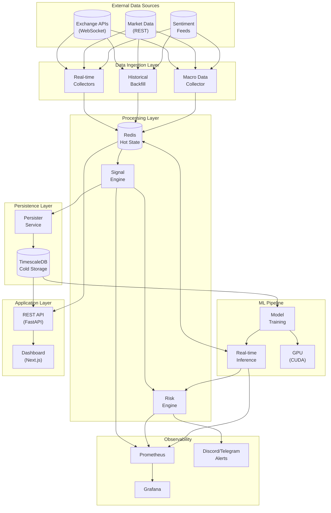

## The Data Ingestion Challenge

### Real-time WebSocket Streams

The first challenge was reliably ingesting real-time market data. Exchange WebSocket APIs provide tick-by-tick trade data, order book snapshots, and other market microstructure information.

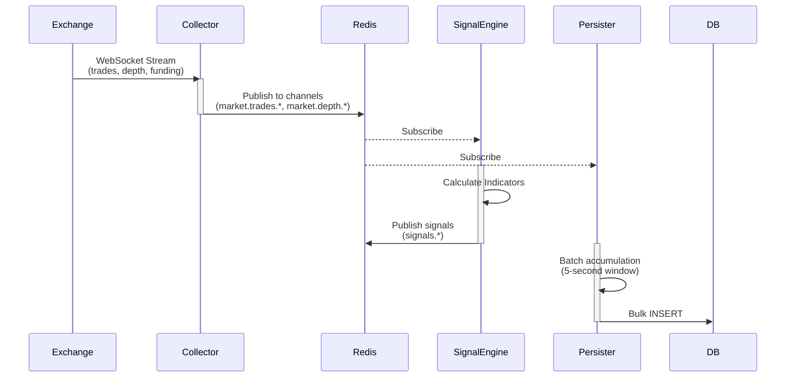

Key design decisions for the ingestion layer:

1. **Redis as the event bus**: All real-time data flows through Redis Pub/Sub channels, decoupling producers from consumers
2. **Batch persistence**: Rather than writing every tick to the database, the persister accumulates data in 5-second windows before bulk inserting
3. **Automatic reconnection**: Collectors implement exponential backoff and automatic reconnection when WebSocket connections drop
4. **Gap detection**: A separate health monitor detects data gaps and triggers backfill jobs

### Historical Data Management

For machine learning, you need historical data - lots of it. The system maintains several years of minute-level price data, along with derived signals.

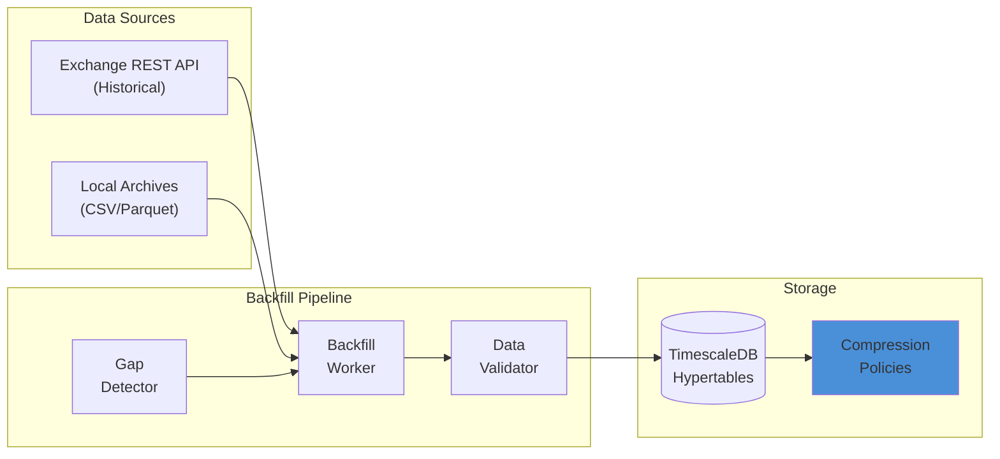

TimescaleDB's hypertables and compression policies are essential here - without compression, several years of minute-level data would consume hundreds of gigabytes.

## The Signal Processing Engine

The heart of the system is the signal processing engine, which calculates 60+ indicators in real-time.

### Signal Categories

The signals are organized into functional categories:

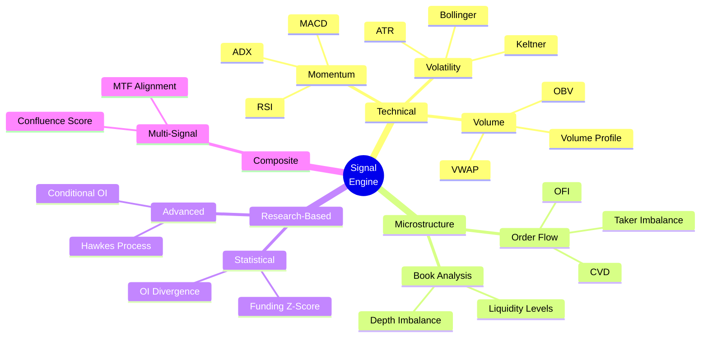

### The Base Signal Pattern

Each signal inherits from a base class that provides:

- Standardized calculation interface
- Hyperparameter registration for optimization
- Redis caching for intermediate results
- Metrics exposure for monitoring

```python
# Conceptual pattern (simplified)
class Signal:
    def __init__(self):
        self.hyperparameters = []

    def register_hyperparameters(self):
        """Define tunable parameters"""
        pass

    async def calculate(self, df: pd.DataFrame) -> float:
        """Core calculation logic"""
        raise NotImplementedError
```

### Multi-Timeframe Analysis

One of the more interesting patterns is multi-timeframe (MTF) confluence detection. The system calculates signals across multiple timeframes and looks for alignment:

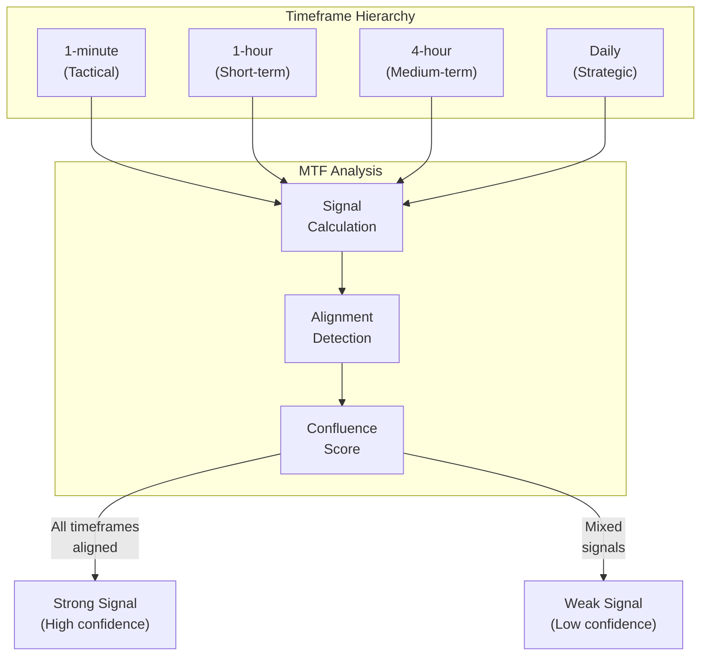

## The ML Pipeline

### Architecture

The ML pipeline uses modern time-series forecasting techniques to predict market direction and volatility regimes.

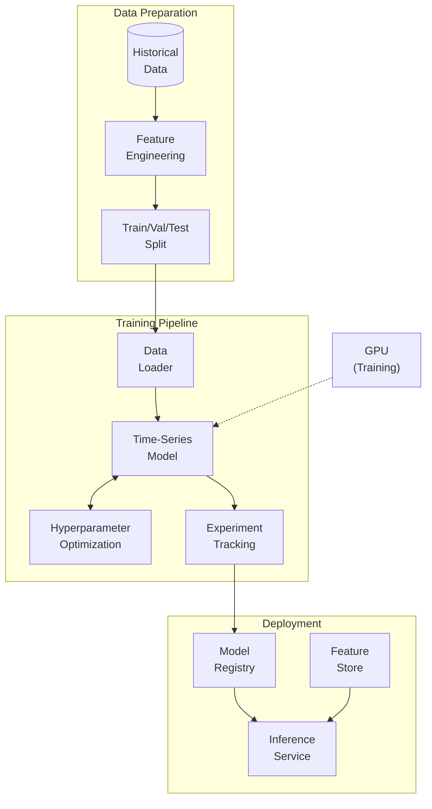

### Feature Engineering

The feature engineering pipeline transforms raw market data and signals into model-ready features:

| Feature Type | Examples | Purpose |
|-------------|----------|---------|
| **Time-varying known** | Hour of day, day of week, minutes to funding | Temporal patterns |
| **Time-varying unknown** | Price, volume, signals | Core predictive features |
| **Static** | Average daily volume, historical volatility | Per-asset characteristics |

### Training Infrastructure

Training runs on a dedicated GPU in the home lab. The system uses:

- **Experiment tracking** for comparing model versions
- **Hyperparameter optimization** with Bayesian search
- **Model versioning** for rollback capability

### TPU Training on Kaggle: The Cloud Factory Pattern

For computationally intensive experiments, the home GPU isn't always enough. The project leverages **Kaggle's free TPU v5e** (8-core) for training cutting-edge architectures that would take days on a single GPU.

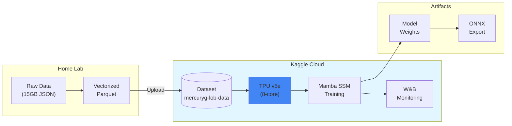

The **"Cloud Factory" pattern** works as follows:

1. **Local preprocessing**: Convert 15GB of raw order book JSON to 42 vectorized Parquet files (4.2M snapshots)
2. **Upload to Kaggle**: The processed dataset becomes a reusable Kaggle dataset
3. **TPU training**: Run training kernels on TPU v5e with `torch_xla`
4. **Live monitoring**: Weights & Biases tracks loss curves and metrics
5. **Download weights**: Retrieve the trained model for local ONNX conversion

### The Mamba State Space Model

The latest experiments use **Mamba**, a state-space model architecture that's particularly well-suited for sequential financial data:

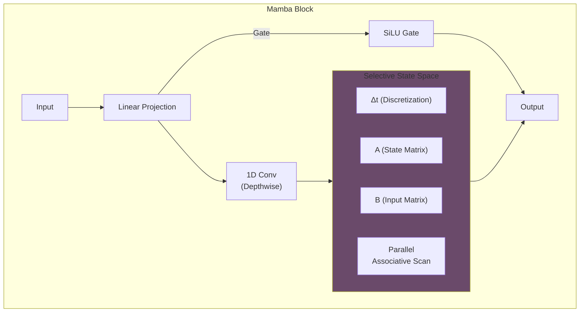

**Why Mamba for trading?**

| Property | Benefit for Trading |
|----------|---------------------|
| **Linear complexity** | O(L) vs O(L²) for Transformers - handles long sequences |
| **Selective state** | Learns which past information to retain or forget |
| **Hardware efficient** | Optimized for TPU/GPU with parallel scan algorithms |
| **Continuous-time** | Natural fit for irregularly-sampled tick data |

**TPU Optimizations:**

The training script includes several TPU-specific optimizations:

- **Parallel Associative Scan**: Hillis-Steele algorithm for O(log L) SSM computation
- **XLA compilation**: `torch_xla` with PJRT runtime for TPU VM
- **RMSNorm**: More stable than LayerNorm on TPU at scale
- **Zero-allocation loops**: Pre-allocated buffers to avoid XLA recompilation

```python
# Hillis-Steele parallel scan (simplified)
def parallel_scan_mamba(dA, dB, x):
    """Autograd-safe parallel scan for TPU."""
    i = 1
    while i < seq_len:
        # Recursive doubling - no in-place ops for XLA
        new_b = dA[:, i:] * b[:, :-i] + b[:, i:]
        b = torch.cat([b[:, :i], new_b], dim=1)
        i *= 2
    return b
```

This approach enables training on millions of order book snapshots in hours rather than days.

## The "Split Brain" Cloud Architecture

One of the most interesting architectural decisions was the "Split Brain" pattern for execution.

### The Problem

The home lab has a GPU for training, but it's physically far from exchange servers. Low-latency execution requires proximity to exchange data centers. Sending Level 2 order book data from Tokyo to a home lab introduces ~200ms of latency - an eternity in high-frequency trading.

### The Solution

Separate the "brain" (strategy/ML) from the "hands" (execution), deploying a lightweight executor in AWS Tokyo (`ap-northeast-1`), close to exchange matching engines.

```mermaid
flowchart TB
    subgraph Home["Home Lab (Brain)"]
        GPU["GPU Training"]
        STRAT["Strategy<br/>Service"]
        REGIME["Regime<br/>Detection"]
    end

    subgraph AWS["AWS Tokyo (Hands)"]
        EC2["EC2 t4g.micro<br/>(ARM64/Graviton2)"]
        RUST["Rust Executor<br/>(Tokio)"]
        ONNX["ONNX Runtime<br/>(Inference)"]
    end

    subgraph Exchange["Exchange (Tokyo)"]
        WS["WebSocket<br/>L2 Data"]
        API["Order<br/>API"]
    end

    subgraph Sync["State Synchronization"]
        S3[("S3 Bucket<br/>Models + Context")]
    end

    GPU --> STRAT
    STRAT --> REGIME
    REGIME -->|"Push context.json<br/>(every 5 min)"| S3
    S3 -->|"Pull models<br/>+ context"| RUST

    WS -->|"Real-time<br/>depth data"| RUST
    RUST --> ONNX
    ONNX --> RUST
    RUST -->|"<10ms"| API

    style Home fill:#2d5a27
    style AWS fill:#1e3a5f
    style Exchange fill:#5a2d27
```

### AWS Infrastructure (Free Tier Friendly)

The cloud infrastructure is managed with **Terraform** and designed for minimal cost:

| Component | Choice | Rationale |
|-----------|--------|-----------|
| **Compute** | EC2 `t4g.micro` (ARM64) | Graviton2 efficiency, free tier eligible |
| **Storage** | S3 Standard | ONNX models + context files |
| **Container Registry** | ECR | Docker image storage |
| **Access** | SSM Session Manager | Zero open ports (no SSH) |
| **IP** | Elastic IP | Required for exchange API whitelisting |

The infrastructure is **self-healing**: if the instance is terminated, Terraform recreates it and a User Data script automatically pulls the latest code bundle from S3 and restarts the executor.

### The Rust Tokyo Executor

The execution layer is written in **Rust** for maximum performance. Python is great for ML research, but for sub-millisecond tick processing, Rust's zero-cost abstractions and predictable latency are essential.

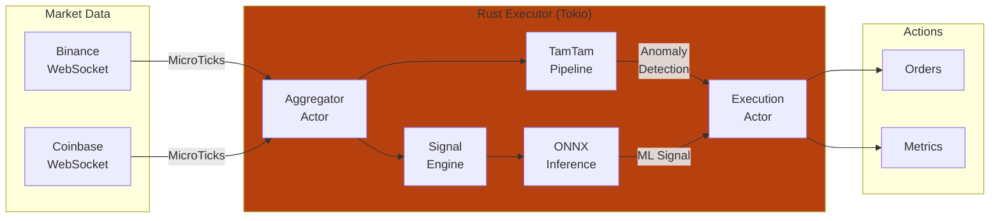

**Key Rust Crates in the Workspace:**

| Crate | Purpose |
|-------|---------|
| `core` | Domain types and shared logic |
| `features` | Signal engine (RSI, Z-Score) ported to Rust |
| `execution` | Main async runtime with Tokio actors |
| `aggregator` | Tick aggregation and snapshot latching |
| `reservoir` | Echo State Network for temporal patterns |
| `detector` | Multivariate streaming anomaly detection |
| `tamtam` | Novel pipeline combining ESN + Gaussian detector |

**Performance Optimizations:**

- **jemalloc**: Custom allocator for predictable memory behavior
- **SIMD JSON**: Fast parsing of WebSocket messages
- **Zero-allocation hot paths**: Pre-allocated buffers in the tick processing loop
- **Actor model**: Tokio channels for concurrent, non-blocking data flow

### The TamTam Pipeline

One of the more experimental components is the "TamTam" pipeline - a combination of reservoir computing and streaming anomaly detection:

```mermaid
flowchart LR
    TICK["Market<br/>Tick"] --> FEAT["Feature<br/>Extraction"]
    FEAT --> ESN["Echo State<br/>Network"]
    ESN -->|"Reservoir<br/>State"| GAUSS["Streaming<br/>Gaussian"]
    GAUSS -->|"Anomaly<br/>Score > 3σ"| ALERT["Stealth<br/>Order Logic"]

    style ESN fill:#4a4a6a
    style GAUSS fill:#6a4a4a
```

The idea is to use the **Echo State Network** as a "tuning fork" that resonates with normal market patterns. When the market behaves unusually, the reservoir state deviates, and the **Multivariate Streaming Gaussian** detector flags it as an anomaly.

### State Synchronization

The Brain and Hands communicate asynchronously via S3:

| Direction | File | Contents | Frequency |
|-----------|------|----------|-----------|
| Brain → Hands | `context.json` | Regime, bias, thresholds | Every 5 min |
| Brain → Hands | `*.onnx` | ML models | On retrain |
| Hands → Brain | `positions.json` | Current inventory | On change |

This design means the executor can operate **autonomously** for extended periods, even if the home lab goes offline. It simply continues executing within its last-known strategic context.

## Monitoring and Observability

For a system running 24/7, observability is critical. The monitoring stack includes:

```mermaid
flowchart LR
    subgraph Services["Services"]
        S1["Collectors"]
        S2["Signal Engine"]
        S3["ML Service"]
        S4["API"]
    end

    subgraph Exporters["Metric Exporters"]
        E1["Redis Exporter"]
        E2["Postgres Exporter"]
        E3["cAdvisor"]
    end

    subgraph Monitoring["Monitoring Stack"]
        PROM["Prometheus"]
        GRAF["Grafana"]
        WATCH["Watchtower<br/>(Health Monitor)"]
    end

    subgraph Alerting["Alerting"]
        DISCORD["Discord"]
        TELEGRAM["Telegram"]
    end

    S1 & S2 & S3 & S4 -->|"/metrics"| PROM
    E1 & E2 & E3 --> PROM
    PROM --> GRAF
    WATCH -->|"Dead service<br/>detection"| DISCORD
    PROM -->|"Alert rules"| TELEGRAM

    style Monitoring fill:#4a4a6a
```

### The Watchtower Pattern

Services write heartbeats to Redis. A dedicated "Watchtower" service polls these heartbeats and flags services that haven't updated within the threshold:

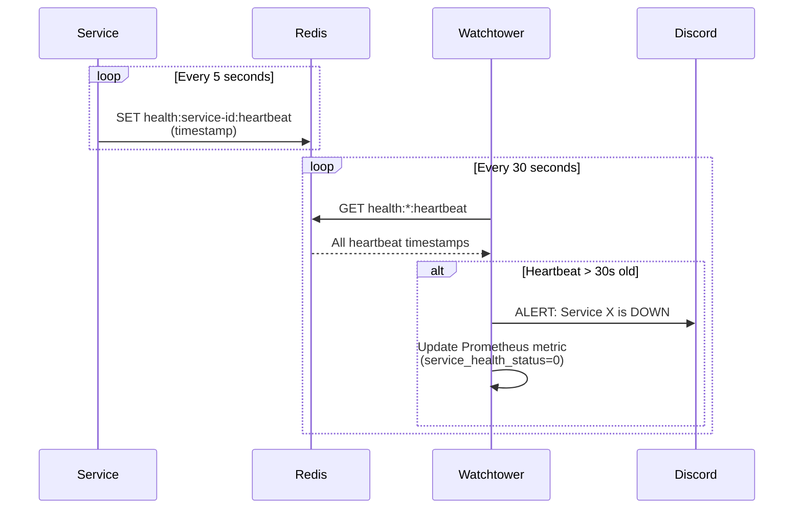

## Lessons Learned

### What Worked Well

1. **Redis as the central nervous system**: Using Redis for both pub/sub and caching simplified the architecture significantly
2. **Containerization from day one**: Every service runs in Docker, making deployment and scaling straightforward
3. **Comprehensive testing**: With 900+ tests, refactoring is much less risky
4. **Incremental development**: Building signals and features incrementally allowed for continuous validation

### Challenges Encountered

1. **Data quality issues**: "Garbage in, garbage out" is very real. Significant effort went into data validation and gap detection
2. **Feature engineering**: The ML model is only as good as its features - this required substantial iteration
3. **Complexity management**: With 20+ services, understanding the system requires good documentation

### Future Directions

The system continues to evolve. Current areas of exploration include:

- **Advanced order book modeling**: Using Level 2 data for better execution
- **State-space models**: Experimenting with newer architectures for time-series prediction
- **Reinforcement learning**: For execution optimization rather than signal generation

## Conclusion

Building a personal trading system has been an incredible learning experience. It touches on:

- Distributed systems design
- Real-time data processing
- Machine learning pipelines
- DevOps and monitoring
- Financial data engineering

Whether or not the system ever generates alpha, the engineering challenges alone make it a rewarding project. The architecture patterns developed here - event-driven microservices, split-brain cloud deployment, comprehensive observability - are applicable far beyond trading.

If you're considering a similar project, my advice would be:

1. **Start simple**: Get data flowing before worrying about ML
2. **Invest in observability early**: You'll thank yourself later
3. **Automate testing**: With financial data, bugs can be expensive
4. **Document as you go**: Your future self is your most important reader

---

*This post describes a personal project built for educational purposes. Nothing here constitutes financial advice.*
