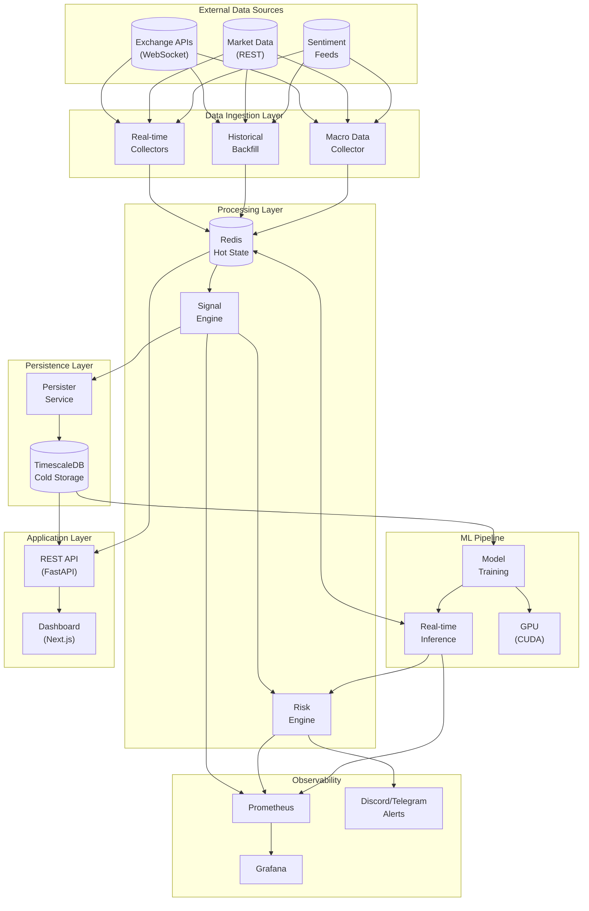
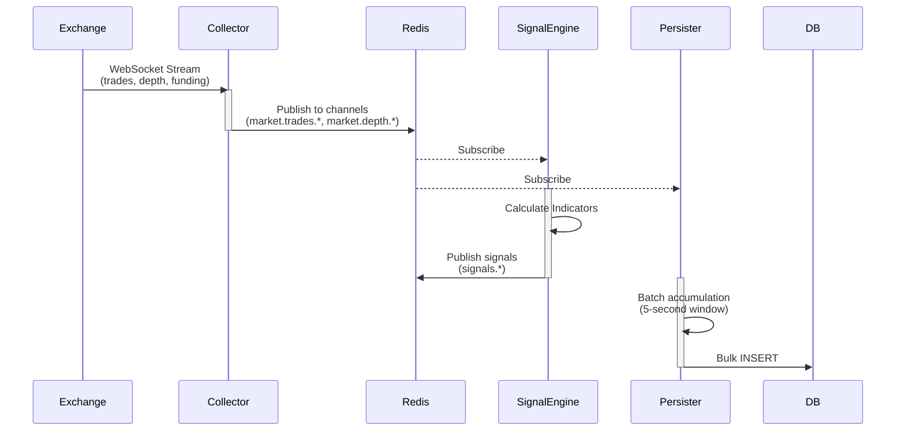
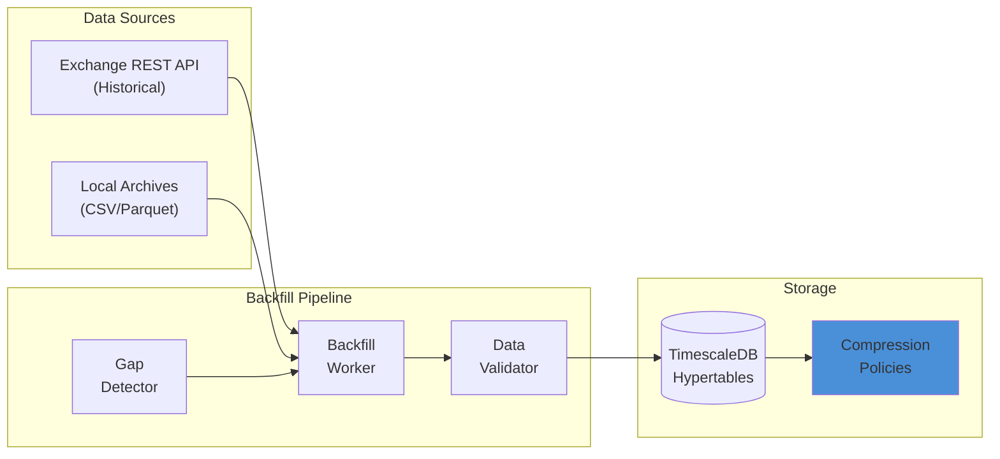
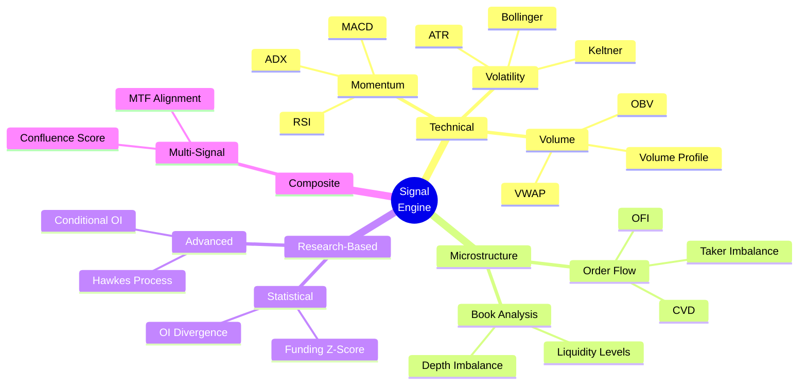
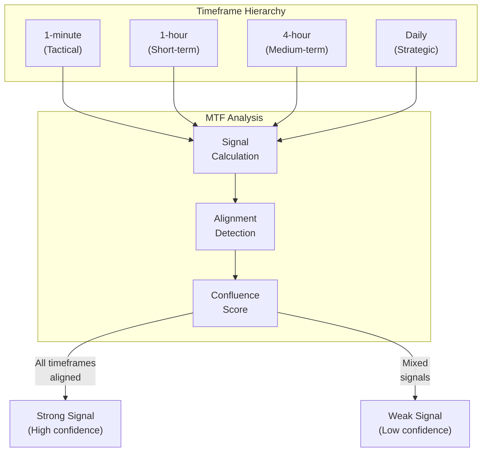
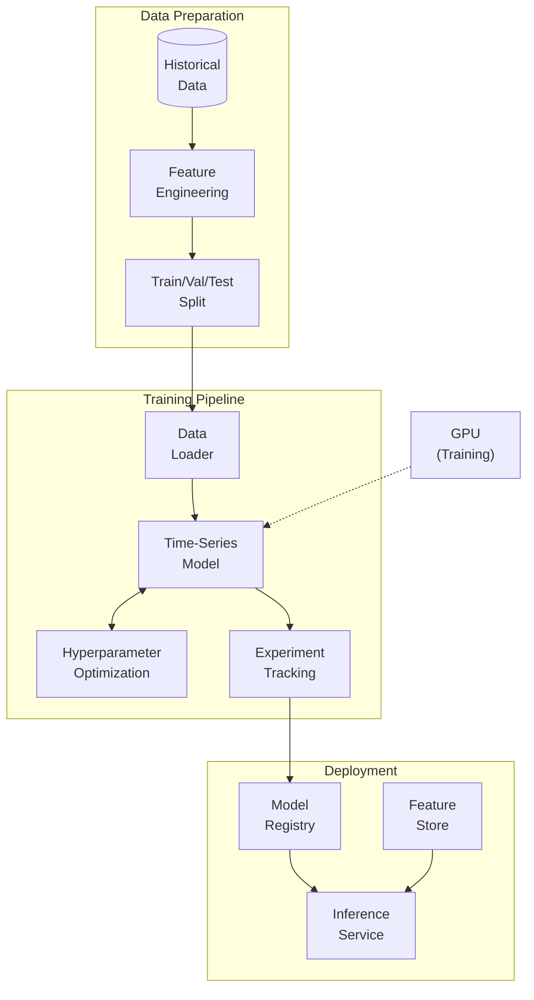
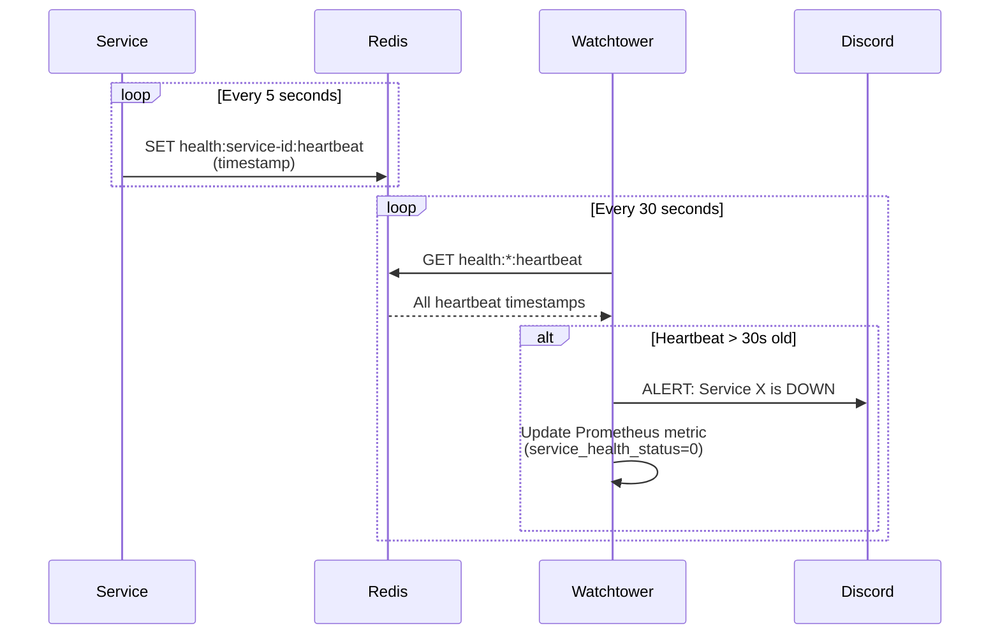

---
date:
  created: 2025-12-24
authors:
  - alf
categories:
  - Architecture
  - Infrastructure
tags:
  - home-lab
  - microservices
  - machine-learning
  - trading
  - real-time
  - docker
  - architecture
  - monitoring
  - ai-agents
slug: building-home-lab-trading-system
readtime: 18
---

# Building a Home Lab Trading System: Architecture of a Personal Market Intelligence Platform

A deep dive into the architecture of a personal cryptocurrency market intelligence system built for a home lab environment. This post explores the design decisions, technical challenges, and lessons learned from building a real-time data processing pipeline that combines microservices, machine learning, and cloud-hybrid execution.

<!-- more -->

## The Vision: Personal Market Intelligence

The cryptocurrency market operates 24/7, generating millions of data points per day. Professional trading firms spend millions on infrastructure to process this data in real-time. But what if you could build a sophisticated market intelligence system in your own home lab?

This project, which I've been developing over the past several months, attempts to answer that question. The goal wasn't to build a "get rich quick" trading bot, but rather to create a comprehensive platform for:

- **Real-time market data ingestion** from multiple exchanges
- **Signal processing** with 60+ technical and microstructure indicators
- **Machine learning inference** for market regime detection
- **Risk management** with position sizing and circuit breakers
- **Full observability** through monitoring and alerting

## High-Level Architecture

The system follows a microservices architecture pattern, running entirely in Docker containers on a single home server with a dedicated GPU for ML training.



## The Data Ingestion Challenge

### Real-time WebSocket Streams

The first challenge was reliably ingesting real-time market data. Exchange WebSocket APIs provide tick-by-tick trade data, order book snapshots, and other market microstructure information.



Key design decisions for the ingestion layer:

1. **Redis as the event bus**: All real-time data flows through Redis Pub/Sub channels, decoupling producers from consumers
2. **Batch persistence**: Rather than writing every tick to the database, the persister accumulates data in 5-second windows before bulk inserting
3. **Automatic reconnection**: Collectors implement exponential backoff and automatic reconnection when WebSocket connections drop
4. **Gap detection**: A separate health monitor detects data gaps and triggers backfill jobs

### Historical Data Management

For machine learning, you need historical data - lots of it. The system maintains several years of minute-level price data, along with derived signals.



TimescaleDB's hypertables and compression policies are essential here - without compression, several years of minute-level data would consume hundreds of gigabytes.

## The Signal Processing Engine

The heart of the system is the signal processing engine, which calculates 60+ indicators in real-time.

### Signal Categories

The signals are organized into functional categories:



### The Base Signal Pattern

Each signal inherits from a base class that provides:

- Standardized calculation interface
- Hyperparameter registration for optimization
- Redis caching for intermediate results
- Metrics exposure for monitoring

```python
# Conceptual pattern (simplified)
class Signal:
    def __init__(self):
        self.hyperparameters = []

    def register_hyperparameters(self):
        """Define tunable parameters"""
        pass

    async def calculate(self, df: pd.DataFrame) -> float:
        """Core calculation logic"""
        raise NotImplementedError
```

### Multi-Timeframe Analysis

One of the more interesting patterns is multi-timeframe (MTF) confluence detection. The system calculates signals across multiple timeframes and looks for alignment:



## The ML Pipeline

### Architecture

The ML pipeline uses modern time-series forecasting techniques to predict market direction and volatility regimes.



### Feature Engineering

The feature engineering pipeline transforms raw market data and signals into model-ready features:

| Feature Type | Examples | Purpose |
|-------------|----------|---------|
| **Time-varying known** | Hour of day, day of week, minutes to funding | Temporal patterns |
| **Time-varying unknown** | Price, volume, signals | Core predictive features |
| **Static** | Average daily volume, historical volatility | Per-asset characteristics |

### Training Infrastructure

Training runs on a dedicated GPU in the home lab. The system uses:

- **Experiment tracking** for comparing model versions
- **Hyperparameter optimization** with Bayesian search
- **Model versioning** for rollback capability

## The "Split Brain" Cloud Architecture

One of the most interesting architectural decisions was the "Split Brain" pattern for execution.

### The Problem

The home lab has a GPU for training, but it's physically far from exchange servers. Low-latency execution requires proximity to exchange data centers.

### The Solution

Separate the "brain" (strategy/ML) from the "hands" (execution):

```mermaid
flowchart TB
    subgraph Home["Home Lab (Brain)"]
        GPU["GPU Training"]
        STRAT["Strategy<br/>Service"]
        REGIME["Regime<br/>Detection"]
    end

    subgraph Cloud["Cloud (Hands)"]
        EXEC["Execution<br/>Engine"]
        OB["Order Book<br/>Processor"]
        ORDERS["Order<br/>Management"]
    end

    subgraph Exchange["Exchange"]
        WS["WebSocket<br/>Feed"]
        API["Order<br/>API"]
    end

    subgraph Sync["State Synchronization"]
        S3[("Object<br/>Storage")]
    end

    GPU --> STRAT
    STRAT --> REGIME
    REGIME -->|"Push context<br/>(every 5 min)"| S3
    S3 -->|"Pull context"| EXEC

    WS -->|"Real-time<br/>L2 data"| OB
    OB --> EXEC
    EXEC --> ORDERS
    ORDERS --> API

    style Home fill:#2d5a27
    style Cloud fill:#1e3a5f
```



Key aspects:

1. **The Brain** runs ML inference and determines strategic bias (bullish/bearish/neutral)
2. **The Hands** receive real-time order book data and execute within the strategic context
3. **State synchronization** happens via object storage, with positions and context shared bidirectionally
4. **Latency budget**: The brain can be slow (seconds), but the hands must be fast (milliseconds)

## Monitoring and Observability

For a system running 24/7, observability is critical. The monitoring stack includes:

```mermaid
flowchart LR
    subgraph Services["Services"]
        S1["Collectors"]
        S2["Signal Engine"]
        S3["ML Service"]
        S4["API"]
    end

    subgraph Exporters["Metric Exporters"]
        E1["Redis Exporter"]
        E2["Postgres Exporter"]
        E3["cAdvisor"]
    end

    subgraph Monitoring["Monitoring Stack"]
        PROM["Prometheus"]
        GRAF["Grafana"]
        WATCH["Watchtower<br/>(Health Monitor)"]
    end

    subgraph Alerting["Alerting"]
        DISCORD["Discord"]
        TELEGRAM["Telegram"]
    end

    S1 & S2 & S3 & S4 -->|"/metrics"| PROM
    E1 & E2 & E3 --> PROM
    PROM --> GRAF
    WATCH -->|"Dead service<br/>detection"| DISCORD
    PROM -->|"Alert rules"| TELEGRAM

    style Monitoring fill:#4a4a6a
```



### The Watchtower Pattern

Services write heartbeats to Redis. A dedicated "Watchtower" service polls these heartbeats and flags services that haven't updated within the threshold:



## Lessons Learned

### What Worked Well

1. **Redis as the central nervous system**: Using Redis for both pub/sub and caching simplified the architecture significantly
2. **Containerization from day one**: Every service runs in Docker, making deployment and scaling straightforward
3. **Comprehensive testing**: With 900+ tests, refactoring is much less risky
4. **Incremental development**: Building signals and features incrementally allowed for continuous validation

### Challenges Encountered

1. **Data quality issues**: "Garbage in, garbage out" is very real. Significant effort went into data validation and gap detection
2. **Feature engineering**: The ML model is only as good as its features - this required substantial iteration
3. **Complexity management**: With 20+ services, understanding the system requires good documentation

### Future Directions

The system continues to evolve. Current areas of exploration include:

- **Advanced order book modeling**: Using Level 2 data for better execution
- **State-space models**: Experimenting with newer architectures for time-series prediction
- **Reinforcement learning**: For execution optimization rather than signal generation

## Conclusion

Building a personal trading system has been an incredible learning experience. It touches on:

- Distributed systems design
- Real-time data processing
- Machine learning pipelines
- DevOps and monitoring
- Financial data engineering

Whether or not the system ever generates alpha, the engineering challenges alone make it a rewarding project. The architecture patterns developed here - event-driven microservices, split-brain cloud deployment, comprehensive observability - are applicable far beyond trading.

If you're considering a similar project, my advice would be:

1. **Start simple**: Get data flowing before worrying about ML
2. **Invest in observability early**: You'll thank yourself later
3. **Automate testing**: With financial data, bugs can be expensive
4. **Document as you go**: Your future self is your most important reader

---

*This post describes a personal project built for educational purposes. Nothing here constitutes financial advice.*
