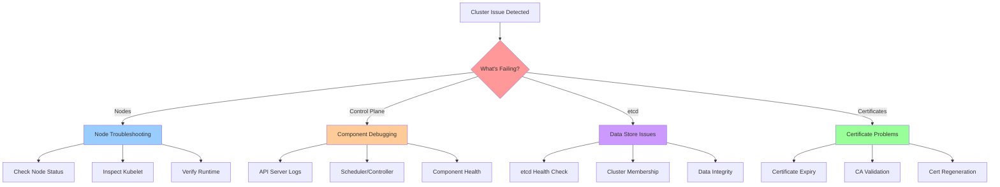
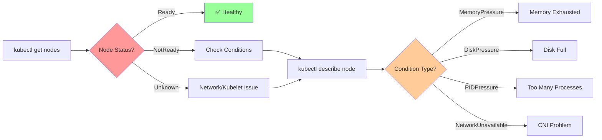
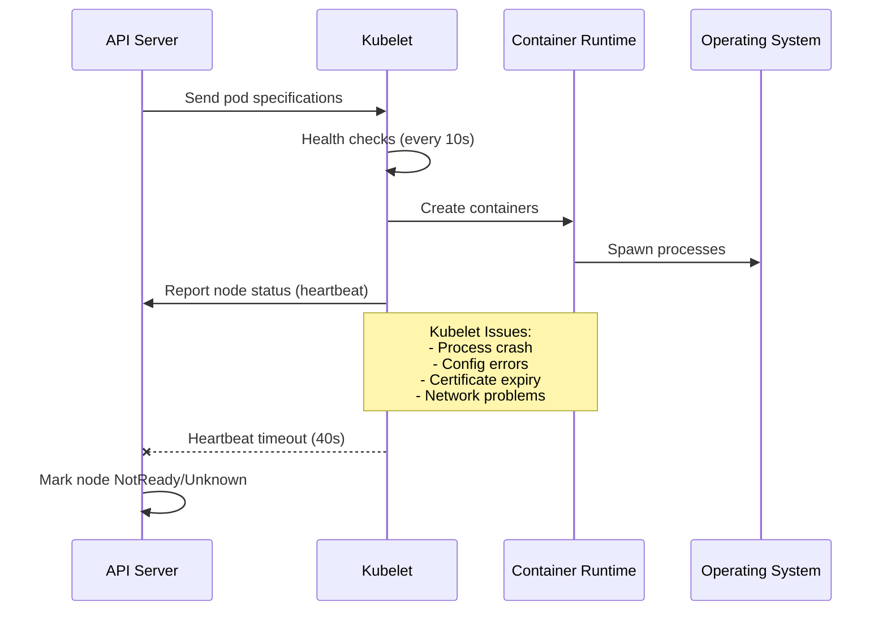
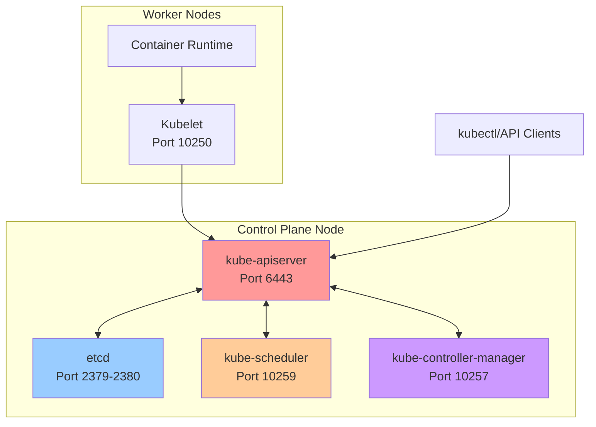
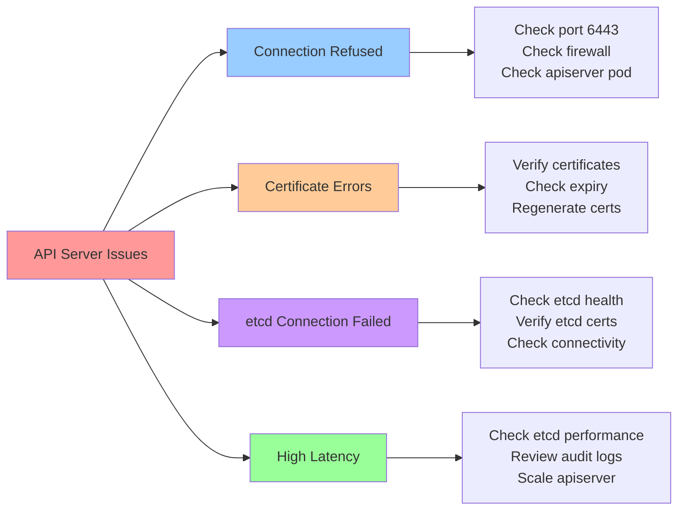
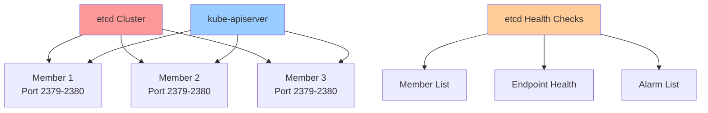
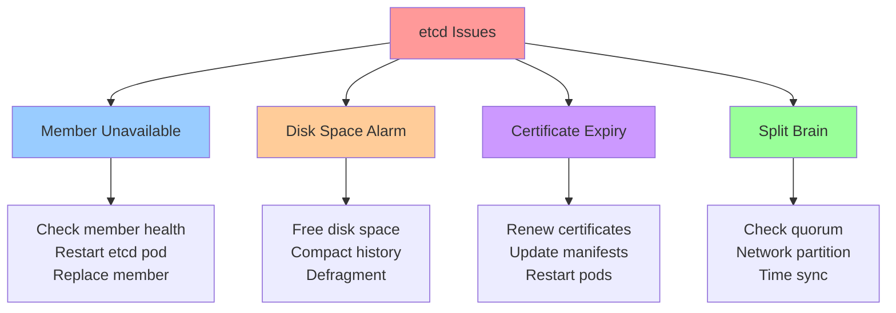
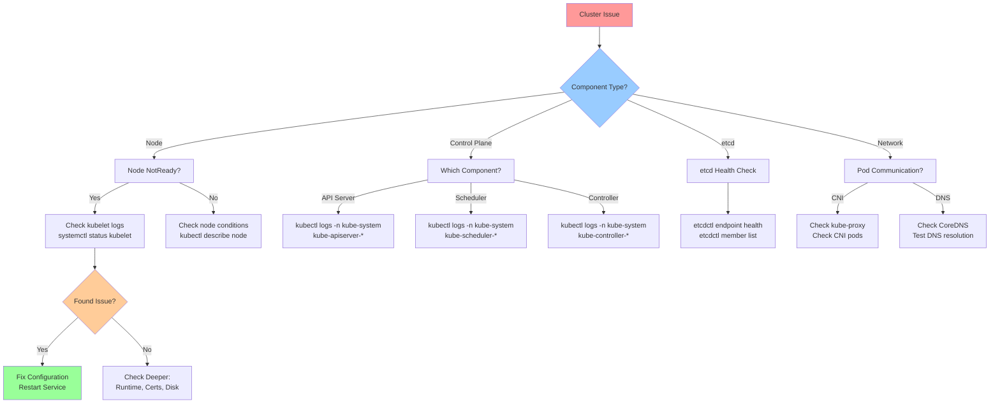

---
date:
  created: 2025-11-11
authors:
  - alf
categories:
  - Kubernetes
  - Troubleshooting
tags:
  - kubernetes
  - k8s
  - cka-prep
  - troubleshooting
  - debugging
  - cluster-health
readtime: 14
slug: troubleshooting-clusters-nodes-components
---

# Troubleshooting Kubernetes Clusters, Nodes, and Components

Master systematic cluster troubleshooting for node issues, control plane debugging, certificate problems, and etcd health checks - essential skills for the CKA exam's highest-weighted domain.

<!-- more -->

## Overview

**Troubleshooting is the highest-weighted CKA exam domain at 30%** - mastering systematic cluster debugging is essential for certification and real-world cluster operations. This guide covers methodical approaches to diagnosing and resolving cluster-level issues.



---

## Node Troubleshooting

### Node Status Investigation

**Common Node States**:
- **Ready**: Node is healthy and accepting pods
- **NotReady**: Node cannot accept pods (kubelet issues, network problems, resource exhaustion)
- **Unknown**: Lost communication with node (>40s heartbeat timeout)



**Diagnostic Commands**:
```bash
# List nodes with status
kubectl get nodes
kubectl get nodes -o wide  # Include IP, OS, runtime info

# Detailed node inspection
kubectl describe node <node-name>

# Check node conditions
kubectl get nodes -o json | jq '.items[].status.conditions'

# Node resource usage
kubectl top node <node-name>  # Requires metrics-server
```

**Example NotReady Node Output**:
```
NAME           STATUS     ROLES    AGE   VERSION
kube-worker-1  NotReady   <none>   1h    v1.30.0
```

**Detailed Node Description** (excerpt):
```
Conditions:
  Type                 Status    Reason                Message
  ----                 ------    ------                -------
  MemoryPressure       Unknown   NodeStatusUnknown     Kubelet stopped posting status
  DiskPressure         Unknown   NodeStatusUnknown     Kubelet stopped posting status
  PIDPressure          Unknown   NodeStatusUnknown     Kubelet stopped posting status
  Ready                Unknown   NodeStatusUnknown     Kubelet stopped posting status

Events:
  Type     Reason                   Message
  ----     ------                   -------
  Normal   NodeNotReady             Node kube-worker-1 status is now: NotReady
  Warning  ContainerRuntimeUnhealthy  Container runtime is unhealthy
```

### Kubelet Troubleshooting

**Kubelet is the primary node agent** - most node issues stem from kubelet problems.



**Check Kubelet Status**:
```bash
# On the node (SSH access required)
sudo systemctl status kubelet

# Check if kubelet is running
ps aux | grep kubelet

# View kubelet configuration
sudo cat /var/lib/kubelet/config.yaml

# Check kubelet version
kubelet --version
```

**View Kubelet Logs**:
```bash
# On systemd-based systems (most common)
sudo journalctl -u kubelet -f        # Follow logs in real-time
sudo journalctl -u kubelet --since "10 minutes ago"
sudo journalctl -u kubelet | grep -i error

# On non-systemd systems
sudo tail -f /var/log/kubelet.log
sudo cat /var/log/kubelet.log | grep -i error

# From control plane (requires NodeLogQuery feature gate)
kubectl get --raw "/api/v1/nodes/<node-name>/proxy/logs/?query=kubelet"
kubectl get --raw "/api/v1/nodes/<node-name>/proxy/logs/?query=kubelet&pattern=error"
```

**Common Kubelet Issues**:

| Issue | Symptom | Resolution |
|-------|---------|------------|
| **Kubelet Crash** | Node NotReady, pods not starting | Check logs: `journalctl -u kubelet`, restart: `systemctl restart kubelet` |
| **Certificate Expired** | "certificate has expired" errors | Regenerate certificates: `kubeadm certs renew all` |
| **Config Error** | Kubelet won't start | Validate `/var/lib/kubelet/config.yaml`, check `--config` flag |
| **Runtime Issue** | "failed to get runtime" | Check container runtime: `systemctl status containerd/docker` |
| **Disk Pressure** | Node unschedulable | Free disk space: `df -h`, clean logs, evict pods |
| **Network Plugin** | CNI errors | Check CNI config: `ls /etc/cni/net.d/`, CNI pods: `kubectl get pods -n kube-system` |

**Restart Kubelet**:
```bash
# Restart kubelet service
sudo systemctl restart kubelet

# Enable kubelet on boot
sudo systemctl enable kubelet

# Check kubelet after restart
sudo systemctl status kubelet
```

### Container Runtime Troubleshooting

```bash
# For containerd (most common in modern clusters)
sudo systemctl status containerd
sudo journalctl -u containerd --since "10 minutes ago"
sudo crictl ps        # List running containers
sudo crictl pods      # List pods
sudo crictl version   # Check runtime version

# For Docker (legacy)
sudo systemctl status docker
sudo docker ps
sudo docker version

# Check runtime socket
ls -l /run/containerd/containerd.sock  # containerd
ls -l /var/run/docker.sock             # Docker
```

**Runtime Configuration**:
```bash
# Kubelet runtime socket configuration
grep "container-runtime-endpoint" /var/lib/kubelet/config.yaml

# Example containerd socket
unix:///run/containerd/containerd.sock

# Verify runtime is accessible
sudo crictl --runtime-endpoint unix:///run/containerd/containerd.sock version
```

---

## Control Plane Troubleshooting

### Control Plane Architecture



### Component Health Checks

**API Server Health**:
```bash
# Check API server reachability
kubectl cluster-info
kubectl get --raw /healthz
kubectl get --raw /livez
kubectl get --raw /readyz

# Detailed health checks
kubectl get --raw /livez?verbose=true
kubectl get --raw /readyz?verbose=true

# Check API server version
kubectl version --short

# API server endpoints
kubectl get endpoints kubernetes -n default
```

**Component Status** (deprecated but useful for CKA):
```bash
# Check control plane component health
kubectl get cs
kubectl get componentstatuses

# Output example:
# NAME                 STATUS    MESSAGE   ERROR
# scheduler            Healthy   ok
# controller-manager   Healthy   ok
# etcd-0               Healthy   ok
```

**Static Pod Manifests** (kubeadm clusters):
```bash
# Control plane pods run as static pods
kubectl get pods -n kube-system | grep -E "(api|scheduler|controller|etcd)"

# Check static pod manifest directory
sudo ls -l /etc/kubernetes/manifests/

# Static pod manifests:
# - kube-apiserver.yaml
# - kube-scheduler.yaml
# - kube-controller-manager.yaml
# - etcd.yaml
```

### Component Log Locations

```mermaid
graph TD
    A[Component Logs] --> B[Static Pods]
    A --> C[Systemd Services]
    A --> D[Log Files]

    B --> E[kubectl logs -n kube-system]
    C --> F[journalctl -u service]
    D --> G[/var/log/*.log]

    E --> H[kube-apiserver-*]
    E --> I[kube-scheduler-*]
    E --> J[kube-controller-*]
    E --> K[etcd-*]

    F --> L[kubelet]
    F --> M[containerd/docker]

    G --> N[/var/log/kube-apiserver.log]
    G --> O[/var/log/kube-scheduler.log]
    G --> P[/var/log/kube-controller-manager.log]

    style A fill:#ff9999
    style B fill:#99ccff
    style C fill:#ffcc99
    style D fill:#99ff99
```

**Log Commands**:
```bash
# API Server logs (kubeadm static pod)
kubectl logs -n kube-system kube-apiserver-<node-name>
kubectl logs -n kube-system kube-apiserver-<node-name> --previous  # Previous container

# Scheduler logs
kubectl logs -n kube-system kube-scheduler-<node-name>

# Controller Manager logs
kubectl logs -n kube-system kube-controller-manager-<node-name>

# etcd logs
kubectl logs -n kube-system etcd-<node-name>

# Filter for errors
kubectl logs -n kube-system kube-apiserver-<node-name> | grep -i error
kubectl logs -n kube-system kube-apiserver-<node-name> | grep -i "failed\|error\|warning"

# Legacy log file locations (if not using systemd)
sudo tail -f /var/log/kube-apiserver.log
sudo tail -f /var/log/kube-scheduler.log
sudo tail -f /var/log/kube-controller-manager.log
```

### API Server Troubleshooting

**Common API Server Issues**:



**Diagnostic Steps**:
```bash
# Check API server pod status
kubectl get pods -n kube-system -l component=kube-apiserver

# If kubectl doesn't work, check directly
sudo docker ps | grep kube-apiserver  # or crictl ps
sudo crictl ps | grep kube-apiserver

# Check API server process
ps aux | grep kube-apiserver

# Test API server connectivity
curl -k https://localhost:6443/healthz
curl -k https://localhost:6443/version

# Check API server configuration
sudo cat /etc/kubernetes/manifests/kube-apiserver.yaml

# Common config issues:
# - Wrong etcd endpoints
# - Certificate paths incorrect
# - Service account key missing
# - Admission plugins misconfigured
```

**Restart API Server** (kubeadm static pod):
```bash
# Move manifest temporarily (kubelet will stop pod)
sudo mv /etc/kubernetes/manifests/kube-apiserver.yaml /tmp/

# Wait 20 seconds for pod to stop

# Move manifest back (kubelet will restart pod)
sudo mv /tmp/kube-apiserver.yaml /etc/kubernetes/manifests/

# Verify restart
kubectl get pods -n kube-system -w
```

### Scheduler Troubleshooting

**Scheduler Issues** manifest as pods stuck in Pending state with events like "no nodes available".

```bash
# Check scheduler health
kubectl get pods -n kube-system -l component=kube-scheduler

# Check scheduler logs
kubectl logs -n kube-system kube-scheduler-<node-name>

# Common scheduler issues:
# - "no nodes available" → Node NotReady, taints, resource exhaustion
# - "pod has unbound PVCs" → PVC not bound
# - "insufficient cpu/memory" → No node has resources
# - "didn't match pod affinity" → Affinity rules not satisfied
```

### Controller Manager Troubleshooting

**Controller Issues** affect resource reconciliation (deployments, replicasets, services, etc.).

```bash
# Check controller manager health
kubectl get pods -n kube-system -l component=kube-controller-manager

# Check controller manager logs
kubectl logs -n kube-system kube-controller-manager-<node-name>

# Common controller issues:
# - Service account token controller not working
# - Endpoint controller not updating services
# - Replication controller not creating pods
# - Certificate controller not auto-approving CSRs
```

---

## etcd Troubleshooting

etcd is the **critical data store** for all cluster state - etcd failure means cluster failure.



### etcd Health Checks

**Access etcd** (kubeadm cluster):
```bash
# etcd runs as static pod
kubectl get pods -n kube-system -l component=etcd

# etcd pod name
kubectl exec -n kube-system etcd-<node-name> -- etcdctl version

# Set etcd environment variables
export ETCDCTL_API=3
export ETCDCTL_ENDPOINTS=https://127.0.0.1:2379
export ETCDCTL_CACERT=/etc/kubernetes/pki/etcd/ca.crt
export ETCDCTL_CERT=/etc/kubernetes/pki/etcd/server.crt
export ETCDCTL_KEY=/etc/kubernetes/pki/etcd/server.key
```

**Check etcd Health**:
```bash
# Endpoint health (inside etcd pod)
kubectl exec -n kube-system etcd-<node-name> -- etcdctl \
  --endpoints=https://127.0.0.1:2379 \
  --cacert=/etc/kubernetes/pki/etcd/ca.crt \
  --cert=/etc/kubernetes/pki/etcd/server.crt \
  --key=/etc/kubernetes/pki/etcd/server.key \
  endpoint health

# Output:
# https://127.0.0.1:2379 is healthy: successfully committed proposal: took = 2.5ms

# List etcd members
kubectl exec -n kube-system etcd-<node-name> -- etcdctl \
  --endpoints=https://127.0.0.1:2379 \
  --cacert=/etc/kubernetes/pki/etcd/ca.crt \
  --cert=/etc/kubernetes/pki/etcd/server.crt \
  --key=/etc/kubernetes/pki/etcd/server.key \
  member list

# Check endpoint status
kubectl exec -n kube-system etcd-<node-name> -- etcdctl \
  --endpoints=https://127.0.0.1:2379 \
  --cacert=/etc/kubernetes/pki/etcd/ca.crt \
  --cert=/etc/kubernetes/pki/etcd/server.crt \
  --key=/etc/kubernetes/pki/etcd/server.key \
  endpoint status --write-out=table
```

**etcd Logs**:
```bash
# View etcd logs
kubectl logs -n kube-system etcd-<node-name>

# Check for common issues:
kubectl logs -n kube-system etcd-<node-name> | grep -i "error\|warning\|failed"

# etcd alarms (disk space, corruption)
kubectl exec -n kube-system etcd-<node-name> -- etcdctl \
  --endpoints=https://127.0.0.1:2379 \
  --cacert=/etc/kubernetes/pki/etcd/ca.crt \
  --cert=/etc/kubernetes/pki/etcd/server.crt \
  --key=/etc/kubernetes/pki/etcd/server.key \
  alarm list
```

### etcd Common Issues



**Disk Space Issues**:
```bash
# Check etcd data directory size
du -sh /var/lib/etcd

# Compact etcd history
kubectl exec -n kube-system etcd-<node-name> -- etcdctl \
  --endpoints=https://127.0.0.1:2379 \
  --cacert=/etc/kubernetes/pki/etcd/ca.crt \
  --cert=/etc/kubernetes/pki/etcd/server.crt \
  --key=/etc/kubernetes/pki/etcd/server.key \
  compact <revision>

# Defragment etcd
kubectl exec -n kube-system etcd-<node-name> -- etcdctl \
  --endpoints=https://127.0.0.1:2379 \
  --cacert=/etc/kubernetes/pki/etcd/ca.crt \
  --cert=/etc/kubernetes/pki/etcd/server.crt \
  --key=/etc/kubernetes/pki/etcd/server.key \
  defrag

# Clear alarm
kubectl exec -n kube-system etcd-<node-name> -- etcdctl \
  --endpoints=https://127.0.0.1:2379 \
  --cacert=/etc/kubernetes/pki/etcd/ca.crt \
  --cert=/etc/kubernetes/pki/etcd/server.crt \
  --key=/etc/kubernetes/pki/etcd/server.key \
  alarm disarm
```

---

## Certificate Troubleshooting

Kubernetes uses **PKI (Public Key Infrastructure)** - certificate issues cause authentication failures.

```mermaid
graph TB
    A[Kubernetes PKI] --> B[CA Certificates]
    A --> C[API Server Certs]
    A --> D[Kubelet Certs]
    A --> E[etcd Certs]
    A --> F[Service Account Keys]

    B --> G[/etc/kubernetes/pki/ca.crt<br/>/etc/kubernetes/pki/ca.key]
    C --> H[/etc/kubernetes/pki/apiserver.crt<br/>/etc/kubernetes/pki/apiserver.key]
    D --> I[/var/lib/kubelet/pki/kubelet.crt<br/>/var/lib/kubelet/pki/kubelet.key]
    E --> J[/etc/kubernetes/pki/etcd/server.crt<br/>/etc/kubernetes/pki/etcd/server.key]

    style A fill:#ff9999
    style B fill:#99ccff
    style C fill:#ffcc99
    style D fill:#cc99ff
    style E fill:#99ff99
```

### Check Certificate Expiry

**kubeadm Certificate Commands**:
```bash
# Check all certificate expiration dates
sudo kubeadm certs check-expiration

# Output example:
# CERTIFICATE                EXPIRES                  RESIDUAL TIME   CERTIFICATE AUTHORITY   EXTERNALLY MANAGED
# admin.conf                 Nov 10, 2025 12:00 UTC   364d            ca                      no
# apiserver                  Nov 10, 2025 12:00 UTC   364d            ca                      no
# apiserver-etcd-client      Nov 10, 2025 12:00 UTC   364d            etcd-ca                 no
# apiserver-kubelet-client   Nov 10, 2025 12:00 UTC   364d            ca                      no
# controller-manager.conf    Nov 10, 2025 12:00 UTC   364d            ca                      no
# etcd-healthcheck-client    Nov 10, 2025 12:00 UTC   364d            etcd-ca                 no
# etcd-peer                  Nov 10, 2025 12:00 UTC   364d            etcd-ca                 no
# etcd-server                Nov 10, 2025 12:00 UTC   364d            etcd-ca                 no
# front-proxy-client         Nov 10, 2025 12:00 UTC   364d            front-proxy-ca          no
# scheduler.conf             Nov 10, 2025 12:00 UTC   364d            ca                      no
```

**Manual Certificate Inspection**:
```bash
# Check API server certificate
sudo openssl x509 -in /etc/kubernetes/pki/apiserver.crt -noout -text
sudo openssl x509 -in /etc/kubernetes/pki/apiserver.crt -noout -dates

# Check kubelet certificate
sudo openssl x509 -in /var/lib/kubelet/pki/kubelet.crt -noout -dates

# Check etcd certificate
sudo openssl x509 -in /etc/kubernetes/pki/etcd/server.crt -noout -dates

# Quick expiry check (days remaining)
sudo openssl x509 -in /etc/kubernetes/pki/apiserver.crt -noout -checkend 0
echo $?  # 0 = valid, 1 = expired
```

### Renew Certificates

**kubeadm Certificate Renewal**:
```bash
# Renew all certificates
sudo kubeadm certs renew all

# Renew specific certificate
sudo kubeadm certs renew apiserver
sudo kubeadm certs renew apiserver-kubelet-client
sudo kubeadm certs renew etcd-server

# After renewal, restart control plane components
sudo mv /etc/kubernetes/manifests/*.yaml /tmp/
sleep 20
sudo mv /tmp/*.yaml /etc/kubernetes/manifests/

# Update kubeconfig files
sudo kubeadm certs renew admin.conf
sudo cp /etc/kubernetes/admin.conf ~/.kube/config
sudo chown $(id -u):$(id -g) ~/.kube/config
```

**Certificate Errors**:
```
Common certificate errors:

"x509: certificate has expired or is not yet valid"
→ Certificate expired, renew with kubeadm certs renew

"x509: certificate signed by unknown authority"
→ CA mismatch, verify CA certificate consistency

"tls: failed to verify certificate: x509: certificate is valid for..., not..."
→ Certificate SAN (Subject Alternative Name) missing required hostname/IP

"unable to authenticate the request due to an error: crypto/rsa: verification error"
→ Service account key mismatch between apiserver and controller-manager
```

---

## Cluster Troubleshooting Decision Tree



---

## CKA Exam Practice Exercises

### Exercise 1: Troubleshoot NotReady Node

**Scenario**: Node `worker-1` is showing NotReady status. Investigate and fix the issue.

<details>
<summary><strong>Solution</strong></summary>

```bash
# 1. Check node status
kubectl get nodes
# Output: worker-1   NotReady   <none>   5m

# 2. Describe node for details
kubectl describe node worker-1
# Check Conditions section for specific issues

# 3. SSH to node and check kubelet
ssh worker-1
sudo systemctl status kubelet
# Output might show: failed, dead, or errors

# 4. Check kubelet logs
sudo journalctl -u kubelet -n 50
# Look for error messages

# 5. Common fixes:
# If kubelet is dead:
sudo systemctl start kubelet

# If config error:
sudo cat /var/lib/kubelet/config.yaml  # Validate syntax

# If runtime issue:
sudo systemctl status containerd
sudo systemctl restart containerd
sudo systemctl restart kubelet

# 6. Verify fix
kubectl get nodes
# Output: worker-1   Ready   <none>   7m
```

**Common Issues**:
- Kubelet service stopped: `systemctl start kubelet`
- Container runtime down: `systemctl restart containerd`
- Certificate expired: `kubeadm certs renew all`
- Disk full: Free space in `/var/lib/kubelet` or `/var/lib/containerd`

</details>

---

### Exercise 2: Debug API Server Connection Issues

**Scenario**: kubectl commands are failing with "connection refused". Troubleshoot the API server.

<details>
<summary><strong>Solution</strong></summary>

```bash
# 1. Test API server connectivity
curl -k https://localhost:6443/healthz
# If connection refused, API server is down

# 2. Check API server pod status
sudo crictl ps | grep kube-apiserver
# Or from another control plane node:
kubectl get pods -n kube-system -l component=kube-apiserver

# 3. Check API server manifest
sudo cat /etc/kubernetes/manifests/kube-apiserver.yaml
# Verify:
# - etcd endpoints correct
# - Certificate paths valid
# - Service account key present

# 4. Check API server container logs
sudo crictl logs <apiserver-container-id>
# Look for startup errors

# 5. Common issues:
# - etcd connection failed: Check etcd health
# - Certificate error: Verify cert paths and expiry
# - Port conflict: Check if port 6443 is in use

# 6. Restart API server (move manifest)
sudo mv /etc/kubernetes/manifests/kube-apiserver.yaml /tmp/
sleep 20
sudo mv /tmp/kube-apiserver.yaml /etc/kubernetes/manifests/

# 7. Verify API server is running
kubectl get nodes
# Success indicates API server is healthy
```

</details>

---

### Exercise 3: etcd Cluster Health Check

**Scenario**: Perform a comprehensive etcd health check and verify cluster membership.

<details>
<summary><strong>Solution</strong></summary>

```bash
# 1. Set etcd environment variables
export ETCDCTL_API=3
export ETCDCTL_ENDPOINTS=https://127.0.0.1:2379
export ETCDCTL_CACERT=/etc/kubernetes/pki/etcd/ca.crt
export ETCDCTL_CERT=/etc/kubernetes/pki/etcd/server.crt
export ETCDCTL_KEY=/etc/kubernetes/pki/etcd/server.key

# 2. Check endpoint health
kubectl exec -n kube-system etcd-<node-name> -- etcdctl \
  --endpoints=$ETCDCTL_ENDPOINTS \
  --cacert=$ETCDCTL_CACERT \
  --cert=$ETCDCTL_CERT \
  --key=$ETCDCTL_KEY \
  endpoint health
# Output: https://127.0.0.1:2379 is healthy: successfully committed proposal: took = 2.5ms

# 3. List cluster members
kubectl exec -n kube-system etcd-<node-name> -- etcdctl \
  --endpoints=$ETCDCTL_ENDPOINTS \
  --cacert=$ETCDCTL_CACERT \
  --cert=$ETCDCTL_CERT \
  --key=$ETCDCTL_KEY \
  member list
# Output shows member ID, status, name, peer URLs, client URLs

# 4. Check endpoint status
kubectl exec -n kube-system etcd-<node-name> -- etcdctl \
  --endpoints=$ETCDCTL_ENDPOINTS \
  --cacert=$ETCDCTL_CACERT \
  --cert=$ETCDCTL_CERT \
  --key=$ETCDCTL_KEY \
  endpoint status --write-out=table
# Shows: endpoint, ID, version, DB size, is leader, is learner, raft term

# 5. Check for alarms
kubectl exec -n kube-system etcd-<node-name> -- etcdctl \
  --endpoints=$ETCDCTL_ENDPOINTS \
  --cacert=$ETCDCTL_CACERT \
  --cert=$ETCDCTL_CERT \
  --key=$ETCDCTL_KEY \
  alarm list
# No output = no alarms (good)

# 6. View etcd logs for issues
kubectl logs -n kube-system etcd-<node-name> | grep -i "error\|warning"
```

</details>

---

### Exercise 4: Certificate Expiration Check and Renewal

**Scenario**: Check certificate expiration dates and renew certificates that will expire within 30 days.

<details>
<summary><strong>Solution</strong></summary>

```bash
# 1. Check all certificate expiration dates
sudo kubeadm certs check-expiration
# Output shows CERTIFICATE, EXPIRES, RESIDUAL TIME, CERTIFICATE AUTHORITY

# 2. Check specific certificate manually
sudo openssl x509 -in /etc/kubernetes/pki/apiserver.crt -noout -dates
# Output:
# notBefore=Nov 10, 2024 12:00:00 GMT
# notAfter=Nov 10, 2025 12:00:00 GMT

# 3. Check if certificate expires in next 30 days (2592000 seconds)
sudo openssl x509 -in /etc/kubernetes/pki/apiserver.crt -noout -checkend 2592000
echo $?
# 0 = still valid for 30 days, 1 = expires within 30 days

# 4. Renew all certificates
sudo kubeadm certs renew all
# Output shows renewed certificates

# 5. Renew specific kubeconfig files
sudo kubeadm certs renew admin.conf
sudo kubeadm certs renew controller-manager.conf
sudo kubeadm certs renew scheduler.conf

# 6. Update local kubeconfig
sudo cp /etc/kubernetes/admin.conf ~/.kube/config
sudo chown $(id -u):$(id -g) ~/.kube/config

# 7. Restart control plane components
sudo mv /etc/kubernetes/manifests/*.yaml /tmp/
sleep 20
sudo mv /tmp/*.yaml /etc/kubernetes/manifests/

# 8. Verify control plane is healthy
kubectl get nodes
kubectl get pods -n kube-system

# 9. Verify new certificate expiration
sudo kubeadm certs check-expiration
# Should show new expiration dates (1 year from now)
```

</details>

---

### Exercise 5: Multi-Component Cluster Failure

**Scenario**: Multiple issues detected:
- Node `worker-2` is NotReady
- Pods stuck in Pending
- API server logging certificate errors
- etcd showing disk space alarm

Systematically troubleshoot and fix all issues.

<details>
<summary><strong>Solution</strong></summary>

```bash
# Phase 1: Prioritize Critical Issues (etcd → API server → Node → Pods)

# 1. Fix etcd disk space alarm (CRITICAL - cluster stability)
kubectl exec -n kube-system etcd-master -- etcdctl \
  --endpoints=https://127.0.0.1:2379 \
  --cacert=/etc/kubernetes/pki/etcd/ca.crt \
  --cert=/etc/kubernetes/pki/etcd/server.crt \
  --key=/etc/kubernetes/pki/etcd/server.key \
  alarm list
# Output: memberID:xxx alarm:NOSPACE

# Check etcd data directory size
sudo du -sh /var/lib/etcd

# Compact and defragment etcd
kubectl exec -n kube-system etcd-master -- etcdctl \
  --endpoints=https://127.0.0.1:2379 \
  --cacert=/etc/kubernetes/pki/etcd/ca.crt \
  --cert=/etc/kubernetes/pki/etcd/server.crt \
  --key=/etc/kubernetes/pki/etcd/server.key \
  compact $(kubectl exec -n kube-system etcd-master -- etcdctl \
    --endpoints=https://127.0.0.1:2379 \
    --cacert=/etc/kubernetes/pki/etcd/ca.crt \
    --cert=/etc/kubernetes/pki/etcd/server.crt \
    --key=/etc/kubernetes/pki/etcd/server.key \
    endpoint status --write-out="json" | jq -r '.[0].Status.header.revision')

kubectl exec -n kube-system etcd-master -- etcdctl \
  --endpoints=https://127.0.0.1:2379 \
  --cacert=/etc/kubernetes/pki/etcd/ca.crt \
  --cert=/etc/kubernetes/pki/etcd/server.crt \
  --key=/etc/kubernetes/pki/etcd/server.key \
  defrag

# Disarm alarm
kubectl exec -n kube-system etcd-master -- etcdctl \
  --endpoints=https://127.0.0.1:2379 \
  --cacert=/etc/kubernetes/pki/etcd/ca.crt \
  --cert=/etc/kubernetes/pki/etcd/server.crt \
  --key=/etc/kubernetes/pki/etcd/server.key \
  alarm disarm

# Phase 2: Fix API Server Certificate Issues

# 2. Check API server certificate errors
kubectl logs -n kube-system kube-apiserver-master | grep -i certificate

# Check certificate expiration
sudo kubeadm certs check-expiration

# Renew expired certificates
sudo kubeadm certs renew all

# Update kubeconfig
sudo cp /etc/kubernetes/admin.conf ~/.kube/config

# Restart API server
sudo mv /etc/kubernetes/manifests/kube-apiserver.yaml /tmp/
sleep 20
sudo mv /tmp/kube-apiserver.yaml /etc/kubernetes/manifests/

# Verify API server is healthy
kubectl get --raw /healthz

# Phase 3: Fix NotReady Node

# 3. Troubleshoot worker-2 NotReady
kubectl describe node worker-2
# Check Conditions section

# SSH to worker-2
ssh worker-2

# Check kubelet
sudo systemctl status kubelet
sudo journalctl -u kubelet -n 50

# Common fixes:
sudo systemctl restart kubelet  # If kubelet is dead

# Check container runtime
sudo systemctl status containerd
sudo systemctl restart containerd
sudo systemctl restart kubelet

# Exit back to master
exit

# Verify node is Ready
kubectl get nodes
# Output: worker-2   Ready   <none>   10m

# Phase 4: Fix Pending Pods

# 4. Investigate pending pods
kubectl get pods -A | grep Pending
kubectl describe pod <pending-pod> -n <namespace>
# Check Events section for reason

# Common reasons and fixes:
# - "Insufficient cpu/memory" → Node now Ready, pods should schedule
# - "No nodes available" → Check node taints, labels, affinity rules
# - "pod has unbound PVCs" → Check PVC status

# Trigger rescheduling if needed
kubectl get pods -A -o wide | grep Pending
kubectl delete pod <pod-name> -n <namespace>  # If stuck
# Deployment/ReplicaSet will recreate

# Phase 5: Final Verification

# 5. Comprehensive cluster health check
kubectl get nodes
kubectl get pods -A
kubectl get cs
kubectl cluster-info

# Check etcd health
kubectl exec -n kube-system etcd-master -- etcdctl \
  --endpoints=https://127.0.0.1:2379 \
  --cacert=/etc/kubernetes/pki/etcd/ca.crt \
  --cert=/etc/kubernetes/pki/etcd/server.crt \
  --key=/etc/kubernetes/pki/etcd/server.key \
  endpoint health

# All systems should be healthy now
```

**Troubleshooting Order**:
1. **etcd** (data store) - highest priority
2. **API server** (control plane access)
3. **Nodes** (workload capacity)
4. **Pods** (application layer)

</details>

---

## Quick Reference Commands

### Node Troubleshooting
```bash
kubectl get nodes                           # List node status
kubectl describe node <node>                # Detailed node info
kubectl top node <node>                     # Resource usage
sudo systemctl status kubelet               # Kubelet service status
sudo journalctl -u kubelet -f               # Follow kubelet logs
```

### Control Plane Troubleshooting
```bash
kubectl get cs                              # Component status
kubectl get pods -n kube-system             # Control plane pods
kubectl logs -n kube-system <pod>           # Component logs
kubectl get --raw /healthz                  # API server health
sudo ls /etc/kubernetes/manifests/          # Static pod manifests
```

### etcd Troubleshooting
```bash
# Inside etcd pod or with etcdctl binary
etcdctl endpoint health --write-out=table
etcdctl member list --write-out=table
etcdctl endpoint status --write-out=table
etcdctl alarm list
```

### Certificate Troubleshooting
```bash
sudo kubeadm certs check-expiration         # Check all certs
sudo kubeadm certs renew all                # Renew all certs
sudo openssl x509 -in <cert> -noout -dates  # Check cert dates
```

---

## Related Resources

- **[Kubernetes Architecture Fundamentals](../2025/11/11/kubernetes-architecture-fundamentals/)** - Understanding cluster components
- **[kubectl Essentials](../2025/11/11/kubectl-essentials/)** - Master debugging commands
- **[Setting Up Your Lab Environment](../2025/11/11/setting-up-kubernetes-lab/)** - Practice cluster setup

---

## Summary

**Cluster troubleshooting is systematic and methodical** - always follow a logical diagnosis path from critical components (etcd, API server) down to application layers (nodes, pods). Master these troubleshooting techniques to confidently tackle the CKA exam's highest-weighted domain (30%) and become an effective Kubernetes cluster administrator.

**Key Takeaways**:
- ✅ **Node issues** → Check kubelet logs, service status, and runtime health
- ✅ **Control plane** → Verify component logs, health endpoints, and static pod manifests
- ✅ **etcd** → Monitor health, membership, disk space, and certificate validity
- ✅ **Certificates** → Check expiration regularly, renew proactively, restart components after renewal
- ✅ **Systematic approach** → Prioritize critical components, follow decision trees, document findings

Next: **[Application Troubleshooting and Log Analysis](#)** - Pod-level debugging and container troubleshooting
