---
date:
  created: 2025-11-11
authors:
  - alf
categories:
  - Kubernetes
  - Configuration
tags:
  - kubernetes
  - k8s
  - cka-prep
  - configmaps
  - secrets
  - configuration
readtime: 12
slug: configmaps-secrets-volume-mounts
---

# ConfigMaps, Secrets, and Volume Mounts

Every application needs configuration—database endpoints, feature flags, API keys, TLS certificates. Kubernetes provides ConfigMaps for non-sensitive configuration data and Secrets for sensitive information like passwords and tokens. Understanding the distinction between these resources and the various consumption patterns (environment variables, volume mounts, projected volumes) is essential for the CKA exam's Storage domain (10% weight) and production Kubernetes operations.

The key insight: **ConfigMaps and Secrets decouple configuration from container images**, enabling the same image to run across development, staging, and production with different configurations. This pattern is fundamental to cloud-native applications and the Twelve-Factor App methodology. Modern Kubernetes (2025) adds immutability for ConfigMaps/Secrets, enhanced encryption options, and improved integration with external secret management systems.

While ConfigMaps store arbitrary key-value pairs, Secrets provide a specialized resource with base64 encoding (not encryption!), RBAC integration, and memory-backed storage options. Understanding when to use environment variables versus volume mounts, how to leverage projected volumes, and the security implications of each approach is critical for production deployments.

<!-- more -->

## ConfigMaps vs Secrets: When to Use What


**Decision Matrix**:

| Question | ConfigMap | Secret |
|----------|-----------|--------|
| Contains passwords/keys? | ❌ | ✅ |
| Needs RBAC restrictions? | Optional | ✅ Required |
| Base64 encoded? | No (plain text) | Yes |
| Stored in etcd? | Yes (unencrypted by default) | Yes (encrypted with encryption-at-rest) |
| Audit logging for access? | Not by default | ✅ Recommended |
| Size limit | 1MB | 1MB |

## Creating ConfigMaps

### From Literal Values

```bash
# Single key-value pair
kubectl create configmap app-config \
  --from-literal=database.host=postgres.production.svc \
  --from-literal=database.port=5432 \
  --from-literal=feature.new_ui=true

# Verify creation
kubectl get configmap app-config -o yaml
```

### From Files

```bash
# Create config file
cat > app.properties <<EOF
server.port=8080
server.host=0.0.0.0
log.level=INFO
cache.enabled=true
EOF

# Create ConfigMap from file
kubectl create configmap app-properties --from-file=app.properties

# The file name becomes the key
# Access via: configMapKeyRef.key: app.properties

# Custom key name
kubectl create configmap app-props --from-file=config.properties=app.properties
```

### From Directory

```bash
# Create config directory
mkdir config
echo "prod" > config/environment
echo "https://api.production.com" > config/api_url
echo "replica-set" > config/database_mode

# Create ConfigMap from all files in directory
kubectl create configmap env-config --from-file=config/

# Each file becomes a separate key
kubectl describe configmap env-config
```

### From YAML Manifest

```yaml
apiVersion: v1
kind: ConfigMap
metadata:
  name: app-config
  namespace: production
data:
  # Simple key-value pairs
  database.host: "postgres.production.svc"
  database.port: "5432"
  cache.ttl: "3600"

  # Multi-line configuration file
  nginx.conf: |
    server {
      listen 80;
      server_name example.com;
      location / {
        proxy_pass http://backend:8080;
        proxy_set_header Host $host;
      }
    }

  # JSON configuration
  app.json: |
    {
      "environment": "production",
      "features": {
        "newUI": true,
        "betaFeatures": false
      }
    }
```

```bash
# Apply ConfigMap
kubectl apply -f configmap.yaml

# Update ConfigMap (changes propagate to mounted volumes)
kubectl apply -f configmap.yaml

# Delete ConfigMap
kubectl delete configmap app-config
```

## Creating Secrets

### Understanding Secret Types


| Secret Type | Use Case | Required Keys |
|-------------|----------|---------------|
| `Opaque` | Generic secrets (default) | Any key-value pairs |
| `kubernetes.io/tls` | TLS certificates | `tls.crt`, `tls.key` |
| `kubernetes.io/dockerconfigjson` | Container registry auth | `.dockerconfigjson` |
| `kubernetes.io/ssh-auth` | SSH authentication | `ssh-privatekey` |
| `kubernetes.io/basic-auth` | HTTP basic auth | `username`, `password` |
| `kubernetes.io/service-account-token` | ServiceAccount tokens | Auto-managed by Kubernetes |

### Creating Opaque Secrets

```bash
# From literal values
kubectl create secret generic db-credentials \
  --from-literal=username=admin \
  --from-literal=password='P@ssw0rd!2025'

# From files
echo -n 'admin' > username.txt
echo -n 'P@ssw0rd!2025' > password.txt
kubectl create secret generic db-creds --from-file=username.txt --from-file=password.txt

# From env file
cat > db.env <<EOF
DB_USER=admin
DB_PASS=P@ssw0rd!2025
EOF
kubectl create secret generic db-env --from-env-file=db.env
```

### Creating TLS Secrets

```bash
# Generate self-signed certificate (example)
openssl req -x509 -nodes -days 365 -newkey rsa:2048 \
  -keyout tls.key \
  -out tls.crt \
  -subj "/CN=example.com/O=example"

# Create TLS secret
kubectl create secret tls example-tls \
  --cert=tls.crt \
  --key=tls.key

# Use in Ingress
kubectl get secret example-tls -o yaml
```

### Creating Docker Registry Secrets

```bash
# For private container registries
kubectl create secret docker-registry regcred \
  --docker-server=https://index.docker.io/v1/ \
  --docker-username=myuser \
  --docker-password=mypassword \
  --docker-email=user@example.com

# Use in Pod spec
# spec.imagePullSecrets:
#   - name: regcred
```

### Creating Secrets from YAML (⚠️ Security Warning)

```yaml
apiVersion: v1
kind: Secret
metadata:
  name: db-secret
type: Opaque
data:
  # Base64 encoded values (NOT encrypted!)
  username: YWRtaW4=          # admin
  password: UEBzc3cwcmQhMjAyNQ==  # P@ssw0rd!2025
```

**⚠️ CRITICAL Security Note**:
- Base64 is **encoding, not encryption**
- Anyone with access to Secret can decode: `echo YWRtaW4= | base64 -d`
- Never commit Secrets to version control
- Use external secret managers (Vault, AWS Secrets Manager) for production
- Enable encryption-at-rest for etcd

```bash
# Encode values for Secret YAML
echo -n 'admin' | base64              # YWRtaW4=
echo -n 'P@ssw0rd!2025' | base64      # UEBzc3cwcmQhMjAyNQ==

# Decode Secret values
kubectl get secret db-secret -o jsonpath='{.data.username}' | base64 -d
kubectl get secret db-secret -o jsonpath='{.data.password}' | base64 -d
```

## Consuming ConfigMaps and Secrets

### Method 1: Environment Variables

```yaml
apiVersion: v1
kind: Pod
metadata:
  name: app-pod
spec:
  containers:
    - name: app
      image: myapp:1.0
      env:
        # Single value from ConfigMap
        - name: DATABASE_HOST
          valueFrom:
            configMapKeyRef:
              name: app-config
              key: database.host

        # Single value from Secret
        - name: DATABASE_PASSWORD
          valueFrom:
            secretKeyRef:
              name: db-secret
              key: password

        # Optional key (won't fail if missing)
        - name: FEATURE_FLAG
          valueFrom:
            configMapKeyRef:
              name: app-config
              key: optional.feature
              optional: true
```

**envFrom: Import All Keys as Environment Variables**

```yaml
apiVersion: v1
kind: Pod
metadata:
  name: env-from-pod
spec:
  containers:
    - name: app
      image: myapp:1.0
      envFrom:
        # Import all ConfigMap keys
        - configMapRef:
            name: app-config
          prefix: CONFIG_  # Optional: prefix all keys

        # Import all Secret keys
        - secretRef:
            name: db-secret
          prefix: DB_

# Results in environment variables:
# CONFIG_database.host=postgres.production.svc
# DB_username=admin
# DB_password=P@ssw0rd!2025
```

**Pros and Cons of Environment Variables**:

✅ **Pros**:
- Simple to use
- Available immediately at container start
- No filesystem permissions issues
- Good for simple configuration

❌ **Cons**:
- No dynamic updates (requires pod restart)
- Visible in `kubectl describe pod` output (security risk)
- Limited to string values
- Environment variable injection may leak in logs

### Method 2: Volume Mounts

```yaml
apiVersion: v1
kind: Pod
metadata:
  name: volume-mount-pod
spec:
  containers:
    - name: app
      image: myapp:1.0
      volumeMounts:
        # Mount ConfigMap as files
        - name: config-volume
          mountPath: /etc/config
          readOnly: true

        # Mount Secret as files
        - name: secret-volume
          mountPath: /etc/secrets
          readOnly: true

  volumes:
    - name: config-volume
      configMap:
        name: app-config
        items:  # Optional: specify which keys to mount
          - key: nginx.conf
            path: nginx.conf
          - key: app.json
            path: config.json

    - name: secret-volume
      secret:
        secretName: db-secret
        defaultMode: 0400  # Read-only for owner only
```

**File Structure After Mounting**:
```bash
/etc/config/
├── nginx.conf      # Content from app-config.nginx.conf
└── config.json     # Content from app-config.app.json

/etc/secrets/
├── username        # Content: admin
└── password        # Content: P@ssw0rd!2025
```

**Pros and Cons of Volume Mounts**:

✅ **Pros**:
- **Dynamic updates**: Changes propagate without pod restart (60s eventual consistency)
- Multi-line files supported (config files, certificates)
- File permissions control via `defaultMode`
- Secrets can use memory-backed storage (tmpfs)
- More secure (not visible in process environment)

❌ **Cons**:
- More complex setup
- Filesystem permissions can cause issues
- Slight overhead from kubelet sync


### Method 3: subPath for Specific Files

```yaml
apiVersion: v1
kind: Pod
metadata:
  name: subpath-pod
spec:
  containers:
    - name: nginx
      image: nginx:1.25
      volumeMounts:
        # Mount only nginx.conf from ConfigMap
        # Into existing directory without overwriting other files
        - name: config-volume
          mountPath: /etc/nginx/nginx.conf
          subPath: nginx.conf
          readOnly: true

  volumes:
    - name: config-volume
      configMap:
        name: nginx-config
```

**subPath Use Cases**:
- Mount single file into existing directory
- Avoid overwriting entire directory
- Mix ConfigMap/Secret files with container image files

**⚠️ subPath Limitation**: Dynamic updates don't work with `subPath`. Requires pod restart to pick up changes.

## Projected Volumes: Combining Multiple Sources

Projected volumes aggregate multiple ConfigMaps, Secrets, and downwardAPI data into a single mount point:

```yaml
apiVersion: v1
kind: Pod
metadata:
  name: projected-volume-pod
  labels:
    app: myapp
    tier: backend
spec:
  containers:
    - name: app
      image: myapp:1.0
      volumeMounts:
        - name: all-in-one
          mountPath: /projected
          readOnly: true

  volumes:
    - name: all-in-one
      projected:
        sources:
          # Secret projection
          - secret:
              name: db-secret
              items:
                - key: username
                  path: secrets/db-user
                - key: password
                  path: secrets/db-pass

          # ConfigMap projection
          - configMap:
              name: app-config
              items:
                - key: app.json
                  path: config/app.json

          # Downward API projection (pod metadata)
          - downwardAPI:
              items:
                - path: metadata/labels
                  fieldRef:
                    fieldPath: metadata.labels
                - path: metadata/namespace
                  fieldRef:
                    fieldPath: metadata.namespace
                - path: resources/cpu-limit
                  resourceFieldRef:
                    containerName: app
                    resource: limits.cpu
```

**Resulting Directory Structure**:
```bash
/projected/
├── secrets/
│   ├── db-user      # From Secret
│   └── db-pass      # From Secret
├── config/
│   └── app.json     # From ConfigMap
└── metadata/
    ├── labels       # From Downward API
    ├── namespace    # From Downward API
    └── resources/
        └── cpu-limit # From Downward API
```

**Projected Volume Benefits**:
- Single mount point for multiple sources
- Custom directory structure
- Combines Secrets, ConfigMaps, and pod metadata
- Simplifies complex configuration scenarios

## Immutable ConfigMaps and Secrets (v1.21+)

```yaml
apiVersion: v1
kind: ConfigMap
metadata:
  name: immutable-config
immutable: true  # Cannot be modified after creation
data:
  app.version: "2.5.0"
  release.date: "2025-01-15"
```

**Benefits of Immutability**:
- ✅ **Protection**: Prevents accidental modifications
- ✅ **Performance**: Kubelet doesn't watch for changes (reduces API server load)
- ✅ **Caching**: Better caching in kubelet
- ✅ **GitOps**: Immutable configs align with immutable infrastructure

**When to Use**:
- Configuration tied to specific application version
- Shared configuration across many pods (better performance)
- Production environments requiring change control

**How to Update Immutable ConfigMap**:
```bash
# Cannot edit immutable ConfigMap
kubectl edit configmap immutable-config  # Will fail

# Must delete and recreate
kubectl delete configmap immutable-config
kubectl apply -f configmap-v2.yaml

# Or create new version
kubectl apply -f configmap-v2.yaml  # With different name
# Update Deployment to use new ConfigMap name
```

## Encryption at Rest for Secrets

By default, Secrets are stored **unencrypted** in etcd. Enable encryption at rest for production clusters:

```yaml
# /etc/kubernetes/enc/encryption-config.yaml
apiVersion: apiserver.config.k8s.io/v1
kind: EncryptionConfiguration
resources:
  - resources:
      - secrets
      - configmaps
    providers:
      # New encryption key (encrypts new data)
      - aescbc:
          keys:
            - name: key1
              secret: <base64-encoded-32-byte-key>

      # Old key (decrypts existing data during rotation)
      - aescbc:
          keys:
            - name: key2
              secret: <base64-encoded-32-byte-key>

      # Identity provider (no encryption)
      - identity: {}
```

```bash
# Generate encryption key
head -c 32 /dev/urandom | base64

# Configure kube-apiserver
# Add flag: --encryption-provider-config=/etc/kubernetes/enc/encryption-config.yaml

# Verify encryption
kubectl get secrets --all-namespaces -o json | kubectl replace -f -

# Check if encrypted in etcd
ETCDCTL_API=3 etcdctl get /registry/secrets/default/db-secret
```

## Security Best Practices

```mermaid
flowchart TB
    Secret[Secret Created]

    Secret --> Store{How Stored?}
    Store -->|❌ Bad| Git[Committed to Git]
    Store -->|❌ Bad| Plain[Plain YAML in repo]
    Store -->|✅ Good| Vault[External Secret Manager<br/>Vault, AWS Secrets Manager]
    Store -->|✅ Good| SealedSecret[Sealed Secrets<br/>Encrypted in Git]

    Secret --> Access{Who Accesses?}
    Access -->|❌ Bad| AllPods[All pods in namespace]
    Access -->|✅ Good| RBAC[RBAC-restricted<br/>Specific ServiceAccount]

    Secret --> Consume{How Consumed?}
    Consume -->|⚠️ Caution| Env[Environment Variable<br/>Visible in describe]
    Consume -->|✅ Better| Volume[Volume Mount<br/>Not in env]
    Consume -->|✅ Best| MemoryVol[Memory-backed Volume<br/>tmpfs]

    Git --> Risk1[🚨 Credentials in Git history forever]
    Plain --> Risk2[🚨 Plaintext secrets exposed]
    Env --> Risk3[⚠️ Visible in pod describe, process list]

    style Git fill:#ffcccc
    style Plain fill:#ffcccc
    style Env fill:#ffffcc
    style Vault fill:#ccffcc
    style SealedSecret fill:#ccffcc
    style Volume fill:#ccffcc
    style MemoryVol fill:#ccffcc
```



### ✅ Security Checklist

1. **Never commit Secrets to version control**
2. **Use RBAC** to restrict Secret access to specific ServiceAccounts
3. **Enable encryption at rest** in production clusters
4. **Use external secret managers** (Vault, AWS Secrets Manager, Azure Key Vault)
5. **Prefer volume mounts** over environment variables for Secrets
6. **Set file permissions** on Secret volumes (e.g., `defaultMode: 0400`)
7. **Audit Secret access** via Kubernetes audit logs
8. **Rotate Secrets regularly** and use short-lived credentials
9. **Use Sealed Secrets or SOPS** for GitOps workflows
10. **Limit Secret size** (1MB max, keep secrets minimal)

## Managing ConfigMaps and Secrets

```bash
# List resources
kubectl get configmaps
kubectl get secrets

# Describe (shows keys but not values)
kubectl describe configmap app-config
kubectl describe secret db-secret

# View full content (including Secret values)
kubectl get configmap app-config -o yaml
kubectl get secret db-secret -o yaml  # Values are base64 encoded

# Edit (creates new revision)
kubectl edit configmap app-config
kubectl edit secret db-secret

# Delete
kubectl delete configmap app-config
kubectl delete secret db-secret

# Check which pods use a ConfigMap/Secret
kubectl get pods -o json | jq '.items[] | select(.spec.volumes[]?.configMap.name=="app-config") | .metadata.name'
```

## Troubleshooting ConfigMaps and Secrets

### Pod Fails to Start: Missing ConfigMap/Secret

```bash
# Check pod events
kubectl describe pod myapp | grep -A 10 Events

# Error: "configmap "app-config" not found"
# Solution: Create the ConfigMap
kubectl create configmap app-config --from-literal=key=value

# Error: "secret "db-secret" not found"
# Solution: Create the Secret
kubectl create secret generic db-secret --from-literal=password=secret123
```

### ConfigMap Changes Not Reflected in Pod

```bash
# ConfigMap updated but pod still uses old values

# Reason 1: Environment variables (never update)
# Solution: Restart pod/deployment
kubectl rollout restart deployment myapp

# Reason 2: subPath mounts (don't update)
# Solution: Remove subPath or restart pod

# Reason 3: Immutable ConfigMap
# Solution: Create new ConfigMap version, update pod spec

# Reason 4: Kubelet sync delay (up to 60s)
# Solution: Wait for eventual consistency
```

### Permission Denied on Volume Mount

```bash
# Error: "permission denied" when accessing mounted Secret

# Check volume mount permissions
kubectl get pod myapp -o yaml | grep -A 5 volumeMounts

# Solution: Set defaultMode in Secret volume
# volumes:
#   - name: secret-volume
#     secret:
#       secretName: db-secret
#       defaultMode: 0400  # Owner read-only
```

## CKA Exam Practice Exercises

### Exercise 1: Create ConfigMap from Files

**Task**: Create a ConfigMap named `nginx-config` from a file named `nginx.conf` containing a basic nginx configuration. Create a pod named `nginx-pod` that mounts this ConfigMap at `/etc/nginx/nginx.conf`.

<details>
<summary>Solution</summary>

```bash
# Create nginx config file
cat > nginx.conf <<'EOF'
server {
    listen 80;
    server_name example.com;
    location / {
        return 200 "Hello from ConfigMap";
    }
}
EOF

# Create ConfigMap from file
kubectl create configmap nginx-config --from-file=nginx.conf

# Create pod with ConfigMap mounted
cat <<EOF | kubectl apply -f -
apiVersion: v1
kind: Pod
metadata:
  name: nginx-pod
spec:
  containers:
    - name: nginx
      image: nginx:1.25
      volumeMounts:
        - name: config
          mountPath: /etc/nginx/nginx.conf
          subPath: nginx.conf
  volumes:
    - name: config
      configMap:
        name: nginx-config
EOF

# Verify
kubectl exec nginx-pod -- cat /etc/nginx/nginx.conf
```
</details>

### Exercise 2: Create Secret and Use as Environment Variables

**Task**: Create a Secret named `db-creds` with keys `username=admin` and `password=secret123`. Create a pod named `app` that exposes these as environment variables `DB_USER` and `DB_PASS`.

<details>
<summary>Solution</summary>

```bash
# Create Secret
kubectl create secret generic db-creds \
  --from-literal=username=admin \
  --from-literal=password=secret123

# Create pod
cat <<EOF | kubectl apply -f -
apiVersion: v1
kind: Pod
metadata:
  name: app
spec:
  containers:
    - name: app
      image: busybox:1.36
      command: ['sh', '-c', 'echo "User: $DB_USER"; echo "Pass: $DB_PASS"; sleep 3600']
      env:
        - name: DB_USER
          valueFrom:
            secretKeyRef:
              name: db-creds
              key: username
        - name: DB_PASS
          valueFrom:
            secretKeyRef:
              name: db-creds
              key: password
EOF

# Verify
kubectl logs app
```
</details>

### Exercise 3: Create Projected Volume

**Task**: Create a ConfigMap named `app-config` with key `version=2.0`. Create a Secret named `api-key` with key `token=abc123`. Create a pod that projects both into `/config` directory with custom paths: `/config/app/version` and `/config/secret/token`.

<details>
<summary>Solution</summary>

```bash
# Create ConfigMap and Secret
kubectl create configmap app-config --from-literal=version=2.0
kubectl create secret generic api-key --from-literal=token=abc123

# Create pod with projected volume
cat <<EOF | kubectl apply -f -
apiVersion: v1
kind: Pod
metadata:
  name: projected-pod
spec:
  containers:
    - name: app
      image: busybox:1.36
      command: ['sh', '-c', 'ls -R /config && sleep 3600']
      volumeMounts:
        - name: config-volume
          mountPath: /config
  volumes:
    - name: config-volume
      projected:
        sources:
          - configMap:
              name: app-config
              items:
                - key: version
                  path: app/version
          - secret:
              name: api-key
              items:
                - key: token
                  path: secret/token
EOF

# Verify structure
kubectl exec projected-pod -- ls -R /config
kubectl exec projected-pod -- cat /config/app/version
kubectl exec projected-pod -- cat /config/secret/token
```
</details>

### Exercise 4: Immutable ConfigMap

**Task**: Create an immutable ConfigMap named `release-info` with keys `version=1.0.0` and `date=2025-01-15`. Attempt to modify it and observe the error. Then create a new version with `version=1.0.1`.

<details>
<summary>Solution</summary>

```bash
# Create immutable ConfigMap
cat <<EOF | kubectl apply -f -
apiVersion: v1
kind: ConfigMap
metadata:
  name: release-info
immutable: true
data:
  version: "1.0.0"
  date: "2025-01-15"
EOF

# Attempt to edit (will fail)
kubectl edit configmap release-info
# Error: "field is immutable"

# Create new version
cat <<EOF | kubectl apply -f -
apiVersion: v1
kind: ConfigMap
metadata:
  name: release-info-v2
immutable: true
data:
  version: "1.0.1"
  date: "2025-02-01"
EOF

# Update pod to use new ConfigMap name
```
</details>

### Exercise 5: Troubleshoot Missing ConfigMap

**Task**: A pod named `broken-app` in namespace `production` is failing with "configmap not found" error. Investigate and fix the issue.

<details>
<summary>Solution</summary>

```bash
# Check pod events
kubectl describe pod broken-app -n production | grep -A 10 Events

# Identify missing ConfigMap name (e.g., "app-settings")
# Check if ConfigMap exists
kubectl get configmap -n production

# If missing, check pod spec for required keys
kubectl get pod broken-app -n production -o yaml | grep -A 5 configMap

# Create missing ConfigMap
kubectl create configmap app-settings -n production \
  --from-literal=database.host=postgres \
  --from-literal=cache.enabled=true

# Verify pod starts
kubectl get pod broken-app -n production
```
</details>

## Quick Reference

### Essential kubectl Commands

```bash
# ConfigMaps
kubectl create configmap <name> --from-literal=key=value
kubectl create configmap <name> --from-file=<file>
kubectl create configmap <name> --from-file=<dir>
kubectl get configmap
kubectl describe configmap <name>
kubectl edit configmap <name>
kubectl delete configmap <name>

# Secrets
kubectl create secret generic <name> --from-literal=key=value
kubectl create secret generic <name> --from-file=<file>
kubectl create secret tls <name> --cert=<cert> --key=<key>
kubectl create secret docker-registry <name> --docker-server=<server>
kubectl get secret
kubectl describe secret <name>
kubectl get secret <name> -o jsonpath='{.data.key}' | base64 -d
```

### ConfigMap/Secret Consumption Patterns

```yaml
# Environment Variable
env:
  - name: VAR_NAME
    valueFrom:
      configMapKeyRef:  # or secretKeyRef
        name: config-name
        key: key-name

# All Keys as Environment Variables
envFrom:
  - configMapRef:  # or secretRef
      name: config-name
    prefix: PREFIX_

# Volume Mount
volumes:
  - name: config-vol
    configMap:  # or secret
      name: config-name
```

## Related Posts

- **[Persistent Volumes and Claims](../blog/2025/11/11/persistent-volumes-claims-stateful-storage/)** - Persistent storage with PV/PVC
- **[Kubernetes Pods: The Atomic Unit](../blog/2025/11/11/kubernetes-pods-atomic-unit/)** - Pod configuration and volumes
- **[RBAC: Role-Based Access Control](#)** (Coming Soon) - Securing access to Secrets

---

**CKA Exam Domain**: Storage (10%)
**Key Skills**: ConfigMap/Secret creation, consumption patterns, troubleshooting configuration issues
**Production Focus**: Security best practices, encryption at rest, external secret management
