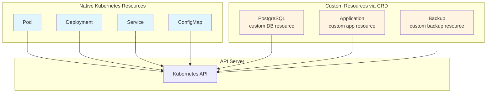
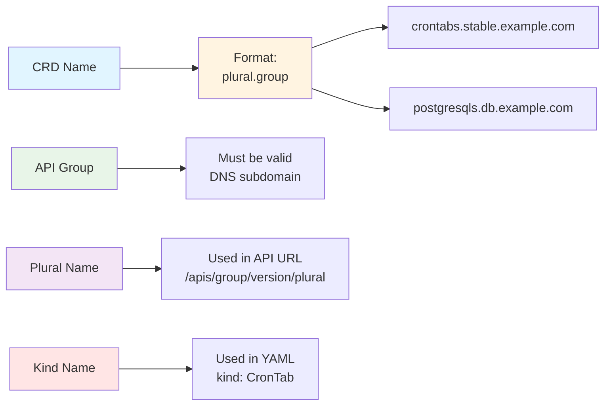
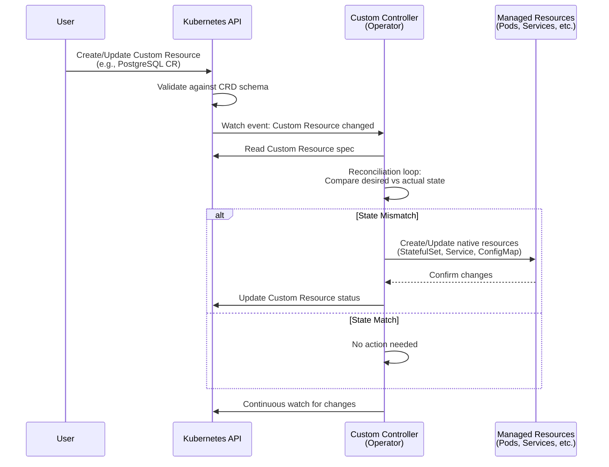

---
date:
  created: 2025-11-11
authors:
  - alf
categories:
  - Kubernetes
  - Architecture
tags:
  - kubernetes
  - k8s
  - cka-prep
  - architecture
readtime: 12
slug: custom-resources-operators-crds
---

# Custom Resources and Operators

**Extend Kubernetes functionality with CustomResourceDefinitions and the Operator pattern**

CustomResourceDefinitions (CRDs) allow you to extend the Kubernetes API with custom resource types, enabling you to treat domain-specific objects as native Kubernetes resources. Operators combine CRDs with custom controllers to automate complex application management tasks using Kubernetes-native patterns. For the CKA exam, you'll need to inspect existing CRDs, understand their structure, query custom resources, and troubleshoot CRD-related issues. This guide covers CRD anatomy, version management, validation, and practical operator concepts to help you master Kubernetes extensibility.

**CKA Exam Relevance**: Cluster Architecture, Installation & Configuration (25% of exam weight)

<!-- more -->

---

## 📋 What You'll Learn

- **CustomResourceDefinitions**: Extending the Kubernetes API
- **CRD Structure**: Schema, validation, versions, scope
- **Custom Resource Lifecycle**: Creating, querying, updating custom objects
- **Operator Pattern**: Controllers that manage custom resources
- **CRD Features**: Subresources, printer columns, categories, field selectors
- **Version Management**: Multiple API versions and conversion
- **Troubleshooting**: Common CRD issues and debugging techniques
- **CKA Exam Strategies**: Inspecting CRDs and querying custom resources

---

## 🎯 What Are Custom Resources?

**Custom Resources** extend Kubernetes by adding new resource types beyond the built-in ones (Pods, Services, Deployments, etc.).

### Native vs Custom Resources



**Why use Custom Resources?**
- **Domain-specific abstractions**: Model application-specific concepts
- **Declarative management**: Use kubectl and YAML like native resources
- **API consistency**: Leverage Kubernetes API patterns (CRUD, watch, list)
- **Ecosystem integration**: Work with Helm, GitOps, monitoring tools

---

## 📝 CustomResourceDefinition (CRD) Basics

A **CRD** defines a new custom resource type in Kubernetes.

### Simple CRD Example

```yaml
apiVersion: apiextensions.k8s.io/v1
kind: CustomResourceDefinition
metadata:
  name: crontabs.stable.example.com    # Must be <plural>.<group>
spec:
  group: stable.example.com             # API group
  versions:
  - name: v1                            # API version
    served: true                        # Accept requests for this version
    storage: true                       # Store objects in this version
    schema:
      openAPIV3Schema:                  # Validation schema
        type: object
        properties:
          spec:
            type: object
            properties:
              cronSpec:
                type: string
                pattern: '^(\d+|\*)(/\d+)?(\s+(\d+|\*)(/\d+)?){4}$'
              image:
                type: string
              replicas:
                type: integer
                minimum: 1
                maximum: 10
  scope: Namespaced                     # Namespaced or Cluster
  names:
    plural: crontabs                    # Used in URL: /apis/stable.example.com/v1/crontabs
    singular: crontab                   # Used in CLI: kubectl get crontab
    kind: CronTab                       # Used in YAML: kind: CronTab
    shortNames:
    - ct                                # Alias: kubectl get ct
```

```bash
# Apply CRD
kubectl apply -f crontab-crd.yaml

# Verify CRD exists
kubectl get crd crontabs.stable.example.com

# Describe CRD
kubectl describe crd crontabs.stable.example.com
```

### Creating Custom Resource Instances

Once the CRD is applied, you can create instances:

```yaml
apiVersion: stable.example.com/v1
kind: CronTab
metadata:
  name: my-cron-job
spec:
  cronSpec: "*/5 * * * *"
  image: my-cron-image:v1
  replicas: 3
```

```bash
# Create custom resource instance
kubectl apply -f my-crontab.yaml

# List custom resources
kubectl get crontabs
kubectl get ct              # Using short name

# Describe custom resource
kubectl describe crontab my-cron-job

# Delete custom resource
kubectl delete crontab my-cron-job
```

---

## 🏗️ CRD Structure Deep Dive

### CRD Naming Requirements



**Naming components**:
- **Group**: API group (e.g., `stable.example.com`, `db.example.com`)
- **Plural**: Plural resource name (e.g., `crontabs`, `postgresqls`)
- **Singular**: Singular name for CLI (e.g., `crontab`)
- **Kind**: CamelCase type name in YAML (e.g., `CronTab`)
- **Short names**: Aliases for kubectl (e.g., `ct`)

### Scope: Namespaced vs Cluster

```yaml
# Namespaced resource (most common)
spec:
  scope: Namespaced

# Cluster-scoped resource
spec:
  scope: Cluster
```

```bash
# Namespaced resources require -n flag
kubectl get crontabs -n production

# Cluster-scoped resources available globally
kubectl get storageclasses     # Example cluster-scoped native resource
```

**Choose scope based on resource semantics**:
- **Namespaced**: Application-specific resources (databases, applications)
- **Cluster**: Infrastructure resources (storage classes, cluster configs)

---

## ✅ Schema Validation

CRDs use **OpenAPI v3 schema** for validation:

```yaml
spec:
  versions:
  - name: v1
    schema:
      openAPIV3Schema:
        type: object
        required: ["spec"]            # Required fields
        properties:
          spec:
            type: object
            required: ["cronSpec", "image"]
            properties:
              cronSpec:
                type: string
                pattern: '^(\d+|\*)(/\d+)?(\s+(\d+|\*)(/\d+)?){4}$'  # Regex validation
              image:
                type: string
                minLength: 1          # String length validation
              replicas:
                type: integer
                minimum: 1            # Numeric validation
                maximum: 10
                default: 1            # Default value
```

**Validation features**:
- **Type checking**: string, integer, boolean, array, object
- **Required fields**: Enforce presence of fields
- **Pattern matching**: Regex for strings
- **Numeric constraints**: min, max, multipleOf
- **Enumerations**: Restrict to specific values
- **Default values**: Auto-populate missing fields

```bash
# Invalid resource rejected
cat <<EOF | kubectl apply -f -
apiVersion: stable.example.com/v1
kind: CronTab
metadata:
  name: invalid-cron
spec:
  cronSpec: "invalid cron syntax"    # Fails pattern validation
  replicas: 15                        # Exceeds maximum: 10
EOF
# Error: validation failure
```

---

## 📊 Additional Printer Columns

**Custom columns** in `kubectl get` output:

```yaml
spec:
  versions:
  - name: v1
    additionalPrinterColumns:
    - name: Spec
      type: string
      description: The cron spec
      jsonPath: .spec.cronSpec
    - name: Replicas
      type: integer
      description: Number of replicas
      jsonPath: .spec.replicas
    - name: Age
      type: date
      jsonPath: .metadata.creationTimestamp
```

```bash
# kubectl get output with custom columns
kubectl get crontabs

# Output:
# NAME           SPEC          REPLICAS   AGE
# my-cron-job    */5 * * * *   3          5m
# daily-backup   0 2 * * *     1          2d
```

**Common JSONPath expressions**:
- `.metadata.name`: Object name
- `.spec.field`: Spec field
- `.status.phase`: Status field
- `.metadata.creationTimestamp`: Creation time

---

## 🏷️ Categories and Short Names

### Categories

**Group custom resources** with built-in types:

```yaml
spec:
  names:
    categories:
    - all                # Included in 'kubectl get all'
    - databases          # Custom category
```

```bash
# List all resources including custom ones
kubectl get all

# List custom category
kubectl get databases
```

### Short Names

**Aliases for faster typing**:

```yaml
spec:
  names:
    shortNames:
    - ct                # kubectl get ct
    - crontab           # kubectl get crontab
```

---

## 🔄 Subresources

### Status Subresource

**Separate status updates** from spec changes:

```yaml
spec:
  versions:
  - name: v1
    subresources:
      status: {}        # Enable /status subresource
```

**Without status subresource**:
- Spec and status updated together
- No optimistic concurrency for status

**With status subresource**:
- Status updated via `/status` endpoint
- Separate resource versions for spec and status
- Optimistic concurrency control

```bash
# Update spec
kubectl edit crontab my-cron-job        # Updates .spec

# Update status (requires controller)
kubectl patch crontab my-cron-job --subresource=status \
  --type=merge -p '{"status":{"phase":"Running"}}'
```

### Scale Subresource

**Enable `kubectl scale` for custom resources**:

```yaml
spec:
  versions:
  - name: v1
    subresources:
      scale:
        specReplicasPath: .spec.replicas
        statusReplicasPath: .status.replicas
        labelSelectorPath: .status.labelSelector
```

```bash
# Scale custom resource
kubectl scale crontab my-cron-job --replicas=5

# Get current scale
kubectl get crontab my-cron-job -o jsonpath='{.spec.replicas}'
```

---

## 🔀 Multiple Versions

CRDs can serve **multiple API versions** simultaneously:

```yaml
apiVersion: apiextensions.k8s.io/v1
kind: CustomResourceDefinition
metadata:
  name: crontabs.stable.example.com
spec:
  group: stable.example.com
  versions:
  - name: v1
    served: true
    storage: true       # ONE version must be storage version
    schema:
      openAPIV3Schema:
        type: object
        properties:
          spec:
            type: object
            properties:
              cronSpec:
                type: string
              image:
                type: string
  - name: v1beta1
    served: true        # Accept requests
    storage: false      # Not stored, converted from v1
    deprecated: true    # Mark as deprecated
    deprecationWarning: "stable.example.com/v1beta1 is deprecated, use v1"
    schema:
      openAPIV3Schema:
        type: object
        properties:
          spec:
            type: object
            properties:
              schedule:   # Different field name in v1beta1
                type: string
  conversion:
    strategy: None      # Or Webhook for complex conversions
```

```bash
# Access v1 resource
kubectl get crontabs.v1.stable.example.com

# Access v1beta1 resource (with deprecation warning)
kubectl get crontabs.v1beta1.stable.example.com
# Warning: stable.example.com/v1beta1 is deprecated, use v1
```

**Conversion strategies**:
- **None**: All versions have identical schemas (field names match)
- **Webhook**: Custom conversion logic via webhook service

---

## 🤖 The Operator Pattern

**Operators** = CRDs + Custom Controllers



### Operator Example: PostgreSQL Operator

**1. Define CRD for PostgreSQL**:
```yaml
apiVersion: apiextensions.k8s.io/v1
kind: CustomResourceDefinition
metadata:
  name: postgresqls.db.example.com
spec:
  group: db.example.com
  versions:
  - name: v1
    served: true
    storage: true
    schema:
      openAPIV3Schema:
        type: object
        properties:
          spec:
            type: object
            properties:
              version:
                type: string
              storageSize:
                type: string
              replicas:
                type: integer
          status:
            type: object
            properties:
              phase:
                type: string
              ready:
                type: boolean
    subresources:
      status: {}
  scope: Namespaced
  names:
    plural: postgresqls
    singular: postgresql
    kind: PostgreSQL
    shortNames:
    - pg
```

**2. Create PostgreSQL instance**:
```yaml
apiVersion: db.example.com/v1
kind: PostgreSQL
metadata:
  name: production-db
spec:
  version: "14.5"
  storageSize: "10Gi"
  replicas: 3
```

**3. Operator controller reconciles**:
- Watches for PostgreSQL custom resources
- Creates StatefulSet for database pods
- Creates Services for database access
- Creates PVCs for persistent storage
- Creates ConfigMaps for configuration
- Manages backups, upgrades, scaling
- Updates `.status` with current state

### Operator Benefits

**Automation**:
- Complex lifecycle management (install, upgrade, backup, failover)
- Domain-specific logic encoded in controller
- Self-healing and auto-remediation

**Kubernetes-native**:
- Declarative configuration via YAML
- kubectl integration
- RBAC and auditing
- GitOps compatibility

---

## 🔍 Inspecting CRDs (CKA Essential)

### Listing CRDs

```bash
# List all CRDs in cluster
kubectl get crd
kubectl get customresourcedefinitions

# Filter by group
kubectl get crd | grep example.com

# Show CRD details
kubectl get crd crontabs.stable.example.com -o yaml

# Describe CRD (human-readable)
kubectl describe crd crontabs.stable.example.com
```

### Understanding CRD Output

```bash
kubectl get crd crontabs.stable.example.com

# Output columns:
# NAME                           CREATED AT
# crontabs.stable.example.com    2025-11-11T10:00:00Z

# Detailed view
kubectl get crd crontabs.stable.example.com -o yaml
```

**Key fields to inspect**:
```yaml
spec:
  group: stable.example.com
  versions:
  - name: v1
    served: true
    storage: true
  scope: Namespaced
  names:
    plural: crontabs
    kind: CronTab
status:
  conditions:
  - type: Established
    status: "True"               # CRD ready to use
  acceptedNames:                 # Names accepted by API server
    plural: crontabs
    kind: CronTab
  storedVersions:                # Versions used for storage
  - v1
```

### Querying Custom Resources

```bash
# List custom resources
kubectl get crontabs
kubectl get crontabs -A            # All namespaces
kubectl get crontabs -n production # Specific namespace

# Get specific resource
kubectl get crontab my-cron-job -o yaml

# Describe custom resource
kubectl describe crontab my-cron-job

# Use JSONPath for specific fields
kubectl get crontab my-cron-job -o jsonpath='{.spec.cronSpec}'

# Watch for changes
kubectl get crontabs --watch
```

---

## 🛠️ Troubleshooting CRDs

### Issue 1: CRD Not Found

**Error**:
```
error: the server doesn't have a resource type "crontabs"
```

**Diagnosis**:
```bash
# Check if CRD exists
kubectl get crd | grep crontab

# If missing, CRD not applied
kubectl get crd crontabs.stable.example.com
# Error: customresourcedefinitions.apiextensions.k8s.io "crontabs.stable.example.com" not found
```

**Solution**: Apply CRD first
```bash
kubectl apply -f crontab-crd.yaml
```

### Issue 2: Validation Failure

**Error**:
```
error: error validating "my-crontab.yaml": error validating data:
ValidationError(CronTab.spec.replicas): invalid type for com.example.stable.v1.CronTab.spec.replicas:
got "string", expected "integer"
```

**Diagnosis**:
```bash
# Check CRD schema
kubectl get crd crontabs.stable.example.com -o yaml | grep -A 20 openAPIV3Schema

# Verify required fields and types
```

**Solution**: Fix custom resource YAML to match schema
```yaml
spec:
  replicas: 3      # Integer, not "3" string
```

### Issue 3: CRD Not Established

**Error**:
```
error: the server could not find the requested resource
```

**Diagnosis**:
```bash
# Check CRD status
kubectl get crd crontabs.stable.example.com -o jsonpath='{.status.conditions[?(@.type=="Established")].status}'
# Output: False or missing

# Check conditions
kubectl describe crd crontabs.stable.example.com
```

**Common causes**:
- Invalid schema (OpenAPI v3 validation errors)
- Name conflicts with existing resources
- API server issues

**Solution**: Check API server logs
```bash
# On control plane node
kubectl logs -n kube-system kube-apiserver-<node> | grep -i crd

# Look for validation errors or conflicts
```

### Issue 4: Deleting CRD Deletes All Instances

**Behavior**: Deleting a CRD cascades to all custom resource instances:

```bash
# Delete CRD
kubectl delete crd crontabs.stable.example.com
# Deletes: crontabs.stable.example.com CRD
# Also deletes: ALL CronTab custom resources

# Trying to list custom resources
kubectl get crontabs
# Error: the server doesn't have a resource type "crontabs"
```

**Protection**: Use finalizers or backup custom resources before deleting CRD.

---

## 📝 CKA Exam Practice Exercises

### Exercise 1: Inspect Existing CRD

**Scenario**: A CRD named `applications.app.example.com` exists in the cluster. Find:
1. API group and version
2. Resource scope (Namespaced or Cluster)
3. Plural name and short names

<details>
<summary><b>Solution</b></summary>

```bash
# Get CRD details
kubectl get crd applications.app.example.com -o yaml

# Extract specific fields
echo "API Group:"
kubectl get crd applications.app.example.com -o jsonpath='{.spec.group}'
# Output: app.example.com

echo "Version(s):"
kubectl get crd applications.app.example.com -o jsonpath='{.spec.versions[*].name}'
# Output: v1 v1beta1

echo "Scope:"
kubectl get crd applications.app.example.com -o jsonpath='{.spec.scope}'
# Output: Namespaced

echo "Plural name:"
kubectl get crd applications.app.example.com -o jsonpath='{.spec.names.plural}'
# Output: applications

echo "Short names:"
kubectl get crd applications.app.example.com -o jsonpath='{.spec.names.shortNames[*]}'
# Output: app apps
```

</details>

---

### Exercise 2: List and Describe Custom Resources

**Scenario**: Using the `applications.app.example.com` CRD from Exercise 1, list all Application resources and describe one named `web-app`.

<details>
<summary><b>Solution</b></summary>

```bash
# List all Application resources
kubectl get applications
kubectl get app          # Using short name

# List in all namespaces
kubectl get applications -A

# Describe specific resource
kubectl describe application web-app

# Get YAML output
kubectl get application web-app -o yaml

# Get specific field (e.g., .spec.image)
kubectl get application web-app -o jsonpath='{.spec.image}'
```

</details>

---

### Exercise 3: Troubleshoot Missing Custom Resource

**Scenario**: You try to create a custom resource but get "error: the server doesn't have a resource type 'databases'". Diagnose and fix.

<details>
<summary><b>Solution</b></summary>

```bash
# Step 1: Check if CRD exists
kubectl get crd | grep database
# Output: (empty) - CRD missing

# Step 2: Find CRD name pattern (plural.group)
# Assuming group is db.example.com
kubectl get crd databases.db.example.com
# Error: not found

# Step 3: Check all CRDs for database-related resources
kubectl get crd -o jsonpath='{range .items[*]}{.metadata.name}{"\t"}{.spec.names.kind}{"\n"}{end}' | grep -i database

# Step 4: If CRD definition exists, apply it
kubectl apply -f database-crd.yaml

# Step 5: Verify CRD is established
kubectl get crd databases.db.example.com -o jsonpath='{.status.conditions[?(@.type=="Established")].status}'
# Output: True

# Step 6: Now create custom resource
kubectl apply -f my-database.yaml
```

</details>

---

### Exercise 4: Find Storage Version of CRD

**Scenario**: A CRD `crontabs.stable.example.com` has multiple versions. Find which version is used for storage.

<details>
<summary><b>Solution</b></summary>

```bash
# Method 1: Check spec.versions[].storage field
kubectl get crd crontabs.stable.example.com -o jsonpath='{.spec.versions[?(@.storage==true)].name}'
# Output: v1

# Method 2: Check status.storedVersions
kubectl get crd crontabs.stable.example.com -o jsonpath='{.status.storedVersions[*]}'
# Output: v1

# Method 3: View full CRD YAML
kubectl get crd crontabs.stable.example.com -o yaml | grep -A 2 "storage:"
# Output:
#   storage: true
#   name: v1
```

</details>

---

### Exercise 5: Check CRD Validation Schema

**Scenario**: Find the validation requirements for the `spec.replicas` field in `crontabs.stable.example.com` CRD.

<details>
<summary><b>Solution</b></summary>

```bash
# Extract schema for spec.replicas
kubectl get crd crontabs.stable.example.com -o yaml | \
  yq '.spec.versions[0].schema.openAPIV3Schema.properties.spec.properties.replicas'

# Output:
# type: integer
# minimum: 1
# maximum: 10
# default: 1

# Or using jsonpath (if yq not available)
kubectl get crd crontabs.stable.example.com \
  -o jsonpath='{.spec.versions[0].schema.openAPIV3Schema.properties.spec.properties.replicas}'

# Test validation with invalid value
cat <<EOF | kubectl apply -f -
apiVersion: stable.example.com/v1
kind: CronTab
metadata:
  name: test-validation
spec:
  cronSpec: "*/5 * * * *"
  image: test:v1
  replicas: 15    # Exceeds maximum: 10
EOF
# Error: validation failure
```

</details>

---

## 🎯 CKA Exam Tips

### Fast CRD Inspection

```bash
# List all CRDs quickly
kubectl get crd

# Get CRD details (memorize flags)
kubectl get crd <name> -o yaml          # Full YAML
kubectl describe crd <name>             # Human-readable
kubectl get crd <name> -o jsonpath='{...}'  # Specific fields

# Check CRD readiness
kubectl get crd <name> -o jsonpath='{.status.conditions[?(@.type=="Established")].status}'
```

### Custom Resource Queries

```bash
# List custom resources (use CRD plural name)
kubectl get <plural-name>
kubectl get <short-name>

# All namespaces
kubectl get <plural-name> -A

# Specific fields
kubectl get <plural-name> <name> -o jsonpath='{.spec.field}'
```

### Common Exam Patterns

1. **Inspect CRD**: `kubectl get crd <name> -o yaml`
2. **List custom resources**: `kubectl get <plural>`
3. **Check schema**: Look for `openAPIV3Schema`
4. **Find storage version**: Check `storage: true` in versions
5. **Verify CRD ready**: Check `status.conditions[].type: Established`

---

## 📚 Quick Reference

### CRD Essential Commands

```bash
# List CRDs
kubectl get crd
kubectl get customresourcedefinitions

# Get specific CRD
kubectl get crd <crd-name> -o yaml
kubectl describe crd <crd-name>

# Apply/Delete CRD
kubectl apply -f my-crd.yaml
kubectl delete crd <crd-name>          # ⚠️ Deletes all instances!

# List custom resources
kubectl get <plural-name>
kubectl get <plural-name> -A           # All namespaces
kubectl get <plural-name> -o wide      # Additional columns

# Manage custom resources
kubectl apply -f my-custom-resource.yaml
kubectl edit <kind> <name>
kubectl delete <kind> <name>
```

### CRD Inspection Checklist

```
✅ CRD exists: kubectl get crd <name>
✅ CRD established: Check status.conditions
✅ API group: spec.group
✅ Versions: spec.versions[].name
✅ Storage version: spec.versions[].storage == true
✅ Scope: spec.scope (Namespaced or Cluster)
✅ Names: spec.names (plural, singular, kind, shortNames)
✅ Schema: spec.versions[].schema.openAPIV3Schema
```

---

## 🔗 Related Resources

- **Previous**: [Post 16 - Security Contexts and Pod Security Standards](../security-contexts-pod-security-standards/)
- **Next**: Post 18 - Helm: Kubernetes Package Manager
- **Reference**: [Kubernetes CRD Documentation](https://kubernetes.io/docs/tasks/extend-kubernetes/custom-resources/custom-resource-definitions/)
- **Reference**: [Operator Pattern](https://kubernetes.io/docs/concepts/extend-kubernetes/operator/)
- **Series**: [Kubernetes CKA Mastery](../../kubernetes/)

---

## ✅ Key Takeaways

- **CRDs extend Kubernetes API** with custom resource types
- **Custom resources act like native resources** (kubectl, YAML, API)
- **Schema validation** ensures data integrity via OpenAPI v3
- **Operators** combine CRDs with controllers for automation
- **Multiple versions** enable API evolution with backward compatibility
- **Subresources** (status, scale) add advanced capabilities
- **CRD deletion cascades** to all custom resource instances
- **CKA exam tip**: Master `kubectl get crd` and custom resource queries

**Next Steps**: Package and deploy complex applications using Helm charts and templates.
