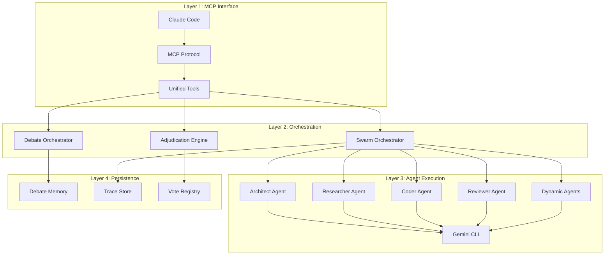
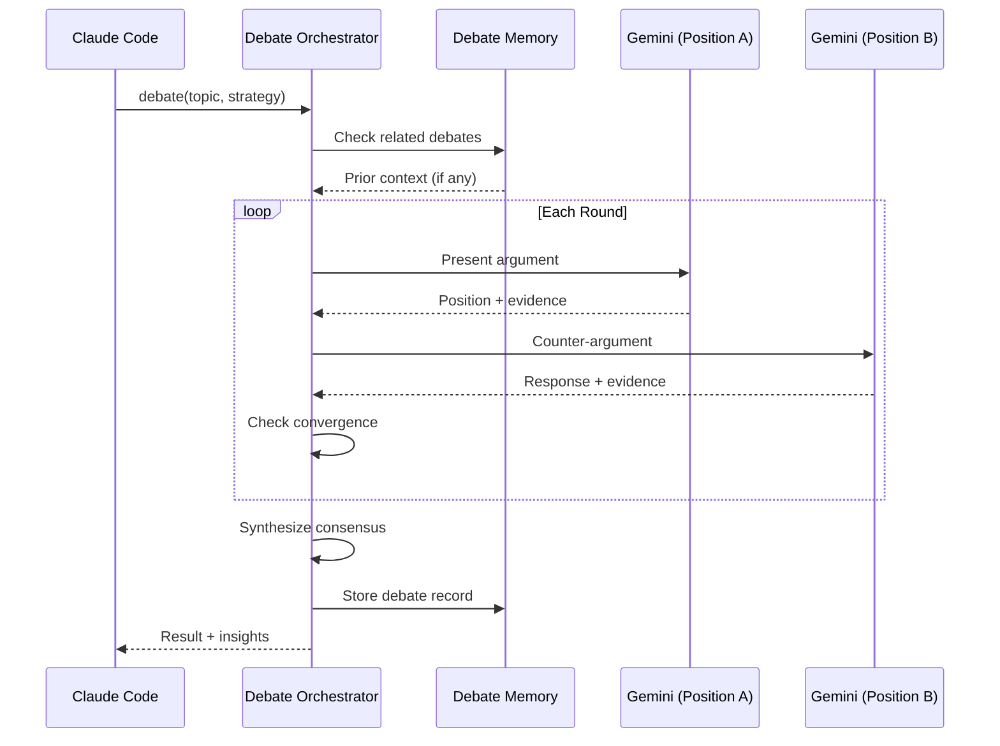
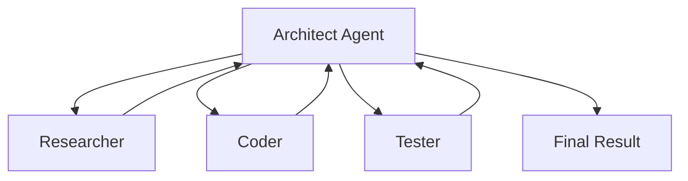
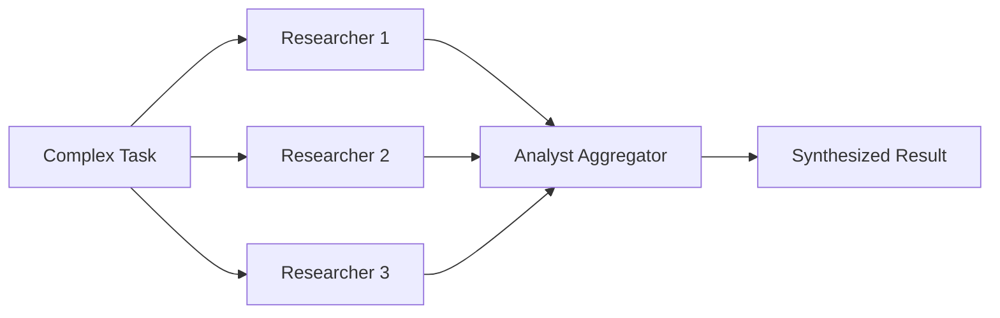
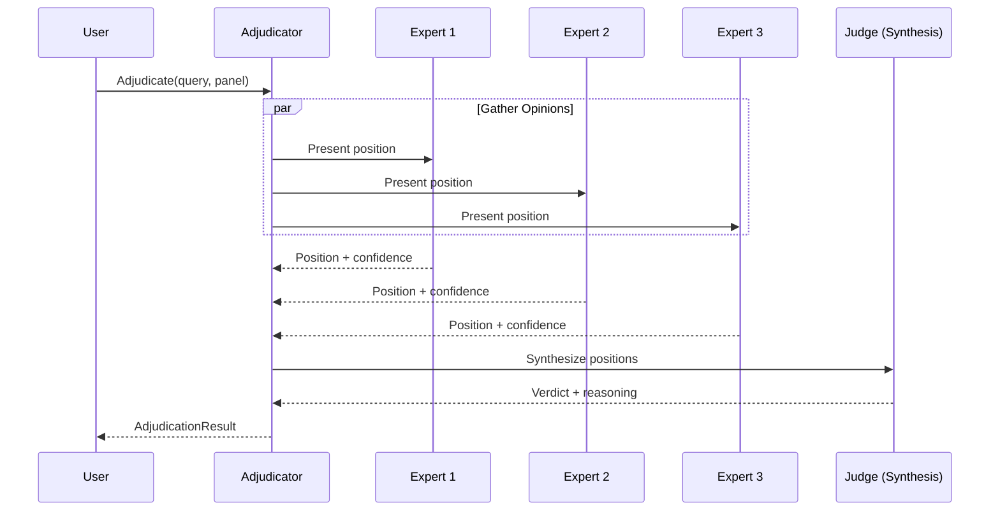
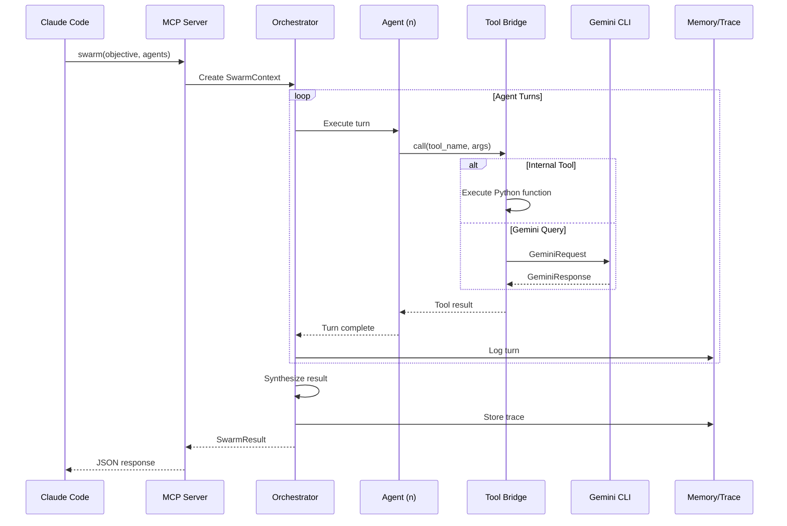

---
date:
  created: 2025-12-11
authors:
  - alf
categories:
  - AI
  - Architecture
tags:
  - claude-code
  - mcp
  - gemini
  - ai-agents
  - multi-agent
  - swarm
  - automation
  - llm
  - prompt-engineering
readtime: 25
slug: gemini-mcp-debate-swarm-architecture
social_image: assets/images/blog/ai-debate-gemini-mcp-swarm.jpg
---

# AI-to-AI Debates and Multi-Agent Swarms: Deep Dive into Gemini MCP Architecture

Building on the foundation of the Gemini MCP server, this post explores the advanced features that transform a simple AI wrapper into a sophisticated multi-agent orchestration platform. We'll examine the debate system with its voting mechanisms, the swarm architecture with specialized agents, and the complex information flows that enable AI-to-AI collaboration.

<!-- more -->

## The Problem with Single-Model AI

Even the most powerful AI models have blind spots. Claude excels at coding but has limited web search capabilities. Gemini offers native Google Search integration and a 1M token context window. By combining them, you get coverage across more problem domains.

But simple tool calling isn't enough. Complex decisions benefit from:

- **Multiple perspectives** on the same problem
- **Structured disagreement** to surface hidden assumptions
- **Consensus mechanisms** to synthesize insights
- **Specialized agents** for domain-specific analysis

This is where the debate and swarm systems come in.

## Architecture Overview: Three Layers of Intelligence



The system operates across four distinct layers:

1. **MCP Interface**: Claude Code communicates via the Model Context Protocol
2. **Orchestration**: High-level coordinators manage debates and swarms
3. **Agent Execution**: Specialized agents perform actual work
4. **Persistence**: Memory systems maintain state across sessions

---

## Part 1: The Debate System

### Why AI-to-AI Debates?

Human debates surface different perspectives and challenge assumptions. AI debates work similarly - by having AI instances argue different positions, you discover edge cases and considerations that a single model might miss.

The debate system supports four strategies:

| Strategy | Purpose | When to Use |
|----------|---------|-------------|
| **Collaborative** | Find common ground and synthesize | Default; most decisions |
| **Adversarial** | Stress-test ideas through opposition | High-risk architectural choices |
| **Socratic** | Question-based exploration | Learning and discovery |
| **Devil's Advocate** | Challenge the prevailing view | Prevent groupthink |

### Debate Architecture

```python
class DebateConfig(BaseModel):
    """Configuration for a debate session."""
    topic: str                              # What to debate
    strategy: DebateStrategy                # How to debate
    max_rounds: int = 10                    # Upper limit on rounds
    context: str = ""                       # Additional context
    novelty_threshold: float = 0.2          # Stop if arguments repeat
    repetition_threshold: float = 0.7       # Detect circular arguments
```

The orchestrator manages the debate lifecycle:



### Convergence Detection

The system automatically detects when a debate has reached productive conclusion:

```python
def _check_convergence(self, round_num: int) -> bool:
    """Determine if debate has converged or stalled."""
    if round_num < self.config.min_rounds:
        return False  # Force minimum discussion

    # Analyze recent arguments for repetition
    recent_args = self._get_recent_arguments(3)
    novelty_score = self._calculate_novelty(recent_args)

    if novelty_score < self.config.novelty_threshold:
        return True  # Arguments are repeating

    # Check for explicit agreement
    if self._detect_consensus_signals(recent_args):
        return True

    return False
```

Key metrics tracked:

- **Novelty Score**: Are new points being raised? (0-1 scale)
- **Repetition Score**: Are arguments circular? (0-1 scale)
- **Consensus Signals**: Explicit agreement phrases detected

### Debate Memory and Learning

Debates don't exist in isolation. The memory system enables:

1. **Context Retrieval**: Related past debates inform new ones
2. **Pattern Learning**: Common consensus patterns are extracted
3. **Cross-Session Persistence**: Insights survive between sessions

```python
class DebateMemory:
    """Persistent storage for debate records and insights."""

    def find_related_debates(
        self,
        topic: str,
        limit: int = 5
    ) -> list[RelatedDebate]:
        """Find debates related to this topic."""
        # Semantic search over past debates
        # Returns relevance-scored matches

    def get_context_summary(
        self,
        topic: str,
        max_tokens: int = 2000
    ) -> str:
        """Generate context from related debates."""
        related = self.find_related_debates(topic)
        # Synthesize key insights from related debates
        # Compress to token budget
```

---

## Part 2: Swarm Multi-Agent Orchestration

While debates work well for discussions, complex tasks need specialized agents working together. The swarm system coordinates multiple AI agents with different capabilities.

### Agent Types and Specializations

The system supports both predefined and dynamic agents:

```python
class AgentType(str, Enum):
    """Predefined specialized agent types."""
    RESEARCHER = "researcher"   # Web search, docs lookup
    CODER = "coder"             # Code generation, review
    ANALYST = "analyst"         # Data analysis, patterns
    REVIEWER = "reviewer"       # Quality gates, validation
    ARCHITECT = "architect"     # Design, task decomposition
    TESTER = "tester"           # Test automation
    DOCUMENTER = "documenter"   # Documentation, reporting
```

Each agent type has:

- **Unique system prompt** defining personality and expertise
- **Tool access list** limiting capabilities
- **Model selection** (Pro for complex tasks, Flash for quick ones)

### Persona System

Agents are configured via markdown persona files:

```markdown
# Kubernetes Reliability Expert

## Role
Senior SRE specializing in Kubernetes, Helm, and Cloud Native infrastructure.

## Capabilities & Focus
- Manifest Auditing: Review YAML for security contexts and resource limits
- Troubleshooting: Analyze kubectl outputs, logs, and events
- Helm: Design clean, reusable charts
- GitOps: Enforce declarative infrastructure patterns

## Directives
1. Security First: Check runAsNonRoot, readOnlyRootFilesystem
2. Resource Safety: Never allow pods without requests/limits
3. Zero Downtime: Recommend RollingUpdate and PodDisruptionBudgets
4. Clarity: Provide concrete kubectl commands or YAML snippets

## Tone
Professional, paranoid (in a good way), and precise.
```

The system includes 25+ predefined personas covering:

- Infrastructure (Kubernetes, DevOps, DBA)
- Development (Coder, Tester, Reviewer)
- Analysis (Analyst, Data Scientist, Researcher)
- Architecture (Architect, ML Engineer, Systems Engineer)

### Swarm Topologies

Agents can coordinate in different patterns:

```python
class SwarmTopology(str, Enum):
    """How agents coordinate."""
    HIERARCHICAL = "hierarchical"  # Manager delegates to workers
    SEQUENTIAL = "sequential"      # A -> B -> C pipeline
    PARALLEL = "parallel"          # All agents work simultaneously
    CONSENSUS = "consensus"        # Agents vote/debate for decisions
```

#### Hierarchical Topology



The Architect decomposes tasks, delegates to specialists, and synthesizes results.

#### Parallel Topology with Aggregation



Multiple agents work simultaneously, then an aggregator synthesizes findings.

### The Tool Bridge Pattern

A critical insight: agents running inside the MCP server can't call MCP tools externally (that would create recursion). The Tool Bridge solves this:

```python
class ToolBridge:
    """Bridge providing tool access for swarm agents."""

    def __init__(self):
        self._tools: dict[str, Callable] = {}
        self._schemas: dict[str, dict] = {}
        self._register_tools()

    def call(self, tool_name: str, **kwargs) -> Any:
        """Call a tool by name - direct Python invocation."""
        if tool_name not in self._tools:
            raise KeyError(f"Unknown tool: {tool_name}")
        return self._tools[tool_name](**kwargs)
```

The bridge wraps Python functions directly, avoiding network overhead:

| Tool | Purpose | Agent Access |
|------|---------|--------------|
| `web_search` | Search the web | Researcher, Analyst |
| `search_docs` | Library documentation | All agents |
| `analyze_code` | Code review | Coder, Reviewer |
| `read_file` | File access | All agents |
| `ask_gemini` | Direct Gemini queries | All agents |
| `spawn_agent` | Create dynamic agents | Architect only |
| `delegate` | Hand off to other agent | Architect only |
| `delegate_parallel` | Parallel delegation | Architect only |

### Dynamic Agent Spawning

The Architect can create specialized agents on-the-fly:

```python
def _spawn_agent(
    self,
    name: str,
    instructions: str,
    tools: list[str] | None = None,
) -> dict:
    """Spawn a new dynamic agent."""
    registry = get_agent_registry()

    agent = registry.register_dynamic_agent(
        name=name,
        system_prompt=instructions,
        tools=set(tools) if tools else None
    )

    return {
        "action": "spawn_agent",
        "name": agent.name,
        "status": "created"
    }
```

This enables creating mission-specific experts:

```
# Example: Architect spawns a security expert mid-mission
spawn_agent(
    name="SecurityAuditor",
    instructions="""You are a security expert specializing in:
    - OWASP Top 10 vulnerabilities
    - Authentication/authorization patterns
    - Secrets management
    Focus on practical, actionable recommendations.""",
    tools=["analyze_code", "web_search", "search_docs"]
)
```

---

## Part 3: Adjudication and Voting Mechanisms

For decisions requiring consensus, the adjudication system provides structured voting.

### Adjudication Strategies

```python
class AdjudicationStrategy(str, Enum):
    """Consensus strategies for panel decisions."""
    UNANIMOUS = "unanimous"        # All must agree
    MAJORITY = "majority"          # >50% agreement
    SUPREME_COURT = "supreme_court"  # Judge synthesizes after debate
```

### Panel Voting Structure

```python
class PanelVote(BaseModel):
    """A vote from a panel member."""
    persona: str        # Which expert voted
    position: str       # Their argument/reasoning
    vote: str | None    # Their final vote
    confidence: float   # 0-1 confidence in their vote

class AdjudicationResult(BaseModel):
    """Result from adjudication."""
    trace_id: str
    query: str
    strategy: AdjudicationStrategy

    # Panel deliberation
    panel_votes: list[PanelVote] = []

    # Final decision
    verdict: str
    reasoning: str
    confidence: float  # Aggregate confidence
    dissenting_opinions: list[str] = []

    # Vote metrics
    vote_counts: dict[str, int] = {"agree": 0, "disagree": 0, "abstain": 0}
    consensus_score: float = 0.0  # 0-100%
```

### Confidence Calculation

Confidence isn't just vote counting - it factors in:

1. **Individual confidence**: How sure is each expert?
2. **Expert relevance**: Does this expert's domain match the question?
3. **Argument quality**: Are positions well-reasoned?
4. **Consensus strength**: How uniform are the votes?

```python
def calculate_consensus_score(votes: list[PanelVote]) -> float:
    """Calculate weighted consensus score."""
    if not votes:
        return 0.0

    # Weight votes by confidence
    weighted_votes = {}
    for vote in votes:
        if vote.vote not in weighted_votes:
            weighted_votes[vote.vote] = 0.0
        weighted_votes[vote.vote] += vote.confidence

    total_weight = sum(weighted_votes.values())
    if total_weight == 0:
        return 0.0

    # Consensus = weight of majority position / total weight
    max_weight = max(weighted_votes.values())
    return (max_weight / total_weight) * 100
```

### Supreme Court Strategy

The most sophisticated adjudication strategy:



The Judge doesn't simply count votes - it:

1. Weighs the strength of each argument
2. Identifies areas of genuine disagreement
3. Synthesizes a position that addresses concerns
4. Documents dissenting opinions

---

## Part 4: Information Flow and Execution

### The Complete Request Flow



### Context Isolation for Parallel Execution

When running agents in parallel, shared mutable state causes race conditions. The solution:

```python
async def _execute_parallel_tasks(
    self,
    tasks: list[SwarmTask],
    context: SwarmContext
) -> list[str]:
    """Execute tasks in parallel with isolated contexts."""

    async def run_isolated(task: SwarmTask) -> str:
        # Create isolated context copy
        isolated_ctx = context.model_copy(deep=True)
        isolated_ctx.tasks = [task]

        # Execute with isolation
        agent = self._get_agent(task.assigned_to)
        result = await self._run_agent_turn(agent, isolated_ctx)

        return result

    # Run all tasks concurrently
    results = await asyncio.gather(
        *[run_isolated(task) for task in tasks],
        return_exceptions=True
    )

    return results
```

Key principles:

1. **Deep copy contexts** before parallel execution
2. **Shared memory is read-only** during parallel phase
3. **Results aggregated** by a single agent afterward

### Heartbeat Mechanism for Long Operations

Complex swarm operations can run for minutes. To prevent client timeouts:

```python
async def run_with_heartbeat(
    self,
    operation: Coroutine,
    interval: int = 10
) -> Any:
    """Run operation with periodic heartbeats."""

    async def heartbeat_loop():
        elapsed = 0
        while True:
            await asyncio.sleep(interval)
            elapsed += interval
            await self._send_progress(f"Working... {elapsed}s")

    heartbeat_task = asyncio.create_task(heartbeat_loop())

    try:
        result = await operation
        return result
    finally:
        heartbeat_task.cancel()
```

---

## Part 5: Persistence and Memory

### Trace Storage

Every swarm execution produces a trace for debugging and auditing:

```python
class ExecutionTrace(BaseModel):
    """Full execution trace."""
    trace_id: str
    objective: str

    # Timeline
    start_time: datetime
    end_time: datetime | None
    status: TaskStatus

    # Execution details
    agents_used: list[AgentType | str]
    topology: SwarmTopology

    # Full history
    messages: list[AgentMessage]
    tasks: list[SwarmTask]

    # Final output
    result: str | None
    error: str | None

    # Metrics
    total_turns: int
    tool_calls_count: int
```

Traces are stored as JSON files organized by date:

```
~/.gemini-mcp/swarm/
├── logs/
│   └── traces/
│       ├── 2025-12-11/
│       │   ├── abc123.json
│       │   └── def456.json
│       └── 2025-12-10/
│           └── ghi789.json
└── archive/
    └── 2025-11/
        └── old-trace.json.gz
```

### Automatic Archival

Old traces are compressed to save space:

```python
def archive_old_traces(self) -> int:
    """Archive traces older than retention period."""
    cutoff = datetime.now() - timedelta(days=self.config.archive_after_days)
    archived_count = 0

    for date_dir in self.traces_dir.iterdir():
        dir_date = datetime.strptime(date_dir.name, "%Y-%m-%d")

        if dir_date < cutoff:
            for trace_file in date_dir.glob("*.json"):
                # Compress and move to archive
                archive_path = self.archive_dir / date_dir.name / f"{trace_file.name}.gz"

                with open(trace_file, "rb") as f_in:
                    with gzip.open(archive_path, "wb") as f_out:
                        shutil.copyfileobj(f_in, f_out)

                trace_file.unlink()
                archived_count += 1

    return archived_count
```

---

## Lessons Learned: Engineering Insights

Building this system surfaced several critical patterns:

### 1. The "Headless Hang" Problem

**Issue**: Gemini CLI prompts for tool approval in interactive mode. In headless containers, this causes infinite hangs.

**Solution**: Force `--yolo` mode for automated execution, but enforce safety through tool access lists per agent type.

### 2. Recursion Prevention

**Issue**: The container's Gemini CLI could connect back to the MCP server, creating infinite loops.

**Solution**: Clear MCP server configuration inside containers - make the internal CLI a "dumb pipe" to the model.

### 3. The "Completion Loop" Trap

**Issue**: Agents call `complete`, receive JSON result, then continue working and call `complete` again.

**Solution**: Intercept `complete` tool calls and immediately terminate the execution loop.

### 4. LLM Output Robustness

**Issue**: Even with strict prompting, LLMs output JSON wrapped in markdown fences or with invalid escaping.

**Solution**: Robust parsing layer that strips fences and fixes common JSON errors before parsing.

### 5. Transport Protocol Selection

**Issue**: `stdio` transport (default) proved fragile in Docker - pipe buffering and signal handling caused silent failures.

**Solution**: Standardize on SSE (Server-Sent Events) transport for container deployments. HTTP provides better debugging and monitoring.

---

## Usage Examples

### Simple Debate

```
# From Claude Code
debate(
    topic="Should we use microservices or a monolith for this application?",
    strategy="adversarial",
    context="Building a new e-commerce platform, team of 5, expected 10K daily users"
)
```

### Swarm Mission

```
# Complex multi-agent task
swarm(
    objective="Analyze our authentication system for security vulnerabilities and propose improvements",
    agents=["researcher", "coder", "reviewer"],
    context="Python FastAPI backend, JWT tokens, PostgreSQL user store"
)
```

### Panel Adjudication

```
# Expert panel decision
swarm_adjudicate(
    query="What's the best approach for handling rate limiting in our API?",
    panel=["architect", "coder", "devops_engineer"],
    strategy="supreme_court"
)
```

---

## Conclusion

The combination of debate systems, swarm orchestration, and adjudication mechanisms transforms a simple AI wrapper into a sophisticated reasoning platform. Key innovations include:

1. **Strategy-based debates** with convergence detection
2. **Dynamic agent spawning** for mission-specific expertise
3. **Confidence-weighted voting** for consensus decisions
4. **Context isolation** for safe parallel execution
5. **Robust persistence** with automatic archival

This architecture demonstrates that the future of AI assistance isn't a single, monolithic model - it's coordinated teams of specialized agents that can debate, vote, and synthesize to produce better outcomes than any individual AI.

The patterns explored here - tool bridges, heartbeat mechanisms, context isolation - are applicable beyond this specific implementation. They represent general solutions for building reliable multi-agent AI systems.

---

**Related Posts:**

- [Building a Gemini MCP Server](/blog/2025/11/29/building-gemini-mcp-server/)
- [Claude Code Profiles Architecture](/blog/2025/11/29/claude-code-profiles-architecture/)
- [Multi-Agent Workflows with claude-flow](/blog/2025/11/29/claude-flow-multi-agent-workflows/)

**Resources:**

- [Model Context Protocol Specification](https://modelcontextprotocol.io)
- [FastMCP Documentation](https://github.com/jlowin/fastmcp)
- [Gemini CLI](https://github.com/google-gemini/gemini-cli)
