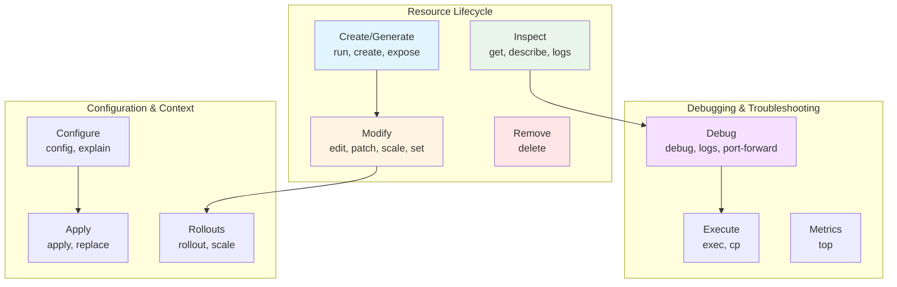
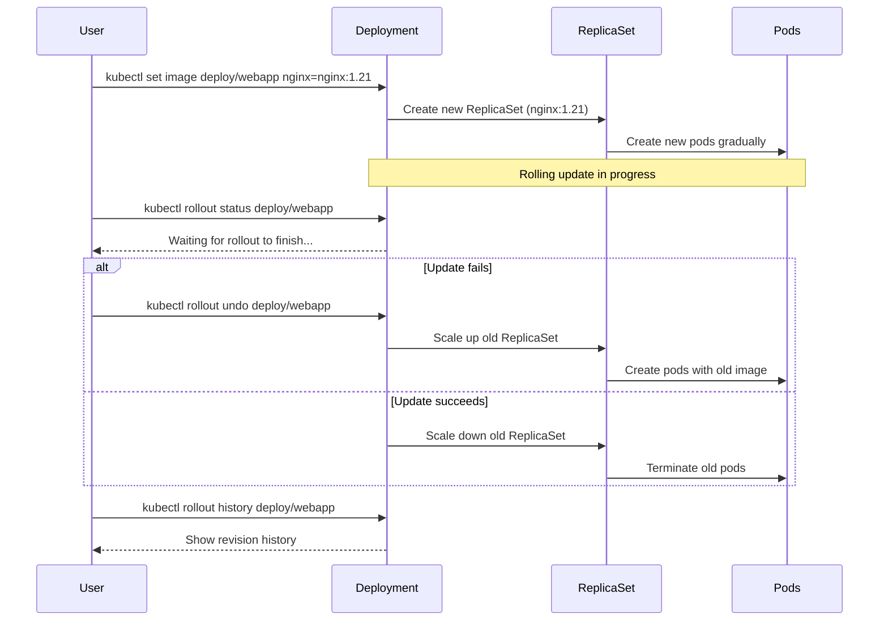
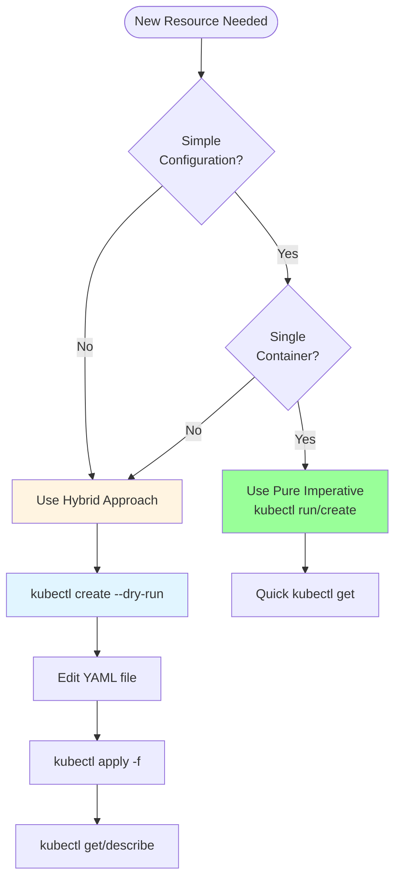
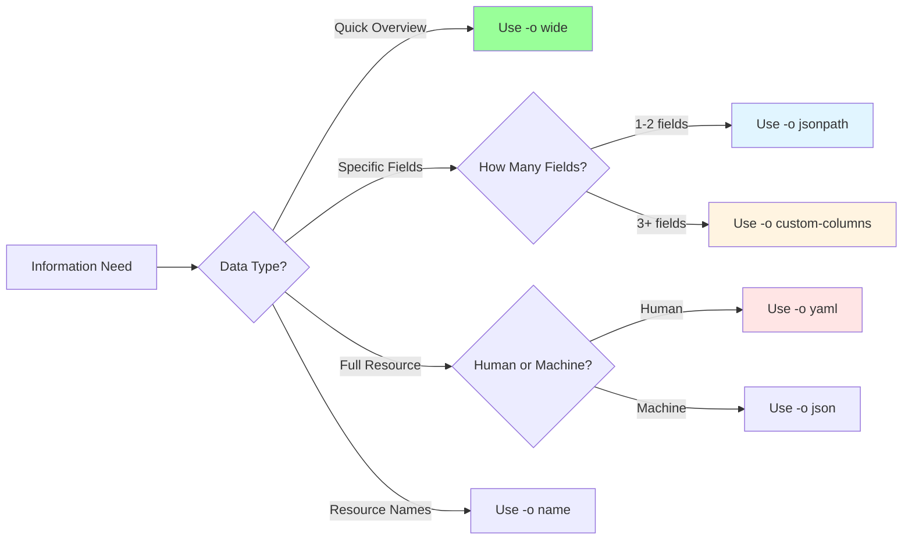
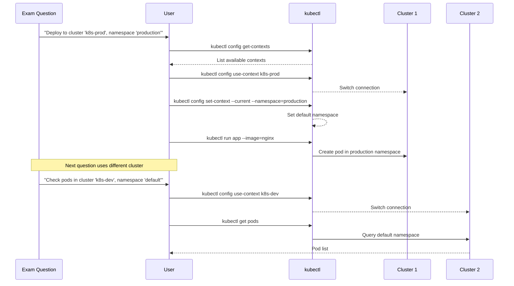

---
date:
  created: 2025-11-11
authors:
  - alf
categories:
  - Kubernetes
  - CLI
tags:
  - kubernetes
  - k8s
  - cka-prep
  - kubectl
  - command-line
readtime: 13
slug: kubectl-essentials
---

# kubectl Essentials: Your Kubernetes Swiss Army Knife

Master kubectl for CKA exam success. Learn imperative commands for speed, output formats for precision, and productivity patterns that save critical exam minutes.

<!-- more -->

## Overview

kubectl is the command-line interface to Kubernetes and your primary tool during the CKA exam. While the exam allows access to official documentation, proficiency with kubectl commands determines whether you finish in time.

**CKA Exam Domain**: All domains (kubectl is used for every task)

**Key Insight**: CKA exam success correlates directly with kubectl speed. Candidates who master imperative commands and output formats consistently score higher and finish with time to spare.

**What You'll Learn**:
- Essential kubectl commands by category
- Imperative vs declarative approaches for exam efficiency
- Output formats and JSONPath for data extraction
- Context and namespace management patterns
- kubectl explain for in-exam documentation
- Time-saving aliases and autocomplete workflows

---

## Command Categories Overview

kubectl commands follow functional patterns that map to exam task types.



---

## Essential Commands by Category

### Resource Creation Commands

#### kubectl run (Pods)

**Purpose**: Create pods imperatively - fastest method for simple pods

```bash
# Basic pod creation
kubectl run nginx --image=nginx

# Pod with port specification
kubectl run nginx --image=nginx --port=80

# Pod with labels
kubectl run nginx --image=nginx --labels="app=web,tier=frontend"

# Pod with environment variables
kubectl run nginx --image=nginx --env="DB_HOST=mysql" --env="DB_PORT=3306"

# Generate YAML without creating (CRITICAL for exam)
kubectl run nginx --image=nginx --dry-run=client -o yaml > pod.yaml
```

**Exam Pattern**: Use `--dry-run=client -o yaml` to generate templates, then edit as needed.

#### kubectl create (Workloads)

**Purpose**: Generate deployments, jobs, services with imperative commands

```bash
# Deployment creation
kubectl create deployment webapp --image=nginx --replicas=3

# Job creation
kubectl create job hello --image=busybox:1.28 -- echo "Hello World"

# CronJob creation
kubectl create cronjob hello \
  --image=busybox:1.28 \
  --schedule="*/5 * * * *" \
  -- /bin/sh -c "date; echo Hello from CronJob"

# Service creation
kubectl create service clusterip my-service --tcp=8080:80
kubectl create service nodeport my-service --tcp=8080:80 --node-port=30080

# ConfigMap from literals
kubectl create configmap app-config \
  --from-literal=env=production \
  --from-literal=debug=false

# Secret creation
kubectl create secret generic db-secret \
  --from-literal=username=admin \
  --from-literal=password=secretpass

# All with YAML generation
kubectl create deployment webapp --image=nginx --dry-run=client -o yaml > deploy.yaml
```

#### kubectl expose (Services)

**Purpose**: Expose existing resources as services

```bash
# Expose pod
kubectl expose pod nginx --port=80 --type=NodePort

# Expose deployment
kubectl expose deployment webapp --port=80 --target-port=8080 --type=LoadBalancer

# Expose with specific name
kubectl expose deployment webapp --port=80 --name=web-service --type=ClusterIP

# Generate service YAML
kubectl expose deployment webapp --port=80 --dry-run=client -o yaml > service.yaml
```

### Resource Inspection Commands

#### kubectl get (List Resources)

**Purpose**: Query cluster state - most frequently used command

```bash
# Basic resource listing
kubectl get pods                        # Current namespace
kubectl get pods -A                     # All namespaces
kubectl get pods -n kube-system        # Specific namespace
kubectl get all                         # All resources in namespace

# Wide output (additional columns)
kubectl get pods -o wide                # Shows IP, Node, etc.
kubectl get nodes -o wide              # Shows internal IP, OS, etc.

# Show labels
kubectl get pods --show-labels

# Filter by labels
kubectl get pods -l app=nginx
kubectl get pods -l 'env in (dev,staging)'
kubectl get pods -l app=nginx,tier!=frontend

# Multiple resource types
kubectl get pods,services,deployments
kubectl get deploy,rs,pods
```

**Output Formats** (covered in detail later):
- `-o wide` - Additional columns
- `-o yaml` - Full YAML representation
- `-o json` - Full JSON representation
- `-o name` - Resource names only
- `-o custom-columns` - User-defined columns
- `-o jsonpath` - JSONPath expressions

#### kubectl describe (Detailed Information)

**Purpose**: Get detailed resource information with events

```bash
# Describe resources
kubectl describe pod nginx
kubectl describe node worker-1
kubectl describe deployment webapp
kubectl describe service my-service

# Describe from file
kubectl describe -f deployment.yaml

# Common use case: debugging
kubectl describe pod failing-pod  # Check Events section for issues
```

**Key Information in describe Output**:
- **Events**: Recent state changes, errors, scheduling decisions
- **Status**: Current resource state
- **Spec**: Resource configuration
- **Conditions**: Health checks and readiness

### Resource Modification Commands

#### kubectl edit (Interactive Editing)

**Purpose**: Edit resources in your default editor

```bash
# Edit pod
kubectl edit pod nginx

# Edit deployment
kubectl edit deployment webapp

# Edit with specific editor
KUBE_EDITOR="vim" kubectl edit service my-service
```

**Exam Tip**: `kubectl edit` opens full resource YAML. Use with caution - easy to accidentally modify important fields. Prefer `kubectl patch` or `kubectl set` for targeted changes.

#### kubectl patch (Partial Updates)

**Purpose**: Update specific fields without full resource replacement

```bash
# Update image
kubectl patch pod nginx -p '{"spec":{"containers":[{"name":"nginx","image":"nginx:1.21"}]}}'

# Scale using patch
kubectl patch deployment webapp -p '{"spec":{"replicas":5}}'

# Strategic merge patch (default)
kubectl patch deployment webapp --type=strategic -p '{"spec":{"replicas":3}}'

# JSON patch
kubectl patch deployment webapp --type=json -p='[{"op": "replace", "path": "/spec/replicas", "value":5}]'
```

#### kubectl scale (Replica Management)

**Purpose**: Change replica count for deployments, replica sets

```bash
# Scale deployment
kubectl scale deployment webapp --replicas=5

# Scale replica set
kubectl scale rs my-replicaset --replicas=3

# Scale from file
kubectl scale --replicas=3 -f deployment.yaml

# Conditional scaling
kubectl scale deployment webapp --current-replicas=3 --replicas=5
```

#### kubectl set (Update Resource Fields)

**Purpose**: Update specific resource fields with simple syntax

```bash
# Update image
kubectl set image deployment/webapp nginx=nginx:1.21
kubectl set image deployment/webapp nginx=nginx:1.21 --record

# Update resources
kubectl set resources deployment webapp \
  --limits=cpu=200m,memory=512Mi \
  --requests=cpu=100m,memory=256Mi

# Update service account
kubectl set serviceaccount deployment webapp my-service-account

# Update selector
kubectl set selector service my-service app=nginx,tier=frontend
```

### Deployment Management Commands

#### kubectl rollout (Deployment Updates)

**Purpose**: Manage deployment rollouts and history

```bash
# Check rollout status
kubectl rollout status deployment/webapp
kubectl rollout status deployment/webapp --watch

# View rollout history
kubectl rollout history deployment/webapp
kubectl rollout history deployment/webapp --revision=3

# Undo rollout (rollback)
kubectl rollout undo deployment/webapp                    # Rollback to previous
kubectl rollout undo deployment/webapp --to-revision=2    # Rollback to specific

# Restart deployment (rolling restart)
kubectl rollout restart deployment/webapp

# Pause/Resume rollout
kubectl rollout pause deployment/webapp
kubectl rollout resume deployment/webapp
```

**Exam Scenario Flow**:


### Debugging Commands

#### kubectl logs (Container Logs)

**Purpose**: View container stdout/stderr logs

```bash
# Basic logs
kubectl logs pod-name
kubectl logs pod-name -c container-name        # Multi-container pods

# Follow logs (stream)
kubectl logs -f pod-name

# Previous container instance (after crash)
kubectl logs pod-name --previous
kubectl logs pod-name -c container-name --previous

# Logs from deployment
kubectl logs deployment/webapp
kubectl logs deployment/webapp -c nginx

# Logs with labels
kubectl logs -l app=nginx                      # All pods with label
kubectl logs -f -l app=nginx --all-containers  # Stream all containers

# Tail last N lines
kubectl logs pod-name --tail=50
kubectl logs pod-name --since=1h              # Last hour
kubectl logs pod-name --since-time=2024-01-01T00:00:00Z
```

#### kubectl exec (Execute Commands)

**Purpose**: Run commands inside containers

```bash
# Single command
kubectl exec pod-name -- ls /app
kubectl exec pod-name -- env
kubectl exec pod-name -- cat /etc/resolv.conf

# Interactive shell
kubectl exec -it pod-name -- /bin/bash
kubectl exec -it pod-name -- /bin/sh

# Multi-container pod
kubectl exec -it pod-name -c container-name -- /bin/bash

# Deployment exec (first pod)
kubectl exec deployment/webapp -- env
kubectl exec -it deployment/webapp -- /bin/bash
```

**Common Exam Patterns**:
```bash
# Check pod networking
kubectl exec -it pod-name -- ping google.com
kubectl exec -it pod-name -- nslookup kubernetes.default

# Verify volume mounts
kubectl exec pod-name -- ls /mnt/data

# Test service connectivity
kubectl exec -it pod-name -- curl http://service-name:8080
```

#### kubectl port-forward (Local Access)

**Purpose**: Forward local port to pod/service for debugging

```bash
# Forward to pod
kubectl port-forward pod/nginx 8080:80        # Local:8080 -> Pod:80

# Forward to service
kubectl port-forward service/webapp 8080:80

# Forward to deployment
kubectl port-forward deployment/webapp 8080:80

# Listen on all interfaces (use with caution)
kubectl port-forward --address 0.0.0.0 pod/nginx 8080:80
```

#### kubectl debug (Ephemeral Containers)

**Purpose**: Debug running pods with ephemeral debugging containers

```bash
# Debug pod with new container
kubectl debug pod-name -it --image=busybox:1.28

# Debug node
kubectl debug node/worker-1 -it --image=ubuntu

# Copy pod and debug
kubectl debug pod-name --copy-to=pod-name-debug --container=debugger --image=busybox
```

---

## Imperative vs Declarative: Exam Strategy

The CKA exam requires balancing speed with maintainability. Understanding when to use each approach is critical.

### Imperative Commands (Recommended for CKA)

**Definition**: Direct CLI commands that immediately execute operations

**Advantages**:
- Fast execution (30-60 seconds vs 2-3 minutes)
- No file management overhead
- Perfect for exam time constraints
- Easy to remember patterns

**Disadvantages**:
- Not reproducible
- No version control
- Limited complexity handling

**Exam Use Cases**:
```bash
# Simple pod creation
kubectl run nginx --image=nginx

# Quick deployment
kubectl create deployment webapp --image=nginx --replicas=3

# Expose service
kubectl expose deployment webapp --port=80 --type=NodePort

# Scale resources
kubectl scale deployment webapp --replicas=5

# Update image
kubectl set image deployment/webapp nginx=nginx:1.21
```

### Declarative Configuration (Limited Exam Use)

**Definition**: YAML manifests describing desired state, applied with `kubectl apply`

**Advantages**:
- Reproducible deployments
- Version controllable
- Handles complex configurations
- Production best practice

**Disadvantages**:
- Slower for simple tasks
- File management overhead
- Verbose for basic operations

**Exam Use Cases**:
```bash
# Complex multi-container pods
kubectl apply -f complex-pod.yaml

# Resources with specific configurations
kubectl apply -f deployment-with-resources.yaml

# Multiple related resources
kubectl apply -f ./manifests/
```

### Hybrid Approach (Optimal for CKA)

**Strategy**: Use imperative commands to generate YAML templates, edit as needed, then apply.

```bash
# 1. Generate base YAML
kubectl run nginx --image=nginx --dry-run=client -o yaml > pod.yaml

# 2. Edit for specific requirements
vim pod.yaml
# Add: resource limits, volumes, labels, etc.

# 3. Apply declaratively
kubectl apply -f pod.yaml

# 4. Verify
kubectl get pods
kubectl describe pod nginx
```

**Time Comparison**:

| Task | Purely Imperative | Hybrid Approach | Pure Declarative |
|------|------------------|-----------------|------------------|
| Simple pod | 10 seconds | 30 seconds | 2 minutes |
| Deployment with 3 replicas | 15 seconds | 45 seconds | 3 minutes |
| Pod with volumes + resources | Impossible | 90 seconds | 4 minutes |
| Multi-container pod | Impossible | 2 minutes | 5 minutes |

### Decision Tree: Imperative vs Declarative



---

## Output Formats: Extracting Information

kubectl supports multiple output formats for data extraction. Mastering these saves critical exam time.

### Standard Output Formats

#### Default (Human-Readable)

```bash
kubectl get pods
# NAME        READY   STATUS    RESTARTS   AGE
# nginx       1/1     Running   0          5m
# webapp-1    2/2     Running   1          10m
```

#### Wide Output

```bash
kubectl get pods -o wide
# NAME     READY   STATUS    RESTARTS   AGE   IP           NODE       NOMINATED NODE
# nginx    1/1     Running   0          5m    10.244.0.5   worker-1   <none>
```

**Use Case**: Get pod IPs, node placement, readiness gates in one view

#### YAML Output

```bash
kubectl get pod nginx -o yaml
```

**Use Cases**:
- Create templates from existing resources
- Understand full resource structure
- Debug configuration issues
- Generate manifests for reproduction

#### JSON Output

```bash
kubectl get pod nginx -o json
```

**Use Cases**:
- Programmatic parsing
- Integration with scripts
- API response inspection

#### Name Output

```bash
kubectl get pods -o name
# pod/nginx
# pod/webapp-1
# pod/webapp-2
```

**Use Case**: Pipe to other commands, scripting

### Advanced Output Formats

#### Custom Columns

**Purpose**: Define exactly which fields to display in table format

**Basic Syntax**:
```bash
kubectl get pods -o custom-columns=<COLUMN_NAME>:<JSON_PATH>
```

**Examples**:
```bash
# Pod name and image
kubectl get pods -o custom-columns=NAME:.metadata.name,IMAGE:.spec.containers[0].image

# Pod name, namespace, node
kubectl get pods -A -o custom-columns=NAMESPACE:.metadata.namespace,NAME:.metadata.name,NODE:.spec.nodeName

# Multiple container images
kubectl get pods -o custom-columns=NAME:.metadata.name,IMAGES:.spec.containers[*].image

# Filter with JSONPath
kubectl get pods -A -o custom-columns='POD:.metadata.name,IMAGE:.spec.containers[?(@.image!="registry.k8s.io/pause:3.9")].image'
```

**Common Patterns**:
```bash
# Service types and IPs
kubectl get svc -o custom-columns=NAME:.metadata.name,TYPE:.spec.type,CLUSTER-IP:.spec.clusterIP,EXTERNAL-IP:.status.loadBalancer.ingress[0].ip

# Node resource capacity
kubectl get nodes -o custom-columns=NAME:.metadata.name,CPU:.status.capacity.cpu,MEMORY:.status.capacity.memory

# PV claim status
kubectl get pv -o custom-columns=NAME:.metadata.name,CAPACITY:.spec.capacity.storage,STATUS:.status.phase,CLAIM:.spec.claimRef.name
```

#### JSONPath Queries

**Purpose**: Extract specific data using JSONPath expressions

**Basic Syntax**:
```bash
kubectl get <resource> -o jsonpath='{<JSONPath_expression>}'
```

**Essential Patterns**:

```bash
# All pod names
kubectl get pods -o jsonpath='{.items[*].metadata.name}'

# First pod name
kubectl get pods -o jsonpath='{.items[0].metadata.name}'

# Pod IPs with newlines
kubectl get pods -o jsonpath='{range .items[*]}{.status.podIP}{"\n"}{end}'

# Node names and CPU capacity
kubectl get nodes -o jsonpath='{range .items[*]}{.metadata.name}{"\t"}{.status.capacity.cpu}{"\n"}{end}'

# Filter by condition
kubectl get pods -o jsonpath='{.items[?(@.metadata.labels.app=="nginx")].metadata.name}'

# All container images (unique)
kubectl get pods -A -o jsonpath='{.items[*].spec.containers[*].image}' | tr ' ' '\n' | sort -u

# Service cluster IPs
kubectl get svc -o jsonpath='{range .items[*]}{.metadata.name}{"\t"}{.spec.clusterIP}{"\n"}{end}'
```

**Complex Examples**:
```bash
# Pods with high restart counts
kubectl get pods -o jsonpath='{range .items[?(@.status.containerStatuses[0].restartCount>5)]}{.metadata.name}{"\t"}{.status.containerStatuses[0].restartCount}{"\n"}{end}'

# Users from kubeconfig
kubectl config view -o jsonpath='{.users[*].name}'

# Context cluster mapping
kubectl config view -o jsonpath='{range .contexts[*]}{.name}{"\t"}{.context.cluster}{"\n"}{end}'
```

**JSONPath Tips**:
- Use `{range}...{end}` for iteration
- Use `{\n}` for newlines, `{\t}` for tabs
- Filter with `[?(@.field=="value")]`
- Access array elements with `[index]` or `[*]` for all
- No regex support in JSONPath

### Output Format Comparison



---

## Context and Namespace Management

Managing multiple clusters and namespaces efficiently is a core CKA exam skill.

### Understanding Contexts

**Context Definition**: A context groups cluster + user + namespace into a named configuration.

**Context Components**:
- **Cluster**: API server endpoint and CA certificate
- **User**: Authentication credentials (client cert, token, etc.)
- **Namespace**: Default namespace for commands (optional)

### Context Management Commands

```bash
# List all contexts
kubectl config get-contexts
# CURRENT   NAME           CLUSTER        AUTHINFO       NAMESPACE
# *         prod-context   prod-cluster   prod-admin     production
#           dev-context    dev-cluster    dev-user       development

# Show current context
kubectl config current-context
# prod-context

# Switch context
kubectl config use-context dev-context

# Create new context
kubectl config set-context staging \
  --cluster=prod-cluster \
  --user=staging-user \
  --namespace=staging

# Modify existing context
kubectl config set-context dev-context --namespace=testing

# Set namespace for current context
kubectl config set-context --current --namespace=kube-system

# Delete context
kubectl config delete-context old-context

# Rename context
kubectl config rename-context old-name new-name
```

### Namespace Operations

```bash
# List namespaces
kubectl get namespaces
kubectl get ns  # Short form

# Create namespace
kubectl create namespace development
kubectl create ns production

# Describe namespace
kubectl describe namespace development

# Delete namespace (deletes all resources!)
kubectl delete namespace development
```

### Multi-Cluster Workflow



### Namespace Best Practices

**Always Specify Namespace Explicitly (Exam Safety)**:
```bash
# Risky (uses context default)
kubectl get pods

# Safe (explicit namespace)
kubectl get pods -n production
kubectl get pods --namespace=production

# All namespaces
kubectl get pods -A
kubectl get pods --all-namespaces
```

**Context Switching Aliases (Pre-configured in Exam)**:
```bash
# Context switcher
alias kx='f() { [ "$1" ] && kubectl config use-context $1 || kubectl config current-context ; } ; f'

# Usage:
kx                  # Show current context
kx prod-context     # Switch to prod-context

# Namespace switcher
alias kn='f() { [ "$1" ] && kubectl config set-context --current --namespace $1 || kubectl config view --minify | grep namespace | cut -d" " -f6 ; } ; f'

# Usage:
kn                  # Show current namespace
kn production       # Switch to production namespace
```

**Exam Verification Checklist**:
```bash
# Before EVERY task, verify:
kubectl config current-context          # Am I in the right cluster?
kubectl config view --minify | grep namespace  # What's my default namespace?

# Or use the exam-provided aliases:
kx  # Show context
kn  # Show namespace
```

---

## kubectl explain: In-Exam Documentation

kubectl explain provides API documentation directly in your terminal. **This tool is available during the exam and is faster than searching web docs.**

### Basic Usage

```bash
# Top-level resource
kubectl explain pod
kubectl explain deployment
kubectl explain service

# Nested field
kubectl explain pod.spec
kubectl explain deployment.spec.template
kubectl explain service.spec
```

### Exploring Resource Structure

```bash
# View pod spec fields
kubectl explain pod.spec
# FIELDS:
#   containers    <[]Container> -required-
#   volumes       <[]Volume>
#   restartPolicy <string>
#   nodeName      <string>

# Drill into containers
kubectl explain pod.spec.containers
# FIELDS:
#   name          <string> -required-
#   image         <string> -required-
#   command       <[]string>
#   args          <[]string>
#   env           <[]EnvVar>
#   ports         <[]ContainerPort>
#   volumeMounts  <[]VolumeMount>

# Check container ports structure
kubectl explain pod.spec.containers.ports
# FIELDS:
#   containerPort <integer> -required-
#   hostPort      <integer>
#   name          <string>
#   protocol      <string>
```

### Common Exam Use Cases

**Scenario 1: What fields are available for liveness probes?**
```bash
kubectl explain pod.spec.containers.livenessProbe
# Shows: exec, httpGet, tcpSocket, initialDelaySeconds, periodSeconds, etc.

kubectl explain pod.spec.containers.livenessProbe.httpGet
# Shows: path, port, host, scheme, httpHeaders
```

**Scenario 2: How to configure deployment strategy?**
```bash
kubectl explain deployment.spec.strategy
# Shows: type (RollingUpdate, Recreate), rollingUpdate

kubectl explain deployment.spec.strategy.rollingUpdate
# Shows: maxSurge, maxUnavailable
```

**Scenario 3: What volume types are available?**
```bash
kubectl explain pod.spec.volumes
# Shows MANY types: configMap, secret, emptyDir, persistentVolumeClaim, hostPath, nfs, etc.

kubectl explain pod.spec.volumes.persistentVolumeClaim
# Shows: claimName, readOnly
```

**Scenario 4: Resource limits and requests?**
```bash
kubectl explain pod.spec.containers.resources
# Shows: limits, requests

kubectl explain pod.spec.containers.resources.limits
# Shows: can specify cpu, memory, ephemeral-storage
```

### Field Type Notation

**Understanding Output**:
- `<string>` - String field
- `<integer>` - Integer field
- `<boolean>` - Boolean (true/false)
- `<[]Type>` - Array of Type
- `<Object>` - Nested object
- `<map[string]string>` - Key-value map
- `-required-` - Required field marker

### Integration with Workflow

**Exam Pattern**:
```bash
# 1. Generate base template
kubectl run nginx --image=nginx --dry-run=client -o yaml > pod.yaml

# 2. Check available fields
kubectl explain pod.spec.containers.resources

# 3. Edit with correct field names
vim pod.yaml
# Add resources based on explain output

# 4. Verify and apply
kubectl apply -f pod.yaml
```

---

## Productivity Patterns

### Time-Saving Aliases (Pre-configured in Exam)

**Core Alias (Already Active)**:
```bash
alias k=kubectl
complete -o default -F __start_kubectl k
```

**Recommended Personal Additions**:
```bash
# Dry-run YAML generation
export dry='--dry-run=client -o yaml'
export now='--force --grace-period=0'

# Usage examples:
k run nginx --image=nginx $dry > pod.yaml
k create deploy webapp --image=nginx $dry > deploy.yaml
k delete pod nginx $now  # Immediate deletion
```

**Resource Shortcuts**:
```bash
alias kgp='kubectl get pods'
alias kgd='kubectl get deployments'
alias kgs='kubectl get services'
alias kga='kubectl get all'
alias kgpa='kubectl get pods -A'

alias kdesc='kubectl describe'
alias kl='kubectl logs'
alias klf='kubectl logs -f'
alias kex='kubectl exec -it'
```

### Autocomplete Usage (Pre-configured)

**Tab Completion Examples**:
```bash
# Resource type completion
k get po<TAB>            # Completes to: k get pods
k get dep<TAB>           # Completes to: k get deployments

# Resource name completion
k get pods ng<TAB>       # Completes to existing pod name
k describe node wor<TAB> # Completes to node name

# Namespace completion
k get pods -n kube-<TAB> # Completes to: k get pods -n kube-system

# Flag completion
k get pods --out<TAB>    # Completes to: k get pods --output
```

### Common Command Patterns

**Deployment Lifecycle**:
```bash
# Create
kubectl create deployment webapp --image=nginx --replicas=3

# Expose
kubectl expose deployment webapp --port=80 --type=NodePort

# Update
kubectl set image deployment/webapp nginx=nginx:1.21

# Scale
kubectl scale deployment webapp --replicas=5

# Check status
kubectl rollout status deployment/webapp

# Rollback if needed
kubectl rollout undo deployment/webapp
```

**Debugging Workflow**:
```bash
# 1. Identify issue
kubectl get pods                # Find problematic pod

# 2. Get details
kubectl describe pod pod-name   # Check Events section

# 3. Check logs
kubectl logs pod-name           # Current logs
kubectl logs pod-name --previous # After crash

# 4. Interactive debug
kubectl exec -it pod-name -- /bin/sh

# 5. Network test
kubectl exec -it pod-name -- ping service-name
kubectl exec -it pod-name -- curl http://service:8080
```

---

## CKA Exam Strategies

### Essential Commands (Use Daily)

**Top 10 Most-Used in Exam**:
1. `kubectl run` - Create pods quickly
2. `kubectl create` - Generate resources
3. `kubectl get` - List and inspect
4. `kubectl describe` - Debug issues
5. `kubectl logs` - View application logs
6. `kubectl apply` - Deploy configurations
7. `kubectl delete` - Remove resources
8. `kubectl exec` - Container debugging
9. `kubectl edit` - Quick modifications
10. `kubectl explain` - Field reference

### Time Management

**Command Time Budget**:
- Simple pod creation: 10-30 seconds
- Deployment with service: 45-90 seconds
- Complex multi-container pod: 2-3 minutes
- Debugging scenario: 3-5 minutes

**Speed Optimization**:
```bash
# SLOW (2-3 minutes)
vim pod.yaml  # Write from scratch
kubectl apply -f pod.yaml

# FAST (30 seconds)
kubectl run nginx --image=nginx $dry > pod.yaml
vim pod.yaml  # Edit generated template
kubectl apply -f pod.yaml
```

### Common Exam Scenarios

**Scenario 1: Create and Expose**
```bash
# Create deployment
kubectl create deployment webapp --image=nginx --replicas=3

# Expose service
kubectl expose deployment webapp --port=80 --type=NodePort

# Verify
kubectl get deploy,svc,pods
```

**Scenario 2: Fix Failing Pod**
```bash
# Identify
kubectl get pods
kubectl describe pod failing-pod
kubectl logs failing-pod

# Fix approach
kubectl get pod failing-pod -o yaml > fix.yaml
vim fix.yaml  # Fix the issue
kubectl delete pod failing-pod
kubectl apply -f fix.yaml
```

**Scenario 3: Scale and Update**
```bash
# Scale
kubectl scale deployment webapp --replicas=5

# Update image
kubectl set image deployment/webapp nginx=nginx:1.21

# Monitor rollout
kubectl rollout status deployment/webapp

# Rollback if needed
kubectl rollout undo deployment/webapp
```

---

## Practice Exercises

### Exercise 1: Command Mastery (15 minutes)

**Objective**: Build muscle memory for essential commands

**Tasks**:
1. Create pod 'web' with nginx:1.21 image and port 80
2. Create deployment 'api' with 3 replicas using httpd image
3. Expose 'api' deployment as NodePort on port 8080
4. Get all pod IPs using JSONPath
5. List pod names only
6. Scale 'api' to 5 replicas
7. Update 'api' image to httpd:2.4.57
8. View rollout history
9. Delete all resources

**Solution**:
```bash
# 1
kubectl run web --image=nginx:1.21 --port=80

# 2
kubectl create deployment api --image=httpd --replicas=3

# 3
kubectl expose deployment api --port=8080 --type=NodePort

# 4
kubectl get pods -o jsonpath='{range .items[*]}{.status.podIP}{"\n"}{end}'

# 5
kubectl get pods -o name

# 6
kubectl scale deployment api --replicas=5

# 7
kubectl set image deployment/api httpd=httpd:2.4.57

# 8
kubectl rollout history deployment/api

# 9
kubectl delete deployment api
kubectl delete pod web
kubectl delete service api
```

### Exercise 2: Output Formats (20 minutes)

**Objective**: Master data extraction with output formats

**Tasks**:
1. List all pod names in kube-system namespace
2. Get pod names and node placement with custom columns
3. Extract all container images in cluster
4. Get services with type and cluster IP
5. Find pods with label app=nginx

**Solution**:
```bash
# 1
kubectl get pods -n kube-system -o name

# 2
kubectl get pods -A -o custom-columns=POD:.metadata.name,NODE:.spec.nodeName

# 3
kubectl get pods -A -o jsonpath='{.items[*].spec.containers[*].image}' | tr ' ' '\n' | sort -u

# 4
kubectl get svc -o custom-columns=NAME:.metadata.name,TYPE:.spec.type,CLUSTER-IP:.spec.clusterIP

# 5
kubectl get pods -l app=nginx
```

### Exercise 3: Context Management (15 minutes)

**Objective**: Practice multi-cluster context switching

**Tasks**:
1. List all contexts
2. Show current context
3. Create context 'dev-ctx' for development namespace
4. Switch to 'dev-ctx'
5. Set default namespace to 'kube-system' for current context
6. Verify namespace setting

**Solution**:
```bash
# 1
kubectl config get-contexts

# 2
kubectl config current-context

# 3
kubectl config set-context dev-ctx --namespace=development

# 4
kubectl config use-context dev-ctx

# 5
kubectl config set-context --current --namespace=kube-system

# 6
kubectl config view --minify | grep namespace
```

### Exercise 4: Imperative vs Declarative (25 minutes)

**Objective**: Practice hybrid workflow

**Tasks**:
1. Generate pod YAML for nginx with resource limits (don't create)
2. Add resource requests: cpu=100m, memory=128Mi
3. Add resource limits: cpu=200m, memory=256Mi
4. Add liveness probe: HTTP GET on port 80, path /
5. Apply and verify
6. Generate deployment YAML with 3 replicas
7. Modify to add nodeSelector: disk=ssd
8. Apply and verify pods scheduled on correct nodes

**Solution**:
```bash
# 1
kubectl run nginx --image=nginx --dry-run=client -o yaml > pod.yaml

# 2-4 (edit pod.yaml)
vim pod.yaml
# Add under containers:
#   resources:
#     requests:
#       cpu: 100m
#       memory: 128Mi
#     limits:
#       cpu: 200m
#       memory: 256Mi
#   livenessProbe:
#     httpGet:
#       path: /
#       port: 80

# 5
kubectl apply -f pod.yaml
kubectl describe pod nginx

# 6
kubectl create deployment webapp --image=nginx --replicas=3 --dry-run=client -o yaml > deploy.yaml

# 7
vim deploy.yaml
# Add under spec.template.spec:
#   nodeSelector:
#     disk: ssd

# 8
kubectl apply -f deploy.yaml
kubectl get pods -o wide
```

### Exercise 5: Debugging Simulation (30 minutes)

**Objective**: Practice troubleshooting workflow

**Tasks**:
1. Create pod with wrong image name
2. Identify why pod is failing
3. Get YAML and fix
4. Create deployment, then break it by scaling to 100 replicas
5. Observe pending pods
6. Identify resource constraints
7. Fix by scaling down

**Solution**:
```bash
# 1
kubectl run broken --image=nginxxx  # Wrong image

# 2
kubectl get pods
kubectl describe pod broken  # Check Events: ImagePullBackOff

# 3
kubectl get pod broken -o yaml > fixed.yaml
vim fixed.yaml  # Change image to nginx
kubectl delete pod broken
kubectl apply -f fixed.yaml

# 4
kubectl create deployment overload --image=nginx
kubectl scale deployment overload --replicas=100

# 5
kubectl get pods | grep Pending

# 6
kubectl describe pod <pending-pod-name>
# Events show: Insufficient cpu/memory

# 7
kubectl scale deployment overload --replicas=3
```

---

## Quick Reference

### Command Syntax Patterns

```bash
# Resource Management
kubectl <verb> <resource> <name> [options]
kubectl get pods nginx -o yaml
kubectl describe deployment webapp

# Imperative Creation
kubectl run <name> --image=<image> [options]
kubectl create <resource> <name> [options]
kubectl expose <resource> <name> [options]

# Declarative Operations
kubectl apply -f <file>
kubectl delete -f <file>

# Resource Modification
kubectl edit <resource> <name>
kubectl patch <resource> <name> -p '<patch>'
kubectl scale <resource> <name> --replicas=<n>
kubectl set image <resource>/<name> <container>=<image>

# Debugging
kubectl logs <pod> [-c <container>] [options]
kubectl exec <pod> [-c <container>] -- <command>
kubectl port-forward <resource> <local>:<remote>

# Context & Config
kubectl config <subcommand>
kubectl config use-context <context>
kubectl config set-context --current --namespace=<ns>
```

### Output Format Quick Reference

```bash
# Standard formats
-o wide               # Additional columns
-o yaml               # Full YAML
-o json               # Full JSON
-o name               # Resource names only

# Advanced formats
-o custom-columns=<spec>
-o jsonpath='{<path>}'
-o jsonpath-file=<file>

# Examples
kubectl get pods -o wide
kubectl get pods -o jsonpath='{.items[*].metadata.name}'
kubectl get pods -o custom-columns=NAME:.metadata.name,IP:.status.podIP
```

### Common Flags

```bash
-n, --namespace         # Specify namespace
-A, --all-namespaces    # All namespaces
-l, --selector          # Label selector
-f, --filename          # File path
--dry-run=client        # Don't create, just print
-o, --output            # Output format
-w, --watch             # Watch for changes
--sort-by               # Sort output
--field-selector        # Field selector
```

---

## Key Takeaways

✅ **Imperative commands save exam minutes** - Use `kubectl run`, `create`, `expose` for speed

✅ **--dry-run=client -o yaml is critical** - Generate templates, never write YAML from scratch

✅ **kubectl explain is your friend** - Faster than searching docs during exam

✅ **Output formats extract data precisely** - Master JSONPath and custom-columns

✅ **Context awareness prevents mistakes** - Always verify cluster and namespace

✅ **Autocomplete is pre-configured** - Use tab completion aggressively

✅ **Aliases save time only if practiced** - Use `k`, `$dry`, `$now` extensively before exam

✅ **Hybrid approach balances speed and complexity** - Imperative generation + declarative application

✅ **Verification is non-negotiable** - Always check resources created correctly

✅ **Practice makes permanent** - Build muscle memory through repetition

---

## Next Steps

After mastering kubectl, continue with:

**[Post 4: Pod Lifecycle and Management](../pod-lifecycle-management/)** - Deep dive into the fundamental Kubernetes workload unit

---

**Related Posts**:
- [Kubernetes Architecture Fundamentals](../kubernetes-architecture-fundamentals/) - Understanding cluster components
- [Setting Up Your Kubernetes Lab](../setting-up-kubernetes-lab/) - Build your practice environment
- [Kubernetes CKA Mastery - Complete Learning Path](../../kubernetes/) - Full exam preparation series

**External Resources**:
- [kubectl Official Documentation](https://kubernetes.io/docs/reference/kubectl/)
- [kubectl Cheat Sheet](https://kubernetes.io/docs/reference/kubectl/cheatsheet/)
- [kubectl Commands Reference](https://kubernetes.io/docs/reference/generated/kubectl/kubectl-commands)
- [JSONPath Support in kubectl](https://kubernetes.io/docs/reference/kubectl/jsonpath/)
- [CKA Exam Curriculum](https://github.com/cncf/curriculum)
