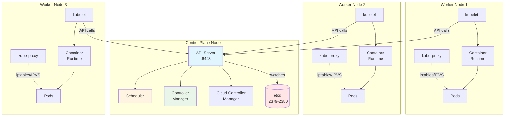
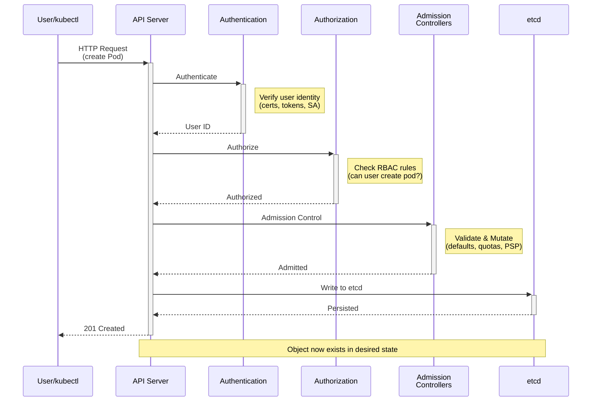
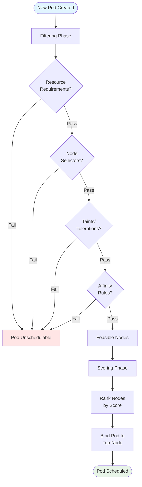
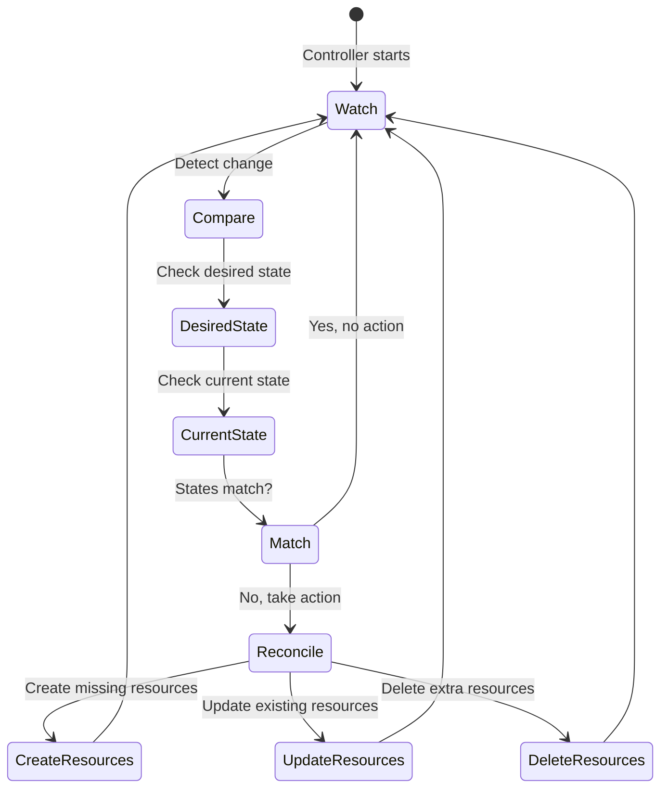
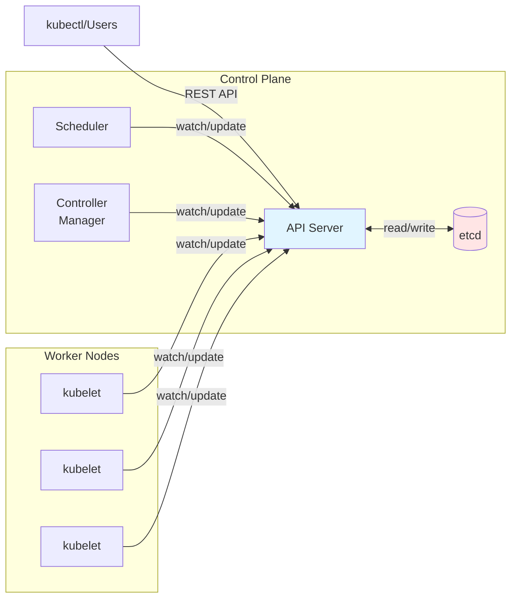

---
date:
  created: 2025-11-11
authors:
  - alf
categories:
  - Kubernetes
  - Architecture
tags:
  - kubernetes
  - k8s
  - cka-prep
  - architecture
  - control-plane
  - kubectl
readtime: 15
slug: kubernetes-architecture-fundamentals
---

# Kubernetes Architecture Fundamentals

Deep dive into Kubernetes cluster architecture, control plane components, and the distributed systems design that powers container orchestration at scale.

<!-- more -->

## Overview

Kubernetes is a distributed system designed to manage containerized applications across a cluster of machines. Understanding its architecture is foundational for the CKA exam and real-world cluster administration.

**CKA Exam Domain**: Cluster Architecture, Installation & Configuration (25%)

---

## Cluster Architecture

A Kubernetes cluster consists of two types of nodes:

1. **Control Plane Nodes**: Run the core components that manage the cluster
2. **Worker Nodes**: Run application workloads (pods)



---

## Control Plane Components

The control plane makes global decisions about the cluster and detects/responds to cluster events.

### 1. API Server (kube-apiserver)

**Purpose**: Front-end for the Kubernetes control plane. All communication goes through the API server.

**Key Responsibilities**:
- Exposes the Kubernetes API (REST interface)
- Validates and configures API objects (pods, services, replication controllers)
- Serves as the only component that directly interacts with etcd
- Handles authentication, authorization, and admission control

**Default Port**: `6443` (HTTPS)

```bash
# Check API server status
kubectl get --raw='/healthz?verbose'

# View API server configuration
kubectl -n kube-system get pod kube-apiserver-<node-name> -o yaml

# Check API server logs
kubectl -n kube-system logs kube-apiserver-<node-name>
```

**API Request Flow**:



### 2. etcd

**Purpose**: Consistent, highly-available key-value store used as Kubernetes' backing store for all cluster data.

**Key Characteristics**:
- Distributed consensus using Raft algorithm
- Stores all cluster state and configuration
- Only the API server writes to etcd
- Supports watch operations for real-time updates

**Default Ports**:
- `2379` - Client requests
- `2380` - Server-to-server communication

```bash
# Check etcd cluster health
ETCDCTL_API=3 etcdctl \
  --endpoints=https://127.0.0.1:2379 \
  --cacert=/etc/kubernetes/pki/etcd/ca.crt \
  --cert=/etc/kubernetes/pki/etcd/server.crt \
  --key=/etc/kubernetes/pki/etcd/server.key \
  endpoint health

# List etcd members
ETCDCTL_API=3 etcdctl member list

# Get all keys (see what's stored)
ETCDCTL_API=3 etcdctl get / --prefix --keys-only

# Backup etcd
ETCDCTL_API=3 etcdctl snapshot save snapshot.db
```

**High Availability**: For production clusters, run etcd with at least 3 nodes (odd number for quorum).

### 3. Scheduler (kube-scheduler)

**Purpose**: Watches for newly created pods with no assigned node and selects a node for them to run on.

**Scheduling Algorithm**:
1. **Filtering**: Find nodes that satisfy pod requirements (feasible nodes)
   - Resource requests (CPU, memory)
   - Node selectors
   - Taints and tolerations
   - Affinity/anti-affinity rules

2. **Scoring**: Rank feasible nodes
   - Spread pods across nodes for availability
   - Prefer nodes with available resources
   - Consider pod priorities

3. **Binding**: Assign pod to highest-scoring node



```bash
# View scheduler configuration
kubectl -n kube-system get pod kube-scheduler-<node-name> -o yaml

# Check scheduler logs
kubectl -n kube-system logs kube-scheduler-<node-name>

# View events (scheduling decisions)
kubectl get events --sort-by='.lastTimestamp'

# See why a pod is not scheduled
kubectl describe pod <pod-name>
```

### 4. Controller Manager (kube-controller-manager)

**Purpose**: Runs controller processes that regulate the state of the cluster.

**Key Controllers**:
- **Node Controller**: Monitors node health, marks nodes as unreachable
- **Replication Controller**: Maintains correct number of pod replicas
- **Endpoints Controller**: Populates Endpoints objects (joins Services & Pods)
- **Service Account & Token Controllers**: Create default accounts and API access tokens

**Control Loop Pattern**:



```bash
# View controller manager logs
kubectl -n kube-system logs kube-controller-manager-<node-name>

# Check which controllers are enabled
kubectl -n kube-system get pod kube-controller-manager-<node-name> -o yaml | grep enable

# Watch controller actions in events
kubectl get events --watch
```

### 5. Cloud Controller Manager (cloud-controller-manager)

**Purpose**: Embeds cloud-specific control logic. Allows cloud providers to integrate with Kubernetes.

**Key Controllers**:
- **Node Controller**: Check cloud provider to determine if a deleted node has been removed
- **Route Controller**: Set up routes in the cloud infrastructure
- **Service Controller**: Create, update, delete cloud load balancers

**Note**: Only relevant when running Kubernetes on cloud platforms (AWS, GCP, Azure).

---

## Worker Node Components

Worker nodes run application workloads and maintain running pods.

### 1. kubelet

**Purpose**: Agent that runs on each node, ensures containers are running in pods.

**Key Responsibilities**:
- Registers node with API server
- Watches for pod assignments to its node
- Ensures containers described in PodSpec are running and healthy
- Reports node and pod status back to API server
- Performs container health checks (liveness, readiness probes)

**Default Port**: `10250`

```bash
# Check kubelet status (on node directly)
systemctl status kubelet

# View kubelet configuration
cat /var/lib/kubelet/config.yaml

# Check kubelet logs
journalctl -u kubelet -f

# View node status from control plane
kubectl get nodes
kubectl describe node <node-name>
```

### 2. kube-proxy

**Purpose**: Network proxy that maintains network rules on nodes, enabling communication to pods.

**Key Responsibilities**:
- Implements Service abstraction
- Maintains iptables/IPVS rules for service IPs
- Forwards traffic to correct backend pods
- Performs load balancing across pod replicas

**Modes**:
- **iptables** (default): Uses Linux iptables for packet filtering
- **IPVS**: Uses Linux IPVS for better performance at scale
- **userspace**: Legacy mode (rarely used)

```bash
# Check kube-proxy mode
kubectl -n kube-system logs kube-proxy-<pod-name> | grep "proxy mode"

# View kube-proxy configuration
kubectl -n kube-system get cm kube-proxy -o yaml

# Check iptables rules (on node)
iptables-save | grep -i kube

# View IPVS rules (if using IPVS mode)
ipvsadm -Ln
```

### 3. Container Runtime

**Purpose**: Software responsible for running containers.

**Supported Runtimes** (via Container Runtime Interface - CRI):
- **containerd**: Lightweight, industry-standard (default for most distributions)
- **CRI-O**: Lightweight alternative specifically for Kubernetes
- **Docker Engine**: Via cri-dockerd shim (removed as default in Kubernetes 1.24)

```bash
# Check container runtime
kubectl get nodes -o wide

# On node: check containerd
systemctl status containerd
crictl ps

# List images
crictl images

# Pull image
crictl pull nginx:latest
```

---

## Component Communication

All components communicate through the API server. No direct component-to-component communication exists.



**Communication Patterns**:

1. **kubectl → API Server**: Users interact with cluster via kubectl
2. **API Server ↔ etcd**: All state stored in etcd
3. **Scheduler → API Server**: Watches for unscheduled pods, updates bindings
4. **Controller Manager → API Server**: Watches resources, reconciles state
5. **kubelet → API Server**: Reports node/pod status, watches for assigned pods

---

## Kubernetes Object Model

Kubernetes manages objects that represent the desired state of your cluster.

### Object Anatomy

```yaml
apiVersion: v1              # API version
kind: Pod                   # Object type
metadata:                   # Object metadata
  name: nginx-pod
  namespace: default
  labels:
    app: nginx
    tier: frontend
  annotations:
    description: "Example pod"
spec:                       # Desired state
  containers:
  - name: nginx
    image: nginx:1.21
    ports:
    - containerPort: 80
status:                     # Current state (managed by system)
  phase: Running
  conditions: [...]
```

**Key Fields**:
- **apiVersion**: API group and version (`v1`, `apps/v1`, `networking.k8s.io/v1`)
- **kind**: Object type (Pod, Deployment, Service)
- **metadata**: Identifying information (name, namespace, labels)
- **spec**: Desired state defined by user
- **status**: Current state observed by system (read-only)

---

## Common Exam Tasks

### Scenario 1: Check Cluster Component Health

```bash
# Check all control plane components
kubectl get componentstatuses

# Check system pods
kubectl -n kube-system get pods

# Verify API server
kubectl get --raw='/healthz?verbose'

# Check etcd health
kubectl -n kube-system exec etcd-<node> -- etcdctl endpoint health

# View node status
kubectl get nodes
kubectl describe node <node-name>
```

### Scenario 2: Troubleshoot kubelet Issues

```bash
# On worker node:
systemctl status kubelet
journalctl -u kubelet -f

# Check kubelet config
cat /var/lib/kubelet/config.yaml

# Restart kubelet
systemctl restart kubelet

# From control plane:
kubectl describe node <node-name>
kubectl get events --field-selector involvedObject.kind=Node
```

### Scenario 3: Backup and Restore etcd

```bash
# Backup
ETCDCTL_API=3 etcdctl snapshot save /backup/snapshot.db \
  --endpoints=https://127.0.0.1:2379 \
  --cacert=/etc/kubernetes/pki/etcd/ca.crt \
  --cert=/etc/kubernetes/pki/etcd/server.crt \
  --key=/etc/kubernetes/pki/etcd/server.key

# Verify backup
ETCDCTL_API=3 etcdctl --write-out=table snapshot status snapshot.db

# Restore (advanced - exam may require)
ETCDCTL_API=3 etcdctl snapshot restore snapshot.db \
  --data-dir=/var/lib/etcd-restore
```

---

## Practice Exercises

1. **Inspect Cluster Architecture**
   - List all control plane pods
   - Check which nodes are running control plane components
   - Identify the API server endpoint and port

2. **Component Analysis**
   - View logs from each control plane component
   - Check resource usage of control plane pods
   - Identify which container runtime each node is using

3. **Troubleshooting Simulation**
   - Simulate kubelet failure (stop service) and observe effects
   - Check events to see scheduling decisions
   - Examine etcd data to see how objects are stored

---

## Key Takeaways

✅ **Kubernetes is a distributed system** with control plane and worker nodes

✅ **API server is the central hub** - all communication flows through it

✅ **etcd stores all cluster state** - critical for backups and disaster recovery

✅ **Scheduler assigns pods to nodes** using filtering and scoring

✅ **Controllers maintain desired state** through continuous reconciliation loops

✅ **kubelet is the node agent** ensuring containers run as specified

✅ **kube-proxy handles networking** enabling Service abstraction

---

## Quick Reference Commands

```bash
# Cluster info
kubectl cluster-info
kubectl version
kubectl api-resources
kubectl api-versions

# Component health
kubectl get componentstatuses
kubectl -n kube-system get pods
kubectl get nodes

# Component logs
kubectl -n kube-system logs <component-pod>
journalctl -u kubelet (on node)
journalctl -u containerd (on node)

# etcd operations
ETCDCTL_API=3 etcdctl endpoint health
ETCDCTL_API=3 etcdctl snapshot save <file>
ETCDCTL_API=3 etcdctl member list

# Node inspection
kubectl describe node <node-name>
kubectl get nodes -o wide
kubectl top nodes (requires metrics-server)
```

---

## Next Steps

Continue to **[Post 2: Setting Up Your Kubernetes Lab Environment](../setting-up-kubernetes-lab/)** to build your hands-on learning environment for practicing CKA exam scenarios.

---

**Related Posts**:
- [Kubernetes CKA Mastery - Complete Learning Path](../../kubernetes/)
- Post 3: kubectl Essentials (coming soon)
- Post 15: RBAC and Security (coming soon)

**External Resources**:
- [Kubernetes Components (Official Docs)](https://kubernetes.io/docs/concepts/overview/components/)
- [Kubernetes Architecture Diagram (CNCF)](https://landscape.cncf.io/)
- [CKA Exam Curriculum](https://github.com/cncf/curriculum)
