---
date:
  created: 2025-11-11
authors:
  - alf
categories:
  - Kubernetes
  - Networking
tags:
  - kubernetes
  - k8s
  - cka-prep
  - coredns
  - dns
  - service-discovery
  - networking
readtime: 11
slug: kubernetes-coredns-service-discovery
---

# CoreDNS and Service Discovery Deep Dive

Master Kubernetes DNS resolution and service discovery with CoreDNS. Learn DNS patterns, troubleshooting techniques, and advanced configuration strategies essential for the CKA exam and production Kubernetes environments.

<!-- more -->

## Introduction

In the dynamic world of Kubernetes, where pods are ephemeral and IP addresses constantly change, DNS becomes the critical foundation for reliable service communication. Without DNS, your microservices architecture would crumble—applications couldn't discover each other, load balancing would fail, and the entire orchestration system would become unmanageable.

CoreDNS serves as Kubernetes' DNS server, automatically creating DNS records for every Service and Pod in your cluster. When a pod needs to communicate with a backend service, it doesn't need to know the service's IP address—it simply queries DNS for `backend-service` and CoreDNS returns the appropriate ClusterIP. This seamless service discovery is what makes Kubernetes' dynamic environment practical for real-world applications.

For the Certified Kubernetes Administrator (CKA) exam, DNS troubleshooting is a critical skill. You'll encounter scenarios where applications can't communicate, services aren't resolving, or DNS queries are failing. Understanding CoreDNS architecture, configuration, and debugging techniques is essential for both the exam and production operations.

In this comprehensive guide, you'll master:

- **DNS architecture**: CoreDNS components, plugins, and how DNS resolution works
- **Service DNS patterns**: ClusterIP services, headless services, and SRV records
- **Pod DNS configuration**: DNS policies, search domains, and FQDN construction
- **CoreDNS configuration**: Corefile structure, plugin chains, and custom DNS entries
- **Advanced features**: NodeLocal DNSCache (2025), DNS policies, and performance optimization
- **Troubleshooting mastery**: Systematic debugging workflows using nslookup, dig, and CoreDNS logs
- **CKA exam skills**: Fast DNS testing, common scenarios, and time-saving techniques

**CKA Exam Relevance**: DNS and service discovery appear across multiple exam domains—Services & Networking (20%), Troubleshooting (30%), and Cluster Architecture (25%). You must demonstrate proficiency in diagnosing DNS issues, understanding CoreDNS configuration, and validating service discovery under exam time pressure.

Whether you're preparing for the CKA certification or building production-grade Kubernetes expertise, understanding CoreDNS is fundamental. Let's explore how DNS makes Kubernetes networking work seamlessly.

---

## DNS in Kubernetes Architecture

### CoreDNS Overview

CoreDNS replaced kube-dns as the default Kubernetes DNS server starting in Kubernetes 1.13, and for good reason. Built in Go and designed as a modular, plugin-based DNS server, CoreDNS is faster, more flexible, and significantly easier to configure than its predecessor.

At its core, CoreDNS runs as a Deployment in the `kube-system` namespace, typically with two replicas for high availability. Each CoreDNS pod watches the Kubernetes API server for Service and Endpoint changes, automatically creating and updating DNS records as resources are created, modified, or deleted.

Here's the basic architecture:

```mermaid
graph TB
    subgraph "Application Pod"
        App[Application Container]
        Resolver[/etc/resolv.conf]
    end

    subgraph "kube-system Namespace"
        CoreDNS1[CoreDNS Pod 1]
        CoreDNS2[CoreDNS Pod 2]
        ConfigMap[CoreDNS ConfigMap]
    end

    subgraph "Kubernetes API"
        APIServer[API Server]
        ServiceRegistry[Services]
        EndpointRegistry[Endpoints]
    end

    App -->|DNS Query| Resolver
    Resolver -->|UDP/TCP 53| CoreDNS1
    Resolver -->|UDP/TCP 53| CoreDNS2
    CoreDNS1 -->|Watch| APIServer
    CoreDNS2 -->|Watch| APIServer
    APIServer -->|Service Events| ServiceRegistry
    APIServer -->|Endpoint Events| EndpointRegistry
    ConfigMap -->|Configuration| CoreDNS1
    ConfigMap -->|Configuration| CoreDNS2

    style App fill:#e1f5ff
    style CoreDNS1 fill:#fff4e1
    style CoreDNS2 fill:#fff4e1
    style ConfigMap fill:#f0f0f0
```

**Key Components**:

- **CoreDNS Deployment**: Runs the DNS server pods with resource limits and anti-affinity rules
- **CoreDNS Service**: ClusterIP service (usually `10.96.0.10`) that kubelet configures in pod `/etc/resolv.conf`
- **CoreDNS ConfigMap**: Contains the Corefile configuration defining DNS resolution behavior
- **Kubernetes Plugin**: CoreDNS plugin that watches the API and generates DNS records
- **Cache Plugin**: In-memory cache for DNS queries to reduce API load
- **Forward Plugin**: Forwards non-cluster queries to upstream DNS servers

### DNS Record Types in Kubernetes

CoreDNS creates several types of DNS records automatically:

**Service DNS Records (A/AAAA)**:
```
<service-name>.<namespace>.svc.<cluster-domain>
```

Example: `nginx.default.svc.cluster.local` → `10.96.100.50` (ClusterIP)

**Headless Service Records (A/AAAA)**:
```
<service-name>.<namespace>.svc.<cluster-domain> → Pod IPs
<pod-hostname>.<service-name>.<namespace>.svc.<cluster-domain> → Pod IP
```

Example: `nginx.default.svc.cluster.local` → `10.244.1.10, 10.244.2.15` (Pod IPs)

**Pod DNS Records (A/AAAA)**:
```
<pod-ip-with-dashes>.<namespace>.pod.<cluster-domain>
```

Example: `10-244-1-10.default.pod.cluster.local` → `10.244.1.10`

**SRV Records** (Service Discovery with Port Information):
```
_<port-name>._<protocol>.<service-name>.<namespace>.svc.<cluster-domain>
```

Example: `_http._tcp.nginx.default.svc.cluster.local` → `0 100 80 nginx.default.svc.cluster.local`

### DNS Resolution Flow

Understanding how DNS queries flow through the system is critical for troubleshooting:


**Resolution Steps**:

1. **Application initiates query**: App container queries DNS using the nameserver from `/etc/resolv.conf`
2. **Search domain expansion**: If querying a short name (e.g., `backend`), the resolver appends search domains
3. **CoreDNS receives query**: Query reaches CoreDNS service (typically `10.96.0.10:53`)
4. **Cache check**: CoreDNS checks its in-memory cache for the record
5. **Kubernetes plugin lookup**: If cache miss, the kubernetes plugin queries the API for Service/Endpoint data
6. **Response construction**: CoreDNS builds the DNS response with the appropriate A/AAAA records
7. **Cache storage**: Result is cached with TTL (typically 30 seconds for cluster records)
8. **External forwarding**: Non-cluster queries are forwarded to upstream DNS servers

### Search Domains and FQDN Construction

Every pod's `/etc/resolv.conf` contains search domains that enable short-name DNS queries:

```bash
nameserver 10.96.0.10
search default.svc.cluster.local svc.cluster.local cluster.local
options ndots:5
```

**Search Domain Behavior**:

- **Query: `backend`** → Tries `backend.default.svc.cluster.local`, then `backend.svc.cluster.local`, then `backend.cluster.local`
- **Query: `backend.production`** → Tries `backend.production.default.svc.cluster.local`, then `backend.production.svc.cluster.local`, etc.
- **Query: `backend.production.svc.cluster.local`** → Direct FQDN query, no search domain expansion

**ndots Configuration**:

The `ndots:5` option determines when search domains are applied. If a query has fewer than 5 dots, search domains are tried first. This means:

- `backend` (0 dots) → Search domains applied
- `backend.production` (1 dot) → Search domains applied
- `backend.production.svc.cluster.local.` (4 dots + trailing `.`) → Direct query, no search

**Important**: Always use the trailing dot (`.`) for external domains to avoid unnecessary search domain queries:
```bash
# Inefficient - tries search domains first
curl http://api.example.com/data

# Efficient - direct query
curl http://api.example.com./data
```

---

## CoreDNS Configuration Deep Dive

### Corefile Structure

CoreDNS is configured via a ConfigMap named `coredns` in the `kube-system` namespace. The ConfigMap contains a Corefile—a configuration format similar to nginx or Apache—that defines DNS server behavior through a plugin chain.

Let's examine a typical Corefile:

```bash
kubectl get configmap coredns -n kube-system -o yaml
```

```yaml
apiVersion: v1
kind: ConfigMap
metadata:
  name: coredns
  namespace: kube-system
data:
  Corefile: |
    .:53 {
        errors
        health {
           lameduck 5s
        }
        ready
        kubernetes cluster.local in-addr.arpa ip6.arpa {
           pods insecure
           fallthrough in-addr.arpa ip6.arpa
           ttl 30
        }
        prometheus :9153
        forward . /etc/resolv.conf {
           max_concurrent 1000
        }
        cache 30
        loop
        reload
        loadbalance
    }
```

**Corefile Sections Explained**:

- **`.:53`**: Server block listening on port 53 for all domains (`.` matches everything)
- **Plugin order matters**: Plugins are executed in the order listed (errors → health → ready → kubernetes → ...)
- **Each plugin**: Configures specific DNS behavior (logging, health checks, Kubernetes records, caching, etc.)

### CoreDNS Plugins

Let's break down each plugin and its purpose:

#### 1. errors Plugin
```
errors
```
Enables error logging to stdout. Essential for troubleshooting DNS issues.

#### 2. health Plugin
```
health {
   lameduck 5s
}
```
Exposes a health check endpoint at `:8080/health`. The `lameduck` period delays the health check failure during pod shutdown, allowing time for graceful termination.

#### 3. ready Plugin
```
ready
```
Exposes a readiness check at `:8181/ready`. This endpoint returns 200 OK when all plugins are ready to serve queries.

#### 4. kubernetes Plugin
```
kubernetes cluster.local in-addr.arpa ip6.arpa {
   pods insecure
   fallthrough in-addr.arpa ip6.arpa
   ttl 30
}
```

This is the core plugin that provides Kubernetes DNS functionality:

- **`cluster.local`**: The cluster domain for DNS records
- **`in-addr.arpa ip6.arpa`**: Reverse DNS zones for PTR lookups
- **`pods insecure`**: Enables pod DNS records using pod IP address (`10-244-1-10.default.pod.cluster.local`)
  - `insecure` mode doesn't verify pod existence (faster but less strict)
  - Use `pods verified` for production to validate pods exist
- **`fallthrough`**: Pass queries for reverse DNS zones to the next plugin if not found
- **`ttl 30`**: DNS records have a 30-second time-to-live

**Advanced Options**:
```
kubernetes cluster.local in-addr.arpa ip6.arpa {
   pods verified
   endpoint_pod_names
   upstream
   ttl 30
   fallthrough in-addr.arpa ip6.arpa
}
```

- **`endpoint_pod_names`**: Use pod names from Endpoints instead of generated names
- **`upstream`**: Query upstream servers for external queries instead of returning NXDOMAIN

#### 5. prometheus Plugin
```
prometheus :9153
```
Exposes Prometheus metrics at `:9153/metrics` for monitoring DNS performance, query rates, and cache hit ratios.

#### 6. forward Plugin
```
forward . /etc/resolv.conf {
   max_concurrent 1000
}
```

Forwards non-cluster DNS queries to upstream DNS servers:

- **`. /etc/resolv.conf`**: Forward all non-matched queries to nameservers in CoreDNS pod's `/etc/resolv.conf`
- **Alternative**: `forward . 8.8.8.8 8.8.4.4` (use specific DNS servers)
- **`max_concurrent 1000`**: Limit concurrent upstream queries to prevent overwhelming upstream servers

**Custom Upstream Example**:
```
forward . 1.1.1.1 1.0.0.1 {
   max_concurrent 1000
   policy sequential
   health_check 5s
}
```

#### 7. cache Plugin
```
cache 30
```
Caches DNS responses for 30 seconds to reduce load on the Kubernetes API and upstream DNS servers.

**Advanced Cache Configuration**:
```
cache 30 {
   success 9984 30
   denial 9984 5
   prefetch 10 60s 10%
}
```

- **`success 9984 30`**: Cache successful responses for 30 seconds (max 9984 entries)
- **`denial 9984 5`**: Cache NXDOMAIN responses for 5 seconds
- **`prefetch 10 60s 10%`**: Prefetch records that will expire in 60s if accessed by >10% of requests

#### 8. loop Plugin
```
loop
```
Detects and prevents DNS forwarding loops that could cause infinite query cycles.

#### 9. reload Plugin
```
reload
```
Watches the Corefile for changes and automatically reloads configuration without restarting CoreDNS pods.

#### 10. loadbalance Plugin
```
loadbalance
```
Randomizes the order of A/AAAA records in DNS responses, providing basic client-side load balancing.

### Custom DNS Records

You can add custom DNS entries for internal services or override external domains:

```yaml
apiVersion: v1
kind: ConfigMap
metadata:
  name: coredns
  namespace: kube-system
data:
  Corefile: |
    .:53 {
        errors
        health {
           lameduck 5s
        }
        ready

        # Custom static DNS entries
        hosts {
           192.168.1.100 internal-db.company.local
           192.168.1.101 legacy-app.company.local
           fallthrough
        }

        kubernetes cluster.local in-addr.arpa ip6.arpa {
           pods insecure
           fallthrough in-addr.arpa ip6.arpa
           ttl 30
        }

        prometheus :9153
        forward . /etc/resolv.conf
        cache 30
        loop
        reload
        loadbalance
    }
```

**Static Host Entries**:
```
hosts {
   192.168.1.100 internal-db.company.local
   fallthrough
}
```

The `fallthrough` directive ensures that queries not matching static entries continue down the plugin chain.

### Rewrite Plugin for DNS Aliasing

Create DNS aliases or rewrite queries:

```
rewrite name api.internal.local backend.default.svc.cluster.local
```

This rewrites queries for `api.internal.local` to `backend.default.svc.cluster.local`.

**Advanced Rewrite**:
```
rewrite {
   name regex (.*)\.old-domain\.com {1}.new-domain.com
}
```

---

## Service Discovery Patterns

### ClusterIP Service DNS

The most common service type uses a stable ClusterIP for internal load balancing:

```yaml
apiVersion: v1
kind: Service
metadata:
  name: nginx
  namespace: production
spec:
  type: ClusterIP
  selector:
    app: nginx
  ports:
  - name: http
    protocol: TCP
    port: 80
    targetPort: 8080
```

**DNS Resolution**:


**Available DNS Names** (from same namespace `production`):
```
nginx                              → 10.96.100.50 (short name)
nginx.production                   → 10.96.100.50 (namespace qualified)
nginx.production.svc               → 10.96.100.50 (service scoped)
nginx.production.svc.cluster.local → 10.96.100.50 (FQDN)
```

**From Different Namespace**:
```bash
# Short name fails - only works within same namespace
curl http://nginx/
# Error: could not resolve host

# Must use namespace-qualified name
curl http://nginx.production/
# Success: 200 OK

# FQDN always works
curl http://nginx.production.svc.cluster.local/
# Success: 200 OK
```

**SRV Records for Port Discovery**:
```bash
dig SRV _http._tcp.nginx.production.svc.cluster.local

; ANSWER SECTION:
_http._tcp.nginx.production.svc.cluster.local. 30 IN SRV 0 100 80 nginx.production.svc.cluster.local.
```

SRV record format: `priority weight port target`

### Headless Service DNS

Headless services (with `clusterIP: None`) return pod IPs directly instead of a stable ClusterIP, enabling direct pod-to-pod communication:

```yaml
apiVersion: v1
kind: Service
metadata:
  name: nginx-headless
  namespace: production
spec:
  clusterIP: None  # Headless service
  selector:
    app: nginx
  ports:
  - name: http
    protocol: TCP
    port: 80
    targetPort: 8080
```

**DNS Behavior**:

```mermaid
graph TB
    subgraph "DNS Query Flow"
        Query[Query: nginx-headless.production.svc.cluster.local]
        CoreDNS[CoreDNS]
        API[Kubernetes API]
    end

    subgraph "Pod Endpoints"
        Pod1[nginx-0<br/>10.244.1.10]
        Pod2[nginx-1<br/>10.244.2.15]
        Pod3[nginx-2<br/>10.244.3.20]
    end

    Query --> CoreDNS
    CoreDNS --> API
    API -->|Endpoint IPs| CoreDNS
    CoreDNS -->|A Records| Response["10.244.1.10<br/>10.244.2.15<br/>10.244.3.20"]

    Response -.-> Pod1
    Response -.-> Pod2
    Response -.-> Pod3

    style Query fill:#e1f5ff
    style CoreDNS fill:#fff4e1
    style Response fill:#d4edda
```



**DNS Resolution Returns All Pod IPs**:
```bash
nslookup nginx-headless.production.svc.cluster.local

Server:    10.96.0.10
Address:   10.96.0.10#53

Name:   nginx-headless.production.svc.cluster.local
Address: 10.244.1.10
Name:   nginx-headless.production.svc.cluster.local
Address: 10.244.2.15
Name:   nginx-headless.production.svc.cluster.local
Address: 10.244.3.20
```

**Individual Pod DNS** (for StatefulSets):
```
<pod-name>.<service-name>.<namespace>.svc.cluster.local
```

Example with StatefulSet:
```bash
nslookup nginx-0.nginx-headless.production.svc.cluster.local

Server:    10.96.0.10
Address:   10.96.0.10#53

Name:   nginx-0.nginx-headless.production.svc.cluster.local
Address: 10.244.1.10
```

**Use Cases for Headless Services**:
- **StatefulSets**: Stable DNS names for individual pods (`mongo-0`, `mongo-1`, `mongo-2`)
- **Database clusters**: Direct communication with specific database replicas
- **Custom load balancing**: Applications implementing their own load balancing logic
- **Service discovery**: Discovering all pod endpoints for a service

### Pod DNS Configuration

Pods have automatic DNS records based on their IP address:

**Default Pod DNS**:
```
<pod-ip-with-dashes>.<namespace>.pod.<cluster-domain>
```

Example: `10-244-1-10.default.pod.cluster.local` → `10.244.1.10`

**Pod with Hostname and Subdomain**:
```yaml
apiVersion: v1
kind: Pod
metadata:
  name: web
  namespace: production
spec:
  hostname: web-server
  subdomain: nginx-headless
  containers:
  - name: nginx
    image: nginx:1.25
```

DNS becomes:
```
web-server.nginx-headless.production.svc.cluster.local → 10.244.1.10
```

This is particularly useful for StatefulSets where predictable DNS names are required.

---

## Troubleshooting DNS Issues

### Systematic Debugging Workflow

When facing DNS issues, follow this methodical approach:


### Essential DNS Testing Commands

**Test DNS from a debug pod**:
```bash
# Create a debug pod with DNS tools
kubectl run debug-dns --image=nicolaka/netshoot -it --rm -- /bin/bash

# Inside the pod:
# Test cluster DNS
nslookup kubernetes.default
nslookup kubernetes.default.svc.cluster.local

# Test external DNS
nslookup google.com

# Use dig for detailed information
dig kubernetes.default
dig @10.96.0.10 kubernetes.default  # Query CoreDNS directly

# Test specific service
nslookup nginx.production.svc.cluster.local

# Test headless service
nslookup nginx-headless.production.svc.cluster.local

# Test SRV records
dig SRV _http._tcp.nginx.production.svc.cluster.local
```

**Check pod's DNS configuration**:
```bash
# View resolv.conf
kubectl exec -it pod-name -- cat /etc/resolv.conf

# Expected output:
# nameserver 10.96.0.10
# search default.svc.cluster.local svc.cluster.local cluster.local
# options ndots:5

# Verify DNS connectivity
kubectl exec -it pod-name -- ping -c 3 10.96.0.10
```

### Common DNS Issues and Solutions

#### Issue 1: Pod Cannot Resolve Cluster Services

**Symptoms**:
```bash
nslookup kubernetes.default
Server:    10.96.0.10
Address:   10.96.0.10#53

** server can't find kubernetes.default: NXDOMAIN
```

**Debugging Steps**:
```bash
# 1. Check CoreDNS pods are running
kubectl get pods -n kube-system -l k8s-app=kube-dns
NAME                      READY   STATUS    RESTARTS   AGE
coredns-5d78c9869d-abcde  1/1     Running   0          5d
coredns-5d78c9869d-fghij  1/1     Running   0          5d

# 2. Check CoreDNS service exists and has endpoints
kubectl get svc -n kube-system kube-dns
kubectl get endpoints -n kube-system kube-dns

# 3. Check CoreDNS logs for errors
kubectl logs -n kube-system -l k8s-app=kube-dns --tail=100

# 4. Verify pod's resolv.conf points to CoreDNS
kubectl exec -it pod-name -- cat /etc/resolv.conf

# 5. Test DNS directly from CoreDNS service IP
kubectl exec -it pod-name -- nslookup kubernetes.default 10.96.0.10
```

**Common Causes**:
- CoreDNS pods not running (check pod status)
- Wrong nameserver in `/etc/resolv.conf` (kubelet configuration issue)
- Network policy blocking DNS traffic (port 53 UDP/TCP)
- CoreDNS service ClusterIP changed (check service YAML)

**Solutions**:
```bash
# Restart CoreDNS pods
kubectl rollout restart deployment coredns -n kube-system

# Check network policies blocking DNS
kubectl get networkpolicy -A
kubectl describe networkpolicy <policy-name>

# Verify kubelet DNS configuration
kubectl get configmap kubelet-config -n kube-system -o yaml | grep clusterDNS
```

#### Issue 2: Cannot Resolve External Domains

**Symptoms**:
```bash
nslookup google.com
Server:    10.96.0.10
Address:   10.96.0.10#53

** server can't find google.com: NXDOMAIN
```

**Debugging Steps**:
```bash
# 1. Check CoreDNS forward configuration
kubectl get configmap coredns -n kube-system -o yaml | grep -A 5 forward

# 2. Check CoreDNS can reach upstream DNS
kubectl exec -it -n kube-system <coredns-pod> -- cat /etc/resolv.conf
kubectl exec -it -n kube-system <coredns-pod> -- nslookup google.com

# 3. Test from CoreDNS pod directly
kubectl exec -it -n kube-system <coredns-pod> -- ping -c 3 8.8.8.8
```

**Common Causes**:
- Upstream DNS servers unreachable (firewall/network issue)
- Wrong upstream DNS configuration in Corefile
- No internet connectivity from cluster nodes
- DNS forwarding disabled or misconfigured

**Solutions**:
```bash
# Update upstream DNS servers in Corefile
kubectl edit configmap coredns -n kube-system

# Change:
# forward . /etc/resolv.conf
# To:
# forward . 8.8.8.8 8.8.4.4 1.1.1.1

# CoreDNS will auto-reload with reload plugin
```

#### Issue 3: Service Exists But DNS Doesn't Resolve

**Symptoms**:
```bash
kubectl get svc nginx
NAME    TYPE        CLUSTER-IP     EXTERNAL-IP   PORT(S)   AGE
nginx   ClusterIP   10.96.100.50   <none>        80/TCP    5m

nslookup nginx.default.svc.cluster.local
** server can't find nginx.default.svc.cluster.local: NXDOMAIN
```

**Debugging Steps**:
```bash
# 1. Check if service has endpoints
kubectl get endpoints nginx
NAME    ENDPOINTS         AGE
nginx   <none>            5m  # No endpoints!

# 2. Check pod labels match service selector
kubectl get svc nginx -o yaml | grep -A 5 selector
kubectl get pods -l app=nginx --show-labels

# 3. Check pods are ready
kubectl get pods -l app=nginx

# 4. Force DNS cache clear by restarting CoreDNS
kubectl rollout restart deployment coredns -n kube-system
```

**Common Causes**:
- Service selector doesn't match any pods (label mismatch)
- Pods exist but aren't ready (readiness probe failing)
- DNS cache stale (wait 30s or restart CoreDNS)
- Service in wrong namespace

**Solutions**:
```bash
# Fix service selector to match pod labels
kubectl edit svc nginx

# Check why pods aren't ready
kubectl describe pod <pod-name>

# Verify labels match
kubectl get pods --show-labels
kubectl get svc nginx -o jsonpath='{.spec.selector}'
```

#### Issue 4: Headless Service Returns No IPs

**Debugging**:
```bash
# Check endpoints exist
kubectl get endpoints nginx-headless

# Check pods are ready and have IPs
kubectl get pods -l app=nginx -o wide

# Verify service is truly headless
kubectl get svc nginx-headless -o yaml | grep clusterIP
# Should show: clusterIP: None

# Test DNS resolution
kubectl run debug --image=nicolaka/netshoot -it --rm -- nslookup nginx-headless.default.svc.cluster.local
```

### CoreDNS Log Analysis

**View CoreDNS logs**:
```bash
# Follow CoreDNS logs
kubectl logs -n kube-system -l k8s-app=kube-dns -f

# Filter for errors
kubectl logs -n kube-system -l k8s-app=kube-dns | grep -i error

# Look for specific query
kubectl logs -n kube-system -l k8s-app=kube-dns | grep "nginx.default"
```

**Enable query logging** (debugging only - high volume):
```yaml
# Add to Corefile
.:53 {
    log  # Enable query logging
    errors
    # ... rest of config
}
```

**Common Error Patterns**:
```
[ERROR] plugin/errors: 2 example.com. A: read udp 10.96.0.10:53->8.8.8.8:53: i/o timeout
→ Upstream DNS unreachable

[ERROR] plugin/errors: 2 nginx.default.svc.cluster.local. A: no such service
→ Service doesn't exist

[INFO] NXDOMAIN: nginx.production.svc.cluster.local. A: 127.0.0.1:53
→ Service not found (check namespace, service name)
```

---

## Advanced DNS Topics

### NodeLocal DNSCache (2025 Best Practice)

NodeLocal DNSCache is a DaemonSet that runs a DNS caching agent on cluster nodes, significantly improving DNS performance and reliability by:

- Reducing CoreDNS load (especially in large clusters)
- Minimizing DNS query latency (queries stay on local node)
- Improving reliability (local cache survives CoreDNS pod restarts)
- Reducing network hops (no DNAT traversal)

**Architecture**:


**Installation** (Kubernetes 1.18+):
```bash
# Download NodeLocal DNSCache manifest
kubectl apply -f https://k8s.io/examples/admin/dns/nodelocaldns.yaml

# Verify DaemonSet running on all nodes
kubectl get daemonset node-local-dns -n kube-system
NAME             DESIRED   CURRENT   READY   UP-TO-DATE   AVAILABLE
node-local-dns   3         3         3       3            3
```

**How It Works**:
- NodeLocal DNSCache listens on link-local IP `169.254.20.10`
- kubelet configures pods to use `169.254.20.10` as nameserver
- Cache miss queries are forwarded to ClusterIP `10.96.0.10` (CoreDNS)
- Cache hit queries are served immediately from node-local cache

**Performance Benefits**:
- 50-90% reduction in DNS query latency
- 70% reduction in CoreDNS CPU usage
- Improved reliability during CoreDNS pod restarts

### DNS Policies

Pods can use different DNS policies to control DNS resolution behavior:

```yaml
apiVersion: v1
kind: Pod
metadata:
  name: dns-example
spec:
  dnsPolicy: ClusterFirst  # Default
  containers:
  - name: test
    image: nginx
```

**DNS Policy Options**:

| Policy | Behavior | Use Case |
|--------|----------|----------|
| **ClusterFirst** | Use cluster DNS (CoreDNS), fallback to node's DNS for non-cluster domains | Default, most common |
| **ClusterFirstWithHostNet** | Like ClusterFirst but for pods with `hostNetwork: true` | Pods using host networking |
| **Default** | Inherit DNS config from node's `/etc/resolv.conf` | Legacy workloads |
| **None** | No DNS configuration (must specify `dnsConfig`) | Custom DNS setup |

**Custom DNS Configuration**:
```yaml
apiVersion: v1
kind: Pod
metadata:
  name: custom-dns
spec:
  dnsPolicy: None
  dnsConfig:
    nameservers:
      - 1.1.1.1
      - 8.8.8.8
    searches:
      - my-namespace.svc.cluster.local
      - svc.cluster.local
      - cluster.local
    options:
      - name: ndots
        value: "2"
      - name: timeout
        value: "5"
  containers:
  - name: test
    image: nginx
```

### ndots Configuration Tuning

The `ndots:5` default can cause performance issues for external domain queries, as the DNS resolver tries all search domains before the direct query:

**Problem**:
```bash
# Query: api.example.com (1 dot, less than ndots:5)
# DNS queries attempted:
1. api.example.com.default.svc.cluster.local (NXDOMAIN)
2. api.example.com.svc.cluster.local (NXDOMAIN)
3. api.example.com.cluster.local (NXDOMAIN)
4. api.example.com (SUCCESS)
```

This creates 3 unnecessary queries!

**Solution 1: Reduce ndots**:
```yaml
spec:
  dnsConfig:
    options:
      - name: ndots
        value: "2"  # Reduce from 5 to 2
```

**Solution 2: Use FQDNs with trailing dot**:
```bash
# Application code - always use trailing dot for external domains
curl http://api.example.com./data
```

**Recommendation**: For microservices making many external API calls, reducing ndots to 2-3 can significantly improve DNS performance.

---

## CKA Exam DNS Skills

### Fast DNS Testing Techniques

**Quick service resolution test**:
```bash
# From any pod, test service DNS
kubectl exec -it <pod-name> -- nslookup kubernetes.default

# Create temporary debug pod
kubectl run tmp --image=nicolaka/netshoot --rm -it -- nslookup nginx.production
```

**One-liner DNS verification**:
```bash
# Test multiple DNS names quickly
for svc in kubernetes nginx backend; do
  kubectl exec -it <pod-name> -- nslookup $svc 2>&1 | grep -E "Name:|Address:"
done
```

**Check DNS end-to-end**:
```bash
# Verify full DNS chain: pod → CoreDNS → service → endpoint
kubectl run test --image=busybox --rm -it -- wget -O- http://nginx.default.svc.cluster.local
```

### Common CKA Exam Scenarios

**Scenario 1**: "Application can't connect to database service"

```bash
# Fast troubleshooting workflow
# 1. Verify service exists
kubectl get svc database

# 2. Check endpoints
kubectl get endpoints database

# 3. Test DNS from application pod
kubectl exec -it app-pod -- nslookup database

# 4. If DNS fails, check CoreDNS
kubectl get pods -n kube-system -l k8s-app=kube-dns
kubectl logs -n kube-system -l k8s-app=kube-dns --tail=50
```

**Scenario 2**: "Fix CoreDNS configuration to use custom upstream DNS"

```bash
# Edit Corefile
kubectl edit configmap coredns -n kube-system

# Change forward plugin
# FROM:
forward . /etc/resolv.conf

# TO:
forward . 8.8.8.8 1.1.1.1

# CoreDNS auto-reloads (no restart needed with reload plugin)
```

**Scenario 3**: "Create headless service for StatefulSet"

```yaml
apiVersion: v1
kind: Service
metadata:
  name: mongo
spec:
  clusterIP: None  # Headless!
  selector:
    app: mongo
  ports:
  - port: 27017
    targetPort: 27017
```

### Time-Saving Tips

1. **Use short names within namespace**: `curl http://backend` instead of `backend.default.svc.cluster.local`
2. **Keep debug pod ready**: `kubectl run debug --image=nicolaka/netshoot --rm -it -- /bin/bash`
3. **Alias common checks**:
   ```bash
   alias kdns='kubectl get pods -n kube-system -l k8s-app=kube-dns'
   alias kdnslogs='kubectl logs -n kube-system -l k8s-app=kube-dns --tail=100'
   ```
4. **Know CoreDNS restart**: `kubectl rollout restart deployment coredns -n kube-system`
5. **Test DNS quickly**: `kubectl exec -it <pod> -- nslookup kubernetes.default`

---

## Conclusion

DNS and service discovery are the invisible glue that makes Kubernetes networking seamless. CoreDNS automatically creates DNS records for every Service and Pod, enabling applications to discover each other using simple, memorable names instead of ephemeral IP addresses. Understanding CoreDNS architecture, configuration, and troubleshooting is essential for both the CKA exam and production Kubernetes operations.

**Key Takeaways**:

✅ **CoreDNS is Kubernetes' DNS server**, running as a Deployment in kube-system with plugin-based configuration
✅ **Service DNS follows predictable patterns**: `<service>.<namespace>.svc.<cluster.local>`
✅ **Headless services return pod IPs** instead of ClusterIP, enabling direct pod-to-pod communication
✅ **Search domains enable short names** within namespaces, but can impact external query performance
✅ **Corefile configuration** defines DNS behavior through plugin chains (kubernetes, forward, cache, etc.)
✅ **Systematic troubleshooting** follows the DNS resolution flow: pod → CoreDNS → API → endpoints
✅ **NodeLocal DNSCache** (2025 best practice) dramatically improves DNS performance and reliability
✅ **CKA exam success** requires fast DNS testing skills and confident troubleshooting workflows

**Practice Exercises**:

1. Create a ClusterIP service and test DNS resolution from different namespaces
2. Deploy a headless service with StatefulSet and verify individual pod DNS names
3. Modify Corefile to use custom upstream DNS servers (1.1.1.1, 8.8.8.8)
4. Troubleshoot a broken DNS scenario (intentionally delete CoreDNS pods)
5. Configure custom DNS policy with reduced ndots value
6. Deploy NodeLocal DNSCache and verify improved query latency
7. Use dig/nslookup to inspect SRV records for service port discovery

**Further Learning**:

- [CoreDNS Official Documentation](https://coredns.io/manual/toc/)
- [Kubernetes DNS Specification](https://kubernetes.io/docs/concepts/services-networking/dns-pod-service/)
- [NodeLocal DNSCache Guide](https://kubernetes.io/docs/tasks/administer-cluster/nodelocaldns/)
- [DNS Performance Best Practices](https://kubernetes.io/docs/concepts/services-networking/dns-pod-service/#dns-performance-considerations)

Master CoreDNS and service discovery, and you'll have the confidence to troubleshoot any DNS issue in your CKA exam or production environment. DNS is fundamental—get it right, and everything else becomes easier. Now go practice with real clusters and build that muscle memory!
