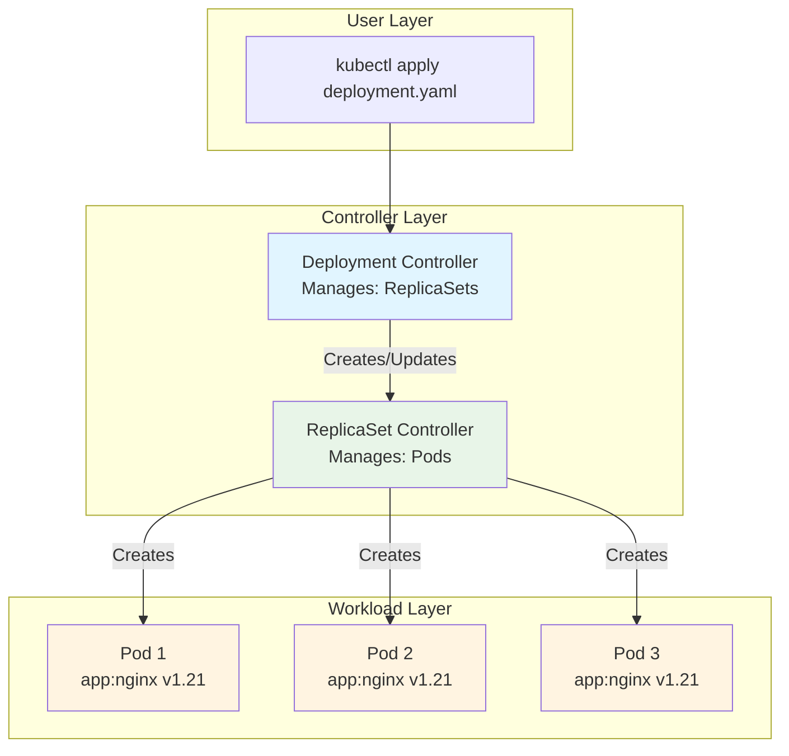
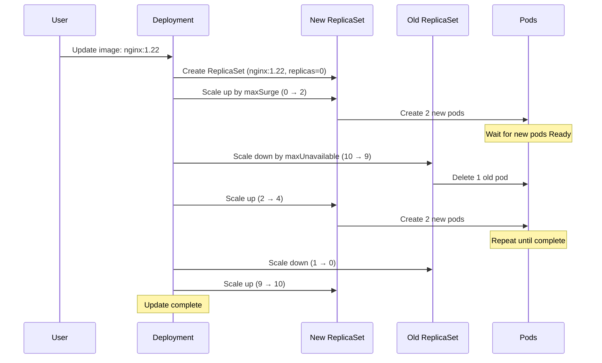
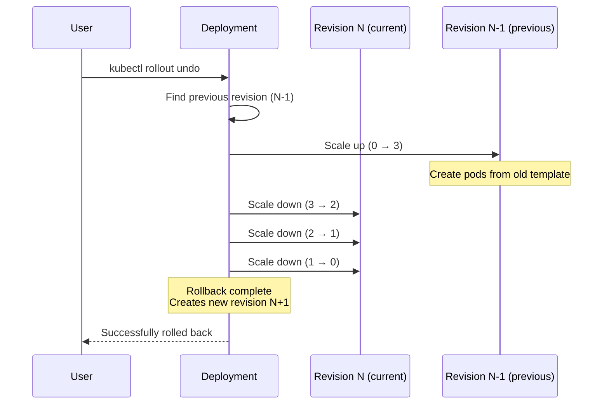
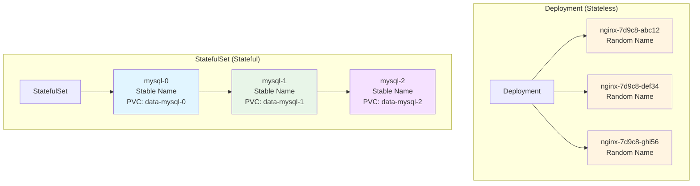

---
date:
  created: 2025-11-11
authors:
  - alf
categories:
  - Kubernetes
  - Workloads
tags:
  - kubernetes
  - k8s
  - cka-prep
  - deployments
  - replicasets
  - workloads
  - rolling-updates
readtime: 15
slug: kubernetes-deployments-replicasets
---

# Deployments, ReplicaSets, and Rolling Updates

Master Kubernetes workload controllers for production-grade application management. Learn deployment strategies, rolling updates, rollback procedures, and the complete controller hierarchy essential for CKA exam success.

<!-- more -->

## Introduction

Deployments are the cornerstone of stateless application management in Kubernetes. While you can create individual pods, deployments provide self-healing, scaling, rolling updates, and declarative version management - capabilities essential for production environments.

**CKA Exam Domain**: Workloads & Scheduling (15% of exam)

**Why Deployments Matter for CKA**:
- **Exam Frequency**: Deployment tasks appear in nearly every CKA exam
- **Time Efficiency**: Imperative deployment commands save critical exam minutes
- **Practical Relevance**: 90% of production Kubernetes workloads use deployments
- **Foundation Knowledge**: Understanding deployments builds intuition for other controllers

**Real-World Context**: According to the 2024 CNCF survey, deployments manage over 80% of stateless workloads in production clusters. In the CKA exam, you'll create deployments, scale them, update images, rollback failed updates, and troubleshoot deployment issues - often under time pressure.

**What You'll Learn**:
- Deployment fundamentals and the controller hierarchy
- ReplicaSet mechanics and pod lifecycle management
- Rolling update strategies with surge and unavailability controls
- Rollout management, history tracking, and rollback procedures
- Other workload controllers: DaemonSets, StatefulSets, Jobs, CronJobs
- CKA-specific commands, shortcuts, and time-saving patterns
- Hands-on exercises replicating exam scenarios

**Prerequisites**: Basic understanding of pods, YAML syntax, and kubectl commands. Review the "Kubernetes Objects & YAML" post if needed.

---

## Deployment Fundamentals

### What Are Deployments?

A Deployment is a Kubernetes controller that manages stateless applications through declarative configuration. Instead of manually creating and managing pods, you declare the desired state (image, replicas, update strategy), and the deployment controller continuously works to maintain that state.

**Core Benefits**:
- **Self-Healing**: Automatically replaces failed pods
- **Scaling**: Horizontal scaling with a single command
- **Rolling Updates**: Zero-downtime application updates
- **Rollback**: Quick reversion to previous versions
- **Version History**: Track and manage deployment revisions
- **Declarative Management**: Infrastructure-as-code compatibility

### The Controller Hierarchy

Deployments don't manage pods directly. They use a three-tier hierarchy:



**Hierarchy Responsibilities**:

1. **Deployment**: Manages application versions and update strategies
   - Creates new ReplicaSets for updates
   - Scales old ReplicaSets down during rollouts
   - Maintains revision history
   - Handles rollback operations

2. **ReplicaSet**: Ensures pod replica count matches desired state
   - Creates/deletes pods to match replica count
   - Monitors pod health
   - Adopts orphaned pods matching its selector

3. **Pods**: Run the actual application containers
   - Execute application workloads
   - Report health status
   - Managed entirely by their parent ReplicaSet

### Desired State Reconciliation

Kubernetes operates on a reconciliation loop - the controller constantly compares desired state (your specification) with actual state (cluster reality) and takes corrective action.

**Reconciliation Example**:
```
Desired State: 3 nginx:1.21 pods
Actual State:  2 nginx:1.21 pods (1 pod crashed)
Action:        Create 1 new pod → Desired = Actual
```

This self-healing behavior happens automatically without human intervention.

### Basic Deployment YAML Structure

```yaml
apiVersion: apps/v1
kind: Deployment
metadata:
  name: nginx-deployment
  labels:
    app: nginx
spec:
  replicas: 3                    # Desired pod count
  selector:
    matchLabels:
      app: nginx                 # Must match template labels
  template:                      # Pod template
    metadata:
      labels:
        app: nginx               # Pod labels
    spec:
      containers:
      - name: nginx
        image: nginx:1.21
        ports:
        - containerPort: 80
```

**Critical YAML Elements**:

- **`apiVersion: apps/v1`**: Deployment API group (v1 is stable)
- **`kind: Deployment`**: Resource type
- **`replicas`**: Number of pod copies to maintain
- **`selector.matchLabels`**: How deployment finds its pods
- **`template`**: Pod specification (same as standalone pod YAML)
- **Label Matching Rule**: `selector.matchLabels` must match `template.metadata.labels`

**CKA Tip**: The label matching rule is strictly enforced. Mismatched labels cause `error: selector does not match template labels` - a common exam mistake.

---

## ReplicaSets Deep Dive

### What ReplicaSets Do

A ReplicaSet is a controller that maintains a stable set of replica pods at any given time. It's primarily used by deployments but can be created independently (though this is discouraged).

**ReplicaSet Controller Responsibilities**:
1. **Count Maintenance**: Ensure replica count matches `spec.replicas`
2. **Pod Creation**: Create pods from the template when count is low
3. **Pod Deletion**: Remove excess pods when count is high
4. **Health Monitoring**: Watch for pod failures and replace them
5. **Label Selection**: Find and manage pods matching the selector
6. **Ownership**: Set controller references on managed pods

### Pod Template Specifications

The ReplicaSet's pod template defines the blueprint for all created pods:

```yaml
apiVersion: apps/v1
kind: ReplicaSet
metadata:
  name: nginx-rs
spec:
  replicas: 3
  selector:
    matchLabels:
      app: nginx
      tier: frontend
  template:
    metadata:
      labels:
        app: nginx
        tier: frontend
    spec:
      containers:
      - name: nginx
        image: nginx:1.21
        resources:
          requests:
            memory: "64Mi"
            cpu: "250m"
          limits:
            memory: "128Mi"
            cpu: "500m"
        ports:
        - containerPort: 80
```

**Template Components**:
- **metadata.labels**: Must match selector (required)
- **spec.containers**: Container specifications
- **spec.volumes**: Shared storage (if needed)
- **spec.nodeSelector**: Node placement constraints
- **spec.affinity**: Advanced scheduling rules

**CKA Insight**: ReplicaSet templates are immutable - changes don't affect existing pods. You must delete old pods to get new configuration, which is why deployments handle updates instead.

### Label Selectors and Matching

Label selectors determine which pods a ReplicaSet manages:

```yaml
# Equality-based selector
selector:
  matchLabels:
    app: nginx
    environment: production

# Set-based selector (more flexible)
selector:
  matchExpressions:
  - key: app
    operator: In
    values: [nginx, apache]
  - key: tier
    operator: NotIn
    values: [cache]
  - key: environment
    operator: Exists
```

**Selector Operators**:
- **`In`**: Label value in specified set
- **`NotIn`**: Label value not in specified set
- **`Exists`**: Label key exists (value irrelevant)
- **`DoesNotExist`**: Label key absent

**Selection Logic**:
```bash
# ReplicaSet finds pods using label query
kubectl get pods -l app=nginx,environment=production

# Must return exactly 'replicas' count of pods
# If less: Create more pods
# If more: Delete excess pods
```

### Scale Operations

Scaling changes replica count imperatively or declaratively:

```bash
# Imperative scaling (fast for exam)
kubectl scale deployment nginx-deployment --replicas=5

# Declarative scaling
kubectl edit deployment nginx-deployment  # Change spec.replicas
kubectl apply -f deployment.yaml          # Updated replicas in file

# Autoscaling (HorizontalPodAutoscaler)
kubectl autoscale deployment nginx-deployment --min=3 --max=10 --cpu-percent=80
```

**Scaling Behavior**:
- **Scale Up**: ReplicaSet creates (replicas - current) new pods
- **Scale Down**: ReplicaSet deletes (current - replicas) pods (newest first)
- **Immediate**: Scaling is instant (no gradual rollout)

**CKA Time-Saver**: Use `kubectl scale` for quick replica changes. Use `kubectl autoscale` only when explicitly required.

### Orphaned Pods and Adoption

ReplicaSets adopt pods that match their selector, even if not originally created by that ReplicaSet:

```bash
# Create standalone pod with matching labels
kubectl run orphan --image=nginx --labels=app=nginx

# Create ReplicaSet with same selector
kubectl apply -f replicaset.yaml  # selector: app=nginx, replicas: 3

# ReplicaSet adopts orphan pod
# Only creates 2 new pods (3 - 1 existing = 2)
```

**Adoption Mechanics**:
1. ReplicaSet queries API for pods matching selector
2. Counts matching pods (including orphans)
3. Creates/deletes pods to match desired count
4. Sets `ownerReferences` on adopted pods

**CKA Warning**: Be careful with label overlap. Pods can be unexpectedly adopted or deleted if selectors overlap.

---

## Deployment Strategies

Kubernetes supports multiple deployment strategies for different use cases.

### Rolling Updates (Default Strategy)

Rolling updates gradually replace old pods with new ones, maintaining availability:

```yaml
apiVersion: apps/v1
kind: Deployment
metadata:
  name: nginx-deployment
spec:
  replicas: 10
  strategy:
    type: RollingUpdate
    rollingUpdate:
      maxSurge: 2              # Max pods above desired count
      maxUnavailable: 1        # Max pods below desired count
  template:
    metadata:
      labels:
        app: nginx
    spec:
      containers:
      - name: nginx
        image: nginx:1.21
```

**Rolling Update Parameters**:

- **`maxSurge`**: Maximum pods above `replicas` during update
  - Absolute number: `maxSurge: 2` → 10 + 2 = 12 max pods
  - Percentage: `maxSurge: 25%` → 10 + 2.5 = 12 max pods (rounds up)
  - Default: `25%`

- **`maxUnavailable`**: Maximum pods below `replicas` during update
  - Absolute number: `maxUnavailable: 1` → 10 - 1 = 9 min available
  - Percentage: `maxUnavailable: 10%` → 10 - 1 = 9 min available
  - Default: `25%`

**Update Process Visualization**:



**Rolling Update Calculation**:
```
Given: replicas=10, maxSurge=2, maxUnavailable=1

Max pods during update: 10 + 2 = 12
Min available pods:     10 - 1 = 9

Update proceeds in waves:
Wave 1: Create 2 new (total: 12), delete 1 old (available: 11)
Wave 2: Create 2 new (total: 13), delete 1 old (available: 11)
...continue until all old pods replaced
```

**CKA Strategy**: Default rolling update works well for most exam scenarios. Only modify if explicitly required.

### Recreate Strategy

Recreate terminates all old pods before creating new ones - causes downtime:

```yaml
apiVersion: apps/v1
kind: Deployment
metadata:
  name: nginx-deployment
spec:
  replicas: 10
  strategy:
    type: Recreate         # All old pods deleted first
  template:
    metadata:
      labels:
        app: nginx
    spec:
      containers:
      - name: nginx
        image: nginx:1.22
```

**Recreate Process**:
1. Scale old ReplicaSet to 0 (delete all pods)
2. Wait for all old pods to terminate
3. Create new ReplicaSet with full replica count
4. Wait for all new pods to become ready

**Use Cases**:
- **Stateful applications** requiring clean shutdown
- **Database migrations** needing downtime
- **Incompatible versions** that can't coexist
- **Resource constraints** preventing extra pods during update

**Downtime**: Complete unavailability from step 1 to step 4 completion.

### Blue/Green Deployments

Blue/Green maintains two complete environments and switches traffic atomically:

```yaml
# Blue deployment (current production)
apiVersion: apps/v1
kind: Deployment
metadata:
  name: nginx-blue
  labels:
    version: blue
spec:
  replicas: 10
  selector:
    matchLabels:
      app: nginx
      version: blue
  template:
    metadata:
      labels:
        app: nginx
        version: blue
    spec:
      containers:
      - name: nginx
        image: nginx:1.21

---
# Green deployment (new version)
apiVersion: apps/v1
kind: Deployment
metadata:
  name: nginx-green
  labels:
    version: green
spec:
  replicas: 10
  selector:
    matchLabels:
      app: nginx
      version: green
  template:
    metadata:
      labels:
        app: nginx
        version: green
    spec:
      containers:
      - name: nginx
        image: nginx:1.22

---
# Service (traffic routing)
apiVersion: v1
kind: Service
metadata:
  name: nginx-service
spec:
  selector:
    app: nginx
    version: blue      # Switch to 'green' for cutover
  ports:
  - port: 80
    targetPort: 80
```

**Blue/Green Process**:
1. Deploy green environment alongside blue
2. Test green environment thoroughly
3. Switch service selector from `version: blue` to `version: green`
4. Monitor for issues
5. Keep blue environment running for quick rollback
6. Delete blue environment after validation period

**Advantages**:
- **Instant Rollback**: Change service selector back to blue
- **Zero Downtime**: Both environments ready before cutover
- **Full Testing**: Test production-like environment before cutover

**Disadvantages**:
- **Resource Cost**: 2x resources during transition
- **Database Complexity**: Schema migrations require careful coordination

### Canary Deployments

Canary deployments route small percentage of traffic to new version:

```yaml
# Stable deployment (90% traffic)
apiVersion: apps/v1
kind: Deployment
metadata:
  name: nginx-stable
spec:
  replicas: 9
  selector:
    matchLabels:
      app: nginx
      track: stable
  template:
    metadata:
      labels:
        app: nginx
        track: stable
    spec:
      containers:
      - name: nginx
        image: nginx:1.21

---
# Canary deployment (10% traffic)
apiVersion: apps/v1
kind: Deployment
metadata:
  name: nginx-canary
spec:
  replicas: 1           # 1 of 10 total = 10% traffic
  selector:
    matchLabels:
      app: nginx
      track: canary
  template:
    metadata:
      labels:
        app: nginx
        track: canary
    spec:
      containers:
      - name: nginx
        image: nginx:1.22

---
# Service (routes to both)
apiVersion: v1
kind: Service
metadata:
  name: nginx-service
spec:
  selector:
    app: nginx          # Matches both stable and canary
  ports:
  - port: 80
    targetPort: 80
```

**Canary Process**:
1. Deploy canary with small replica count (10%)
2. Monitor error rates, latency, user feedback
3. Gradually increase canary replicas (10% → 25% → 50%)
4. Decrease stable replicas correspondingly
5. Once validated, promote canary to 100%
6. Delete old stable deployment

**Traffic Distribution**:
```
Total pods: 10
Stable: 9 pods (90% traffic)
Canary: 1 pod  (10% traffic)

→ Gradually shift:
Stable: 5 pods (50%), Canary: 5 pods (50%)
→ Finally:
Stable: 0 pods (0%),  Canary: 10 pods (100%)
```

**CKA Note**: Canary deployments rarely appear in CKA exam. Understand the concept but prioritize rolling updates and rollbacks.

### Strategy Comparison

| Strategy | Downtime | Resource Cost | Rollback Speed | Complexity | Use Case |
|----------|----------|---------------|----------------|------------|----------|
| **Rolling Update** | None | Low (slight surge) | Medium (gradual) | Low | Default, stateless apps |
| **Recreate** | Yes (full) | None | Medium (redeploy) | Low | Stateful apps, migrations |
| **Blue/Green** | None | High (2x) | Instant | Medium | Critical apps, easy rollback |
| **Canary** | None | Medium | Medium | High | Risk mitigation, gradual validation |

**CKA Exam Strategy**:
- **90% of exam tasks**: Use default rolling update
- **Explicit downtime acceptable**: Use recreate
- **"Zero downtime" emphasized**: Verify rolling update configuration
- **"Gradual rollout" mentioned**: Consider canary approach (but likely rolling update)

---

## Rollout Management

Kubernetes tracks deployment history and provides rollout control commands.

### kubectl rollout Commands

**Check Rollout Status**:
```bash
# Watch rollout progress
kubectl rollout status deployment/nginx-deployment

# Output examples:
# "Waiting for deployment 'nginx-deployment' rollout to finish: 2 of 3 updated replicas..."
# "deployment 'nginx-deployment' successfully rolled out"
```

**View Rollout History**:
```bash
# List all revisions
kubectl rollout history deployment/nginx-deployment

# Output:
# REVISION  CHANGE-CAUSE
# 1         <none>
# 2         kubectl set image deployment/nginx-deployment nginx=nginx:1.22
# 3         kubectl set image deployment/nginx-deployment nginx=nginx:1.23

# View specific revision details
kubectl rollout history deployment/nginx-deployment --revision=2
```

**Pause Rollout**:
```bash
# Pause ongoing rollout
kubectl rollout pause deployment/nginx-deployment

# Make multiple changes while paused
kubectl set image deployment/nginx-deployment nginx=nginx:1.24
kubectl set resources deployment/nginx-deployment -c=nginx --limits=cpu=500m

# Resume rollout (batches all changes into one revision)
kubectl rollout resume deployment/nginx-deployment
```

**Restart Rollout**:
```bash
# Restart all pods (useful for config updates)
kubectl rollout restart deployment/nginx-deployment
```

### Revision History Tracking

Kubernetes stores old ReplicaSets for rollback purposes:

```bash
# Default revision history limit
kubectl get deployment nginx-deployment -o yaml | grep revisionHistoryLimit
# spec.revisionHistoryLimit: 10 (default)

# View all ReplicaSets (including old revisions)
kubectl get replicasets

# Output:
# NAME                         DESIRED   CURRENT   READY   AGE
# nginx-deployment-7d9c8f8d5   3         3         3       5m    # Current revision
# nginx-deployment-6b8c7d6c4   0         0         0       10m   # Old revision
# nginx-deployment-5a7b6c5b3   0         0         0       15m   # Old revision
```

**Old ReplicaSets**:
- Scaled to 0 replicas (no pods running)
- Retain pod template for rollback
- Count limited by `revisionHistoryLimit`
- Oldest deleted when limit exceeded

**Change Revision Limit**:
```yaml
spec:
  revisionHistoryLimit: 5  # Keep only 5 old ReplicaSets
```

### Rollback Procedures

**Rollback to Previous Revision**:
```bash
# Undo last rollout (rollback to revision N-1)
kubectl rollout undo deployment/nginx-deployment

# Process:
# 1. Find previous ReplicaSet
# 2. Scale previous ReplicaSet up
# 3. Scale current ReplicaSet down
# 4. Creates new revision number
```

**Rollback to Specific Revision**:
```bash
# Rollback to revision 2
kubectl rollout undo deployment/nginx-deployment --to-revision=2

# Verify rollback
kubectl rollout status deployment/nginx-deployment
kubectl describe deployment nginx-deployment | grep Image
```

**Rollback Visualization**:



**CKA Rollback Pattern**:
1. **Verify issue**: `kubectl rollout status` shows failure
2. **Check history**: `kubectl rollout history` to see revisions
3. **Rollback**: `kubectl rollout undo` (or `--to-revision=N`)
4. **Verify fix**: `kubectl rollout status` confirms success
5. **Validate**: `kubectl get pods` shows healthy pods

### Pause/Resume Rollouts

Pausing allows batching multiple changes into single revision:

```bash
# Start with deployment
kubectl create deployment nginx --image=nginx:1.21 --replicas=3

# Pause rollout
kubectl rollout pause deployment/nginx

# Make multiple changes (no rollout triggered)
kubectl set image deployment/nginx nginx=nginx:1.22
kubectl set resources deployment/nginx -c=nginx --requests=cpu=100m,memory=64Mi
kubectl set resources deployment/nginx -c=nginx --limits=cpu=200m,memory=128Mi

# Resume rollout (all changes applied together)
kubectl rollout resume deployment/nginx
```

**Pause Benefits**:
- **Atomic Changes**: Multiple updates in single revision
- **Testing**: Verify manifest changes before rollout
- **Coordination**: Synchronize with other system changes

**CKA Usage**: Rarely used in exam but valuable for complex updates.

### Change-Cause Annotations

Track why deployments were updated using annotations:

```bash
# Annotate during update
kubectl set image deployment/nginx nginx=nginx:1.22 \
  --record  # Deprecated but useful for history

# Better approach: annotate explicitly
kubectl annotate deployment/nginx kubernetes.io/change-cause="Update to nginx 1.22 for security patch"

# View in history
kubectl rollout history deployment/nginx

# Output:
# REVISION  CHANGE-CAUSE
# 1         <none>
# 2         Update to nginx 1.22 for security patch
```

**CKA Tip**: `--record` flag is deprecated. Use explicit annotations for change tracking in production scenarios.

---

## Other Workload Controllers

Beyond deployments, Kubernetes provides specialized controllers for different workload patterns.

### DaemonSets (One Pod Per Node)

DaemonSets ensure exactly one pod runs on each node (or subset of nodes):

```yaml
apiVersion: apps/v1
kind: DaemonSet
metadata:
  name: node-exporter
spec:
  selector:
    matchLabels:
      app: node-exporter
  template:
    metadata:
      labels:
        app: node-exporter
    spec:
      containers:
      - name: node-exporter
        image: prom/node-exporter:latest
        ports:
        - containerPort: 9100
      hostNetwork: true        # Access node metrics
      hostPID: true            # Access node processes
```

**DaemonSet Behavior**:
- **Node Addition**: Automatically create pod on new nodes
- **Node Removal**: Delete pod when node deleted
- **Node Selector**: Use `nodeSelector` or `affinity` to target node subset

**Common Use Cases**:
- **Monitoring Agents**: Prometheus node-exporter, Datadog agent
- **Log Collectors**: Fluentd, Logstash
- **Network Plugins**: CNI agents, kube-proxy
- **Storage Plugins**: CSI drivers
- **Security Agents**: Falco, Sysdig

**DaemonSet vs Deployment**:
```bash
# DaemonSet
kubectl get daemonset node-exporter
# DESIRED   CURRENT   READY   UP-TO-DATE   AVAILABLE
# 5         5         5       5            5
# (Matches node count)

# Deployment
kubectl get deployment nginx
# READY   UP-TO-DATE   AVAILABLE
# 3/3     3            3
# (Explicitly set replicas)
```

**CKA Commands**:
```bash
# Create DaemonSet
kubectl create -f daemonset.yaml

# Update DaemonSet image
kubectl set image daemonset/node-exporter node-exporter=prom/node-exporter:v1.3.0

# Check DaemonSet rollout
kubectl rollout status daemonset/node-exporter
```

### StatefulSets (Ordered, Stable Workloads)

StatefulSets manage stateful applications requiring stable network identities and persistent storage:

```yaml
apiVersion: apps/v1
kind: StatefulSet
metadata:
  name: mysql
spec:
  serviceName: mysql       # Headless service name
  replicas: 3
  selector:
    matchLabels:
      app: mysql
  template:
    metadata:
      labels:
        app: mysql
    spec:
      containers:
      - name: mysql
        image: mysql:8.0
        ports:
        - containerPort: 3306
        volumeMounts:
        - name: data
          mountPath: /var/lib/mysql
  volumeClaimTemplates:    # Creates PVC per pod
  - metadata:
      name: data
    spec:
      accessModes: [ "ReadWriteOnce" ]
      resources:
        requests:
          storage: 10Gi
```

**StatefulSet Guarantees**:

1. **Stable Network Identity**: Predictable pod names
   - `mysql-0`, `mysql-1`, `mysql-2` (not random hashes)
   - DNS: `mysql-0.mysql.default.svc.cluster.local`

2. **Ordered Deployment**: Sequential pod creation
   - Creates `mysql-0`, waits for Ready, then `mysql-1`, etc.

3. **Ordered Termination**: Reverse sequential deletion
   - Deletes `mysql-2`, then `mysql-1`, then `mysql-0`

4. **Stable Storage**: PersistentVolumeClaims bound to pods
   - `data-mysql-0` always attached to `mysql-0`
   - PVCs persist even if pod deleted

**StatefulSet vs Deployment**:



**Common Use Cases**:
- **Databases**: MySQL, PostgreSQL, MongoDB
- **Distributed Systems**: Kafka, Zookeeper, Elasticsearch
- **Stateful Applications**: Requires persistent identity or storage

**CKA Commands**:
```bash
# Create StatefulSet
kubectl apply -f statefulset.yaml

# Scale StatefulSet
kubectl scale statefulset mysql --replicas=5

# Delete StatefulSet (keeps PVCs)
kubectl delete statefulset mysql

# Delete StatefulSet and PVCs
kubectl delete statefulset mysql
kubectl delete pvc -l app=mysql
```

### Jobs (Run-to-Completion)

Jobs run pods to completion (successful termination) rather than continuously:

```yaml
apiVersion: batch/v1
kind: Job
metadata:
  name: database-backup
spec:
  template:
    spec:
      containers:
      - name: backup
        image: mysql:8.0
        command:
        - /bin/bash
        - -c
        - mysqldump -h mysql -u root -p$MYSQL_ROOT_PASSWORD mydb > /backup/dump.sql
        env:
        - name: MYSQL_ROOT_PASSWORD
          valueFrom:
            secretKeyRef:
              name: mysql-secret
              key: password
      restartPolicy: OnFailure  # Required for Jobs
  backoffLimit: 4              # Retry failed jobs up to 4 times
  completions: 1               # Run 1 pod successfully
  parallelism: 1               # Run 1 pod at a time
```

**Job Parameters**:

- **`completions`**: Number of successful pod completions required
  - `completions: 3` → Run until 3 pods succeed

- **`parallelism`**: Number of pods running simultaneously
  - `parallelism: 2` → Run 2 pods at once

- **`backoffLimit`**: Number of retries before marking job failed
  - Default: 6 retries

- **`activeDeadlineSeconds`**: Maximum job runtime
  - Job fails if exceeds deadline

**Job Patterns**:

```yaml
# Single Job (run once)
completions: 1
parallelism: 1

# Parallel Job (run N times in parallel)
completions: 10
parallelism: 5      # 5 pods at a time until 10 complete

# Work Queue Job (process queue until empty)
completions: null   # No fixed count
parallelism: 5      # 5 workers processing queue
```

**CKA Commands**:
```bash
# Create job
kubectl create job backup --image=mysql:8.0 -- mysqldump ...

# View job status
kubectl get jobs

# View job pods
kubectl get pods --selector=job-name=backup

# View job logs
kubectl logs job/backup

# Delete completed jobs
kubectl delete job backup
```

### CronJobs (Scheduled Jobs)

CronJobs create Jobs on a schedule:

```yaml
apiVersion: batch/v1
kind: CronJob
metadata:
  name: database-backup
spec:
  schedule: "0 2 * * *"        # 2am daily (cron syntax)
  jobTemplate:                 # Job spec (same as Job)
    spec:
      template:
        spec:
          containers:
          - name: backup
            image: mysql:8.0
            command:
            - /bin/bash
            - -c
            - mysqldump -h mysql -u root -p$MYSQL_ROOT_PASSWORD mydb > /backup/dump-$(date +%Y%m%d).sql
          restartPolicy: OnFailure
  successfulJobsHistoryLimit: 3  # Keep last 3 successful jobs
  failedJobsHistoryLimit: 1      # Keep last 1 failed job
  concurrencyPolicy: Forbid      # Don't run if previous job still running
```

**Cron Schedule Syntax**:
```
# ┌───────────── minute (0 - 59)
# │ ┌───────────── hour (0 - 23)
# │ │ ┌───────────── day of month (1 - 31)
# │ │ │ ┌───────────── month (1 - 12)
# │ │ │ │ ┌───────────── day of week (0 - 6) (Sunday to Saturday)
# │ │ │ │ │
# * * * * *

Examples:
"0 2 * * *"       # 2am daily
"*/5 * * * *"     # Every 5 minutes
"0 */2 * * *"     # Every 2 hours
"0 9 * * 1-5"     # 9am weekdays
"0 0 1 * *"       # 1st of month
```

**Concurrency Policies**:
- **`Allow`** (default): Allow concurrent jobs
- **`Forbid`**: Skip new job if previous still running
- **`Replace`**: Cancel previous job, start new one

**CKA Commands**:
```bash
# Create CronJob
kubectl create cronjob backup --image=mysql:8.0 --schedule="0 2 * * *" -- mysqldump ...

# View CronJobs
kubectl get cronjobs

# Manually trigger CronJob (create job immediately)
kubectl create job backup-manual --from=cronjob/backup

# Suspend CronJob
kubectl patch cronjob backup -p '{"spec":{"suspend":true}}'
```

### Controller Comparison

| Controller | Replicas | Pod Names | Restart Policy | Storage | Use Case |
|------------|----------|-----------|----------------|---------|----------|
| **Deployment** | Fixed count | Random hash | Always | Ephemeral | Stateless apps (web, API) |
| **ReplicaSet** | Fixed count | Random hash | Always | Ephemeral | Managed by Deployment |
| **DaemonSet** | 1 per node | Random hash | Always | Ephemeral | Node agents (monitoring, logging) |
| **StatefulSet** | Fixed count | Ordered (mysql-0) | Always | Persistent | Databases, distributed systems |
| **Job** | Completions | Random hash | OnFailure/Never | Ephemeral | Batch processing, migrations |
| **CronJob** | Scheduled | Random hash | OnFailure/Never | Ephemeral | Scheduled tasks (backups, reports) |

**CKA Controller Selection**:
- **Web application**: Deployment
- **Database cluster**: StatefulSet
- **Log aggregator on each node**: DaemonSet
- **Database migration**: Job
- **Daily backup**: CronJob

---

## CKA Exam Skills

### Imperative Deployment Creation

**Create Deployment Quickly**:
```bash
# Basic deployment
kubectl create deployment nginx --image=nginx:1.21

# Deployment with replicas
kubectl create deployment nginx --image=nginx:1.21 --replicas=3

# Generate YAML without creating
kubectl create deployment nginx --image=nginx:1.21 --dry-run=client -o yaml > deployment.yaml

# Create and expose
kubectl create deployment nginx --image=nginx:1.21 --replicas=3
kubectl expose deployment nginx --port=80 --target-port=80
```

**CKA Time-Saver**: Use `kubectl create deployment` for basic deployments. Only write YAML for complex configurations.

### Scaling Commands

```bash
# Scale deployment
kubectl scale deployment nginx --replicas=5

# Scale multiple deployments
kubectl scale deployment nginx frontend backend --replicas=3

# Conditional scaling
kubectl scale deployment nginx --current-replicas=3 --replicas=5

# Autoscale (HPA)
kubectl autoscale deployment nginx --min=3 --max=10 --cpu-percent=80
```

**Verify Scaling**:
```bash
kubectl get deployment nginx
kubectl get replicaset
kubectl get pods -l app=nginx
```

### Image Updates

```bash
# Update deployment image
kubectl set image deployment/nginx nginx=nginx:1.22

# Update multiple containers
kubectl set image deployment/nginx nginx=nginx:1.22 sidecar=sidecar:2.0

# Verify update
kubectl rollout status deployment/nginx
kubectl describe deployment nginx | grep Image
```

**CKA Pattern**:
```bash
# Update image and watch rollout
kubectl set image deployment/nginx nginx=nginx:1.22 && \
kubectl rollout status deployment/nginx
```

### Rollback Procedures

```bash
# View rollout history
kubectl rollout history deployment/nginx

# Rollback to previous version
kubectl rollout undo deployment/nginx

# Rollback to specific revision
kubectl rollout undo deployment/nginx --to-revision=2

# Verify rollback
kubectl rollout status deployment/nginx
kubectl get pods
```

**CKA Rollback Scenario**:
```bash
# Problem: Deployment stuck in rollout
kubectl rollout status deployment/nginx
# "Waiting for rollout to finish: 1 of 3 updated replicas..."

# Investigate
kubectl get pods
# nginx-deployment-7d9c8f8d5-xyz12   0/1     ImagePullBackOff

# Rollback immediately
kubectl rollout undo deployment/nginx

# Verify fix
kubectl get pods
# All pods Running
```

### Troubleshooting Deployments

**Common Issues and Solutions**:

1. **ImagePullBackOff**:
```bash
# Symptom
kubectl get pods
# nginx-7d9c8-abc12   0/1   ImagePullBackOff

# Diagnose
kubectl describe pod nginx-7d9c8-abc12
# Events: Failed to pull image "nginx:typo"

# Fix
kubectl set image deployment/nginx nginx=nginx:1.22
```

2. **CrashLoopBackOff**:
```bash
# Symptom
kubectl get pods
# nginx-7d9c8-abc12   0/1   CrashLoopBackOff

# Diagnose
kubectl logs nginx-7d9c8-abc12
# Error: Configuration file not found

# Fix (edit config)
kubectl edit deployment nginx
```

3. **Insufficient Resources**:
```bash
# Symptom
kubectl get pods
# nginx-7d9c8-abc12   0/1   Pending

# Diagnose
kubectl describe pod nginx-7d9c8-abc12
# Events: 0/3 nodes are available: insufficient cpu

# Fix (reduce resources or scale cluster)
kubectl set resources deployment/nginx -c=nginx --requests=cpu=100m
```

4. **Label Selector Mismatch**:
```bash
# Symptom
kubectl get deployment nginx
# READY: 0/3

kubectl get replicaset
# DESIRED: 3, CURRENT: 0

# Diagnose
kubectl get deployment nginx -o yaml | grep -A5 selector
# selector.matchLabels doesn't match template.metadata.labels

# Fix
kubectl edit deployment nginx  # Align selector and labels
```

**CKA Troubleshooting Workflow**:
1. **Check pod status**: `kubectl get pods`
2. **Describe pod**: `kubectl describe pod <name>`
3. **Check logs**: `kubectl logs <name>`
4. **Check events**: `kubectl get events --sort-by=.metadata.creationTimestamp`
5. **Fix and verify**: Update deployment, watch rollout

### Exam Time-Savers

**Aliases** (provided in exam environment):
```bash
alias k=kubectl
alias kgp='kubectl get pods'
alias kgd='kubectl get deployment'
alias kd='kubectl describe'
```

**kubectl Shortcuts**:
```bash
# Short resource names
kubectl get deploy       # Instead of 'deployments'
kubectl get rs           # Instead of 'replicasets'
kubectl get po           # Instead of 'pods'

# Wide output (more columns)
kubectl get pods -o wide

# Watch mode (auto-refresh)
kubectl get pods -w

# All namespaces
kubectl get pods -A
```

**YAML Generation**:
```bash
# Generate deployment YAML
kubectl create deployment nginx --image=nginx:1.21 --dry-run=client -o yaml

# Generate service YAML
kubectl expose deployment nginx --port=80 --dry-run=client -o yaml

# Combine and apply
kubectl create deployment nginx --image=nginx:1.21 --dry-run=client -o yaml | kubectl apply -f -
```

---

## Practice Exercises

### Exercise 1: Create and Scale Deployment

**Scenario**: Deploy nginx web application with 3 replicas.

```bash
# Create deployment
kubectl create deployment web --image=nginx:1.21 --replicas=3

# Verify deployment
kubectl get deployment web
kubectl get pods -l app=web

# Scale to 5 replicas
kubectl scale deployment web --replicas=5

# Verify scaling
kubectl get pods -l app=web -w  # Watch pods being created
```

**Expected Output**:
```
NAME   READY   UP-TO-DATE   AVAILABLE   AGE
web    5/5     5            5           2m
```

### Exercise 2: Rolling Update and Rollback

**Scenario**: Update nginx to version 1.22, then rollback due to issues.

```bash
# Initial deployment
kubectl create deployment nginx --image=nginx:1.21 --replicas=3

# Update to 1.22
kubectl set image deployment/nginx nginx=nginx:1.22

# Watch rollout
kubectl rollout status deployment/nginx

# Check history
kubectl rollout history deployment/nginx

# Simulate issue - rollback
kubectl rollout undo deployment/nginx

# Verify rollback
kubectl describe deployment nginx | grep Image:
# Should show nginx:1.21
```

**Expected History**:
```
REVISION  CHANGE-CAUSE
1         <none>
2         kubectl set image deployment/nginx nginx=nginx:1.22
3         kubectl rollout undo deployment/nginx
```

### Exercise 3: Deployment with Resource Limits

**Scenario**: Create deployment with resource requests and limits.

```bash
# Generate base YAML
kubectl create deployment app --image=nginx:1.21 --replicas=2 --dry-run=client -o yaml > app.yaml

# Edit app.yaml to add resources
```

```yaml
# app.yaml (add under containers)
        resources:
          requests:
            memory: "64Mi"
            cpu: "250m"
          limits:
            memory: "128Mi"
            cpu: "500m"
```

```bash
# Apply deployment
kubectl apply -f app.yaml

# Verify resources
kubectl describe deployment app | grep -A5 Limits
```

**Expected Output**:
```
    Limits:
      cpu:     500m
      memory:  128Mi
    Requests:
      cpu:        250m
      memory:     64Mi
```

### Exercise 4: DaemonSet Creation

**Scenario**: Deploy monitoring agent to all nodes.

```yaml
# monitoring-agent.yaml
apiVersion: apps/v1
kind: DaemonSet
metadata:
  name: node-monitor
spec:
  selector:
    matchLabels:
      app: node-monitor
  template:
    metadata:
      labels:
        app: node-monitor
    spec:
      containers:
      - name: monitor
        image: prom/node-exporter:latest
        ports:
        - containerPort: 9100
```

```bash
# Create DaemonSet
kubectl apply -f monitoring-agent.yaml

# Verify one pod per node
kubectl get daemonset node-monitor
kubectl get pods -l app=node-monitor -o wide

# Count should match node count
kubectl get nodes --no-headers | wc -l
kubectl get pods -l app=node-monitor --no-headers | wc -l
```

### Exercise 5: StatefulSet with Headless Service

**Scenario**: Deploy a 3-replica MySQL StatefulSet.

```yaml
# mysql-statefulset.yaml
apiVersion: v1
kind: Service
metadata:
  name: mysql
spec:
  clusterIP: None           # Headless service
  selector:
    app: mysql
  ports:
  - port: 3306
---
apiVersion: apps/v1
kind: StatefulSet
metadata:
  name: mysql
spec:
  serviceName: mysql
  replicas: 3
  selector:
    matchLabels:
      app: mysql
  template:
    metadata:
      labels:
        app: mysql
    spec:
      containers:
      - name: mysql
        image: mysql:8.0
        env:
        - name: MYSQL_ROOT_PASSWORD
          value: "password"  # Use secrets in production!
        ports:
        - containerPort: 3306
  volumeClaimTemplates:
  - metadata:
      name: data
    spec:
      accessModes: [ "ReadWriteOnce" ]
      resources:
        requests:
          storage: 1Gi
```

```bash
# Create StatefulSet
kubectl apply -f mysql-statefulset.yaml

# Watch ordered pod creation
kubectl get pods -l app=mysql -w

# Verify stable names
kubectl get pods -l app=mysql
# mysql-0, mysql-1, mysql-2

# Verify PVCs
kubectl get pvc
# data-mysql-0, data-mysql-1, data-mysql-2

# Test stable network identity
kubectl run -it --rm debug --image=busybox --restart=Never -- nslookup mysql-0.mysql
```

**Expected Pod Order**:
```
mysql-0   1/1   Running   # Created first
mysql-1   1/1   Running   # Created second (after mysql-0 Ready)
mysql-2   1/1   Running   # Created third (after mysql-1 Ready)
```

---

## Summary

Deployments form the foundation of stateless workload management in Kubernetes. Key takeaways for CKA success:

**Essential Concepts**:
- **Deployment Hierarchy**: Deployment → ReplicaSet → Pods
- **Rolling Updates**: Default strategy for zero-downtime updates
- **Rollback Capability**: Revision history enables quick recovery
- **Controller Specialization**: DaemonSet (per-node), StatefulSet (stateful), Job (batch)

**CKA Exam Priorities**:
1. **Imperative Commands**: `kubectl create deployment`, `kubectl scale`, `kubectl set image`
2. **Rollout Management**: `kubectl rollout status`, `kubectl rollout undo`
3. **Troubleshooting**: Diagnose ImagePullBackOff, CrashLoopBackOff, Pending pods
4. **YAML Generation**: Use `--dry-run=client -o yaml` for complex resources

**Time-Saving Strategies**:
- Use imperative commands for simple deployments
- Generate YAML templates for complex configurations
- Master `kubectl rollout` commands for update scenarios
- Understand label selectors to avoid common pitfalls

**Next Steps**:
- Practice deployment creation and scaling until automatic
- Build muscle memory for rollout and rollback commands
- Understand when to use each controller type
- Review Services and Ingress for complete application deployment

**Related Topics**:
- **Services**: Expose deployments with stable networking
- **ConfigMaps & Secrets**: Inject configuration into deployments
- **Persistent Volumes**: StatefulSet storage requirements
- **Resource Quotas**: Control deployment resource consumption

With deployments mastered, you control application lifecycle management - a core competency for CKA certification and production Kubernetes operations.
