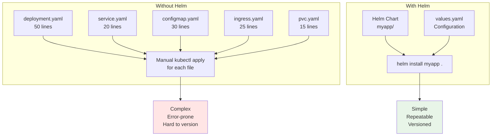
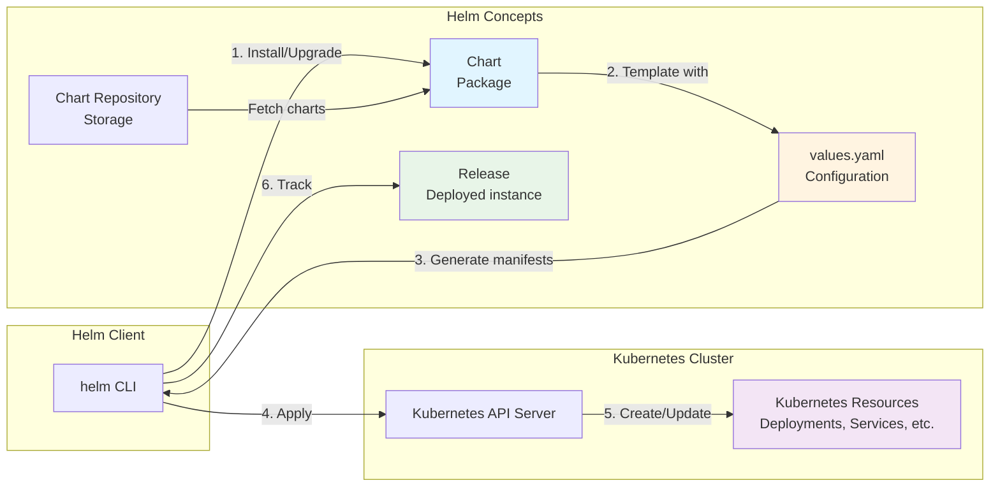

---
date:
  created: 2025-11-11
authors:
  - alf
categories:
  - Kubernetes
  - Configuration
tags:
  - kubernetes
  - k8s
  - cka-prep
  - helm
readtime: 13
slug: helm-kubernetes-package-manager
---

# Helm: Kubernetes Package Manager

**Simplify application deployment with charts, releases, and templating**

Helm is the de facto package manager for Kubernetes, enabling you to define, install, and upgrade complex applications using reusable packages called charts. For the CKA exam, you'll need to understand Helm's architecture, work with charts and releases, troubleshoot deployments, and use Helm commands effectively. This guide covers Helm 3 fundamentals, chart structure, templating with values, release management, and practical troubleshooting techniques to help you master Kubernetes application packaging.

**CKA Exam Relevance**: Cluster Architecture, Installation & Configuration (25% of exam weight)

<!-- more -->

---

## 📋 What You'll Learn

- **Helm Architecture**: Charts, releases, repositories
- **Chart Structure**: Templates, values, metadata
- **Helm Commands**: install, upgrade, rollback, list, uninstall
- **Templating**: Go templates, values injection, built-in functions
- **Chart Repositories**: Adding, searching, and managing repos
- **Release Management**: Versioning, rollbacks, history
- **Hooks**: Pre/post-install, upgrade lifecycle management
- **Troubleshooting**: Common issues and debugging techniques

---

## 🎯 What is Helm?

**Helm** is a package manager for Kubernetes that simplifies deploying and managing applications.

### Why Use Helm?



**Helm Benefits**:
- **Package Management**: Bundle related Kubernetes resources
- **Templating**: Parameterize manifests for reuse
- **Version Control**: Track releases and rollback easily
- **Dependency Management**: Charts can depend on other charts
- **Repeatability**: Same chart deploys identically across environments

**Helm Use Cases**:
- Deploy complex applications (databases, monitoring stacks)
- Share applications via public/private repositories
- Manage multi-environment deployments (dev, staging, prod)
- Standardize deployments across teams

---

## 🏗️ Helm Architecture



### Core Concepts

**Chart**: A Helm package containing templates and metadata
- Template files (Deployment, Service, etc.)
- `values.yaml` for default configuration
- `Chart.yaml` for metadata
- Optional dependencies

**Release**: An instance of a chart deployed to a cluster
- Each `helm install` creates a new release
- Releases have unique names and versions
- Release history tracked in Kubernetes Secrets

**Repository**: A collection of packaged charts
- Public repos: ArtifactHub, Helm Hub
- Private repos: ChartMuseum, Harbor, S3

**Values**: Configuration parameters that customize chart behavior
- Default values in `values.yaml`
- Override via `--set` or `-f custom-values.yaml`

---

## 📦 Chart Structure

A typical Helm chart directory structure:

```
mychart/
├── Chart.yaml          # Chart metadata
├── values.yaml         # Default configuration values
├── charts/             # Dependent charts (subcharts)
├── templates/          # Kubernetes manifest templates
│   ├── NOTES.txt       # Post-install notes
│   ├── _helpers.tpl    # Template helpers
│   ├── deployment.yaml # Deployment template
│   ├── service.yaml    # Service template
│   ├── ingress.yaml    # Ingress template
│   └── tests/          # Test resources
│       └── test-connection.yaml
├── .helmignore         # Files to ignore when packaging
└── README.md           # Chart documentation
```

### Chart.yaml

**Metadata file** defining the chart:

```yaml
apiVersion: v2                    # Chart API version (v2 for Helm 3)
name: mychart                     # Chart name
version: 1.0.0                    # Chart version (SemVer)
appVersion: "1.16.0"             # Application version
description: A Helm chart for my application
type: application                 # application or library
keywords:
  - web
  - frontend
maintainers:
  - name: Your Name
    email: you@example.com
dependencies:                     # Optional: Chart dependencies
  - name: postgresql
    version: "11.x.x"
    repository: https://charts.bitnami.com/bitnami
```

### values.yaml

**Default configuration** for the chart:

```yaml
replicaCount: 2

image:
  repository: nginx
  tag: "1.27"
  pullPolicy: IfNotPresent

service:
  type: ClusterIP
  port: 80

ingress:
  enabled: false
  className: nginx
  hosts:
    - host: example.com
      paths:
        - path: /
          pathType: Prefix

resources:
  limits:
    cpu: 100m
    memory: 128Mi
  requests:
    cpu: 100m
    memory: 128Mi

autoscaling:
  enabled: false
  minReplicas: 2
  maxReplicas: 10
  targetCPUUtilizationPercentage: 80
```

### Template Example

**templates/deployment.yaml** with Go templating:

```yaml
apiVersion: apps/v1
kind: Deployment
metadata:
  name: {{ include "mychart.fullname" . }}
  labels:
    {{- include "mychart.labels" . | nindent 4 }}
spec:
  replicas: {{ .Values.replicaCount }}
  selector:
    matchLabels:
      {{- include "mychart.selectorLabels" . | nindent 6 }}
  template:
    metadata:
      labels:
        {{- include "mychart.selectorLabels" . | nindent 8 }}
    spec:
      containers:
      - name: {{ .Chart.Name }}
        image: "{{ .Values.image.repository }}:{{ .Values.image.tag | default .Chart.AppVersion }}"
        imagePullPolicy: {{ .Values.image.pullPolicy }}
        ports:
        - name: http
          containerPort: 80
          protocol: TCP
        resources:
          {{- toYaml .Values.resources | nindent 10 }}
```

**Template syntax**:
- `{{ .Values.key }}`: Access values
- `{{ .Chart.Name }}`: Access chart metadata
- `{{ .Release.Name }}`: Access release info
- `{{- include "template" . }}`: Include helper templates
- `{{ toYaml .Values.resources | nindent 10 }}`: Convert to YAML with indentation

---

## 🔧 Helm Commands

### Installing Charts

```bash
# Install from repository
helm install myrelease bitnami/nginx

# Install from local directory
helm install myrelease ./mychart

# Install with custom values
helm install myrelease ./mychart -f custom-values.yaml

# Install with --set overrides
helm install myrelease ./mychart \
  --set replicaCount=3 \
  --set image.tag=1.28

# Install in specific namespace
helm install myrelease ./mychart -n production --create-namespace

# Dry-run (template only, don't install)
helm install myrelease ./mychart --dry-run --debug

# Generate name automatically
helm install ./mychart --generate-name
```

### Listing Releases

```bash
# List releases in current namespace
helm list

# List all releases in all namespaces
helm list -A

# List uninstalled releases (history)
helm list --uninstalled

# Show all release states
helm list --all

# Filter by status
helm list --deployed
helm list --failed
```

### Upgrading Releases

```bash
# Upgrade release with new values
helm upgrade myrelease ./mychart -f new-values.yaml

# Upgrade and install if not exists
helm upgrade --install myrelease ./mychart

# Upgrade with --set
helm upgrade myrelease ./mychart --set replicaCount=5

# Force resource updates
helm upgrade myrelease ./mychart --force

# Wait for resources to be ready
helm upgrade myrelease ./mychart --wait --timeout 5m
```

### Rolling Back Releases

```bash
# Show release history
helm history myrelease

# Rollback to previous version
helm rollback myrelease

# Rollback to specific revision
helm rollback myrelease 3

# Dry-run rollback
helm rollback myrelease 2 --dry-run
```

### Uninstalling Releases

```bash
# Uninstall release
helm uninstall myrelease

# Uninstall but keep history
helm uninstall myrelease --keep-history

# Uninstall with timeout
helm uninstall myrelease --timeout 2m
```

### Getting Release Information

```bash
# Show release status
helm status myrelease

# Show release values
helm get values myrelease

# Show all release values (including defaults)
helm get values myrelease --all

# Show release manifest
helm get manifest myrelease

# Show release notes
helm get notes myrelease

# Show release hooks
helm get hooks myrelease
```

---

## 📚 Working with Repositories

### Managing Repositories

```bash
# Add repository
helm repo add bitnami https://charts.bitnami.com/bitnami
helm repo add stable https://charts.helm.sh/stable

# List repositories
helm repo list

# Update repository index
helm repo update

# Remove repository
helm repo remove bitnami

# Search repositories
helm search repo nginx
helm search repo bitnami/postgres --versions
```

### Searching Charts

```bash
# Search all repos for keyword
helm search repo database

# Search specific repo
helm search repo bitnami/mysql

# Search with versions
helm search repo nginx --versions

# Search ArtifactHub (public hub)
helm search hub wordpress
```

### Installing from Repository

```bash
# Install latest version
helm install mydb bitnami/postgresql

# Install specific version
helm install mydb bitnami/postgresql --version 11.9.0

# Show chart information before installing
helm show chart bitnami/postgresql
helm show values bitnami/postgresql
helm show readme bitnami/postgresql
```

---

## 🎨 Templating and Values

### Template Functions

**Common built-in functions**:

```yaml
# String functions
{{ .Values.name | upper }}              # MYAPP
{{ .Values.name | lower }}              # myapp
{{ .Values.name | quote }}              # "myapp"
{{ .Values.name | trunc 5 }}            # myapp (truncate)

# Default values
{{ .Values.optional | default "default-value" }}

# Type conversions
{{ .Values.port | toString }}           # "80"
{{ .Values.enabled | toJson }}          # true

# Conditionals
{{- if .Values.ingress.enabled }}
# ingress configuration
{{- end }}

{{- if eq .Values.service.type "LoadBalancer" }}
# LoadBalancer-specific config
{{- end }}

# Loops
{{- range .Values.hosts }}
- {{ . }}
{{- end }}

# YAML/JSON conversion
{{- toYaml .Values.resources | nindent 8 }}
```

### Helper Templates (_helpers.tpl)

**Reusable template snippets**:

```yaml
{{/*
Expand the name of the chart.
*/}}
{{- define "mychart.name" -}}
{{- default .Chart.Name .Values.nameOverride | trunc 63 | trimSuffix "-" }}
{{- end }}

{{/*
Create a fully qualified app name.
*/}}
{{- define "mychart.fullname" -}}
{{- if .Values.fullnameOverride }}
{{- .Values.fullnameOverride | trunc 63 | trimSuffix "-" }}
{{- else }}
{{- $name := default .Chart.Name .Values.nameOverride }}
{{- printf "%s-%s" .Release.Name $name | trunc 63 | trimSuffix "-" }}
{{- end }}
{{- end }}

{{/*
Common labels
*/}}
{{- define "mychart.labels" -}}
helm.sh/chart: {{ include "mychart.chart" . }}
{{ include "mychart.selectorLabels" . }}
app.kubernetes.io/version: {{ .Chart.AppVersion | quote }}
app.kubernetes.io/managed-by: {{ .Release.Service }}
{{- end }}
```

### Values Precedence

**Override order** (highest to lowest priority):

1. `--set` flags: `helm install --set key=value`
2. `-f` files (last file wins): `helm install -f values1.yaml -f values2.yaml`
3. Chart's `values.yaml` (defaults)

```bash
# Multiple override methods
helm install myrelease ./mychart \
  -f prod-values.yaml \              # Override file
  --set replicaCount=3 \             # Command-line override
  --set image.tag=v2.0               # Another override
```

---

## 🪝 Hooks

**Hooks** execute at specific points in a release lifecycle:

```yaml
apiVersion: batch/v1
kind: Job
metadata:
  name: {{ include "mychart.fullname" . }}-migration
  annotations:
    "helm.sh/hook": pre-upgrade              # Hook type
    "helm.sh/hook-weight": "0"               # Execution order
    "helm.sh/hook-delete-policy": hook-succeeded  # Cleanup policy
spec:
  template:
    spec:
      containers:
      - name: migration
        image: myapp:{{ .Values.image.tag }}
        command: ["./run-migrations.sh"]
      restartPolicy: Never
```

**Hook types**:
- `pre-install`: Before resources are created
- `post-install`: After all resources are created
- `pre-delete`: Before deletion request
- `post-delete`: After all resources deleted
- `pre-upgrade`: Before upgrade
- `post-upgrade`: After upgrade
- `pre-rollback`: Before rollback
- `post-rollback`: After rollback
- `test`: When `helm test` runs

**Hook deletion policies**:
- `before-hook-creation`: Delete previous hook before new hook
- `hook-succeeded`: Delete after successful execution
- `hook-failed`: Delete after failed execution

---

## 🛠️ Creating Custom Charts

### Create New Chart

```bash
# Generate chart scaffold
helm create mychart

# Chart structure created:
mychart/
├── Chart.yaml
├── values.yaml
├── charts/
└── templates/
    ├── deployment.yaml
    ├── service.yaml
    ├── ingress.yaml
    ├── _helpers.tpl
    └── NOTES.txt
```

### Packaging Charts

```bash
# Package chart into .tgz archive
helm package mychart/
# Output: mychart-1.0.0.tgz

# Package with specific destination
helm package mychart/ -d ./packages/

# Update dependencies before packaging
helm package mychart/ --dependency-update
```

### Chart Dependencies

**Chart.yaml with dependencies**:

```yaml
dependencies:
  - name: postgresql
    version: "11.9.0"
    repository: https://charts.bitnami.com/bitnami
    condition: postgresql.enabled          # Enable/disable via values
  - name: redis
    version: "17.x.x"
    repository: https://charts.bitnami.com/bitnami
    tags:
      - cache                              # Enable via tag
```

**Manage dependencies**:

```bash
# Download dependencies to charts/ directory
helm dependency update mychart/

# List dependencies
helm dependency list mychart/

# Build dependencies (equivalent to update)
helm dependency build mychart/
```

---

## 🔍 Troubleshooting Helm

### Debugging Templates

```bash
# Render templates without installing (dry-run)
helm install myrelease ./mychart --dry-run --debug

# Template only (no validation)
helm template myrelease ./mychart

# Template with values
helm template myrelease ./mychart -f prod-values.yaml

# Show specific template
helm template myrelease ./mychart --show-only templates/deployment.yaml
```

### Common Issues

**Issue 1: Template Rendering Error**

```bash
# Error: parse error at (mychart/templates/deployment.yaml:10)
helm install myrelease ./mychart --dry-run --debug

# Check line 10 in deployment.yaml for syntax errors
# Common: Missing closing braces, incorrect indentation
```

**Issue 2: Release Already Exists**

```bash
# Error: cannot re-use a name that is still in use

# List existing releases
helm list -A

# Uninstall existing release
helm uninstall myrelease

# Or use different name
helm install myrelease-v2 ./mychart
```

**Issue 3: Failed Installation**

```bash
# Check release status
helm status myrelease

# View release history
helm history myrelease

# Check failed resources
kubectl get all -n <namespace> -l app.kubernetes.io/instance=myrelease

# Uninstall and retry
helm uninstall myrelease
helm install myrelease ./mychart --wait --timeout 5m
```

**Issue 4: Values Not Applied**

```bash
# Verify applied values
helm get values myrelease

# Check template rendering
helm template myrelease ./mychart -f values.yaml --debug

# Ensure correct values file path
helm upgrade myrelease ./mychart -f ./config/prod-values.yaml
```

---

## 📝 CKA Exam Practice Exercises

### Exercise 1: Install Chart with Custom Values

**Scenario**: Install the `bitnami/nginx` chart as release `web-server` in namespace `production` with 3 replicas.

<details>
<summary><b>Solution</b></summary>

```bash
# Add bitnami repository
helm repo add bitnami https://charts.bitnami.com/bitnami
helm repo update

# Create namespace
kubectl create namespace production

# Install with custom replica count
helm install web-server bitnami/nginx \
  --namespace production \
  --set replicaCount=3

# Verify installation
helm list -n production
kubectl get pods -n production
```

</details>

---

### Exercise 2: Upgrade Release and Rollback

**Scenario**: Upgrade the `web-server` release to use nginx image tag `1.25`, verify it works, then rollback.

<details>
<summary><b>Solution</b></summary>

```bash
# Show current release
helm status web-server -n production

# Upgrade with new image tag
helm upgrade web-server bitnami/nginx \
  -n production \
  --set image.tag=1.25

# Verify upgrade
kubectl get pods -n production
helm history web-server -n production

# If issues occur, rollback to previous version
helm rollback web-server -n production

# Verify rollback
helm history web-server -n production
kubectl get pods -n production -o jsonpath='{.items[0].spec.containers[0].image}'
```

</details>

---

### Exercise 3: Create Custom Chart

**Scenario**: Create a chart named `myapp` that deploys a simple nginx application with configurable replica count.

<details>
<summary><b>Solution</b></summary>

```bash
# Generate chart scaffold
helm create myapp

# Edit values.yaml
cat <<EOF > myapp/values.yaml
replicaCount: 2

image:
  repository: nginx
  tag: "1.27"
  pullPolicy: IfNotPresent

service:
  type: ClusterIP
  port: 80
EOF

# Test template rendering
helm template myrelease ./myapp

# Install locally
helm install myapp-release ./myapp

# Verify deployment
kubectl get all -l app.kubernetes.io/name=myapp
```

</details>

---

### Exercise 4: Troubleshoot Failed Release

**Scenario**: A release `broken-app` failed to install. Diagnose and fix the issue.

<details>
<summary><b>Solution</b></summary>

```bash
# Check release status
helm status broken-app

# View release history
helm history broken-app

# Check rendered manifest for errors
helm get manifest broken-app

# Check events and pod status
kubectl get events --sort-by='.lastTimestamp'
kubectl get pods -l app.kubernetes.io/instance=broken-app

# Common fixes:
# 1. Image pull errors
kubectl describe pod <pod-name>
# Fix: Update image tag in values

# 2. Resource quota exceeded
kubectl describe ns <namespace>
# Fix: Increase quotas or reduce requests

# 3. Template syntax error
helm template broken-app ./chart --debug
# Fix: Correct template syntax

# Uninstall and reinstall with fix
helm uninstall broken-app
helm install broken-app ./chart -f fixed-values.yaml
```

</details>

---

### Exercise 5: Export and Backup Release

**Scenario**: Export all configuration for release `production-app` to files for backup.

<details>
<summary><b>Solution</b></summary>

```bash
# Create backup directory
mkdir -p helm-backups/production-app

# Export values
helm get values production-app > helm-backups/production-app/values.yaml

# Export manifest
helm get manifest production-app > helm-backups/production-app/manifest.yaml

# Export notes
helm get notes production-app > helm-backups/production-app/notes.txt

# Export history
helm history production-app > helm-backups/production-app/history.txt

# Package chart if available
helm package ./production-app-chart -d helm-backups/

# Verify backup
ls -lh helm-backups/production-app/

# To restore later:
# helm install production-app ./helm-backups/production-app-1.0.0.tgz \
#   -f helm-backups/production-app/values.yaml
```

</details>

---

## 🎯 CKA Exam Tips

### Fast Helm Operations

```bash
# Quick install with overrides
helm install NAME CHART --set key=value

# Upgrade or install in one command
helm upgrade --install NAME CHART

# Template without installing (validation)
helm template NAME CHART --debug

# List all releases quickly
helm list -A

# Rollback immediately if issues
helm rollback NAME
```

### Common Exam Patterns

1. **Install from repo**: `helm install NAME bitnami/CHART`
2. **Custom values**: Use `--set` for quick changes, `-f` for files
3. **Verify**: `helm list`, `helm status`, `kubectl get all`
4. **Troubleshoot**: `helm template --debug`, `helm get manifest`
5. **Rollback**: `helm history`, `helm rollback`

### Memorize Key Commands

```bash
# Repository management
helm repo add NAME URL
helm repo update
helm search repo KEYWORD

# Release management
helm install NAME CHART
helm upgrade NAME CHART
helm rollback NAME [REVISION]
helm uninstall NAME
helm list

# Information
helm status NAME
helm history NAME
helm get values NAME
helm get manifest NAME
```

---

## 📚 Quick Reference

### Essential Helm Commands

```bash
# Install
helm install RELEASE CHART [flags]
  --namespace, -n: Namespace
  --set: Set values on command line
  -f, --values: Specify values file
  --dry-run: Simulate install
  --wait: Wait for resources to be ready
  --timeout: Time to wait (default 5m)

# Upgrade
helm upgrade RELEASE CHART [flags]
  --install: Install if not exists
  --force: Force resource updates
  --reset-values: Reset to chart defaults

# Rollback
helm rollback RELEASE [REVISION] [flags]

# List
helm list [flags]
  -A, --all-namespaces: All namespaces
  --deployed: Only deployed releases
  --failed: Only failed releases

# Get information
helm get values RELEASE
helm get manifest RELEASE
helm status RELEASE
helm history RELEASE

# Repository
helm repo add NAME URL
helm repo list
helm repo update
helm search repo KEYWORD

# Chart management
helm create CHART
helm package CHART
helm dependency update CHART
```

---

## 🔗 Related Resources

- **Previous**: [Post 17 - Custom Resources and Operators](../custom-resources-operators-crds/)
- **Next**: Post 19 - Kustomize: Template-Free Configuration
- **Reference**: [Helm Documentation](https://helm.sh/docs/)
- **Reference**: [ArtifactHub - Public Chart Repository](https://artifacthub.io/)
- **Series**: [Kubernetes CKA Mastery](../../kubernetes/)

---

## ✅ Key Takeaways

- **Helm simplifies Kubernetes deployment** with reusable packages (charts)
- **Charts contain templates** parameterized by values
- **Releases track deployed instances** with version history
- **Templating uses Go templates** with built-in functions
- **Repositories** share charts publicly or privately
- **helm upgrade** modifies releases, **helm rollback** reverts changes
- **Hooks** execute at specific lifecycle points
- **helm template --debug** is essential for troubleshooting
- **CKA exam tip**: Master `helm install`, `upgrade`, `rollback`, and `list`

**Next Steps**: Learn Kustomize for template-free configuration management and GitOps workflows.
