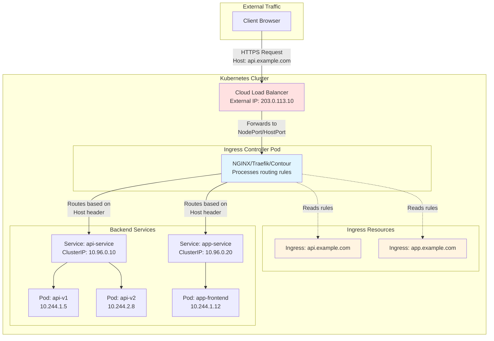
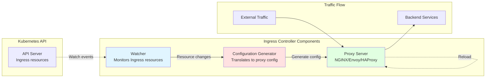
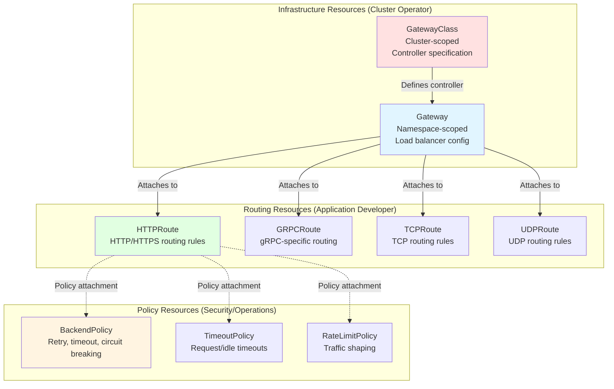
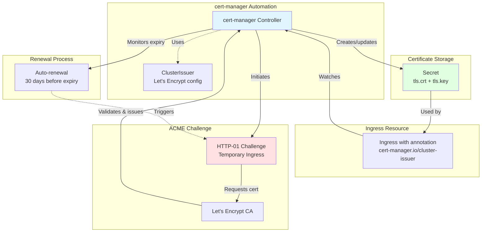

---
date:
  created: 2025-11-11
authors:
  - alf
categories:
  - Kubernetes
  - Networking
tags:
  - kubernetes
  - k8s
  - cka-prep
  - ingress
  - gateway-api
  - networking
  - traffic-management
readtime: 15
slug: kubernetes-ingress-gateway-api
---

# Ingress and Gateway API: Modern Traffic Management

In production Kubernetes environments, managing external access to your services is critical. While Services handle internal cluster networking, **Ingress** provides sophisticated HTTP/HTTPS routing from the outside world. This guide covers everything you need to know for the CKA exam and production deployments, including the modern Gateway API that's reshaping Kubernetes networking in 2025.

## Why Ingress Matters

Imagine running 50 microservices in your cluster. Without Ingress, you'd need 50 LoadBalancer Services—each with its own expensive cloud load balancer and public IP address. That's not just costly; it's operationally nightmarish.

Ingress solves this by providing:

- **Cost efficiency**: One load balancer for multiple services
- **Advanced routing**: Path-based, host-based, header-based routing
- **SSL/TLS termination**: Centralized certificate management
- **Name-based virtual hosting**: Multiple domains on one IP
- **Protocol support**: HTTP, HTTPS, WebSocket, gRPC

For the CKA exam, you'll need to demonstrate hands-on competency with Ingress resources, troubleshoot misconfigurations, and understand controller selection. In production, mastering Ingress means the difference between elegant traffic management and a tangled mess of load balancers.

The landscape is evolving. While traditional Ingress remains the standard (and what's tested on the CKA), the **Gateway API** represents Kubernetes networking's future—offering role-oriented design, better extensibility, and more expressive routing rules. Understanding both is essential for modern Kubernetes practitioners.

<!-- more -->



## Ingress Fundamentals

### What is Ingress?

Ingress is an API object that defines rules for routing external HTTP(S) traffic to services inside your cluster. Think of it as a sophisticated reverse proxy configuration expressed as Kubernetes YAML. Unlike Services which operate at Layer 4 (TCP/UDP), Ingress works at Layer 7 (HTTP/HTTPS), giving you application-aware routing.

**The Two-Part Architecture:**

1. **Ingress Resource**: The YAML configuration defining routing rules
2. **Ingress Controller**: The actual software that reads these resources and implements the routing logic

This separation is crucial—you can have dozens of Ingress resources, but they do nothing without a controller to act on them.

### Ingress Controller Architecture

An Ingress controller is essentially three components working together:



**How it works:**

1. **Watcher** continuously monitors the Kubernetes API for Ingress resource changes
2. **Configuration Generator** translates Ingress rules into proxy-specific config (NGINX conf, Envoy YAML, etc.)
3. **Proxy Server** reloads configuration and routes traffic accordingly

### Popular Controllers (2025 Comparison)

| Controller | Best For | Strengths | Considerations |
|------------|----------|-----------|----------------|
| **NGINX Ingress** | General production use | Battle-tested, extensive features, large community | Configuration via annotations can be complex |
| **Traefik** | Dynamic environments | Auto-discovery, native Let's Encrypt, beautiful UI | Higher resource usage |
| **Contour** | Enterprise, security-focused | Envoy-based, graceful shutdowns, Gateway API support | Steeper learning curve |
| **HAProxy Ingress** | High performance | Excellent performance, advanced load balancing | Smaller community than NGINX |

**2025 Recommendation for CKA Prep:**

Use **NGINX Ingress Controller** for exam preparation. It's the de facto standard, well-documented, and most likely to match exam scenarios. Install with:

```bash
kubectl apply -f https://raw.githubusercontent.com/kubernetes/ingress-nginx/controller-v1.11.2/deploy/static/provider/cloud/deploy.yaml
```

**Production Recommendation:**

Consider **Contour** if you're investing in Gateway API (it has excellent support), or stick with **NGINX** for mature, stable deployments with extensive community resources.

## Ingress Resources

### Basic Structure

Every Ingress resource follows this pattern:

```yaml
apiVersion: networking.k8s.io/v1
kind: Ingress
metadata:
  name: example-ingress
  namespace: production
  annotations:
    # Controller-specific configuration
    nginx.ingress.kubernetes.io/rewrite-target: /
spec:
  ingressClassName: nginx  # Critical: specifies which controller handles this
  rules:
  - host: api.example.com
    http:
      paths:
      - path: /v1
        pathType: Prefix
        backend:
          service:
            name: api-v1-service
            port:
              number: 8080
```

**Key Fields:**

- **ingressClassName**: Specifies which controller processes this Ingress (required in v1)
- **rules**: Array of routing rules
- **host**: Optional hostname for virtual hosting
- **paths**: Array of path-based routing rules
- **pathType**: `Exact`, `Prefix`, or `ImplementationSpecific`

### Path-Based Routing

Route different paths to different services—perfect for microservices architectures:

```yaml
apiVersion: networking.k8s.io/v1
kind: Ingress
metadata:
  name: path-routing
  namespace: default
spec:
  ingressClassName: nginx
  rules:
  - host: shop.example.com
    http:
      paths:
      # Product catalog microservice
      - path: /products
        pathType: Prefix
        backend:
          service:
            name: catalog-service
            port:
              number: 80

      # Shopping cart microservice
      - path: /cart
        pathType: Prefix
        backend:
          service:
            name: cart-service
            port:
              number: 8080

      # Exact match for homepage
      - path: /
        pathType: Exact
        backend:
          service:
            name: frontend-service
            port:
              number: 3000
```

**PathType Semantics:**

- **Exact**: Matches the URL path exactly (case-sensitive)
- **Prefix**: Matches based on URL path prefix split by `/`
- **ImplementationSpecific**: Interpretation depends on IngressClass

**CKA Tip:** Understand prefix matching behavior. `/foo` matches `/foo`, `/foo/`, and `/foo/bar`, but **not** `/foobar`.

### Host-Based Routing

Single IP address, multiple domains—critical for multi-tenant environments:

```yaml
apiVersion: networking.k8s.io/v1
kind: Ingress
metadata:
  name: multi-tenant
  namespace: saas-platform
spec:
  ingressClassName: nginx
  rules:
  # Customer A's subdomain
  - host: acme.platform.com
    http:
      paths:
      - path: /
        pathType: Prefix
        backend:
          service:
            name: acme-tenant-service
            port:
              number: 80

  # Customer B's subdomain
  - host: globex.platform.com
    http:
      paths:
      - path: /
        pathType: Prefix
        backend:
          service:
            name: globex-tenant-service
            port:
              number: 80

  # Default backend for unmatched hosts
  defaultBackend:
    service:
      name: default-404-service
      port:
        number: 80
```

### TLS/SSL Termination

Production traffic must be encrypted. Ingress handles TLS termination at the edge:

```yaml
apiVersion: networking.k8s.io/v1
kind: Ingress
metadata:
  name: tls-ingress
  namespace: production
  annotations:
    # Force HTTPS redirect
    nginx.ingress.kubernetes.io/force-ssl-redirect: "true"
    # Modern TLS configuration
    nginx.ingress.kubernetes.io/ssl-protocols: "TLSv1.2 TLSv1.3"
spec:
  ingressClassName: nginx
  tls:
  # TLS configuration
  - hosts:
    - secure.example.com
    - api.example.com
    secretName: example-tls-cert  # Secret containing tls.crt and tls.key
  rules:
  - host: secure.example.com
    http:
      paths:
      - path: /
        pathType: Prefix
        backend:
          service:
            name: secure-service
            port:
              number: 443
```

**Creating the TLS Secret:**

```bash
# From certificate files
kubectl create secret tls example-tls-cert \
  --cert=path/to/tls.crt \
  --key=path/to/tls.key \
  --namespace=production

# Using cert-manager (recommended for production)
# See Advanced Patterns section
```

```mermaid
sequenceDiagram
    participant Client
    participant LB as Load Balancer
    participant IC as Ingress Controller
    participant Secret as TLS Secret
    participant Backend as Backend Pod

    Note over Client,Backend: TLS Termination Flow

    Client->>LB: HTTPS Request (encrypted)
    LB->>IC: Forward to Ingress Controller

    IC->>Secret: Read TLS certificate
    Secret-->>IC: tls.crt + tls.key

    IC->>IC: TLS handshake<br/>Decrypt request

    Note over IC: Certificate validated<br/>Traffic decrypted

    IC->>Backend: HTTP Request (plain text)<br/>Internal cluster communication
    Backend-->>IC: HTTP Response

    IC->>IC: Encrypt response
    IC-->>LB: HTTPS Response (encrypted)
    LB-->>Client: HTTPS Response (encrypted)

    style IC fill:#e1f5ff
    style Secret fill:#ffe1e1
```

### Controller Annotations

Annotations provide controller-specific configuration beyond the Ingress spec. Here are production-critical NGINX examples:

```yaml
apiVersion: networking.k8s.io/v1
kind: Ingress
metadata:
  name: advanced-config
  annotations:
    # Rate limiting (DDoS protection)
    nginx.ingress.kubernetes.io/limit-rps: "100"

    # Connection limits
    nginx.ingress.kubernetes.io/limit-connections: "10"

    # Request body size (file uploads)
    nginx.ingress.kubernetes.io/proxy-body-size: "50m"

    # Timeouts
    nginx.ingress.kubernetes.io/proxy-connect-timeout: "60"
    nginx.ingress.kubernetes.io/proxy-send-timeout: "60"
    nginx.ingress.kubernetes.io/proxy-read-timeout: "60"

    # CORS headers
    nginx.ingress.kubernetes.io/enable-cors: "true"
    nginx.ingress.kubernetes.io/cors-allow-origin: "https://app.example.com"

    # Sticky sessions (affinity)
    nginx.ingress.kubernetes.io/affinity: "cookie"
    nginx.ingress.kubernetes.io/session-cookie-name: "route"

    # Custom error pages
    nginx.ingress.kubernetes.io/custom-http-errors: "404,503"
    nginx.ingress.kubernetes.io/default-backend: "custom-error-service"
spec:
  ingressClassName: nginx
  rules:
  - host: api.example.com
    http:
      paths:
      - path: /
        pathType: Prefix
        backend:
          service:
            name: api-service
            port:
              number: 8080
```

**CKA Exam Warning:** Annotations are controller-specific. NGINX annotations won't work with Traefik. Always check documentation for your chosen controller.

## Gateway API: The Future of Kubernetes Networking

### Why Gateway API Exists

Traditional Ingress has served Kubernetes well, but it has fundamental limitations:

**Ingress Limitations:**

1. **Annotations hell**: Controller-specific configuration scattered across annotations
2. **Limited expressiveness**: No header matching, query parameter routing, traffic splitting
3. **Single role design**: No separation between cluster operators and application developers
4. **Protocol limitations**: Primarily HTTP/HTTPS, limited gRPC/TCP support

**Gateway API Solutions:**

- **Role-oriented**: Separate resources for infrastructure (GatewayClass, Gateway) and application routing (HTTPRoute, TCPRoute)
- **Expressive**: First-class support for header matching, traffic splitting, redirects, rewrites
- **Extensible**: Policy attachment mechanism instead of annotations
- **Protocol-rich**: Native support for HTTP, HTTPS, gRPC, TCP, TLS, UDP

As of **2025**, Gateway API v1.4.0 is production-ready and rapidly gaining adoption. It's not yet on the CKA exam, but forward-thinking practitioners should learn it now.

### Gateway API Resource Hierarchy



### Core Resources

**1. GatewayClass (Cluster Operator)**

Defines which controller implementation to use—similar to IngressClass but more powerful:

```yaml
apiVersion: gateway.networking.k8s.io/v1
kind: GatewayClass
metadata:
  name: contour-gateway
spec:
  controllerName: projectcontour.io/gateway-controller
  parametersRef:
    group: projectcontour.io
    kind: ContourDeployment
    name: contour-gateway-config
```

**2. Gateway (Platform Team)**

Represents the load balancer configuration—infrastructure that application teams will use:

```yaml
apiVersion: gateway.networking.k8s.io/v1
kind: Gateway
metadata:
  name: production-gateway
  namespace: infrastructure
spec:
  gatewayClassName: contour-gateway
  listeners:
  # HTTPS listener
  - name: https
    protocol: HTTPS
    port: 443
    hostname: "*.example.com"
    tls:
      mode: Terminate
      certificateRefs:
      - kind: Secret
        name: wildcard-tls-cert
    allowedRoutes:
      namespaces:
        from: All  # Allow routes from any namespace

  # HTTP listener (redirect to HTTPS)
  - name: http
    protocol: HTTP
    port: 80
    hostname: "*.example.com"
    allowedRoutes:
      namespaces:
        from: All
```

**3. HTTPRoute (Application Developers)**

Defines HTTP routing rules—what application teams interact with:

```yaml
apiVersion: gateway.networking.k8s.io/v1
kind: HTTPRoute
metadata:
  name: api-route
  namespace: production
spec:
  parentRefs:
  - name: production-gateway
    namespace: infrastructure

  hostnames:
  - api.example.com

  rules:
  # Header-based routing
  - matches:
    - headers:
      - name: X-API-Version
        value: v2
    backendRefs:
    - name: api-v2-service
      port: 8080

  # Path-based routing with weight (traffic splitting)
  - matches:
    - path:
        type: PathPrefix
        value: /users
    backendRefs:
    - name: users-v1-service
      port: 80
      weight: 90  # 90% of traffic
    - name: users-v2-service
      port: 80
      weight: 10  # 10% of traffic (canary)

  # Query parameter matching
  - matches:
    - queryParams:
      - name: beta
        value: "true"
    backendRefs:
    - name: beta-service
      port: 8080
```

### Advantages Over Ingress

| Capability | Ingress | Gateway API |
|------------|---------|-------------|
| **Role separation** | No | Yes (GatewayClass/Gateway vs Routes) |
| **Header matching** | Via annotations | Native in HTTPRoute |
| **Traffic splitting** | Via annotations | Native with weights |
| **Query parameters** | Not supported | Native matching |
| **Cross-namespace routing** | Limited | First-class support |
| **Retry/timeout policies** | Via annotations | Separate policy resources |
| **Protocol support** | HTTP/HTTPS | HTTP, HTTPS, gRPC, TCP, UDP, TLS |
| **Redirect/rewrite** | Via annotations | Native in rules |

**Real-World Example:**

```yaml
# Gateway API: Native canary deployment
apiVersion: gateway.networking.k8s.io/v1
kind: HTTPRoute
metadata:
  name: canary-deployment
spec:
  parentRefs:
  - name: production-gateway
  rules:
  - backendRefs:
    - name: stable-service
      port: 80
      weight: 95  # 95% to stable
    - name: canary-service
      port: 80
      weight: 5   # 5% to canary
```

```yaml
# Ingress: Requires complex annotations
apiVersion: networking.k8s.io/v1
kind: Ingress
metadata:
  name: canary-deployment
  annotations:
    nginx.ingress.kubernetes.io/canary: "true"
    nginx.ingress.kubernetes.io/canary-weight: "5"
spec:
  # ... rest of configuration
```

### Migration Strategies

**1. Parallel Adoption (Recommended)**

Run Ingress and Gateway API side-by-side:

```bash
# Install Gateway API CRDs
kubectl apply -f https://github.com/kubernetes-sigs/gateway-api/releases/download/v1.4.0/standard-install.yaml

# Install Contour Gateway (excellent Gateway API support)
kubectl apply -f https://projectcontour.io/quickstart/contour-gateway.yaml

# Migrate services incrementally
# - New services use Gateway API
# - Existing services remain on Ingress
# - Migrate critical services last
```

**2. Testing Strategy**

```yaml
# Create test Gateway for validation
apiVersion: gateway.networking.k8s.io/v1
kind: Gateway
metadata:
  name: test-gateway
  namespace: testing
spec:
  gatewayClassName: contour-gateway
  listeners:
  - name: http
    protocol: HTTP
    port: 8080  # Different port to avoid conflicts
    allowedRoutes:
      namespaces:
        from: Same

---
# Test HTTPRoute
apiVersion: gateway.networking.k8s.io/v1
kind: HTTPRoute
metadata:
  name: test-route
  namespace: testing
spec:
  parentRefs:
  - name: test-gateway
  rules:
  - backendRefs:
    - name: test-service
      port: 80
```

**3. Production Cutover**

Once validated:

1. Deploy Gateway resource in production namespace
2. Create HTTPRoutes for all services
3. Update DNS to point to new Gateway load balancer IP
4. Monitor traffic carefully (use weights for gradual shift)
5. Deprecate Ingress resources after validation period

### 2025 Maturity Status

**Gateway API v1.4.0 (Current):**

- ✅ **GA**: GatewayClass, Gateway, HTTPRoute
- ✅ **Beta**: GRPCRoute, ReferenceGrant
- ✅ **Alpha**: TCPRoute, UDPRoute, TLSRoute, BackendTLSPolicy

**Production-Ready Controllers (2025):**

| Controller | Gateway API Support | Maturity |
|------------|-------------------|----------|
| **Contour** | v1.4.0, excellent | Production-ready |
| **Istio** | v1.4.0, comprehensive | Production-ready |
| **NGINX Gateway Fabric** | v1.4.0, growing | Production-ready |
| **Envoy Gateway** | v1.4.0, native | Production-ready |
| **Traefik** | v1.4.0, mature | Production-ready |

**Recommendation:** Gateway API is ready for production in 2025. If starting new projects, prefer Gateway API over traditional Ingress.

## Advanced Patterns

### Path Rewriting

Transform incoming paths before forwarding to backends:

```yaml
# NGINX Ingress: Annotation-based
apiVersion: networking.k8s.io/v1
kind: Ingress
metadata:
  name: path-rewrite
  annotations:
    nginx.ingress.kubernetes.io/rewrite-target: /$2
spec:
  ingressClassName: nginx
  rules:
  - host: api.example.com
    http:
      paths:
      # /api/users -> /users
      - path: /api(/|$)(.*)
        pathType: ImplementationSpecific
        backend:
          service:
            name: backend-service
            port:
              number: 8080
```

```yaml
# Gateway API: Native support
apiVersion: gateway.networking.k8s.io/v1
kind: HTTPRoute
metadata:
  name: path-rewrite
spec:
  parentRefs:
  - name: production-gateway
  rules:
  - matches:
    - path:
        type: PathPrefix
        value: /api
    filters:
    - type: URLRewrite
      urlRewrite:
        path:
          type: ReplacePrefixMatch
          replacePrefixMatch: /
    backendRefs:
    - name: backend-service
      port: 8080
```

### Traffic Splitting (Canary Deployments)

Gradually shift traffic to new versions:

```yaml
apiVersion: gateway.networking.k8s.io/v1
kind: HTTPRoute
metadata:
  name: canary-rollout
  namespace: production
spec:
  parentRefs:
  - name: production-gateway

  hostnames:
  - shop.example.com

  rules:
  - backendRefs:
    # Stable version (90%)
    - name: shop-v1
      port: 80
      weight: 90

    # Canary version (10%)
    - name: shop-v2
      port: 80
      weight: 10

---
# Progressive rollout plan:
# Week 1: 90/10 split
# Week 2: 75/25 split (update weights)
# Week 3: 50/50 split
# Week 4: 0/100 split (full cutover)
# Week 5: Remove shop-v1 service
```

### Header Manipulation

Add, modify, or remove headers:

```yaml
apiVersion: gateway.networking.k8s.io/v1
kind: HTTPRoute
metadata:
  name: header-manipulation
spec:
  parentRefs:
  - name: production-gateway

  rules:
  - matches:
    - path:
        type: PathPrefix
        value: /api

    filters:
    # Add custom headers
    - type: RequestHeaderModifier
      requestHeaderModifier:
        add:
        - name: X-Request-Source
          value: gateway-api
        - name: X-Forwarded-Proto
          value: https

        # Remove headers
        remove:
        - X-Internal-Token

    # Response headers
    - type: ResponseHeaderModifier
      responseHeaderModifier:
        add:
        - name: X-Cache-Status
          value: MISS
        - name: Strict-Transport-Security
          value: max-age=31536000; includeSubDomains

    backendRefs:
    - name: api-service
      port: 8080
```

### Rate Limiting

Protect backends from traffic spikes:

```yaml
# NGINX Ingress: Annotation-based
apiVersion: networking.k8s.io/v1
kind: Ingress
metadata:
  name: rate-limited
  annotations:
    # 10 requests per second per IP
    nginx.ingress.kubernetes.io/limit-rps: "10"

    # Burst capacity
    nginx.ingress.kubernetes.io/limit-burst-multiplier: "5"

    # Connection limits
    nginx.ingress.kubernetes.io/limit-connections: "20"

    # Custom error response
    nginx.ingress.kubernetes.io/limit-rate-status-code: "429"
spec:
  ingressClassName: nginx
  rules:
  - host: api.example.com
    http:
      paths:
      - path: /
        pathType: Prefix
        backend:
          service:
            name: api-service
            port:
              number: 8080
```

For Gateway API, rate limiting is typically implemented via policy attachment (implementation-specific):

```yaml
# Example: Contour BackendPolicy (implementation-specific)
apiVersion: projectcontour.io/v1alpha1
kind: RateLimitPolicy
metadata:
  name: api-rate-limit
spec:
  targetRef:
    group: gateway.networking.k8s.io
    kind: HTTPRoute
    name: api-route
  rateLimits:
  - limit: 100
    unit: minute
    local:
      type: PerIP
```

### cert-manager Integration

Automate TLS certificate management:

```yaml
# Install cert-manager
kubectl apply -f https://github.com/cert-manager/cert-manager/releases/download/v1.15.0/cert-manager.yaml

---
# Create ClusterIssuer for Let's Encrypt
apiVersion: cert-manager.io/v1
kind: ClusterIssuer
metadata:
  name: letsencrypt-prod
spec:
  acme:
    server: https://acme-v02.api.letsencrypt.org/directory
    email: admin@example.com
    privateKeySecretRef:
      name: letsencrypt-prod-key
    solvers:
    - http01:
        ingress:
          ingressClassName: nginx

---
# Ingress with automatic certificate
apiVersion: networking.k8s.io/v1
kind: Ingress
metadata:
  name: auto-tls
  annotations:
    cert-manager.io/cluster-issuer: "letsencrypt-prod"
spec:
  ingressClassName: nginx
  tls:
  - hosts:
    - secure.example.com
    secretName: secure-example-tls  # cert-manager creates this automatically
  rules:
  - host: secure.example.com
    http:
      paths:
      - path: /
        pathType: Prefix
        backend:
          service:
            name: web-service
            port:
              number: 80
```

**Certificate Lifecycle:**

1. cert-manager watches Ingress resources
2. Detects `cert-manager.io/cluster-issuer` annotation
3. Initiates ACME challenge with Let's Encrypt
4. Creates temporary Ingress for HTTP-01 challenge
5. Obtains certificate and stores in Secret
6. Automatically renews 30 days before expiration



## CKA Exam Skills

### Creating Ingress Imperatively

The CKA is a hands-on performance exam. Speed matters. Here's how to create Ingress resources quickly:

```bash
# Basic Ingress (doesn't exist in kubectl create, use dry-run)
kubectl create ingress simple-ingress \
  --rule="example.com/path*=service:80" \
  --dry-run=client -o yaml > ingress.yaml

# Edit and apply
vim ingress.yaml  # Add ingressClassName: nginx
kubectl apply -f ingress.yaml

# Faster: Use kubectl run with generator (legacy but useful)
kubectl create ingress api-ingress \
  --class=nginx \
  --rule="api.example.com/v1*=api-svc:8080" \
  --rule="api.example.com/v2*=api-v2-svc:8080"

# Multiple hosts
kubectl create ingress multi-host \
  --class=nginx \
  --rule="app1.example.com/*=app1-svc:80" \
  --rule="app2.example.com/*=app2-svc:80"

# With TLS
kubectl create ingress tls-ingress \
  --class=nginx \
  --rule="secure.example.com/*=web-svc:443,tls=secure-tls-secret"
```

**Exam Tip:** Practice these commands repeatedly. In the exam, you can't afford to write 40 lines of YAML for a simple Ingress.

### Troubleshooting Workflow

When Ingress isn't working, follow this systematic approach:

```bash
# 1. Verify Ingress controller is running
kubectl get pods -n ingress-nginx
# Should show: ingress-nginx-controller-xxx Running

# 2. Check Ingress resource exists and is valid
kubectl get ingress -A
kubectl describe ingress <name> -n <namespace>
# Look for: Address field populated, Events for errors

# 3. Verify IngressClass configuration
kubectl get ingressclass
# Should match spec.ingressClassName in your Ingress

# 4. Check backend Service exists
kubectl get svc <service-name> -n <namespace>
# Verify port matches Ingress backend port

# 5. Test backend Service directly (bypass Ingress)
kubectl run test-pod --image=curlimages/curl -it --rm -- \
  curl http://<service-name>.<namespace>.svc.cluster.local:<port>
# If this fails, problem is backend, not Ingress

# 6. Check controller logs
kubectl logs -n ingress-nginx deployment/ingress-nginx-controller --tail=50
# Look for: Configuration errors, backend sync issues

# 7. Verify DNS/hostname resolution
kubectl run test-dns --image=busybox -it --rm -- nslookup <hostname>

# 8. Test from within cluster
kubectl run test-curl --image=curlimages/curl -it --rm -- \
  curl -H "Host: example.com" http://<ingress-controller-service-ip>

# 9. Check Ingress controller Service
kubectl get svc -n ingress-nginx
# Type should be LoadBalancer or NodePort
# EXTERNAL-IP should be assigned (if LoadBalancer)
```

### Common Misconfigurations

**1. Missing IngressClass**

```yaml
# ❌ WRONG: No ingressClassName specified
apiVersion: networking.k8s.io/v1
kind: Ingress
metadata:
  name: broken-ingress
spec:
  rules:
  - host: example.com
    http:
      paths:
      - path: /
        pathType: Prefix
        backend:
          service:
            name: web-svc
            port:
              number: 80

# ✅ CORRECT: Explicitly set ingressClassName
spec:
  ingressClassName: nginx  # Critical in v1 API
  rules:
  # ... rest of spec
```

**Symptom:** Ingress exists but no Address assigned, controller ignores it.

**2. Wrong PathType**

```yaml
# ❌ WRONG: PathType doesn't match intent
spec:
  rules:
  - http:
      paths:
      - path: /api
        pathType: Exact  # Only matches /api, not /api/users
        backend:
          service:
            name: api-svc
            port:
              number: 8080

# ✅ CORRECT: Use Prefix for path hierarchies
      - path: /api
        pathType: Prefix  # Matches /api, /api/, /api/users, etc.
```

**Symptom:** 404 errors for valid paths.

**3. Service Port Mismatch**

```yaml
# Service definition
apiVersion: v1
kind: Service
metadata:
  name: web-svc
spec:
  ports:
  - port: 8080  # Service port
    targetPort: 80  # Container port

---
# ❌ WRONG: Using targetPort in Ingress
spec:
  rules:
  - http:
      paths:
      - path: /
        pathType: Prefix
        backend:
          service:
            name: web-svc
            port:
              number: 80  # WRONG: Should be 8080 (Service port)

# ✅ CORRECT: Use Service port, not targetPort
            port:
              number: 8080  # Matches Service spec.ports[0].port
```

**Symptom:** 503 Service Temporarily Unavailable.

**4. Namespace Confusion**

```yaml
# ❌ WRONG: Ingress in different namespace than Service
apiVersion: networking.k8s.io/v1
kind: Ingress
metadata:
  name: cross-namespace
  namespace: default  # Ingress is here
spec:
  rules:
  - http:
      paths:
      - path: /
        pathType: Prefix
        backend:
          service:
            name: web-svc  # Service is in 'production' namespace
            port:
              number: 80

# ✅ CORRECT: Ingress must be in same namespace as Service
metadata:
  namespace: production  # Match Service namespace
```

**Symptom:** Backend service not found errors.

### Fast Debugging Techniques

**Technique 1: Quick validation pod**

```bash
# Create debug pod with networking tools
kubectl run debug --image=nicolaka/netshoot -it --rm -- bash

# Inside pod:
# Test Service directly
curl http://api-svc.production.svc.cluster.local:8080

# Test Ingress controller
curl -H "Host: api.example.com" http://<ingress-controller-ip>

# DNS resolution
nslookup api.example.com
```

**Technique 2: Controller dry-run**

```bash
# Check what controller would generate (NGINX)
kubectl exec -n ingress-nginx deployment/ingress-nginx-controller -- \
  cat /etc/nginx/nginx.conf | grep -A 20 "server_name example.com"
```

**Technique 3: Event watching**

```bash
# Watch Ingress events in real-time
kubectl get events -n production --watch | grep ingress

# Filter for errors
kubectl get events -n production --field-selector type=Warning
```

**Technique 4: Compare working vs broken**

```bash
# Export working Ingress
kubectl get ingress working-ingress -o yaml > working.yaml

# Export broken Ingress
kubectl get ingress broken-ingress -o yaml > broken.yaml

# Compare
diff working.yaml broken.yaml
```

## Conclusion

Mastering Ingress and Gateway API is essential for production Kubernetes operations and CKA exam success. Here's your action plan:

**For CKA Exam Preparation:**

1. Practice creating Ingress resources imperatively with `kubectl create ingress`
2. Master the troubleshooting workflow—it's predictable and systematic
3. Understand PathType semantics (Exact vs Prefix)
4. Know how to configure TLS with Secrets
5. Practice with NGINX Ingress Controller (most common in exams)

**For Production Systems:**

1. Use **cert-manager** for automated TLS certificate management
2. Implement rate limiting and request timeouts via annotations
3. Monitor controller logs and metrics
4. Consider **Gateway API** for new projects—it's the future
5. Separate infrastructure (Gateway) from application routing (HTTPRoute)

**Migration Path:**

- **2025-2026**: Run Ingress and Gateway API in parallel
- **2026+**: Migrate to Gateway API as primary routing mechanism
- **Long-term**: Gateway API will likely supersede Ingress in Kubernetes exams

The networking landscape is evolving, but the fundamentals remain: understand routing semantics, master troubleshooting, and build with production resilience in mind. Whether you're preparing for the CKA or architecting enterprise systems, these skills are your foundation.

Now go create some Ingress resources, break them, fix them, and build confidence through hands-on practice. That's how mastery happens.

---

**Next in the CKA series:** Network Policies and CNI Plugins—securing pod-to-pod communication and understanding cluster networking foundations.
