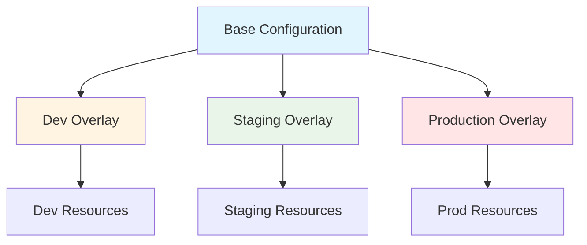
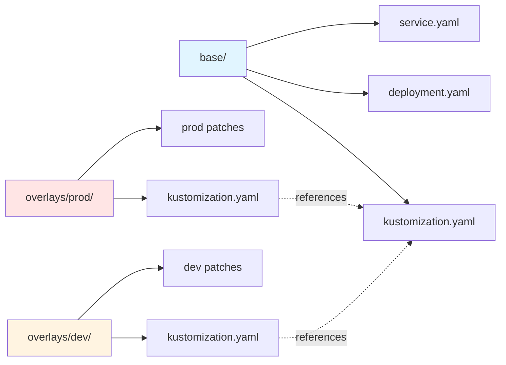
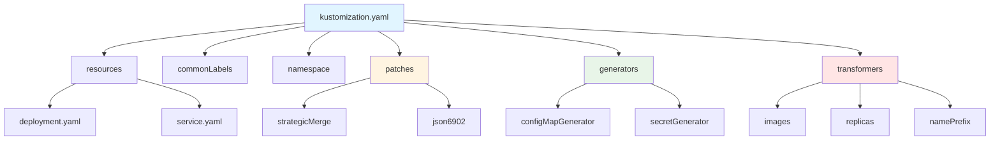
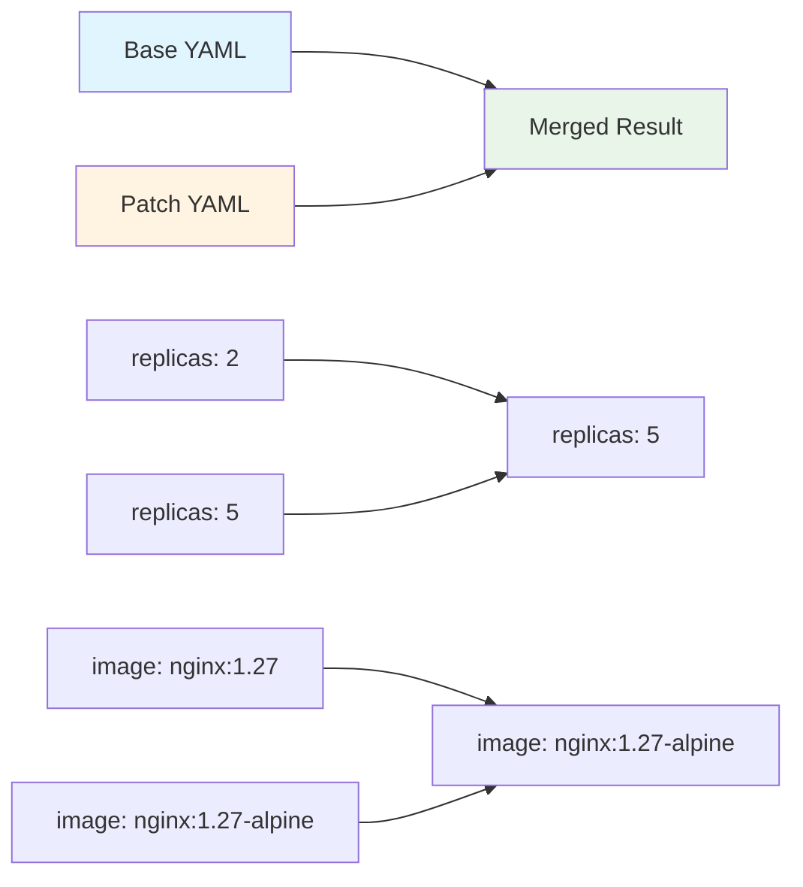
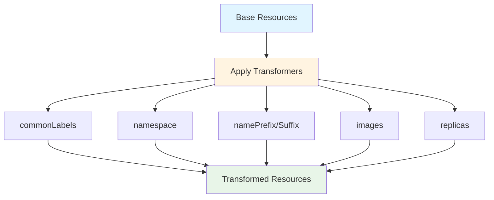
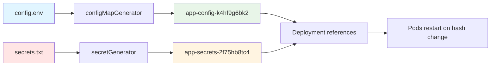
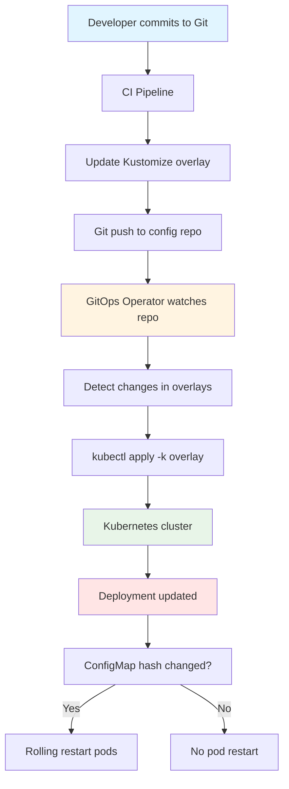

---
date:
  created: 2025-11-11
authors:
  - alf
categories:
  - Kubernetes
  - Configuration
tags:
  - kubernetes
  - k8s
  - cka-prep
  - kustomize
  - configuration
  - gitops
readtime: 12
slug: kustomize-template-free-configuration
---

# Kustomize: Template-Free Kubernetes Configuration Management

**Master Kustomize for declarative, overlay-based configuration customization without templates**

Kustomize is Kubernetes' native configuration management tool that allows you to customize application configurations without templates. Unlike Helm, Kustomize uses a template-free approach with overlays and patches, making it ideal for GitOps workflows and environment-specific customizations.

**Why Kustomize Matters for CKA:**
- Built into `kubectl` (no separate installation required)
- Template-free configuration reduces complexity
- GitOps-friendly with declarative overlays
- Strategic merge and JSON patches for targeted modifications
- ConfigMap and Secret generators for dynamic content

<!-- more -->

---

## 🎯 What is Kustomize?

Kustomize is a standalone tool integrated into `kubectl` that lets you customize Kubernetes YAML configurations through:

- **Bases**: Common configuration shared across environments
- **Overlays**: Environment-specific customizations
- **Patches**: Targeted modifications to base resources
- **Transformers**: Cross-cutting changes (labels, annotations, namespaces)
- **Generators**: Dynamic ConfigMap and Secret creation



**Key Philosophy:**
- **No templating**: Pure YAML with no `{{ }}` syntax
- **Declarative overlays**: Layer customizations instead of conditionals
- **Reusable bases**: Share common configuration across environments
- **Kubernetes-native**: Uses standard Kubernetes resources

---

## 📂 Kustomize Directory Structure

```
kustomize-app/
├── base/                      # Common configuration
│   ├── kustomization.yaml     # Base kustomization file
│   ├── deployment.yaml        # Base deployment
│   ├── service.yaml           # Base service
│   └── configmap.yaml         # Base config
│
└── overlays/                  # Environment-specific customizations
    ├── dev/
    │   ├── kustomization.yaml # Dev customizations
    │   ├── replica-count.yaml # Dev-specific patches
    │   └── dev-config.env     # Dev environment variables
    │
    ├── staging/
    │   ├── kustomization.yaml
    │   └── staging-patch.yaml
    │
    └── production/
        ├── kustomization.yaml
        ├── prod-patch.yaml
        └── prod-secrets.yaml
```



---

## 🧩 Kustomization File Structure

The `kustomization.yaml` file is the heart of Kustomize configuration:

### Base Kustomization

```yaml
# base/kustomization.yaml
apiVersion: kustomize.config.k8s.io/v1beta1
kind: Kustomization

# Resources to include
resources:
  - deployment.yaml
  - service.yaml
  - configmap.yaml

# Common labels applied to all resources
commonLabels:
  app: myapp
  managed-by: kustomize

# Common annotations
commonAnnotations:
  description: "Base configuration for myapp"

# Namespace for all resources
namespace: default

# Name prefix for all resources
namePrefix: myapp-

# Name suffix
nameSuffix: -v1

# Images to replace
images:
  - name: nginx
    newName: nginx
    newTag: "1.27"
```

### Overlay Kustomization

```yaml
# overlays/production/kustomization.yaml
apiVersion: kustomize.config.k8s.io/v1beta1
kind: Kustomization

# Reference base configuration
bases:
  - ../../base

# Override namespace
namespace: production

# Override name suffix
nameSuffix: -prod

# Patches for production-specific changes
patchesStrategicMerge:
  - replica-count.yaml
  - resource-limits.yaml

# JSON patches for targeted modifications
patchesJson6902:
  - target:
      group: apps
      version: v1
      kind: Deployment
      name: myapp
    path: add-security-context.yaml

# ConfigMap generator
configMapGenerator:
  - name: app-config
    envs:
      - prod-config.env

# Secret generator
secretGenerator:
  - name: app-secrets
    literals:
      - api-key=prod-key-placeholder

# Images for production
images:
  - name: nginx
    newName: nginx
    newTag: "1.27-alpine"

# Replicas transformer
replicas:
  - name: myapp
    count: 5
```



---

## 🔧 Patching Strategies

Kustomize supports two primary patching methods:

### 1. Strategic Merge Patches

Strategic merge patches overlay fields onto existing resources, merging arrays intelligently.

**Example: Increase Replicas**

```yaml
# overlays/production/replica-count.yaml
apiVersion: apps/v1
kind: Deployment
metadata:
  name: myapp
spec:
  replicas: 5  # Override base replica count
```

**Example: Add Resource Limits**

```yaml
# overlays/production/resource-limits.yaml
apiVersion: apps/v1
kind: Deployment
metadata:
  name: myapp
spec:
  template:
    spec:
      containers:
      - name: nginx
        resources:
          limits:
            cpu: "1000m"
            memory: "512Mi"
          requests:
            cpu: "500m"
            memory: "256Mi"
```

**How Strategic Merge Works:**



### 2. JSON6902 Patches

JSON6902 patches use JSONPath-like syntax for precise modifications (add, remove, replace, move, copy, test).

**Example: Add Security Context**

```yaml
# overlays/production/add-security-context.yaml
- op: add
  path: /spec/template/spec/securityContext
  value:
    runAsNonRoot: true
    runAsUser: 1000
    fsGroup: 2000

- op: add
  path: /spec/template/spec/containers/0/securityContext
  value:
    allowPrivilegeEscalation: false
    capabilities:
      drop: ["ALL"]
    readOnlyRootFilesystem: true
```

**Example: Replace Image Tag**

```yaml
- op: replace
  path: /spec/template/spec/containers/0/image
  value: nginx:1.27-alpine
```

**Example: Remove Resource**

```yaml
- op: remove
  path: /spec/template/spec/containers/0/resources/limits/cpu
```

**JSON6902 Operations:**

| Operation | Description | Example |
|-----------|-------------|---------|
| **add** | Add new field | Add security context |
| **remove** | Remove field | Remove resource limit |
| **replace** | Replace value | Change image tag |
| **move** | Move field location | Reorganize structure |
| **copy** | Copy field value | Duplicate configuration |
| **test** | Assert field value | Validation before patch |

---

## 🎨 Transformers

Transformers apply cross-cutting changes to all resources:

### Common Labels and Annotations

```yaml
# kustomization.yaml
commonLabels:
  app: myapp
  version: v1.2.3
  environment: production

commonAnnotations:
  managed-by: kustomize
  contact: devops@example.com
```

### Name Prefix and Suffix

```yaml
# Add prefix to all resource names
namePrefix: prod-

# Add suffix to all resource names
nameSuffix: -blue-green
```

**Result:**
```
Deployment: myapp → prod-myapp-blue-green
Service: myapp-svc → prod-myapp-svc-blue-green
```

### Namespace Transformer

```yaml
# Apply namespace to all resources
namespace: production
```

### Image Transformer

```yaml
images:
  - name: nginx
    newName: nginx
    newTag: "1.27-alpine"

  - name: redis
    newName: redis
    newTag: "7.2"
    digest: sha256:abc123...  # Optional: use digest for immutability
```

### Replica Transformer

```yaml
replicas:
  - name: myapp
    count: 5

  - name: worker
    count: 10
```



---

## 🔑 Generators

Generators create ConfigMaps and Secrets dynamically:

### ConfigMap Generator

**From Literal Values:**

```yaml
configMapGenerator:
  - name: app-config
    literals:
      - LOG_LEVEL=info
      - MAX_CONNECTIONS=100
      - TIMEOUT=30s
```

**From Files:**

```yaml
configMapGenerator:
  - name: app-config
    files:
      - application.properties
      - log4j.xml
```

**From .env Files:**

```yaml
configMapGenerator:
  - name: app-config
    envs:
      - config.env
```

```bash
# config.env
LOG_LEVEL=info
MAX_CONNECTIONS=100
TIMEOUT=30s
```

### Secret Generator

**From Literal Values:**

```yaml
secretGenerator:
  - name: app-secrets
    literals:
      - api-key=secret-key-placeholder
      - db-password=db-pass-placeholder
```

**From Files:**

```yaml
secretGenerator:
  - name: tls-secret
    files:
      - tls.crt
      - tls.key
    type: kubernetes.io/tls
```

**Immutable Secrets:**

```yaml
secretGenerator:
  - name: app-secrets
    literals:
      - api-key=secret-value
    options:
      immutable: true
      disableNameSuffixHash: false  # Append hash to name
```

**Generated ConfigMap/Secret Names:**

Kustomize automatically appends a content hash to generated ConfigMaps and Secrets:

```
app-config → app-config-k4hf9g6bk2
app-secrets → app-secrets-2f75hb8tc4
```

This triggers rolling updates when content changes (name change forces pod restart).



---

## 🚀 Kustomize Workflow

### Basic Commands

```bash
# Build kustomized YAML (preview without applying)
kubectl kustomize overlays/production

# Apply kustomized configuration
kubectl apply -k overlays/production

# Build and save to file
kubectl kustomize overlays/production > prod-manifests.yaml

# Diff before applying
kubectl diff -k overlays/production

# Delete resources
kubectl delete -k overlays/production
```

### Validation and Debugging

```bash
# Validate kustomization structure
kustomize build overlays/production

# Dry-run to check for errors
kubectl apply -k overlays/production --dry-run=client -o yaml

# Server-side dry-run with validation
kubectl apply -k overlays/production --dry-run=server

# Show differences between base and overlay
diff <(kubectl kustomize base) <(kubectl kustomize overlays/production)
```

---

## 🏗️ GitOps with Kustomize

Kustomize's template-free approach makes it ideal for GitOps:

### Repository Structure

```
gitops-repo/
├── apps/
│   ├── frontend/
│   │   ├── base/
│   │   │   ├── kustomization.yaml
│   │   │   ├── deployment.yaml
│   │   │   └── service.yaml
│   │   └── overlays/
│   │       ├── dev/
│   │       ├── staging/
│   │       └── production/
│   │
│   └── backend/
│       ├── base/
│       └── overlays/
│
└── infrastructure/
    ├── namespaces/
    ├── rbac/
    └── monitoring/
```

### GitOps Workflow



**Benefits for GitOps:**

- ✅ **Declarative**: All configuration in Git
- ✅ **Auditable**: Git history tracks all changes
- ✅ **Reviewable**: Pull requests for config changes
- ✅ **Rollback-friendly**: Git revert for instant rollback
- ✅ **Environment parity**: Overlays ensure consistency

---

## 🎯 Common CKA Exam Tasks

### Task 1: Create Base Configuration

```bash
# Create directory structure
mkdir -p kustomize-app/base
cd kustomize-app/base

# Create deployment
cat <<EOF > deployment.yaml
apiVersion: apps/v1
kind: Deployment
metadata:
  name: nginx
spec:
  replicas: 2
  selector:
    matchLabels:
      app: nginx
  template:
    metadata:
      labels:
        app: nginx
    spec:
      containers:
      - name: nginx
        image: nginx:1.27
        ports:
        - containerPort: 80
EOF

# Create service
cat <<EOF > service.yaml
apiVersion: v1
kind: Service
metadata:
  name: nginx
spec:
  selector:
    app: nginx
  ports:
  - port: 80
    targetPort: 80
EOF

# Create kustomization
cat <<EOF > kustomization.yaml
apiVersion: kustomize.config.k8s.io/v1beta1
kind: Kustomization

resources:
  - deployment.yaml
  - service.yaml

commonLabels:
  app: nginx
  managed-by: kustomize
EOF
```

### Task 2: Create Production Overlay

```bash
# Create overlay directory
mkdir -p ../overlays/production
cd ../overlays/production

# Create replica patch
cat <<EOF > replica-patch.yaml
apiVersion: apps/v1
kind: Deployment
metadata:
  name: nginx
spec:
  replicas: 5
EOF

# Create production kustomization
cat <<EOF > kustomization.yaml
apiVersion: kustomize.config.k8s.io/v1beta1
kind: Kustomization

bases:
  - ../../base

namespace: production

nameSuffix: -prod

patchesStrategicMerge:
  - replica-patch.yaml

images:
  - name: nginx
    newTag: "1.27-alpine"

commonLabels:
  environment: production
EOF
```

### Task 3: Generate ConfigMap from Environment File

```bash
# Create config file
cat <<EOF > prod-config.env
LOG_LEVEL=info
MAX_WORKERS=10
CACHE_ENABLED=true
EOF

# Add to kustomization
cat <<EOF >> kustomization.yaml

configMapGenerator:
  - name: app-config
    envs:
      - prod-config.env
EOF
```

### Task 4: Apply and Verify

```bash
# Preview kustomized output
kubectl kustomize .

# Apply configuration
kubectl apply -k .

# Verify resources
kubectl get deployments,services,configmaps -n production

# Check generated ConfigMap name (with hash)
kubectl get configmap -n production
# Output: app-config-k4hf9g6bk2

# Verify deployment uses correct ConfigMap
kubectl describe deployment nginx-prod -n production | grep -A5 ConfigMap
```

---

## 🔍 Advanced Patterns

### Multi-Base Composition

```yaml
# overlays/production/kustomization.yaml
bases:
  - ../../base/app
  - ../../base/database
  - ../../base/monitoring

# Combine multiple bases into single overlay
```

### Component Reuse

```yaml
# components/monitoring/kustomization.yaml
apiVersion: kustomize.config.k8s.io/v1alpha1
kind: Component

resources:
  - servicemonitor.yaml
  - prometheusrule.yaml

# Use in overlay:
components:
  - ../../components/monitoring
```

### Helm Chart Integration

```yaml
# Use Helm charts with Kustomize
helmCharts:
  - name: prometheus
    repo: https://prometheus-community.github.io/helm-charts
    version: 25.8.0
    releaseName: prometheus
    namespace: monitoring
    valuesInline:
      server:
        persistentVolume:
          enabled: false
```

### Variable Substitution

```yaml
# kustomization.yaml
vars:
  - name: APP_NAME
    objref:
      kind: Deployment
      name: myapp
      apiVersion: apps/v1
    fieldref:
      fieldpath: metadata.name

# Use in resources
configMapGenerator:
  - name: app-vars
    literals:
      - app-name=$(APP_NAME)
```

---

## 📝 Practice Exercises

### Exercise 1: Basic Kustomize Setup

**Task:** Create a base configuration for an Nginx deployment with 2 replicas, then create a production overlay that increases replicas to 5 and changes the namespace to `production`.

**Solution:**

```bash
# Create base
mkdir -p myapp/{base,overlays/production}

# Base deployment
cat <<EOF > myapp/base/deployment.yaml
apiVersion: apps/v1
kind: Deployment
metadata:
  name: nginx
spec:
  replicas: 2
  selector:
    matchLabels:
      app: nginx
  template:
    metadata:
      labels:
        app: nginx
    spec:
      containers:
      - name: nginx
        image: nginx:1.27
EOF

# Base kustomization
cat <<EOF > myapp/base/kustomization.yaml
apiVersion: kustomize.config.k8s.io/v1beta1
kind: Kustomization
resources:
  - deployment.yaml
EOF

# Production overlay patch
cat <<EOF > myapp/overlays/production/replica-patch.yaml
apiVersion: apps/v1
kind: Deployment
metadata:
  name: nginx
spec:
  replicas: 5
EOF

# Production kustomization
cat <<EOF > myapp/overlays/production/kustomization.yaml
apiVersion: kustomize.config.k8s.io/v1beta1
kind: Kustomization
bases:
  - ../../base
namespace: production
patchesStrategicMerge:
  - replica-patch.yaml
EOF

# Apply
kubectl apply -k myapp/overlays/production

# Verify
kubectl get deployment nginx -n production
```

### Exercise 2: ConfigMap Generator

**Task:** Create a ConfigMap using a generator from an environment file, and ensure the deployment references it. The ConfigMap should contain `APP_ENV=production` and `LOG_LEVEL=info`.

**Solution:**

```bash
# Create config file
cat <<EOF > myapp/overlays/production/prod.env
APP_ENV=production
LOG_LEVEL=info
EOF

# Update production kustomization
cat <<EOF >> myapp/overlays/production/kustomization.yaml

configMapGenerator:
  - name: app-config
    envs:
      - prod.env
EOF

# Update deployment to use ConfigMap
cat <<EOF > myapp/overlays/production/configmap-patch.yaml
apiVersion: apps/v1
kind: Deployment
metadata:
  name: nginx
spec:
  template:
    spec:
      containers:
      - name: nginx
        envFrom:
        - configMapRef:
            name: app-config
EOF

# Add patch to kustomization
cat <<EOF >> myapp/overlays/production/kustomization.yaml

patchesStrategicMerge:
  - replica-patch.yaml
  - configmap-patch.yaml
EOF

# Apply and verify
kubectl apply -k myapp/overlays/production
kubectl get configmap -n production  # Note the hash suffix
kubectl describe deployment nginx -n production | grep -A5 ConfigMap
```

### Exercise 3: JSON6902 Patch for Security Context

**Task:** Add a security context to the Nginx container using a JSON6902 patch that sets `runAsNonRoot: true` and `runAsUser: 1000`.

**Solution:**

```bash
# Create JSON6902 patch
cat <<EOF > myapp/overlays/production/security-patch.yaml
- op: add
  path: /spec/template/spec/securityContext
  value:
    runAsNonRoot: true
    runAsUser: 1000
    fsGroup: 2000

- op: add
  path: /spec/template/spec/containers/0/securityContext
  value:
    allowPrivilegeEscalation: false
    capabilities:
      drop: ["ALL"]
EOF

# Update kustomization to use JSON patch
cat <<EOF >> myapp/overlays/production/kustomization.yaml

patchesJson6902:
  - target:
      group: apps
      version: v1
      kind: Deployment
      name: nginx
    path: security-patch.yaml
EOF

# Apply
kubectl apply -k myapp/overlays/production

# Verify security context
kubectl get deployment nginx -n production -o yaml | grep -A10 securityContext
```

### Exercise 4: Multi-Environment Setup

**Task:** Create three overlays (dev, staging, production) with different replica counts (1, 3, 5) and namespaces.

**Solution:**

```bash
# Create overlay directories
mkdir -p myapp/overlays/{dev,staging,production}

# Dev overlay
cat <<EOF > myapp/overlays/dev/kustomization.yaml
apiVersion: kustomize.config.k8s.io/v1beta1
kind: Kustomization
bases:
  - ../../base
namespace: dev
replicas:
  - name: nginx
    count: 1
nameSuffix: -dev
EOF

# Staging overlay
cat <<EOF > myapp/overlays/staging/kustomization.yaml
apiVersion: kustomize.config.k8s.io/v1beta1
kind: Kustomization
bases:
  - ../../base
namespace: staging
replicas:
  - name: nginx
    count: 3
nameSuffix: -staging
EOF

# Production overlay
cat <<EOF > myapp/overlays/production/kustomization.yaml
apiVersion: kustomize.config.k8s.io/v1beta1
kind: Kustomization
bases:
  - ../../base
namespace: production
replicas:
  - name: nginx
    count: 5
nameSuffix: -prod
EOF

# Apply all environments
kubectl apply -k myapp/overlays/dev
kubectl apply -k myapp/overlays/staging
kubectl apply -k myapp/overlays/production

# Verify
kubectl get deployments --all-namespaces | grep nginx
```

### Exercise 5: Image Transformer

**Task:** Use the image transformer to update the Nginx image to `nginx:1.27-alpine` in production, keeping `nginx:1.27` in dev.

**Solution:**

```bash
# Update production kustomization
cat <<EOF >> myapp/overlays/production/kustomization.yaml

images:
  - name: nginx
    newName: nginx
    newTag: "1.27-alpine"
EOF

# Dev keeps base image (no transformer needed)
# Already using base nginx:1.27

# Apply both
kubectl apply -k myapp/overlays/dev
kubectl apply -k myapp/overlays/production

# Verify images
kubectl get deployment nginx-dev -n dev -o jsonpath='{.spec.template.spec.containers[0].image}'
# Output: nginx:1.27

kubectl get deployment nginx-prod -n production -o jsonpath='{.spec.template.spec.containers[0].image}'
# Output: nginx:1.27-alpine
```

---

## 📚 Quick Reference

### Essential Kustomize Commands

```bash
# Build kustomized YAML
kubectl kustomize <directory>
kustomize build <directory>

# Apply kustomized configuration
kubectl apply -k <directory>

# Delete resources
kubectl delete -k <directory>

# Diff before applying
kubectl diff -k <directory>

# Dry-run validation
kubectl apply -k <directory> --dry-run=client -o yaml
kubectl apply -k <directory> --dry-run=server

# Show field changes
kubectl kustomize <dir1> > base.yaml
kubectl kustomize <dir2> > overlay.yaml
diff base.yaml overlay.yaml
```

### Kustomization File Sections

| Section | Purpose |
|---------|---------|
| `resources` | List of YAML files to include |
| `bases` | Reference to base kustomizations (deprecated, use `resources`) |
| `patches` | Strategic merge patches |
| `patchesJson6902` | JSON6902 patches |
| `configMapGenerator` | Generate ConfigMaps |
| `secretGenerator` | Generate Secrets |
| `commonLabels` | Labels for all resources |
| `commonAnnotations` | Annotations for all resources |
| `namespace` | Namespace for all resources |
| `namePrefix` | Prefix for resource names |
| `nameSuffix` | Suffix for resource names |
| `images` | Image name/tag transformations |
| `replicas` | Replica count overrides |

### Patch Operations (JSON6902)

| Operation | Description | Example |
|-----------|-------------|---------|
| `add` | Add new field | Add security context |
| `remove` | Remove field | Remove resource limit |
| `replace` | Replace value | Change image tag |
| `move` | Move field | Reorganize structure |
| `copy` | Copy field | Duplicate config |
| `test` | Assert value | Validation check |

---

## 🔗 Related Posts

- [Helm: Kubernetes Package Manager](kubernetes-helm.md) - Template-based configuration management
- [ConfigMaps, Secrets, and Volume Mounts](configmaps-secrets.md) - Configuration injection patterns
- [Namespaces and Resource Quotas](namespaces-resource-quotas.md) - Multi-tenancy and isolation

---

## 📖 Additional Resources

- [Kustomize Official Documentation](https://kustomize.io/)
- [Kubernetes Kustomize Guide](https://kubernetes.io/docs/tasks/manage-kubernetes-objects/kustomization/)
- [Kustomize GitHub Repository](https://github.com/kubernetes-sigs/kustomize)

---

**CKA Exam Domain**: Cluster Architecture, Installation & Configuration (25%)

**Key Takeaways:**
- ✅ Kustomize provides template-free configuration customization
- ✅ Use bases for common config, overlays for environment-specific changes
- ✅ Strategic merge patches for simple changes, JSON6902 for precise modifications
- ✅ Generators automatically create ConfigMaps/Secrets with content hashes
- ✅ Transformers apply cross-cutting changes (labels, namespaces, images)
- ✅ Integrated into `kubectl` - no separate installation needed
- ✅ Ideal for GitOps workflows with declarative, auditable configuration

**Next:** [Troubleshooting Clusters, Nodes, and Components](cluster-troubleshooting.md)
