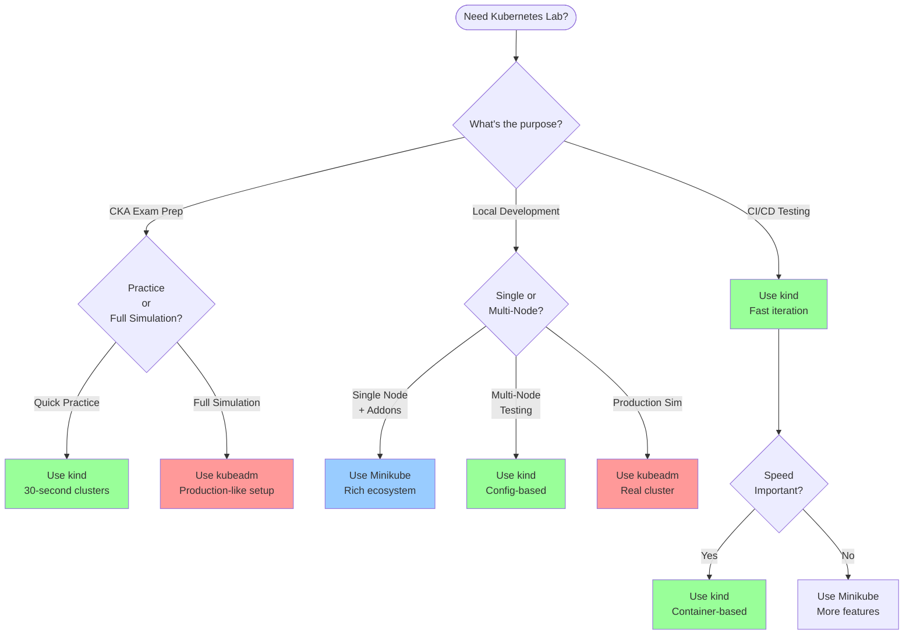
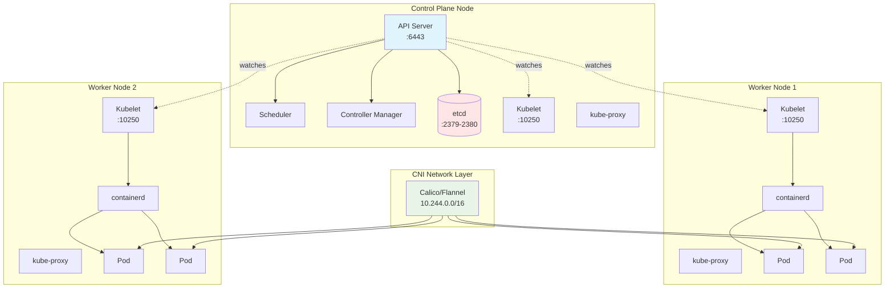
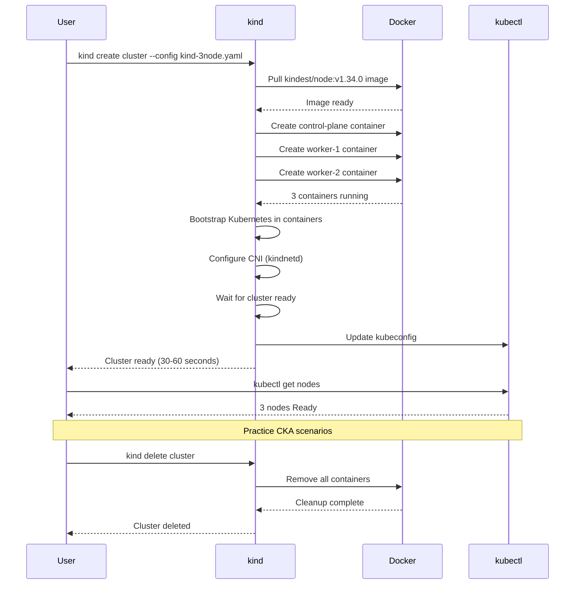
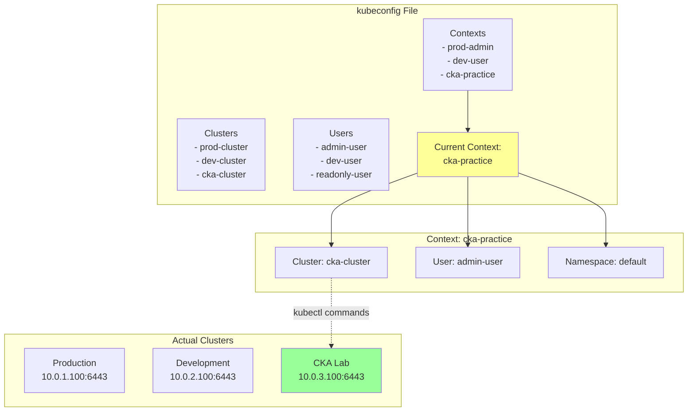
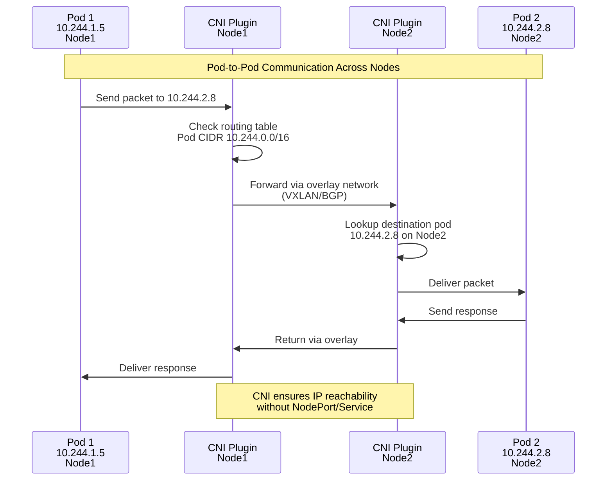
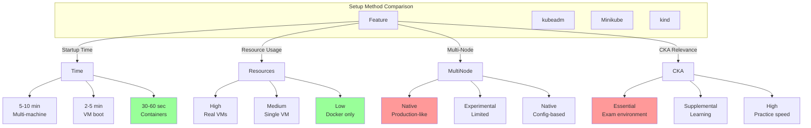

---
date:
  created: 2025-11-11
authors:
  - alf
categories:
  - Kubernetes
  - Infrastructure
tags:
  - kubernetes
  - k8s
  - cka-prep
  - kubeadm
  - kubectl
  - minikube
readtime: 12
slug: setting-up-kubernetes-lab
---

# Setting Up Your Kubernetes Lab Environment

Master the art of building Kubernetes clusters for CKA exam preparation. Learn kubeadm for production-grade setups, kind for rapid testing, and essential kubectl configuration for efficient cluster management.

<!-- more -->

## Overview

A proper lab environment is critical for CKA exam success. The exam uses kubeadm-based clusters, making hands-on practice with real cluster setup essential. This guide covers four primary methods for building Kubernetes environments:

1. **kubeadm** - Production-grade multi-node clusters (exam environment)
2. **kind** - Fast container-based clusters for rapid iteration
3. **Minikube** - Single-node local development with rich addons
4. **kubectl** - Essential CLI tool configuration and management

**CKA Exam Domain**: Cluster Architecture, Installation & Configuration (25%)

**Key Finding**: While the CKA exam uses kubeadm clusters, kind offers the fastest iteration for practice exercises. A combination of both provides optimal preparation.

---

## Lab Environment Decision Tree

Choosing the right lab setup depends on your immediate needs and learning phase.



---

## kubeadm: Production-Grade Cluster Setup

kubeadm is the official Kubernetes tool for bootstrapping production-grade clusters. **This is the tool used in the CKA exam environment.**

### Prerequisites

**System Requirements (Per Node)**:
- Ubuntu 20.04/22.04/24.04 or equivalent Debian-based system
- 2+ CPUs
- 2GB+ RAM
- Network connectivity between all nodes
- Unique hostname, MAC address, and product_uuid per node
- **Swap disabled** (critical requirement)

### Complete Installation Process

#### Step 1: Disable Swap (CRITICAL)

Kubernetes scheduler relies on accurate resource allocation. Swap can cause unpredictable behavior.

```bash
# Temporary disable
sudo swapoff -a

# Permanent disable - comment out swap in /etc/fstab
sudo sed -i '/ swap / s/^\(.*\)$/#\1/g' /etc/fstab

# Verify (swap line should show 0)
free -h
```

!!! warning "Exam Alert"
    The CKA exam expects swap to be disabled. Forgetting this step causes kubeadm init to fail.

#### Step 2: Install Container Runtime (containerd)

```bash
# Install containerd
sudo apt-get update
sudo apt-get install -y containerd

# Configure containerd
sudo mkdir -p /etc/containerd
containerd config default | sudo tee /etc/containerd/config.toml

# Restart and enable containerd
sudo systemctl restart containerd
sudo systemctl enable containerd

# Verify containerd is running
systemctl status containerd
```

#### Step 3: Install kubeadm, kubelet, kubectl

```bash
# Update package index and install prerequisites
sudo apt-get update
sudo apt-get install -y apt-transport-https ca-certificates curl gpg

# Add Kubernetes GPG key (NEW REPOSITORY)
curl -fsSL https://pkgs.k8s.io/core:/stable:/v1.34/deb/Release.key | \
  sudo gpg --dearmor -o /etc/apt/keyrings/kubernetes-apt-keyring.gpg

# Add Kubernetes repository
echo 'deb [signed-by=/etc/apt/keyrings/kubernetes-apt-keyring.gpg] https://pkgs.k8s.io/core:/stable:/v1.34/deb/ /' | \
  sudo tee /etc/apt/sources.list.d/kubernetes.list

# Install Kubernetes components
sudo apt-get update
sudo apt-get install -y kubelet kubeadm kubectl

# Hold packages at current version (prevent auto-upgrade)
sudo apt-mark hold kubelet kubeadm kubectl

# Enable kubelet
sudo systemctl enable --now kubelet
```

!!! note "Repository Change"
    The old repository `https://apt.kubernetes.io` is deprecated. Always use `pkgs.k8s.io` for new installations.

#### Step 4: Initialize Control Plane Node

```bash
# Basic initialization with pod network CIDR
sudo kubeadm init --pod-network-cidr=10.244.0.0/16

# For HA setup with load balancer
sudo kubeadm init \
  --control-plane-endpoint "LOAD_BALANCER_DNS:LOAD_BALANCER_PORT" \
  --upload-certs \
  --pod-network-cidr=10.244.0.0/16
```

**Expected Output**:
```
Your Kubernetes control-plane has initialized successfully!

To start using your cluster, you need to run the following as a regular user:

  mkdir -p $HOME/.kube
  sudo cp -i /etc/kubernetes/admin.conf $HOME/.kube/config
  sudo chown $(id -u):$(id -g) $HOME/.kube/config

You should now deploy a Pod network to the cluster.

You can now join any number of machines by running the following on each node:

  kubeadm join 192.168.0.200:6443 \
    --token 9vr73a.a8uxyaju799qwdjv \
    --discovery-token-ca-cert-hash sha256:7c2e69131a36ae2a042a339b33381c6d
```

**Save the join command** - you'll need it for worker nodes.

#### Step 5: Configure kubectl Access

```bash
# Configure kubectl for regular user
mkdir -p $HOME/.kube
sudo cp -i /etc/kubernetes/admin.conf $HOME/.kube/config
sudo chown $(id -u):$(id -g) $HOME/.kube/config

# Verify cluster access
kubectl cluster-info
kubectl get nodes
```

#### Step 6: Install CNI Network Plugin (CRITICAL)

Without a CNI plugin, nodes remain in "NotReady" state and pods cannot communicate.

**Option A: Calico (Recommended for CKA)**

```bash
# Install Calico operator
kubectl create -f https://raw.githubusercontent.com/projectcalico/calico/v3.27.0/manifests/tigera-operator.yaml

# Apply custom resources
kubectl create -f https://raw.githubusercontent.com/projectcalico/calico/v3.27.0/manifests/custom-resources.yaml

# Verify installation (wait for all pods to be Running)
watch kubectl get pods -n calico-system
```

**Option B: Flannel**

```bash
kubectl apply -f https://github.com/flannel-io/flannel/releases/latest/download/kube-flannel.yml
```

**Option C: Weave Net**

```bash
kubectl apply -f https://github.com/weaveworks/weave/releases/download/v2.8.1/weave-daemonset-k8s.yaml
```

After CNI installation, verify nodes are Ready:

```bash
kubectl get nodes
# NAME            STATUS   ROLES           AGE   VERSION
# control-plane   Ready    control-plane   5m    v1.34.0
```

#### Step 7: Join Worker Nodes

On each worker node (after completing Steps 1-3):

```bash
# Use the join command from Step 4 output
sudo kubeadm join 192.168.0.200:6443 \
  --token 9vr73a.a8uxyaju799qwdjv \
  --discovery-token-ca-cert-hash sha256:7c2e69131a36ae2a042a339b33381c6d
```

**If token expired** (tokens are valid for 24 hours):

```bash
# Generate new join command on control plane
kubeadm token create --print-join-command
```

### kubeadm Cluster Architecture



### Common kubeadm Issues and Solutions

#### Issue 1: "swap is enabled; production deployments should disable swap"

**Cause**: Swap not properly disabled

**Solution**:
```bash
sudo swapoff -a
sudo sed -i '/ swap / s/^\(.*\)$/#\1/g' /etc/fstab
sudo reboot
free -h  # Verify swap shows 0
```

#### Issue 2: "container runtime network not ready: cni config uninitialized"

**Cause**: No CNI plugin installed

**Solution**:
```bash
# Check CNI config directory
ls /etc/cni/net.d/

# If empty, install CNI plugin (Calico/Flannel)
kubectl create -f https://raw.githubusercontent.com/projectcalico/calico/v3.27.0/manifests/tigera-operator.yaml
kubectl create -f https://raw.githubusercontent.com/projectcalico/calico/v3.27.0/manifests/custom-resources.yaml

# Verify CNI pods running
kubectl get pods -n calico-system
```

#### Issue 3: Port 6443 already in use

**Cause**: Previous kubeadm installation not cleaned up

**Solution**:
```bash
# Reset kubeadm completely
sudo kubeadm reset

# Clean up directories
sudo rm -rf /etc/cni/net.d
sudo rm -rf $HOME/.kube/config

# Try initialization again
sudo kubeadm init --pod-network-cidr=10.244.0.0/16
```

#### Issue 4: Worker node join fails

**Causes**: Token expired, network connectivity, firewall rules

**Solutions**:
```bash
# Generate new join command
kubeadm token create --print-join-command

# Check connectivity from worker to control plane
ping <control-plane-ip>
nc -zv <control-plane-ip> 6443

# Required firewall ports:
# Control Plane: 6443, 2379-2380, 10250-10252
# Worker Nodes: 10250, 30000-32767
```

### kubeadm Configuration File Approach

For repeatable setups, use configuration files:

```yaml
# kubeadm-config.yaml
apiVersion: kubeadm.k8s.io/v1beta4
kind: InitConfiguration
localAPIEndpoint:
  advertiseAddress: 192.168.0.200
  bindPort: 6443
---
apiVersion: kubeadm.k8s.io/v1beta4
kind: ClusterConfiguration
networking:
  podSubnet: 10.244.0.0/16
  serviceSubnet: 10.96.0.0/16
kubernetesVersion: v1.34.0
---
apiVersion: kubeproxy.config.k8s.io/v1alpha1
kind: KubeProxyConfiguration
mode: ipvs
```

```bash
# Initialize with config file
sudo kubeadm init --config=kubeadm-config.yaml

# Generate default config template
kubeadm config print init-defaults > kubeadm-config.yaml
```

---

## kind: Kubernetes in Docker

kind runs Kubernetes clusters using Docker containers as "nodes". Excellent for rapid iteration and CKA practice.

### Installation

**Linux/macOS**:
```bash
# Using Homebrew (macOS)
brew install kind

# Direct binary download (Linux)
curl -Lo ./kind https://kind.sigs.k8s.io/dl/latest/kind-linux-amd64
chmod +x ./kind
sudo mv ./kind /usr/local/bin/kind

# Verify installation
kind version
```

**Prerequisites**:
- Docker installed and running
- kubectl installed
- 4GB+ RAM allocated to Docker
- 2+ CPUs for multi-node clusters

### Basic Usage

```bash
# Create default single-node cluster
kind create cluster

# Create cluster with custom name
kind create cluster --name cka-practice

# List clusters
kind get clusters

# Delete cluster
kind delete cluster --name cka-practice
```

### Multi-Node Cluster Configuration

**2-Node Cluster (1 Control Plane + 1 Worker)**:

```yaml
# kind-2node.yaml
kind: Cluster
apiVersion: kind.x-k8s.io/v1alpha4
nodes:
  - role: control-plane
  - role: worker
```

```bash
kind create cluster --config kind-2node.yaml --name cka-lab
```

**3-Node Cluster with Port Mapping**:

```yaml
# kind-3node.yaml
kind: Cluster
apiVersion: kind.x-k8s.io/v1alpha4
nodes:
  - role: control-plane
    extraPortMappings:
    - containerPort: 30080
      hostPort: 8080
      protocol: TCP
  - role: worker
  - role: worker
```

```bash
kind create cluster --config kind-3node.yaml --name multinode
```

**High Availability Control Plane (3 Control Plane + 3 Worker)**:

```yaml
# kind-ha.yaml
kind: Cluster
apiVersion: kind.x-k8s.io/v1alpha4
nodes:
  - role: control-plane
  - role: control-plane
  - role: control-plane
  - role: worker
  - role: worker
  - role: worker
```

### kind Cluster Lifecycle



### Load Docker Images into kind

For testing custom applications without pushing to registry:

```bash
# Build image locally
docker build -t my-app:1.0 .

# Load into kind cluster
kind load docker-image my-app:1.0 --name cka-lab

# Verify image available in cluster
docker exec -it cka-lab-control-plane crictl images | grep my-app
```

### When to Use kind

**Best For**:
- **CKA rapid practice**: Create/destroy clusters in seconds
- **Multi-node testing**: Easy configuration for complex topologies
- **CI/CD pipelines**: Fast, reproducible test environments
- **Integration testing**: Test applications in real cluster
- **Quick experiments**: Try configurations without VM overhead

**Not Ideal For**:
- **Learning basics**: Minikube has better addon ecosystem
- **Production simulation**: kubeadm provides real multi-machine setup
- **Resource-constrained systems**: Requires Docker overhead

---

## Minikube: Local Development Environment

Minikube creates single-node Kubernetes clusters on your local machine. Ideal for learning with rich addon support.

### Installation

**macOS**:
```bash
brew install minikube
minikube version
```

**Linux**:
```bash
curl -LO https://storage.googleapis.com/minikube/releases/latest/minikube-linux-amd64
sudo install minikube-linux-amd64 /usr/local/bin/minikube
minikube version
```

### Driver Options

**Docker Driver (Recommended)**:
```bash
# Start with Docker driver
minikube start --driver=docker

# Set as default
minikube config set driver docker
```

**QEMU Driver (ARM/M1 Macs)**:
```bash
minikube start --driver=qemu
```

### Resource Configuration

```bash
# Specify CPUs, memory, disk
minikube start \
  --driver=docker \
  --cpus=4 \
  --memory=8192 \
  --disk-size=40g \
  --kubernetes-version=v1.34.0
```

### Common Minikube Commands

```bash
# Start cluster
minikube start

# Stop cluster (preserves state)
minikube stop

# Delete cluster
minikube delete

# Check status
minikube status

# SSH into node
minikube ssh

# Open dashboard
minikube dashboard

# List addons
minikube addons list

# Enable addons
minikube addons enable ingress
minikube addons enable metrics-server
```

### Minikube Addons for CKA Practice

```bash
# Metrics Server (for kubectl top)
minikube addons enable metrics-server

# Ingress Controller
minikube addons enable ingress

# Storage Provisioner (dynamic PVs)
minikube addons enable storage-provisioner

# Dashboard
minikube addons enable dashboard
```

---

## kubectl Installation and Configuration

kubectl is the Kubernetes command-line tool. Mastery is essential for CKA exam success.

### Installation

**Linux**:
```bash
# Download latest release
curl -LO "https://dl.k8s.io/release/$(curl -L -s https://dl.k8s.io/release/stable.txt)/bin/linux/amd64/kubectl"

# Install
sudo install -o root -g root -m 0755 kubectl /usr/local/bin/kubectl

# Verify
kubectl version --client
```

**macOS**:
```bash
# Using Homebrew
brew install kubectl

# Verify
kubectl version --client
```

### Version Compatibility

kubectl version must be within **±1 minor version** of cluster version.

```bash
# Check versions
kubectl version --short

# Example compatible versions:
# Cluster: v1.34.0
# kubectl: v1.33.x, v1.34.x, v1.35.x ✅
# kubectl: v1.32.x, v1.36.x ❌
```

### Shell Completion Setup (CRITICAL for Exam Speed)

**Bash (Linux)**:
```bash
# Install bash-completion package
sudo apt-get install bash-completion

# Add completion to current shell
source <(kubectl completion bash)

# Add to .bashrc for persistence
echo 'source <(kubectl completion bash)' >> ~/.bashrc

# Alias completion (essential for exam)
echo 'alias k=kubectl' >> ~/.bashrc
echo 'complete -o default -F __start_kubectl k' >> ~/.bashrc

# Reload
source ~/.bashrc
```

**Zsh**:
```bash
# Add completion to .zshrc
echo 'source <(kubectl completion zsh)' >> ~/.zshrc

# Alias completion
echo 'alias k=kubectl' >> ~/.zshrc
echo 'complete -o default -F __start_kubectl k' >> ~/.zshrc

# Reload
source ~/.zshrc
```

!!! tip "Exam Tip"
    Practice using `k` instead of `kubectl` extensively. Tab completion saves critical minutes during the exam.

---

## kubeconfig Management

kubeconfig files contain cluster connection details. Managing multiple clusters efficiently is essential for the exam.

### kubeconfig File Structure

```yaml
apiVersion: v1
kind: Config
current-context: my-cluster

clusters:
- cluster:
    certificate-authority-data: <base64-encoded-ca>
    server: https://192.168.1.100:6443
  name: my-cluster

users:
- name: my-user
  user:
    client-certificate-data: <base64-encoded-cert>
    client-key-data: <base64-encoded-key>

contexts:
- context:
    cluster: my-cluster
    user: my-user
    namespace: default
  name: my-cluster-context
```

### Context Management Flow



### Essential Context Commands

```bash
# List all contexts
kubectl config get-contexts

# Show current context
kubectl config current-context

# Switch context
kubectl config use-context cka-practice

# Set default namespace for current context
kubectl config set-context --current --namespace=kube-system

# Create new context
kubectl config set-context dev-user \
  --cluster=dev-cluster \
  --namespace=development \
  --user=dev-user

# Rename context
kubectl config rename-context old-name new-name

# Delete context
kubectl config delete-context old-context
```

### Multiple Cluster Management

**Strategy 1: Merged Configuration (Recommended for Exam)**:

```bash
# Merge multiple kubeconfig files
export KUBECONFIG=~/.kube/config:~/.kube/dev-config:~/.kube/prod-config
kubectl config view --flatten > ~/.kube/merged-config

# Set as default
export KUBECONFIG=~/.kube/merged-config

# Add to .bashrc for persistence
echo 'export KUBECONFIG=~/.kube/merged-config' >> ~/.bashrc
```

**Strategy 2: Context-Specific Commands**:

```bash
# Use specific context for single command
kubectl --context=prod-cluster get nodes

# Use specific kubeconfig for single command
kubectl --kubeconfig=~/.kube/prod-config get pods

# Override namespace for single command
kubectl -n kube-system get pods
```

### Security Best Practices

```bash
# Protect kubeconfig files
chmod 600 ~/.kube/config
chmod 0400 ~/.kube/prod-config  # Read-only for production

# Never commit kubeconfig to version control
echo '.kube/' >> ~/.gitignore
```

---

## Common Exam Tasks

### Scenario 1: Rapid Cluster Setup for Practice

**Objective**: Create disposable cluster for practice scenario

```bash
# Create kind cluster
cat <<EOF | kind create cluster --config=-
kind: Cluster
apiVersion: kind.x-k8s.io/v1alpha4
nodes:
- role: control-plane
- role: worker
- role: worker
EOF

# Verify cluster ready
kubectl get nodes

# Practice exam task
kubectl run nginx --image=nginx
kubectl expose pod nginx --port=80 --type=NodePort

# Clean up when done
kind delete cluster
```

**Time**: 30-60 seconds for cluster creation

### Scenario 2: Multi-Cluster Context Switching

**Objective**: Practice switching between exam cluster contexts

```bash
# Assume exam provides contexts: cluster1-context, cluster2-context

# List available contexts
kubectl config get-contexts

# Switch to cluster1
kubectl config use-context cluster1-context

# Verify current context
kubectl config current-context

# Deploy to cluster1
kubectl run web --image=nginx

# Switch to cluster2
kubectl config use-context cluster2-context

# Deploy to cluster2
kubectl run database --image=postgres
```

### Scenario 3: Troubleshoot CNI Issues

**Objective**: Fix cluster networking

```bash
# Check node status
kubectl get nodes
# NAME     STATUS     ROLES           AGE   VERSION
# node-1   NotReady   control-plane   2m    v1.34.0

# Check system pods
kubectl -n kube-system get pods

# Verify CNI config exists
kubectl exec -n kube-system <any-pod> -- ls /etc/cni/net.d/

# If empty, install CNI
kubectl create -f https://raw.githubusercontent.com/projectcalico/calico/v3.27.0/manifests/tigera-operator.yaml
kubectl create -f https://raw.githubusercontent.com/projectcalico/calico/v3.27.0/manifests/custom-resources.yaml

# Verify nodes transition to Ready
kubectl get nodes --watch
```

---

## CNI Network Communication

Understanding how CNI plugins enable pod-to-pod communication is critical for troubleshooting.



---

## Practice Exercises

### Exercise 1: Complete kubeadm Cluster Setup (60 minutes)

**Objective**: Build production-like 3-node cluster

**Tasks**:
1. Prepare 3 VMs (1 control plane, 2 workers)
2. Disable swap on all nodes
3. Install container runtime
4. Install kubeadm, kubelet, kubectl
5. Initialize control plane with Calico pod CIDR
6. Install Calico CNI
7. Join worker nodes
8. Verify all nodes Ready
9. Deploy test workload

**Success Criteria**:
- All 3 nodes show Ready status
- CNI pods running in calico-system namespace
- Test pod can communicate across nodes

### Exercise 2: kind Multi-Node Lab (20 minutes)

**Objective**: Create multi-node cluster for rapid testing

**Tasks**:
1. Create kind config for 3-node cluster
2. Map NodePort 30000 to localhost:8080
3. Create cluster
4. Deploy nginx with NodePort 30000
5. Access from host browser
6. Test pod scheduling across workers
7. Delete and recreate cluster

**Success Criteria**:
- Cluster creation completes in <60 seconds
- Nginx accessible on localhost:8080
- Can repeat cycle 5 times in 10 minutes

### Exercise 3: kubeconfig Context Mastery (30 minutes)

**Objective**: Manage multiple clusters efficiently

**Tasks**:
1. Create 3 different clusters (kubeadm, kind, minikube)
2. Export kubeconfig from each
3. Merge into single kubeconfig
4. Rename contexts meaningfully
5. Set default namespace per context
6. Practice rapid context switching
7. Deploy workload to specific context without switching

**Success Criteria**:
- Switch contexts in <5 seconds
- Deploy to specific cluster without errors
- Verify deployment in correct cluster

### Exercise 4: Shell Completion and Aliases (15 minutes)

**Objective**: Optimize kubectl workflow for exam speed

**Tasks**:
1. Install bash-completion
2. Configure kubectl completion
3. Test tab completion
4. Create aliases: k, kg, kd, kl
5. Configure alias completion
6. Time yourself: deploy nginx with and without aliases

**Success Criteria**:
- Tab completion works for resources
- Aliases reduce command length by 50%+
- Muscle memory for common patterns

### Exercise 5: Troubleshooting Simulation (45 minutes)

**Objective**: Diagnose and fix common cluster issues

**Tasks**:
1. Initialize cluster WITHOUT CNI
2. Observe NotReady nodes
3. Check kubelet logs for errors
4. Identify CNI-related messages
5. Install CNI plugin
6. Verify nodes transition to Ready
7. Test pod communication
8. Break and fix: stop kubelet, observe effects
9. Break and fix: remove CNI config, restore

**Success Criteria**:
- Can identify CNI issues from logs
- Successfully install and verify CNI
- Understand node status transitions
- Troubleshooting workflow muscle memory

---

## Lab Environment Comparison



---

## Quick Reference Commands

### kubeadm Cluster Lifecycle

```bash
# Initialize control plane
sudo kubeadm init --pod-network-cidr=10.244.0.0/16

# Configure kubectl
mkdir -p $HOME/.kube
sudo cp -i /etc/kubernetes/admin.conf $HOME/.kube/config
sudo chown $(id -u):$(id -g) $HOME/.kube/config

# Install CNI (Calico)
kubectl create -f https://raw.githubusercontent.com/projectcalico/calico/v3.27.0/manifests/tigera-operator.yaml
kubectl create -f https://raw.githubusercontent.com/projectcalico/calico/v3.27.0/manifests/custom-resources.yaml

# Generate join command
kubeadm token create --print-join-command

# Reset cluster
sudo kubeadm reset
```

### kind Quick Start

```bash
# Create cluster
kind create cluster --name cka-lab

# Create multi-node cluster
cat <<EOF | kind create cluster --config=-
kind: Cluster
apiVersion: kind.x-k8s.io/v1alpha4
nodes:
- role: control-plane
- role: worker
- role: worker
EOF

# Delete cluster
kind delete cluster --name cka-lab
```

### Minikube Quick Start

```bash
# Start with resource spec
minikube start --driver=docker --cpus=4 --memory=8192

# Enable addons
minikube addons enable metrics-server
minikube addons enable ingress

# Access service
minikube service <service-name>

# Clean up
minikube delete
```

### kubectl Context Management

```bash
# View contexts
kubectl config get-contexts

# Switch context
kubectl config use-context <context-name>

# Set namespace
kubectl config set-context --current --namespace=<namespace>

# Context-specific command
kubectl --context=<context> get pods
```

### Troubleshooting Commands

```bash
# Check cluster health
kubectl get nodes -o wide
kubectl -n kube-system get pods

# View kubelet logs (on node)
sudo journalctl -u kubelet -f

# Check CNI config
ls -l /etc/cni/net.d/

# View events
kubectl get events --sort-by='.lastTimestamp'

# Check etcd health
sudo ETCDCTL_API=3 etcdctl \
  --endpoints=https://127.0.0.1:2379 \
  --cacert=/etc/kubernetes/pki/etcd/ca.crt \
  --cert=/etc/kubernetes/pki/etcd/server.crt \
  --key=/etc/kubernetes/pki/etcd/server.key \
  endpoint health
```

---

## Key Takeaways

✅ **kubeadm is essential for CKA** - The exam environment uses kubeadm clusters

✅ **kind enables rapid iteration** - 30-second cluster creation for practice

✅ **kubectl proficiency is critical** - Shell completion and aliases save exam minutes

✅ **kubeconfig mastery matters** - Context switching is a core exam skill

✅ **CNI is non-negotiable** - Clusters are non-functional without CNI plugins

✅ **Swap must be disabled** - Kubernetes does not support swap memory

✅ **Version compatibility awareness** - kubectl and cluster versions must align

✅ **Hands-on practice wins** - Deploy clusters repeatedly until muscle memory forms

✅ **Troubleshooting is 30% of CKA** - Practice breaking and fixing clusters

✅ **Speed through preparation** - Optimize workflow before exam day

---

## Next Steps

After mastering lab setup, continue with:

**[Post 3: kubectl Essentials and Resource Management](../kubectl-essentials/)** - Master the command-line tool for all Kubernetes operations

---

**Related Posts**:
- [Kubernetes Architecture Fundamentals](../kubernetes-architecture-fundamentals/) - Understanding cluster components
- [Kubernetes CKA Mastery - Complete Learning Path](../../kubernetes/) - Full exam preparation series

**External Resources**:
- [kubeadm Official Documentation](https://kubernetes.io/docs/setup/production-environment/tools/kubeadm/)
- [kind Quick Start Guide](https://kind.sigs.k8s.io/docs/user/quick-start/)
- [Minikube Documentation](https://minikube.sigs.k8s.io/docs/)
- [kubectl Cheat Sheet](https://kubernetes.io/docs/reference/kubectl/cheatsheet/)
- [CKA Exam Curriculum](https://github.com/cncf/curriculum)
