---
date:
  created: 2025-11-11
authors:
  - alf
categories:
  - Kubernetes
  - Networking
  - Security
tags:
  - kubernetes
  - k8s
  - cka-prep
  - network-policies
  - networking
  - security
  - isolation
readtime: 12
slug: kubernetes-network-policies
---

# Network Policies: Securing Pod Communication

In a world where security breaches make headlines daily, protecting your Kubernetes cluster isn't optional—it's mission-critical. Network Policies are your first line of defense, implementing a zero-trust security model within your cluster. For CKA candidates, mastering Network Policies isn't just about passing the exam (though they represent a significant portion of the 20% Services & Networking domain)—it's about understanding how to build production-grade, secure Kubernetes environments.

<!-- more -->

This guide will transform you from someone who knows Network Policies exist to someone who can design, implement, and troubleshoot complex network security scenarios. We'll explore not just the "what" and "how," but the critical "why" behind each pattern. Whether you're preparing for the CKA exam or hardening your production clusters, this comprehensive exploration of Network Policies will equip you with battle-tested knowledge.

## Why Network Policies Matter

By default, Kubernetes operates on a **permissive networking model**: any pod can communicate with any other pod, regardless of namespace, labels, or purpose. While this "allow-all" approach simplifies initial development, it creates a massive security vulnerability in production environments.

Consider a typical scenario: a compromised frontend pod could directly access your database, exfiltrate sensitive data, or pivot to other services. Without Network Policies, your cluster operates like a medieval castle with all the interior doors unlocked—breach the outer wall, and everything is accessible.

**Network Policies implement the zero-trust principle**: deny everything by default, then explicitly allow only the necessary communication paths. This security model assumes no implicit trust, even within your cluster.

### The CKA Perspective

The CKA exam tests your ability to:

- **Define Network Policies** from scratch using YAML (no imperative commands available!)
- **Implement namespace isolation** and pod-to-pod restrictions
- **Troubleshoot connectivity issues** caused by restrictive policies
- **Debug blocked traffic** using testing containers like netshoot or busybox
- **Understand CNI plugin requirements** (not all plugins support Network Policies!)

Expect exam scenarios like: "Create a policy that allows only pods labeled `role=frontend` to access `role=backend` pods on port 8080, while denying all other traffic." You'll need to work quickly, referencing the official Kubernetes documentation efficiently.

### Real-World Impact

Network Policies provide:

- **Compliance**: Meet regulatory requirements (PCI-DSS, HIPAA, SOC 2) requiring network segmentation
- **Blast radius reduction**: Limit damage from compromised workloads
- **Multi-tenancy security**: Isolate different teams or applications sharing the same cluster
- **Defense in depth**: Layer security beyond RBAC and Pod Security Standards

## Network Policy Fundamentals

### What Are Network Policies?

Network Policies are Kubernetes resources that control network traffic flow at the IP address or port level (OSI layers 3 and 4). Think of them as **distributed firewalls** that define rules for:

- **Ingress traffic**: Incoming connections to selected pods
- **Egress traffic**: Outgoing connections from selected pods

Here's the crucial part: Network Policies are **namespace-scoped** resources that use label selectors to identify pods, creating a flexible, dynamic security model that adapts as your workloads scale.

```yaml
apiVersion: networking.k8s.io/v1
kind: NetworkPolicy
metadata:
  name: example-policy
  namespace: production
spec:
  podSelector:
    matchLabels:
      app: backend
  policyTypes:
  - Ingress
  - Egress
  ingress:
  - from:
    - podSelector:
        matchLabels:
          app: frontend
    ports:
    - protocol: TCP
      port: 8080
```

### Default Allow-All Behavior

**Critical concept**: Kubernetes defaults to allowing all traffic. Network Policies operate on a **deny-by-default principle when applied**, but only for selected pods.


**Key insight**: If no Network Policy selects a pod, that pod remains completely open. Always start with a default-deny policy!

### CNI Plugin Requirements

Not all Container Network Interface (CNI) plugins support Network Policies. This is a **critical exam gotcha** and production consideration.

#### Plugins with Network Policy Support

| CNI Plugin | Policy Support | Features | CKA Relevance |
|------------|---------------|----------|---------------|
| **Calico** | ✅ Full | Traditional iptables-based, BGP support, GlobalNetworkPolicy | Common exam choice |
| **Cilium** | ✅ Full + Enhanced | eBPF-based, L7 policies, DNS-aware, identity-based | Advanced features |
| **Weave Net** | ✅ Full | Simple setup, works across network partitions | Straightforward |
| **Canal** | ✅ Full | Combines Flannel + Calico policies | Best of both |
| **Antrea** | ✅ Full | OVS-based, Layer 3/4 focus | Enterprise-grade |
| **Flannel** | ❌ None | Overlay networking only, no policy enforcement | **Exam trap!** |

#### Calico vs Cilium: Quick Comparison

**Calico** (Exam-friendly):
```bash
# Traditional Linux networking with iptables
# Pros: Mature, stable, extensive documentation
# Cons: iptables can bottleneck at high scale
# Best for: Standard Kubernetes policies, production stability
```

**Cilium** (Advanced):
```bash
# Modern eBPF-based data plane
# Pros: Layer 7 policies, DNS filtering, superior performance
# Cons: Steeper learning curve, newer technology
# Best for: Advanced security, observability, service mesh use cases
```

**Exam tip**: If the exam scenario doesn't specify the CNI, assume it supports Network Policies. Focus on YAML correctness, not CNI implementation details.

### Policy Enforcement Model

Network Policies are **additive**: multiple policies selecting the same pod combine via logical OR. If *any* policy allows traffic, it's permitted.


**However**, within a single policy, rules use **AND logic** between different selector types:

```yaml
# This requires BOTH conditions to be true simultaneously
ingress:
- from:
  - namespaceSelector:      # Condition 1: Specific namespace
      matchLabels:
        env: production
    podSelector:            # AND Condition 2: Specific pod label
      matchLabels:
        role: frontend
```

## Policy Structure Deep Dive

Understanding the anatomy of a Network Policy is essential for CKA success. Let's dissect each component with precision.

### Core Components

```yaml
apiVersion: networking.k8s.io/v1  # Always this API version
kind: NetworkPolicy
metadata:
  name: detailed-policy           # Descriptive name
  namespace: default              # Policies are namespace-scoped
spec:
  podSelector:                    # Which pods this policy applies to
    matchLabels:
      app: api
  policyTypes:                    # Explicit declaration required!
  - Ingress                       # Controls incoming traffic
  - Egress                        # Controls outgoing traffic
  ingress:                        # Ingress rules array
  - from:                         # Source specifications
    - podSelector: {}
    ports:                        # Destination port restrictions
    - protocol: TCP
      port: 8080
  egress:                         # Egress rules array
  - to:                           # Destination specifications
    - ipBlock:
        cidr: 0.0.0.0/0
    ports:                        # Destination port restrictions
    - protocol: TCP
      port: 443
```

### podSelector: Targeting Pods

The `podSelector` determines which pods the policy protects:

```yaml
# Select all pods in the namespace
podSelector: {}

# Select specific pods by label
podSelector:
  matchLabels:
    app: database
    tier: backend

# Advanced matching with expressions
podSelector:
  matchExpressions:
  - key: environment
    operator: In
    values: [production, staging]
```

**Exam trap**: An empty `podSelector: {}` selects **all pods in the namespace**, not zero pods!

### policyTypes: Explicit Intent

The `policyTypes` field declares whether the policy affects ingress, egress, or both:

```yaml
# Ingress only - egress remains unrestricted
policyTypes:
- Ingress

# Egress only - ingress remains unrestricted
policyTypes:
- Egress

# Both - full control
policyTypes:
- Ingress
- Egress
```

**Critical exam point**: If you omit `policyTypes`, Kubernetes infers it from the presence of `ingress` or `egress` rules. However, **explicit is always better** for clarity and avoiding subtle bugs.

```yaml
# This policy denies all egress but allows all ingress!
spec:
  podSelector: {}
  policyTypes:
  - Egress
  # No egress rules = deny all egress
  # No ingress in policyTypes = allow all ingress
```

### Selector Types: AND vs OR Logic

This is where many candidates fail the exam. Understanding AND/OR logic is **absolutely critical**.

#### The Three Selector Types

1. **podSelector**: Targets pods by labels (in the same namespace by default)
2. **namespaceSelector**: Targets entire namespaces by labels
3. **ipBlock**: Targets IP CIDR ranges (for external traffic or pod IPs)

#### AND Logic (Same Array Entry)

```yaml
# REQUIRES: Namespace labeled env=prod AND Pod labeled role=api
ingress:
- from:
  - namespaceSelector:      # Both must be true
      matchLabels:
        env: prod
    podSelector:
      matchLabels:
        role: api
```



```mermaid
flowchart TB
    subgraph "AND Logic (Single Entry)"
        NS[namespaceSelector:<br/>env=prod] --> AND{AND}
        PS[podSelector:<br/>role=api] --> AND
        AND --> Match[✅ Match if BOTH true]
    end

    style AND fill:#f96
    style Match fill:#9f6
```

#### OR Logic (Separate Array Entries)

```yaml
# ALLOWS: Namespace labeled env=prod OR Pod labeled role=api
ingress:
- from:
  - namespaceSelector:      # Separate entry = OR
      matchLabels:
        env: prod
  - podSelector:            # Separate entry = OR
      matchLabels:
        role: api
```



```mermaid
flowchart TB
    subgraph "OR Logic (Multiple Entries)"
        NS[Entry 1:<br/>namespaceSelector] --> OR{OR}
        PS[Entry 2:<br/>podSelector] --> OR
        OR --> Match[✅ Match if EITHER true]
    end

    style OR fill:#69f
    style Match fill:#9f6
```

#### Cross-Namespace Communication

```yaml
# Allow ONLY pods from the monitoring namespace labeled app=prometheus
ingress:
- from:
  - namespaceSelector:
      matchLabels:
        name: monitoring
    podSelector:              # AND logic: both must be true
      matchLabels:
        app: prometheus
```

**Exam wisdom**: Draw a quick AND/OR diagram on your scratch paper during the exam. It saves critical time!

### Port Specifications

Define which ports and protocols are allowed:

```yaml
ports:
- protocol: TCP              # TCP, UDP, or SCTP
  port: 8080                 # Container port (not Service port!)
- protocol: UDP
  port: 53                   # DNS (crucial for egress!)
  endPort: 54                # Port range (Kubernetes 1.25+)
```

**Important**: The `port` field refers to the **pod's container port**, not the Service port. This trips up many candidates!

```yaml
# Wrong - uses Service port
ports:
- protocol: TCP
  port: 80                   # Service port

# Correct - uses container port
ports:
- protocol: TCP
  port: 8080                 # Actual container port
```

### Complete Example with Annotations

```yaml
apiVersion: networking.k8s.io/v1
kind: NetworkPolicy
metadata:
  name: backend-policy
  namespace: production
  annotations:
    description: "Restricts backend API access to frontend and monitoring only"
spec:
  # Apply to all backend pods
  podSelector:
    matchLabels:
      tier: backend

  # Control both directions
  policyTypes:
  - Ingress
  - Egress

  ingress:
  # Rule 1: Allow frontend pods (same namespace)
  - from:
    - podSelector:
        matchLabels:
          tier: frontend
    ports:
    - protocol: TCP
      port: 8080

  # Rule 2: Allow monitoring namespace (any pod)
  - from:
    - namespaceSelector:
        matchLabels:
          name: monitoring
    ports:
    - protocol: TCP
      port: 9090              # Metrics endpoint

  egress:
  # Rule 1: Allow database access
  - to:
    - podSelector:
        matchLabels:
          tier: database
    ports:
    - protocol: TCP
      port: 5432

  # Rule 2: Allow DNS (critical!)
  - to:
    - namespaceSelector:
        matchLabels:
          name: kube-system
      podSelector:
        matchLabels:
          k8s-app: kube-dns
    ports:
    - protocol: UDP
      port: 53

  # Rule 3: Allow external HTTPS (for API calls)
  - to:
    - ipBlock:
        cidr: 0.0.0.0/0
        except:
        - 169.254.169.254/32  # Block cloud metadata API
    ports:
    - protocol: TCP
      port: 443
```

## Common Patterns for Production and Exams

These battle-tested patterns appear frequently in CKA exam scenarios and production environments. Master them!

### Pattern 1: Deny All Traffic (Foundation)

**Always start here.** Create a default-deny policy before adding specific allow rules.

```yaml
# Deny all ingress and egress to all pods in the namespace
apiVersion: networking.k8s.io/v1
kind: NetworkPolicy
metadata:
  name: default-deny-all
  namespace: production
spec:
  podSelector: {}            # Selects all pods
  policyTypes:
  - Ingress
  - Egress
  # Empty rules = deny all
```



```mermaid
flowchart TB
    subgraph "Default Deny Pattern"
        Internet[Internet] -.->|❌ Blocked| NS[Namespace:<br/>production]
        NS -.->|❌ Blocked| Internet

        subgraph NS
            P1[Pod A] -.->|❌ Blocked| P2[Pod B]
            P2 -.->|❌ Blocked| P3[Pod C]
        end
    end

    style NS fill:#f96,stroke:#333,stroke-width:3px
```

**Exam trick**: After creating deny-all, verify pods can't communicate, then add specific allow policies incrementally.

### Pattern 2: Allow Specific Ingress Only

```yaml
# Allow only frontend pods to access backend on port 8080
apiVersion: networking.k8s.io/v1
kind: NetworkPolicy
metadata:
  name: backend-allow-frontend
  namespace: production
spec:
  podSelector:
    matchLabels:
      app: backend
  policyTypes:
  - Ingress
  ingress:
  - from:
    - podSelector:
        matchLabels:
          app: frontend
    ports:
    - protocol: TCP
      port: 8080
```

### Pattern 3: Namespace Isolation

**Exam favorite!** Isolate an entire namespace from external communication.

```yaml
# Allow pods in 'development' namespace to talk only to each other
apiVersion: networking.k8s.io/v1
kind: NetworkPolicy
metadata:
  name: namespace-isolation
  namespace: development
spec:
  podSelector: {}
  policyTypes:
  - Ingress
  - Egress
  ingress:
  - from:
    - podSelector: {}        # Any pod in same namespace
  egress:
  - to:
    - podSelector: {}        # Any pod in same namespace
  # Don't forget DNS!
  - to:
    - namespaceSelector:
        matchLabels:
          name: kube-system
      podSelector:
        matchLabels:
          k8s-app: kube-dns
    ports:
    - protocol: UDP
      port: 53
```



```mermaid
flowchart TB
    subgraph "Namespace Isolation"
        subgraph dev["development namespace "]
            D1[Pod 1] <-->|✅ Allowed| D2[Pod 2]
            D2 <-->|✅ Allowed| D3[Pod 3]
        end

        subgraph prod["production namespace"]
            P1[Pod A]
        end

        subgraph kube["kube-system"]
            DNS[CoreDNS]
        end

        D1 -.->|❌ Blocked| P1
        P1 -.->|❌ Blocked| D1
        D1 -->|✅ DNS only| DNS
    end

    style dev fill:#9f6,stroke:#333,stroke-width:3px
```

### Pattern 4: Allow DNS (Critical for Egress!)

**Most forgotten rule in exams**: Pods need DNS to resolve service names!

```yaml
# Allow DNS queries to kube-dns/CoreDNS
egress:
- to:
  - namespaceSelector:
      matchLabels:
        kubernetes.io/metadata.name: kube-system
    podSelector:
      matchLabels:
        k8s-app: kube-dns
  ports:
  - protocol: UDP
    port: 53
  - protocol: TCP            # Some DNS queries use TCP
    port: 53
```

**Exam shortcut**: If you create an egress policy and pods can't resolve service names, you forgot DNS!

### Pattern 5: Multi-Tier Application Security

Real-world scenario: Frontend → Backend → Database architecture.

```yaml
---
# Frontend: Allow ingress from LoadBalancer, egress to backend
apiVersion: networking.k8s.io/v1
kind: NetworkPolicy
metadata:
  name: frontend-policy
  namespace: app
spec:
  podSelector:
    matchLabels:
      tier: frontend
  policyTypes:
  - Ingress
  - Egress
  ingress:
  - from:
    - ipBlock:
        cidr: 0.0.0.0/0      # Allow internet (behind LB)
    ports:
    - protocol: TCP
      port: 80
  egress:
  - to:
    - podSelector:
        matchLabels:
          tier: backend
    ports:
    - protocol: TCP
      port: 8080
  - to:                      # DNS
    - namespaceSelector:
        matchLabels:
          kubernetes.io/metadata.name: kube-system
      podSelector:
        matchLabels:
          k8s-app: kube-dns
    ports:
    - protocol: UDP
      port: 53

---
# Backend: Allow ingress from frontend, egress to database
apiVersion: networking.k8s.io/v1
kind: NetworkPolicy
metadata:
  name: backend-policy
  namespace: app
spec:
  podSelector:
    matchLabels:
      tier: backend
  policyTypes:
  - Ingress
  - Egress
  ingress:
  - from:
    - podSelector:
        matchLabels:
          tier: frontend
    ports:
    - protocol: TCP
      port: 8080
  egress:
  - to:
    - podSelector:
        matchLabels:
          tier: database
    ports:
    - protocol: TCP
      port: 5432
  - to:                      # DNS
    - namespaceSelector:
        matchLabels:
          kubernetes.io/metadata.name: kube-system
      podSelector:
        matchLabels:
          k8s-app: kube-dns
    ports:
    - protocol: UDP
      port: 53

---
# Database: Allow ingress from backend only, no egress
apiVersion: networking.k8s.io/v1
kind: NetworkPolicy
metadata:
  name: database-policy
  namespace: app
spec:
  podSelector:
    matchLabels:
      tier: database
  policyTypes:
  - Ingress
  - Egress
  ingress:
  - from:
    - podSelector:
        matchLabels:
          tier: backend
    ports:
    - protocol: TCP
      port: 5432
  egress:
  - to:                      # DNS only (no external access!)
    - namespaceSelector:
        matchLabels:
          kubernetes.io/metadata.name: kube-system
      podSelector:
        matchLabels:
          k8s-app: kube-dns
    ports:
    - protocol: UDP
      port: 53
```



```mermaid
flowchart LR
    Internet[Internet] -->|:80| Frontend

    subgraph app["app namespace"]
        Frontend[Frontend<br/>tier=frontend] -->|:8080| Backend[Backend<br/>tier=backend]
        Backend -->|:5432| DB[(Database<br/>tier=database)]
    end

    subgraph kube["kube-system"]
        DNS[CoreDNS]
    end

    Frontend -.->|UDP:53| DNS
    Backend -.->|UDP:53| DNS
    DB -.->|UDP:53| DNS

    DB -.->|❌ No egress| Internet

    style Frontend fill:#69f
    style Backend fill:#9f6
    style DB fill:#f96
```

### Pattern 6: Allow External HTTPS (Common Egress)

```yaml
# Allow pods to make outbound HTTPS calls (APIs, registries)
egress:
- to:
  - ipBlock:
      cidr: 0.0.0.0/0
      except:
      - 169.254.169.254/32   # Block AWS metadata
      - 169.254.169.123/32   # Block GCP metadata
      - 10.0.0.0/8           # Block private networks
      - 172.16.0.0/12
      - 192.168.0.0/16
  ports:
  - protocol: TCP
    port: 443
```

**Security tip**: Always block cloud metadata endpoints to prevent credential theft!

## Advanced Scenarios and Edge Cases

### Combining Multiple Policies (Additive Behavior)

Multiple policies selecting the same pod **merge via OR logic**:

```yaml
---
# Policy 1: Allow port 80
apiVersion: networking.k8s.io/v1
kind: NetworkPolicy
metadata:
  name: allow-http
spec:
  podSelector:
    matchLabels:
      app: web
  ingress:
  - ports:
    - protocol: TCP
      port: 80

---
# Policy 2: Allow port 443
apiVersion: networking.k8s.io/v1
kind: NetworkPolicy
metadata:
  name: allow-https
spec:
  podSelector:
    matchLabels:
      app: web
  ingress:
  - ports:
    - protocol: TCP
      port: 443

# Result: Pods labeled app=web can receive on BOTH ports 80 and 443
```


**Exam scenario**: "Add HTTPS support without breaking HTTP" → Create a second policy, don't modify the first!

### Troubleshooting Blocked Traffic

When connectivity breaks, follow this systematic approach:

#### 1. Verify Pod Labels

```bash
# Check pod labels match policy selectors
kubectl get pods -n production --show-labels

# Describe policy to see selectors
kubectl describe networkpolicy backend-policy -n production
```

#### 2. Test Connectivity with netshoot

```bash
# Launch debugging pod
kubectl run netshoot --rm -it --image=nicolaka/netshoot -- /bin/bash

# Inside the pod, test connectivity
curl -v backend-service:8080
nc -zv backend-pod-ip 8080
nslookup backend-service      # Check DNS works!
```

**Exam tip**: The exam environment includes `busybox` and often `netshoot` images. Know how to use them!

#### 3. Check Policy Selection

```bash
# See which policies affect a pod
kubectl get networkpolicies -n production -o wide

# Detailed policy examination
kubectl describe networkpolicy my-policy -n production
```

#### 4. Common Mistakes Checklist

- [ ] Forgot to include DNS egress rules
- [ ] Used Service port instead of container port
- [ ] Mixed up AND vs OR selector logic
- [ ] Applied policy to wrong namespace
- [ ] Typo in label selectors
- [ ] Forgot `policyTypes` field
- [ ] Selected zero pods accidentally

#### 5. Debugging Tool: Policy Visualizer

During preparation (not in exam), use the [Network Policy Editor](https://networkpolicy.io/) to visualize and test policies.

### Cross-Namespace Communication Patterns

```yaml
# Allow monitoring namespace to scrape metrics from all namespaces
apiVersion: networking.k8s.io/v1
kind: NetworkPolicy
metadata:
  name: allow-monitoring-ingress
  namespace: production
spec:
  podSelector:
    matchLabels:
      metrics: "true"        # Only pods exposing metrics
  ingress:
  - from:
    - namespaceSelector:
        matchLabels:
          name: monitoring   # Must label the namespace!
    ports:
    - protocol: TCP
      port: 9090
```

**Critical step**: Label the namespace first!

```bash
kubectl label namespace monitoring name=monitoring
```

### Ingress vs Egress: The Complete Picture

Understanding the difference is crucial for exam success:


**Key principle**: For traffic to flow, **both** the source's egress policy and the destination's ingress policy must allow it!

```yaml
# Source pod needs egress rule
egress:
- to:
  - podSelector:
      matchLabels:
        app: api

# Destination pod needs ingress rule
ingress:
- from:
  - podSelector:
      matchLabels:
        app: client
```

### Exam Scenario: Deny All Except DNS and Metrics

A common exam task:

```yaml
# Deny all traffic except DNS and Prometheus metrics scraping
apiVersion: networking.k8s.io/v1
kind: NetworkPolicy
metadata:
  name: secure-app
  namespace: production
spec:
  podSelector:
    matchLabels:
      app: secure-service
  policyTypes:
  - Ingress
  - Egress

  # Allow metrics scraping
  ingress:
  - from:
    - namespaceSelector:
        matchLabels:
          name: monitoring
    ports:
    - protocol: TCP
      port: 9090

  # Allow only DNS egress
  egress:
  - to:
    - namespaceSelector:
        matchLabels:
          kubernetes.io/metadata.name: kube-system
      podSelector:
        matchLabels:
          k8s-app: kube-dns
    ports:
    - protocol: UDP
      port: 53
    - protocol: TCP
      port: 53
```

## CKA Exam Skills and Strategies

### No Imperative Commands Available

Unlike many Kubernetes resources, **there is no `kubectl create networkpolicy`** command. You must:

1. **Navigate to the official documentation** during the exam
2. **Copy and modify** existing examples
3. **Understand YAML structure** deeply (no shortcuts!)

**Exam strategy**:
```bash
# Bookmark this in the exam browser
https://kubernetes.io/docs/concepts/services-networking/network-policies/

# Practice finding examples quickly
# Search for: "NetworkPolicy example"
# Ctrl+F for specific patterns like "egress" or "namespaceSelector"
```

### Testing with netshoot Container

The `netshoot` container is your best friend for validation:

```bash
# Launch netshoot with specific labels
kubectl run netshoot --rm -it \
  --labels="app=frontend,tier=web" \
  --image=nicolaka/netshoot -- /bin/bash

# Inside netshoot, test connectivity
curl -v http://backend-service:8080/health
nc -zv database-service 5432
nslookup backend-service

# Test specific IPs
ping 10.244.1.5

# Check DNS resolution
dig +short backend-service.production.svc.cluster.local
```

**Busybox alternative** (lighter weight):

```bash
kubectl run busybox --rm -it \
  --labels="access=true" \
  --image=busybox:1.28 -- /bin/sh

# Inside busybox
wget -O- http://nginx-service:80
nc -zv backend 8080
nslookup backend-service
```

### Debugging Connectivity Issues

Systematic approach for exam scenarios:

```bash
# Step 1: Verify pod is running
kubectl get pods -n production -l app=backend

# Step 2: Check pod IP and labels
kubectl get pods -n production -l app=backend -o wide --show-labels

# Step 3: List all network policies in namespace
kubectl get networkpolicies -n production

# Step 4: Describe the relevant policy
kubectl describe networkpolicy backend-policy -n production

# Step 5: Check if DNS is working (if egress is blocked)
kubectl run test --rm -it --image=busybox:1.28 -- nslookup kubernetes.default

# Step 6: Test from a labeled pod
kubectl run test --rm -it --labels="app=frontend" --image=busybox:1.28 -- \
  wget --spider --timeout=1 backend-service:8080
```

### Common Exam Scenarios

Based on actual CKA exam reports:

#### Scenario 1: Implement Namespace Isolation
> "Create a network policy in namespace `dev` that allows pods to communicate only with other pods in the same namespace and DNS."

```yaml
apiVersion: networking.k8s.io/v1
kind: NetworkPolicy
metadata:
  name: namespace-isolation
  namespace: dev
spec:
  podSelector: {}
  policyTypes:
  - Ingress
  - Egress
  ingress:
  - from:
    - podSelector: {}
  egress:
  - to:
    - podSelector: {}
  - to:
    - namespaceSelector:
        matchLabels:
          kubernetes.io/metadata.name: kube-system
      podSelector:
        matchLabels:
          k8s-app: kube-dns
    ports:
    - protocol: UDP
      port: 53
```

#### Scenario 2: Secure Database Access
> "Create a policy allowing only pods labeled `role=api` to access pods labeled `role=db` on port 5432."

```yaml
apiVersion: networking.k8s.io/v1
kind: NetworkPolicy
metadata:
  name: db-access-control
  namespace: production
spec:
  podSelector:
    matchLabels:
      role: db
  policyTypes:
  - Ingress
  ingress:
  - from:
    - podSelector:
        matchLabels:
          role: api
    ports:
    - protocol: TCP
      port: 5432
```

#### Scenario 3: Default Deny with Exceptions
> "Create a default deny-all policy in namespace `sensitive`, then allow ingress to pods labeled `app=web` from pods in namespace `proxy`."

```yaml
---
# Default deny
apiVersion: networking.k8s.io/v1
kind: NetworkPolicy
metadata:
  name: default-deny-all
  namespace: sensitive
spec:
  podSelector: {}
  policyTypes:
  - Ingress
  - Egress

---
# Allow from proxy namespace
apiVersion: networking.k8s.io/v1
kind: NetworkPolicy
metadata:
  name: allow-proxy-ingress
  namespace: sensitive
spec:
  podSelector:
    matchLabels:
      app: web
  policyTypes:
  - Ingress
  ingress:
  - from:
    - namespaceSelector:
        matchLabels:
          name: proxy
```

**Don't forget**: Label the proxy namespace!
```bash
kubectl label namespace proxy name=proxy
```

### Time-Saving Exam Tips

1. **Prepare YAML templates** in notepad before exam starts (during tutorial time)
2. **Bookmark key documentation pages** in the exam browser
3. **Use kubectl explain** for quick field references:
   ```bash
   kubectl explain networkpolicy.spec.ingress
   kubectl explain networkpolicy.spec.egress.to
   ```
4. **Test with busybox immediately** after creating policies
5. **Remember the DNS egress rule** - write it once, copy/paste everywhere
6. **Use describe, not get** for debugging - more details!

### Verification Checklist

Before moving to the next exam question:

- [ ] Policy exists: `kubectl get networkpolicy -n <namespace>`
- [ ] Policy selects correct pods: `kubectl describe networkpolicy ...`
- [ ] Test allowed traffic: `kubectl run test ... -- wget ...`
- [ ] Test blocked traffic: `kubectl run test ... -- wget ...` (should timeout)
- [ ] DNS works if egress policy exists: `nslookup kubernetes.default`

## Summary and Key Takeaways

Network Policies are your cluster's immune system—they prevent unauthorized communication and limit blast radius during incidents. For the CKA exam, mastery means:

✅ **Understanding default-deny principles** and starting with restrictive policies
✅ **Mastering AND vs OR selector logic** (draw diagrams!)
✅ **Remembering DNS egress rules** (the most common mistake)
✅ **Knowing CNI plugin requirements** (Flannel doesn't support policies!)
✅ **Testing systematically** with netshoot/busybox containers
✅ **Navigating official documentation** efficiently under time pressure

In production, Network Policies provide:
- **Defense in depth** beyond RBAC and Pod Security
- **Compliance enablement** for regulated industries
- **Multi-tenancy security** in shared clusters
- **Incident containment** when workloads are compromised

**Final exam wisdom**: Network Policies are *additive* (multiple policies combine via OR), but selectors within a policy use *AND logic* when in the same array entry. Draw it out, test it twice, move forward confidently.

Now go forth and secure those pods—with care and love! 🔒

## Additional Resources

- [Official Kubernetes Network Policies Documentation](https://kubernetes.io/docs/concepts/services-networking/network-policies/)
- [Network Policy Editor (Visualizer)](https://networkpolicy.io/)
- [Calico Network Policy Tutorial](https://docs.tigera.io/calico/latest/network-policy/)
- [Cilium Network Policy Guide](https://docs.cilium.io/en/stable/security/policy/)
- [CKA Curriculum - Services & Networking](https://training.linuxfoundation.org/certification/certified-kubernetes-administrator-cka/)
