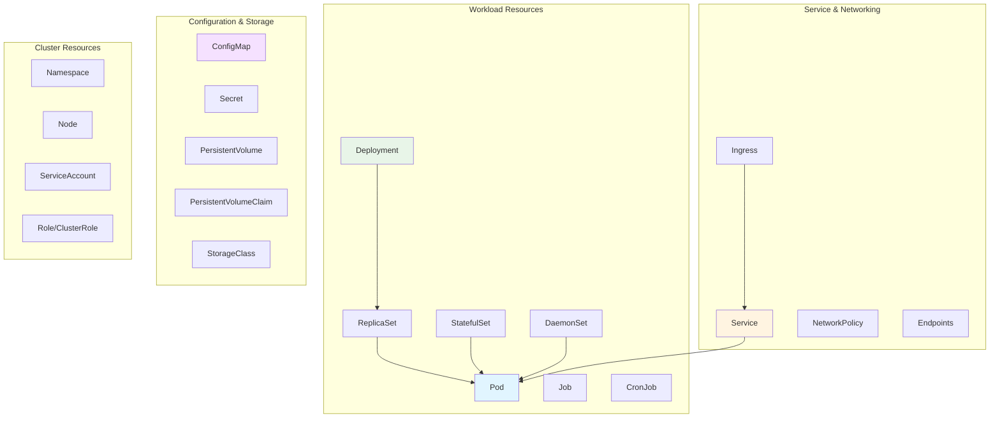
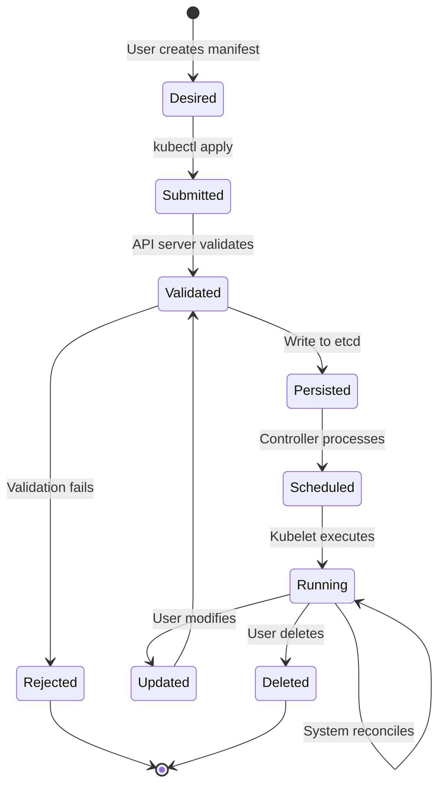
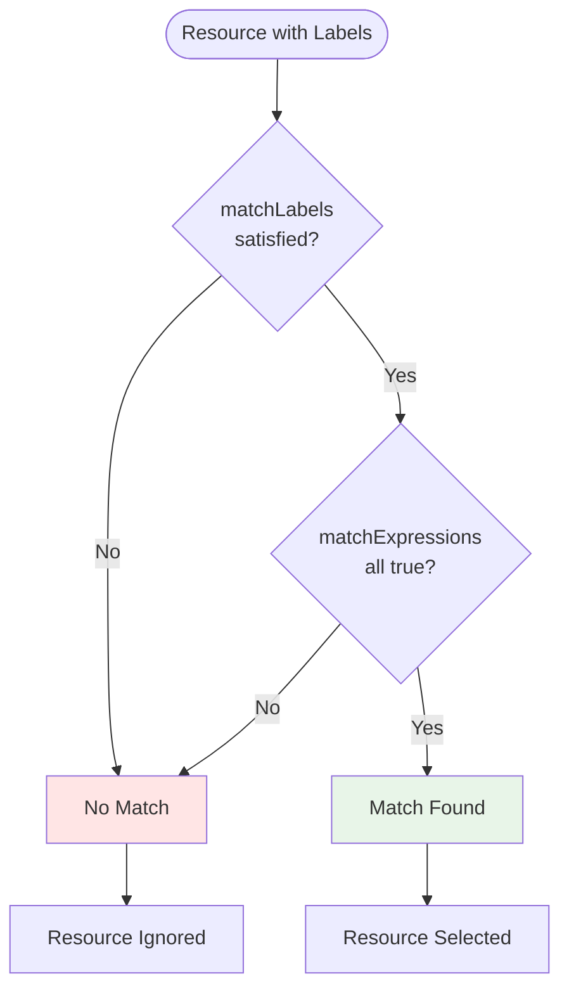
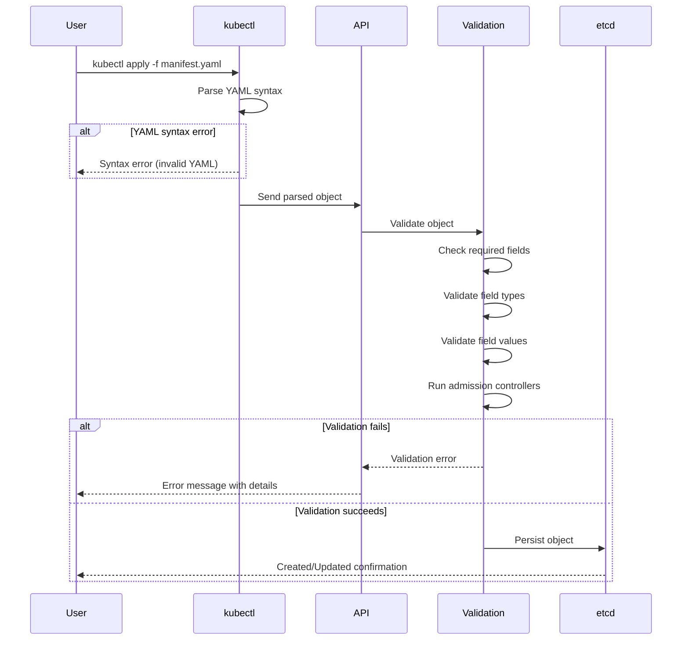

---
date:
  created: 2025-11-11
authors:
  - alf
categories:
  - Kubernetes
  - Configuration
tags:
  - kubernetes
  - k8s
  - cka-prep
  - yaml
  - objects
  - manifests
  - labels
  - selectors
readtime: 14
slug: kubernetes-objects-yaml-manifests
---

# Understanding Kubernetes Objects and YAML Manifests

Master the foundation of Kubernetes declarative configuration. Learn object anatomy, YAML syntax, labels, selectors, and annotations for CKA exam success and production deployments.

<!-- more -->

## Overview

Kubernetes objects are persistent entities in the Kubernetes system that represent the desired state of your cluster. Understanding object structure and YAML manifests is fundamental to the CKA exam and real-world Kubernetes administration.

**CKA Exam Domain**: All domains (objects are used everywhere)

**Key Insight**: Every Kubernetes resource you create, modify, or delete is an object with a consistent structure. Mastering this structure enables you to work with any Kubernetes resource confidently.

**What You'll Learn**:
- Kubernetes API object model and resource types
- YAML syntax fundamentals and best practices
- Object anatomy: metadata, spec, status structure
- Labels and selectors for resource organization
- Annotations for non-identifying metadata
- Field validation and troubleshooting strategies

---

## Kubernetes Object Model

Kubernetes uses a declarative model where you describe the desired state, and the control plane works continuously to maintain that state.

### What is a Kubernetes Object?

**Definition**: A Kubernetes object is a persistent entity that represents:
- **What** applications are running (and on which nodes)
- **How** many replicas should exist
- **Which** resources are available to applications
- **Policies** around behavior (restart, upgrades, fault-tolerance)

### Object Categories



### Object Lifecycle



---

## Object Anatomy: The Four Essential Fields

Every Kubernetes object manifest contains four top-level fields:

### Complete Object Structure

```yaml
apiVersion: apps/v1              # 1. API version
kind: Deployment                 # 2. Object type
metadata:                        # 3. Identifying metadata
  name: nginx-deployment
  namespace: production
  labels:
    app: nginx
    tier: frontend
  annotations:
    description: "Production web server"
spec:                            # 4. Desired state
  replicas: 3
  selector:
    matchLabels:
      app: nginx
  template:
    metadata:
      labels:
        app: nginx
    spec:
      containers:
      - name: nginx
        image: nginx:1.21
        ports:
        - containerPort: 80
status:                          # System-managed current state
  availableReplicas: 3
  readyReplicas: 3
  observedGeneration: 1
```

### 1. apiVersion

**Purpose**: Specifies the API group and version for the object type.

**Format**: `<group>/<version>` or just `<version>` for core API

**Common API Versions**:
```yaml
# Core API (no group)
v1                              # Pod, Service, ConfigMap, Secret, Namespace

# Apps API
apps/v1                         # Deployment, StatefulSet, DaemonSet, ReplicaSet

# Batch API
batch/v1                        # Job, CronJob

# Networking API
networking.k8s.io/v1           # Ingress, NetworkPolicy

# RBAC API
rbac.authorization.k8s.io/v1   # Role, ClusterRole, RoleBinding

# Storage API
storage.k8s.io/v1              # StorageClass, VolumeAttachment
```

**Finding API Versions**:
```bash
# List all API resources and versions
kubectl api-resources

# Check specific resource
kubectl explain deployment | head -5
# KIND:       Deployment
# VERSION:    apps/v1

# List all API versions
kubectl api-versions
```

### 2. kind

**Purpose**: Identifies the type of object being created.

**Common Object Kinds**:
- **Workloads**: Pod, Deployment, StatefulSet, DaemonSet, Job, CronJob
- **Services**: Service, Ingress, Endpoints
- **Configuration**: ConfigMap, Secret
- **Storage**: PersistentVolume, PersistentVolumeClaim, StorageClass
- **Cluster**: Namespace, Node, ServiceAccount
- **Access**: Role, ClusterRole, RoleBinding, ClusterRoleBinding

**Case Sensitivity**: Kind names are case-sensitive (must be exact capitalization).

### 3. metadata

**Purpose**: Data that uniquely identifies the object.

**Required Fields**:
- `name` - Unique within namespace and object type
- `namespace` - (optional for cluster-scoped resources)

**Common Optional Fields**:
- `labels` - Key-value pairs for organization and selection
- `annotations` - Non-identifying metadata
- `uid` - System-generated unique identifier
- `resourceVersion` - Internal version for optimistic concurrency
- `creationTimestamp` - When object was created

**Metadata Example**:
```yaml
metadata:
  name: webapp                           # Required: object name
  namespace: production                  # Namespace (required for namespaced resources)
  labels:                                # Labels for selection
    app: webapp
    tier: frontend
    version: "2.0"
    environment: production
  annotations:                           # Annotations for metadata
    description: "Main production web application"
    owner: "platform-team@company.com"
    version: "2.0.1"
    deployment-date: "2024-01-15"
  uid: 12345678-1234-1234-1234-123456789012    # System-generated
  resourceVersion: "1234567"             # System-managed version
  creationTimestamp: "2024-01-15T10:30:00Z"  # System-generated
```

### 4. spec

**Purpose**: Describes the desired state of the object.

**Characteristics**:
- Varies by object `kind`
- User-defined and user-managed
- Controller reads spec to understand desired state
- Declarative: describes "what", not "how"

**Pod Spec Example**:
```yaml
spec:
  containers:
  - name: nginx
    image: nginx:1.21
    ports:
    - containerPort: 80
    resources:
      requests:
        cpu: 100m
        memory: 128Mi
      limits:
        cpu: 200m
        memory: 256Mi
    livenessProbe:
      httpGet:
        path: /healthz
        port: 80
      initialDelaySeconds: 30
      periodSeconds: 10
  restartPolicy: Always
  nodeSelector:
    disk: ssd
```

**Deployment Spec Example**:
```yaml
spec:
  replicas: 3
  selector:
    matchLabels:
      app: nginx
  template:                    # Pod template
    metadata:
      labels:
        app: nginx
    spec:
      containers:
      - name: nginx
        image: nginx:1.21
  strategy:
    type: RollingUpdate
    rollingUpdate:
      maxSurge: 1
      maxUnavailable: 0
```

### 5. status (System-Managed)

**Purpose**: Describes the current observed state of the object.

**Characteristics**:
- **Read-only** for users
- Managed by Kubernetes controllers
- Updated continuously by the control plane
- Represents actual state vs desired state (spec)

**Pod Status Example**:
```yaml
status:
  phase: Running               # Pod lifecycle phase
  conditions:                  # Detailed status conditions
  - type: Initialized
    status: "True"
    lastTransitionTime: "2024-01-15T10:30:05Z"
  - type: Ready
    status: "True"
    lastTransitionTime: "2024-01-15T10:30:10Z"
  - type: ContainersReady
    status: "True"
    lastTransitionTime: "2024-01-15T10:30:10Z"
  - type: PodScheduled
    status: "True"
    lastTransitionTime: "2024-01-15T10:30:00Z"
  containerStatuses:
  - name: nginx
    ready: true
    restartCount: 0
    state:
      running:
        startedAt: "2024-01-15T10:30:08Z"
  hostIP: 192.168.1.100
  podIP: 10.244.1.50
  startTime: "2024-01-15T10:30:00Z"
```

**Deployment Status Example**:
```yaml
status:
  availableReplicas: 3
  readyReplicas: 3
  replicas: 3
  updatedReplicas: 3
  observedGeneration: 5
  conditions:
  - type: Available
    status: "True"
    reason: MinimumReplicasAvailable
  - type: Progressing
    status: "True"
    reason: NewReplicaSetAvailable
```

---

## YAML Syntax Fundamentals

YAML (YAML Ain't Markup Language) is the standard format for Kubernetes manifests.

### YAML Basics

**Data Types**:
```yaml
# Strings
name: nginx-deployment
description: "Multi-word string in quotes"
multiline: |
  This is a multi-line string
  that preserves newlines

# Numbers
replicas: 3
port: 80
cpu: 0.5

# Booleans
enabled: true
debug: false

# Lists (arrays)
args:
- "arg1"
- "arg2"
- "arg3"

# Or inline
args: ["arg1", "arg2", "arg3"]

# Maps (key-value pairs)
labels:
  app: nginx
  tier: frontend

# Nested structures
metadata:
  labels:
    app: nginx
  annotations:
    description: "Production app"
```

### Indentation Rules

**Critical**: YAML uses **spaces only** (no tabs) for indentation.

```yaml
# CORRECT - 2 spaces per level
metadata:
  name: nginx
  labels:
    app: nginx
    tier: frontend

# CORRECT - 4 spaces also works (be consistent)
metadata:
    name: nginx
    labels:
        app: nginx

# WRONG - mixing tabs and spaces
metadata:
	name: nginx        # Tab used (will fail)
  labels:
    app: nginx       # Spaces used
```

**Best Practice**: Use 2-space indentation consistently.

### Common YAML Patterns

**Lists of Objects**:
```yaml
containers:
- name: nginx                   # First container
  image: nginx:1.21
  ports:
  - containerPort: 80
- name: sidecar                 # Second container
  image: busybox:latest
  command: ["sh", "-c", "sleep 3600"]
```

**Multi-line Strings**:
```yaml
# Literal block (preserves newlines)
script: |
  #!/bin/bash
  echo "Line 1"
  echo "Line 2"

# Folded block (newlines become spaces)
description: >
  This is a very long description
  that spans multiple lines but
  will be folded into a single line.

# Result: "This is a very long description that spans multiple lines..."
```

**Environment Variables**:
```yaml
env:
- name: DATABASE_HOST
  value: "mysql.default.svc.cluster.local"
- name: DATABASE_PORT
  value: "3306"
- name: DATABASE_PASSWORD
  valueFrom:
    secretKeyRef:
      name: db-secret
      key: password
```

### YAML Validation

**Common Errors**:

```yaml
# ERROR: Missing colon
metadata
  name: nginx         # Should be "metadata:"

# ERROR: Wrong indentation
metadata:
  name: nginx
 labels:              # Misaligned (should be 2 spaces)
   app: nginx

# ERROR: Missing quotes for special characters
annotation: "true"   # Boolean - needs quotes to be string
annotation: true     # Boolean value

# ERROR: List item indentation
containers:
  - name: nginx      # Correct
- name: sidecar      # Wrong (should align with first item)
```

**Validation Tools**:
```bash
# kubectl validates before applying
kubectl apply --dry-run=client -f manifest.yaml

# Check syntax only
kubectl apply --dry-run=server -f manifest.yaml

# Use yamllint for detailed validation
yamllint manifest.yaml

# Python YAML validation
python -c 'import yaml, sys; yaml.safe_load(sys.stdin)' < manifest.yaml
```

---

## Labels: Organizing and Selecting Resources

Labels are key-value pairs attached to objects for identification and grouping.

### Label Syntax

**Format**: `key: value`

**Key Syntax**:
- Optional prefix: `<prefix>/<name>` (prefix ≤ 253 chars, name ≤ 63 chars)
- Name: alphanumeric, `-`, `_`, `.` (must start/end with alphanumeric)

**Value Syntax**:
- ≤ 63 characters
- Alphanumeric, `-`, `_`, `.` (can be empty)

**Examples**:
```yaml
labels:
  # Simple labels
  app: nginx
  tier: frontend
  environment: production

  # Prefixed labels (for third-party tools)
  example.com/team: platform
  app.kubernetes.io/name: nginx
  app.kubernetes.io/version: "1.21"

  # Valid special characters
  app.version: "2.0.1"
  team_name: platform-team
```

### Recommended Labels

Kubernetes recommends a standard set of labels for consistency:

```yaml
metadata:
  labels:
    # Application identity
    app.kubernetes.io/name: nginx                    # Application name
    app.kubernetes.io/instance: nginx-prod           # Unique instance
    app.kubernetes.io/version: "1.21.0"             # Application version
    app.kubernetes.io/component: webserver           # Component role
    app.kubernetes.io/part-of: ecommerce-platform   # Parent application

    # Management metadata
    app.kubernetes.io/managed-by: helm              # Management tool

    # Custom organizational labels
    team: platform
    cost-center: engineering
    environment: production
```

### Label Use Cases

**1. Resource Organization**:
```yaml
# Development pods
metadata:
  labels:
    environment: dev
    team: backend

# Production pods
metadata:
  labels:
    environment: production
    team: backend
```

**2. Service Selection**:
```yaml
# Service selects pods with matching labels
apiVersion: v1
kind: Service
metadata:
  name: nginx-service
spec:
  selector:
    app: nginx           # Selects all pods with app=nginx
    tier: frontend
  ports:
  - port: 80
```

**3. Deployment Management**:
```yaml
apiVersion: apps/v1
kind: Deployment
metadata:
  labels:
    app: nginx
spec:
  selector:
    matchLabels:
      app: nginx        # Deployment manages pods with this label
  template:
    metadata:
      labels:
        app: nginx      # Pods get this label
```

### Label Operations

**View Labels**:
```bash
# Show labels column
kubectl get pods --show-labels

# Show specific labels as columns
kubectl get pods -L app,tier,environment

# Filter output
kubectl get pods -l app=nginx
kubectl get pods -l 'environment in (dev,staging)'
kubectl get pods -l app=nginx,tier!=backend
```

**Add/Modify Labels**:
```bash
# Add label
kubectl label pod nginx-pod version=1.0

# Modify label (requires --overwrite)
kubectl label pod nginx-pod version=2.0 --overwrite

# Add label to all pods
kubectl label pods --all environment=production

# Remove label
kubectl label pod nginx-pod version-
```

---

## Selectors: Matching Resources

Selectors use labels to identify sets of objects.

### Selector Types

```mermaid
graph TB
    SELECTOR[Label Selectors] --> EQUALITY[Equality-Based]
    SELECTOR --> SET[Set-Based]

    EQUALITY --> EQ[Equal: =, ==]
    EQUALITY --> NEQ[Not Equal: !=]

    SET --> IN[In: in (...)]
    SET --> NOTIN[Not In: notin (...)]
    SET --> EXISTS[Exists: key]
    SET --> NOTEXISTS[Not Exists: !key]

    style EQUALITY fill:#e1f5ff
    style SET fill:#e8f5e8
```

### Equality-Based Selectors

**Syntax**: `key=value` or `key!=value`

**Command-Line Examples**:
```bash
# Single equality
kubectl get pods -l app=nginx

# Multiple conditions (AND logic)
kubectl get pods -l app=nginx,tier=frontend

# Not equal
kubectl get pods -l app=nginx,environment!=production
```

**Manifest Examples**:
```yaml
# Service selector (equality-based only)
selector:
  app: nginx
  tier: frontend

# Equivalent to:
# app=nginx AND tier=frontend
```

### Set-Based Selectors

**Syntax**: More expressive matching with `in`, `notin`, `exists`

**Command-Line Examples**:
```bash
# In set
kubectl get pods -l 'environment in (dev,staging)'

# Not in set
kubectl get pods -l 'tier notin (cache,db)'

# Label exists
kubectl get pods -l app

# Label does not exist
kubectl get pods -l '!app'

# Complex combination
kubectl get pods -l 'environment in (prod),tier notin (cache),app'
```

**Manifest Examples**:
```yaml
# Deployment selector (supports both)
selector:
  matchLabels:                    # Equality-based
    app: nginx
  matchExpressions:               # Set-based
  - key: tier
    operator: In
    values:
    - frontend
    - api
  - key: environment
    operator: NotIn
    values:
    - testing
  - key: critical
    operator: Exists
  - key: deprecated
    operator: DoesNotExist
```

### Selector Operators

| Operator | Description | Example |
|----------|-------------|---------|
| `In` | Value in set | `tier in (frontend, api)` |
| `NotIn` | Value not in set | `env notin (test, dev)` |
| `Exists` | Label exists | `critical` (key exists) |
| `DoesNotExist` | Label doesn't exist | `!deprecated` (key absent) |

### Selector Matching Logic



**Example**:
```yaml
# Pod labels
metadata:
  labels:
    app: nginx
    tier: frontend
    environment: production
    version: "2.0"

# Selector
selector:
  matchLabels:
    app: nginx                    # ✅ Match
  matchExpressions:
  - key: tier
    operator: In
    values: [frontend, api]       # ✅ Match (tier=frontend)
  - key: environment
    operator: NotIn
    values: [dev, test]           # ✅ Match (production not in list)
  - key: version
    operator: Exists              # ✅ Match (version label exists)

# Result: Pod matches selector
```

---

## Annotations: Non-Identifying Metadata

Annotations store arbitrary metadata that doesn't identify or select objects.

### Annotations vs Labels

| Aspect | Labels | Annotations |
|--------|--------|-------------|
| **Purpose** | Identify and select | Store metadata |
| **Selectable** | Yes (with selectors) | No |
| **Size Limit** | 63 chars (value) | 256 KB (total) |
| **Structure** | Simple key-value | Can store JSON, YAML |
| **Use Case** | Grouping, selection | Documentation, config |

### Annotation Syntax

**Format**: Same as labels but values can be larger and more complex

```yaml
metadata:
  annotations:
    # Documentation
    description: "Production Nginx deployment with 3 replicas"
    owner: "platform-team@company.com"
    documentation: "https://wiki.company.com/nginx-deployment"

    # Build information
    build-version: "2.0.1"
    git-commit: "a3f2b1c"
    ci-pipeline: "https://jenkins.company.com/job/nginx/123"

    # Operational metadata
    deployment-date: "2024-01-15T10:30:00Z"
    last-updated-by: "john.doe@company.com"

    # Tool-specific configuration
    prometheus.io/scrape: "true"
    prometheus.io/port: "9090"
    prometheus.io/path: "/metrics"

    # JSON configuration
    custom-config: '{"timeout": 30, "retries": 3}'
```

### Common Annotation Use Cases

**1. Tool Integration**:
```yaml
annotations:
  # Prometheus monitoring
  prometheus.io/scrape: "true"
  prometheus.io/port: "8080"

  # Nginx Ingress
  nginx.ingress.kubernetes.io/rewrite-target: "/"
  nginx.ingress.kubernetes.io/ssl-redirect: "true"

  # Cert-manager
  cert-manager.io/cluster-issuer: "letsencrypt-prod"

  # Istio service mesh
  sidecar.istio.io/inject: "true"
```

**2. Change Tracking**:
```yaml
annotations:
  kubernetes.io/change-cause: "Update nginx to version 1.21"
  deployment.kubernetes.io/revision: "5"
```

**3. Documentation**:
```yaml
annotations:
  description: |
    Main production web server deployment.

    Handles customer-facing traffic with:
    - 3 replicas for high availability
    - Rolling update strategy
    - Health checks configured

    Contact: platform-team@company.com

  runbook: "https://wiki.company.com/runbooks/nginx-troubleshooting"
  oncall: "https://pagerduty.com/schedules/nginx-team"
```

**4. Configuration Storage**:
```yaml
annotations:
  # Complex JSON configuration
  fluentd-config: |
    {
      "outputs": [
        {"type": "elasticsearch", "host": "es.logging.svc"},
        {"type": "s3", "bucket": "logs-backup"}
      ]
    }
```

### Annotation Operations

```bash
# View annotations
kubectl describe pod nginx-pod | grep -A 10 "Annotations:"

# Add annotation
kubectl annotate pod nginx-pod description="Production web server"

# Update annotation
kubectl annotate pod nginx-pod description="Updated description" --overwrite

# Remove annotation
kubectl annotate pod nginx-pod description-

# Annotate all resources of type
kubectl annotate deployments --all team=platform
```

---

## Field Validation and Troubleshooting

### Required vs Optional Fields

**Required Fields** (most common):
```yaml
# All objects
apiVersion: apps/v1              # Required
kind: Deployment                 # Required
metadata:
  name: nginx                    # Required
spec:                            # Required

# Pod spec
spec:
  containers:                    # Required
  - name: nginx                  # Required
    image: nginx:1.21            # Required

# Service spec
spec:
  selector:                      # Required
    app: nginx
  ports:                         # Required
  - port: 80
```

**Determining Required Fields**:
```bash
# Use kubectl explain
kubectl explain pod.spec
# FIELDS:
#   containers    <[]Container> -required-
#   volumes       <[]Volume>

kubectl explain pod.spec.containers
# FIELDS:
#   name          <string> -required-
#   image         <string> -required-
#   command       <[]string>        # Optional (no -required-)
```

### Common Validation Errors

**1. Missing Required Field**:
```yaml
# ERROR: Missing image
spec:
  containers:
  - name: nginx
    # image: nginx:1.21    # Missing required field

# Error message:
# error: error validating "pod.yaml": error validating data:
# ValidationError(Pod.spec.containers[0]): missing required field "image"
```

**2. Invalid Field Name**:
```yaml
# ERROR: Typo in field name
metadata:
  name: nginx
  lables:              # Should be "labels"
    app: nginx

# Error message:
# error: error validating "pod.yaml": error validating data:
# ValidationError(Pod.metadata): unknown field "lables"
```

**3. Wrong Data Type**:
```yaml
# ERROR: String instead of integer
spec:
  replicas: "3"        # Should be: replicas: 3

# Error message:
# error: error validating data: ValidationError(Deployment.spec.replicas):
# invalid type for io.k8s.api.apps.v1.DeploymentSpec.replicas: got "string", expected "integer"
```

**4. Invalid Value**:
```yaml
# ERROR: Invalid restart policy
spec:
  restartPolicy: OnError    # Valid: Always, OnFailure, Never

# Error message:
# error: error validating data: ValidationError(Pod.spec.restartPolicy):
# unsupported value: "OnError": supported values: "Always", "OnFailure", "Never"
```

### Validation Workflow



### Troubleshooting Commands

```bash
# Validate YAML without creating
kubectl apply --dry-run=client -f manifest.yaml

# Server-side validation (includes admission controllers)
kubectl apply --dry-run=server -f manifest.yaml

# Explain field structure
kubectl explain deployment.spec.template.spec.containers

# Get field path for specific property
kubectl explain deployment --recursive | grep -A 5 "replicas"

# Validate all manifests in directory
kubectl apply --dry-run=client -f ./manifests/

# Check API resource availability
kubectl api-resources | grep -i deployment

# View object in YAML (for comparison)
kubectl get deployment nginx -o yaml
```

---

## Complete Object Examples

### Example 1: Multi-Container Pod with Full Metadata

```yaml
apiVersion: v1
kind: Pod
metadata:
  name: multi-container-pod
  namespace: production
  labels:
    app: webapp
    tier: frontend
    environment: production
    version: "2.0"
  annotations:
    description: "Production web application with logging sidecar"
    owner: "platform-team@company.com"
    prometheus.io/scrape: "true"
    prometheus.io/port: "9090"
spec:
  containers:
  - name: webapp
    image: nginx:1.21
    ports:
    - name: http
      containerPort: 80
    resources:
      requests:
        cpu: 100m
        memory: 128Mi
      limits:
        cpu: 200m
        memory: 256Mi
    livenessProbe:
      httpGet:
        path: /healthz
        port: 80
      initialDelaySeconds: 30
      periodSeconds: 10
    env:
    - name: ENVIRONMENT
      value: "production"
  - name: log-forwarder
    image: fluent/fluent-bit:1.9
    volumeMounts:
    - name: logs
      mountPath: /var/log/nginx
  volumes:
  - name: logs
    emptyDir: {}
  restartPolicy: Always
```

### Example 2: Deployment with Complete Selectors

```yaml
apiVersion: apps/v1
kind: Deployment
metadata:
  name: webapp-deployment
  namespace: production
  labels:
    app.kubernetes.io/name: webapp
    app.kubernetes.io/version: "2.0.1"
    app.kubernetes.io/component: frontend
    app.kubernetes.io/part-of: ecommerce-platform
    app.kubernetes.io/managed-by: kubectl
  annotations:
    deployment.kubernetes.io/revision: "3"
    kubernetes.io/change-cause: "Update to version 2.0.1"
spec:
  replicas: 3
  selector:
    matchLabels:
      app: webapp
      tier: frontend
    matchExpressions:
    - key: environment
      operator: In
      values:
      - production
      - staging
    - key: deprecated
      operator: DoesNotExist
  template:
    metadata:
      labels:
        app: webapp
        tier: frontend
        environment: production
        version: "2.0.1"
      annotations:
        prometheus.io/scrape: "true"
        prometheus.io/port: "8080"
    spec:
      containers:
      - name: webapp
        image: webapp:2.0.1
        ports:
        - containerPort: 8080
        resources:
          requests:
            cpu: 200m
            memory: 256Mi
          limits:
            cpu: 500m
            memory: 512Mi
  strategy:
    type: RollingUpdate
    rollingUpdate:
      maxSurge: 1
      maxUnavailable: 0
```

### Example 3: Service with Label Selector

```yaml
apiVersion: v1
kind: Service
metadata:
  name: webapp-service
  namespace: production
  labels:
    app: webapp
    tier: frontend
  annotations:
    service.kubernetes.io/topology-aware-hints: "auto"
spec:
  type: ClusterIP
  selector:
    app: webapp           # Selects pods with app=webapp
    tier: frontend        # AND tier=frontend
  ports:
  - name: http
    port: 80
    targetPort: 8080
    protocol: TCP
  sessionAffinity: ClientIP
```

---

## Common Exam Tasks

### Scenario 1: Create Object with Labels

**Task**: Create a pod named `web` with nginx image, labels `app=web` and `tier=frontend`

```bash
# Imperative with labels
kubectl run web --image=nginx --labels="app=web,tier=frontend"

# Or generate and modify
kubectl run web --image=nginx --dry-run=client -o yaml > pod.yaml
# Edit pod.yaml to add labels
kubectl apply -f pod.yaml

# Verify
kubectl get pod web --show-labels
```

### Scenario 2: Select Resources by Labels

**Task**: Get all pods with label `environment=production` and `tier!=backend`

```bash
# Single label
kubectl get pods -l environment=production

# Multiple labels (AND)
kubectl get pods -l environment=production,tier!=backend

# Set-based
kubectl get pods -l 'environment in (production,staging),tier!=backend'

# Show labels
kubectl get pods -l environment=production --show-labels
```

### Scenario 3: Add/Modify Annotations

**Task**: Add annotation `description="Production web server"` to deployment `webapp`

```bash
# Add annotation
kubectl annotate deployment webapp description="Production web server"

# Modify existing (requires --overwrite)
kubectl annotate deployment webapp description="Updated description" --overwrite

# Verify
kubectl describe deployment webapp | grep -A 5 "Annotations:"
```

### Scenario 4: Validate Manifest Before Apply

**Task**: Check if `deployment.yaml` is valid without creating it

```bash
# Client-side validation (YAML syntax + basic structure)
kubectl apply --dry-run=client -f deployment.yaml

# Server-side validation (includes admission controllers)
kubectl apply --dry-run=server -f deployment.yaml

# Explain specific fields
kubectl explain deployment.spec.template.spec.containers.resources
```

### Scenario 5: Extract Object YAML

**Task**: Get running pod's YAML to create template

```bash
# Get full YAML (includes status)
kubectl get pod nginx -o yaml

# Get YAML without system fields (for template)
kubectl get pod nginx -o yaml | kubectl neat

# Or manually clean
kubectl get pod nginx -o yaml > template.yaml
# Remove status, uid, resourceVersion, creationTimestamp, etc.
```

---

## Practice Exercises

### Exercise 1: Object Creation (10 minutes)

**Objective**: Create objects with proper metadata structure

**Tasks**:
1. Create pod `frontend-pod` with nginx:1.21 image
2. Add labels: `app=frontend`, `tier=web`, `env=dev`
3. Add annotation: `description="Development frontend pod"`
4. Verify labels and annotations

**Solution**:
```bash
# Generate template
kubectl run frontend-pod --image=nginx:1.21 --dry-run=client -o yaml > pod.yaml

# Edit pod.yaml
vim pod.yaml
# Add to metadata:
#   labels:
#     app: frontend
#     tier: web
#     env: dev
#   annotations:
#     description: "Development frontend pod"

# Apply
kubectl apply -f pod.yaml

# Verify
kubectl get pod frontend-pod --show-labels
kubectl describe pod frontend-pod | grep -A 5 "Annotations:"
```

### Exercise 2: Label Selection (15 minutes)

**Objective**: Practice label selectors

**Tasks**:
1. Create 5 pods with various labels
2. Select pods with `environment=production`
3. Select pods with `tier` in (frontend, api)
4. Select pods with `environment=production` AND `tier!=backend`
5. Count pods matching each selector

**Solution**:
```bash
# Create pods with different labels
kubectl run pod1 --image=nginx --labels="app=web,environment=production,tier=frontend"
kubectl run pod2 --image=nginx --labels="app=api,environment=production,tier=api"
kubectl run pod3 --image=nginx --labels="app=db,environment=production,tier=backend"
kubectl run pod4 --image=nginx --labels="app=web,environment=staging,tier=frontend"
kubectl run pod5 --image=nginx --labels="app=cache,environment=dev,tier=cache"

# Select by environment
kubectl get pods -l environment=production
# Expected: pod1, pod2, pod3

# Select by tier (set-based)
kubectl get pods -l 'tier in (frontend,api)'
# Expected: pod1, pod2, pod4

# Complex selector
kubectl get pods -l environment=production,tier!=backend
# Expected: pod1, pod2

# Count matches
kubectl get pods -l environment=production --no-headers | wc -l
# Expected: 3
```

### Exercise 3: Deployment with Selectors (20 minutes)

**Objective**: Create deployment with proper label selectors

**Tasks**:
1. Create deployment `webapp` with 3 replicas
2. Use nginx:1.21 image
3. Add deployment labels: `app=webapp`, `version=v1`
4. Pod template labels: `app=webapp`, `tier=frontend`, `version=v1`
5. Configure selector to match pod labels
6. Verify pods are created with correct labels

**Solution**:
```bash
# Generate template
kubectl create deployment webapp --image=nginx:1.21 --replicas=3 --dry-run=client -o yaml > deployment.yaml

# Edit deployment.yaml
vim deployment.yaml
```

```yaml
apiVersion: apps/v1
kind: Deployment
metadata:
  name: webapp
  labels:
    app: webapp
    version: v1
spec:
  replicas: 3
  selector:
    matchLabels:
      app: webapp
      tier: frontend
      version: v1
  template:
    metadata:
      labels:
        app: webapp
        tier: frontend
        version: v1
    spec:
      containers:
      - name: nginx
        image: nginx:1.21
```

```bash
# Apply
kubectl apply -f deployment.yaml

# Verify deployment
kubectl get deployment webapp

# Verify pods have correct labels
kubectl get pods --show-labels -l app=webapp

# Verify selector works
kubectl get pods -l app=webapp,tier=frontend,version=v1
```

### Exercise 4: Annotations and Documentation (15 minutes)

**Objective**: Use annotations for metadata

**Tasks**:
1. Create deployment with comprehensive annotations
2. Add build info, owner, documentation links
3. Add tool-specific annotations (e.g., Prometheus)
4. Extract and view annotations

**Solution**:
```yaml
apiVersion: apps/v1
kind: Deployment
metadata:
  name: documented-app
  annotations:
    description: "Production application with comprehensive documentation"
    owner: "platform-team@company.com"
    documentation: "https://wiki.company.com/apps/documented-app"
    runbook: "https://wiki.company.com/runbooks/documented-app"
    build-version: "2.0.1"
    git-commit: "abc123def456"
    ci-pipeline: "https://jenkins.company.com/job/app/123"
    deployment-date: "2024-01-15T10:30:00Z"
    prometheus.io/scrape: "true"
    prometheus.io/port: "9090"
spec:
  replicas: 2
  selector:
    matchLabels:
      app: documented-app
  template:
    metadata:
      labels:
        app: documented-app
      annotations:
        prometheus.io/scrape: "true"
        prometheus.io/port: "9090"
    spec:
      containers:
      - name: app
        image: nginx:1.21
```

```bash
# Apply
kubectl apply -f documented-app.yaml

# View annotations
kubectl describe deployment documented-app | grep -A 15 "Annotations:"

# Get specific annotation
kubectl get deployment documented-app -o jsonpath='{.metadata.annotations.owner}'
```

### Exercise 5: Validation and Troubleshooting (20 minutes)

**Objective**: Practice validation and error fixing

**Tasks**:
1. Create manifest with intentional errors
2. Use validation to identify errors
3. Fix each error
4. Successfully create object

**Broken Manifest**:
```yaml
apiVersion: apps/v1
kind: Deployment
metadata:
  name: broken-deploy
  lables:                          # ERROR: Typo
    app: broken
spec:
  replicas: "3"                    # ERROR: String instead of int
  selector:
    matchLabels:
      app: broken
  template:
    metadata:
      labels:
        app: broken
    spec:
      containers:
      - name: nginx
        # image: nginx:1.21         # ERROR: Missing required field
        ports:
        - containerPort: 80
        restartPolicy: OnError      # ERROR: Invalid value (wrong location too)
```

**Solution**:
```bash
# Try to validate
kubectl apply --dry-run=client -f broken.yaml
# See errors for each issue

# Fixed version:
```

```yaml
apiVersion: apps/v1
kind: Deployment
metadata:
  name: fixed-deploy
  labels:                          # Fixed: labels (not lables)
    app: fixed
spec:
  replicas: 3                      # Fixed: integer (not string)
  selector:
    matchLabels:
      app: fixed
  template:
    metadata:
      labels:
        app: fixed
    spec:
      containers:
      - name: nginx
        image: nginx:1.21          # Fixed: added required field
        ports:
        - containerPort: 80
      restartPolicy: Always        # Fixed: moved to pod spec, valid value
```

```bash
# Validate fixed version
kubectl apply --dry-run=client -f fixed.yaml
# Should succeed

# Apply
kubectl apply -f fixed.yaml
```

---

## Quick Reference

### Object Structure Template

```yaml
apiVersion: <group>/<version>
kind: <ObjectKind>
metadata:
  name: <object-name>
  namespace: <namespace>
  labels:
    <key>: <value>
  annotations:
    <key>: <value>
spec:
  # Object-specific desired state
status:
  # System-managed current state (read-only)
```

### Common apiVersion Values

```bash
v1                              # Core: Pod, Service, ConfigMap
apps/v1                         # Deployment, StatefulSet, DaemonSet
batch/v1                        # Job, CronJob
networking.k8s.io/v1           # Ingress, NetworkPolicy
rbac.authorization.k8s.io/v1   # Role, ClusterRole, RoleBinding
storage.k8s.io/v1              # StorageClass
```

### Label Selector Syntax

```bash
# Equality-based (command-line)
kubectl get pods -l app=nginx                    # Single label
kubectl get pods -l app=nginx,tier=frontend      # Multiple (AND)
kubectl get pods -l app=nginx,tier!=backend      # Not equal

# Set-based (command-line)
kubectl get pods -l 'environment in (prod,staging)'
kubectl get pods -l 'tier notin (cache,db)'
kubectl get pods -l app                          # Label exists
kubectl get pods -l '!app'                       # Label doesn't exist

# Manifest (YAML)
selector:
  matchLabels:                   # Equality-based
    app: nginx
  matchExpressions:              # Set-based
  - key: tier
    operator: In                 # In, NotIn, Exists, DoesNotExist
    values: [frontend, api]
```

### Essential Commands

```bash
# Object creation
kubectl apply -f manifest.yaml
kubectl create -f manifest.yaml

# Label operations
kubectl label pod nginx app=web                  # Add
kubectl label pod nginx app=web --overwrite      # Modify
kubectl label pod nginx app-                     # Remove
kubectl get pods --show-labels                   # View
kubectl get pods -L app,tier                     # Show specific labels
kubectl get pods -l app=nginx                    # Filter by labels

# Annotation operations
kubectl annotate pod nginx description="Web server"    # Add
kubectl annotate pod nginx description- # Remove
kubectl describe pod nginx                       # View

# Validation
kubectl apply --dry-run=client -f manifest.yaml  # Client-side
kubectl apply --dry-run=server -f manifest.yaml  # Server-side
kubectl explain deployment.spec                  # Field documentation

# Extraction
kubectl get pod nginx -o yaml                    # Full YAML
kubectl get pod nginx -o json                    # Full JSON
```

---

## Key Takeaways

✅ **Every Kubernetes resource is an object** with consistent structure: apiVersion, kind, metadata, spec

✅ **YAML is the standard format** - master 2-space indentation and common patterns

✅ **Four essential fields define objects** - apiVersion, kind, metadata (name/namespace/labels), spec

✅ **Labels enable selection** - use for grouping, Services, Deployments, and queries

✅ **Selectors match labels** - equality-based (simple) and set-based (complex matching)

✅ **Annotations store metadata** - documentation, configuration, tool integration (no selection)

✅ **Use kubectl explain extensively** - fastest way to discover field structure during exam

✅ **Validation catches errors early** - always use --dry-run before applying

✅ **Recommended labels maintain consistency** - app.kubernetes.io/* prefix for standard labels

✅ **Master label/annotation operations** - critical for exam speed and production work

---

## Next Steps

Continue your CKA journey with:

**[Post 5: Namespaces and Resource Quotas](../namespaces-resource-quotas/)** - Learn cluster resource organization and multi-tenancy

---

**Related Posts**:
- [Kubernetes Architecture Fundamentals](../kubernetes-architecture-fundamentals/) - Understanding cluster components
- [kubectl Essentials](../kubectl-essentials/) - Command-line mastery
- [Kubernetes CKA Mastery - Complete Learning Path](../../kubernetes/) - Full exam preparation series

**External Resources**:
- [Kubernetes Objects (Official Docs)](https://kubernetes.io/docs/concepts/overview/working-with-objects/)
- [Labels and Selectors](https://kubernetes.io/docs/concepts/overview/working-with-objects/labels/)
- [Annotations](https://kubernetes.io/docs/concepts/overview/working-with-objects/annotations/)
- [Recommended Labels](https://kubernetes.io/docs/concepts/overview/working-with-objects/common-labels/)
- [Understanding Kubernetes Objects](https://kubernetes.io/docs/concepts/overview/working-with-objects/kubernetes-objects/)
