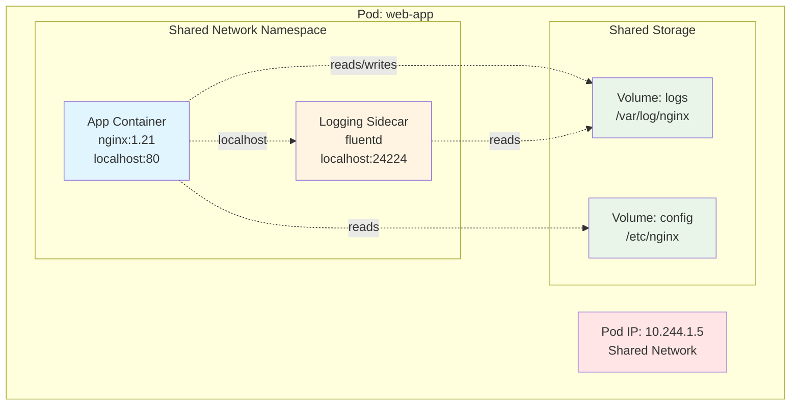
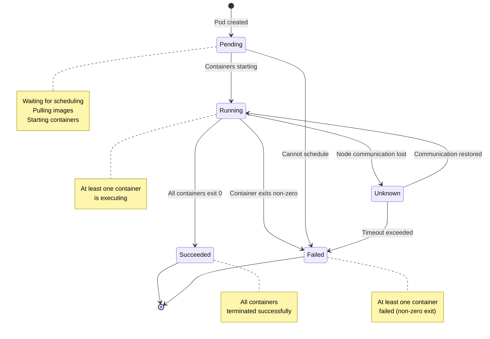
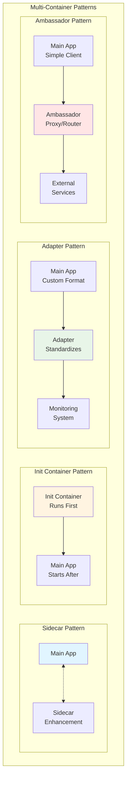
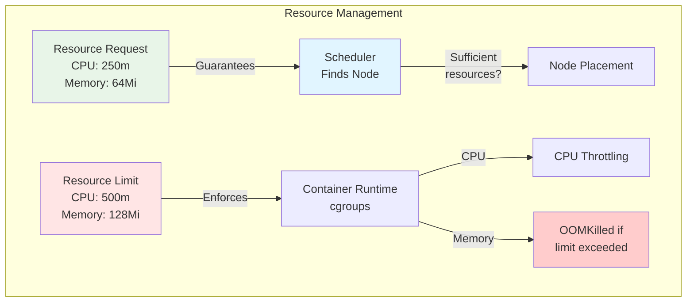
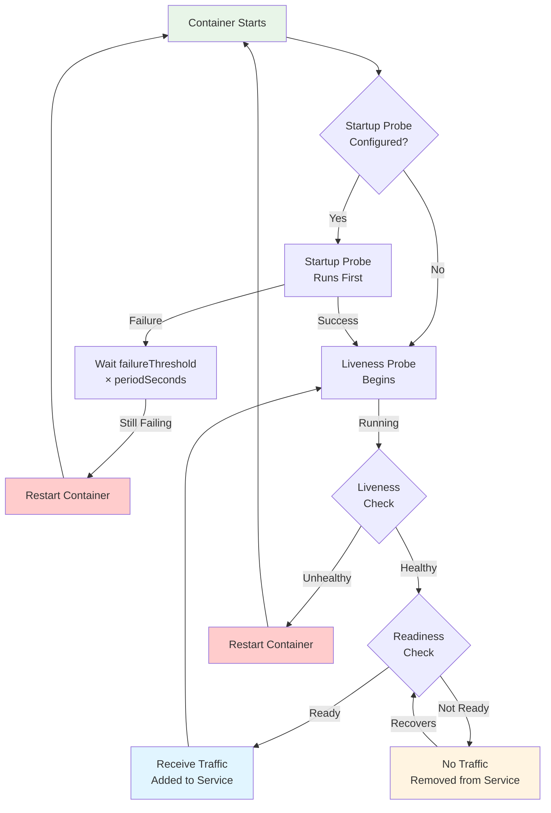
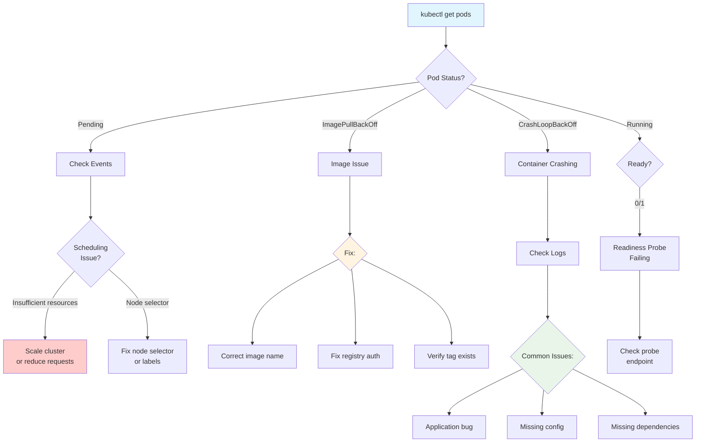

---
date:
  created: 2025-11-11
authors:
  - alf
categories:
  - Kubernetes
  - Workloads
tags:
  - kubernetes
  - k8s
  - cka-prep
  - pods
  - containers
  - workloads
readtime: 14
slug: kubernetes-pods-atomic-unit
---

# Pods: The Atomic Unit of Kubernetes

Master Kubernetes Pods - the fundamental building block of container orchestration. Learn multi-container patterns, lifecycle management, health probes, and essential troubleshooting techniques for the CKA exam.

<!-- more -->

## Introduction

In the vast ecosystem of Kubernetes, pods stand as the fundamental building block - the smallest deployable unit you can create and manage. Understanding pods is not just important for the Certified Kubernetes Administrator (CKA) exam; it's absolutely essential for anyone working with Kubernetes in production environments.

Think of a pod as a logical host for your containers. Just as traditional applications might run multiple processes on a single server that share resources and communicate via localhost, pods enable containers to share networking, storage, and a common context. This design pattern enables powerful architectural patterns while maintaining the benefits of container isolation.

In this comprehensive guide, you'll master:

- **Pod fundamentals**: What pods are, why they're atomic, and how they work
- **Lifecycle management**: Understanding pod phases and state transitions
- **Multi-container patterns**: Sidecar, init containers, adapter, and ambassador patterns
- **Configuration mastery**: Resource management, health probes, and environment configuration
- **Troubleshooting skills**: Debugging common pod issues with kubectl
- **CKA exam techniques**: Fast pod creation, debugging strategies, and time-saving tips

**CKA Exam Relevance**: Pods are covered extensively in the "Workloads & Scheduling" domain (15% of the exam). You'll need to demonstrate proficiency in creating, configuring, and troubleshooting pods under time pressure. This guide provides the knowledge and hands-on skills you need to excel.

Whether you're preparing for the CKA exam or working to deepen your Kubernetes expertise, mastering pods is your foundation for success. Let's dive in.

---

## Pod Fundamentals

### What is a Pod?

A **pod** is the smallest deployable unit in Kubernetes. It represents a single instance of a running process in your cluster. While pods can contain one or more containers, they're designed to run a single instance of an application.



**Key Characteristics**:

1. **Atomic Unit**: Pods are created, scheduled, and managed as a single entity
2. **Shared Network**: All containers share the same network namespace and IP address
3. **Shared Storage**: Containers can share volumes mounted to the pod
4. **Co-located**: Containers in a pod are always scheduled on the same node
5. **Co-managed**: Containers in a pod have the same lifecycle

### Why Are Pods Atomic?

Kubernetes treats pods as the smallest unit of deployment because:

- **Scheduling**: The scheduler places entire pods on nodes, not individual containers
- **Scaling**: Replicas create complete pod copies, not individual containers
- **Lifecycle**: All containers in a pod start and stop together
- **Resource allocation**: Resources are allocated at the pod level

This design enables tight coupling between containers that need to work together while maintaining loose coupling between pods.

### Pod Lifecycle Phases

Pods move through distinct phases during their lifetime:



| Phase | Description | Common Reasons |
|-------|-------------|----------------|
| **Pending** | Pod accepted but not running | Scheduling delays, image pulling, insufficient resources |
| **Running** | Pod bound to node, containers created | Normal operation |
| **Succeeded** | All containers terminated successfully | Batch jobs, init containers completed |
| **Failed** | All containers terminated, at least one failed | Application errors, configuration issues |
| **Unknown** | Pod state cannot be determined | Node communication failure |

### Single vs Multi-Container Pods

**Single-Container Pods** (most common):

```yaml
apiVersion: v1
kind: Pod
metadata:
  name: nginx-pod
  labels:
    app: web
spec:
  containers:
  - name: nginx
    image: nginx:1.21
    ports:
    - containerPort: 80
```

**Multi-Container Pods** (for tightly coupled components):

```yaml
apiVersion: v1
kind: Pod
metadata:
  name: web-with-logging
spec:
  containers:
  # Main application container
  - name: nginx
    image: nginx:1.21
    ports:
    - containerPort: 80
    volumeMounts:
    - name: logs
      mountPath: /var/log/nginx

  # Sidecar container for log processing
  - name: log-processor
    image: fluentd:latest
    volumeMounts:
    - name: logs
      mountPath: /var/log/nginx
      readOnly: true

  volumes:
  - name: logs
    emptyDir: {}
```

### Shared Networking

All containers in a pod share the same network namespace:

- **Same IP address**: All containers share the pod's IP
- **localhost communication**: Containers can reach each other on `localhost`
- **Port space**: Containers must use different ports (no conflicts)
- **Network policies**: Applied at the pod level, not container level

```bash
# Container 1 listens on port 80
nginx -g 'daemon off;'

# Container 2 can access it via localhost
curl localhost:80
```

### Shared Storage

Pods can define volumes that containers share:

```yaml
apiVersion: v1
kind: Pod
metadata:
  name: shared-storage-example
spec:
  containers:
  - name: writer
    image: busybox
    command: ["/bin/sh", "-c"]
    args:
    - while true; do
        echo "$(date): Writing data" >> /data/log.txt;
        sleep 10;
      done
    volumeMounts:
    - name: shared-data
      mountPath: /data

  - name: reader
    image: busybox
    command: ["/bin/sh", "-c"]
    args:
    - tail -f /data/log.txt
    volumeMounts:
    - name: shared-data
      mountPath: /data
      readOnly: true

  volumes:
  - name: shared-data
    emptyDir: {}
```

**Common Volume Types**:

- `emptyDir`: Temporary storage, deleted with pod
- `hostPath`: Mount from host node (use sparingly)
- `configMap`: Configuration files
- `secret`: Sensitive data
- `persistentVolumeClaim`: Persistent storage

---

## Multi-Container Patterns

Multi-container pods enable powerful design patterns. Here are the four most common patterns you'll encounter in production and the CKA exam.



### 1. Sidecar Pattern

**Purpose**: Extend or enhance the main container's functionality without modifying it.

**Common Use Cases**:
- Log collection and shipping
- Configuration synchronization
- Monitoring and metrics collection
- Security proxies (mTLS, auth)

**Example: Log Collection Sidecar**

```yaml
apiVersion: v1
kind: Pod
metadata:
  name: web-app-with-logging
spec:
  containers:
  # Main application
  - name: nginx
    image: nginx:1.21
    ports:
    - containerPort: 80
    volumeMounts:
    - name: logs
      mountPath: /var/log/nginx

  # Sidecar: Log collector
  - name: fluentd
    image: fluent/fluentd:latest
    env:
    - name: FLUENTD_ARGS
      value: -c /etc/fluentd/fluentd.conf
    volumeMounts:
    - name: logs
      mountPath: /var/log/nginx
      readOnly: true
    - name: fluentd-config
      mountPath: /etc/fluentd

  volumes:
  - name: logs
    emptyDir: {}
  - name: fluentd-config
    configMap:
      name: fluentd-config
```

**Why It Works**:
- Main app (nginx) is unmodified and focused on serving requests
- Sidecar (fluentd) handles log shipping independently
- Both containers share the logs volume
- Sidecar can be updated without touching the main app

### 2. Init Container Pattern

**Purpose**: Run initialization tasks before the main container starts.

**Characteristics**:
- Init containers run sequentially (one at a time)
- Main containers don't start until all init containers succeed
- Init containers can use different images and tools
- Perfect for setup tasks, migrations, waiting for dependencies

**Example: Database Migration Init Container**

```yaml
apiVersion: v1
kind: Pod
metadata:
  name: web-app-with-init
spec:
  # Init containers run first
  initContainers:
  # Wait for database to be ready
  - name: wait-for-db
    image: busybox:1.35
    command:
    - sh
    - -c
    - |
      until nc -z postgres-service 5432; do
        echo "Waiting for database..."
        sleep 2
      done
      echo "Database is ready!"

  # Run database migrations
  - name: run-migrations
    image: myapp:migrations
    command: ["/app/migrate.sh"]
    env:
    - name: DATABASE_URL
      valueFrom:
        secretKeyRef:
          name: db-secret
          key: url

  # Download configuration
  - name: fetch-config
    image: curlimages/curl:latest
    command:
    - sh
    - -c
    - curl -o /config/app.json https://config-server/api/config
    volumeMounts:
    - name: config
      mountPath: /config

  # Main container starts only after all init containers succeed
  containers:
  - name: web-app
    image: myapp:latest
    ports:
    - containerPort: 8080
    volumeMounts:
    - name: config
      mountPath: /etc/app

  volumes:
  - name: config
    emptyDir: {}
```

**CKA Tip**: Init containers are heavily tested. Know how to troubleshoot them with:

```bash
# Check init container status
kubectl describe pod web-app-with-init

# View init container logs
kubectl logs web-app-with-init -c wait-for-db
kubectl logs web-app-with-init -c run-migrations
```

### 3. Adapter Pattern

**Purpose**: Transform the main container's output to a standard format.

**Common Use Cases**:
- Standardizing log formats for centralized logging
- Converting metrics to Prometheus format
- API response transformation
- Protocol translation

**Example: Log Format Adapter**

```yaml
apiVersion: v1
kind: Pod
metadata:
  name: app-with-adapter
spec:
  containers:
  # Main app produces custom log format
  - name: legacy-app
    image: legacy-app:1.0
    volumeMounts:
    - name: logs
      mountPath: /var/log/app

  # Adapter converts logs to JSON format
  - name: log-adapter
    image: log-transformer:latest
    command:
    - sh
    - -c
    - |
      tail -f /var/log/app/app.log | while read line; do
        # Transform: "2025-01-01 ERROR message"
        # To: {"timestamp":"2025-01-01","level":"ERROR","message":"message"}
        echo "$line" | /app/transform-to-json.sh
      done
    volumeMounts:
    - name: logs
      mountPath: /var/log/app
      readOnly: true

  volumes:
  - name: logs
    emptyDir: {}
```

### 4. Ambassador Pattern

**Purpose**: Proxy network connections, hiding complexity from the main container.

**Common Use Cases**:
- Service mesh proxies (Istio, Linkerd)
- Database connection pooling
- Rate limiting and circuit breaking
- Load balancing to multiple backends

**Example: Database Proxy Ambassador**

```yaml
apiVersion: v1
kind: Pod
metadata:
  name: app-with-ambassador
spec:
  containers:
  # Main app connects to localhost:5432
  - name: web-app
    image: myapp:latest
    env:
    - name: DATABASE_HOST
      value: "localhost"  # Connects to ambassador
    - name: DATABASE_PORT
      value: "5432"

  # Ambassador handles connection pooling and routing
  - name: db-proxy
    image: pgbouncer:latest
    ports:
    - containerPort: 5432
    env:
    - name: DB_HOST
      value: "postgres-primary.database.svc.cluster.local"
    - name: DB_PORT
      value: "5432"
    - name: POOL_MODE
      value: "transaction"
    - name: MAX_CLIENT_CONN
      value: "100"
    volumeMounts:
    - name: proxy-config
      mountPath: /etc/pgbouncer

  volumes:
  - name: proxy-config
    configMap:
      name: pgbouncer-config
```

**Benefits**:
- Main app uses simple `localhost:5432` connection
- Ambassador handles connection pooling, failover, load balancing
- Can swap ambassador without changing main app
- Easier testing (mock ambassador in dev/test)

### Real-World Multi-Container Scenarios

**Scenario 1: Microservice with Service Mesh**

```yaml
# Istio automatically injects envoy sidecar
apiVersion: v1
kind: Pod
metadata:
  name: order-service
  annotations:
    sidecar.istio.io/inject: "true"
spec:
  containers:
  - name: order-service
    image: order-service:v2.1
    ports:
    - containerPort: 8080

  # Istio injects this automatically:
  # - name: istio-proxy
  #   image: istio/proxyv2:1.18.0
  #   # Handles mTLS, traffic routing, telemetry
```

**Scenario 2: Application with Config Sync**

```yaml
apiVersion: v1
kind: Pod
metadata:
  name: app-with-config-sync
spec:
  containers:
  - name: app
    image: myapp:latest
    volumeMounts:
    - name: config
      mountPath: /etc/app

  # Sidecar syncs config from Git every 60s
  - name: config-sync
    image: git-sync:latest
    env:
    - name: GIT_SYNC_REPO
      value: "https://github.com/myorg/config"
    - name: GIT_SYNC_BRANCH
      value: "main"
    - name: GIT_SYNC_WAIT
      value: "60"
    volumeMounts:
    - name: config
      mountPath: /config

  volumes:
  - name: config
    emptyDir: {}
```

---

## Pod Configuration

Effective pod configuration is critical for running reliable, secure, and efficient applications in Kubernetes. Let's explore essential configuration patterns.

### Resource Requests and Limits

Resource management determines pod scheduling and runtime behavior.

```yaml
apiVersion: v1
kind: Pod
metadata:
  name: resource-demo
spec:
  containers:
  - name: app
    image: nginx:1.21
    resources:
      # Requests: Minimum guaranteed resources
      requests:
        memory: "64Mi"   # 64 mebibytes
        cpu: "250m"      # 250 millicores (0.25 CPU)

      # Limits: Maximum allowed resources
      limits:
        memory: "128Mi"  # Pod killed (OOMKilled) if exceeded
        cpu: "500m"      # Throttled if exceeded
```

**How It Works**:



**Best Practices**:

1. **Always set requests**: Required for proper scheduling
2. **Set limits carefully**: Prevents resource starvation
3. **Memory limits = OOMKilled**: Exceeding memory limit kills the pod
4. **CPU limits = Throttling**: Exceeding CPU limit slows the container
5. **Requests ≤ Limits**: Requests should never exceed limits

```bash
# Check resource usage
kubectl top pod resource-demo

# Common OOMKilled scenario
kubectl describe pod resource-demo
# Last State: Terminated
#   Reason: OOMKilled
#   Exit Code: 137
```

**Quality of Service (QoS) Classes**:

| QoS Class | Condition | Behavior |
|-----------|-----------|----------|
| **Guaranteed** | Requests = Limits for all resources | Last to be evicted |
| **Burstable** | Requests < Limits or only requests set | Evicted before Guaranteed |
| **BestEffort** | No requests or limits | First to be evicted |

### Environment Variables and Secrets

**Environment Variables**:

```yaml
apiVersion: v1
kind: Pod
metadata:
  name: env-demo
spec:
  containers:
  - name: app
    image: myapp:latest
    env:
    # Static value
    - name: ENVIRONMENT
      value: "production"

    # From ConfigMap
    - name: APP_CONFIG
      valueFrom:
        configMapKeyRef:
          name: app-config
          key: config.json

    # From Secret
    - name: DATABASE_PASSWORD
      valueFrom:
        secretKeyRef:
          name: db-secret
          key: password

    # Pod metadata
    - name: POD_NAME
      valueFrom:
        fieldRef:
          fieldPath: metadata.name

    - name: POD_IP
      valueFrom:
        fieldRef:
          fieldPath: status.podIP

    # Resource limits
    - name: MEMORY_LIMIT
      valueFrom:
        resourceFieldRef:
          containerName: app
          resource: limits.memory
```

**Load All Keys from ConfigMap/Secret**:

```yaml
apiVersion: v1
kind: Pod
metadata:
  name: env-from-demo
spec:
  containers:
  - name: app
    image: myapp:latest
    envFrom:
    # All keys from ConfigMap as environment variables
    - configMapRef:
        name: app-config

    # All keys from Secret
    - secretRef:
        name: app-secrets
```

### Health Probes

Health probes determine container health and availability.



**Complete Health Probe Example**:

```yaml
apiVersion: v1
kind: Pod
metadata:
  name: health-demo
spec:
  containers:
  - name: app
    image: myapp:latest
    ports:
    - containerPort: 8080

    # Startup Probe: For slow-starting containers
    startupProbe:
      httpGet:
        path: /healthz
        port: 8080
      initialDelaySeconds: 0
      periodSeconds: 10        # Check every 10s
      failureThreshold: 30     # Allow 300s (5min) to start
      successThreshold: 1
      timeoutSeconds: 5

    # Liveness Probe: Restart if unhealthy
    livenessProbe:
      httpGet:
        path: /healthz
        port: 8080
        httpHeaders:
        - name: X-Custom-Header
          value: Liveness
      initialDelaySeconds: 15
      periodSeconds: 10
      failureThreshold: 3      # Restart after 3 failures
      successThreshold: 1
      timeoutSeconds: 5

    # Readiness Probe: Remove from Service if not ready
    readinessProbe:
      httpGet:
        path: /ready
        port: 8080
      initialDelaySeconds: 5
      periodSeconds: 5
      failureThreshold: 3
      successThreshold: 1
      timeoutSeconds: 3
```

**Probe Types**:

1. **HTTP GET**:
```yaml
httpGet:
  path: /healthz
  port: 8080
  scheme: HTTP  # or HTTPS
```

2. **TCP Socket**:
```yaml
tcpSocket:
  port: 8080
```

3. **Exec Command**:
```yaml
exec:
  command:
  - cat
  - /tmp/healthy
```

**Common Patterns**:

| Scenario | Startup | Liveness | Readiness |
|----------|---------|----------|-----------|
| **Simple web app** | Not needed | HTTP `/healthz` | HTTP `/ready` |
| **Slow startup (>60s)** | HTTP `/healthz` | HTTP `/healthz` | HTTP `/ready` |
| **Database** | TCP socket | TCP socket | Exec query |
| **Batch job** | Not needed | Not needed | Not needed |

**CKA Tip**: Know the difference!

- **Startup Probe**: Protects slow-starting containers from being killed by liveness
- **Liveness Probe**: Restarts unhealthy containers
- **Readiness Probe**: Controls traffic routing, doesn't restart

### Restart Policies

Control what happens when containers exit.

```yaml
apiVersion: v1
kind: Pod
metadata:
  name: restart-demo
spec:
  restartPolicy: Always  # Always | OnFailure | Never
  containers:
  - name: app
    image: myapp:latest
```

| Policy | Behavior | Use Case |
|--------|----------|----------|
| **Always** (default) | Restart on any termination | Long-running services |
| **OnFailure** | Restart only on non-zero exit | Batch jobs, retryable tasks |
| **Never** | Never restart | One-time tasks, debugging |

**Exit Code Meanings**:

- `0`: Success (clean exit)
- `1`: General error
- `137`: OOMKilled (128 + 9 SIGKILL)
- `143`: Terminated gracefully (128 + 15 SIGTERM)

### Pod Affinity and Anti-Affinity Basics

Control pod placement relative to other pods.

```yaml
apiVersion: v1
kind: Pod
metadata:
  name: web-server
spec:
  # Prefer to run on nodes where cache pods are running
  affinity:
    podAffinity:
      preferredDuringSchedulingIgnoredDuringExecution:
      - weight: 100
        podAffinityTerm:
          labelSelector:
            matchLabels:
              app: cache
          topologyKey: kubernetes.io/hostname

    # Never run on nodes where other web-server pods are running
    podAntiAffinity:
      requiredDuringSchedulingIgnoredDuringExecution:
      - labelSelector:
          matchLabels:
            app: web-server
        topologyKey: kubernetes.io/hostname

  containers:
  - name: nginx
    image: nginx:1.21
```

**Common Use Cases**:

- **High Availability**: Spread replicas across nodes (anti-affinity)
- **Performance**: Co-locate related services (affinity)
- **Data Locality**: Place compute near storage

---

## CKA Exam Skills

Speed and accuracy are critical for the CKA exam. Master these imperative commands and troubleshooting techniques.

### Imperative Pod Creation

**Fastest Pod Creation**:

```bash
# Basic pod
kubectl run nginx --image=nginx

# Pod with port
kubectl run nginx --image=nginx --port=80

# Pod with labels
kubectl run nginx --image=nginx --labels="app=web,tier=frontend"

# Pod with environment variable
kubectl run nginx --image=nginx --env="ENV=prod"

# Pod with resource limits
kubectl run nginx --image=nginx --requests='cpu=100m,memory=256Mi' --limits='cpu=200m,memory=512Mi'

# Dry run to generate YAML (don't create)
kubectl run nginx --image=nginx --dry-run=client -o yaml

# Save to file for editing
kubectl run nginx --image=nginx --dry-run=client -o yaml > pod.yaml
```

**CKA Time-Saving Technique**:

```bash
# Generate base YAML quickly, then edit
kubectl run mypod --image=nginx --dry-run=client -o yaml > pod.yaml

# Edit with vi/vim
vi pod.yaml

# Apply the edited version
kubectl apply -f pod.yaml
```

**Multi-Container Pod (manual YAML)**:

```bash
# Start with single container
kubectl run webapp --image=nginx --dry-run=client -o yaml > pod.yaml

# Edit to add second container
vi pod.yaml
# Add another container to the containers array

kubectl apply -f pod.yaml
```

### Troubleshooting Common Issues



**1. CrashLoopBackOff**

Container starts but crashes immediately.

```bash
# Check pod status
kubectl get pod mypod

# View recent logs
kubectl logs mypod

# View logs from previous container (after crash)
kubectl logs mypod --previous

# Describe pod for events
kubectl describe pod mypod

# Common causes in events:
# - Error: failed to start container
# - Back-off restarting failed container
```

**Quick Fixes**:

```bash
# Wrong command
kubectl run mypod --image=busybox --command -- /bin/sh -c "invalid-command"

# Fix: Use valid command
kubectl run mypod --image=busybox --command -- /bin/sh -c "sleep 3600"

# Missing environment variable
kubectl set env pod/mypod DATABASE_URL=postgres://db:5432

# Check container configuration
kubectl get pod mypod -o yaml | grep -A 10 command
```

**2. ImagePullBackOff**

Cannot pull container image.

```bash
# Describe pod to see error
kubectl describe pod mypod
# Events:
#   Failed to pull image "ngin:1.21": rpc error: code = NotFound

# Common causes:
# 1. Typo in image name (ngin vs nginx)
# 2. Tag doesn't exist (nginx:999)
# 3. Private registry without auth
# 4. Network issues

# Fix: Update image
kubectl set image pod/mypod container-name=nginx:1.21

# For private registries, create secret
kubectl create secret docker-registry regcred \
  --docker-server=myregistry.com \
  --docker-username=myuser \
  --docker-password=mypass

# Reference in pod
kubectl patch pod mypod -p '{"spec":{"imagePullSecrets":[{"name":"regcred"}]}}'
```

**3. Pending Status**

Pod cannot be scheduled.

```bash
# Check events
kubectl describe pod mypod
# Events:
#   0/3 nodes are available: insufficient memory

# Check node resources
kubectl describe nodes

# Common causes:
# 1. Insufficient CPU/memory
# 2. Node selector doesn't match
# 3. Taints/tolerations mismatch
# 4. PVC cannot be bound

# Fix: Reduce resource requests
kubectl set resources pod mypod -c=container-name --requests=cpu=100m,memory=128Mi

# Or add nodes to cluster
```

**4. Pod Running but Not Ready**

```bash
# Check readiness probe
kubectl get pod mypod
# NAME    READY   STATUS    RESTARTS   AGE
# mypod   0/1     Running   0          2m

# Describe to see probe failures
kubectl describe pod mypod
# Readiness probe failed: HTTP probe failed with statuscode: 500

# Fix readiness probe endpoint
# Edit pod or deployment
kubectl edit pod mypod

# Or exec into container to debug
kubectl exec -it mypod -- /bin/sh
curl localhost:8080/ready
```

### Essential kubectl Commands

```bash
# View pods
kubectl get pods
kubectl get pods -o wide              # Show IP and node
kubectl get pods -l app=nginx         # Filter by label
kubectl get pods --all-namespaces     # All namespaces

# Detailed information
kubectl describe pod mypod

# Logs
kubectl logs mypod                    # Current logs
kubectl logs mypod -f                 # Follow logs
kubectl logs mypod --previous         # Previous container
kubectl logs mypod -c container-name  # Specific container

# Execute commands
kubectl exec mypod -- ls /app
kubectl exec -it mypod -- /bin/bash   # Interactive shell

# Port forwarding (access pod from local machine)
kubectl port-forward mypod 8080:80

# Copy files
kubectl cp mypod:/app/config.json ./config.json
kubectl cp ./config.json mypod:/app/config.json

# Delete pods
kubectl delete pod mypod
kubectl delete pod -l app=nginx       # Delete by label
kubectl delete pod mypod --force --grace-period=0  # Force delete

# Edit running pod
kubectl edit pod mypod                # Opens in editor

# Replace pod
kubectl replace -f pod.yaml --force   # Delete and recreate

# Show resource usage
kubectl top pod mypod
```

### Fast Debugging Workflow

**CKA Exam Strategy**:

1. **Understand the problem** (30 seconds)
   ```bash
   kubectl get pods
   ```

2. **Gather information** (1 minute)
   ```bash
   kubectl describe pod <name>
   kubectl logs <name>
   ```

3. **Identify root cause** (1 minute)
   - Check events in `describe` output
   - Look for error messages in logs
   - Verify configuration (image, env vars, probes)

4. **Apply fix** (2 minutes)
   ```bash
   # Quick fixes
   kubectl delete pod <name>  # Let controller recreate
   kubectl edit pod <name>    # Edit configuration
   kubectl set image pod/<name> container=new-image
   ```

5. **Verify solution** (30 seconds)
   ```bash
   kubectl get pod <name>
   kubectl logs <name>
   ```

**CKA Time-Savers**:

```bash
# Alias kubectl to k
alias k=kubectl

# Set default namespace
kubectl config set-context --current --namespace=mynamespace

# Use -o wide for extra info
k get pods -o wide

# Combine commands
k describe pod mypod | grep -A 5 Events
k logs mypod | tail -20
```

---

## Practice Exercises

Hands-on practice is essential for CKA success. Complete these exercises to reinforce your pod mastery.

### Exercise 1: Create Multi-Container Pod

**Task**: Create a pod with nginx and busybox containers sharing a volume.

**Solution**:

```bash
# Generate base YAML
kubectl run multi --image=nginx --dry-run=client -o yaml > multi.yaml

# Edit to add second container
cat <<EOF > multi.yaml
apiVersion: v1
kind: Pod
metadata:
  name: multi
spec:
  containers:
  - name: nginx
    image: nginx:1.21
    volumeMounts:
    - name: shared
      mountPath: /usr/share/nginx/html

  - name: busybox
    image: busybox:1.35
    command: ["/bin/sh", "-c"]
    args:
    - while true; do
        echo "Hello from busybox - $(date)" > /html/index.html;
        sleep 10;
      done
    volumeMounts:
    - name: shared
      mountPath: /html

  volumes:
  - name: shared
    emptyDir: {}
EOF

# Apply
kubectl apply -f multi.yaml

# Verify
kubectl exec multi -c nginx -- cat /usr/share/nginx/html/index.html
kubectl exec multi -c busybox -- cat /html/index.html
```

### Exercise 2: Configure Health Probes

**Task**: Add startup, liveness, and readiness probes to a pod.

**Solution**:

```bash
cat <<EOF | kubectl apply -f -
apiVersion: v1
kind: Pod
metadata:
  name: probes
spec:
  containers:
  - name: nginx
    image: nginx:1.21
    ports:
    - containerPort: 80

    startupProbe:
      httpGet:
        path: /
        port: 80
      periodSeconds: 5
      failureThreshold: 12

    livenessProbe:
      httpGet:
        path: /
        port: 80
      periodSeconds: 10
      failureThreshold: 3

    readinessProbe:
      httpGet:
        path: /
        port: 80
      periodSeconds: 5
      failureThreshold: 3
EOF

# Watch pod startup
kubectl get pod probes -w

# Verify probes in pod spec
kubectl describe pod probes | grep -A 10 Liveness
```

### Exercise 3: Troubleshoot CrashLoopBackOff

**Task**: Fix a pod stuck in CrashLoopBackOff.

**Setup**:
```bash
kubectl run crash --image=busybox --command -- /bin/sh -c "exit 1"
```

**Solution**:

```bash
# Check status
kubectl get pod crash
# STATUS: CrashLoopBackOff

# Check logs
kubectl logs crash
kubectl logs crash --previous

# Describe to see crash reason
kubectl describe pod crash
# Last State: Terminated
#   Reason: Error
#   Exit Code: 1

# Fix: Use valid command
kubectl delete pod crash
kubectl run crash --image=busybox --command -- /bin/sh -c "sleep 3600"

# Verify
kubectl get pod crash
# STATUS: Running
```

### Exercise 4: Set Resource Requests and Limits

**Task**: Create a pod with CPU and memory constraints.

**Solution**:

```bash
cat <<EOF | kubectl apply -f -
apiVersion: v1
kind: Pod
metadata:
  name: resources
spec:
  containers:
  - name: stress
    image: polinux/stress
    command: ["stress"]
    args: ["--cpu", "1", "--vm", "1", "--vm-bytes", "128M"]
    resources:
      requests:
        cpu: "250m"
        memory: "128Mi"
      limits:
        cpu: "500m"
        memory: "256Mi"
EOF

# Monitor resource usage
kubectl top pod resources

# Check QoS class
kubectl get pod resources -o jsonpath='{.status.qosClass}'
# Output: Burstable

# Test memory limit (cause OOMKilled)
kubectl exec resources -- stress --vm 1 --vm-bytes 300M --timeout 10s
kubectl describe pod resources | grep -A 5 "Last State"
```

### Exercise 5: Use Init Containers

**Task**: Create a pod with an init container that downloads configuration.

**Solution**:

```bash
cat <<EOF | kubectl apply -f -
apiVersion: v1
kind: Pod
metadata:
  name: init-demo
spec:
  initContainers:
  - name: download-config
    image: busybox:1.35
    command:
    - sh
    - -c
    - |
      echo "Downloading configuration..."
      echo '{"app":"demo","version":"1.0"}' > /config/app.json
      echo "Configuration ready!"
    volumeMounts:
    - name: config
      mountPath: /config

  containers:
  - name: app
    image: busybox:1.35
    command: ["/bin/sh", "-c"]
    args:
    - |
      echo "Starting application..."
      cat /etc/app/app.json
      sleep 3600
    volumeMounts:
    - name: config
      mountPath: /etc/app

  volumes:
  - name: config
    emptyDir: {}
EOF

# Watch init container execute
kubectl get pod init-demo -w

# Check init container logs
kubectl logs init-demo -c download-config

# Check main container logs
kubectl logs init-demo -c app
```

### Time-Saving Tips for Exercises

1. **Use imperative commands** for base YAML generation
2. **Master kubectl edit** for quick modifications
3. **Practice with --dry-run=client -o yaml** to generate templates
4. **Use kubectl explain** for field documentation:
   ```bash
   kubectl explain pod.spec.containers.livenessProbe
   ```
5. **Create reusable snippets** for common patterns
6. **Use tab completion** in bash/zsh:
   ```bash
   source <(kubectl completion bash)
   ```

---

## Conclusion

Pods are the foundation of Kubernetes - master them and you've built a solid base for everything else. In this guide, you've learned:

- **Pod fundamentals**: The atomic unit of Kubernetes with shared networking and storage
- **Lifecycle management**: Understanding pod phases and state transitions
- **Multi-container patterns**: Sidecar, init, adapter, and ambassador patterns for real-world scenarios
- **Configuration mastery**: Resource management, health probes, environment variables, and affinity
- **Troubleshooting skills**: Debugging CrashLoopBackOff, ImagePullBackOff, and Pending pods
- **CKA exam techniques**: Fast imperative commands and efficient debugging workflows

**Next Steps for CKA Preparation**:

1. **Practice daily**: Create 5-10 pods with different configurations
2. **Break things**: Intentionally create failing pods and fix them
3. **Time yourself**: Practice pod creation and troubleshooting under time pressure
4. **Explore workload controllers**: Deployments, StatefulSets, DaemonSets (build on pods)
5. **Master kubectl**: Speed and accuracy with imperative commands

**Related CKA Topics**:

- **Deployments**: Manage pod replicas and rolling updates
- **Services**: Expose pods via stable network endpoints
- **ConfigMaps and Secrets**: External configuration for pods
- **Persistent Volumes**: Durable storage for stateful pods
- **Network Policies**: Control pod-to-pod communication
- **RBAC**: Secure pod access to Kubernetes API

**Resources for Continued Learning**:

- [Kubernetes Documentation: Pods](https://kubernetes.io/docs/concepts/workloads/pods/)
- [Kubernetes Documentation: Pod Lifecycle](https://kubernetes.io/docs/concepts/workloads/pods/pod-lifecycle/)
- [kubectl Cheat Sheet](https://kubernetes.io/docs/reference/kubectl/cheatsheet/)

**Final CKA Tip**: The exam tests your ability to solve problems quickly under pressure. Focus on:

- **Speed**: Imperative commands over writing YAML from scratch
- **Troubleshooting**: Most questions involve fixing broken resources
- **Documentation**: Know how to navigate Kubernetes docs efficiently
- **Practice**: Hands-on experience beats reading theory

Good luck with your CKA preparation! Remember: every complex Kubernetes application starts with understanding pods. Master this fundamental building block, and you're well on your way to Kubernetes expertise.

---

**About the CKA Exam Series**:

This post is part of a comprehensive Certified Kubernetes Administrator (CKA) exam preparation series. Each article focuses on a specific exam domain with hands-on exercises, real-world examples, and exam-specific tips.

**Related Posts**:

- [Kubernetes Architecture Fundamentals](/blog/kubernetes-architecture-fundamentals)
- [Kubernetes Objects & YAML Mastery](/blog/kubernetes-objects-yaml)
- [kubectl Essentials for CKA](/blog/kubectl-essentials)
- [Namespaces & Resource Quotas](/blog/namespaces-resource-quotas)

Stay tuned for upcoming posts on Deployments, Services, Persistent Storage, and Security!
