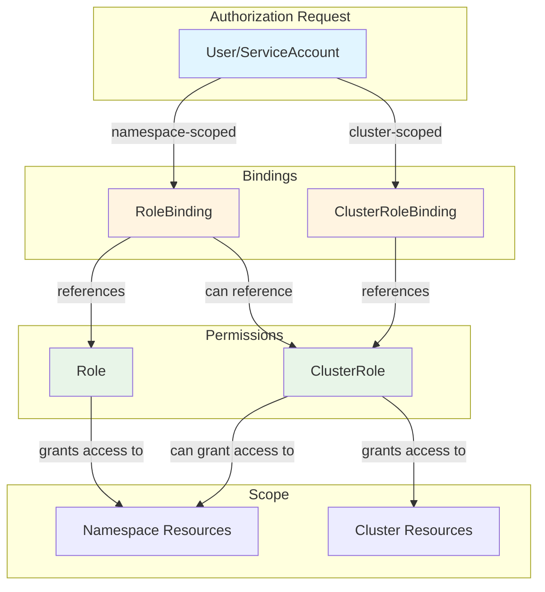
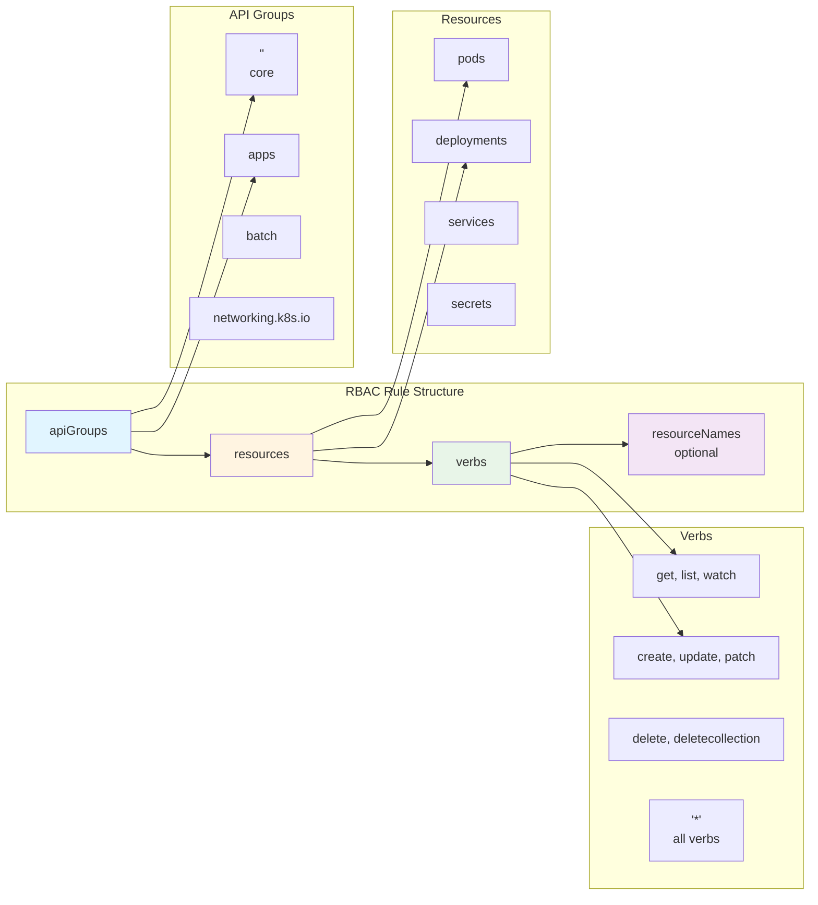
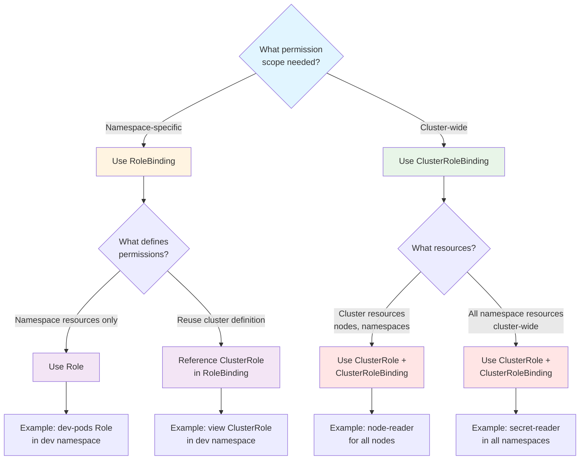
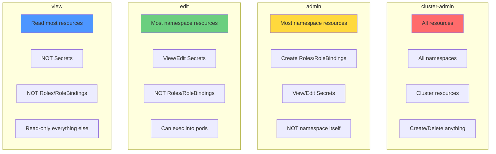
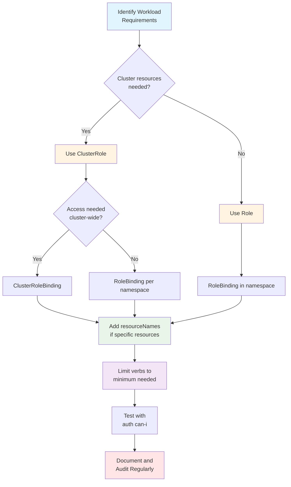
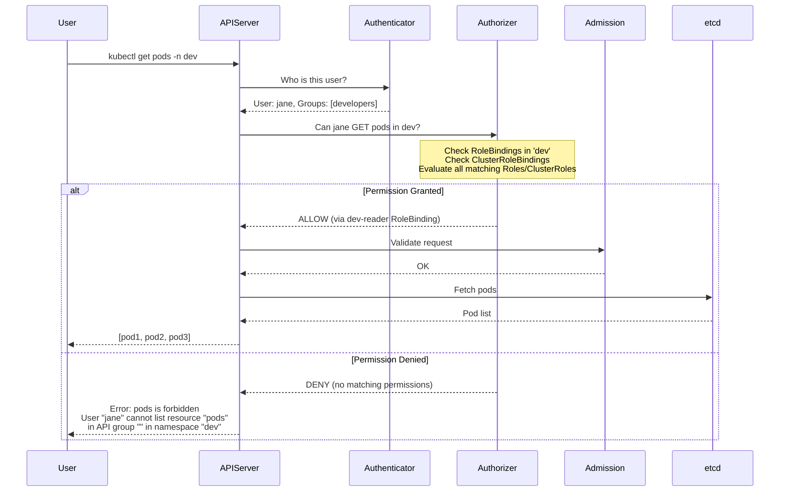

---
date:
  created: 2025-11-11
authors:
  - alf
categories:
  - Kubernetes
  - Security
tags:
  - kubernetes
  - k8s
  - cka-prep
  - rbac
  - security
readtime: 14
slug: rbac-role-based-access-control
---

# RBAC: Role-Based Access Control

**Master Kubernetes authorization with Roles, ClusterRoles, and the principle of least privilege**

Role-Based Access Control (RBAC) is Kubernetes' primary authorization mechanism, controlling who can perform which actions on what resources. For the CKA exam, RBAC is critical—you'll need to create ServiceAccounts, configure Roles and RoleBindings, troubleshoot permission issues, and apply least privilege principles. This comprehensive guide covers everything from basic concepts to advanced aggregation patterns, giving you the skills to secure any Kubernetes cluster.

**CKA Exam Relevance**: Cluster Architecture, Installation & Configuration (25% of exam weight)

<!-- more -->

---

## 📋 What You'll Learn

- **RBAC Architecture**: Roles, ClusterRoles, Bindings, and ServiceAccounts
- **Permission Model**: API groups, resources, verbs, and resource names
- **Scope Control**: Namespace vs cluster-wide permissions
- **Default Roles**: admin, edit, view, cluster-admin
- **ServiceAccount Patterns**: Pod authentication and authorization
- **Aggregation**: Composing roles from multiple sources
- **Troubleshooting**: Permission denied errors and audit logs
- **CKA Strategies**: Fast role creation and verification techniques

---

## 🎯 RBAC Architecture Overview

RBAC in Kubernetes uses four core resource types to implement authorization:



### Core Components

**Roles and ClusterRoles** (Define permissions):
- **Role**: Namespace-scoped permission definitions
- **ClusterRole**: Cluster-wide permission definitions

**RoleBindings and ClusterRoleBindings** (Grant permissions):
- **RoleBinding**: Grants Role or ClusterRole within a namespace
- **ClusterRoleBinding**: Grants ClusterRole cluster-wide

**Subjects** (Who gets permissions):
- **User**: Human users authenticated by the cluster
- **Group**: Collections of users (e.g., `system:authenticated`)
- **ServiceAccount**: Pod-level authentication identities

---

## 🔑 Roles and ClusterRoles

### Role (Namespace-Scoped)

A **Role** defines permissions within a specific namespace:

```yaml
apiVersion: rbac.authorization.k8s.io/v1
kind: Role
metadata:
  namespace: dev
  name: pod-reader
rules:
- apiGroups: [""]  # "" indicates core API group
  resources: ["pods"]
  verbs: ["get", "list", "watch"]
- apiGroups: [""]
  resources: ["pods/log"]
  verbs: ["get"]
```

```bash
# Create role imperatively (faster for CKA)
kubectl create role pod-reader \
  --verb=get,list,watch \
  --resource=pods \
  --namespace=dev

# Verify role
kubectl get role pod-reader -n dev -o yaml

# Describe role permissions
kubectl describe role pod-reader -n dev
```

### ClusterRole (Cluster-Wide)

A **ClusterRole** can:
1. Grant permissions to cluster-scoped resources (nodes, namespaces)
2. Grant permissions to namespaced resources across all namespaces
3. Be referenced by RoleBinding for namespace-scoped access

```yaml
apiVersion: rbac.authorization.k8s.io/v1
kind: ClusterRole
metadata:
  name: secret-reader
rules:
- apiGroups: [""]
  resources: ["secrets"]
  verbs: ["get", "list", "watch"]
```

```bash
# Create ClusterRole imperatively
kubectl create clusterrole secret-reader \
  --verb=get,list,watch \
  --resource=secrets

# ClusterRole for cluster resources (nodes)
kubectl create clusterrole node-reader \
  --verb=get,list \
  --resource=nodes

# Verify ClusterRole
kubectl get clusterrole secret-reader -o yaml
```

### Permission Rules Breakdown



**Common API Groups**:
- `""` (empty string): Core API group (pods, services, configmaps, secrets)
- `apps`: Deployments, StatefulSets, DaemonSets, ReplicaSets
- `batch`: Jobs, CronJobs
- `networking.k8s.io`: NetworkPolicies, Ingress
- `rbac.authorization.k8s.io`: Roles, RoleBindings, ClusterRoles
- `storage.k8s.io`: StorageClasses, VolumeAttachments

**Common Verbs**:
- Read: `get`, `list`, `watch`
- Write: `create`, `update`, `patch`
- Delete: `delete`, `deletecollection`
- Special: `*` (all verbs)

**Resource Names** (optional specificity):
```yaml
rules:
- apiGroups: [""]
  resources: ["configmaps"]
  resourceNames: ["app-config", "db-config"]  # Only these ConfigMaps
  verbs: ["get", "update"]
```

---

## 🔗 RoleBindings and ClusterRoleBindings

### RoleBinding (Namespace-Scoped)

A **RoleBinding** grants permissions defined in a Role or ClusterRole to subjects within a namespace:

```yaml
apiVersion: rbac.authorization.k8s.io/v1
kind: RoleBinding
metadata:
  name: read-pods
  namespace: dev
subjects:
- kind: User
  name: jane
  apiGroup: rbac.authorization.k8s.io
- kind: ServiceAccount
  name: app-sa
  namespace: dev
roleRef:
  kind: Role        # or ClusterRole
  name: pod-reader
  apiGroup: rbac.authorization.k8s.io
```

```bash
# Bind Role to user
kubectl create rolebinding read-pods \
  --role=pod-reader \
  --user=jane \
  --namespace=dev

# Bind ClusterRole to ServiceAccount (namespace-scoped)
kubectl create rolebinding app-view \
  --clusterrole=view \
  --serviceaccount=dev:app-sa \
  --namespace=dev

# Verify RoleBinding
kubectl get rolebinding read-pods -n dev -o yaml
kubectl describe rolebinding read-pods -n dev
```

### ClusterRoleBinding (Cluster-Wide)

A **ClusterRoleBinding** grants ClusterRole permissions across the entire cluster:

```yaml
apiVersion: rbac.authorization.k8s.io/v1
kind: ClusterRoleBinding
metadata:
  name: read-secrets-global
subjects:
- kind: Group
  name: security-team
  apiGroup: rbac.authorization.k8s.io
roleRef:
  kind: ClusterRole
  name: secret-reader
  apiGroup: rbac.authorization.k8s.io
```

```bash
# Bind ClusterRole to user cluster-wide
kubectl create clusterrolebinding cluster-admin-user \
  --clusterrole=cluster-admin \
  --user=admin

# Bind ClusterRole to group
kubectl create clusterrolebinding view-all \
  --clusterrole=view \
  --group=developers

# Verify ClusterRoleBinding
kubectl get clusterrolebinding cluster-admin-user -o yaml
```

### Binding Scope Decision Matrix



---

## 👤 ServiceAccounts

ServiceAccounts provide an identity for processes running in Pods.

### Creating and Using ServiceAccounts

```bash
# Create ServiceAccount
kubectl create serviceaccount app-sa -n dev

# Get ServiceAccount details (shows auto-created secret)
kubectl get serviceaccount app-sa -n dev -o yaml

# Describe to see token secret
kubectl describe serviceaccount app-sa -n dev
```

```yaml
apiVersion: v1
kind: ServiceAccount
metadata:
  name: app-sa
  namespace: dev
---
apiVersion: v1
kind: Pod
metadata:
  name: app-pod
  namespace: dev
spec:
  serviceAccountName: app-sa  # Use custom ServiceAccount
  containers:
  - name: app
    image: nginx:1.27
```

### Default ServiceAccount Behavior

Every namespace has a **default** ServiceAccount automatically:

```bash
# Check default ServiceAccount
kubectl get sa default -n dev -o yaml

# Every pod uses 'default' unless specified
# Default has NO permissions beyond discovery
```

**Best Practice**: Always create dedicated ServiceAccounts for applications, never use `default`.

---

## 🏢 Default ClusterRoles

Kubernetes provides built-in ClusterRoles for common use cases:

| ClusterRole | Description | Use Case |
|-------------|-------------|----------|
| **cluster-admin** | Super-user access to all resources | Cluster administrators only |
| **admin** | Namespace admin (can create Roles/RoleBindings) | Namespace owners |
| **edit** | Read/write access to most resources | Developers, CI/CD |
| **view** | Read-only access (no secrets) | Monitoring, auditing |

```bash
# View built-in roles
kubectl get clusterrole | grep -E "^(cluster-admin|admin|edit|view)"

# Examine 'view' ClusterRole
kubectl describe clusterrole view

# Grant namespace admin to user
kubectl create rolebinding bob-admin \
  --clusterrole=admin \
  --user=bob \
  --namespace=dev

# Grant cluster-wide view to group
kubectl create clusterrolebinding developers-view \
  --clusterrole=view \
  --group=developers
```

### Default Role Comparison



---

## 🧩 Role Aggregation

**ClusterRole aggregation** composes roles from multiple sources using label selectors:

```yaml
# Parent ClusterRole (aggregates others)
apiVersion: rbac.authorization.k8s.io/v1
kind: ClusterRole
metadata:
  name: monitoring
aggregationRule:
  clusterRoleSelectors:
  - matchLabels:
      rbac.example.com/aggregate-to-monitoring: "true"
rules: []  # Rules automatically filled from aggregated roles
---
# Child ClusterRole (aggregated into 'monitoring')
apiVersion: rbac.authorization.k8s.io/v1
kind: ClusterRole
metadata:
  name: monitoring-endpoints
  labels:
    rbac.example.com/aggregate-to-monitoring: "true"
rules:
- apiGroups: [""]
  resources: ["services", "endpoints", "pods"]
  verbs: ["get", "list", "watch"]
```

**Default aggregation targets** (extend built-in roles):
```yaml
metadata:
  labels:
    rbac.authorization.k8s.io/aggregate-to-admin: "true"
    rbac.authorization.k8s.io/aggregate-to-edit: "true"
    rbac.authorization.k8s.io/aggregate-to-view: "true"
```

```bash
# Check aggregated rules (automatically combined)
kubectl get clusterrole monitoring -o yaml

# View default 'admin' aggregation
kubectl get clusterrole admin -o yaml | grep -A 5 aggregationRule
```

---

## 🔒 Least Privilege Principle

**Always grant the minimum permissions required** for a workload to function:

### Anti-Pattern: Overly Permissive

```yaml
# ❌ BAD: Grants cluster-admin to application
apiVersion: rbac.authorization.k8s.io/v1
kind: ClusterRoleBinding
metadata:
  name: app-admin
subjects:
- kind: ServiceAccount
  name: app-sa
  namespace: default
roleRef:
  kind: ClusterRole
  name: cluster-admin  # WAY TOO MUCH ACCESS
  apiGroup: rbac.authorization.k8s.io
```

### Best Practice: Scoped and Specific

```yaml
# ✅ GOOD: Specific permissions for application needs
apiVersion: rbac.authorization.k8s.io/v1
kind: Role
metadata:
  name: app-role
  namespace: default
rules:
- apiGroups: [""]
  resources: ["configmaps"]
  resourceNames: ["app-config"]  # Only this ConfigMap
  verbs: ["get"]
- apiGroups: [""]
  resources: ["secrets"]
  resourceNames: ["app-secret"]  # Only this Secret
  verbs: ["get"]
---
apiVersion: rbac.authorization.k8s.io/v1
kind: RoleBinding
metadata:
  name: app-binding
  namespace: default
subjects:
- kind: ServiceAccount
  name: app-sa
  namespace: default
roleRef:
  kind: Role
  name: app-role
  apiGroup: rbac.authorization.k8s.io
```

### Principle Application Steps



---

## 🛠️ Testing and Troubleshooting

### Testing Permissions with `kubectl auth can-i`

```bash
# Test current user permissions
kubectl auth can-i create pods -n dev
kubectl auth can-i delete deployments -n prod
kubectl auth can-i get nodes  # Cluster resource
kubectl auth can-i '*' '*'    # Check super-user

# Test as specific user
kubectl auth can-i list secrets --as=jane -n dev
kubectl auth can-i create pods --as=system:serviceaccount:dev:app-sa -n dev

# Test as group
kubectl auth can-i get pods --as=jane --as-group=developers -n dev

# List all permissions for user (CKA helpful)
kubectl auth can-i --list --as=jane -n dev
kubectl auth can-i --list --as=system:serviceaccount:dev:app-sa -n dev
```

### Common Permission Issues

**Issue 1: ServiceAccount can't access resources**

```bash
# Check ServiceAccount exists
kubectl get sa app-sa -n dev

# Check RoleBinding exists
kubectl get rolebinding -n dev | grep app

# Verify RoleBinding references correct SA
kubectl describe rolebinding app-binding -n dev

# Test permissions
kubectl auth can-i get pods \
  --as=system:serviceaccount:dev:app-sa \
  -n dev
```

**Issue 2: User denied access despite Role**

```bash
# Check RoleBinding subjects
kubectl get rolebinding -n dev -o yaml | grep -A 5 subjects

# Verify user/group name matches exactly (case-sensitive)
kubectl describe rolebinding user-binding -n dev

# Check if Role has required verbs
kubectl describe role user-role -n dev
```

**Issue 3: Permission denied on cluster resources**

```bash
# Cluster resources require ClusterRole + ClusterRoleBinding
kubectl auth can-i get nodes  # Requires cluster-wide access

# Check ClusterRoleBindings for user
kubectl get clusterrolebinding -o yaml | grep -B 5 "name: jane"

# Verify ClusterRole includes cluster resources
kubectl describe clusterrole node-reader
```

### Debugging Authorization Flow



---

## 📝 CKA Exam Practice Exercises

### Exercise 1: Create Role and RoleBinding for Pod Management

**Scenario**: Create a Role and RoleBinding for user `alice` to manage pods and services in the `production` namespace.

<details>
<summary><b>Solution</b></summary>

```bash
# Create Role
kubectl create role pod-manager \
  --verb=get,list,watch,create,update,patch,delete \
  --resource=pods,services \
  --namespace=production

# Create RoleBinding
kubectl create rolebinding alice-pod-manager \
  --role=pod-manager \
  --user=alice \
  --namespace=production

# Verify
kubectl auth can-i create pods --as=alice -n production  # Should return 'yes'
kubectl auth can-i delete services --as=alice -n production  # Should return 'yes'
kubectl auth can-i get deployments --as=alice -n production  # Should return 'no'
```

</details>

---

### Exercise 2: ServiceAccount with Specific Secret Access

**Scenario**: Create a ServiceAccount `backup-sa` in the `ops` namespace that can only read the secret named `backup-credentials`.

<details>
<summary><b>Solution</b></summary>

```bash
# Create namespace and ServiceAccount
kubectl create namespace ops
kubectl create serviceaccount backup-sa -n ops

# Create Role with resourceNames restriction
cat <<EOF | kubectl apply -f -
apiVersion: rbac.authorization.k8s.io/v1
kind: Role
metadata:
  name: backup-secret-reader
  namespace: ops
rules:
- apiGroups: [""]
  resources: ["secrets"]
  resourceNames: ["backup-credentials"]  # ONLY this secret
  verbs: ["get"]
EOF

# Create RoleBinding
kubectl create rolebinding backup-sa-binding \
  --role=backup-secret-reader \
  --serviceaccount=ops:backup-sa \
  --namespace=ops

# Create test secret
kubectl create secret generic backup-credentials \
  --from-literal=password=secret123 \
  -n ops

kubectl create secret generic other-secret \
  --from-literal=data=value \
  -n ops

# Verify
kubectl auth can-i get secret backup-credentials \
  --as=system:serviceaccount:ops:backup-sa \
  -n ops  # Should return 'yes'

kubectl auth can-i get secret other-secret \
  --as=system:serviceaccount:ops:backup-sa \
  -n ops  # Should return 'no'
```

</details>

---

### Exercise 3: Cluster-Wide Read-Only Access

**Scenario**: Grant user `monitor` read-only access to pods, services, and deployments across ALL namespaces.

<details>
<summary><b>Solution</b></summary>

```bash
# Create ClusterRole
kubectl create clusterrole cluster-reader \
  --verb=get,list,watch \
  --resource=pods,services,deployments

# Create ClusterRoleBinding
kubectl create clusterrolebinding monitor-cluster-reader \
  --clusterrole=cluster-reader \
  --user=monitor

# Verify across namespaces
kubectl auth can-i get pods --as=monitor -n default  # yes
kubectl auth can-i get pods --as=monitor -n kube-system  # yes
kubectl auth can-i get pods --as=monitor --all-namespaces  # yes
kubectl auth can-i delete pods --as=monitor -n default  # no
kubectl auth can-i get secrets --as=monitor -n default  # no
```

</details>

---

### Exercise 4: Debug Permission Denied Error

**Scenario**: User `dev-user` reports: `Error: pods is forbidden: User "dev-user" cannot list resource "pods" in namespace "development"`. Investigate and fix.

<details>
<summary><b>Solution</b></summary>

```bash
# Step 1: Check if RoleBinding exists for user
kubectl get rolebinding -n development -o yaml | grep -A 5 dev-user
# Output: No RoleBinding found

# Step 2: Check if ClusterRoleBinding grants access
kubectl get clusterrolebinding -o yaml | grep -B 5 dev-user
# Output: No ClusterRoleBinding found

# Step 3: Create appropriate Role and RoleBinding
kubectl create role pod-reader \
  --verb=get,list,watch \
  --resource=pods \
  --namespace=development

kubectl create rolebinding dev-user-pods \
  --role=pod-reader \
  --user=dev-user \
  --namespace=development

# Step 4: Verify fix
kubectl auth can-i list pods --as=dev-user -n development  # Now returns 'yes'

# Alternative: Use existing 'view' ClusterRole
kubectl create rolebinding dev-user-view \
  --clusterrole=view \
  --user=dev-user \
  --namespace=development
```

</details>

---

### Exercise 5: Least Privilege for CI/CD Pipeline

**Scenario**: A CI/CD pipeline needs to:
- Create/update Deployments and Services in `staging` namespace
- Read ConfigMaps and Secrets in `staging` namespace
- NOT delete any resources
- NOT access other namespaces

<details>
<summary><b>Solution</b></summary>

```bash
# Create ServiceAccount
kubectl create namespace staging
kubectl create serviceaccount cicd-sa -n staging

# Create Role with minimal permissions
cat <<EOF | kubectl apply -f -
apiVersion: rbac.authorization.k8s.io/v1
kind: Role
metadata:
  name: cicd-deployer
  namespace: staging
rules:
- apiGroups: ["apps"]
  resources: ["deployments"]
  verbs: ["get", "list", "create", "update", "patch"]  # NO delete
- apiGroups: [""]
  resources: ["services"]
  verbs: ["get", "list", "create", "update", "patch"]  # NO delete
- apiGroups: [""]
  resources: ["configmaps", "secrets"]
  verbs: ["get", "list"]  # Read-only
EOF

# Create RoleBinding
kubectl create rolebinding cicd-sa-deployer \
  --role=cicd-deployer \
  --serviceaccount=staging:cicd-sa \
  --namespace=staging

# Verify permissions
kubectl auth can-i create deployments \
  --as=system:serviceaccount:staging:cicd-sa \
  -n staging  # yes

kubectl auth can-i delete deployments \
  --as=system:serviceaccount:staging:cicd-sa \
  -n staging  # no

kubectl auth can-i get secrets \
  --as=system:serviceaccount:staging:cicd-sa \
  -n staging  # yes

kubectl auth can-i create secrets \
  --as=system:serviceaccount:staging:cicd-sa \
  -n staging  # no
```

</details>

---

## 🎯 CKA Exam Tips

### Fast Role Creation Strategies

```bash
# Use imperative commands for speed
kubectl create role <name> --verb=<verbs> --resource=<resources> -n <namespace>
kubectl create rolebinding <name> --role=<role> --user=<user> -n <namespace>

# Dry-run to generate YAML quickly
kubectl create role test --verb=get --resource=pods --dry-run=client -o yaml

# Copy and modify existing roles
kubectl get clusterrole view -o yaml > custom-view.yaml
# Edit and apply

# Use --list to see all verbs/resources quickly
kubectl api-resources  # List all resource types
kubectl api-versions   # List all API groups
```

### Time-Saving Commands

```bash
# Test permissions without applying
kubectl auth can-i <verb> <resource> --as=<user> -n <namespace>

# List all permissions for ServiceAccount
kubectl auth can-i --list \
  --as=system:serviceaccount:<namespace>:<sa-name> \
  -n <namespace>

# Find all RoleBindings for a user
kubectl get rolebinding,clusterrolebinding -A -o json | \
  jq '.items[] | select(.subjects[]?.name == "username")'

# Quick describe for troubleshooting
kubectl describe rolebinding <name> -n <namespace>
kubectl describe clusterrole <name>
```

### Common Exam Patterns

1. **Grant namespace admin**: `--clusterrole=admin`
2. **Grant read-only**: `--clusterrole=view`
3. **ServiceAccount pattern**: `--serviceaccount=<namespace>:<sa-name>`
4. **Always test**: `kubectl auth can-i` after creation

---

## 📚 Quick Reference

### Common kubectl RBAC Commands

```bash
# Create resources
kubectl create role <name> --verb=<verbs> --resource=<resources> -n <ns>
kubectl create clusterrole <name> --verb=<verbs> --resource=<resources>
kubectl create rolebinding <name> --role=<role> --user=<user> -n <ns>
kubectl create clusterrolebinding <name> --clusterrole=<cr> --user=<user>
kubectl create serviceaccount <name> -n <ns>

# View resources
kubectl get role,rolebinding -n <ns>
kubectl get clusterrole,clusterrolebinding
kubectl get sa -n <ns>

# Describe for details
kubectl describe role <name> -n <ns>
kubectl describe rolebinding <name> -n <ns>

# Test permissions
kubectl auth can-i <verb> <resource> --as=<user> -n <ns>
kubectl auth can-i --list --as=<user> -n <ns>

# Impersonate user for testing
kubectl get pods --as=<user> -n <ns>
kubectl get pods --as=<user> --as-group=<group> -n <ns>
```

### RBAC Decision Tree

```
Need to grant permissions?
│
├─ Namespace-specific access?
│  ├─ YES → Use Role + RoleBinding
│  │  └─ (or RoleBinding → ClusterRole for reuse)
│  │
│  └─ NO → Use ClusterRole + ClusterRoleBinding
│
├─ What type of subject?
│  ├─ Human → User
│  ├─ Pod → ServiceAccount
│  └─ Collection → Group
│
└─ Test with: kubectl auth can-i <verb> <resource> --as=<subject>
```

---

## 🔗 Related Resources

- **Previous**: [Post 14 - ConfigMaps and Secrets](../configmaps-secrets-volume-mounts/)
- **Next**: Post 16 - Security Contexts and Pod Security Standards
- **Reference**: [Kubernetes RBAC Documentation](https://kubernetes.io/docs/reference/access-authn-authz/rbac/)
- **Series**: [Kubernetes CKA Mastery](../../kubernetes/)

---

## ✅ Key Takeaways

- **RBAC is mandatory** for securing Kubernetes clusters
- **Roles are namespace-scoped**, ClusterRoles are cluster-wide
- **RoleBindings grant permissions** by linking subjects to roles
- **ServiceAccounts** provide pod-level authentication
- **Least privilege principle**: Grant minimum permissions required
- **Use `kubectl auth can-i`** to test permissions before applying
- **Default roles** (admin, edit, view) cover common use cases
- **Aggregation** allows composing complex roles from simple components
- **CKA exam tip**: Master imperative commands for speed

**Next Steps**: Apply security contexts and pod security standards to harden workloads at the pod level.
