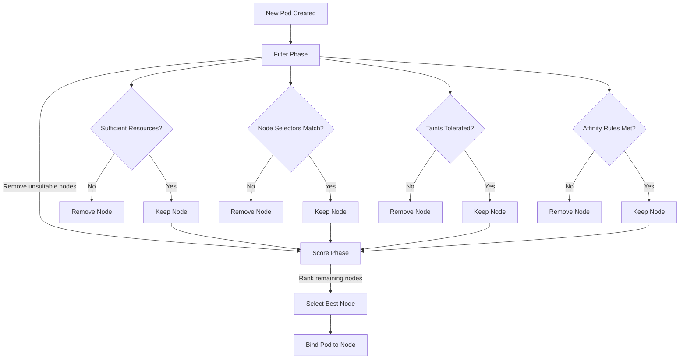
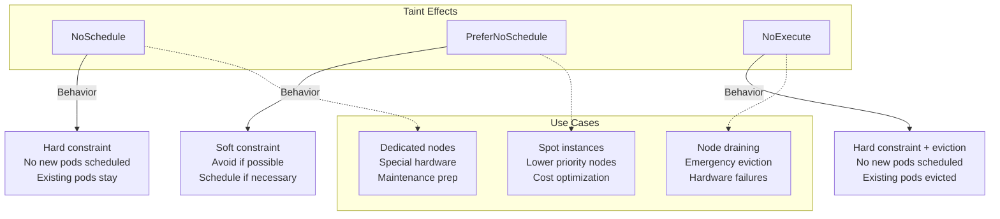
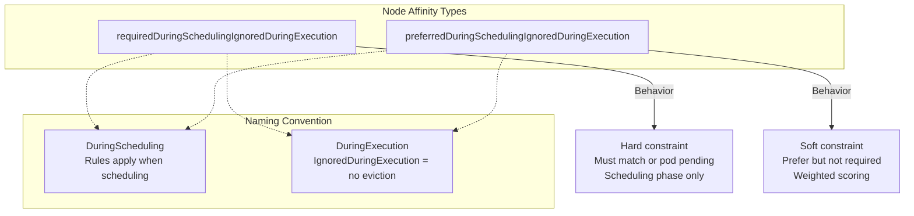
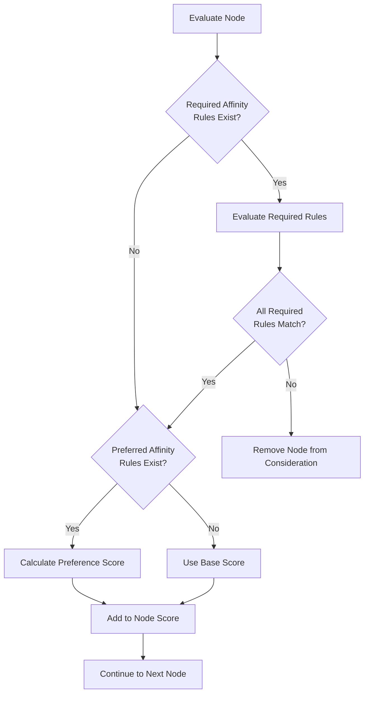
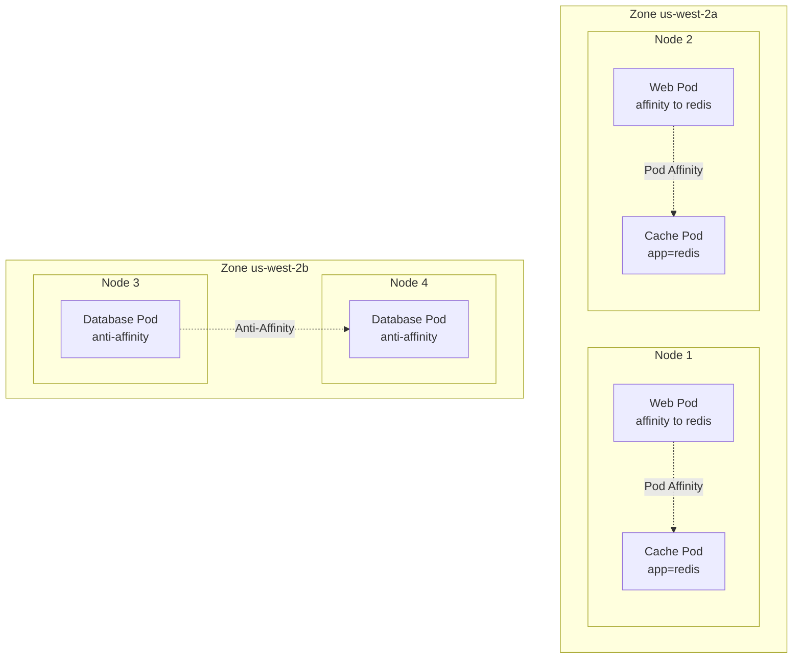
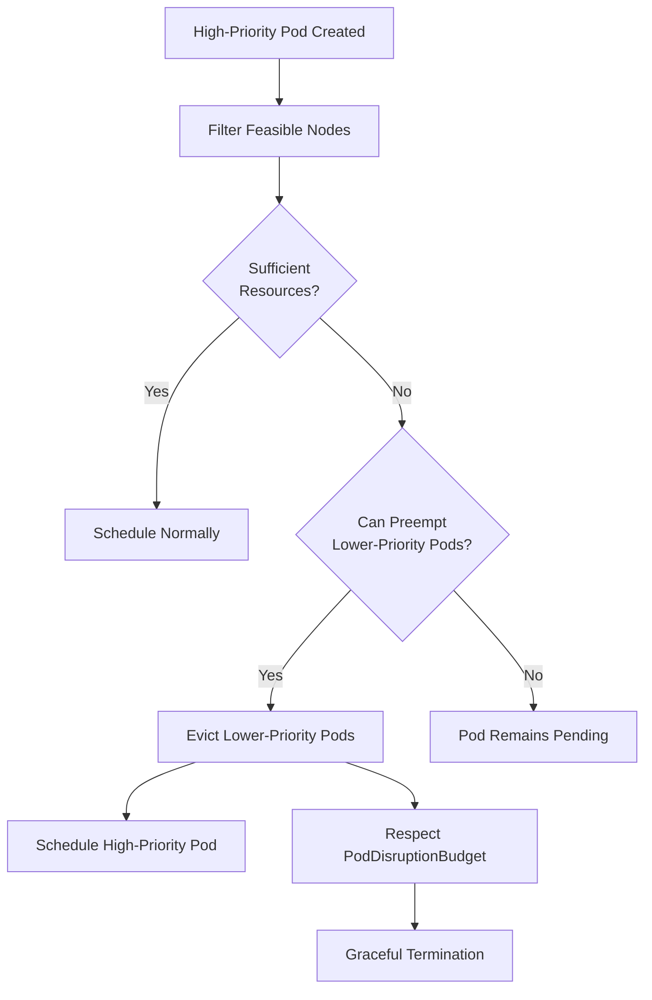
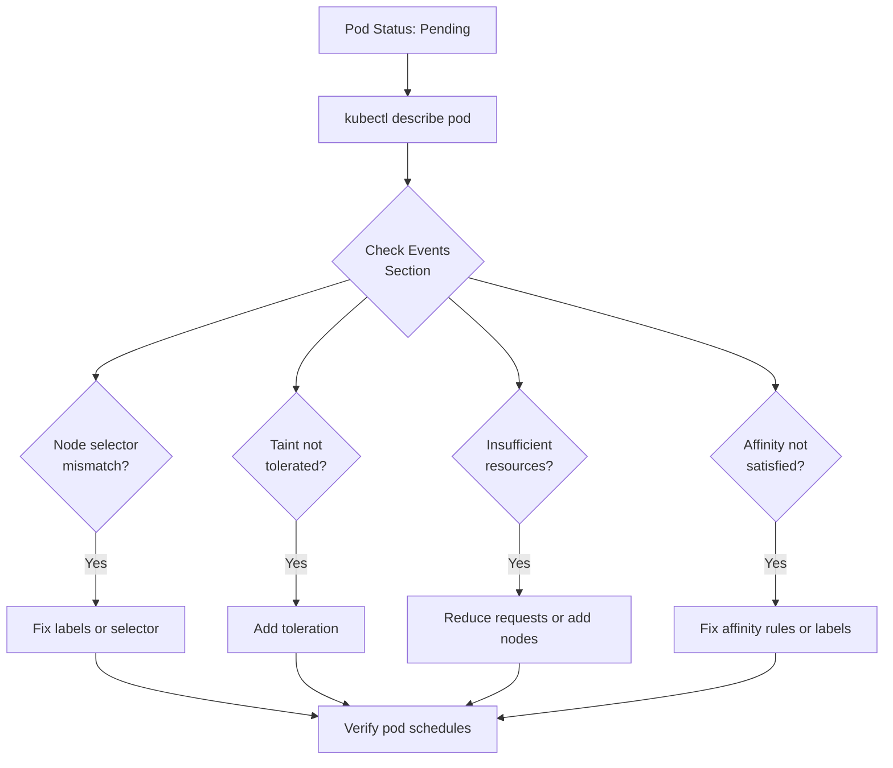

---
date:
  created: 2025-11-11
authors:
  - alf
categories:
  - Kubernetes
  - Workloads
tags:
  - kubernetes
  - k8s
  - cka-prep
  - scheduling
  - taints
  - tolerations
  - affinity
  - node-selector
readtime: 13
slug: kubernetes-advanced-scheduling
---

# Advanced Scheduling: Taints, Tolerations, and Affinity

Master Kubernetes pod scheduling with taints, tolerations, node affinity, and pod affinity/anti-affinity. Essential knowledge for CKA exam success and production-grade workload placement.

<!-- more -->

## Overview

The Kubernetes scheduler is responsible for assigning pods to nodes, making intelligent decisions based on resource requirements, constraints, and policies. While the default scheduler works well for simple deployments, production environments require fine-grained control over pod placement.

**CKA Exam Domain**: Workloads & Scheduling (15% of exam)

**Key Insight**: Advanced scheduling isn't just about passing the CKA exam—it's essential for high availability, resource optimization, cost management, and regulatory compliance in production Kubernetes clusters.

**What You'll Learn**:
- How the Kubernetes scheduler makes placement decisions
- Node selectors for simple node selection
- Taints and tolerations for node restriction patterns
- Node affinity for complex node selection rules
- Pod affinity and anti-affinity for inter-pod placement
- Priority classes and preemption mechanisms
- CKA exam speed techniques for scheduling tasks

Understanding these scheduling mechanisms enables you to:
- **Optimize costs** by directing workloads to specific node types
- **Improve reliability** through strategic pod distribution
- **Meet compliance requirements** with dedicated node pools
- **Enhance performance** by co-locating related services
- **Manage maintenance** without disrupting critical workloads

---

## How the Scheduler Works

The Kubernetes scheduler is a control plane component that watches for newly created pods with no assigned node and selects an optimal node for them to run on.

### Scheduling Process



### Two-Phase Algorithm

**Phase 1: Filtering (Feasibility)**
The scheduler eliminates nodes that don't meet pod requirements:

- **Resource availability**: Does the node have enough CPU, memory, and ephemeral storage?
- **Node selector constraints**: Does the node have required labels?
- **Taints and tolerations**: Can the pod tolerate node taints?
- **Affinity/anti-affinity rules**: Do inter-pod placement rules allow this node?
- **Port availability**: Are required host ports available?
- **Volume constraints**: Can required volumes be mounted?

**Phase 2: Scoring (Prioritization)**
For remaining nodes, the scheduler assigns scores based on:

- **Resource balance**: Prefer nodes with balanced resource utilization
- **Image locality**: Favor nodes with container images already pulled
- **Spreading**: Distribute pods across zones/nodes for high availability
- **Affinity preferences**: Honor preferred (not required) affinity rules
- **Custom priorities**: Apply user-defined priority functions

The node with the highest score wins. Ties are broken randomly to ensure even distribution.

### Default Behavior

Without any scheduling constraints, the scheduler:
1. Filters nodes with sufficient resources
2. Scores nodes based on resource balance and spreading
3. Selects the optimal node
4. Binds the pod to that node

This works well for stateless applications but isn't sufficient for:
- **Specialized hardware requirements** (GPUs, SSDs, specific CPU types)
- **Regulatory compliance** (data locality, dedicated infrastructure)
- **Performance optimization** (co-location, anti-affinity)
- **Cost optimization** (spot instances, cheaper node pools)

---

## Node Selectors: Simple Label-Based Selection

Node selectors provide the simplest way to constrain pods to nodes with specific labels.

### How Node Selectors Work

Node selectors use key-value pairs to match node labels. A pod will only be scheduled on nodes that have **all** specified labels.

**Labeling a Node**:
```bash
# Add label to node
kubectl label nodes node01 disktype=ssd

# Add multiple labels
kubectl label nodes node02 disktype=hdd environment=production

# Verify labels
kubectl get nodes --show-labels
kubectl describe node node01 | grep -A5 Labels
```

**Using Node Selectors in Pods**:
```yaml
apiVersion: v1
kind: Pod
metadata:
  name: nginx-ssd
spec:
  nodeSelector:
    disktype: ssd  # Only schedule on nodes with this label
  containers:
  - name: nginx
    image: nginx:1.24
```

### Multiple Node Selectors

When you specify multiple node selectors, **all** labels must match (AND logic):

```yaml
apiVersion: v1
kind: Pod
metadata:
  name: database
spec:
  nodeSelector:
    disktype: ssd
    environment: production
    region: us-west
  containers:
  - name: postgres
    image: postgres:15
```

This pod will **only** schedule on nodes that have all three labels.

### Built-In Node Labels

Kubernetes automatically applies several useful labels to nodes:

```yaml
# Architecture and OS
kubernetes.io/arch: amd64
kubernetes.io/os: linux

# Cloud provider metadata (on cloud-managed clusters)
topology.kubernetes.io/region: us-west-2
topology.kubernetes.io/zone: us-west-2a
node.kubernetes.io/instance-type: m5.xlarge

# Hostname
kubernetes.io/hostname: node01
```

**Example - Zone-Specific Scheduling**:
```yaml
apiVersion: v1
kind: Pod
metadata:
  name: app-west
spec:
  nodeSelector:
    topology.kubernetes.io/zone: us-west-2a
  containers:
  - name: app
    image: myapp:v1
```

### Limitations of Node Selectors

While simple and fast, node selectors have significant limitations:

1. **No OR logic**: Cannot express "disktype=ssd OR disktype=nvme"
2. **No NOT logic**: Cannot express "NOT environment=development"
3. **No numeric comparisons**: Cannot express "cpu-count > 8"
4. **Hard requirements only**: Cannot express preferences (e.g., "prefer SSD but allow HDD")
5. **Single level**: Cannot express complex nested logic

**When to Use Node Selectors**:
- ✅ Simple label matching requirements
- ✅ Quick temporary constraints
- ✅ CKA exam speed (fastest to type)

**When to Upgrade to Node Affinity**:
- ❌ Need OR/NOT logic
- ❌ Need soft preferences
- ❌ Need numeric comparisons
- ❌ Complex multi-condition rules

---

## Taints and Tolerations: Node Restriction Pattern

Taints and tolerations work together to ensure that pods are **not** scheduled onto inappropriate nodes. Think of taints as a "repellent" on nodes, and tolerations as a pod's "immunity" to specific taints.

### Conceptual Model

**Taints** are applied to nodes to mark them as unsuitable for most pods:
```bash
# Syntax: key=value:effect
kubectl taint nodes node01 gpu=true:NoSchedule
```

**Tolerations** are specified in pod specs to allow scheduling on tainted nodes:
```yaml
tolerations:
- key: "gpu"
  operator: "Equal"
  value: "true"
  effect: "NoSchedule"
```

**Key Concept**: Taints repel pods by default. Only pods with matching tolerations can be scheduled on tainted nodes. This is the **opposite** of affinity (which attracts pods to nodes).

### Taint Effects

Kubernetes supports three taint effects that control scheduling and eviction behavior:



#### NoSchedule (Hard Constraint)

Prevents new pods from being scheduled on the node. Existing pods remain running.

```bash
# Apply NoSchedule taint
kubectl taint nodes node01 dedicated=ml:NoSchedule

# Verify taint
kubectl describe node node01 | grep Taints
# Output: Taints: dedicated=ml:NoSchedule
```

**Pod Toleration**:
```yaml
apiVersion: v1
kind: Pod
metadata:
  name: ml-training
spec:
  tolerations:
  - key: "dedicated"
    operator: "Equal"
    value: "ml"
    effect: "NoSchedule"
  containers:
  - name: trainer
    image: tensorflow:latest
```

**Use Cases**:
- Dedicated node pools (GPU nodes, high-memory nodes)
- Isolating production workloads from development
- Reserving nodes for specific teams or projects

#### PreferNoSchedule (Soft Constraint)

Scheduler tries to avoid placing pods on the node but will schedule them if no other nodes are available.

```bash
# Apply PreferNoSchedule taint
kubectl taint nodes node02 spot-instance=true:PreferNoSchedule
```

**Behavior**:
- Scheduler **prefers** untainted nodes
- Falls back to tainted nodes under resource pressure
- No eviction of existing pods

**Use Cases**:
- Spot/preemptible instances (prefer stable nodes but allow spot)
- Cost optimization (prefer cheaper nodes)
- Gradual migration (discourage but don't prevent scheduling)

#### NoExecute (Hard Constraint + Eviction)

Prevents scheduling **and** evicts existing pods that don't tolerate the taint.

```bash
# Apply NoExecute taint
kubectl taint nodes node03 maintenance=true:NoExecute
```

**Immediate Effects**:
1. **No new pods** scheduled on the node
2. **Existing pods without tolerations are evicted immediately**
3. **Pods with tolerations** remain (unless `tolerationSeconds` expires)

**Toleration with Grace Period**:
```yaml
apiVersion: v1
kind: Pod
metadata:
  name: web-app
spec:
  tolerations:
  - key: "maintenance"
    operator: "Equal"
    value: "true"
    effect: "NoExecute"
    tolerationSeconds: 300  # Evict after 5 minutes
  containers:
  - name: nginx
    image: nginx:1.24
```

**Use Cases**:
- **Node draining**: Gracefully migrate workloads before maintenance
- **Failure handling**: Automatically evict pods from degraded nodes
- **Time-bounded tolerations**: Allow temporary execution (e.g., batch jobs)

### Toleration Operators

Kubernetes supports two toleration operators:

**Equal Operator** (exact match):
```yaml
tolerations:
- key: "gpu"
  operator: "Equal"
  value: "nvidia-a100"
  effect: "NoSchedule"
```
Matches taint: `gpu=nvidia-a100:NoSchedule`

**Exists Operator** (key-only match):
```yaml
tolerations:
- key: "gpu"
  operator: "Exists"
  effect: "NoSchedule"
```
Matches any taint with key `gpu` and effect `NoSchedule`, regardless of value.

**Wildcard Tolerations** (tolerate all taints):
```yaml
tolerations:
- operator: "Exists"  # Tolerates ALL taints (dangerous!)
```

**Effect Wildcard** (tolerate all effects for a key):
```yaml
tolerations:
- key: "gpu"
  operator: "Exists"  # Tolerates gpu=* with any effect
```

### Control Plane Taints

By default, Kubernetes taints control plane nodes to prevent workload pods from being scheduled there:

```bash
# View control plane taints
kubectl describe node controlplane | grep Taints

# Typical output:
# Taints: node-role.kubernetes.io/control-plane:NoSchedule
```

**Scheduling on Control Plane** (not recommended for production):
```yaml
tolerations:
- key: "node-role.kubernetes.io/control-plane"
  operator: "Exists"
  effect: "NoSchedule"
```

**CKA Exam Note**: You may need to schedule pods on control plane nodes in exam clusters. Use the toleration above.

### Taint Management Commands

```bash
# Add taint
kubectl taint nodes node01 key=value:NoSchedule

# Remove taint (note the trailing dash)
kubectl taint nodes node01 key=value:NoSchedule-

# Remove taint by key only
kubectl taint nodes node01 key-

# Update taint value
kubectl taint nodes node01 key=newvalue:NoSchedule --overwrite

# View all node taints
kubectl get nodes -o json | jq '.items[].spec.taints'
```

### Practical Taint Scenarios

**Scenario 1: Dedicated GPU Nodes**
```bash
# Taint GPU nodes
kubectl taint nodes gpu-node-01 hardware=gpu:NoSchedule
kubectl label nodes gpu-node-01 accelerator=nvidia-a100

# Deploy GPU workload
kubectl apply -f - <<EOF
apiVersion: v1
kind: Pod
metadata:
  name: gpu-training
spec:
  nodeSelector:
    accelerator: nvidia-a100
  tolerations:
  - key: "hardware"
    operator: "Equal"
    value: "gpu"
    effect: "NoSchedule"
  containers:
  - name: trainer
    image: tensorflow/tensorflow:latest-gpu
    resources:
      limits:
        nvidia.com/gpu: 1
EOF
```

**Scenario 2: Node Maintenance Preparation**
```bash
# Step 1: Prevent new pods (NoSchedule)
kubectl taint nodes node02 maintenance=scheduled:NoSchedule

# Step 2: After workloads migrated, evict remaining pods
kubectl taint nodes node02 maintenance=scheduled:NoExecute --overwrite

# Step 3: Perform maintenance...

# Step 4: Remove taint and return to service
kubectl taint nodes node02 maintenance-
```

**Scenario 3: Spot Instance Node Pool**
```bash
# Taint spot instances as less preferred
kubectl taint nodes spot-node-01 spot-instance=true:PreferNoSchedule

# Workload that can tolerate spot instances
kubectl apply -f - <<EOF
apiVersion: apps/v1
kind: Deployment
metadata:
  name: batch-processor
spec:
  replicas: 5
  selector:
    matchLabels:
      app: batch
  template:
    metadata:
      labels:
        app: batch
    spec:
      tolerations:
      - key: "spot-instance"
        operator: "Exists"
      containers:
      - name: processor
        image: batch-app:v1
EOF
```

---

## Node Affinity: Advanced Node Selection

Node affinity is a powerful evolution of node selectors that provides expressive label-based selection with support for operators, soft preferences, and complex logic.

### Node Affinity vs Node Selectors

| Feature | nodeSelector | Node Affinity |
|---------|-------------|---------------|
| **Label matching** | ✅ Exact match only | ✅ Multiple operators |
| **OR logic** | ❌ Not supported | ✅ `In` operator |
| **NOT logic** | ❌ Not supported | ✅ `NotIn`, `DoesNotExist` |
| **Numeric comparison** | ❌ Not supported | ✅ `Gt`, `Lt` operators |
| **Soft preferences** | ❌ Hard only | ✅ `preferred` rules |
| **Multiple rules** | ❌ AND only | ✅ AND + OR combinations |

### Affinity Rule Types



**Naming Convention Explained**:
- **`requiredDuringScheduling`**: Pod **must** match rules to be scheduled
- **`preferredDuringScheduling`**: Scheduler **prefers** matching nodes but allows others
- **`IgnoredDuringExecution`**: Rules are **not** re-evaluated after scheduling (no eviction)

**Future (not yet implemented)**:
- **`requiredDuringExecution`**: Would evict pods if node labels change (similar to NoExecute taint)

### Required Node Affinity

Required affinity creates hard constraints that must be satisfied for scheduling.

**Basic Example**:
```yaml
apiVersion: v1
kind: Pod
metadata:
  name: database
spec:
  affinity:
    nodeAffinity:
      requiredDuringSchedulingIgnoredDuringExecution:
        nodeSelectorTerms:
        - matchExpressions:
          - key: disktype
            operator: In
            values:
            - ssd
            - nvme
  containers:
  - name: postgres
    image: postgres:15
```

**Logic**: Schedule on nodes with `disktype=ssd` **OR** `disktype=nvme`.

### All Node Affinity Operators

**In** - Label value in list (OR logic):
```yaml
- key: environment
  operator: In
  values:
  - production
  - staging
```

**NotIn** - Label value not in list:
```yaml
- key: environment
  operator: NotIn
  values:
  - development
  - test
```

**Exists** - Label key exists (value doesn't matter):
```yaml
- key: ssd
  operator: Exists
```

**DoesNotExist** - Label key doesn't exist:
```yaml
- key: spot-instance
  operator: DoesNotExist
```

**Gt** - Numeric greater than:
```yaml
- key: cpu-count
  operator: Gt
  values:
  - "8"  # Note: values are always strings
```

**Lt** - Numeric less than:
```yaml
- key: age-days
  operator: Lt
  values:
  - "30"
```

### Multiple Node Selector Terms (OR Logic)

Multiple `nodeSelectorTerms` are **OR**ed together. Each term's `matchExpressions` are **AND**ed.

```yaml
apiVersion: v1
kind: Pod
metadata:
  name: flexible-app
spec:
  affinity:
    nodeAffinity:
      requiredDuringSchedulingIgnoredDuringExecution:
        nodeSelectorTerms:
        # Term 1: High-performance nodes
        - matchExpressions:
          - key: disktype
            operator: In
            values:
            - nvme
          - key: cpu-count
            operator: Gt
            values:
            - "16"
        # OR
        # Term 2: GPU nodes (even if slower disk)
        - matchExpressions:
          - key: accelerator
            operator: Exists
  containers:
  - name: app
    image: myapp:v1
```

**Logic**: Schedule on nodes that match:
- **(disktype=nvme AND cpu-count>16)** OR **(accelerator exists)**

### Preferred Node Affinity

Preferred affinity creates soft preferences with configurable weights.

```yaml
apiVersion: v1
kind: Pod
metadata:
  name: web-app
spec:
  affinity:
    nodeAffinity:
      preferredDuringSchedulingIgnoredDuringExecution:
      - weight: 80  # Higher weight = stronger preference
        preference:
          matchExpressions:
          - key: disktype
            operator: In
            values:
            - ssd
      - weight: 20
        preference:
          matchExpressions:
          - key: topology.kubernetes.io/zone
            operator: In
            values:
            - us-west-2a
  containers:
  - name: nginx
    image: nginx:1.24
```

**Behavior**:
- Scheduler calculates scores for each node
- Node score += weight if preference matches
- Highest total score wins
- **Pod will still schedule even if no preferences match**

### Combining Required and Preferred

Best practice: Use required for must-have constraints, preferred for nice-to-have optimizations.

```yaml
apiVersion: v1
kind: Pod
metadata:
  name: critical-db
spec:
  affinity:
    nodeAffinity:
      # MUST be in production environment
      requiredDuringSchedulingIgnoredDuringExecution:
        nodeSelectorTerms:
        - matchExpressions:
          - key: environment
            operator: In
            values:
            - production
      # PREFER high-performance and specific zone
      preferredDuringSchedulingIgnoredDuringExecution:
      - weight: 100
        preference:
          matchExpressions:
          - key: disktype
            operator: In
            values:
            - nvme
      - weight: 50
        preference:
          matchExpressions:
          - key: topology.kubernetes.io/zone
            operator: In
            values:
            - us-west-2a
  containers:
  - name: postgres
    image: postgres:15
```

### Node Affinity Evaluation Flow



### CKA Exam Speed Techniques

**Fast YAML generation**:
```bash
# Generate pod with dry-run, then edit
kubectl run myapp --image=nginx --dry-run=client -o yaml > pod.yaml

# Edit to add node affinity
vim pod.yaml
```

**Quick affinity template** (memorize this structure):
```yaml
affinity:
  nodeAffinity:
    requiredDuringSchedulingIgnoredDuringExecution:
      nodeSelectorTerms:
      - matchExpressions:
        - key: KEY
          operator: In
          values:
          - VALUE
```

**Common exam pattern**:
```bash
# 1. Label node
kubectl label nodes node01 tier=frontend

# 2. Create pod with affinity
kubectl run web --image=nginx --dry-run=client -o yaml | \
kubectl set selector --local -f - 'app=web' -o yaml | \
# ... add affinity in vim ...
kubectl apply -f -
```

---

## Pod Affinity and Anti-Affinity

Pod affinity and anti-affinity allow you to constrain pod scheduling based on labels of **other pods** already running on nodes, rather than node labels.

### Use Cases

**Pod Affinity** (co-location):
- Deploy web tier pods on same nodes as cache pods
- Co-locate related microservices for low-latency communication
- Place pods near data for performance

**Pod Anti-Affinity** (spreading):
- Distribute replicas across nodes for high availability
- Prevent multiple critical services on same node
- Spread pods across failure domains (zones, racks)

### Topology Keys

Pod affinity rules use **topology keys** to define the scope of "co-location":

```yaml
topologyKey: kubernetes.io/hostname  # Same node
topologyKey: topology.kubernetes.io/zone  # Same zone
topologyKey: topology.kubernetes.io/region  # Same region
topologyKey: kubernetes.io/os  # Same OS (all nodes)
```

**Topology Key Behavior**:
- Scheduler groups nodes by the topology key value
- Affinity/anti-affinity rules apply within each group
- `kubernetes.io/hostname` = node-level granularity (most common)

### Pod Affinity Visualization



### Pod Affinity Examples

**Required Pod Affinity** (hard constraint):
```yaml
apiVersion: v1
kind: Pod
metadata:
  name: web-frontend
  labels:
    app: web
spec:
  affinity:
    podAffinity:
      requiredDuringSchedulingIgnoredDuringExecution:
      - labelSelector:
          matchExpressions:
          - key: app
            operator: In
            values:
            - cache
        topologyKey: kubernetes.io/hostname
  containers:
  - name: nginx
    image: nginx:1.24
```

**Logic**: This web pod **must** be scheduled on a node that already has a pod with `app=cache`.

**Preferred Pod Affinity** (soft constraint):
```yaml
apiVersion: v1
kind: Pod
metadata:
  name: api-server
spec:
  affinity:
    podAffinity:
      preferredDuringSchedulingIgnoredDuringExecution:
      - weight: 100
        podAffinityTerm:
          labelSelector:
            matchExpressions:
            - key: component
              operator: In
              values:
              - database
          topologyKey: kubernetes.io/hostname
  containers:
  - name: api
    image: api:v1
```

**Logic**: Prefer to schedule this API pod on nodes with database pods, but allow other nodes if necessary.

### Pod Anti-Affinity Examples

**High Availability Deployment**:
```yaml
apiVersion: apps/v1
kind: Deployment
metadata:
  name: critical-service
spec:
  replicas: 3
  selector:
    matchLabels:
      app: critical
  template:
    metadata:
      labels:
        app: critical
    spec:
      affinity:
        podAntiAffinity:
          requiredDuringSchedulingIgnoredDuringExecution:
          - labelSelector:
              matchExpressions:
              - key: app
                operator: In
                values:
                - critical
            topologyKey: kubernetes.io/hostname
      containers:
      - name: app
        image: critical-app:v1
```

**Logic**: No two `app=critical` pods can run on the same node. Each replica **must** be on a different node.

**Zone-Level Anti-Affinity**:
```yaml
apiVersion: v1
kind: Pod
metadata:
  name: database-replica
  labels:
    app: database
spec:
  affinity:
    podAntiAffinity:
      preferredDuringSchedulingIgnoredDuringExecution:
      - weight: 100
        podAffinityTerm:
          labelSelector:
            matchExpressions:
            - key: app
              operator: In
              values:
              - database
          topologyKey: topology.kubernetes.io/zone
  containers:
  - name: postgres
    image: postgres:15
```

**Logic**: Prefer to spread database pods across different availability zones for disaster recovery.

### Symmetric vs Asymmetric Affinity

**Symmetric** (mutual attraction/repulsion):
```yaml
# Pod A has affinity to Pod B
# Pod B has affinity to Pod A
# Result: Co-located pairs
```

**Asymmetric** (one-way):
```yaml
# Pod A (web) has affinity to Pod B (cache)
# Pod B (cache) has NO affinity rules
# Result: Web pods follow cache pods, but cache pods schedule independently
```

**Best Practice**: Use asymmetric affinity where one component (cache, database) should schedule freely, and dependent components (web, API) follow them.

### Performance Considerations

Pod affinity/anti-affinity has performance costs:

**Scheduling Latency**:
- Required rules: Moderate impact (must check all nodes)
- Preferred rules: Higher impact (calculate scores for all nodes)
- Large clusters (>500 nodes): Significant delay

**Recommendations**:
- Use affinity sparingly (only where truly needed)
- Prefer node affinity over pod affinity when possible
- Use preferred over required when acceptable
- Limit label selector complexity

**Exam Note**: Pod affinity can cause pods to remain **Pending** if no nodes satisfy the constraint. Always verify with `kubectl describe pod` to check scheduling events.

---

## Advanced Scheduling Concepts

### Priority Classes and Preemption

Priority classes allow you to define the relative importance of pods. The scheduler can **evict** (preempt) lower-priority pods to make room for higher-priority ones.

**Creating a Priority Class**:
```yaml
apiVersion: scheduling.k8s.io/v1
kind: PriorityClass
metadata:
  name: high-priority
value: 1000000  # Higher = more important
globalDefault: false
description: "High-priority workloads"
```

```yaml
apiVersion: scheduling.k8s.io/v1
kind: PriorityClass
metadata:
  name: low-priority
value: 100
globalDefault: false
description: "Best-effort workloads"
```

**Using Priority Classes**:
```yaml
apiVersion: v1
kind: Pod
metadata:
  name: critical-app
spec:
  priorityClassName: high-priority
  containers:
  - name: app
    image: critical:v1
```

**Preemption Flow**:


**Built-In Priority Classes**:
```bash
kubectl get priorityclasses

# Typical output:
# NAME                      VALUE        GLOBAL-DEFAULT   AGE
# system-cluster-critical   2000000000   false            1d
# system-node-critical      2000001000   false            1d
```

**Use Cases**:
- **Critical infrastructure**: Cluster DNS, monitoring, logging
- **Production vs development**: Preempt dev pods for production
- **Batch processing**: Low-priority batch jobs yield to interactive workloads

### Pod Topology Spread Constraints

Topology spread constraints provide fine-grained control over pod distribution across failure domains.

**Basic Spread Constraint**:
```yaml
apiVersion: apps/v1
kind: Deployment
metadata:
  name: web-app
spec:
  replicas: 6
  selector:
    matchLabels:
      app: web
  template:
    metadata:
      labels:
        app: web
    spec:
      topologySpreadConstraints:
      - maxSkew: 1  # Max difference between zones
        topologyKey: topology.kubernetes.io/zone
        whenUnsatisfiable: DoNotSchedule  # Hard constraint
        labelSelector:
          matchLabels:
            app: web
      containers:
      - name: nginx
        image: nginx:1.24
```

**Behavior**:
- With 3 zones and 6 replicas: Each zone gets 2 pods
- `maxSkew: 1` means max difference of 1 pod between zones
- If a zone is unavailable, pods remain Pending (`DoNotSchedule`)

**Soft Constraint** (use `ScheduleAnyway`):
```yaml
topologySpreadConstraints:
- maxSkew: 1
  topologyKey: topology.kubernetes.io/zone
  whenUnsatisfiable: ScheduleAnyway  # Soft: prefer but allow skew
  labelSelector:
    matchLabels:
      app: web
```

**Multi-Level Spreading** (zones and nodes):
```yaml
topologySpreadConstraints:
- maxSkew: 1
  topologyKey: topology.kubernetes.io/zone
  whenUnsatisfiable: DoNotSchedule
  labelSelector:
    matchLabels:
      app: web
- maxSkew: 1
  topologyKey: kubernetes.io/hostname
  whenUnsatisfiable: ScheduleAnyway
  labelSelector:
    matchLabels:
      app: web
```

### Resource Requests and Scheduling

While not a scheduling constraint per se, resource requests heavily influence scheduling decisions.

**Resource-Aware Scheduling**:
```yaml
apiVersion: v1
kind: Pod
metadata:
  name: resource-demo
spec:
  containers:
  - name: app
    image: myapp:v1
    resources:
      requests:
        memory: "1Gi"
        cpu: "500m"
      limits:
        memory: "2Gi"
        cpu: "1000m"
```

**Scheduler Behavior**:
- Filters out nodes with insufficient allocatable resources
- Considers **requests** (not limits) for scheduling
- Spreads pods to balance resource utilization

**QoS Classes and Scheduling**:
- **Guaranteed**: requests = limits (highest priority, never preempted)
- **Burstable**: requests < limits (medium priority)
- **BestEffort**: no requests/limits (lowest priority, first to be evicted)

### Custom Schedulers

Kubernetes allows custom schedulers for specialized scheduling logic.

**Specifying a Custom Scheduler**:
```yaml
apiVersion: v1
kind: Pod
metadata:
  name: custom-scheduled
spec:
  schedulerName: my-custom-scheduler  # Default: "default-scheduler"
  containers:
  - name: app
    image: myapp:v1
```

**Use Cases** (rare in practice):
- Machine learning job scheduling (gang scheduling)
- Highly specialized hardware placement
- Custom cost optimization algorithms

**CKA Exam**: Custom schedulers are **not** required knowledge for the exam.

---

## CKA Exam Skills: Fast Scheduling Commands

### Speed Techniques for Taints and Tolerations

**Fast Taint Application**:
```bash
# Standard taint
kubectl taint nodes node01 key=value:NoSchedule

# Multiple taints at once
kubectl taint nodes node01 gpu=true:NoSchedule dedicated=ml:NoSchedule

# Remove taint (trailing dash)
kubectl taint nodes node01 key:NoSchedule-
kubectl taint nodes node01 key-  # Remove all effects for key

# List taints on all nodes
kubectl describe nodes | grep -i taint
```

**Generating Tolerations**:
```bash
# Start with pod template
kubectl run mypod --image=nginx --dry-run=client -o yaml > pod.yaml

# Edit to add toleration (use vim macros or snippets)
vim pod.yaml
```

**Toleration YAML snippet** (memorize):
```yaml
tolerations:
- key: "KEY"
  operator: "Equal"
  value: "VALUE"
  effect: "NoSchedule"
```

**Exists operator** (faster typing):
```yaml
tolerations:
- key: "KEY"
  operator: "Exists"
  effect: "NoSchedule"
```

### Speed Techniques for Node Affinity

**Quick nodeSelector** (use when possible):
```bash
# Generate pod with dry-run
kubectl run web --image=nginx --dry-run=client -o yaml > pod.yaml

# Add nodeSelector inline
cat <<EOF >> pod.yaml
  nodeSelector:
    disktype: ssd
EOF

kubectl apply -f pod.yaml
```

**Affinity template** (for complex rules):
```yaml
affinity:
  nodeAffinity:
    requiredDuringSchedulingIgnoredDuringExecution:
      nodeSelectorTerms:
      - matchExpressions:
        - key: KEY
          operator: In
          values:
          - VALUE1
          - VALUE2
```

**Vim snippet** (create in `~/.vimrc`):
```vim
iabbrev affin affinity:<CR>  nodeAffinity:<CR>    requiredDuringSchedulingIgnoredDuringExecution:<CR>      nodeSelectorTerms:<CR>      - matchExpressions:<CR>        - key: <CR>          operator: In<CR>          values:<CR>          -
```

### Troubleshooting Pending Pods

**Fast Diagnosis**:
```bash
# Check pod status
kubectl get pods

# Describe pod for events
kubectl describe pod <pod-name>

# Look for scheduling failures
kubectl describe pod <pod-name> | grep -A10 Events

# Common issues:
# - "0/3 nodes are available: 3 node(s) didn't match node selector."
# - "0/3 nodes are available: 3 node(s) had taints that the pod didn't tolerate."
# - "0/3 nodes are available: 3 Insufficient cpu."
```

**Check Node Resources**:
```bash
# View allocatable resources
kubectl describe nodes | grep -A5 "Allocatable"

# View node labels
kubectl get nodes --show-labels

# View node taints
kubectl describe nodes | grep -i taint
```

**Debugging Workflow**:


### Exam Time-Savers

**1. Use `--dry-run=client -o yaml` aggressively**:
```bash
kubectl run mypod --image=nginx --dry-run=client -o yaml > pod.yaml
# Edit pod.yaml to add scheduling constraints
kubectl apply -f pod.yaml
```

**2. Label nodes before creating pods**:
```bash
# Label first
kubectl label nodes node01 tier=frontend

# Then create pod with nodeSelector
```

**3. Use vim search/replace for bulk edits**:
```vim
# In vim, replace all instances
:%s/old-value/new-value/g
```

**4. Keep common YAML snippets handy**:
Create `~/snippets/` directory with common patterns:
- `nodeSelector.yaml`
- `toleration.yaml`
- `affinity.yaml`
- `anti-affinity.yaml`

**5. Practice `kubectl set` commands** (where applicable):
```bash
# Set image
kubectl set image deployment/web nginx=nginx:1.24

# Unfortunately, no `kubectl set` for affinity/taints (use edit)
```

**6. Use `kubectl edit` for quick fixes**:
```bash
# Edit pod in-place (creates new pod for immutable fields)
kubectl edit pod mypod

# Edit deployment (updates in-place)
kubectl edit deployment web
```

---

## Practice Exercises

### Exercise 1: Dedicated Node Pool

**Scenario**: Create a dedicated node pool for database workloads.

**Tasks**:
1. Taint node `node01` with `workload=database:NoSchedule`
2. Label node `node01` with `tier=database` and `disktype=ssd`
3. Create a pod named `postgres` with image `postgres:15` that:
   - Tolerates the `workload=database` taint
   - Uses nodeSelector for `tier=database`
   - Requests 2Gi memory and 1 CPU

**Solution**:
```bash
# 1. Taint and label node
kubectl taint nodes node01 workload=database:NoSchedule
kubectl label nodes node01 tier=database disktype=ssd

# 2. Create pod
kubectl apply -f - <<EOF
apiVersion: v1
kind: Pod
metadata:
  name: postgres
spec:
  nodeSelector:
    tier: database
  tolerations:
  - key: "workload"
    operator: "Equal"
    value: "database"
    effect: "NoSchedule"
  containers:
  - name: postgres
    image: postgres:15
    resources:
      requests:
        memory: "2Gi"
        cpu: "1000m"
    env:
    - name: POSTGRES_PASSWORD
      value: example
EOF

# 3. Verify scheduling
kubectl get pods -o wide
```

### Exercise 2: High-Availability Web Deployment

**Scenario**: Deploy a web application with high availability across nodes and zones.

**Tasks**:
1. Create a deployment `web-ha` with 6 replicas using `nginx:1.24`
2. Configure pod anti-affinity to prevent multiple replicas on the same node
3. Add preferred affinity to spread across zones (weight: 100)

**Solution**:
```bash
kubectl apply -f - <<EOF
apiVersion: apps/v1
kind: Deployment
metadata:
  name: web-ha
spec:
  replicas: 6
  selector:
    matchLabels:
      app: web
  template:
    metadata:
      labels:
        app: web
    spec:
      affinity:
        podAntiAffinity:
          requiredDuringSchedulingIgnoredDuringExecution:
          - labelSelector:
              matchExpressions:
              - key: app
                operator: In
                values:
                - web
            topologyKey: kubernetes.io/hostname
        nodeAffinity:
          preferredDuringSchedulingIgnoredDuringExecution:
          - weight: 100
            preference:
              matchExpressions:
              - key: topology.kubernetes.io/zone
                operator: Exists
      containers:
      - name: nginx
        image: nginx:1.24
        resources:
          requests:
            cpu: 100m
            memory: 128Mi
EOF

# Verify spreading
kubectl get pods -o wide -l app=web
```

### Exercise 3: Cache Co-Location

**Scenario**: Deploy an application tier that must run on the same nodes as cache pods.

**Tasks**:
1. Create a deployment `redis-cache` with 3 replicas using `redis:7`
2. Label the pods with `component=cache`
3. Create a deployment `web-app` with 6 replicas using `nginx:1.24`
4. Configure `web-app` with required pod affinity to `component=cache` pods

**Solution**:
```bash
# 1. Deploy cache
kubectl apply -f - <<EOF
apiVersion: apps/v1
kind: Deployment
metadata:
  name: redis-cache
spec:
  replicas: 3
  selector:
    matchLabels:
      component: cache
  template:
    metadata:
      labels:
        component: cache
    spec:
      containers:
      - name: redis
        image: redis:7
EOF

# 2. Wait for cache pods to schedule
kubectl wait --for=condition=ready pod -l component=cache --timeout=60s

# 3. Deploy web-app with affinity
kubectl apply -f - <<EOF
apiVersion: apps/v1
kind: Deployment
metadata:
  name: web-app
spec:
  replicas: 6
  selector:
    matchLabels:
      app: web
  template:
    metadata:
      labels:
        app: web
    spec:
      affinity:
        podAffinity:
          requiredDuringSchedulingIgnoredDuringExecution:
          - labelSelector:
              matchExpressions:
              - key: component
                operator: In
                values:
                - cache
            topologyKey: kubernetes.io/hostname
      containers:
      - name: nginx
        image: nginx:1.24
EOF

# 4. Verify co-location
kubectl get pods -o wide -l app=web
kubectl get pods -o wide -l component=cache
```

### Exercise 4: Spot Instance Workloads

**Scenario**: Configure a node pool for spot instances and deploy tolerant workloads.

**Tasks**:
1. Taint node `node02` with `instance-type=spot:PreferNoSchedule`
2. Create a deployment `batch-processor` with 5 replicas using `busybox` that:
   - Tolerates the spot instance taint
   - Sleeps for 3600 seconds (simulating batch work)

**Solution**:
```bash
# 1. Taint spot node
kubectl taint nodes node02 instance-type=spot:PreferNoSchedule

# 2. Deploy batch workload
kubectl apply -f - <<EOF
apiVersion: apps/v1
kind: Deployment
metadata:
  name: batch-processor
spec:
  replicas: 5
  selector:
    matchLabels:
      app: batch
  template:
    metadata:
      labels:
        app: batch
    spec:
      tolerations:
      - key: "instance-type"
        operator: "Equal"
        value: "spot"
        effect: "PreferNoSchedule"
      containers:
      - name: processor
        image: busybox
        command: ["sleep", "3600"]
EOF

# 3. Observe scheduling
kubectl get pods -o wide -l app=batch
# Some pods may schedule on node02 (spot), others on regular nodes
```

### Exercise 5: Node Maintenance Workflow

**Scenario**: Prepare a node for maintenance without disrupting workloads.

**Tasks**:
1. Apply `NoSchedule` taint to `node03` with key `maintenance=pending`
2. Verify no new pods schedule on `node03`
3. After workloads migrate, change taint to `NoExecute`
4. Verify existing pods are evicted
5. After maintenance, remove taint

**Solution**:
```bash
# 1. Apply NoSchedule taint
kubectl taint nodes node03 maintenance=pending:NoSchedule

# 2. Create test pod (should not schedule on node03)
kubectl run test-pod --image=nginx
kubectl get pod test-pod -o wide
# Should show node != node03

# 3. Check existing pods on node03
kubectl get pods -A -o wide --field-selector spec.nodeName=node03

# 4. Upgrade to NoExecute (evict existing pods)
kubectl taint nodes node03 maintenance=pending:NoExecute --overwrite

# 5. Verify pods evicted
kubectl get pods -A -o wide --field-selector spec.nodeName=node03
# Should show no pods (or only those with tolerations)

# 6. Perform maintenance...
# (simulated)

# 7. Remove taint and return to service
kubectl taint nodes node03 maintenance-

# 8. Verify node accepts workloads
kubectl get nodes
kubectl describe node node03 | grep Taints
# Should show: Taints: <none>
```

---

## Summary

Advanced scheduling is a critical skill for both the CKA exam and production Kubernetes operations.

**Key Takeaways**:

1. **Scheduler Basics**:
   - Filter phase removes unsuitable nodes
   - Score phase ranks remaining nodes
   - Highest score wins (ties broken randomly)

2. **Node Selectors**:
   - Simple label-based matching
   - Fast to type (ideal for CKA exam speed)
   - Limited to exact equality matching

3. **Taints and Tolerations**:
   - Taints **repel** pods from nodes
   - Tolerations allow pods to **tolerate** taints
   - Three effects: NoSchedule, PreferNoSchedule, NoExecute
   - NoExecute evicts existing pods
   - Critical for dedicated nodes and maintenance

4. **Node Affinity**:
   - Advanced label-based node selection
   - Supports In, NotIn, Exists, DoesNotExist, Gt, Lt operators
   - Required vs preferred (hard vs soft constraints)
   - Multiple selector terms for OR logic

5. **Pod Affinity/Anti-Affinity**:
   - Schedule based on other pods' labels
   - Affinity = co-location
   - Anti-affinity = spreading
   - Topology keys define scope (node, zone, region)
   - Performance costs in large clusters

6. **Advanced Concepts**:
   - Priority classes enable preemption
   - Topology spread constraints for even distribution
   - Resource requests influence scheduling
   - Custom schedulers for specialized logic

7. **CKA Exam Skills**:
   - Use `--dry-run=client -o yaml` for YAML generation
   - Memorize affinity/toleration YAML structure
   - Practice `kubectl describe` for troubleshooting
   - Label nodes before creating pods
   - Keep common snippets handy

**Production Best Practices**:
- Use node selectors for simple cases (fastest, clearest)
- Use taints for dedicated node pools and maintenance
- Combine required + preferred affinity for optimal placement
- Always test anti-affinity with realistic replica counts
- Monitor scheduling latency in large clusters
- Document scheduling decisions for team knowledge sharing

**Next Steps**:
- Practice all five exercises until comfortable
- Set up a multi-node cluster (kubeadm or kind)
- Experiment with topology spread constraints
- Review official Kubernetes scheduling docs
- Time yourself on exam-style tasks

Mastering these scheduling techniques will not only help you pass the CKA exam but also enable you to build resilient, optimized, and cost-effective Kubernetes deployments in production.
