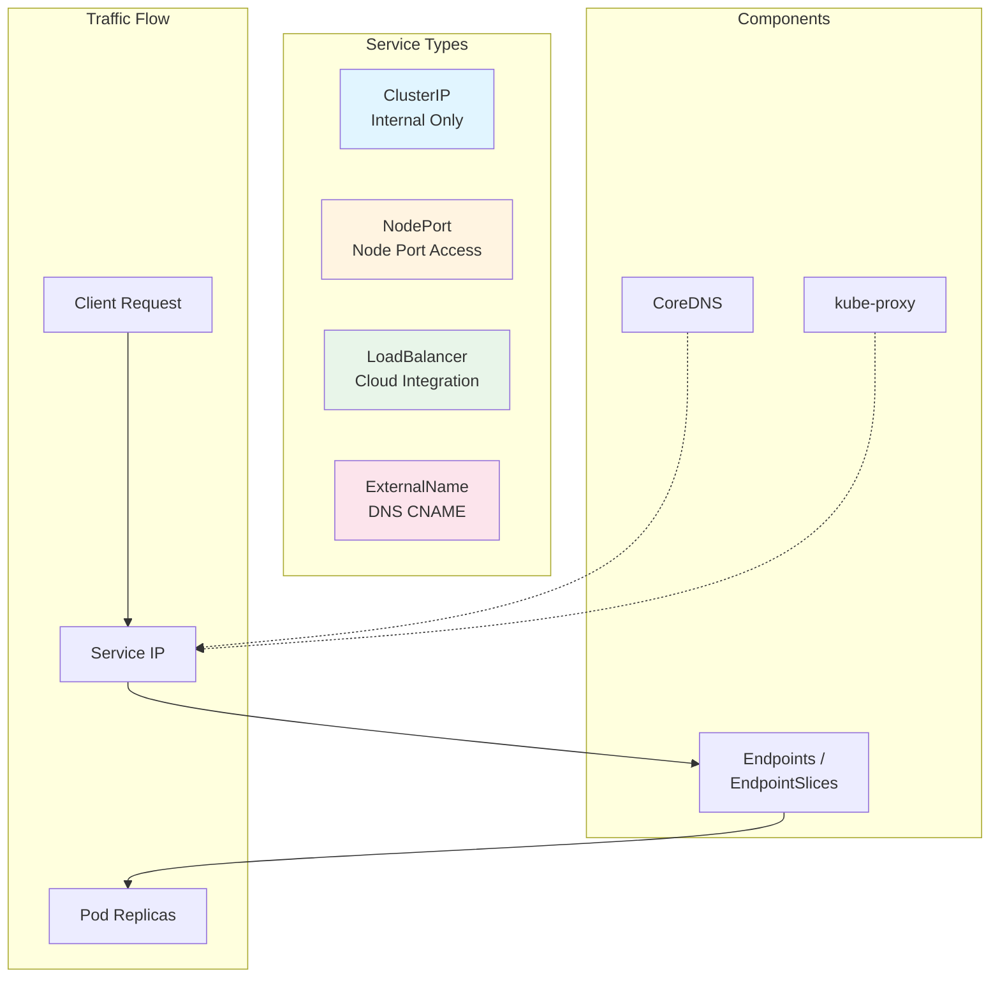
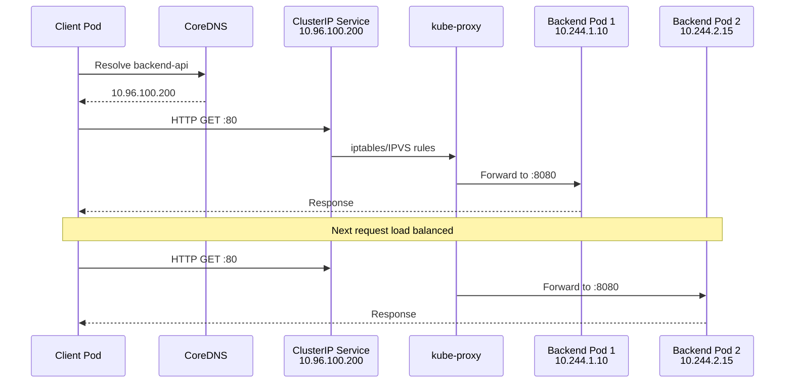
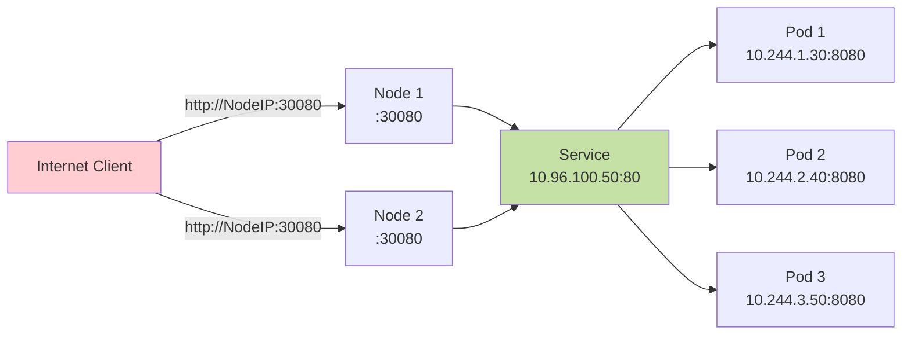
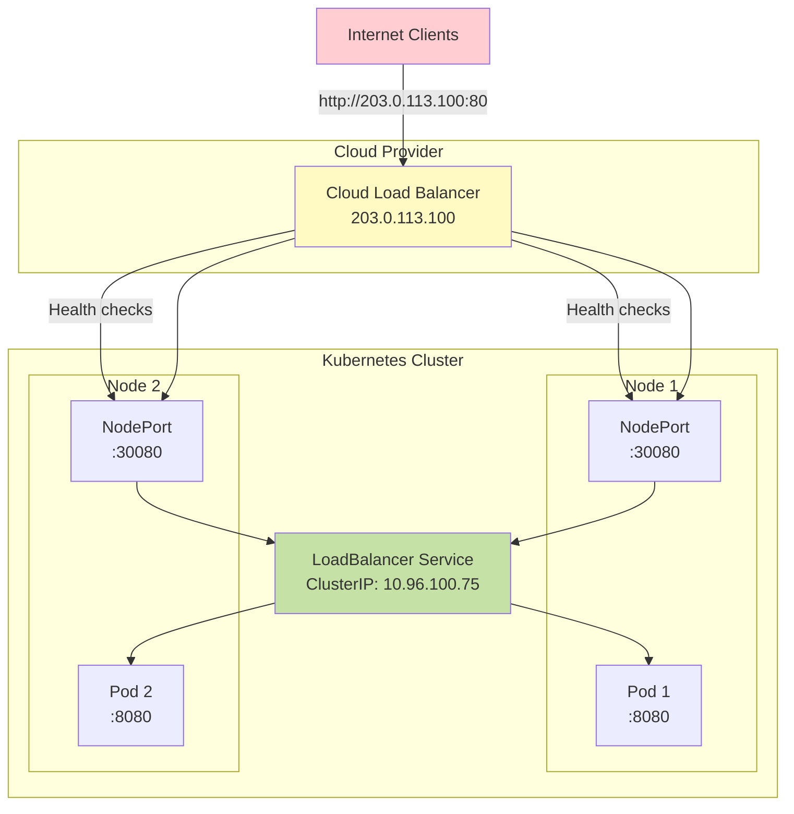
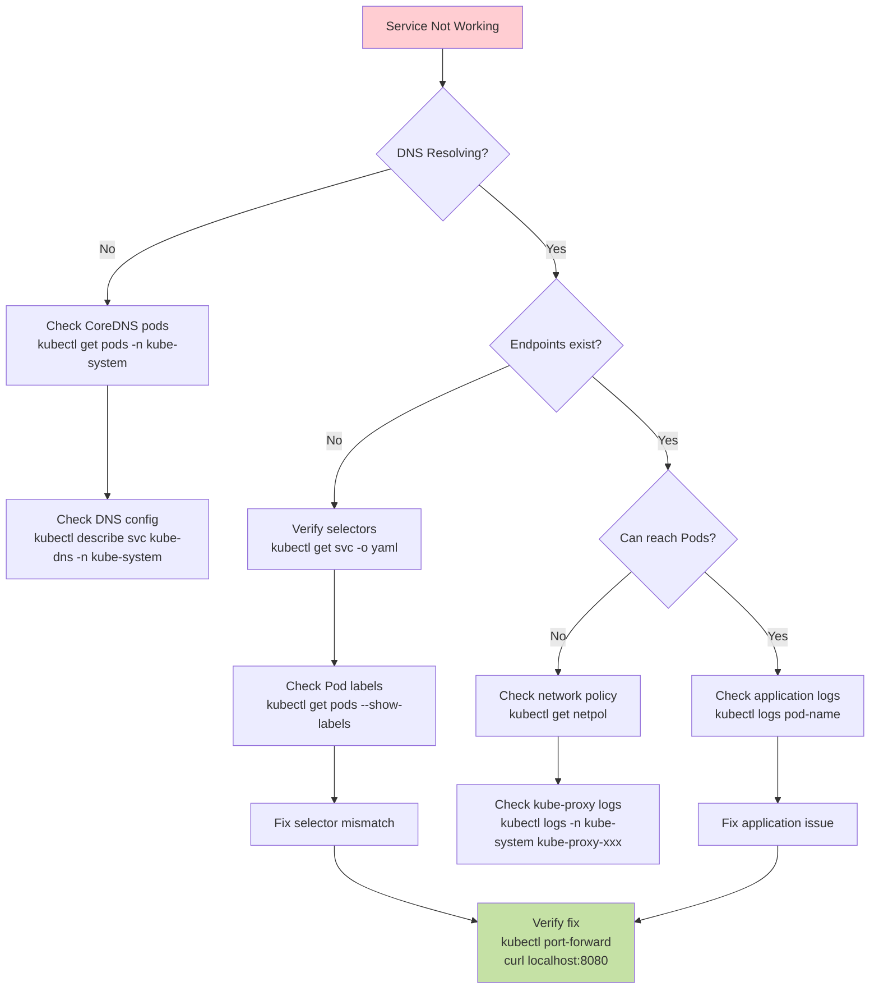

---
date:
  created: 2025-11-11
authors:
  - alf
categories:
  - Kubernetes
  - Networking
tags:
  - kubernetes
  - k8s
  - cka-prep
  - services
  - networking
  - service-discovery
  - endpoints
readtime: 14
slug: kubernetes-services-exposing-applications
---

# Kubernetes Services: Exposing Your Applications

Kubernetes Services are the cornerstone of networking in modern containerized applications. They provide stable, reliable access to dynamic sets of Pods, abstracting away the complexity of Pod IP management and enabling seamless communication between application components. For anyone preparing for the Certified Kubernetes Administrator (CKA) exam, mastering Services is essential—they represent 20% of the exam's Services & Networking domain.

In this comprehensive guide, we'll explore how Services work, when to use each type, and the practical kubectl commands you need to succeed in both the exam and production environments.

<!-- more -->

## Why Services Matter

Imagine deploying a microservices application where frontend Pods need to communicate with backend Pods. Pods are ephemeral—they get created, destroyed, and rescheduled constantly. Their IP addresses change with each recreation. How do you maintain reliable communication in this dynamic environment?

This is precisely the problem Services solve:

- **Stable Endpoint**: Services provide a consistent DNS name and IP address that remains constant regardless of Pod lifecycle changes
- **Load Balancing**: Automatically distribute traffic across healthy Pod replicas
- **Service Discovery**: Enable applications to find each other using DNS names rather than hard-coded IP addresses
- **External Access**: Expose applications to clients outside the cluster in various ways

Services decouple application components, enabling independent scaling, rolling updates, and resilient architectures. They're not just a networking abstraction—they're fundamental to building cloud-native applications.

## Service Architecture Overview

Before diving into specific Service types, let's understand the core architecture:



**Key Components**:

- **Service**: The abstraction layer with a stable ClusterIP and DNS name
- **Endpoints/EndpointSlices**: Dynamic lists of Pod IPs backing the Service (2025: EndpointSlices are the modern, scalable replacement)
- **kube-proxy**: Runs on each node, implementing the network rules that route traffic to Pods
- **CoreDNS**: Provides DNS-based service discovery within the cluster

## Service Fundamentals

### The Service Object

A Service is a Kubernetes resource that groups Pods using label selectors and provides a unified access point:

```yaml
apiVersion: v1
kind: Service
metadata:
  name: backend-service
spec:
  selector:
    app: backend
    tier: api
  ports:
    - name: http
      protocol: TCP
      port: 80        # Service port
      targetPort: 8080 # Pod port
```

**Port Mapping Explained**:

- `port`: The port exposed by the Service (what clients connect to)
- `targetPort`: The port on the Pod where the application listens
- `nodePort`: (NodePort type only) The port exposed on each node

### Service Discovery Mechanisms

Kubernetes provides two primary service discovery methods:

**1. DNS (Recommended)**

CoreDNS creates DNS records for each Service:

```bash
# Full DNS name format
<service-name>.<namespace>.svc.cluster.local

# Examples
backend-service.default.svc.cluster.local
database.production.svc.cluster.local

# Within same namespace, short form works
curl http://backend-service/api
```

**2. Environment Variables**

When a Pod starts, Kubernetes injects environment variables for Services that existed at creation time:

```bash
BACKEND_SERVICE_SERVICE_HOST=10.96.100.200
BACKEND_SERVICE_SERVICE_PORT=80
```

!!! warning "Environment Variable Limitations"
    Environment variables are only populated for Services that existed when the Pod was created. This creates ordering dependencies and is less flexible than DNS. Always prefer DNS-based discovery.

### kube-proxy Modes

kube-proxy implements Service routing using different backends:

| Mode | Description | Use Case |
|------|-------------|----------|
| **iptables** | Uses iptables rules (default in most clusters) | Standard deployments |
| **IPVS** | IP Virtual Server, better performance at scale | Large clusters (>1000 Services) |
| **nftables** | Modern replacement for iptables (Kubernetes 1.29+) | Future-proof deployments |

You can check the current mode:

```bash
kubectl logs -n kube-system kube-proxy-xxxxx | grep "Using"
# Output: Using iptables Proxier
```

## ClusterIP Services: Internal Communication

ClusterIP is the **default Service type**, providing cluster-internal access only. It's perfect for microservices communication where services don't need external exposure.

### Standard ClusterIP

```yaml
apiVersion: v1
kind: Service
metadata:
  name: backend-api
  namespace: production
spec:
  type: ClusterIP  # Optional, this is the default
  selector:
    app: backend
    version: v2
  ports:
    - name: http
      port: 80
      targetPort: 8080
      protocol: TCP
    - name: metrics
      port: 9090
      targetPort: 9090
      protocol: TCP
  sessionAffinity: ClientIP  # Optional: sticky sessions
```

**Creating with kubectl (imperative)**:

```bash
# Expose a deployment
kubectl expose deployment backend \
  --name=backend-api \
  --port=80 \
  --target-port=8080 \
  --type=ClusterIP

# Verify the Service
kubectl get svc backend-api
# NAME          TYPE        CLUSTER-IP      EXTERNAL-IP   PORT(S)   AGE
# backend-api   ClusterIP   10.96.100.200   <none>        80/TCP    5s

# Test DNS resolution
kubectl run test-pod --rm -it --image=busybox -- sh
/ # nslookup backend-api
# Server:    10.96.0.10
# Address 1: 10.96.0.10 kube-dns.kube-system.svc.cluster.local
#
# Name:      backend-api
# Address 1: 10.96.100.200 backend-api.production.svc.cluster.local
```

### Traffic Flow Diagram



### Headless Services (clusterIP: None)

Headless Services **don't get a ClusterIP**. Instead, DNS returns the individual Pod IPs directly. This is crucial for stateful applications that need direct Pod addressing.

```yaml
apiVersion: v1
kind: Service
metadata:
  name: database-headless
spec:
  clusterIP: None  # This makes it headless
  selector:
    app: postgres
    role: primary
  ports:
    - port: 5432
      targetPort: 5432
```

**DNS behavior with headless Services**:

```bash
# Normal Service (ClusterIP)
nslookup backend-api
# Returns: 10.96.100.200 (single Service IP)

# Headless Service
nslookup database-headless
# Returns: 10.244.1.20, 10.244.1.21, 10.244.1.22 (all Pod IPs)
```

**Use cases for headless Services**:

- StatefulSets with stable network identities
- Database replication (primary/replica identification)
- Custom load balancing logic in the application
- Service mesh data planes (Istio, Linkerd)

```bash
# Create headless Service imperatively
kubectl create service clusterip db-headless \
  --clusterip="None" \
  --tcp=5432:5432
```

### Session Affinity

By default, Services load balance each request randomly. Session affinity ensures requests from the same client go to the same Pod:

```yaml
apiVersion: v1
kind: Service
metadata:
  name: sticky-service
spec:
  selector:
    app: stateful-app
  sessionAffinity: ClientIP
  sessionAffinityConfig:
    clientIP:
      timeoutSeconds: 10800  # 3 hours
  ports:
    - port: 80
      targetPort: 8080
```

## NodePort & LoadBalancer: External Access

While ClusterIP Services work for internal communication, NodePort and LoadBalancer Services enable external access.

### NodePort Services

NodePort **opens a static port** on every node in the cluster (range: 30000-32767 by default). External traffic sent to `<NodeIP>:<NodePort>` gets routed to the Service.

```yaml
apiVersion: v1
kind: Service
metadata:
  name: web-frontend
spec:
  type: NodePort
  selector:
    app: nginx
    tier: frontend
  ports:
    - port: 80         # ClusterIP port
      targetPort: 8080  # Pod port
      nodePort: 30080   # External node port (optional)
      protocol: TCP
```

**Traffic path**:



**Creating and accessing NodePort Services**:

```bash
# Create NodePort Service
kubectl expose deployment nginx \
  --type=NodePort \
  --name=web-frontend \
  --port=80 \
  --target-port=8080

# Get the assigned NodePort
kubectl get svc web-frontend
# NAME           TYPE       CLUSTER-IP      EXTERNAL-IP   PORT(S)        AGE
# web-frontend   NodePort   10.96.100.50    <none>        80:31234/TCP   10s

# Access from outside cluster
# Get node IPs
kubectl get nodes -o wide
# NAME     STATUS   ROLES    INTERNAL-IP    EXTERNAL-IP
# node-1   Ready    <none>   192.168.1.10   203.0.113.10
# node-2   Ready    <none>   192.168.1.11   203.0.113.11

# Access via any node
curl http://203.0.113.10:31234
curl http://203.0.113.11:31234  # Both work!
```

**NodePort considerations**:

- ✅ Simple, works on any cluster (no cloud provider needed)
- ⚠️ Port range limited (30000-32767)
- ⚠️ Non-standard ports (requires clients to know the NodePort)
- ⚠️ Security: Exposes ports on all nodes

### LoadBalancer Services

LoadBalancer type integrates with **cloud provider load balancers** (AWS ELB/ALB, GCP Load Balancer, Azure Load Balancer) to provision external access with standard ports.

```yaml
apiVersion: v1
kind: Service
metadata:
  name: production-app
  annotations:
    service.beta.kubernetes.io/aws-load-balancer-type: "nlb"  # AWS-specific
spec:
  type: LoadBalancer
  selector:
    app: production
    tier: frontend
  ports:
    - name: http
      port: 80
      targetPort: 8080
    - name: https
      port: 443
      targetPort: 8443
  loadBalancerSourceRanges:  # Optional: restrict source IPs
    - 203.0.113.0/24
  externalTrafficPolicy: Local  # Preserve source IP
```

**LoadBalancer architecture**:



**Creating and managing LoadBalancer Services**:

```bash
# Create LoadBalancer Service
kubectl expose deployment app \
  --type=LoadBalancer \
  --name=production-app \
  --port=80 \
  --target-port=8080

# Watch for external IP provisioning (takes 1-3 minutes)
kubectl get svc production-app -w
# NAME             TYPE           CLUSTER-IP      EXTERNAL-IP     PORT(S)        AGE
# production-app   LoadBalancer   10.96.100.75    <pending>       80:31456/TCP   5s
# production-app   LoadBalancer   10.96.100.75    203.0.113.100   80:31456/TCP   45s

# Access via load balancer
curl http://203.0.113.100
```

**Cloud provider annotations** (examples):

```yaml
# AWS
annotations:
  service.beta.kubernetes.io/aws-load-balancer-type: "nlb"  # Network Load Balancer
  service.beta.kubernetes.io/aws-load-balancer-ssl-cert: "arn:aws:acm:..."
  service.beta.kubernetes.io/aws-load-balancer-backend-protocol: "http"

# GCP
annotations:
  cloud.google.com/load-balancer-type: "Internal"
  networking.gke.io/load-balancer-type: "Internal"

# Azure
annotations:
  service.beta.kubernetes.io/azure-load-balancer-internal: "true"
```

### MetalLB: LoadBalancer for Bare Metal

On-premises or bare-metal clusters don't have cloud load balancers. **MetalLB** provides LoadBalancer functionality using Layer 2 (ARP) or BGP.

**Install MetalLB**:

```bash
kubectl apply -f https://raw.githubusercontent.com/metallb/metallb/v0.14.9/config/manifests/metallb-native.yaml

# Create IP address pool
cat <<EOF | kubectl apply -f -
apiVersion: metallb.io/v1beta1
kind: IPAddressPool
metadata:
  name: production-pool
  namespace: metallb-system
spec:
  addresses:
    - 192.168.1.240-192.168.1.250  # Available IPs on your network
---
apiVersion: metallb.io/v1beta1
kind: L2Advertisement
metadata:
  name: production-l2
  namespace: metallb-system
spec:
  ipAddressPools:
    - production-pool
EOF
```

Now LoadBalancer Services automatically get IPs from this pool.

## Service Configuration Deep Dive

### Selector and Port Mapping

Services use **label selectors** to find their target Pods:

```yaml
# Service selector
spec:
  selector:
    app: backend
    version: v2

# Matching Pods must have these labels
metadata:
  labels:
    app: backend
    version: v2
    team: platform
```

**Multi-port Services**:

```yaml
apiVersion: v1
kind: Service
metadata:
  name: multi-port-service
spec:
  selector:
    app: fullstack
  ports:
    - name: http        # Named ports are required for multi-port
      port: 80
      targetPort: web   # Can reference Pod's named port
    - name: grpc
      port: 9090
      targetPort: 9090
    - name: metrics
      port: 9091
      targetPort: prometheus
```

**Pod with named ports**:

```yaml
containers:
  - name: app
    ports:
      - name: web
        containerPort: 8080
      - name: prometheus
        containerPort: 9091
```

### externalTrafficPolicy: Source IP Preservation

By default, NodePort and LoadBalancer Services perform **source NAT**, replacing the client IP with a node IP. This breaks IP-based access control and logging.

```yaml
spec:
  type: LoadBalancer
  externalTrafficPolicy: Cluster  # Default: performs SNAT
```

**Problems with `Cluster` policy**:

- Client IP is lost (replaced with node IP)
- Application logs show internal node IPs
- IP-based rate limiting doesn't work
- Geographic routing breaks

**Solution: `externalTrafficPolicy: Local`**:

```yaml
spec:
  type: LoadBalancer
  externalTrafficPolicy: Local  # Preserve source IP
```



```mermaid
graph TB
    subgraph "externalTrafficPolicy: Cluster (Default)"
        Client1[Client<br/>203.0.113.50]
        Node1[Node 1]
        Node2[Node 2]
        Pod1[Pod on Node 2]

        Client1 -->|1. Request| Node1
        Node1 -->|2. SNAT to Node1 IP| Node2
        Node2 -->|3. Forward| Pod1
        Pod1 -.->|Sees Node1 IP| Pod1
    end

    subgraph "externalTrafficPolicy: Local"
        Client2[Client<br/>203.0.113.50]
        Node3[Node 1<br/>Has Pod]
        Pod2[Local Pod]

        Client2 -->|1. Request| Node3
        Node3 -->|2. Direct forward<br/>No SNAT| Pod2
        Pod2 -.->|Sees Real Client IP| Pod2
    end

    style Pod1 fill:#ffcdd2
    style Pod2 fill:#c5e1a5
```

**Trade-offs**:

| Policy | Source IP | Load Distribution | Health Checks |
|--------|-----------|-------------------|---------------|
| `Cluster` | Lost (SNAT) | Even across all Pods | All nodes healthy |
| `Local` | Preserved | Only Pods on receiving node | Only nodes with Pods |

**Testing source IP preservation**:

```bash
# Deploy test application that logs client IP
kubectl run source-ip-app \
  --image=registry.k8s.io/echoserver:1.4 \
  --port=8080

kubectl expose pod source-ip-app \
  --type=LoadBalancer \
  --name=source-test \
  --port=80 \
  --target-port=8080

# Get external IP
EXTERNAL_IP=$(kubectl get svc source-test -o jsonpath='{.status.loadBalancer.ingress[0].ip}')

# Test with Cluster policy (default)
curl http://$EXTERNAL_IP/
# client_address=10.244.1.1  <-- Node IP, not your real IP

# Change to Local policy
kubectl patch svc source-test -p '{"spec":{"externalTrafficPolicy":"Local"}}'

# Test again
curl http://$EXTERNAL_IP/
# client_address=203.0.113.50  <-- Your real IP!
```

### Endpoints and EndpointSlices (2025 Update)

When you create a Service, Kubernetes creates a corresponding **Endpoints** or **EndpointSlices** object that lists the IPs of matching Pods.

**Legacy Endpoints API** (deprecated in v1.33):

```bash
kubectl get endpoints backend-service
# NAME              ENDPOINTS                          AGE
# backend-service   10.244.1.10:8080,10.244.2.15:8080  5m
```

**Modern EndpointSlices** (recommended):

```bash
kubectl get endpointslices
# NAME                        ADDRESSTYPE   PORTS   ENDPOINTS                          AGE
# backend-service-abc123      IPv4          8080    10.244.1.10,10.244.2.15           5m

kubectl describe endpointslice backend-service-abc123
# Name:         backend-service-abc123
# Namespace:    default
# AddressType:  IPv4
# Ports:
#   Name     Port  Protocol
#   ----     ----  --------
#   http     8080  TCP
# Endpoints:
#   - Addresses:  10.244.1.10
#     Conditions:
#       Ready:    true
#     Hostname:   backend-6b8f9-abc12
#     TargetRef:  Pod/backend-6b8f9-abc12
```

**Why EndpointSlices are better** (Kubernetes 1.33+):

| Feature | Endpoints | EndpointSlices |
|---------|-----------|----------------|
| **Scalability** | Monolithic (all IPs in one object) | Distributed (100 endpoints per slice) |
| **Watch efficiency** | Full update on any change | Incremental updates |
| **Dual-stack** | Limited support | Native IPv4/IPv6 |
| **Topology** | No awareness | Topology hints for routing |
| **Performance** | Degrades at scale | Up to 50% reduction in watch payload |

**Creating Services without selectors** (manual Endpoints):

```yaml
# Service without selector
apiVersion: v1
kind: Service
metadata:
  name: external-database
spec:
  ports:
    - port: 5432
      targetPort: 5432
---
# Manually created Endpoints
apiVersion: v1
kind: Endpoints
metadata:
  name: external-database  # Must match Service name
subsets:
  - addresses:
      - ip: 192.168.1.100  # External database IP
    ports:
      - port: 5432
```

This allows Services to point to **external resources** outside the cluster while maintaining the same DNS-based discovery.

## CKA Exam Skills: Imperative Service Management

The CKA exam emphasizes **speed and efficiency**. Master these imperative commands to save time.

### Quick Service Creation

```bash
# ClusterIP (default)
kubectl expose deployment nginx --port=80 --target-port=8080

# NodePort
kubectl expose deployment nginx \
  --type=NodePort \
  --port=80 \
  --target-port=8080 \
  --name=nginx-nodeport

# LoadBalancer
kubectl expose deployment nginx \
  --type=LoadBalancer \
  --port=80 \
  --target-port=8080 \
  --name=nginx-lb

# Generate YAML without creating (for exam prep)
kubectl expose deployment nginx --port=80 --dry-run=client -o yaml > service.yaml

# Create Service directly (not from deployment)
kubectl create service clusterip my-svc --tcp=5678:8080
kubectl create service nodeport my-svc --tcp=5678:8080 --node-port=30080
kubectl create service loadbalancer my-svc --tcp=5678:8080
```

### DNS Troubleshooting

**CoreDNS verification**:

```bash
# Check CoreDNS pods are running
kubectl get pods -n kube-system -l k8s-app=kube-dns
# NAME                       READY   STATUS    RESTARTS   AGE
# coredns-5d78c9869d-abc12   1/1     Running   0          10d
# coredns-5d78c9869d-def34   1/1     Running   0          10d

# Test DNS resolution from a pod
kubectl run dns-test --rm -it --image=busybox:1.28 -- sh
/ # nslookup kubernetes
# Server:    10.96.0.10
# Address 1: 10.96.0.10 kube-dns.kube-system.svc.cluster.local
#
# Name:      kubernetes
# Address 1: 10.96.0.1 kubernetes.default.svc.cluster.local

/ # nslookup backend-service
# Returns IP if Service exists, error if not

# Test external DNS
/ # nslookup google.com
# Should resolve if CoreDNS is configured for external lookups
```

**Common DNS issues**:

```bash
# Issue: DNS not resolving
# Check: CoreDNS ConfigMap
kubectl get configmap -n kube-system coredns -o yaml

# Issue: Pods can't resolve Service names
# Check: Pod DNS configuration
kubectl get pod test-pod -o jsonpath='{.spec.dnsPolicy}'
# Should return: ClusterFirst

kubectl get pod test-pod -o jsonpath='{.spec.dnsConfig}'
# Should show nameservers: [10.96.0.10]

# Issue: Service exists but DNS doesn't resolve
# Check: Service has endpoints
kubectl get endpoints backend-service
# If empty, check Pod selectors match
```

### Port-Forward for Debugging

Port-forward creates a **tunnel from your local machine** to a Service or Pod, bypassing Service networking. Essential for debugging.

```bash
# Forward to a Service
kubectl port-forward service/backend-service 8080:80
# Access on localhost:8080

# Forward to a specific Pod
kubectl port-forward pod/backend-abc123 8080:8080

# Forward to a Deployment (auto-selects pod)
kubectl port-forward deployment/backend 8080:8080

# Forward multiple ports
kubectl port-forward service/backend 8080:80 9090:9090

# Bind to all interfaces (not just localhost)
kubectl port-forward --address 0.0.0.0 service/backend 8080:80
```

**Use cases**:

- Test Services before exposing externally
- Debug Pod connectivity issues
- Access cluster services from local development
- Bypass authentication for troubleshooting

### Service Debugging Workflow



**Step-by-step debugging**:

```bash
# 1. Verify Service exists and has correct configuration
kubectl get svc backend-service
kubectl describe svc backend-service

# 2. Check if Endpoints are populated
kubectl get endpoints backend-service
# If empty, selectors don't match any Pods

# 3. Verify Pod labels match Service selector
kubectl get pods --show-labels
kubectl get svc backend-service -o jsonpath='{.spec.selector}'

# 4. Test connectivity directly to Pod
POD_IP=$(kubectl get pod backend-abc123 -o jsonpath='{.status.podIP}')
kubectl run test --rm -it --image=busybox -- wget -O- http://$POD_IP:8080

# 5. Test Service connectivity
kubectl run test --rm -it --image=busybox -- wget -O- http://backend-service:80

# 6. Check kube-proxy is creating iptables rules
kubectl get pods -n kube-system -l k8s-app=kube-proxy
kubectl logs -n kube-system kube-proxy-xxxxx | grep backend-service

# 7. Verify DNS resolution
kubectl run test --rm -it --image=busybox -- nslookup backend-service

# 8. Use port-forward as final test
kubectl port-forward svc/backend-service 8080:80
curl localhost:8080
```

## Service Discovery Best Practices

```yaml
# ✅ GOOD: Use DNS names, works across namespaces
apiVersion: v1
kind: Pod
metadata:
  name: frontend
spec:
  containers:
    - name: app
      image: frontend:v1
      env:
        - name: BACKEND_URL
          value: "http://backend-service.production.svc.cluster.local"

# ❌ BAD: Hard-coded IPs break when Services change
        - name: BACKEND_URL
          value: "http://10.96.100.200"

# ❌ BAD: Environment variables have ordering issues
        - name: BACKEND_HOST
          value: "$(BACKEND_SERVICE_SERVICE_HOST)"
```

**Cross-namespace Service access**:

```bash
# Same namespace
curl http://backend-service:80

# Different namespace
curl http://backend-service.production:80

# Fully qualified (always works)
curl http://backend-service.production.svc.cluster.local:80
```

## Security Considerations

**Limit Service exposure**:

```yaml
# Restrict LoadBalancer source IPs
spec:
  type: LoadBalancer
  loadBalancerSourceRanges:
    - 203.0.113.0/24    # Only allow specific CIDR
    - 198.51.100.0/24

# Use NetworkPolicies to control Pod-to-Service traffic
apiVersion: networking.k8s.io/v1
kind: NetworkPolicy
metadata:
  name: backend-netpol
spec:
  podSelector:
    matchLabels:
      app: backend
  policyTypes:
    - Ingress
  ingress:
    - from:
        - podSelector:
            matchLabels:
              app: frontend
      ports:
        - protocol: TCP
          port: 8080
```

**Disable NodePort allocation for LoadBalancer** (Kubernetes 1.24+):

```yaml
# Don't allocate NodePorts unnecessarily
spec:
  type: LoadBalancer
  allocateLoadBalancerNodePorts: false  # Save port space
```

## Quick Reference: Service Types Comparison

| Feature | ClusterIP | NodePort | LoadBalancer | ExternalName |
|---------|-----------|----------|--------------|--------------|
| **Cluster-internal** | ✅ | ✅ | ✅ | ✅ |
| **External access** | ❌ | ✅ (via NodePort) | ✅ (via LB) | N/A |
| **Requires cloud** | ❌ | ❌ | ✅ | ❌ |
| **Standard ports** | ✅ | ❌ (30000-32767) | ✅ | N/A |
| **Cost** | Free | Free | Paid (cloud) | Free |
| **Use case** | Microservices | Development/Testing | Production | External DNS alias |

## CKA Exam Tips

1. **Speed matters**: Use imperative commands for creation, YAML only when needed
2. **DNS is your friend**: Always test with `nslookup` and `kubectl run test --rm -it --image=busybox`
3. **Port-forward for debugging**: Fastest way to verify Pod/Service connectivity
4. **Know the differences**: Be ready to explain ClusterIP vs NodePort vs LoadBalancer
5. **EndpointSlices**: Understand the migration from Endpoints (exam may cover both)
6. **externalTrafficPolicy**: Know when and why to use `Local` vs `Cluster`

## Summary

Kubernetes Services are the glue that holds distributed applications together. They provide:

- **Abstraction**: Stable endpoints for dynamic Pod sets
- **Discovery**: DNS-based service location
- **Load balancing**: Traffic distribution across replicas
- **Flexibility**: Multiple exposure methods (ClusterIP, NodePort, LoadBalancer)

For the CKA exam, focus on:

- Imperative Service creation with `kubectl expose` and `kubectl create service`
- DNS troubleshooting with `nslookup` and `kubectl run`
- Understanding EndpointSlices and their advantages
- Debugging workflow: DNS → Endpoints → Connectivity → Application

Master these concepts, and you'll not only pass the exam but also build resilient, scalable Kubernetes applications in production. Services aren't just networking primitives—they're the foundation of cloud-native architecture.

Now get out there and expose your applications with confidence! 🚀
