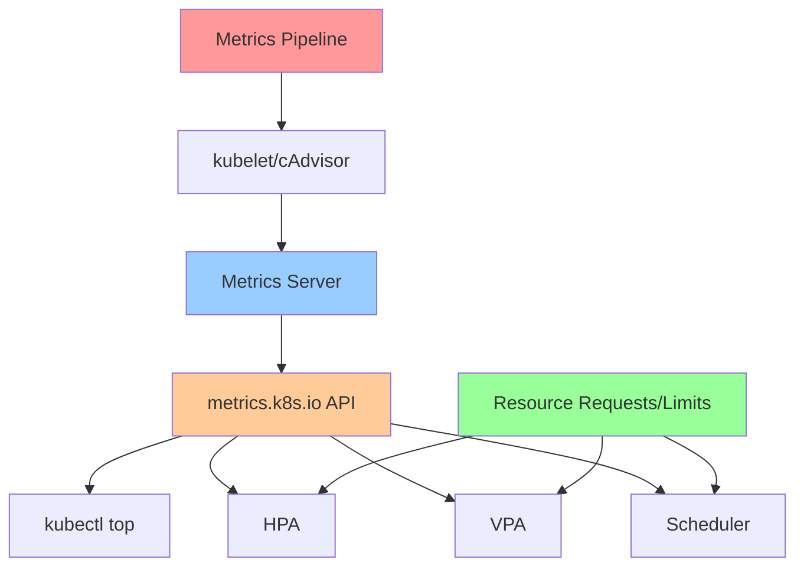
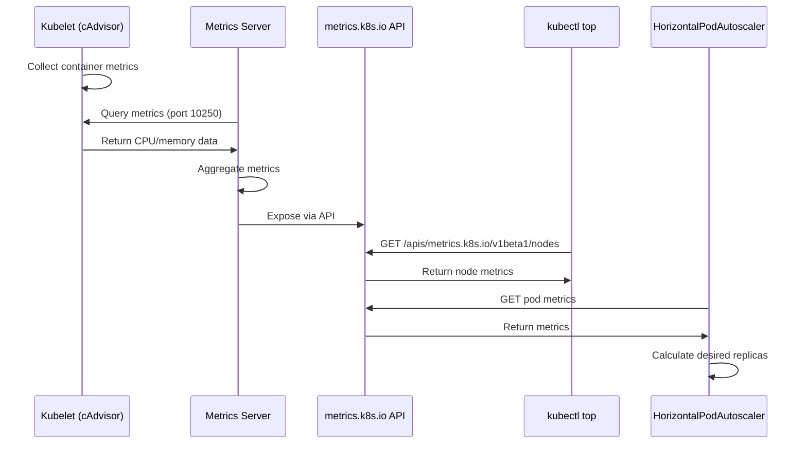
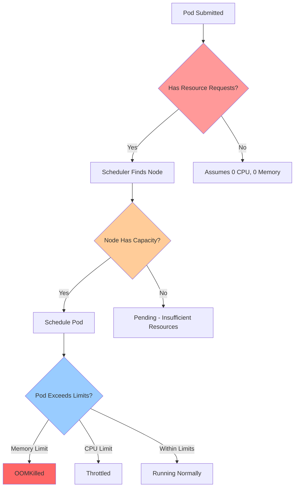
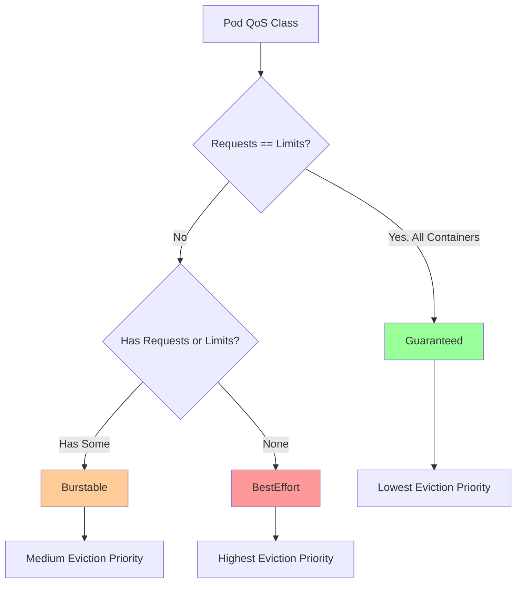
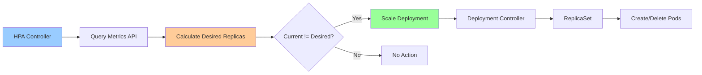
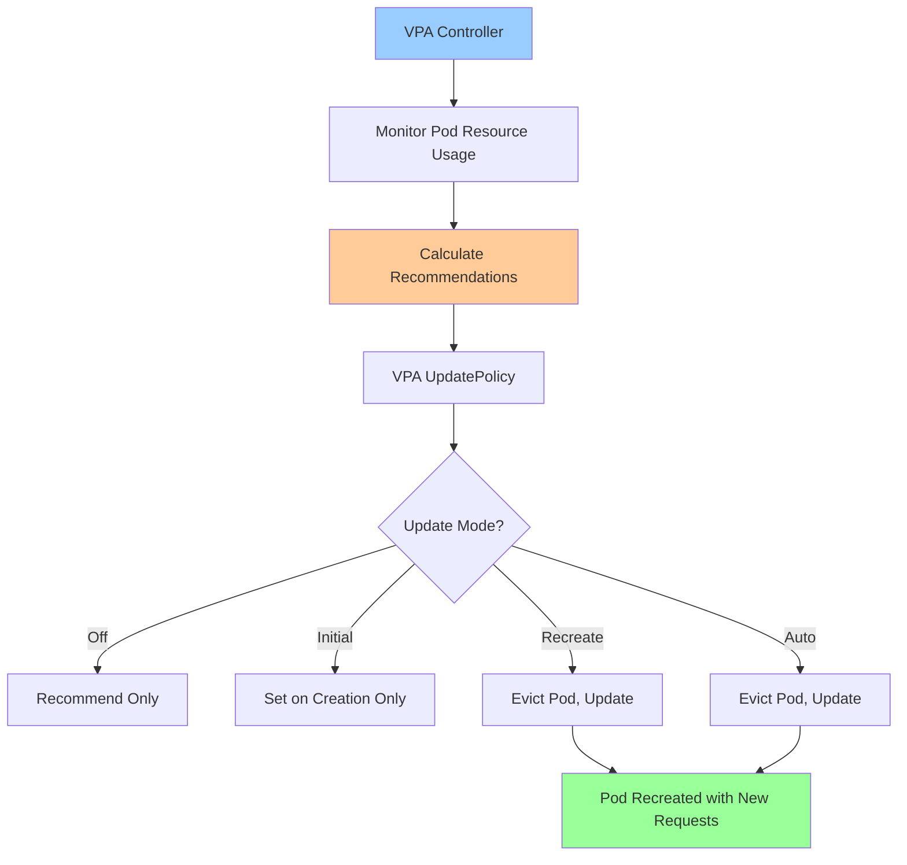

---
date:
  created: 2025-11-11
authors:
  - alf
categories:
  - Kubernetes
  - Monitoring
tags:
  - kubernetes
  - k8s
  - cka-prep
  - monitoring
  - metrics
  - autoscaling
readtime: 13
slug: monitoring-metrics-resource-management
---

# Kubernetes Monitoring, Metrics, and Resource Management

Master Metrics Server, resource requests/limits, Horizontal Pod Autoscaler (HPA), Vertical Pod Autoscaler (VPA), and kubectl top - essential skills for resource management and monitoring in Kubernetes.

<!-- more -->

## Overview

**Resource management and monitoring are critical for cluster efficiency** - proper configuration prevents resource starvation, enables autoscaling, and provides observability into cluster health. This guide covers the Kubernetes metrics pipeline and resource management best practices for the CKA exam.



---

## Metrics Server

**Metrics Server** is a cluster-wide aggregator of resource usage data - required for `kubectl top` and Horizontal Pod Autoscaler.

### Architecture



### Install Metrics Server

**Prerequisites**: Cluster with kubelet configured to expose metrics endpoint (default in most clusters).

```bash
# Install Metrics Server using kubectl
kubectl apply -f https://github.com/kubernetes-sigs/metrics-server/releases/latest/download/components.yaml

# Verify Metrics Server deployment
kubectl get deployment metrics-server -n kube-system

# Check Metrics Server pods
kubectl get pods -n kube-system -l k8s-app=metrics-server

# Verify Metrics API is available
kubectl get apiservices | grep metrics
# Output should show:
# v1beta1.metrics.k8s.io         kube-system/metrics-server   True
```

**Troubleshoot Metrics Server**:
```bash
# Check Metrics Server logs
kubectl logs -n kube-system deployment/metrics-server

# Common issues:
# 1. TLS certificate verification (dev/test clusters)
# Edit deployment to add: --kubelet-insecure-tls

kubectl edit deployment metrics-server -n kube-system
# Add to container args:
#   - --kubelet-insecure-tls

# 2. Kubelet hostname resolution
# Add: --kubelet-preferred-address-types=InternalIP

# Restart Metrics Server
kubectl rollout restart deployment metrics-server -n kube-system

# Verify metrics collection (wait ~1 minute for data)
kubectl top nodes
```

---

## kubectl top Command

**kubectl top** displays resource usage for nodes and pods - requires Metrics Server.

### Node Metrics

```bash
# Display resource usage for all nodes
kubectl top nodes

# Output example:
# NAME       CPU(cores)   CPU%   MEMORY(bytes)   MEMORY%
# master     250m         12%    1024Mi          30%
# worker-1   450m         22%    2048Mi          50%
# worker-2   380m         19%    1536Mi          38%

# Show node metrics sorted by CPU
kubectl top nodes --sort-by=cpu

# Show node metrics sorted by memory
kubectl top nodes --sort-by=memory

# Show specific node
kubectl top node worker-1
```

### Pod Metrics

```bash
# Display resource usage for all pods
kubectl top pods

# Display for specific namespace
kubectl top pods -n kube-system

# Display all namespaces
kubectl top pods -A

# Show pod metrics sorted by CPU
kubectl top pods --sort-by=cpu

# Show pod metrics sorted by memory
kubectl top pods --sort-by=memory

# Show containers in pods
kubectl top pods --containers

# Filter by label
kubectl top pods -l app=nginx

# Output example:
# NAME                    CPU(cores)   MEMORY(bytes)
# nginx-7c6d8f5b8d-abc    10m          32Mi
# nginx-7c6d8f5b8d-xyz    12m          34Mi
# nginx-7c6d8f5b8d-def    11m          33Mi
```

---

## Resource Requests and Limits

**Resource requests and limits** define container resource requirements and constraints - critical for scheduling and QoS.



### Resource Types

| Resource | Description | Units |
|----------|-------------|-------|
| **cpu** | CPU time | Cores (1000m = 1 core), millicores (m) |
| **memory** | RAM | Bytes (Ki, Mi, Gi, Ti) |
| **ephemeral-storage** | Temporary disk space | Bytes (Ki, Mi, Gi) |
| **hugepages-<size>** | Huge pages | Bytes |

### Requests vs Limits

```yaml
apiVersion: v1
kind: Pod
metadata:
  name: resource-demo
spec:
  containers:
  - name: app
    image: nginx:1.27
    resources:
      requests:
        memory: "128Mi"
        cpu: "250m"
      limits:
        memory: "256Mi"
        cpu: "500m"
```

**Requests**:
- **Minimum guaranteed resources**
- Used by scheduler for pod placement
- Node must have available capacity >= requests
- If exceeded: No immediate action (except CPU gets throttled at limit)

**Limits**:
- **Maximum allowed resources**
- Enforced by kubelet
- Memory limit exceeded → OOMKilled
- CPU limit exceeded → Throttled (not killed)

### QoS Classes

Kubernetes assigns **Quality of Service (QoS) class** based on requests/limits:



**QoS Classes**:

| Class | Criteria | Behavior |
|-------|----------|----------|
| **Guaranteed** | All containers have requests == limits for CPU and memory | Lowest eviction priority, most stable |
| **Burstable** | At least one container has request or limit | Medium eviction priority |
| **BestEffort** | No requests or limits set | Highest eviction priority, first to be evicted |

**Check Pod QoS Class**:
```bash
kubectl get pod <pod-name> -o jsonpath='{.status.qosClass}'

# Example outputs:
# Guaranteed
# Burstable
# BestEffort
```

---

## Horizontal Pod Autoscaler (HPA)

**HPA** automatically scales the number of pods based on observed metrics (CPU, memory, custom metrics).



### HPA Calculation Formula

```
desiredReplicas = ceil[currentReplicas * (currentMetricValue / targetMetricValue)]
```

### Create HPA with kubectl autoscale

```bash
# Create HPA for deployment (CPU-based)
kubectl autoscale deployment nginx --cpu-percent=50 --min=2 --max=10

# Verify HPA
kubectl get hpa

# Output:
# NAME    REFERENCE          TARGETS   MINPODS   MAXPODS   REPLICAS   AGE
# nginx   Deployment/nginx   20%/50%   2         10        2          1m

# Describe HPA
kubectl describe hpa nginx

# Watch HPA in real-time
kubectl get hpa nginx --watch

# Delete HPA
kubectl delete hpa nginx
```

### HPA YAML Manifest (Resource Metrics)

```yaml
apiVersion: autoscaling/v2
kind: HorizontalPodAutoscaler
metadata:
  name: nginx-hpa
spec:
  scaleTargetRef:
    apiVersion: apps/v1
    kind: Deployment
    name: nginx
  minReplicas: 2
  maxReplicas: 10
  metrics:
  - type: Resource
    resource:
      name: cpu
      target:
        type: Utilization
        averageUtilization: 50  # Target 50% CPU
  - type: Resource
    resource:
      name: memory
      target:
        type: Utilization
        averageUtilization: 70  # Target 70% memory
```

### HPA with ContainerResource Metrics (v1.27+)

**Scale based on specific container** (useful for multi-container pods):

```yaml
apiVersion: autoscaling/v2
kind: HorizontalPodAutoscaler
metadata:
  name: app-hpa
spec:
  scaleTargetRef:
    apiVersion: apps/v1
    kind: Deployment
    name: myapp
  minReplicas: 1
  maxReplicas: 10
  metrics:
  - type: ContainerResource
    containerResource:
      name: cpu
      container: application  # Target specific container
      target:
        type: Utilization
        averageUtilization: 60
```

### HPA with Custom Metrics

**Object metrics** (from Ingress, Service, etc.):
```yaml
metrics:
- type: Object
  object:
    metric:
      name: requests-per-second
    describedObject:
      apiVersion: networking.k8s.io/v1
      kind: Ingress
      name: main-route
    target:
      type: Value
      value: "2k"
```

**Pod metrics** (custom application metrics):
```yaml
metrics:
- type: Pods
  pods:
    metric:
      name: packets-per-second
    target:
      type: AverageValue
      averageValue: "1k"
```

### HPA Scaling Behavior (v1.23+)

**Control scale-up/scale-down rates**:
```yaml
apiVersion: autoscaling/v2
kind: HorizontalPodAutoscaler
metadata:
  name: nginx-hpa
spec:
  scaleTargetRef:
    apiVersion: apps/v1
    kind: Deployment
    name: nginx
  minReplicas: 1
  maxReplicas: 10
  metrics:
  - type: Resource
    resource:
      name: cpu
      target:
        type: Utilization
        averageUtilization: 50
  behavior:
    scaleDown:
      stabilizationWindowSeconds: 300  # 5 min cooldown before scaling down
      policies:
      - type: Percent
        value: 10  # Max 10% pods removed per period
        periodSeconds: 60
      - type: Pods
        value: 5  # Max 5 pods removed per period
        periodSeconds: 60
      selectPolicy: Min  # Use minimum of policies
    scaleUp:
      stabilizationWindowSeconds: 0  # Immediate scale-up
      policies:
      - type: Percent
        value: 100  # Max 100% pods added per period (double)
        periodSeconds: 15
      - type: Pods
        value: 4  # Max 4 pods added per period
        periodSeconds: 15
      selectPolicy: Max  # Use maximum of policies
```

---

## Vertical Pod Autoscaler (VPA)

**VPA** automatically adjusts resource requests/limits based on historical usage - complementary to HPA.



### VPA Modes

| Mode | Behavior | Use Case |
|------|----------|----------|
| **Off** | Only calculate recommendations, don't apply | Observation, manual review |
| **Initial** | Apply recommendations only on pod creation | One-time sizing |
| **Recreate** | Apply recommendations by evicting pods | Compatible with stateless apps |
| **Auto** | Apply recommendations without eviction (future) | Seamless updates |

### VPA Installation

```bash
# Clone VPA repository
git clone https://github.com/kubernetes/autoscaler.git
cd autoscaler/vertical-pod-autoscaler

# Install VPA (CRDs, controllers)
./hack/vpa-up.sh

# Verify VPA components
kubectl get pods -n kube-system | grep vpa
# vpa-admission-controller
# vpa-recommender
# vpa-updater

# Verify VPA CRDs
kubectl get crd | grep verticalpodautoscaler
```

### VPA Example

```yaml
apiVersion: autoscaling.k8s.io/v1
kind: VerticalPodAutoscaler
metadata:
  name: nginx-vpa
spec:
  targetRef:
    apiVersion: apps/v1
    kind: Deployment
    name: nginx
  updatePolicy:
    updateMode: "Auto"  # Options: Off, Initial, Recreate, Auto
  resourcePolicy:
    containerPolicies:
    - containerName: "*"
      minAllowed:
        cpu: "100m"
        memory: "100Mi"
      maxAllowed:
        cpu: "2"
        memory: "2Gi"
      controlledResources: ["cpu", "memory"]
```

**Check VPA Recommendations**:
```bash
# Get VPA status
kubectl get vpa nginx-vpa

# Describe VPA (shows recommendations)
kubectl describe vpa nginx-vpa

# Output includes:
# Recommendation:
#   Container Recommendations:
#     Container Name:  nginx
#     Lower Bound:     (minimum safe resources)
#       Cpu:     50m
#       Memory:  128Mi
#     Target:          (recommended resources)
#       Cpu:     100m
#       Memory:  256Mi
#     Upper Bound:     (maximum expected)
#       Cpu:     200m
#       Memory:  512Mi
```

**Note**: Do NOT use VPA and HPA together on the same metric (CPU/memory) - they will conflict. Use VPA for requests/limits sizing, HPA for replica scaling.

---

## Resource Quotas

**ResourceQuotas** limit aggregate resource consumption per namespace.

```yaml
apiVersion: v1
kind: ResourceQuota
metadata:
  name: compute-quota
  namespace: production
spec:
  hard:
    requests.cpu: "20"           # Total CPU requests
    requests.memory: "40Gi"      # Total memory requests
    limits.cpu: "40"             # Total CPU limits
    limits.memory: "80Gi"        # Total memory limits
    pods: "50"                   # Max number of pods
    persistentvolumeclaims: "10" # Max PVCs
```

```bash
# Create ResourceQuota
kubectl apply -f resource-quota.yaml -n production

# View quotas
kubectl get resourcequota -n production
kubectl describe resourcequota compute-quota -n production

# Output shows:
# Name:            compute-quota
# Namespace:       production
# Resource         Used   Hard
# --------         ----   ----
# limits.cpu       5      40
# limits.memory    10Gi   80Gi
# pods             12     50
# requests.cpu     2.5    20
# requests.memory  5Gi    40Gi
```

---

## LimitRange

**LimitRange** sets default requests/limits and enforces min/max per container/pod.

```yaml
apiVersion: v1
kind: LimitRange
metadata:
  name: mem-cpu-limit-range
  namespace: default
spec:
  limits:
  - max:
      cpu: "2"
      memory: "2Gi"
    min:
      cpu: "100m"
      memory: "128Mi"
    default:
      cpu: "500m"
      memory: "512Mi"
    defaultRequest:
      cpu: "250m"
      memory: "256Mi"
    type: Container
  - max:
      cpu: "4"
      memory: "4Gi"
    type: Pod
```

```bash
# Create LimitRange
kubectl apply -f limit-range.yaml

# View LimitRange
kubectl get limitrange
kubectl describe limitrange mem-cpu-limit-range

# New pods without requests/limits will get defaults automatically
```

---

## CKA Exam Practice Exercises

### Exercise 1: Install Metrics Server and Use kubectl top

**Scenario**: Install Metrics Server in your cluster and use `kubectl top` to monitor resource usage.

<details>
<summary><strong>Solution</strong></summary>

```bash
# 1. Install Metrics Server
kubectl apply -f https://github.com/kubernetes-sigs/metrics-server/releases/latest/download/components.yaml

# 2. Verify deployment
kubectl get deployment metrics-server -n kube-system
# NAME             READY   UP-TO-DATE   AVAILABLE   AGE
# metrics-server   1/1     1            1           30s

# 3. Check Metrics Server pods
kubectl get pods -n kube-system -l k8s-app=metrics-server
# NAME                             READY   STATUS    RESTARTS   AGE
# metrics-server-5f9b8c7d4d-xyz    1/1     Running   0          40s

# 4. Verify Metrics API is registered
kubectl get apiservices | grep metrics
# v1beta1.metrics.k8s.io   kube-system/metrics-server   True   1m

# 5. Wait for metrics collection (~1 minute)
sleep 60

# 6. Check node metrics
kubectl top nodes
# NAME       CPU(cores)   CPU%   MEMORY(bytes)   MEMORY%
# master     250m         12%    1024Mi          30%
# worker-1   450m         22%    2048Mi          50%

# 7. Check pod metrics
kubectl top pods -A
# NAMESPACE     NAME                              CPU(cores)   MEMORY(bytes)
# kube-system   coredns-5d78c9869d-abc           3m           12Mi
# kube-system   kube-proxy-xyz                   1m           16Mi
# default       nginx-deployment-7c6d8f5b8d-123  10m          32Mi

# 8. Check specific namespace
kubectl top pods -n kube-system

# 9. Show pod metrics with containers
kubectl top pods --containers -n kube-system

# 10. Sort by CPU
kubectl top pods --sort-by=cpu -A
```

**Key Takeaways**:
- Metrics Server is required for `kubectl top` and HPA
- Metrics take ~1 minute to start appearing after installation
- `kubectl top nodes` shows cluster-level resource usage
- `kubectl top pods` shows pod-level usage

</details>

---

### Exercise 2: Configure Resource Requests and Limits

**Scenario**: Create a deployment with proper resource requests and limits, then check its QoS class.

<details>
<summary><strong>Solution</strong></summary>

```bash
# 1. Create deployment with resource configuration
cat <<EOF | kubectl apply -f -
apiVersion: apps/v1
kind: Deployment
metadata:
  name: resource-demo
spec:
  replicas: 3
  selector:
    matchLabels:
      app: resource-demo
  template:
    metadata:
      labels:
        app: resource-demo
    spec:
      containers:
      - name: app
        image: nginx:1.27
        resources:
          requests:
            memory: "128Mi"
            cpu: "250m"
          limits:
            memory: "256Mi"
            cpu: "500m"
EOF

# 2. Verify deployment
kubectl get deployment resource-demo
kubectl get pods -l app=resource-demo

# 3. Check QoS class of one pod
POD=$(kubectl get pods -l app=resource-demo -o jsonpath='{.items[0].metadata.name}')
kubectl get pod $POD -o jsonpath='{.status.qosClass}'
# Output: Burstable (because requests != limits)

# 4. Check resource configuration
kubectl describe pod $POD | grep -A 6 "Requests:"
# Requests:
#   cpu:     250m
#   memory:  128Mi
# Limits:
#   cpu:     500m
#   memory:  256Mi

# 5. Check resource usage
kubectl top pod $POD
# NAME                            CPU(cores)   MEMORY(bytes)
# resource-demo-xyz               12m          34Mi

# 6. Create Guaranteed QoS pod (requests == limits)
cat <<EOF | kubectl apply -f -
apiVersion: v1
kind: Pod
metadata:
  name: guaranteed-pod
spec:
  containers:
  - name: app
    image: nginx:1.27
    resources:
      requests:
        memory: "256Mi"
        cpu: "500m"
      limits:
        memory: "256Mi"
        cpu: "500m"
EOF

# 7. Check QoS of guaranteed pod
kubectl get pod guaranteed-pod -o jsonpath='{.status.qosClass}'
# Output: Guaranteed

# 8. Create BestEffort QoS pod (no resources)
cat <<EOF | kubectl apply -f -
apiVersion: v1
kind: Pod
metadata:
  name: besteffort-pod
spec:
  containers:
  - name: app
    image: nginx:1.27
    # No resource requests or limits
EOF

# 9. Check QoS of besteffort pod
kubectl get pod besteffort-pod -o jsonpath='{.status.qosClass}'
# Output: BestEffort

# 10. Cleanup
kubectl delete deployment resource-demo
kubectl delete pod guaranteed-pod besteffort-pod
```

**Key Takeaways**:
- Guaranteed QoS: requests == limits for all resources
- Burstable QoS: has some requests or limits
- BestEffort QoS: no requests or limits (evicted first)
- Proper resource configuration prevents resource starvation

</details>

---

### Exercise 3: Create and Test Horizontal Pod Autoscaler

**Scenario**: Create an HPA for a deployment and observe it scale based on CPU load.

<details>
<summary><strong>Solution</strong></summary>

```bash
# 1. Create deployment with resource requests (HPA requires requests)
cat <<EOF | kubectl apply -f -
apiVersion: apps/v1
kind: Deployment
metadata:
  name: php-apache
spec:
  replicas: 1
  selector:
    matchLabels:
      app: php-apache
  template:
    metadata:
      labels:
        app: php-apache
    spec:
      containers:
      - name: php-apache
        image: registry.k8s.io/hpa-example
        resources:
          requests:
            cpu: "200m"
          limits:
            cpu: "500m"
EOF

# 2. Expose deployment as service
kubectl expose deployment php-apache --port=80

# 3. Create HPA using kubectl autoscale
kubectl autoscale deployment php-apache --cpu-percent=50 --min=1 --max=10

# 4. Check HPA status
kubectl get hpa
# NAME         REFERENCE               TARGETS   MINPODS   MAXPODS   REPLICAS   AGE
# php-apache   Deployment/php-apache   0%/50%    1         10        1          10s

# 5. Describe HPA
kubectl describe hpa php-apache
# Shows detailed scaling information

# 6. Generate load (in separate terminal)
kubectl run load-generator --image=busybox:1.28 --restart=Never -- /bin/sh -c "while true; do wget -q -O- http://php-apache; done"

# 7. Watch HPA scale up (in original terminal)
kubectl get hpa php-apache --watch
# NAME         REFERENCE               TARGETS    MINPODS   MAXPODS   REPLICAS   AGE
# php-apache   Deployment/php-apache   0%/50%     1         10        1          1m
# php-apache   Deployment/php-apache   250%/50%   1         10        1          1m
# php-apache   Deployment/php-apache   250%/50%   1         10        5          2m
# php-apache   Deployment/php-apache   150%/50%   1         10        5          2m

# 8. Check deployment replicas
kubectl get deployment php-apache
# NAME         READY   UP-TO-DATE   AVAILABLE   AGE
# php-apache   5/5     5            5           3m

# 9. Stop load generator
kubectl delete pod load-generator

# 10. Watch HPA scale down (takes ~5 minutes by default)
kubectl get hpa php-apache --watch
# NAME         REFERENCE               TARGETS   MINPODS   MAXPODS   REPLICAS   AGE
# php-apache   Deployment/php-apache   0%/50%    1         10        5          5m
# php-apache   Deployment/php-apache   0%/50%    1         10        1          10m

# 11. View HPA YAML
kubectl get hpa php-apache -o yaml

# 12. Cleanup
kubectl delete hpa php-apache
kubectl delete deployment php-apache
kubectl delete svc php-apache
```

**Key Takeaways**:
- HPA requires resource requests to calculate utilization
- CPU utilization = (current CPU usage / requested CPU) * 100
- Scale-up is fast, scale-down has cooldown (default 5 min)
- HPA uses formula: desiredReplicas = ceil[currentReplicas * (current/target)]

</details>

---

### Exercise 4: Create ResourceQuota and LimitRange

**Scenario**: Create a namespace with ResourceQuota and LimitRange to control resource allocation.

<details>
<summary><strong>Solution</strong></summary>

```bash
# 1. Create namespace
kubectl create namespace resource-controlled

# 2. Create ResourceQuota
cat <<EOF | kubectl apply -f -
apiVersion: v1
kind: ResourceQuota
metadata:
  name: compute-quota
  namespace: resource-controlled
spec:
  hard:
    requests.cpu: "2"
    requests.memory: "4Gi"
    limits.cpu: "4"
    limits.memory: "8Gi"
    pods: "10"
EOF

# 3. Verify ResourceQuota
kubectl get resourcequota -n resource-controlled
kubectl describe resourcequota compute-quota -n resource-controlled
# Resource         Used  Hard
# --------         ----  ----
# limits.cpu       0     4
# limits.memory    0     8Gi
# pods             0     10
# requests.cpu     0     2
# requests.memory  0     4Gi

# 4. Create LimitRange (default requests/limits)
cat <<EOF | kubectl apply -f -
apiVersion: v1
kind: LimitRange
metadata:
  name: mem-cpu-limit
  namespace: resource-controlled
spec:
  limits:
  - max:
      cpu: "1"
      memory: "1Gi"
    min:
      cpu: "50m"
      memory: "64Mi"
    default:
      cpu: "500m"
      memory: "512Mi"
    defaultRequest:
      cpu: "250m"
      memory: "256Mi"
    type: Container
EOF

# 5. Verify LimitRange
kubectl get limitrange -n resource-controlled
kubectl describe limitrange mem-cpu-limit -n resource-controlled

# 6. Create pod WITHOUT specifying resources (should get defaults)
cat <<EOF | kubectl apply -f -
apiVersion: v1
kind: Pod
metadata:
  name: default-resources
  namespace: resource-controlled
spec:
  containers:
  - name: nginx
    image: nginx:1.27
EOF

# 7. Check applied resources
kubectl describe pod default-resources -n resource-controlled | grep -A 6 "Requests:"
# Requests:
#   cpu:        250m  (from defaultRequest)
#   memory:     256Mi (from defaultRequest)
# Limits:
#   cpu:        500m  (from default)
#   memory:     512Mi (from default)

# 8. Check ResourceQuota usage
kubectl describe resourcequota compute-quota -n resource-controlled
# Resource         Used    Hard
# --------         ----    ----
# limits.cpu       500m    4
# limits.memory    512Mi   8Gi
# pods             1       10
# requests.cpu     250m    2
# requests.memory  256Mi   4Gi

# 9. Try to exceed quota (create 9 more pods)
for i in {1..9}; do
  kubectl run pod-$i --image=nginx:1.27 -n resource-controlled
done

# 10. Check quota after 8 pods
kubectl describe resourcequota compute-quota -n resource-controlled
# Resource         Used    Hard
# --------         ----    ----
# limits.cpu       4       4     (at limit!)
# limits.memory    4Gi     8Gi
# pods             9       10
# requests.cpu     2       2     (at limit!)
# requests.memory  2304Mi  4Gi

# 11. Try to create 10th pod (should succeed - under pod limit)
kubectl run pod-10 --image=nginx:1.27 -n resource-controlled

# 12. Try to create 11th pod (should FAIL - exceeds pod limit)
kubectl run pod-11 --image=nginx:1.27 -n resource-controlled
# Error: pods "pod-11" is forbidden: exceeded quota: compute-quota

# 13. Cleanup
kubectl delete namespace resource-controlled
```

**Key Takeaways**:
- ResourceQuota limits total namespace resource consumption
- LimitRange sets defaults and enforces min/max per container
- Pods without resources get defaults from LimitRange
- Quota prevents pod creation when limits exceeded

</details>

---

### Exercise 5: Debug HPA Not Scaling

**Scenario**: An HPA is created but not scaling. Troubleshoot and fix the issue.

<details>
<summary><strong>Solution</strong></summary>

```bash
# 1. Create deployment WITHOUT resource requests (common mistake)
cat <<EOF | kubectl apply -f -
apiVersion: apps/v1
kind: Deployment
metadata:
  name: broken-hpa-demo
spec:
  replicas: 1
  selector:
    matchLabels:
      app: broken-hpa-demo
  template:
    metadata:
      labels:
        app: broken-hpa-demo
    spec:
      containers:
      - name: app
        image: nginx:1.27
        # Missing: resource requests!
EOF

# 2. Create HPA
kubectl autoscale deployment broken-hpa-demo --cpu-percent=50 --min=1 --max=5

# 3. Check HPA status
kubectl get hpa broken-hpa-demo
# NAME              REFERENCE                    TARGETS         MINPODS   MAXPODS   REPLICAS   AGE
# broken-hpa-demo   Deployment/broken-hpa-demo   <unknown>/50%   1         5         1          30s

# TARGETS shows "<unknown>" - HPA cannot calculate!

# 4. Describe HPA to see error
kubectl describe hpa broken-hpa-demo
# Events:
#   Warning  FailedGetResourceMetric  unable to get metrics for resource cpu: no metrics returned from resource metrics API

# 5. Check pod for resource requests
kubectl get deployment broken-hpa-demo -o yaml | grep -A 10 "resources:"
# No resources section found!

# 6. Fix: Add resource requests
kubectl patch deployment broken-hpa-demo --type='json' -p='[
  {
    "op": "add",
    "path": "/spec/template/spec/containers/0/resources",
    "value": {
      "requests": {
        "cpu": "200m",
        "memory": "128Mi"
      },
      "limits": {
        "cpu": "500m",
        "memory": "256Mi"
      }
    }
  }
]'

# 7. Verify patch applied
kubectl get deployment broken-hpa-demo -o yaml | grep -A 6 "resources:"
# resources:
#   requests:
#     cpu: 200m
#     memory: 128Mi
#   limits:
#     cpu: 500m
#     memory: 256Mi

# 8. Wait for metrics (new pod needs to collect metrics)
sleep 60

# 9. Check HPA again
kubectl get hpa broken-hpa-demo
# NAME              REFERENCE                    TARGETS   MINPODS   MAXPODS   REPLICAS   AGE
# broken-hpa-demo   Deployment/broken-hpa-demo   0%/50%    1         5         1          5m

# Now shows actual CPU utilization!

# 10. Describe HPA (should show metrics now)
kubectl describe hpa broken-hpa-demo
# Metrics:
#   resource cpu on pods (as a percentage of request):  0% (0) / 50%
# Conditions:
#   Type            Status
#   ----            ------
#   AbleToScale     True
#   ScalingActive   True

# 11. Cleanup
kubectl delete hpa broken-hpa-demo
kubectl delete deployment broken-hpa-demo
```

**Key Takeaways**:
- HPA **requires** resource requests to calculate utilization
- `<unknown>` targets indicate missing requests or metrics
- Wait ~1 minute after fixing for metrics to appear
- Common HPA issues: no requests, Metrics Server not installed, no load

</details>

---

## Quick Reference Commands

### Metrics Server
```bash
kubectl top nodes                           # Node resource usage
kubectl top pods -A                         # All pods resource usage
kubectl top pods --containers               # Show container breakdown
kubectl top pods --sort-by=cpu              # Sort by CPU
kubectl top pods --sort-by=memory           # Sort by memory
```

### HPA Management
```bash
kubectl autoscale deployment <name> --cpu-percent=<pct> --min=<n> --max=<m>  # Create HPA
kubectl get hpa                             # List HPAs
kubectl describe hpa <name>                 # Detailed HPA info
kubectl get hpa <name> --watch              # Watch HPA scaling
kubectl delete hpa <name>                   # Delete HPA
```

### Resource Inspection
```bash
kubectl describe pod <pod> | grep -A 6 "Requests:"  # Check requests/limits
kubectl get pod <pod> -o jsonpath='{.status.qosClass}'  # Check QoS
kubectl get resourcequota -n <ns>           # List quotas
kubectl describe limitrange -n <ns>         # Show LimitRange
```

---

## Related Resources

- **[Troubleshooting Clusters, Nodes, and Components](../2025/11/11/troubleshooting-clusters-nodes-components/)** - Cluster-level debugging
- **[Application Troubleshooting and Log Analysis](../2025/11/11/application-troubleshooting-log-analysis/)** - Pod-level debugging
- **[Resource Quotas and LimitRanges](../2025/11/11/namespaces-resource-quotas/)** - Namespace resource management

---

## Summary

**Monitoring and resource management ensure cluster efficiency and application stability** - proper configuration of requests/limits, ResourceQuotas, and autoscaling enables reliable, self-healing Kubernetes deployments. Master these concepts for the CKA exam's Troubleshooting (30%) and Workloads (15%) domains.

**Key Takeaways**:
- ✅ **Metrics Server** → Required for `kubectl top` and HPA, collects CPU/memory metrics
- ✅ **Resource Requests** → Used for scheduling, minimum guaranteed resources
- ✅ **Resource Limits** → Maximum allowed resources, memory limit → OOMKilled, CPU limit → throttled
- ✅ **QoS Classes** → Guaranteed (requests==limits) > Burstable (some resources) > BestEffort (none)
- ✅ **HPA** → Scales replicas based on metrics, requires resource requests, formula: ceil[current * (actual/target)]
- ✅ **VPA** → Adjusts requests/limits based on usage, don't use with HPA on same metric
- ✅ **ResourceQuota** → Limits total namespace consumption
- ✅ **LimitRange** → Sets defaults and enforces min/max per container

---

## Series Completion

**🎉 Congratulations!** You've completed all 22 posts in the **Kubernetes CKA Mastery** series. You now have comprehensive knowledge covering:

- **Phase 1**: Foundations (Architecture, Setup, kubectl, YAML, Namespaces)
- **Phase 2**: Workloads & Scheduling (Pods, Deployments, Scheduling)
- **Phase 3**: Services & Networking (Services, Ingress, Network Policies, DNS)
- **Phase 4**: Storage (PV/PVC, ConfigMaps/Secrets)
- **Phase 5**: Security (RBAC, Security Contexts, CRDs)
- **Phase 6**: Advanced Configuration (Helm, Kustomize)
- **Phase 7**: Troubleshooting & Monitoring (Cluster/App Troubleshooting, Monitoring)

**Next Steps**:
1. Practice all exercises in this series
2. Set up a lab environment and recreate scenarios
3. Review CKA exam domains and map to posts
4. Take practice exams
5. Schedule your CKA certification exam

**Good luck with your CKA certification journey!** 🚀

---

**Back to**: [Kubernetes CKA Mastery Index](../../kubernetes/index.md)
