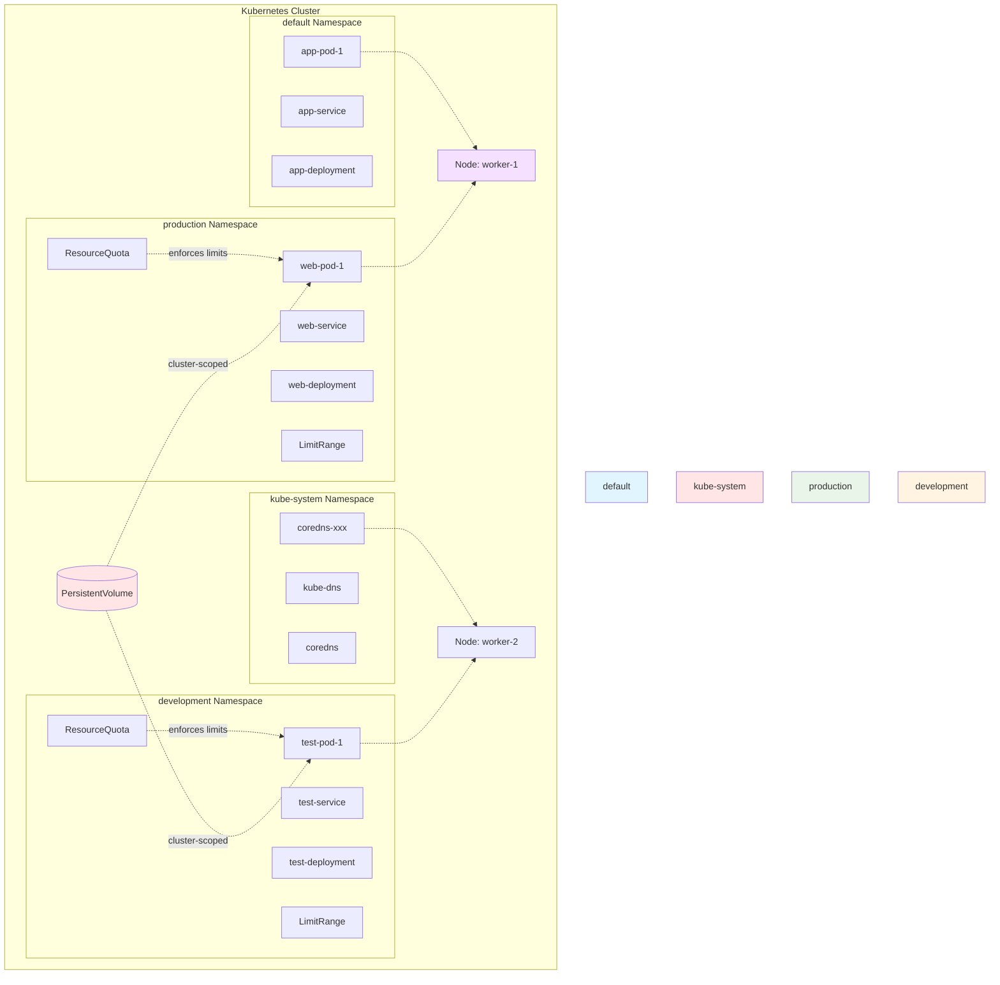
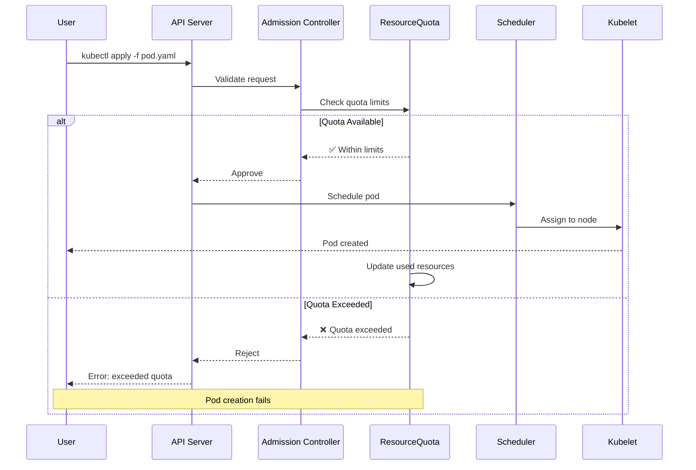
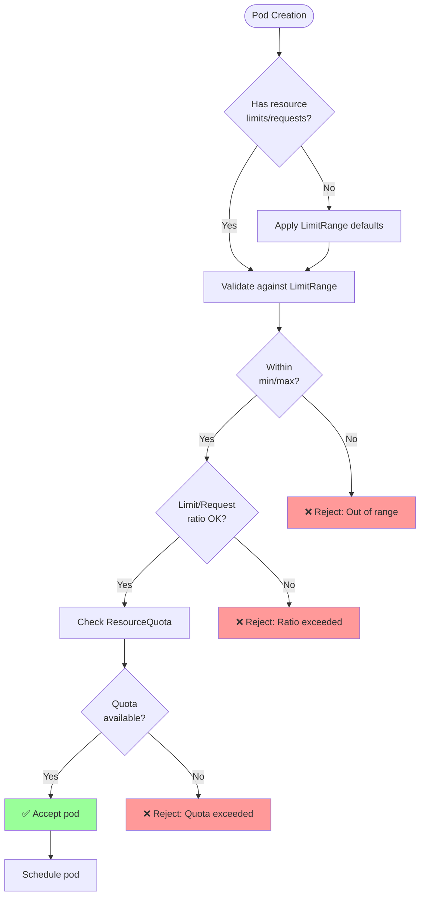
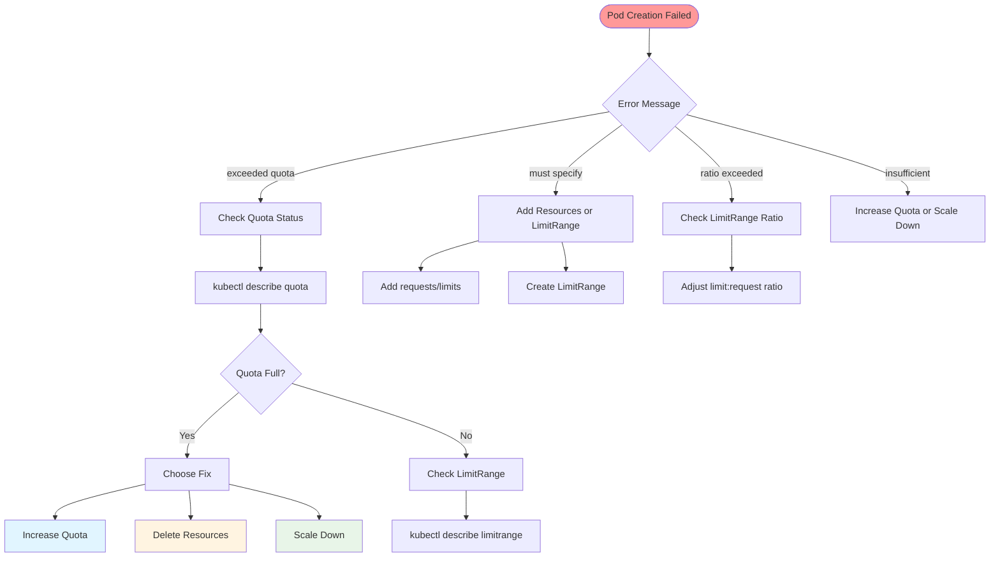
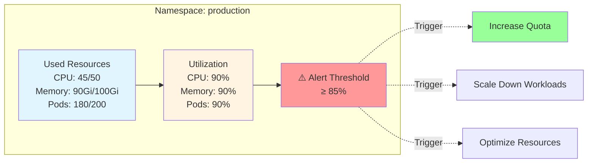

---
date:
  created: 2025-11-11
authors:
  - alf
categories:
  - Kubernetes
  - Infrastructure
tags:
  - kubernetes
  - k8s
  - cka-prep
  - namespaces
  - resource-management
  - quotas
readtime: 11
slug: namespaces-resource-quotas
---

# Kubernetes Namespaces and Resource Quotas

Master namespace isolation and resource management for CKA exam success. Learn how to partition clusters, enforce resource limits, and prevent resource exhaustion in multi-tenant environments.

<!-- more -->

## Overview

Namespaces provide virtual cluster partitioning within a physical Kubernetes cluster, enabling multi-tenancy, resource isolation, and access control. Resource quotas and limit ranges ensure fair resource distribution and prevent resource starvation.

**CKA Exam Domain**: Workloads & Scheduling (15%), Services & Networking (20%)

**Key Insight**: CKA exam scenarios frequently test namespace-aware operations and resource constraint troubleshooting. Understanding namespace scope and quota enforcement is critical for multi-tenant cluster management.

**What You'll Learn**:
- Namespace fundamentals and scope boundaries
- Resource quota design and enforcement
- Limit ranges for default resource constraints
- Multi-tenant isolation strategies
- Troubleshooting resource quota issues
- CKA exam patterns and time-saving workflows

---

## Namespace Fundamentals

### What Are Namespaces?

**Definition**: Namespaces are logical partitions within a Kubernetes cluster that provide scope for resource names and enable resource isolation.

**Core Concepts**:
- Resource names must be unique within a namespace, not across cluster
- Most Kubernetes resources are namespace-scoped (pods, services, deployments)
- Some resources are cluster-scoped (nodes, persistent volumes, namespaces)
- Namespaces enable RBAC policies, network policies, and resource quotas

### Namespace Architecture



### Default Namespaces

Kubernetes creates several namespaces automatically:

| Namespace | Purpose | Default Resources |
|-----------|---------|-------------------|
| **default** | Default namespace for resources without explicit namespace | User workloads |
| **kube-system** | Kubernetes system components | API server, scheduler, controller manager, DNS |
| **kube-public** | Publicly readable resources | Cluster information |
| **kube-node-lease** | Node heartbeat objects for performance | Node lease objects |

---

## Namespace Operations

### Creating Namespaces

**Imperative Method (Fast for CKA)**:
```bash
# Create namespace
kubectl create namespace production
kubectl create ns development  # Short form

# Create with labels
kubectl create namespace staging --dry-run=client -o yaml | \
  kubectl label -f - --local environment=staging -o yaml | \
  kubectl apply -f -
```

**Declarative Method**:
```yaml
# namespace.yaml
apiVersion: v1
kind: Namespace
metadata:
  name: production
  labels:
    environment: production
    team: backend
```

```bash
kubectl apply -f namespace.yaml
```

### Listing and Inspecting Namespaces

```bash
# List all namespaces
kubectl get namespaces
kubectl get ns

# Show labels
kubectl get ns --show-labels

# Describe namespace (shows quota and limits)
kubectl describe namespace production

# Get namespace details in YAML
kubectl get ns production -o yaml
```

### Working with Namespaced Resources

```bash
# Create resources in specific namespace
kubectl run nginx --image=nginx -n production
kubectl create deployment webapp --image=nginx --replicas=3 -n development

# Get resources from specific namespace
kubectl get pods -n production
kubectl get all -n development

# Get resources from all namespaces
kubectl get pods -A
kubectl get pods --all-namespaces

# Set default namespace for current context
kubectl config set-context --current --namespace=production

# Verify current namespace
kubectl config view --minify | grep namespace
```

### Deleting Namespaces

**⚠️ WARNING**: Deleting a namespace deletes ALL resources within it.

```bash
# Delete namespace (deletes all resources)
kubectl delete namespace development

# Delete with confirmation
kubectl delete ns development --force --grace-period=0
```

---

## Resource Quotas

Resource quotas provide constraints that limit aggregate resource consumption per namespace, preventing resource exhaustion and ensuring fair allocation.

### ResourceQuota Types

**Compute Resource Quotas**:
- `requests.cpu` - Sum of CPU requests
- `requests.memory` - Sum of memory requests
- `limits.cpu` - Sum of CPU limits
- `limits.memory` - Sum of memory limits
- `requests.storage` - Sum of storage requests

**Object Count Quotas**:
- `count/pods` - Maximum pod count
- `count/services` - Maximum service count
- `count/configmaps` - Maximum ConfigMap count
- `count/secrets` - Maximum secret count
- `count/persistentvolumeclaims` - Maximum PVC count
- `count/deployments.apps` - Maximum deployment count
- `count/replicasets.apps` - Maximum ReplicaSet count

**Storage Class Quotas**:
- `<storage-class-name>.storageclass.storage.k8s.io/requests.storage`
- `<storage-class-name>.storageclass.storage.k8s.io/persistentvolumeclaims`

### Creating Resource Quotas

**Basic Compute Quota**:
```yaml
# quota-compute.yaml
apiVersion: v1
kind: ResourceQuota
metadata:
  name: compute-quota
  namespace: production
spec:
  hard:
    requests.cpu: "10"           # Max 10 CPU cores requested
    requests.memory: 20Gi        # Max 20Gi memory requested
    limits.cpu: "20"             # Max 20 CPU cores limit
    limits.memory: 40Gi          # Max 40Gi memory limit
```

```bash
kubectl apply -f quota-compute.yaml
```

**Object Count Quota**:
```yaml
# quota-objects.yaml
apiVersion: v1
kind: ResourceQuota
metadata:
  name: object-quota
  namespace: production
spec:
  hard:
    count/pods: "100"
    count/services: "50"
    count/configmaps: "20"
    count/secrets: "30"
    count/persistentvolumeclaims: "10"
    count/deployments.apps: "30"
    count/replicasets.apps: "50"
```

**Combined Quota (CKA Exam Pattern)**:
```yaml
# quota-comprehensive.yaml
apiVersion: v1
kind: ResourceQuota
metadata:
  name: production-quota
  namespace: production
spec:
  hard:
    # Compute resources
    requests.cpu: "50"
    requests.memory: 100Gi
    limits.cpu: "100"
    limits.memory: 200Gi

    # Storage
    requests.storage: 500Gi
    persistentvolumeclaims: "20"

    # Object counts
    count/pods: "200"
    count/services: "50"
    count/configmaps: "50"
    count/secrets: "50"

    # Workloads
    count/deployments.apps: "50"
    count/statefulsets.apps: "10"
    count/jobs.batch: "20"
```

### Checking Quota Usage

```bash
# View quota details
kubectl get resourcequota -n production
kubectl describe resourcequota production-quota -n production

# Output shows:
# Name:                   production-quota
# Namespace:              production
# Resource                Used    Hard
# --------                ----    ----
# requests.cpu            5       50
# requests.memory         10Gi    100Gi
# limits.cpu              10      100
# limits.memory           20Gi    200Gi
# count/pods              15      200

# Get quota in YAML format
kubectl get quota production-quota -n production -o yaml
```

### ResourceQuota Enforcement Flow



---

## Limit Ranges

LimitRange objects set default resource requests/limits and enforce min/max constraints for containers and pods within a namespace.

### LimitRange Components

**Container-Level Constraints**:
- `defaultRequest` - Default resource requests if not specified
- `default` - Default resource limits if not specified
- `min` - Minimum allowed resource values
- `max` - Maximum allowed resource values
- `maxLimitRequestRatio` - Max ratio of limit to request

**Pod-Level Constraints**:
- Total resource consumption across all containers

### Creating Limit Ranges

**Container Defaults and Constraints**:
```yaml
# limitrange-container.yaml
apiVersion: v1
kind: LimitRange
metadata:
  name: container-limits
  namespace: production
spec:
  limits:
  - type: Container
    default:                      # Default limits
      cpu: 500m
      memory: 512Mi
    defaultRequest:               # Default requests
      cpu: 100m
      memory: 128Mi
    min:                          # Minimum allowed
      cpu: 50m
      memory: 64Mi
    max:                          # Maximum allowed
      cpu: 2
      memory: 2Gi
    maxLimitRequestRatio:         # Max limit/request ratio
      cpu: 4
      memory: 4
```

**Pod-Level Constraints**:
```yaml
# limitrange-pod.yaml
apiVersion: v1
kind: LimitRange
metadata:
  name: pod-limits
  namespace: production
spec:
  limits:
  - type: Pod
    max:
      cpu: "4"
      memory: 8Gi
    min:
      cpu: 100m
      memory: 128Mi
```

**PersistentVolumeClaim Constraints**:
```yaml
# limitrange-pvc.yaml
apiVersion: v1
kind: LimitRange
metadata:
  name: pvc-limits
  namespace: production
spec:
  limits:
  - type: PersistentVolumeClaim
    max:
      storage: 100Gi
    min:
      storage: 1Gi
```

### Checking Limit Ranges

```bash
# View limit ranges
kubectl get limitrange -n production
kubectl describe limitrange container-limits -n production

# Output shows:
# Name:       container-limits
# Namespace:  production
# Type        Resource  Min   Max   Default Request  Default Limit  Max Limit/Request Ratio
# ----        --------  ---   ---   ---------------  -------------  -----------------------
# Container   cpu       50m   2     100m             500m           4
# Container   memory    64Mi  2Gi   128Mi            512Mi          4
```

### LimitRange Application Flow



---

## Multi-Tenant Resource Management

### Design Patterns

**Pattern 1: Environment-Based Namespaces**
```yaml
# production namespace - Strict quotas
apiVersion: v1
kind: Namespace
metadata:
  name: production
  labels:
    environment: production
---
apiVersion: v1
kind: ResourceQuota
metadata:
  name: production-quota
  namespace: production
spec:
  hard:
    requests.cpu: "100"
    requests.memory: 200Gi
    limits.cpu: "200"
    limits.memory: 400Gi
    count/pods: "500"
```

```yaml
# development namespace - Relaxed quotas
apiVersion: v1
kind: Namespace
metadata:
  name: development
  labels:
    environment: development
---
apiVersion: v1
kind: ResourceQuota
metadata:
  name: development-quota
  namespace: development
spec:
  hard:
    requests.cpu: "20"
    requests.memory: 40Gi
    limits.cpu: "40"
    limits.memory: 80Gi
    count/pods: "100"
```

**Pattern 2: Team-Based Namespaces**
```yaml
# backend-team namespace
apiVersion: v1
kind: Namespace
metadata:
  name: backend-team
  labels:
    team: backend
    cost-center: "1234"
---
apiVersion: v1
kind: ResourceQuota
metadata:
  name: backend-quota
  namespace: backend-team
spec:
  hard:
    requests.cpu: "50"
    requests.memory: 100Gi
    count/deployments.apps: "30"
```

**Pattern 3: Application-Based Namespaces**
```yaml
# ecommerce-app namespace
apiVersion: v1
kind: Namespace
metadata:
  name: ecommerce-app
  labels:
    app: ecommerce
    tier: frontend
---
apiVersion: v1
kind: ResourceQuota
metadata:
  name: ecommerce-quota
  namespace: ecommerce-app
spec:
  hard:
    requests.cpu: "30"
    requests.memory: 60Gi
    count/services: "20"
    count/configmaps: "30"
```

### Quota Scope Selectors

**Priority Class-Based Quotas**:
```yaml
# quota-high-priority.yaml
apiVersion: v1
kind: ResourceQuota
metadata:
  name: high-priority-quota
  namespace: production
spec:
  hard:
    requests.cpu: "50"
    requests.memory: 100Gi
    count/pods: "100"
  scopeSelector:
    matchExpressions:
    - operator: In
      scopeName: PriorityClass
      values:
      - high-priority
```

**BestEffort/NotBestEffort Quotas**:
```yaml
# quota-besteffort.yaml
apiVersion: v1
kind: ResourceQuota
metadata:
  name: besteffort-quota
  namespace: production
spec:
  hard:
    count/pods: "10"  # Limit BestEffort pods
  scopes:
  - BestEffort
---
# quota-guaranteed.yaml
apiVersion: v1
kind: ResourceQuota
metadata:
  name: guaranteed-quota
  namespace: production
spec:
  hard:
    requests.cpu: "80"
    requests.memory: 160Gi
  scopes:
  - NotBestEffort
```

---

## Troubleshooting Quota Issues

### Common Error Scenarios

**Error 1: Insufficient Quota**
```bash
# Error message:
# Error from server (Forbidden): pods "nginx" is forbidden:
# exceeded quota: production-quota, requested: requests.cpu=1,requests.memory=1Gi,
# used: requests.cpu=49,requests.memory=99Gi,
# limited: requests.cpu=50,requests.memory=100Gi
```

**Diagnosis and Fix**:
```bash
# 1. Check current quota usage
kubectl describe quota production-quota -n production

# 2. Identify resource hogs
kubectl top pods -n production --sort-by=cpu
kubectl top pods -n production --sort-by=memory

# 3. Options:
# Option A: Increase quota
kubectl edit quota production-quota -n production

# Option B: Scale down workloads
kubectl scale deployment high-cpu-app --replicas=2 -n production

# Option C: Delete unused resources
kubectl get pods -n production --field-selector=status.phase=Succeeded -o name | \
  xargs kubectl delete -n production
```

**Error 2: Missing Resource Requests**
```bash
# Error message:
# Error from server (Forbidden): pods "nginx" is forbidden:
# failed quota: production-quota: must specify requests.cpu,requests.memory
```

**Diagnosis and Fix**:
```bash
# When ResourceQuota exists, ALL pods must specify requests/limits
# Option A: Add requests/limits to pod
kubectl run nginx --image=nginx -n production \
  --requests='cpu=100m,memory=128Mi' \
  --limits='cpu=200m,memory=256Mi'

# Option B: Create LimitRange to provide defaults
cat <<EOF | kubectl apply -f -
apiVersion: v1
kind: LimitRange
metadata:
  name: default-limits
  namespace: production
spec:
  limits:
  - type: Container
    defaultRequest:
      cpu: 100m
      memory: 128Mi
    default:
      cpu: 200m
      memory: 256Mi
EOF
```

**Error 3: Limit/Request Ratio Exceeded**
```bash
# Error message:
# Error from server (Forbidden): pods "nginx" is forbidden:
# maximum cpu limit to request ratio per Container is 4, but provided ratio is 10.000000
```

**Diagnosis and Fix**:
```bash
# Check LimitRange constraints
kubectl describe limitrange -n production

# Fix: Adjust pod resources to meet ratio
# If request=100m and maxLimitRequestRatio=4, then limit cannot exceed 400m
kubectl run nginx --image=nginx -n production \
  --requests='cpu=100m' \
  --limits='cpu=400m'  # 4:1 ratio
```

### Debugging Workflow



---

## CKA Exam Scenarios

### Scenario 1: Create Namespace with Quota

**Task**: Create namespace 'webapp' with quota: max 10 pods, 5 CPU cores, 10Gi memory.

**Solution**:
```bash
# Create namespace
kubectl create namespace webapp

# Create quota (imperative)
kubectl create quota webapp-quota \
  --hard=count/pods=10,requests.cpu=5,requests.memory=10Gi \
  -n webapp

# Verify
kubectl describe quota webapp-quota -n webapp
```

**Alternative (Declarative)**:
```yaml
cat <<EOF | kubectl apply -f -
apiVersion: v1
kind: Namespace
metadata:
  name: webapp
---
apiVersion: v1
kind: ResourceQuota
metadata:
  name: webapp-quota
  namespace: webapp
spec:
  hard:
    count/pods: "10"
    requests.cpu: "5"
    requests.memory: 10Gi
EOF
```

### Scenario 2: Create Pod in Quota-Constrained Namespace

**Task**: Create nginx pod in namespace with quota requiring resource specifications.

**Solution**:
```bash
# Generate pod YAML with resources
kubectl run nginx --image=nginx -n webapp \
  --requests='cpu=100m,memory=128Mi' \
  --limits='cpu=200m,memory=256Mi' \
  --dry-run=client -o yaml > pod.yaml

# Apply
kubectl apply -f pod.yaml

# Verify quota usage
kubectl describe quota -n webapp
```

### Scenario 3: Troubleshoot Quota Exceeded Error

**Task**: Deployment fails to scale due to quota. Identify issue and fix.

**Solution**:
```bash
# 1. Check error
kubectl get events -n webapp --sort-by='.lastTimestamp'

# 2. Check quota usage
kubectl describe quota -n webapp
# Shows: requests.cpu used=4.8/5, requests.memory used=9.5Gi/10Gi

# 3. Identify resource usage
kubectl top pods -n webapp --sort-by=cpu
kubectl top pods -n webapp --sort-by=memory

# 4. Fix - Option A: Delete completed pods
kubectl delete pod --field-selector=status.phase=Succeeded -n webapp

# 4. Fix - Option B: Increase quota
kubectl edit quota webapp-quota -n webapp
# Increase limits

# 5. Verify
kubectl describe quota -n webapp
```

### Scenario 4: Set Default Resource Constraints

**Task**: Create LimitRange in 'development' namespace with defaults: cpu=100m/200m, memory=128Mi/256Mi.

**Solution**:
```bash
cat <<EOF | kubectl apply -f -
apiVersion: v1
kind: LimitRange
metadata:
  name: dev-limits
  namespace: development
spec:
  limits:
  - type: Container
    defaultRequest:
      cpu: 100m
      memory: 128Mi
    default:
      cpu: 200m
      memory: 256Mi
    min:
      cpu: 50m
      memory: 64Mi
    max:
      cpu: 1
      memory: 1Gi
EOF

# Verify
kubectl describe limitrange dev-limits -n development

# Test - create pod without resources (should get defaults)
kubectl run test --image=nginx -n development
kubectl get pod test -n development -o yaml | grep -A 10 resources:
```

### Scenario 5: Multi-Namespace Resource Isolation

**Task**: Create 3 namespaces (prod, staging, dev) with appropriate quotas.

**Solution**:
```yaml
cat <<EOF | kubectl apply -f -
# Production - Strict quotas
apiVersion: v1
kind: Namespace
metadata:
  name: prod
  labels:
    environment: production
---
apiVersion: v1
kind: ResourceQuota
metadata:
  name: prod-quota
  namespace: prod
spec:
  hard:
    requests.cpu: "100"
    requests.memory: 200Gi
    limits.cpu: "200"
    limits.memory: 400Gi
    count/pods: "500"
    count/services: "100"
---
# Staging - Moderate quotas
apiVersion: v1
kind: Namespace
metadata:
  name: staging
  labels:
    environment: staging
---
apiVersion: v1
kind: ResourceQuota
metadata:
  name: staging-quota
  namespace: staging
spec:
  hard:
    requests.cpu: "50"
    requests.memory: 100Gi
    limits.cpu: "100"
    limits.memory: 200Gi
    count/pods: "250"
---
# Development - Relaxed quotas
apiVersion: v1
kind: Namespace
metadata:
  name: dev
  labels:
    environment: development
---
apiVersion: v1
kind: ResourceQuota
metadata:
  name: dev-quota
  namespace: dev
spec:
  hard:
    requests.cpu: "20"
    requests.memory: 40Gi
    limits.cpu: "40"
    limits.memory: 80Gi
    count/pods: "100"
EOF

# Verify all quotas
kubectl get quota -A
kubectl describe quota -n prod
kubectl describe quota -n staging
kubectl describe quota -n dev
```

---

## Best Practices

### Namespace Design

✅ **DO**:
- Use namespaces to separate environments (prod, staging, dev)
- Use namespaces for team isolation (backend-team, frontend-team)
- Use namespaces for application isolation (app-a, app-b)
- Apply labels to namespaces for organization
- Document namespace ownership and purpose

❌ **DON'T**:
- Use namespaces for version separation (use labels instead)
- Create excessive granularity (1 namespace per microservice)
- Rely solely on namespaces for security (combine with RBAC, NetworkPolicy)
- Use special characters in namespace names

### Resource Quota Design

✅ **DO**:
- Set both requests and limits quotas
- Include object count quotas to prevent resource proliferation
- Monitor quota usage regularly
- Set quotas based on measured usage patterns
- Use quota scope selectors for fine-grained control

❌ **DON'T**:
- Set quotas too tight (causes frequent failures)
- Set quotas too loose (defeats the purpose)
- Forget to account for system pods in kube-system
- Ignore quota usage metrics

### LimitRange Design

✅ **DO**:
- Always create LimitRange when using ResourceQuota
- Set reasonable defaults for requests and limits
- Enforce min/max constraints to prevent extremes
- Set maxLimitRequestRatio to prevent wasteful overcommit
- Document LimitRange rationale

❌ **DON'T**:
- Set defaults too high (wastes resources)
- Set defaults too low (causes performance issues)
- Set maxLimitRequestRatio too strict (prevents legitimate use cases)
- Forget to test LimitRange impact on existing workloads

---

## Monitoring and Metrics

### Quota Usage Monitoring

```bash
# Check all quotas in cluster
kubectl get quota -A

# Monitor specific namespace quota
kubectl describe quota -n production

# Watch quota usage
kubectl get quota -n production -w

# Get quota usage metrics
kubectl get quota -n production -o json | \
  jq '.items[].status.used'

# Custom columns for quota overview
kubectl get quota -A -o custom-columns=\
NAMESPACE:.metadata.namespace,\
NAME:.metadata.name,\
CPU_USED:.status.used.\'requests\.cpu\',\
CPU_HARD:.status.hard.\'requests\.cpu\',\
MEM_USED:.status.used.\'requests\.memory\',\
MEM_HARD:.status.hard.\'requests\.memory\'
```

### Quota Utilization Metrics



---

## Practice Exercises

### Exercise 1: Basic Namespace and Quota (10 minutes)

**Tasks**:
1. Create namespace 'test-ns'
2. Create ResourceQuota limiting to 5 pods, 2 CPU, 4Gi memory
3. Create 3 nginx pods with appropriate resources
4. Verify quota usage
5. Try creating 3 more pods (should fail)
6. Delete namespace

**Solution**:
```bash
# 1. Create namespace
kubectl create ns test-ns

# 2. Create quota
kubectl create quota test-quota \
  --hard=count/pods=5,requests.cpu=2,requests.memory=4Gi \
  -n test-ns

# 3. Create pods
for i in {1..3}; do
  kubectl run nginx-$i --image=nginx \
    --requests='cpu=200m,memory=512Mi' \
    --limits='cpu=400m,memory=1Gi' \
    -n test-ns
done

# 4. Check quota
kubectl describe quota test-quota -n test-ns

# 5. Try more pods (will fail after 2 more)
kubectl run nginx-4 --image=nginx \
  --requests='cpu=200m,memory=512Mi' -n test-ns

# 6. Cleanup
kubectl delete ns test-ns
```

### Exercise 2: LimitRange Configuration (15 minutes)

**Tasks**:
1. Create namespace 'limit-test'
2. Create LimitRange with defaults and constraints
3. Create pod without resources (should get defaults)
4. Create pod with resources exceeding max (should fail)
5. Verify defaults applied

**Solution**:
```bash
# 1. Create namespace
kubectl create ns limit-test

# 2. Create LimitRange
cat <<EOF | kubectl apply -f -
apiVersion: v1
kind: LimitRange
metadata:
  name: limit-test-range
  namespace: limit-test
spec:
  limits:
  - type: Container
    defaultRequest:
      cpu: 100m
      memory: 128Mi
    default:
      cpu: 200m
      memory: 256Mi
    min:
      cpu: 50m
      memory: 64Mi
    max:
      cpu: 1
      memory: 1Gi
    maxLimitRequestRatio:
      cpu: 4
      memory: 4
EOF

# 3. Create pod without resources
kubectl run test1 --image=nginx -n limit-test

# Check applied defaults
kubectl get pod test1 -n limit-test -o yaml | grep -A 10 resources:

# 4. Try exceeding max (should fail)
kubectl run test2 --image=nginx \
  --requests='cpu=2' -n limit-test
# Error: maximum cpu usage per Container is 1, but limit is 2

# 5. Cleanup
kubectl delete ns limit-test
```

### Exercise 3: Quota Troubleshooting (20 minutes)

**Tasks**:
1. Create namespace with tight quota (2 pods max)
2. Create deployment with 5 replicas
3. Observe only 2 pods created
4. Diagnose and fix by increasing quota
5. Verify all 5 pods running

**Solution**:
```bash
# 1. Create namespace and quota
kubectl create ns tight-quota
kubectl create quota tight-quota \
  --hard=count/pods=2,requests.cpu=1,requests.memory=1Gi \
  -n tight-quota

# 2. Create deployment
kubectl create deployment webapp --image=nginx --replicas=5 -n tight-quota

# 3. Check pods (only 2 created)
kubectl get pods -n tight-quota
kubectl get rs -n tight-quota

# View ReplicaSet events
kubectl describe rs -n tight-quota
# Shows: exceeded quota

# 4. Diagnose
kubectl describe quota tight-quota -n tight-quota
# Shows: count/pods: 2/2

# Fix - increase quota
kubectl patch quota tight-quota -n tight-quota \
  --type='json' \
  -p='[{"op": "replace", "path": "/spec/hard/count~1pods", "value":"10"}]'

# Or edit directly
kubectl edit quota tight-quota -n tight-quota

# 5. Verify
kubectl get pods -n tight-quota
# Should now show 5/5 pods running

# Cleanup
kubectl delete ns tight-quota
```

---

## Quick Reference

### Namespace Commands

```bash
# Create
kubectl create namespace <name>
kubectl create ns <name>

# List
kubectl get namespaces
kubectl get ns

# Describe
kubectl describe namespace <name>

# Delete
kubectl delete namespace <name>

# Set default for context
kubectl config set-context --current --namespace=<name>
```

### ResourceQuota Commands

```bash
# Create quota
kubectl create quota <name> --hard=<key>=<value> -n <namespace>

# List quotas
kubectl get quota -n <namespace>
kubectl get quota -A

# Describe quota
kubectl describe quota <name> -n <namespace>

# Edit quota
kubectl edit quota <name> -n <namespace>

# Delete quota
kubectl delete quota <name> -n <namespace>
```

### LimitRange Commands

```bash
# Create from file
kubectl apply -f limitrange.yaml

# List limit ranges
kubectl get limitrange -n <namespace>
kubectl get limits -n <namespace>

# Describe
kubectl describe limitrange <name> -n <namespace>

# Delete
kubectl delete limitrange <name> -n <namespace>
```

### Common Quota Keys

```yaml
# Compute resources
requests.cpu
requests.memory
limits.cpu
limits.memory

# Storage
requests.storage
persistentvolumeclaims

# Object counts
count/pods
count/services
count/configmaps
count/secrets
count/deployments.apps
count/replicasets.apps
count/statefulsets.apps
count/jobs.batch
count/cronjobs.batch
```

---

## Key Takeaways

✅ **Namespaces provide logical isolation** - Not physical security boundaries

✅ **ResourceQuotas enforce aggregate limits** - Prevent resource exhaustion per namespace

✅ **LimitRange provides defaults and constraints** - Essential when using quotas

✅ **Always specify resource requests/limits** - When quotas are active, required for admission

✅ **Monitor quota usage proactively** - Avoid runtime failures from quota exhaustion

✅ **Combine quota scopes for flexibility** - PriorityClass, BestEffort filters for fine-grained control

✅ **Delete namespace deletes all resources** - Exercise caution with `kubectl delete ns`

✅ **Exam context switching is critical** - Always verify namespace before operations

✅ **Troubleshoot with describe** - `kubectl describe quota/limitrange` shows usage and constraints

✅ **Plan quota capacity** - Base on measured usage plus growth buffer

---

## Next Steps

After mastering namespaces and resource quotas, continue with:

**[Post 6: Services and Networking](../services-networking/)** - Service discovery and cluster networking

---

**Related Posts**:
- [kubectl Essentials](../kubectl-essentials/) - Command-line mastery for Kubernetes
- [Kubernetes Architecture Fundamentals](../kubernetes-architecture-fundamentals/) - Understanding cluster components
- [Kubernetes CKA Mastery - Complete Learning Path](../../kubernetes/) - Full exam preparation series

**External Resources**:
- [Namespaces Official Documentation](https://kubernetes.io/docs/concepts/overview/working-with-objects/namespaces/)
- [Resource Quotas](https://kubernetes.io/docs/concepts/policy/resource-quotas/)
- [Limit Ranges](https://kubernetes.io/docs/concepts/policy/limit-range/)
- [Configure Default CPU/Memory Requests and Limits](https://kubernetes.io/docs/tasks/administer-cluster/manage-resources/memory-default-namespace/)
- [CKA Exam Curriculum](https://github.com/cncf/curriculum)
