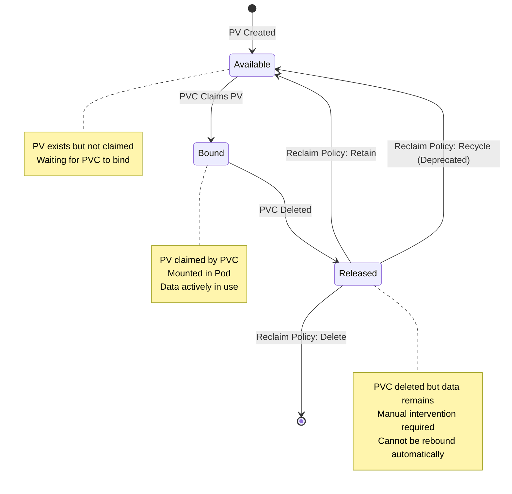
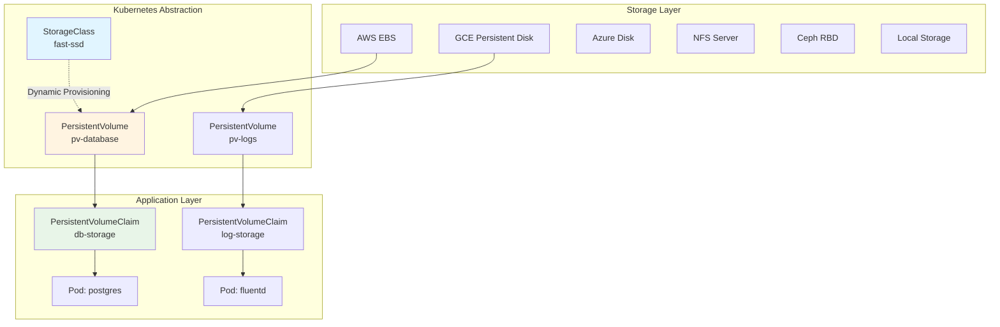
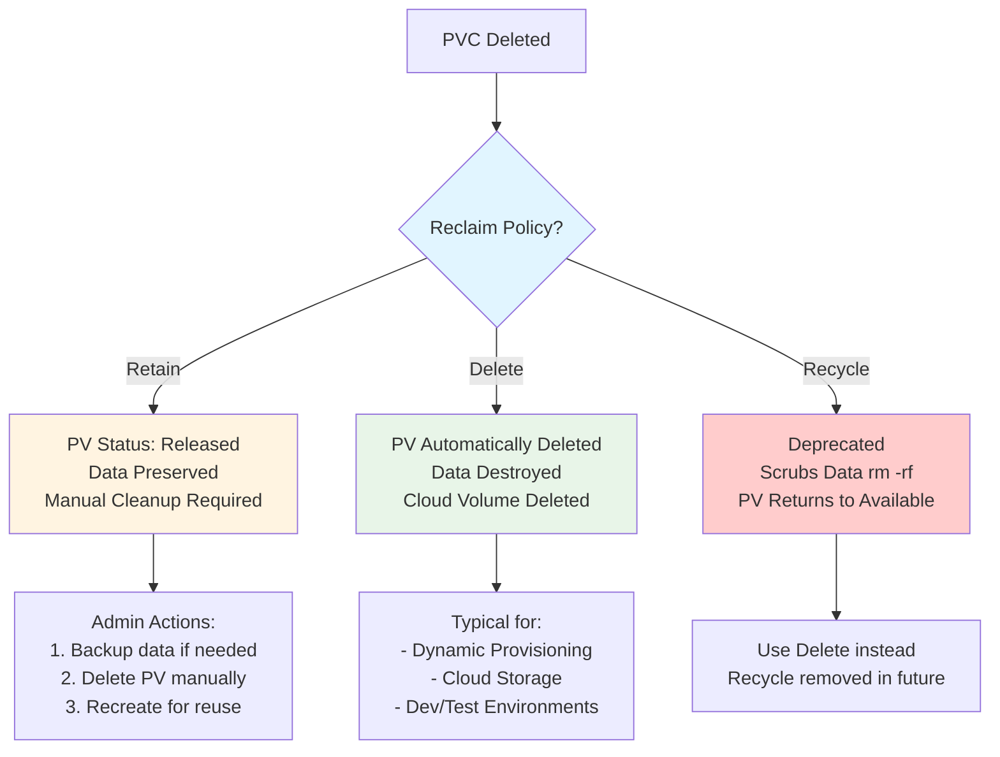
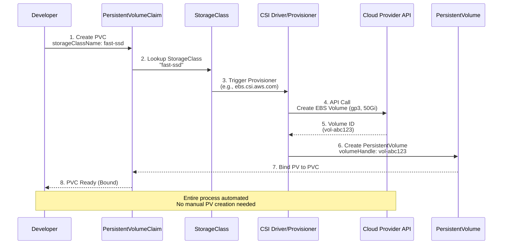

---
date:
  created: 2025-11-11
authors:
  - alf
categories:
  - Kubernetes
  - Storage
tags:
  - kubernetes
  - k8s
  - cka-prep
  - storage
  - persistent-volumes
  - stateful
readtime: 13
slug: persistent-volumes-claims-stateful-storage
---

# Persistent Volumes and Claims: Stateful Storage

Kubernetes excels at managing stateless applications, but production reality demands stateful workloads—databases, message queues, file storage systems. PersistentVolumes (PV) and PersistentVolumeClaims (PVC) provide the abstraction layer that makes stateful storage portable, durable, and manageable across cluster infrastructure. For the CKA exam, mastering storage represents 10% of your score and is essential for real-world Kubernetes administration.

The storage model in Kubernetes separates **provisioning** (administrator responsibility via PV) from **consumption** (developer responsibility via PVC). This decoupling enables platform teams to standardize storage offerings through StorageClasses while application teams request storage without infrastructure knowledge. Understanding the PV lifecycle—binding, mounting, releasing, and reclaiming—is critical for both exam success and production troubleshooting.

Modern Kubernetes storage leverages the **Container Storage Interface (CSI)**, which replaced legacy in-tree volume plugins. CSI drivers from AWS, Google Cloud, Azure, NetApp, and others provide production-grade dynamic provisioning. The 2025 Kubernetes landscape includes ReadWriteOncePod access mode (v1.29+), enhanced volume expansion capabilities, and topology-aware scheduling via WaitForFirstConsumer binding mode.

<!-- more -->

## The PersistentVolume Lifecycle

Understanding the PV lifecycle is fundamental to storage operations and troubleshooting:



**Lifecycle States Explained**:

- **Available**: PV created by admin, waiting for PVC to claim it
- **Bound**: PVC successfully claimed PV (exclusive 1:1 relationship)
- **Released**: PVC deleted but PV retains data (manual cleanup needed)
- **Failed**: Automatic reclamation failed (requires admin intervention)

The key insight: **PV and PVC have a 1:1 binding relationship**. Once bound, no other PVC can claim that PV until it's released and reclaimed.

## PersistentVolume Architecture



**Static Provisioning** (Manual PV Creation):
```bash
# Admin creates PV manually
kubectl apply -f pv-database.yaml

# Developer creates PVC (automatically binds)
kubectl apply -f pvc-database.yaml
```

**Dynamic Provisioning** (Automated via StorageClass):
```bash
# Developer only creates PVC referencing StorageClass
kubectl apply -f pvc-database.yaml

# Kubernetes automatically provisions PV via CSI driver
```

## Creating PersistentVolumes (Static Provisioning)

### Basic PV with NFS

```yaml
apiVersion: v1
kind: PersistentVolume
metadata:
  name: pv-nfs-web
spec:
  capacity:
    storage: 10Gi
  accessModes:
    - ReadWriteMany
  persistentVolumeReclaimPolicy: Retain
  storageClassName: nfs-storage
  mountOptions:
    - hard
    - nfsvers=4.1
  nfs:
    path: /exports/web
    server: 192.168.1.100
```

**Key Fields**:
- `capacity.storage`: Size of volume (cannot be reduced)
- `accessModes`: How pods can access (see Access Modes section)
- `persistentVolumeReclaimPolicy`: What happens when PVC is deleted
- `storageClassName`: Groups PVs for PVC matching
- `nfs`: Backend storage specification (CSI preferred for new deployments)

### PV with Local Storage (Node-Specific)

```yaml
apiVersion: v1
kind: PersistentVolume
metadata:
  name: pv-local-ssd
spec:
  capacity:
    storage: 100Gi
  accessModes:
    - ReadWriteOnce
  persistentVolumeReclaimPolicy: Delete
  storageClassName: local-storage
  local:
    path: /mnt/disks/ssd1
  nodeAffinity:
    required:
      nodeSelectorTerms:
        - matchExpressions:
            - key: kubernetes.io/hostname
              operator: In
              values:
                - node-01
```

**Local Volume Critical Points**:
- Requires `nodeAffinity` (PV tied to specific node)
- Pod scheduled to node with PV (not portable)
- High performance (no network overhead)
- No replication (data loss if node fails)

### Creating PVs via kubectl

```bash
# Create PV from YAML
kubectl apply -f pv-database.yaml

# List all PVs
kubectl get pv

# Detailed PV information
kubectl describe pv pv-database

# Watch PV status changes
kubectl get pv -w

# Check PV capacity and reclaim policy
kubectl get pv -o custom-columns=NAME:.metadata.name,CAPACITY:.spec.capacity.storage,RECLAIM:.spec.persistentVolumeReclaimPolicy,STATUS:.status.phase
```

## Creating PersistentVolumeClaims

### Basic PVC (Binds to Existing PV)

```yaml
apiVersion: v1
kind: PersistentVolumeClaim
metadata:
  name: pvc-postgres
  namespace: production
spec:
  accessModes:
    - ReadWriteOnce
  storageClassName: nfs-storage
  resources:
    requests:
      storage: 10Gi
```

**PVC Matching Logic**:
1. **StorageClass** must match (or both empty)
2. **AccessModes** must be compatible
3. **Capacity** request ≤ PV capacity
4. **Selectors** (if specified) must match PV labels

### PVC with Label Selector

```yaml
apiVersion: v1
kind: PersistentVolumeClaim
metadata:
  name: pvc-mysql
spec:
  accessModes:
    - ReadWriteOnce
  resources:
    requests:
      storage: 50Gi
  storageClassName: fast-ssd
  selector:
    matchLabels:
      environment: production
      tier: database
    matchExpressions:
      - key: performance
        operator: In
        values: [high, ultra]
```

### Managing PVCs

```bash
# Create PVC
kubectl apply -f pvc-database.yaml

# List PVCs in namespace
kubectl get pvc -n production

# Check PVC binding status
kubectl get pvc pvc-postgres

# Describe PVC (shows bound PV)
kubectl describe pvc pvc-postgres

# Delete PVC (releases PV)
kubectl delete pvc pvc-postgres

# Check which PV is bound to PVC
kubectl get pvc pvc-postgres -o jsonpath='{.spec.volumeName}'
```

## Access Modes Explained

```mermaid
graph LR
    subgraph "Access Modes"
        RWO[ReadWriteOnce<br/>RWO]
        ROX[ReadOnlyMany<br/>ROX]
        RWX[ReadWriteMany<br/>RWX]
        RWOP[ReadWriteOncePod<br/>RWOP<br/><i>v1.29+</i>]
    end

    subgraph "RWO: Single Node"
        RWO --> Node1[Node]
        Node1 --> Pod1[Pod 1]
        Node1 --> Pod2[Pod 2]
    end

    subgraph "ROX: Multiple Nodes Read"
        ROX --> NodeA[Node A]
        ROX --> NodeB[Node B]
        NodeA --> PodA[Pod - Read Only]
        NodeB --> PodB[Pod - Read Only]
    end

    subgraph "RWX: Multiple Nodes Write"
        RWX --> NodeX[Node X]
        RWX --> NodeY[Node Y]
        NodeX --> PodX[Pod - Read/Write]
        NodeY --> PodY[Pod - Read/Write]
    end

    subgraph "RWOP: Single Pod"
        RWOP --> SingleNode[Node]
        SingleNode --> OnlyPod[Single Pod Only]
        SingleNode -.x.- Blocked[Other Pods Blocked]
    end

    style RWO fill:#e1f5ff
    style RWOP fill:#fff4e1
    style RWX fill:#e8f5e8
    style ROX fill:#f3e5f5
```

| Access Mode | Abbreviation | Description | Use Cases |
|-------------|--------------|-------------|-----------|
| **ReadWriteOnce** | RWO | Volume mounted read-write by single **node** (multiple pods on same node OK) | Databases, block storage, most workloads |
| **ReadOnlyMany** | ROX | Volume mounted read-only by **multiple nodes** | Shared configuration, static assets |
| **ReadWriteMany** | RWX | Volume mounted read-write by **multiple nodes** | Shared file systems (NFS, CephFS, GlusterFS) |
| **ReadWriteOncePod** | RWOP | Volume mounted read-write by **single pod** (strictest) | High-security databases, data isolation requirements |

**Volume Type Support Matrix**:

| Storage Type | RWO | ROX | RWX | RWOP |
|--------------|-----|-----|-----|------|
| AWS EBS | ✅ | ❌ | ❌ | ✅ |
| GCE PD | ✅ | ✅ | ❌ | ✅ |
| Azure Disk | ✅ | ❌ | ❌ | ✅ |
| NFS | ✅ | ✅ | ✅ | ✅ |
| CephFS | ✅ | ✅ | ✅ | ✅ |
| Local Volume | ✅ | ❌ | ❌ | ✅ |

## Reclaim Policies



**Reclaim Policy Comparison**:

| Policy | Behavior | PV State After PVC Delete | Use Case |
|--------|----------|---------------------------|----------|
| **Retain** | Preserves data, requires manual cleanup | Released (cannot auto-bind) | Production databases, manual backup workflows |
| **Delete** | Automatically deletes PV and storage | PV deleted, data destroyed | Dynamic provisioning, ephemeral storage |
| **Recycle** | ⚠️ Deprecated | (Do not use) | Replaced by dynamic provisioning |

```bash
# Change reclaim policy on existing PV
kubectl patch pv pv-database -p '{"spec":{"persistentVolumeReclaimPolicy":"Retain"}}'

# Verify reclaim policy change
kubectl get pv pv-database -o jsonpath='{.spec.persistentVolumeReclaimPolicy}'
```

## StorageClass and Dynamic Provisioning



### AWS EBS CSI StorageClass

```yaml
apiVersion: storage.k8s.io/v1
kind: StorageClass
metadata:
  name: fast-ssd
provisioner: ebs.csi.aws.com
parameters:
  type: gp3              # General Purpose SSD v3
  iops: "3000"           # Provisioned IOPS
  throughput: "125"      # MB/s
  encrypted: "true"      # Encrypt at rest
  kmsKeyId: arn:aws:kms:us-east-1:123456789012:key/abcd-1234
volumeBindingMode: WaitForFirstConsumer  # Topology-aware
allowVolumeExpansion: true
reclaimPolicy: Delete
```

### Google Cloud Persistent Disk CSI

```yaml
apiVersion: storage.k8s.io/v1
kind: StorageClass
metadata:
  name: pd-balanced
provisioner: pd.csi.storage.gke.io
parameters:
  type: pd-balanced      # Balanced performance/cost
  replication-type: regional-pd  # Multi-zone replication
volumeBindingMode: WaitForFirstConsumer
allowVolumeExpansion: true
reclaimPolicy: Delete
```

### NFS Dynamic Provisioning

```yaml
apiVersion: storage.k8s.io/v1
kind: StorageClass
metadata:
  name: nfs-client
provisioner: nfs.csi.k8s.io
parameters:
  server: 192.168.1.100
  share: /exports/dynamic
  mountOptions: "nfsvers=4.1,hard"
volumeBindingMode: Immediate
allowVolumeExpansion: false
reclaimPolicy: Retain
mountOptions:
  - hard
  - nfsvers=4.1
```

**StorageClass Key Fields**:
- `provisioner`: CSI driver name (e.g., ebs.csi.aws.com)
- `parameters`: Provisioner-specific settings (type, IOPS, encryption)
- `volumeBindingMode`: When to provision (Immediate vs WaitForFirstConsumer)
- `allowVolumeExpansion`: Enable PVC size increases
- `reclaimPolicy`: Default policy for dynamically provisioned PVs
- `mountOptions`: Mount flags applied to volumes

```bash
# List StorageClasses
kubectl get storageclasses
kubectl get sc

# Describe StorageClass
kubectl describe sc fast-ssd

# Set default StorageClass
kubectl patch storageclass fast-ssd -p '{"metadata": {"annotations":{"storageclass.kubernetes.io/is-default-class":"true"}}}'

# Remove default annotation
kubectl patch storageclass fast-ssd -p '{"metadata": {"annotations":{"storageclass.kubernetes.io/is-default-class":"false"}}}'

# Check which StorageClass is default
kubectl get sc -o jsonpath='{.items[?(@.metadata.annotations.storageclass\.kubernetes\.io/is-default-class=="true")].metadata.name}'
```

## Volume Binding Modes

```mermaid
graph TB
    subgraph "Immediate Binding"
        PVC1[PVC Created]
        PVC1 --> Provision1[Volume Provisioned<br/>Immediately]
        Provision1 --> Zone1[Random Zone Selected]
        Zone1 --> Bind1[PV Created & Bound]
        Bind1 --> Schedule1[Pod Scheduled Later]
        Schedule1 -.->|Problem| Mismatch1[Pod may land in<br/>different zone than volume]
    end

    subgraph "WaitForFirstConsumer"
        PVC2[PVC Created]
        PVC2 --> Pending[PVC Status: Pending]
        Pending --> Pod2[Pod Created<br/>References PVC]
        Pod2 --> Scheduler[Scheduler Picks Node]
        Scheduler --> Topology[Check Node Topology<br/>Zone, Region]
        Topology --> ProvisionHere[Provision Volume<br/>in Same Zone as Node]
        ProvisionHere --> Bind2[PV Created & Bound]
        Bind2 --> Mount[Pod Starts<br/>Volume Attached]
    end

    style Immediate Binding fill:#ffcccc
    style WaitForFirstConsumer fill:#ccffcc
    style Mismatch1 fill:#ff9999
```



**Immediate** (Legacy Default):
- Volume provisioned as soon as PVC created
- Pod may be scheduled to different zone/region
- Risk: Volume and Pod in incompatible locations
- Use case: Single-zone clusters, latency-insensitive workloads

**WaitForFirstConsumer** (Recommended):
- Volume provisioned only after Pod scheduled
- Ensures volume created in same topology as Pod
- Prevents zone mismatch issues
- Use case: Multi-zone clusters, topology-aware applications

```yaml
# PVC with WaitForFirstConsumer
apiVersion: v1
kind: PersistentVolumeClaim
metadata:
  name: pvc-topology-aware
spec:
  accessModes:
    - ReadWriteOnce
  storageClassName: fast-ssd  # Must have volumeBindingMode: WaitForFirstConsumer
  resources:
    requests:
      storage: 10Gi
```

## Volume Expansion

```bash
# Check if StorageClass allows expansion
kubectl get sc fast-ssd -o jsonpath='{.allowVolumeExpansion}'

# Edit PVC to request more storage
kubectl edit pvc pvc-database

# Modify spec.resources.requests.storage from 10Gi to 20Gi
# Save and exit

# Watch PVC for resize completion
kubectl get pvc pvc-database -w

# Check PVC conditions for expansion status
kubectl describe pvc pvc-database | grep -A 5 Conditions

# Some volume types require pod restart for filesystem expansion
kubectl rollout restart deployment myapp
```

**Volume Expansion Requirements**:
1. StorageClass must have `allowVolumeExpansion: true`
2. CSI driver must support volume expansion
3. **Cannot shrink volumes** (only expand)
4. Some filesystems require pod restart (XFS, Ext4 online resize supported)

## Using PVCs in Pods

```yaml
apiVersion: v1
kind: Pod
metadata:
  name: postgres
spec:
  containers:
    - name: postgres
      image: postgres:16
      volumeMounts:
        - name: db-storage
          mountPath: /var/lib/postgresql/data
          subPath: postgres  # Important: Avoids mounting to lost+found
      env:
        - name: POSTGRES_PASSWORD
          valueFrom:
            secretKeyRef:
              name: db-secret
              key: password
  volumes:
    - name: db-storage
      persistentVolumeClaim:
        claimName: pvc-postgres
```

**subPath Use Cases**:
- Avoid mounting root of volume (e.g., lost+found directory)
- Multiple containers sharing same PVC with different subdirectories
- Prevents volume root permissions conflicts

## Troubleshooting Storage Issues

### PVC Stuck in Pending

```bash
# Check PVC status and events
kubectl describe pvc pvc-database

# Common causes and solutions:
# 1. No matching PV available
kubectl get pv | grep Available

# 2. StorageClass doesn't exist
kubectl get sc

# 3. Insufficient capacity
kubectl get pv -o custom-columns=NAME:.metadata.name,CAPACITY:.spec.capacity.storage

# 4. Access mode mismatch
kubectl get pv pv-name -o jsonpath='{.spec.accessModes}'

# 5. Dynamic provisioning failing (check provisioner logs)
kubectl logs -n kube-system -l app=ebs-csi-controller
```

### PV/PVC Binding Issues

```bash
# Check PV → PVC binding
kubectl get pv -o custom-columns=NAME:.metadata.name,STATUS:.status.phase,CLAIM:.spec.claimRef.name

# Check PVC → PV binding
kubectl get pvc -o custom-columns=NAME:.metadata.name,STATUS:.status.phase,VOLUME:.spec.volumeName

# Force rebinding (edit PV claimRef)
kubectl edit pv pv-database

# Remove claimRef section to unbind
# Then PVC can claim it again
```

### Volume Mount Failures in Pods

```bash
# Check pod events for mount errors
kubectl describe pod postgres | grep -A 10 Events

# Common errors:
# - "Volume not found" → PVC deleted or doesn't exist
# - "Multi-Attach error" → RWO volume already attached to different node
# - "Permission denied" → Filesystem permissions issue

# Check if volume attached to node
kubectl get volumeattachment

# Debug mount on node (requires node access)
ssh node-01
sudo mount | grep pvc
```

### Orphaned Volumes

```bash
# Find Released PVs (orphaned)
kubectl get pv | grep Released

# Option 1: Delete PV (if data not needed)
kubectl delete pv pv-database

# Option 2: Retain data and recreate PV
# 1. Backup data
# 2. Delete Released PV
kubectl delete pv pv-old
# 3. Create new PV pointing to same storage
kubectl apply -f pv-recreated.yaml
```

## CKA Exam Practice Exercises

### Exercise 1: Static Provisioning with NFS

**Task**: Create a PersistentVolume named `pv-web` with 5Gi capacity using NFS storage at `192.168.1.100:/exports/web`. Then create a PersistentVolumeClaim named `pvc-web` that binds to this PV. Deploy an nginx pod that mounts this PVC at `/usr/share/nginx/html`.

<details>
<summary>Solution</summary>

```bash
# Create PV
cat <<EOF | kubectl apply -f -
apiVersion: v1
kind: PersistentVolume
metadata:
  name: pv-web
spec:
  capacity:
    storage: 5Gi
  accessModes:
    - ReadWriteMany
  persistentVolumeReclaimPolicy: Retain
  storageClassName: nfs
  nfs:
    path: /exports/web
    server: 192.168.1.100
EOF

# Create PVC
cat <<EOF | kubectl apply -f -
apiVersion: v1
kind: PersistentVolumeClaim
metadata:
  name: pvc-web
spec:
  accessModes:
    - ReadWriteMany
  storageClassName: nfs
  resources:
    requests:
      storage: 5Gi
EOF

# Verify binding
kubectl get pv,pvc

# Create nginx pod
cat <<EOF | kubectl apply -f -
apiVersion: v1
kind: Pod
metadata:
  name: nginx-web
spec:
  containers:
    - name: nginx
      image: nginx:1.25
      volumeMounts:
        - name: web-storage
          mountPath: /usr/share/nginx/html
  volumes:
    - name: web-storage
      persistentVolumeClaim:
        claimName: pvc-web
EOF

# Verify pod running
kubectl get pod nginx-web
```
</details>

### Exercise 2: Dynamic Provisioning with StorageClass

**Task**: Create a StorageClass named `fast-storage` using your cluster's CSI provisioner. Configure it with `WaitForFirstConsumer` volume binding mode and enable volume expansion. Create a PVC requesting 10Gi using this StorageClass, then deploy a MySQL StatefulSet using the PVC.

<details>
<summary>Solution</summary>

```bash
# Create StorageClass (adjust provisioner for your cluster)
cat <<EOF | kubectl apply -f -
apiVersion: storage.k8s.io/v1
kind: StorageClass
metadata:
  name: fast-storage
provisioner: ebs.csi.aws.com  # Use your cluster's provisioner
volumeBindingMode: WaitForFirstConsumer
allowVolumeExpansion: true
reclaimPolicy: Delete
parameters:
  type: gp3
EOF

# Create PVC
cat <<EOF | kubectl apply -f -
apiVersion: v1
kind: PersistentVolumeClaim
metadata:
  name: mysql-pvc
spec:
  accessModes:
    - ReadWriteOnce
  storageClassName: fast-storage
  resources:
    requests:
      storage: 10Gi
EOF

# Create MySQL pod
cat <<EOF | kubectl apply -f -
apiVersion: v1
kind: Pod
metadata:
  name: mysql
spec:
  containers:
    - name: mysql
      image: mysql:8.0
      env:
        - name: MYSQL_ROOT_PASSWORD
          value: "test123"
      volumeMounts:
        - name: mysql-storage
          mountPath: /var/lib/mysql
          subPath: mysql
  volumes:
    - name: mysql-storage
      persistentVolumeClaim:
        claimName: mysql-pvc
EOF

# Check PVC bound after pod scheduled
kubectl get pvc mysql-pvc
```
</details>

### Exercise 3: Volume Expansion

**Task**: Expand the `mysql-pvc` from exercise 2 from 10Gi to 20Gi. Verify the expansion completed successfully.

<details>
<summary>Solution</summary>

```bash
# Edit PVC to increase size
kubectl patch pvc mysql-pvc -p '{"spec":{"resources":{"requests":{"storage":"20Gi"}}}}'

# Watch for completion
kubectl get pvc mysql-pvc -w

# Check PVC conditions
kubectl describe pvc mysql-pvc | grep -A 10 Conditions

# Verify expanded size
kubectl get pvc mysql-pvc -o jsonpath='{.status.capacity.storage}'

# Some filesystems require pod restart
kubectl delete pod mysql
# Pod will restart and filesystem expansion will complete
```
</details>

### Exercise 4: Troubleshoot Pending PVC

**Task**: A PVC named `broken-pvc` in the `default` namespace has been stuck in Pending state for 5 minutes. Investigate and fix the issue.

<details>
<summary>Solution</summary>

```bash
# Describe PVC to see events
kubectl describe pvc broken-pvc

# Check if StorageClass exists
SC=$(kubectl get pvc broken-pvc -o jsonpath='{.spec.storageClassName}')
kubectl get sc $SC

# Check for available PVs
kubectl get pv | grep Available

# Check PVC access modes
kubectl get pvc broken-pvc -o jsonpath='{.spec.accessModes}'

# Check capacity request
kubectl get pvc broken-pvc -o jsonpath='{.spec.resources.requests.storage}'

# Common fixes:
# 1. If StorageClass missing:
#    - Create missing StorageClass or use existing one

# 2. If no matching PV:
#    - Create PV with matching specs or enable dynamic provisioning

# 3. If dynamic provisioning failing:
#    - Check provisioner logs
kubectl logs -n kube-system -l app=<provisioner-name>
```
</details>

### Exercise 5: Change Reclaim Policy

**Task**: You have a PV named `pv-important` with reclaim policy `Delete`. Change it to `Retain` to prevent data loss when the PVC is deleted. Verify the change.

<details>
<summary>Solution</summary>

```bash
# Check current reclaim policy
kubectl get pv pv-important -o jsonpath='{.spec.persistentVolumeReclaimPolicy}'

# Patch PV to change reclaim policy
kubectl patch pv pv-important -p '{"spec":{"persistentVolumeReclaimPolicy":"Retain"}}'

# Verify change
kubectl get pv pv-important -o jsonpath='{.spec.persistentVolumeReclaimPolicy}'

# Now when PVC is deleted, PV will move to Released state instead of being deleted
```
</details>

## Quick Reference

### Essential kubectl Commands

```bash
# PersistentVolumes
kubectl get pv                                    # List all PVs
kubectl describe pv <pv-name>                     # Describe PV
kubectl delete pv <pv-name>                       # Delete PV
kubectl patch pv <pv-name> -p <json-patch>       # Patch PV

# PersistentVolumeClaims
kubectl get pvc                                   # List PVCs in current namespace
kubectl get pvc -A                                # List PVCs across all namespaces
kubectl describe pvc <pvc-name>                   # Describe PVC
kubectl delete pvc <pvc-name>                     # Delete PVC

# StorageClasses
kubectl get sc                                    # List StorageClasses
kubectl describe sc <sc-name>                     # Describe StorageClass
kubectl get sc <sc-name> -o yaml                 # Get StorageClass YAML

# Troubleshooting
kubectl get events --sort-by='.lastTimestamp'    # Recent cluster events
kubectl get volumeattachment                      # Check volume attachments
kubectl get pv,pvc                               # Show PVs and PVCs together
```

### Access Modes Quick Reference

```bash
RWO  # ReadWriteOnce     - Single node read-write
ROX  # ReadOnlyMany      - Multiple nodes read-only
RWX  # ReadWriteMany     - Multiple nodes read-write
RWOP # ReadWriteOncePod  - Single pod exclusive (v1.29+)
```

## Related Posts

- **[ConfigMaps, Secrets, and Volume Mounts](../blog/2025/11/11/configmaps-secrets-volume-mounts/)** - Configuration management and secrets storage
- **[Kubernetes Pods: The Atomic Unit](../blog/2025/11/11/kubernetes-pods-atomic-unit/)** - Understanding pod volume mounts
- **[Deployments, ReplicaSets, and Rolling Updates](../blog/2025/11/11/kubernetes-deployments-replicasets/)** - StatefulSets for persistent storage

---

**CKA Exam Domain**: Storage (10%)
**Key Skills**: PV/PVC creation, dynamic provisioning, troubleshooting storage issues
**Production Focus**: StorageClass design, reclaim policies, backup strategies
