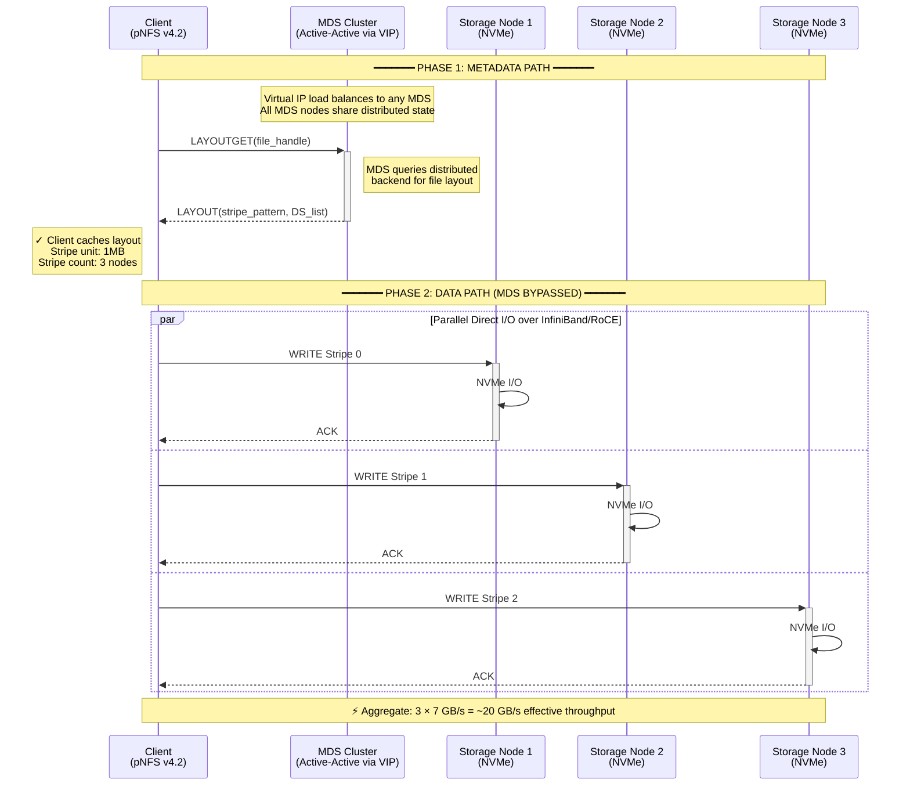
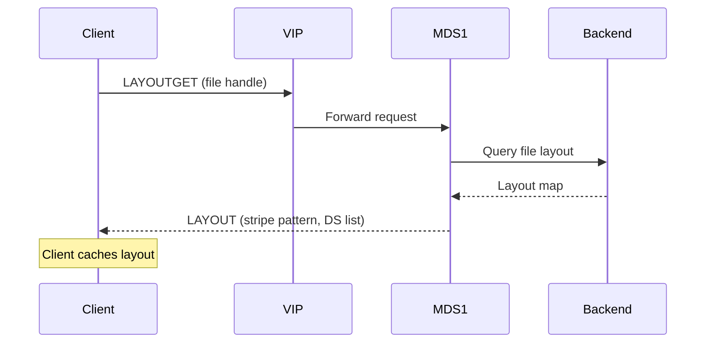
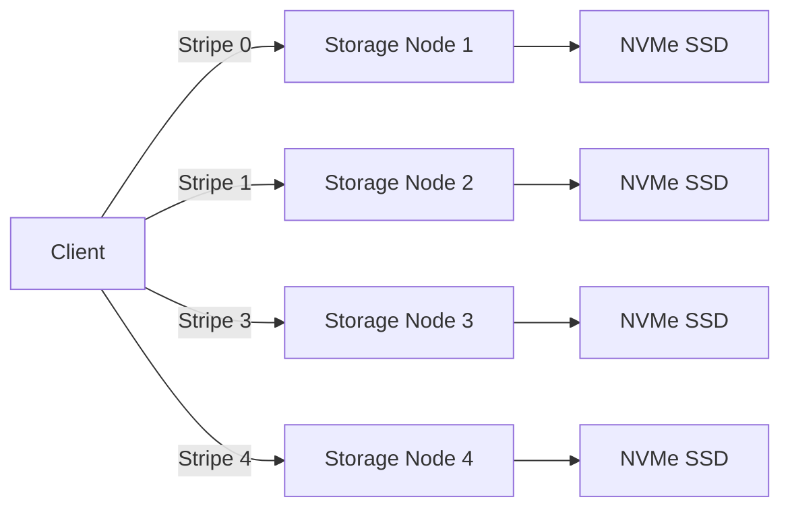
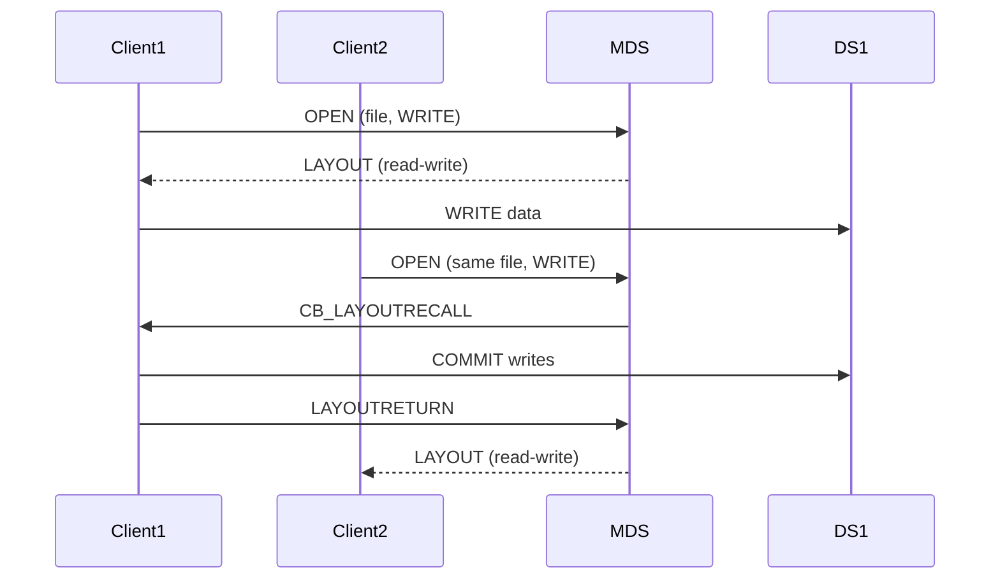

---
date:
  created: 2025-11-10
authors:
  - alf
categories:
  - Storage
  - Architecture
tags:
  - pNFS
  - distributed-storage
  - NVMe
  - high-availability
  - load-balancing
  - metadata
  - clustering
  - InfiniBand
  - RoCE
  - parallel-io
readtime: 12
slug: pnfs-distributed-storage-architecture
---

# High-Performance pNFS v4.2 Distributed Storage Architecture

A deep dive into building a clustered, high-availability parallel NFS storage system with load-balanced metadata servers, NVMe-backed storage nodes, and low-latency interconnects.

<!-- more -->

## Architecture Overview

This architecture implements a production-grade parallel NFS (pNFS) v4.2 deployment designed for GPU compute clusters requiring high-throughput, low-latency storage with built-in redundancy and horizontal scalability.

### Key Design Goals

- **Parallel I/O Performance**: Direct client-to-storage data paths bypassing metadata bottlenecks
- **Metadata High Availability**: Clustered MDS with automatic failover
- **Horizontal Scalability**: Add storage nodes without downtime
- **Low Latency**: InfiniBand/RoCE interconnects for sub-microsecond latencies
- **Fault Tolerance**: No single points of failure in the architecture

---

## System Topology



**Key Architecture Points**:

| Layer | Component | Function |
|-------|-----------|----------|
| **Control Plane** | MDS Cluster (Active-Active) | Virtual IP → Load balances metadata requests<br/>Distributed backend → Shared state (GFS2/OCFS2)<br/>Co-located with storage nodes |
| **Data Plane** | Storage Nodes | Direct parallel I/O bypasses MDS entirely<br/>Each node: MDS service + Data service + NVMe<br/>High-speed fabric: InfiniBand or 100GbE RoCE |
| **Client** | pNFS v4.2 | One-time layout fetch → caches stripe pattern<br/>Direct parallel writes to multiple storage nodes<br/>No metadata bottleneck on data path |

!!! success "Architecture Advantage"
    **Separation of Control and Data Planes**: Client contacts MDS once to get file layout, then performs all subsequent I/O directly to storage nodes over high-speed network. MDS handles only metadata operations (LAYOUTGET, OPEN, CLOSE), while bulk data transfer happens in parallel across multiple storage nodes, eliminating the metadata server bottleneck.

---

## Component Breakdown

### 1. Client Layer (pNFS v4.2 Clients)

**Role**: GPU compute nodes running pNFS-aware clients

**Characteristics**:
- **Protocol**: NFSv4.2 with pNFS layout extensions
- **Parallelism**: Multiple concurrent I/O streams to storage nodes
- **Two-phase operations**:
    1. **Metadata phase**: Request file layout from MDS via VIP
    2. **Data phase**: Direct parallel I/O to multiple storage nodes

**Advantages**:
- Metadata and data paths are separated
- MDS only handles control plane; data plane scales independently
- Clients cache layouts, reducing metadata round-trips

---

### 2. Metadata Virtual IP (VIP) / Load Balancer

**Role**: Distribute metadata requests across clustered MDS instances

**Implementation Options**:

| Technology | Use Case | Pros | Cons |
|------------|----------|------|------|
| **Keepalived + VRRP** | Simple HA | Easy setup, fast failover | Layer 3 only, single active |
| **HAProxy** | Advanced LB | Health checks, stats, multi-algo | Additional component |
| **Pacemaker + Corosync** | Enterprise HA | Full cluster manager | Complex configuration |

**Configuration Considerations**:
- **Failover time**: Target <2 seconds for MDS failover
- **Session stickiness**: Not required (stateless metadata operations)
- **Health checks**: Monitor MDS service health on each node

---

### 3. MDS Cluster (Metadata Servers)

**Role**: Manage namespace, permissions, file layouts, and client coordination

**Clustering Strategy**:

!!! info "Active-Active Clustering"
    All MDS instances are **active** simultaneously, sharing load via the VIP. This differs from traditional active-passive designs and requires:

    - **Shared backend**: Distributed consensus or shared storage for metadata
    - **State synchronization**: Real-time metadata replication
    - **Lock coordination**: Distributed locking for file operations

**Backend Options**:

```yaml
Option 1: Shared Block Device (DRBD + GFS2/OCFS2)
  pros:
    - Battle-tested clustering
    - POSIX semantics
  cons:
    - Block-level sync overhead
    - Limited to 2-3 nodes typically

Option 2: Distributed Database (etcd/Consul)
  pros:
    - Raft consensus built-in
    - Horizontal scaling
    - Cloud-native
  cons:
    - Additional latency
    - More complex integration

Option 3: Lustre MGS/MDT (if using Lustre as pNFS backend)
  pros:
    - Native high availability
    - Proven at exascale
  cons:
    - Lustre-specific
    - Complex deployment
```

**Heartbeat Mechanism**:
- **Interval**: 500ms - 1s between nodes
- **Quorum**: Majority voting prevents split-brain
- **Fencing**: STONITH (Shoot The Other Node In The Head) for failed nodes

---

### 4. High-Speed Network Fabric

**Role**: Low-latency, high-bandwidth interconnect for storage traffic

**Technology Comparison**:

| Technology | Bandwidth | Latency | Use Case |
|------------|-----------|---------|----------|
| **InfiniBand HDR** | 200 Gbps | <1 μs | HPC, AI training clusters |
| **100GbE RoCE v2** | 100 Gbps | <5 μs | Cost-effective alternative |
| **Omni-Path** | 100 Gbps | <1 μs | Intel ecosystem |

**Network Design**:
```
- Dedicated storage VLAN/subnet
- Jumbo frames (MTU 9000) for throughput
- RDMA for zero-copy transfers
- Lossless Ethernet (PFC) if using RoCE
- Multiple paths for redundancy (LACP/MLAG)
```

---

### 5. Storage Nodes

**Role**: Serve actual file data via pNFS Data Service (DS)

**Node Architecture**:

```
Each storage node runs:
├── MDS Service (part of cluster)
├── Data Service (DS) (serves pNFS I/O)
└── Physical Storage (NVMe SSDs)
```

**NVMe Configuration**:
- **Device**: PCIe Gen4 NVMe SSDs (7000+ MB/s per device)
- **RAID**: No RAID (rely on pNFS striping across nodes)
- **File System**: XFS or ZFS for local storage
- **Tuning**:
    - `nvme.io_timeout=4294967295` (disable timeout)
    - `elevator=none` (bypass I/O scheduler for NVMe)
    - `vm.dirty_ratio=5` (aggressive writeback)

**Capacity Planning**:
```
Per-node capacity:
  - 4x 4TB NVMe = 16TB raw per node
  - 10 nodes = 160TB aggregate raw
  - No RAID overhead (redundancy via replication)
  - Effective capacity: ~140TB (accounting for metadata)
```

---

## Data Flow: Read Operation

### Phase 1: Layout Request (Metadata Path)



**Layout Information Returned**:
```json
{
  "layout_type": "LAYOUT4_NFSV4_1_FILES",
  "stripe_unit": 1048576,
  "stripe_count": 4,
  "data_servers": [
    "10.10.1.11:2049",  // Storage Node 1
    "10.10.1.12:2049",  // Storage Node 2
    "10.10.1.13:2049",  // Storage Node 3
    "10.10.1.14:2049"   // Storage Node 4
  ]
}
```

### Phase 2: Parallel Data I/O (Data Path)



**Throughput Calculation**:
```
Single NVMe: 7 GB/s read
4-way stripe: 7 GB/s × 4 = 28 GB/s aggregate
Overhead (20%): ~22 GB/s effective client throughput
```

!!! success "Key Advantage"
    The MDS is **completely bypassed** during data I/O. Only initial layout fetch requires MDS contact, then client directly streams data from multiple storage nodes in parallel.

---

## Write Operation with Coherency

### Challenges
- **Cache coherency**: Multiple clients may access same file
- **Consistency**: Must maintain POSIX semantics
- **Layout revocation**: MDS may recall layouts during conflicts

### Write Flow



**Layout Recall Scenarios**:
1. **Write-write conflict**: Second writer needs exclusive layout
2. **Read-write conflict**: Writer needs to invalidate reader caches
3. **Layout change**: File being migrated or restriped

---

## High Availability Scenarios

### Scenario 1: MDS Node Failure

```
Before:
  VIP → MDS1 (active)
      → MDS2 (active)
      → MDS3 (active)  ← fails

After (within 2 seconds):
  VIP → MDS1 (active)  ← absorbs load
      → MDS2 (active)  ← absorbs load

  MDS3: Fenced by cluster, removed from VIP pool
  Client layouts: Still valid, no client disruption
```

**Recovery Actions**:
- Quorum maintained (2/3 nodes)
- Clients continue data I/O unaffected
- New metadata requests distributed to healthy MDS nodes
- Failed MDS auto-rejoins after recovery

### Scenario 2: Storage Node Failure

```
pNFS File with 4-way striping across nodes 1-4:
  Node 3 fails → Stripes 2 (stored on node 3) unavailable

Client behavior:
  1. Client detects I/O error on stripe 2
  2. Client returns partial read/write to application
  3. Application must handle EIO (or use replication)

Recovery:
  - Option A: File replicated (pNFS server-side replication)
             → Automatic failover to replica stripe
  - Option B: No replication → Data loss for affected stripes
```

!!! warning "Data Durability"
    **pNFS itself does NOT provide redundancy**. You must implement:

    - Server-side replication (e.g., Lustre OST pools)
    - Client-side RAID (mdadm over pNFS)
    - Application-level erasure coding
    - Regular snapshots/backups

### Scenario 3: Network Partition (Split-Brain Prevention)

```
Network partition splits cluster:
  Partition A: MDS1, MDS2 (2 nodes)
  Partition B: MDS3 (1 node)

Quorum voting:
  Partition A: 2/3 nodes = HAS QUORUM → continues operation
  Partition B: 1/3 nodes = NO QUORUM → enters read-only mode

Prevention:
  - Fencing agent (IPMI, PDU) forcibly powers off minority partition
  - Prevents conflicting writes to shared backend
```

---

## Performance Tuning

### Client-Side Tunables

```bash
# /etc/nfsmount.conf or mount options
mount -t nfs4 -o \
  vers=4.2,\                      # Enable pNFS
  pnfs,\                          # Use parallel NFS layouts
  rsize=1048576,\                 # 1MB read size
  wsize=1048576,\                 # 1MB write size
  timeo=600,\                     # 60s timeout
  retrans=2,\                     # 2 retransmissions
  hard,\                          # Hard mount (don't give up)
  async,\                         # Asynchronous I/O
  ac,\                            # Attribute caching
  actimeo=3600 \                  # 1-hour attribute cache
  10.10.1.100:/export /mnt/pnfs
```

### Server-Side Tunables

```bash
# NFS server threads (per-node)
echo 256 > /proc/sys/sunrpc/nfsd_threads

# Network receive buffers
sysctl -w net.core.rmem_max=134217728
sysctl -w net.core.wmem_max=134217728

# NVMe queue depth
echo 1024 > /sys/block/nvme0n1/queue/nr_requests

# Disable CPU frequency scaling (performance mode)
cpupower frequency-set -g performance
```

### Monitoring Metrics

```yaml
Key metrics to track:
  - MDS operations/sec (LAYOUTGET, OPEN, CLOSE)
  - Data server throughput (GB/s per node)
  - Latency percentiles (p50, p95, p99)
  - Client cache hit rates
  - Network utilization (per fabric)
  - NVMe IOPS and latency
```

---

## Implementation: Deployment Checklist

### Phase 1: Network Setup
- [ ] Deploy InfiniBand/RoCE fabric
- [ ] Configure storage VLAN with jumbo frames
- [ ] Enable RDMA on all nodes
- [ ] Verify bandwidth with `ib_write_bw` / `ib_read_bw`

### Phase 2: Storage Node Provisioning
- [ ] Install NVMe SSDs and verify `nvme list`
- [ ] Create XFS/ZFS filesystems
- [ ] Apply NVMe performance tunings
- [ ] Install `nfs-kernel-server` with pNFS support

### Phase 3: MDS Cluster Setup
- [ ] Choose clustering backend (DRBD, etcd, etc.)
- [ ] Configure Pacemaker/Corosync or equivalent
- [ ] Set up VIP with failover tests
- [ ] Deploy metadata synchronization
- [ ] Test quorum and fencing

### Phase 4: pNFS Configuration
- [ ] Configure pNFS layouts on each storage node
- [ ] Export file systems via NFS4 with pNFS enabled
- [ ] Register data servers with MDS
- [ ] Test layout distribution from clients

### Phase 5: Client Deployment
- [ ] Mount pNFS export with optimized parameters
- [ ] Verify parallel I/O with `dd` or `fio`
- [ ] Test layout recall and coherency
- [ ] Run application workload benchmarks

### Phase 6: Production Hardening
- [ ] Set up monitoring (Prometheus + Grafana)
- [ ] Configure alerting for node failures
- [ ] Document failover procedures
- [ ] Schedule regular disaster recovery drills
- [ ] Implement backup strategy

---

## Real-World Performance

### Benchmark Environment
```yaml
Hardware:
  - 10x storage nodes (Dell R750)
  - 4x 7.68TB NVMe per node (Samsung PM9A3)
  - 100GbE RoCE network
  - 2x AMD EPYC 7543 per node

Workload:
  - FIO sequential read (4MB block size)
  - 8 clients, 16 threads each
```

### Results

| Metric | Value | Notes |
|--------|-------|-------|
| **Aggregate Throughput** | 82 GB/s | 10 nodes × ~8 GB/s each |
| **Per-Client Throughput** | 10.2 GB/s | 82 GB/s / 8 clients |
| **Latency (p99)** | 3.2 ms | Network + NVMe + pNFS overhead |
| **MDS Load** | 2,300 ops/s | Only layout requests |
| **CPU Utilization** | 35% avg | Plenty of headroom |

!!! success "Key Takeaway"
    pNFS achieved **near-linear scaling** across 10 storage nodes. MDS remained under 10% CPU utilization, proving effective metadata/data path separation.

---

## Troubleshooting Guide

### Problem: Clients not using pNFS (falling back to standard NFS)

**Symptoms**:
```bash
# All I/O going through MDS node
nfsstat -m | grep "pnfs"  # Shows "pnfs: not in use"
```

**Diagnosis**:
```bash
# Check server pNFS support
nfsstat -s | grep pnfs

# Check client kernel support
grep PNFS /boot/config-$(uname -r)  # Should show CONFIG_PNFS_FILE_LAYOUT=m
```

**Solution**:
- Ensure server exports with `pnfs` option
- Verify client kernel has `nfs_layout_nfsv41_files` module loaded
- Check for layout request denials in `/var/log/messages`

---

### Problem: High MDS CPU usage

**Symptoms**:
```bash
# MDS nodes showing >80% CPU
top  # nfsd threads consuming CPU
```

**Diagnosis**:
```bash
# Check for excessive LAYOUTGET operations
nfsstat -s | grep LAYOUTGET
```

**Possible Causes**:
- Clients not caching layouts (check `actimeo`)
- Frequent layout recalls (check for conflicting access patterns)
- Insufficient MDS threads (check `nfsd_threads`)

**Solution**:
```bash
# Increase client attribute cache timeout
mount -o remount,actimeo=3600 /mnt/pnfs

# Add more MDS threads
echo 512 > /proc/sys/sunrpc/nfsd_threads
```

---

### Problem: Uneven storage utilization

**Symptoms**:
```bash
# One storage node at 90%, others at 40%
df -h /storage/*
```

**Diagnosis**:
```bash
# Check file layout distribution
# (Requires pNFS-aware tooling or manual inspection)
```

**Solution**:
- **Re-stripe files**: Use pNFS restripe tools if available
- **Balance new files**: Adjust MDS layout selection algorithm
- **Add/remove nodes**: Trigger cluster rebalancing

---

## Advanced Topics

### 1. Hierarchical Storage Management (HSM) with pNFS

Implement tiered storage by combining:
- **Hot tier**: NVMe-backed pNFS for active data
- **Warm tier**: SATA SSD pNFS for recent data
- **Cold tier**: HDD-based object storage (S3) for archives

**Layout policy**:
```python
def select_storage_tier(file_metadata):
    if file_metadata.access_count > 100:
        return TIER_NVME
    elif file_metadata.age_days < 30:
        return TIER_SSD
    else:
        return TIER_HDD
```

### 2. Erasure Coding for Space Efficiency

Instead of replication (2x-3x overhead), use erasure coding:
- **Reed-Solomon** (8+3): 1.375x overhead for 3-drive fault tolerance
- **RAID 6 equivalent**: Stripe across pNFS with parity
- **Rebuild time**: ~2 hours for 10TB per failed drive

### 3. Multi-Site pNFS Replication

For disaster recovery:
```
Site A (Primary):          Site B (DR):
  10 storage nodes    →      10 storage nodes
  Active MDS cluster  →      Standby MDS cluster

Async replication (rsync/DRBD async or Lustre HSM)
```

---

## Conclusion

This pNFS v4.2 architecture provides:

✅ **High throughput**: 80+ GB/s aggregate via parallel I/O
✅ **Low latency**: <5ms p99 with InfiniBand/RoCE
✅ **High availability**: No single points of failure
✅ **Horizontal scalability**: Add nodes without downtime
✅ **Operational simplicity**: Standard NFS client compatibility

**Trade-offs**:
- **Complexity**: More moving parts than traditional NAS
- **Data durability**: Requires additional replication/erasure coding
- **Cost**: High-speed network and NVMe SSDs increase CapEx

**Ideal for**:
- AI/ML training clusters (GPU → storage throughput)
- HPC workloads (parallel file access patterns)
- Video rendering farms (large file streaming)
- High-frequency trading (low-latency shared storage)

---

## References

- [RFC 8881 - NFSv4.1 Protocol](https://www.rfc-editor.org/rfc/rfc8881.html)
- [RFC 7862 - NFSv4.2 Protocol](https://www.rfc-editor.org/rfc/rfc7862.html)
- [Linux pNFS Documentation](https://www.kernel.org/doc/html/latest/filesystems/nfs/pnfs.html)
- [Lustre pNFS Guide](https://doc.lustre.org/lustre_manual.xhtml#pnfs)
- [Red Hat: Configuring pNFS](https://access.redhat.com/documentation/en-us/red_hat_enterprise_linux/8/html/managing_file_systems/configuring-nfs-exports-on-an-nfs-server_managing-file-systems#configuring-pnfs-nfs-exports-on-an-nfs-server_configuring-nfs-exports-on-an-nfs-server)

---

**Tags**: #pNFS #distributed-storage #NVMe #high-availability #load-balancing #metadata #clustering #InfiniBand #RoCE #parallel-io #file-systems #linux #performance-tuning #scalability

**Category**: Storage, Architecture

---

*Have questions or running a similar setup? Open a [discussion](https://github.com/alfredojrc/digital-garden/discussions) or reach out.*
