---
date:
  created: 2025-11-11
authors:
  - alf
categories:
  - Kubernetes
  - Security
tags:
  - kubernetes
  - k8s
  - cka-prep
  - security-contexts
  - security
readtime: 13
slug: security-contexts-pod-security-standards
---

# Security Contexts and Pod Security Standards

**Harden workloads with Linux security mechanisms and enforce cluster-wide security policies**

Security Contexts define privilege and access control settings for Pods and containers, leveraging Linux kernel security features like capabilities, SELinux, AppArmor, and seccomp. Pod Security Standards (PSS) provide a framework for enforcing security best practices across your cluster. For the CKA exam, you'll need to configure SecurityContext fields, apply Pod Security admission policies, troubleshoot permission issues, and understand how privileged workloads differ from restricted ones. This guide covers everything from basic runAsUser configuration to advanced seccomp profiles and cluster-wide policy enforcement.

**CKA Exam Relevance**: Cluster Architecture, Installation & Configuration (25% of exam weight)

<!-- more -->

---

## 📋 What You'll Learn

- **SecurityContext Architecture**: Pod vs Container security settings
- **User and Group Management**: runAsUser, runAsGroup, fsGroup
- **Linux Capabilities**: Fine-grained privilege control beyond root/non-root
- **Privileged Containers**: When and why to use (or avoid) them
- **Read-Only Filesystems**: Immutable container root filesystems
- **SELinux, AppArmor, Seccomp**: Linux kernel security modules
- **Pod Security Standards**: Privileged, Baseline, Restricted policies
- **Pod Security Admission**: Enforcing PSS at namespace level
- **Troubleshooting**: Permission denied errors and policy violations

---

## 🎯 SecurityContext Architecture

SecurityContext can be defined at **two levels**:

1. **PodSecurityContext** (Pod level): Applies to all containers in the Pod
2. **SecurityContext** (Container level): Applies to specific container, overrides Pod settings


### Basic Example

```yaml
apiVersion: v1
kind: Pod
metadata:
  name: security-demo
spec:
  securityContext:              # Pod-level security context
    runAsUser: 1000             # All containers run as UID 1000
    runAsGroup: 3000            # Primary GID 3000
    fsGroup: 2000               # Mounted volumes owned by GID 2000
  containers:
  - name: app
    image: busybox:1.36
    command: ["sh", "-c", "sleep 3600"]
    securityContext:            # Container-level security context
      allowPrivilegeEscalation: false
      readOnlyRootFilesystem: true
```

```bash
# Create and test
kubectl apply -f security-demo.yaml

# Verify user/group IDs
kubectl exec security-demo -- id
# Output: uid=1000 gid=3000 groups=2000

# Verify read-only filesystem
kubectl exec security-demo -- touch /test.txt
# Output: touch: /test.txt: Read-only file system
```

---

## 👤 User and Group Management

### runAsUser and runAsGroup

Control the UID and GID for container processes:

```yaml
apiVersion: v1
kind: Pod
metadata:
  name: user-demo
spec:
  securityContext:
    runAsUser: 1000       # UID for all containers
    runAsGroup: 3000      # Primary GID
    fsGroup: 2000         # Supplementary group for volumes
  containers:
  - name: app
    image: nginx:1.27
    volumeMounts:
    - name: data
      mountPath: /data
  volumes:
  - name: data
    emptyDir: {}
```

```bash
# Verify process ownership
kubectl exec user-demo -- ps aux
# nginx processes run as UID 1000

# Verify file ownership in mounted volume
kubectl exec user-demo -- ls -ld /data
# Output: drwxrwsr-x 2 1000 2000 ... /data
# Directory owned by UID 1000, GID 2000 (fsGroup)
```

### runAsNonRoot

**Enforce non-root execution** (kubelet validates at runtime):

```yaml
apiVersion: v1
kind: Pod
metadata:
  name: nonroot-demo
spec:
  securityContext:
    runAsNonRoot: true    # Require non-root user
    runAsUser: 1000       # Explicit UID (best practice)
  containers:
  - name: app
    image: nginx:1.27
```

**If image defaults to root (UID 0)**:
```bash
kubectl apply -f nonroot-demo.yaml
# Pod created but fails to start

kubectl describe pod nonroot-demo
# Error: container has runAsNonRoot and image will run as root
```

### fsGroup Behavior

**fsGroup** sets the owning GID for mounted volumes:


**fsGroupChangePolicy** (Kubernetes 1.20+):
- `Always`: Change ownership on every mount (default, slower)
- `OnRootMismatch`: Only change if root GID doesn't match fsGroup (faster)

```yaml
securityContext:
  fsGroup: 2000
  fsGroupChangePolicy: "OnRootMismatch"  # Performance optimization
```

---

## 🔑 Linux Capabilities

**Capabilities** provide fine-grained control over privileged operations, avoiding full root access.

### Common Capabilities

| Capability | Description | Use Case |
|------------|-------------|----------|
| **CAP_NET_BIND_SERVICE** | Bind to ports < 1024 | Web servers on port 80/443 |
| **CAP_SYS_TIME** | Modify system clock | NTP services |
| **CAP_NET_ADMIN** | Network configuration | VPN, routing, iptables |
| **CAP_SYS_ADMIN** | Many privileged ops | Avoid (too broad) |
| **CAP_CHOWN** | Change file ownership | File management tools |
| **CAP_DAC_OVERRIDE** | Bypass file permissions | Backup tools |
| **CAP_SETUID/SETGID** | Change UID/GID | su, sudo alternatives |

### Adding and Dropping Capabilities

```yaml
apiVersion: v1
kind: Pod
metadata:
  name: caps-demo
spec:
  containers:
  - name: app
    image: nginx:1.27
    securityContext:
      capabilities:
        add: ["NET_BIND_SERVICE"]   # Allow binding to port 80
        drop: ["ALL"]                # Drop all other capabilities
```

```bash
# Verify capabilities
kubectl exec caps-demo -- cat /proc/1/status | grep Cap
# CapEff: Shows effective capabilities bitmask

# Test binding to privileged port
kubectl exec caps-demo -- nc -l -p 80
# Success with NET_BIND_SERVICE

kubectl exec caps-demo -- nc -l -p 22
# Would fail (no NET_ADMIN for SSH-like operations)
```

### Best Practice: Drop All, Add Specific

```yaml
securityContext:
  capabilities:
    drop: ["ALL"]                           # Start with nothing
    add: ["NET_BIND_SERVICE", "CHOWN"]      # Add only what's needed
```

**Default Capabilities** (without explicit drop):
- CAP_CHOWN, CAP_DAC_OVERRIDE, CAP_FOWNER, CAP_FSETID
- CAP_KILL, CAP_SETGID, CAP_SETUID, CAP_SETPCAP, CAP_SETFCAP
- CAP_NET_BIND_SERVICE, CAP_NET_RAW, CAP_SYS_CHROOT
- CAP_MKNOD, CAP_AUDIT_WRITE

---

## 🔓 Privileged Containers

**Privileged mode** grants nearly all host capabilities (dangerous):

```yaml
apiVersion: v1
kind: Pod
metadata:
  name: privileged-pod
spec:
  containers:
  - name: privileged-container
    image: busybox:1.36
    securityContext:
      privileged: true    # ⚠️ DANGEROUS: Full host access
```

**What privileged: true does**:
- Grants ALL Linux capabilities
- Access to ALL host devices (`/dev/*`)
- Bypasses AppArmor, SELinux, seccomp restrictions
- Can modify kernel settings via `/proc`, `/sys`

**When to use** (very rare):
- Container runtime engines (Docker-in-Docker)
- System-level monitoring (node-problem-detector)
- Device drivers or hardware access
- Debugging (temporarily, never in production)

**CKA Exam**: Avoid privileged containers unless explicitly required.

---

## 📁 Read-Only Root Filesystem

**Immutable containers** prevent runtime modifications:

```yaml
apiVersion: v1
kind: Pod
metadata:
  name: readonly-demo
spec:
  containers:
  - name: app
    image: nginx:1.27
    securityContext:
      readOnlyRootFilesystem: true    # Root FS immutable
    volumeMounts:
    - name: cache
      mountPath: /var/cache/nginx     # Writable tmpfs for nginx cache
    - name: run
      mountPath: /var/run             # Writable tmpfs for nginx PID
  volumes:
  - name: cache
    emptyDir: {}
  - name: run
    emptyDir: {}
```

```bash
# Test immutability
kubectl exec readonly-demo -- touch /tmp/test
# Error: Read-only file system

# Mounted volumes still writable
kubectl exec readonly-demo -- touch /var/cache/nginx/test
# Success
```

**Benefits**:
- Prevents runtime tampering
- Detects misconfigurations (apps writing to root FS)
- Immutable infrastructure pattern

---

## 🔒 allowPrivilegeEscalation

**Prevents setuid binaries from escalating privileges**:

```yaml
securityContext:
  allowPrivilegeEscalation: false   # Block privilege escalation
  runAsNonRoot: true                # Must be non-root to enforce
```

**What it controls**:
- Sets `no_new_privs` flag on Linux processes
- Prevents gaining privileges via setuid/setgid binaries (e.g., `sudo`, `su`)

**Automatic behavior**:
- Defaults to `false` if `runAsNonRoot: true`
- Defaults to `true` if `privileged: true`

```bash
# Test privilege escalation blocking
kubectl exec priv-esc-demo -- sudo id
# Error: sudo: effective uid is not 0
```

---

## 🛡️ Linux Security Modules

### SELinux

**SELinux** (Security-Enhanced Linux) uses labels for mandatory access control:

```yaml
securityContext:
  seLinuxOptions:
    level: "s0:c123,c456"     # Multi-Level Security (MLS) level
    role: "system_r"          # SELinux role
    type: "container_t"       # SELinux type (process domain)
    user: "system_u"          # SELinux user
```

**Common SELinux types for containers**:
- `container_t`: Standard container domain
- `container_init_t`: Init process domain
- `container_kvm_t`: KVM/virtualization domain

```bash
# Verify SELinux context
kubectl exec selinux-demo -- cat /proc/self/attr/current
# Output: system_u:system_r:container_t:s0:c123,c456
```

### AppArmor

**AppArmor** profiles restrict program capabilities:

```yaml
apiVersion: v1
kind: Pod
metadata:
  name: apparmor-demo
  annotations:
    container.apparmor.security.beta.kubernetes.io/app: localhost/k8s-apparmor-example
spec:
  containers:
  - name: app
    image: busybox:1.36
```

**Profile types**:
- `runtime/default`: Default Docker/containerd profile
- `localhost/<profile>`: Custom profile loaded on node
- `unconfined`: No AppArmor restrictions

**Check AppArmor status**:
```bash
# On node
aa-status | grep k8s

# In container
cat /proc/self/attr/current
# Output: k8s-apparmor-example (enforce)
```

### Seccomp

**Seccomp** (Secure Computing Mode) filters system calls:

```yaml
securityContext:
  seccompProfile:
    type: RuntimeDefault        # Use runtime's default profile
    # OR
    type: Localhost
    localhostProfile: profiles/audit.json   # Custom profile on node
```

**Profile types**:
- `RuntimeDefault`: Container runtime's default (recommended)
- `Localhost`: Custom profile at `/var/lib/kubelet/seccomp/<profile>`
- `Unconfined`: No seccomp filtering (not recommended)

**Kubernetes 1.27+**: `RuntimeDefault` is the default seccomp profile.

```bash
# Verify seccomp profile
kubectl exec seccomp-demo -- grep Seccomp /proc/1/status
# Seccomp: 2  (2 = filtering enabled)
```

---

## 📊 Pod Security Standards (PSS)

Kubernetes defines **three security policies** with increasing restrictions:

### 1. Privileged (Unrestricted)

**No restrictions**—allows all workloads:

```yaml
# Everything allowed, including:
securityContext:
  privileged: true
  hostNetwork: true
  hostPID: true
  hostIPC: true
```

**Use cases**: System daemons, CNI plugins, kube-proxy

### 2. Baseline (Minimally Restrictive)

**Prevents known privilege escalations**:

```yaml
# ✅ Allowed
securityContext:
  runAsUser: 1000
  capabilities:
    add: ["NET_BIND_SERVICE"]   # Subset of safe capabilities

# ❌ Prohibited
securityContext:
  privileged: true              # No privileged containers
  hostNetwork: true             # No host networking
  hostPID: true                 # No host PID namespace
  hostIPC: true                 # No host IPC namespace
  hostPath: true                # No hostPath volumes
```

**Baseline restrictions**:
- No privileged containers
- No host namespaces (network, PID, IPC)
- No hostPath volumes
- Limited capabilities (subset allowed)
- SELinux type restrictions

### 3. Restricted (Hardened)

**Best practice security controls** (most restrictive):

```yaml
# ✅ Required configuration
securityContext:
  runAsNonRoot: true                    # Must be non-root
  allowPrivilegeEscalation: false       # No privilege escalation
  capabilities:
    drop: ["ALL"]                       # Drop all capabilities
  seccompProfile:
    type: RuntimeDefault                # Seccomp required
```

**Restricted requirements**:
- Must run as non-root (`runAsNonRoot: true`)
- Drop ALL capabilities
- No privilege escalation
- Read-only root filesystem (recommended)
- Seccomp profile required (`RuntimeDefault` or custom)
- Limited volume types (no hostPath, no `*`)

### PSS Comparison Table

| Requirement | Privileged | Baseline | Restricted |
|-------------|------------|----------|------------|
| **Privileged containers** | ✅ Allowed | ❌ Forbidden | ❌ Forbidden |
| **Host namespaces** | ✅ Allowed | ❌ Forbidden | ❌ Forbidden |
| **hostPath volumes** | ✅ Allowed | ❌ Forbidden | ❌ Forbidden |
| **runAsNonRoot** | Optional | Optional | ✅ Required |
| **Capabilities** | All allowed | Subset allowed | ❌ Must drop ALL |
| **allowPrivilegeEscalation** | Allowed | Allowed | ❌ Must be false |
| **Seccomp** | Optional | Optional | ✅ RuntimeDefault required |
| **Read-only root FS** | Optional | Optional | Recommended |

---

## 🏛️ Pod Security Admission

**Pod Security Admission** enforces PSS policies at the namespace level (Kubernetes 1.23+).

### Enforcement Modes

Three modes control policy enforcement:

| Mode | Behavior | Use Case |
|------|----------|----------|
| **enforce** | Reject non-compliant Pods | Production enforcement |
| **audit** | Allow but log violations | Monitoring compliance |
| **warn** | Allow but show warnings | Developer feedback |

### Applying PSS to Namespaces

```bash
# Enforce baseline, warn/audit for restricted
kubectl label namespace my-namespace \
  pod-security.kubernetes.io/enforce=baseline \
  pod-security.kubernetes.io/enforce-version=latest \
  pod-security.kubernetes.io/warn=restricted \
  pod-security.kubernetes.io/warn-version=latest \
  pod-security.kubernetes.io/audit=restricted \
  pod-security.kubernetes.io/audit-version=latest

# View applied labels
kubectl get namespace my-namespace --show-labels

# Check namespace PSS config
kubectl describe namespace my-namespace
```



```mermaid
graph TD
    Pod[Pod Creation Request]

    Pod --> Enforce{Enforce Mode<br/>baseline}

    Enforce -->|Compliant| Warn{Warn Mode<br/>restricted}
    Enforce -->|Violation| Reject[❌ Pod Rejected]

    Warn -->|Compliant| Audit{Audit Mode<br/>restricted}
    Warn -->|Violation| WarnMsg[⚠️ Warning Shown<br/>Pod Allowed]

    Audit -->|Compliant| Allow[✅ Pod Created]
    Audit -->|Violation| AuditLog[📝 Audit Log Entry<br/>Pod Allowed]

    WarnMsg --> Allow
    AuditLog --> Allow

    style Reject fill:#ffe5e5
    style Allow fill:#e8f5e8
    style WarnMsg fill:#fff4e1
    style AuditLog fill:#e1f5ff
```

### Cluster-Wide Defaults

Apply PSS to all namespaces (except kube-system, kube-public, kube-node-lease):

```bash
# Label all namespaces with privileged
kubectl label --overwrite namespace --all \
  pod-security.kubernetes.io/enforce=privileged

# Apply baseline to specific namespace
kubectl label --overwrite namespace production \
  pod-security.kubernetes.io/enforce=baseline
```

### Exemptions

Exclude specific namespaces, users, or RuntimeClasses from PSS via **AdmissionConfiguration**:

```yaml
apiVersion: apiserver.config.k8s.io/v1
kind: AdmissionConfiguration
plugins:
- name: PodSecurity
  configuration:
    apiVersion: pod-security.admission.config.k8s.io/v1
    kind: PodSecurityConfiguration
    defaults:
      enforce: "baseline"
      enforce-version: "latest"
      audit: "restricted"
      audit-version: "latest"
      warn: "restricted"
      warn-version: "latest"
    exemptions:
      usernames: ["system:serviceaccount:kube-system:daemon-set-controller"]
      runtimeClasses: ["privileged-class"]
      namespaces: ["kube-system", "monitoring"]
```

---

## 🛠️ Troubleshooting Security Context Issues

### Issue 1: runAsNonRoot Violation

**Error**:
```
Error: container has runAsNonRoot and image will run as root (pod: "app-pod", container: "app")
```

**Diagnosis**:
```bash
# Check image default user
docker inspect nginx:1.27 | grep -i user
# Many images default to root (UID 0)

# Verify Pod SecurityContext
kubectl get pod app-pod -o yaml | grep -A 5 securityContext
```

**Solution**:
```yaml
securityContext:
  runAsNonRoot: true
  runAsUser: 101         # Explicit non-root UID
```

### Issue 2: Read-Only Filesystem Failures

**Error**:
```
Error: failed to create directory: read-only file system
```

**Diagnosis**:
```bash
# Application writing to root filesystem
kubectl logs failing-pod
# Check for write attempts to /, /tmp, /var
```

**Solution**: Mount writable volumes for required paths
```yaml
securityContext:
  readOnlyRootFilesystem: true
volumeMounts:
- name: tmp
  mountPath: /tmp              # Writable tmpfs
- name: cache
  mountPath: /var/cache        # Writable cache
volumes:
- name: tmp
  emptyDir: {}
- name: cache
  emptyDir: {}
```

### Issue 3: PSS Policy Violations

**Error**:
```
Error: pods "privileged-pod" is forbidden: violates PodSecurity "baseline:latest":
privileged (container "app" must not set securityContext.privileged=true)
```

**Diagnosis**:
```bash
# Check namespace PSS labels
kubectl get namespace my-namespace -o yaml | grep pod-security

# Identify violation
kubectl get pod privileged-pod -o yaml | grep -A 10 securityContext
```

**Solution**: Adjust SecurityContext to comply with policy
```yaml
# Remove or change to false
securityContext:
  privileged: false             # Or remove entirely
  allowPrivilegeEscalation: false
```

### Issue 4: Capability Permission Denied

**Error**:
```
Error: Operation not permitted (setting system time)
```

**Diagnosis**:
```bash
# Check current capabilities
kubectl exec time-pod -- cat /proc/1/status | grep Cap

# Verify SecurityContext
kubectl get pod time-pod -o yaml | grep -A 5 capabilities
```

**Solution**: Add required capability
```yaml
securityContext:
  capabilities:
    add: ["SYS_TIME"]         # Add specific capability
```

---

## 📝 CKA Exam Practice Exercises

### Exercise 1: Configure Non-Root User with fsGroup

**Scenario**: Create a Pod named `secure-app` in namespace `production` that:
- Runs nginx:1.27 as UID 1000, GID 3000
- Mounts a volume at `/data` owned by GID 2000
- Uses read-only root filesystem

<details>
<summary><b>Solution</b></summary>

```bash
# Create namespace
kubectl create namespace production

# Create Pod
cat <<EOF | kubectl apply -f -
apiVersion: v1
kind: Pod
metadata:
  name: secure-app
  namespace: production
spec:
  securityContext:
    runAsUser: 1000
    runAsGroup: 3000
    fsGroup: 2000
  containers:
  - name: nginx
    image: nginx:1.27
    securityContext:
      readOnlyRootFilesystem: true
    volumeMounts:
    - name: data
      mountPath: /data
    - name: cache
      mountPath: /var/cache/nginx
    - name: run
      mountPath: /var/run
  volumes:
  - name: data
    emptyDir: {}
  - name: cache
    emptyDir: {}
  - name: run
    emptyDir: {}
EOF

# Verify user/group
kubectl exec -n production secure-app -- id
# Output: uid=1000 gid=3000 groups=2000

# Verify volume ownership
kubectl exec -n production secure-app -- ls -ld /data
# Output: drwxrwsr-x ... 1000 2000 ... /data
```

</details>

---

### Exercise 2: Drop All Capabilities, Add NET_BIND_SERVICE

**Scenario**: Create a Pod `web-server` that runs nginx on port 80 with minimal capabilities.

<details>
<summary><b>Solution</b></summary>

```bash
cat <<EOF | kubectl apply -f -
apiVersion: v1
kind: Pod
metadata:
  name: web-server
spec:
  containers:
  - name: nginx
    image: nginx:1.27
    ports:
    - containerPort: 80
    securityContext:
      runAsNonRoot: true
      runAsUser: 101                # nginx user
      allowPrivilegeEscalation: false
      capabilities:
        drop: ["ALL"]
        add: ["NET_BIND_SERVICE"]   # Allow port 80
      readOnlyRootFilesystem: true
    volumeMounts:
    - name: cache
      mountPath: /var/cache/nginx
    - name: run
      mountPath: /var/run
  volumes:
  - name: cache
    emptyDir: {}
  - name: run
    emptyDir: {}
EOF

# Verify capabilities
kubectl exec web-server -- cat /proc/1/status | grep Cap
# Verify only NET_BIND_SERVICE is set

# Test port 80 binding
kubectl port-forward web-server 8080:80
curl localhost:8080  # Should work
```

</details>

---

### Exercise 3: Apply Baseline PSS to Namespace

**Scenario**: Create namespace `dev-team` with:
- Enforce: baseline
- Warn and audit: restricted

<details>
<summary><b>Solution</b></summary>

```bash
# Create namespace
kubectl create namespace dev-team

# Apply PSS labels
kubectl label namespace dev-team \
  pod-security.kubernetes.io/enforce=baseline \
  pod-security.kubernetes.io/enforce-version=latest \
  pod-security.kubernetes.io/warn=restricted \
  pod-security.kubernetes.io/warn-version=latest \
  pod-security.kubernetes.io/audit=restricted \
  pod-security.kubernetes.io/audit-version=latest

# Verify labels
kubectl get namespace dev-team -o yaml | grep pod-security

# Test with compliant Pod
kubectl run test-baseline -n dev-team --image=nginx:1.27
# Success

# Test with non-compliant Pod (should be rejected)
cat <<EOF | kubectl apply -f -
apiVersion: v1
kind: Pod
metadata:
  name: test-privileged
  namespace: dev-team
spec:
  containers:
  - name: test
    image: nginx:1.27
    securityContext:
      privileged: true
EOF
# Error: violates PodSecurity "baseline:latest": privileged
```

</details>

---

### Exercise 4: Troubleshoot runAsNonRoot Failure

**Scenario**: Pod `failing-app` won't start with error: "container has runAsNonRoot and image will run as root". Fix it.

<details>
<summary><b>Solution</b></summary>

```bash
# View Pod specification
kubectl get pod failing-app -o yaml | grep -A 10 securityContext
# Output shows: runAsNonRoot: true (but no runAsUser specified)

# Check image default user
docker inspect <image> | grep -i user
# Most images default to UID 0 (root)

# Fix: Add explicit runAsUser
kubectl delete pod failing-app

cat <<EOF | kubectl apply -f -
apiVersion: v1
kind: Pod
metadata:
  name: failing-app
spec:
  securityContext:
    runAsNonRoot: true
    runAsUser: 1000         # Explicit non-root UID
  containers:
  - name: app
    image: <original-image>
EOF

# Verify Pod starts successfully
kubectl get pod failing-app
# STATUS: Running
```

</details>

---

### Exercise 5: Create Restricted-Compliant Pod

**Scenario**: Create a Pod that complies with the `restricted` PSS policy.

<details>
<summary><b>Solution</b></summary>

```bash
cat <<EOF | kubectl apply -f -
apiVersion: v1
kind: Pod
metadata:
  name: restricted-pod
spec:
  securityContext:
    runAsNonRoot: true              # Required
    runAsUser: 1000
    fsGroup: 2000
    seccompProfile:
      type: RuntimeDefault          # Required
  containers:
  - name: app
    image: nginx:1.27
    securityContext:
      allowPrivilegeEscalation: false   # Required
      capabilities:
        drop: ["ALL"]                   # Required
        add: ["NET_BIND_SERVICE"]       # Only NET_BIND_SERVICE allowed
      readOnlyRootFilesystem: true      # Recommended
    volumeMounts:
    - name: cache
      mountPath: /var/cache/nginx
    - name: run
      mountPath: /var/run
  volumes:
  - name: cache
    emptyDir: {}
  - name: run
    emptyDir: {}
EOF

# Verify compliance
kubectl get pod restricted-pod
# Should succeed in restricted namespace
```

</details>

---

## 🎯 CKA Exam Tips

### Fast SecurityContext Configuration

```bash
# Dry-run to generate YAML quickly
kubectl run secure-pod --image=nginx:1.27 --dry-run=client -o yaml > pod.yaml

# Add SecurityContext to generated YAML
# Edit pod.yaml and add securityContext sections

# Verify SecurityContext syntax
kubectl apply -f pod.yaml --dry-run=server
```

### Common SecurityContext Patterns

```yaml
# Non-root with capabilities (most common)
securityContext:
  runAsNonRoot: true
  runAsUser: 1000
  allowPrivilegeEscalation: false
  capabilities:
    drop: ["ALL"]
    add: ["NET_BIND_SERVICE"]

# Read-only filesystem (hardened)
securityContext:
  readOnlyRootFilesystem: true
  # Add writable volume mounts as needed

# Restricted policy compliant (most secure)
securityContext:
  runAsNonRoot: true
  allowPrivilegeEscalation: false
  capabilities:
    drop: ["ALL"]
  seccompProfile:
    type: RuntimeDefault
```

### PSS Label Commands

```bash
# Apply baseline enforcement
kubectl label --overwrite namespace <ns> \
  pod-security.kubernetes.io/enforce=baseline

# Apply all three modes
kubectl label --overwrite namespace <ns> \
  pod-security.kubernetes.io/enforce=baseline \
  pod-security.kubernetes.io/warn=restricted \
  pod-security.kubernetes.io/audit=restricted

# Check namespace labels
kubectl get namespace <ns> --show-labels | grep pod-security
```

---

## 📚 Quick Reference

### SecurityContext Fields

```yaml
# Pod-level (applies to all containers)
spec:
  securityContext:
    runAsUser: <UID>
    runAsGroup: <GID>
    runAsNonRoot: <true|false>
    fsGroup: <GID>
    fsGroupChangePolicy: <Always|OnRootMismatch>
    seccompProfile:
      type: <RuntimeDefault|Localhost|Unconfined>
    seLinuxOptions:
      level: <MLS-level>
      role: <SELinux-role>
      type: <SELinux-type>
      user: <SELinux-user>
    supplementalGroups: [<GID-list>]
    sysctls: [...]

# Container-level (overrides Pod-level)
spec:
  containers:
  - name: app
    securityContext:
      runAsUser: <UID>
      runAsGroup: <GID>
      runAsNonRoot: <true|false>
      privileged: <true|false>
      allowPrivilegeEscalation: <true|false>
      readOnlyRootFilesystem: <true|false>
      capabilities:
        add: [<CAP-list>]
        drop: [<CAP-list>]
      seccompProfile:
        type: <RuntimeDefault|Localhost|Unconfined>
      seLinuxOptions: {...}
```

### PSS Policy Requirements

```yaml
# Privileged: No restrictions
# Everything allowed

# Baseline: Minimal restrictions
# ❌ privileged: true
# ❌ hostNetwork, hostPID, hostIPC, hostPath
# ✅ Limited capabilities allowed

# Restricted: Best practice
# ✅ runAsNonRoot: true
# ✅ allowPrivilegeEscalation: false
# ✅ capabilities drop: ["ALL"]
# ✅ seccompProfile: type: RuntimeDefault
```

---

## 🔗 Related Resources

- **Previous**: [Post 15 - RBAC: Role-Based Access Control](../rbac-role-based-access-control/)
- **Next**: Post 17 - Custom Resources and Operators (CRDs)
- **Reference**: [Kubernetes Security Context Documentation](https://kubernetes.io/docs/tasks/configure-pod-container/security-context/)
- **Reference**: [Pod Security Standards](https://kubernetes.io/docs/concepts/security/pod-security-standards/)
- **Series**: [Kubernetes CKA Mastery](../../kubernetes/)

---

## ✅ Key Takeaways

- **SecurityContext** controls privilege and access at Pod/Container level
- **runAsNonRoot** enforces non-root execution (validated at runtime)
- **Capabilities** provide fine-grained privileges beyond root/non-root
- **readOnlyRootFilesystem** creates immutable containers
- **privileged: true** is dangerous—avoid unless absolutely necessary
- **Pod Security Standards** define three policies: Privileged, Baseline, Restricted
- **Pod Security Admission** enforces PSS at namespace level
- **Restricted policy** is best practice for production workloads
- **CKA exam tip**: Master SecurityContext fields and PSS label commands

**Next Steps**: Extend Kubernetes functionality with Custom Resource Definitions and Operators.
