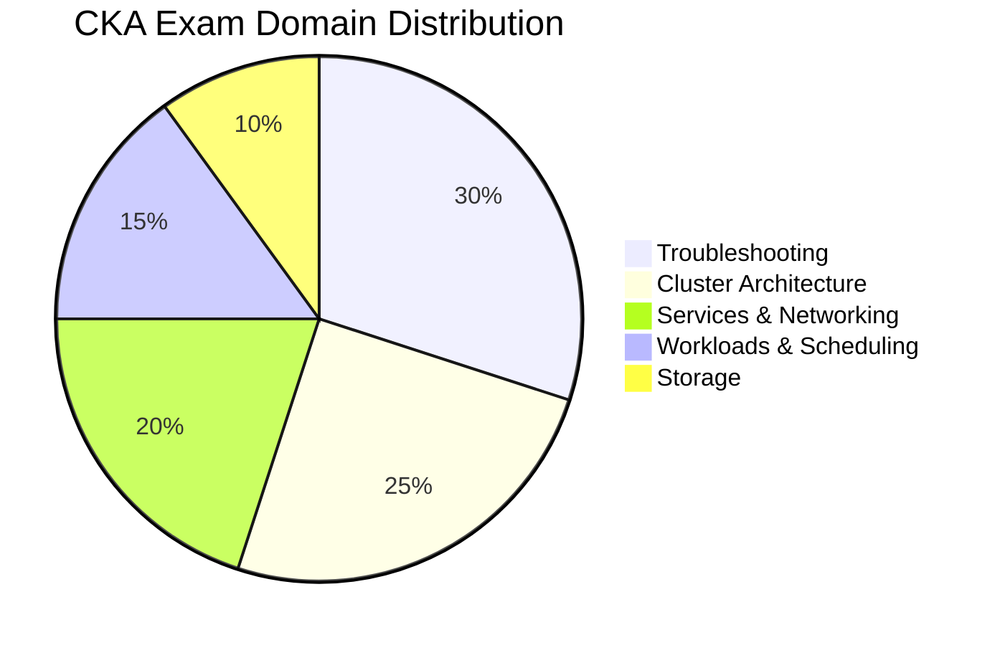
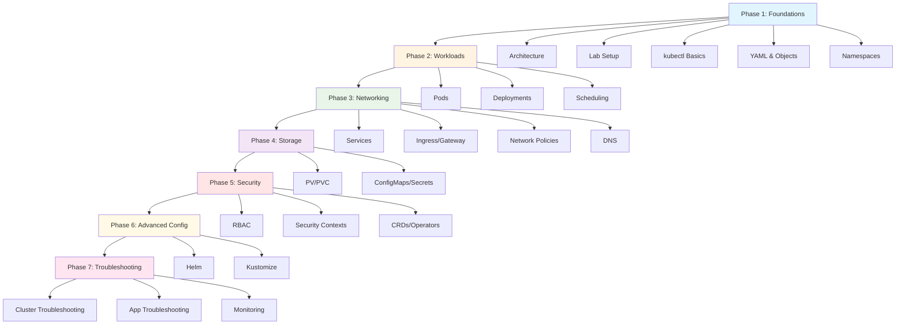

# Kubernetes CKA Mastery

**Complete hands-on guide to Kubernetes administration and CKA certification**

---

## 🎯 About the CKA Exam

The **Certified Kubernetes Administrator (CKA)** certification demonstrates proficiency in Kubernetes cluster administration, troubleshooting, and operations.

### Exam Details
- **Duration**: 2 hours
- **Format**: ~17 performance-based tasks (100% hands-on terminal work)
- **Pass Score**: 66%
- **Cost**: $445 (includes one free retake)
- **Environment**: Remote proctored, browser-based terminal

### Exam Domains & Weights

| Domain | Weight | Focus Areas |
|--------|--------|-------------|
| **Troubleshooting** | 30% | Cluster/node issues, application debugging, monitoring |
| **Cluster Architecture** | 25% | Installation, upgrades, RBAC, security, CRDs |
| **Services & Networking** | 20% | Services, Ingress, Gateway API, Network Policies |
| **Workloads & Scheduling** | 15% | Deployments, scheduling, pod configuration |
| **Storage** | 10% | PV/PVC, ConfigMaps, Secrets, StorageClasses |

---

## 📚 Learning Path

This series covers **22 comprehensive posts** organized into 7 phases, following the optimal learning sequence for CKA exam success.

---

## 🏗️ Phase 1: Foundations (5 posts)

Build your foundational knowledge of Kubernetes architecture and essential tools.

### 1. [Kubernetes Architecture Fundamentals](#)
Control plane components, worker nodes, etcd, API server, scheduler, controller manager
**Tags**: `kubernetes` `architecture` `fundamentals` `cka-prep`
**Domain**: Cluster Architecture (25%)

### 2. [Setting Up Your Kubernetes Lab Environment](#)
kubeadm, Minikube, kind, kubectl installation, kubeconfig management
**Tags**: `kubernetes` `installation` `lab-setup` `kubeadm`
**Domain**: Cluster Architecture (25%)

### 3. [kubectl Essentials: Your Kubernetes Swiss Army Knife](#)
Master kubectl commands, aliases, output formats, context switching, imperative vs declarative
**Tags**: `kubernetes` `kubectl` `cli` `basics`
**Domain**: All (foundational skill)

### 4. [Understanding Kubernetes Objects and YAML Manifests](#)
API objects, YAML syntax, metadata, spec, status, labels, annotations, selectors
**Tags**: `kubernetes` `yaml` `objects` `manifests`
**Domain**: All (foundational skill)

### 5. [Namespaces and Resource Quotas](#)
Namespace isolation, resource quotas, limit ranges, default namespace management
**Tags**: `kubernetes` `namespaces` `resource-management`
**Domain**: Cluster Architecture (25%)

---

## ⚙️ Phase 2: Workloads & Scheduling (3 posts)

Master pod management, deployments, and advanced scheduling techniques.

### 6. [Pods: The Atomic Unit of Kubernetes](#)
Pod lifecycle, init containers, sidecar patterns, multi-container communication
**Tags**: `kubernetes` `pods` `workloads` `containers`
**Domain**: Workloads & Scheduling (15%)

### 7. [Deployments, ReplicaSets, and Rolling Updates](#)
Deployments, ReplicaSets, DaemonSets, StatefulSets, rollouts, rollback strategies
**Tags**: `kubernetes` `deployments` `replicasets` `workloads`
**Domain**: Workloads & Scheduling (15%)

### 8. [Advanced Scheduling: Taints, Tolerations, and Affinity](#)
Node selectors, taints/tolerations, node/pod affinity, anti-affinity, priority classes
**Tags**: `kubernetes` `scheduling` `advanced` `affinity`
**Domain**: Workloads & Scheduling (15%)

---

## 🌐 Phase 3: Services & Networking (4 posts)

Deep dive into Kubernetes networking, service discovery, and traffic management.

### 9. [Kubernetes Services: Exposing Your Applications](#)
ClusterIP, NodePort, LoadBalancer, ExternalName, service discovery, endpoints
**Tags**: `kubernetes` `services` `networking` `service-discovery`
**Domain**: Services & Networking (20%)

### 10. [Ingress and Gateway API: Modern Traffic Management](#)
Ingress controllers, Ingress rules, Gateway API (GatewayClass, Gateway, HTTPRoute)
**Tags**: `kubernetes` `ingress` `gateway-api` `traffic-management`
**Domain**: Services & Networking (20%)

### 11. [Network Policies: Securing Pod Communication](#)
NetworkPolicy resources, ingress/egress rules, pod/namespace selectors, isolation
**Tags**: `kubernetes` `network-policies` `security` `networking`
**Domain**: Services & Networking (20%)

### 12. [CoreDNS and Service Discovery Deep Dive](#)
CoreDNS configuration, DNS for Services and Pods, troubleshooting DNS issues
**Tags**: `kubernetes` `dns` `coredns` `service-discovery`
**Domain**: Services & Networking (20%)

---

## 💾 Phase 4: Storage (2 posts)

Understand persistent storage and configuration management in Kubernetes.

### 13. [Persistent Volumes and Claims: Stateful Storage](#)
PV, PVC, StorageClass, access modes, reclaim policies, dynamic provisioning
**Tags**: `kubernetes` `storage` `persistent-volumes` `stateful`
**Domain**: Storage (10%)

### 14. [ConfigMaps, Secrets, and Volume Mounts](#)
ConfigMaps, Secrets, volume mounts, environment variables, projected volumes
**Tags**: `kubernetes` `configmaps` `secrets` `configuration`
**Domain**: Storage (10%)

---

## 🔒 Phase 5: Security & Configuration (3 posts)

Secure your cluster with RBAC, security contexts, and extensibility.

### 15. [RBAC: Role-Based Access Control](#)
Roles, ClusterRoles, RoleBindings, ClusterRoleBindings, ServiceAccounts
**Tags**: `kubernetes` `rbac` `security` `access-control`
**Domain**: Cluster Architecture (25%)

### 16. [Security Contexts and Pod Security Standards](#)
SecurityContext, Pod Security Admission, privileged containers, capabilities, PSS
**Tags**: `kubernetes` `security` `pod-security` `hardening`
**Domain**: Cluster Architecture (25%)

### 17. [Custom Resources and Operators (CRDs)](#)
CustomResourceDefinitions, custom controllers, Operators, CRD inspection
**Tags**: `kubernetes` `crds` `operators` `extensibility`
**Domain**: Cluster Architecture (25%)

---

## 🔧 Phase 6: Advanced Configuration (2 posts)

Master Helm and Kustomize for production-grade configuration management.

### 18. [Helm: Kubernetes Package Manager](#)
Helm charts, templating, values files, releases, hooks, chart repositories
**Tags**: `kubernetes` `helm` `package-management` `charts`
**Domain**: Cluster Architecture (25%)

### 19. [Kustomize: Template-Free Configuration Management](#)
Kustomize bases, overlays, patches, transformers, generators, GitOps patterns
**Tags**: `kubernetes` `kustomize` `configuration` `gitops`
**Domain**: Cluster Architecture (25%)

---

## 🔍 Phase 7: Troubleshooting & Monitoring (3 posts)

Become an expert at diagnosing and resolving Kubernetes issues.

### 20. [Troubleshooting Clusters, Nodes, and Components](#)
Node issues, control plane debugging, certificate problems, etcd health checks
**Tags**: `kubernetes` `troubleshooting` `debugging` `cluster-health`
**Domain**: Troubleshooting (30%)

### 21. [Application Troubleshooting and Log Analysis](#)
Pod debugging, container logs, exec commands, ephemeral containers, event analysis
**Tags**: `kubernetes` `troubleshooting` `logs` `debugging`
**Domain**: Troubleshooting (30%)

### 22. [Monitoring, Metrics, and Resource Management](#)
Metrics Server, resource requests/limits, HPA, VPA, monitoring stack integration
**Tags**: `kubernetes` `monitoring` `metrics` `autoscaling`
**Domain**: Troubleshooting (30%)

---

## 📖 How to Use This Series

### Recommended Study Approach

1. **Follow the Order**: Posts are sequenced for optimal learning progression
2. **Hands-On Practice**: Set up a lab environment (Post 2) and practice every command
3. **Take Notes**: Create your own command cheat sheets as you progress
4. **Review Diagrams**: Study the architecture diagrams to understand component relationships
5. **Do the Exercises**: Complete practice tasks at the end of each post
6. **Cross-Reference**: Use links between posts to review related concepts

### Study Timeline

- **Intensive**: 4-6 weeks (1 post per day)
- **Standard**: 8-12 weeks (2-3 posts per week)
- **Relaxed**: 3-4 months (1-2 posts per week)

### Exam Preparation Tips

✅ **Do**:
- Practice in a terminal environment (exam is 100% command-line)
- Use `kubectl` imperative commands for speed
- Master `kubectl explain` and `-h` flags for in-exam reference
- Time yourself on practice exercises
- Focus heavily on Troubleshooting (30% weight)

❌ **Don't**:
- Memorize YAML templates (use `kubectl` generators instead)
- Ignore troubleshooting topics (highest exam weight)
- Skip hands-on practice (reading alone is insufficient)
- Forget about time management (2 hours goes fast)

---

## 🛠️ Prerequisites

Before starting this series, you should have:

- Basic understanding of Linux command line
- Familiarity with containerization concepts (Docker)
- Access to a Linux/macOS machine or Windows with WSL2
- Willingness to practice hands-on (not just read)

---

## 🔗 Additional Resources

- [Official CKA Exam Page](https://training.linuxfoundation.org/certification/certified-kubernetes-administrator-cka/)
- [Kubernetes Official Documentation](https://kubernetes.io/docs/)
- [kubectl Command Reference](https://kubernetes.io/docs/reference/kubectl/)
- [CKA Curriculum (Official)](https://github.com/cncf/curriculum)

---

## 🚀 Ready to Start?

Begin your journey with **[Post 1: Kubernetes Architecture Fundamentals](#)** and work through the series systematically.

Good luck with your CKA certification! 🎓

---

**Last Updated**: 2025-11-10
**Series Status**: In Progress (Post 1 available)
**Total Posts**: 22 planned
